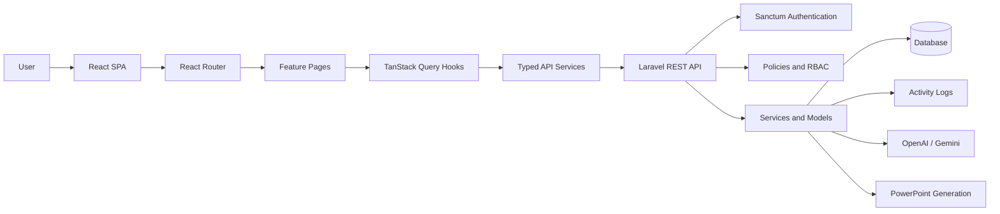
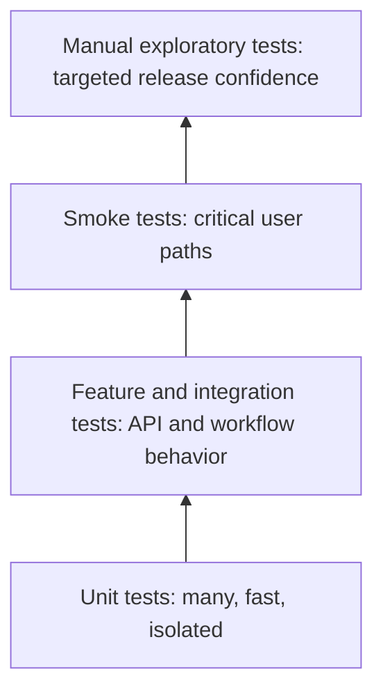
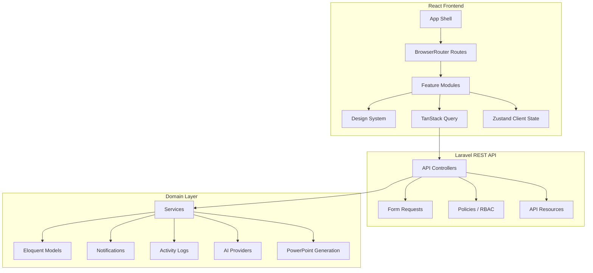

# ReportFlow Engineering Standards

<div align="center">

**Official Engineering Constitution for ReportFlow**

Enterprise SaaS Platform | Laravel | React | TypeScript | REST API | Docker Sail

</div>

| Field | Value |
| --- | --- |
| Version | 1.0.0 |
| Owner | ReportFlow Engineering Leadership |
| Last Updated | July 7, 2026 |
| Status | Approved Engineering Baseline |
| Applies To | Every contributor: employees, contractors, vendors, AI coding agents, reviewers, and maintainers |
| Scope | Backend, frontend, API, testing, documentation, security, release, operations, and AI-assisted development |

## Purpose

This document defines the engineering standards that every contributor must follow when working on ReportFlow. It is the official engineering constitution of the project. It exists to keep the product secure, maintainable, scalable, accessible, testable, and consistent as the codebase grows.

ReportFlow is an enterprise SaaS platform. It handles authentication, role-based access control, weekly reporting workflows, AI-assisted summaries, report generation, activity logs, administrative operations, and a modern React application. Enterprise users expect predictable behavior, clear permissions, reliable data, excellent performance, and professional UX. These standards protect those expectations.

These standards are mandatory. A change that violates this document is not ready to merge, regardless of whether it appears to work locally.

## Project Stack

| Layer | Standard Technology |
| --- | --- |
| Backend framework | Laravel 13 |
| Backend language | PHP 8.3 |
| API style | REST API |
| Authentication | Laravel Sanctum |
| RBAC | Spatie Permission |
| Activity audit trail | Spatie Activity Log |
| AI providers | OpenAI, Gemini |
| Report generation | PowerPoint generation services |
| Admin panel | Filament |
| Frontend runtime | React |
| Frontend language | TypeScript |
| Build tool | Vite |
| Styling | TailwindCSS |
| Server state | TanStack Query |
| Forms | React Hook Form |
| Validation | Zod |
| Client state | Zustand |
| Runtime/dev environment | Docker, Laravel Sail |

---

## 1. Engineering Principles

ReportFlow engineering is governed by a small set of durable principles. These principles are more important than local preferences. When contributors disagree on implementation details, these principles decide the direction.

### 1.1 Readability First

Code is read more often than it is written. Every file must be understandable by a competent engineer who did not write it.

Readable code:

- Uses clear names that reveal intent.
- Keeps functions and components focused.
- Avoids cleverness when clarity is better.
- Makes state transitions explicit.
- Encodes business rules in one obvious place.
- Avoids hidden side effects.

Unreadable code is technical debt even when it passes tests.

### 1.2 Maintainability Over Short-Term Speed

Fast delivery is valuable only when it does not make future delivery slower. Code must be easy to change safely.

Maintainable code:

- Has clear ownership boundaries.
- Uses stable abstractions.
- Keeps domain logic close to the domain.
- Separates transport concerns from business rules.
- Includes meaningful tests where behavior matters.
- Avoids duplication that can drift.

### 1.3 Scalability by Architecture, Not Accident

ReportFlow must scale across features, teams, and customers. Scalability means the system remains understandable and extensible as it grows.

Scalable architecture:

- Uses feature-first organization.
- Avoids global dumping grounds.
- Keeps APIs consistent.
- Treats authorization as a first-class concern.
- Uses pagination and filtering for list endpoints.
- Keeps expensive work out of request paths where possible.

### 1.4 Security Is Mandatory

Security is not a final checklist item. It is part of every design decision.

Every contributor must consider:

- Authentication state.
- Authorization and RBAC.
- Input validation.
- Output escaping.
- Data exposure boundaries.
- Auditability.
- Secrets handling.
- Abuse prevention.

A feature that leaks data or bypasses permissions is not complete.

### 1.5 Developer Experience Matters

Good developer experience reduces bugs. The project must be easy to run, inspect, test, and extend.

Contributors must preserve:

- Clear commands.
- Predictable local setup.
- Strong type checks.
- Fast feedback loops.
- Meaningful errors.
- Consistent folder structure.
- Documentation that stays current.

### 1.6 Simplicity Wins

Simple systems are easier to secure, test, debug, and operate.

Apply:

- **KISS**: keep implementation simple unless complexity is justified.
- **YAGNI**: do not build speculative features.
- **DRY**: remove harmful duplication, but do not abstract prematurely.
- **SOLID**: keep responsibilities focused and dependencies explicit.
- **Composition over inheritance**: build behavior from small parts.
- **Convention over configuration**: follow framework norms unless there is a strong reason not to.

### 1.7 Single Responsibility

Every module, class, component, hook, service, and function must have one primary reason to change.

Examples:

| Unit | Good Responsibility | Bad Responsibility |
| --- | --- | --- |
| Controller | Coordinates request validation, authorization, response | Contains business workflow logic |
| Service | Executes domain operation | Handles HTTP response formatting |
| React page | Composes feature UI and hooks | Implements reusable input primitives |
| React hook | Encapsulates data fetching or state behavior | Renders layout markup |
| API resource | Shapes response data | Performs database writes |

### 1.8 Consistency Beats Personal Preference

ReportFlow is a team-owned product. Consistency makes the system predictable.

Contributors must follow existing conventions for:

- Naming.
- Folder placement.
- API responses.
- Error handling.
- Tests.
- UI patterns.
- Styling.
- Authorization checks.

Do not introduce a new convention without documenting and justifying it.

---

## 2. Project Architecture

ReportFlow uses a feature-first architecture with strict separation between backend domain responsibilities, API transport, frontend presentation, server state, and reusable UI primitives.

### 2.1 High-Level Architecture



### 2.2 Architectural Boundaries

| Layer | Owns | Must Not Own |
| --- | --- | --- |
| Database | Persistent structure, relationships, constraints | UI decisions, request formatting |
| Eloquent models | Relationships, casts, simple helpers | HTTP responses, large workflows, presentation UI |
| Services | Business workflows, integrations, transactions | Request validation, Blade/React rendering |
| Policies | Authorization decisions | Input validation, data transformation |
| Requests | Input validation and normalization | Business workflows, persistence side effects |
| Resources | API output shape | Database writes, authorization decisions |
| Controllers | Coordination of HTTP request lifecycle | Complex business rules |
| React pages | Feature composition | Reusable design primitives |
| React hooks | Data/state behavior | Page layout ownership |
| API services | HTTP transport | React rendering, business decisions |
| Design system | Reusable UI primitives | Domain-specific business logic |

### 2.3 Feature-First Architecture

Feature code belongs under the feature it serves. Shared primitives belong in shared folders only when they are genuinely reusable.

Preferred frontend structure:

```text
resources/js/
  app/
  assets/
  components/
    layout/
    ui/
    business/
  config/
  features/
    dashboard/
    reports/
    workflow/
    employees/
    notifications/
    analytics/
    ai/
    settings/
    profile/
  hooks/
  lib/
  providers/
  routes/
  services/
  stores/
  styles/
  types/
  utils/
```

Preferred backend structure:

```text
app/
  Enums/
  Events/
  Http/
    Controllers/
      Api/
    Requests/
    Resources/
  Jobs/
  Models/
  Notifications/
  Observers/
  Policies/
  Services/
    Reports/
    AI/
```

### 2.4 Backend Responsibilities

The backend is the source of truth for:

- Authentication.
- Authorization.
- RBAC.
- Validation.
- Workflow transitions.
- Business rules.
- Data persistence.
- Audit logging.
- AI integrations.
- Report generation.
- API contracts.

The frontend must never duplicate backend business authority. It may hide disallowed actions for UX, but the backend must still enforce authorization and workflow validity.

### 2.5 Frontend Responsibilities

The frontend owns:

- Application shell and navigation.
- Responsive UI composition.
- Accessible user interactions.
- Client-side route protection.
- Typed API consumption.
- Server-state caching.
- Form UX and client-side validation.
- Loading, empty, error, and success states.
- Dark mode support.

The frontend must not invent data, bypass permissions, or create UI actions that have no backend endpoint.

### 2.6 API Responsibilities

The API owns:

- Stable resource contracts.
- Request validation.
- Pagination metadata.
- Filtering/search/sorting behavior.
- Error response shape.
- Status codes.
- Authorization enforcement.
- Idempotency decisions when relevant.

### 2.7 Database Responsibilities

The database owns:

- Data integrity.
- Required constraints.
- Foreign keys.
- Indexes.
- Cascading/null-on-delete behavior.
- Durable timestamps.

Database changes require migrations, tests, and documentation. Do not alter schema casually.

### 2.8 Allowed Folder Structures

Allowed:

```text
features/reports/pages/ReportsListPage.tsx
features/reports/hooks/useReports.ts
features/reports/components/ReportForm.tsx
features/reports/schemas/report.schema.ts
services/reports.service.ts
types/report.ts
```

Allowed:

```text
app/Http/Controllers/Api/EmployeeController.php
app/Http/Requests/StoreEmployeeRequest.php
app/Http/Resources/EmployeeResource.php
app/Policies/EmployeePolicy.php
app/Services/Reports/ReportWorkflowService.php
```

### 2.9 Forbidden Folder Structures

Forbidden:

```text
resources/js/components/MassiveReportPage.tsx
resources/js/helpers/misc.ts
resources/js/utils/apiCalls.ts
resources/js/pages/everything.tsx
app/Helpers/BusinessLogic.php
app/Http/Controllers/Api/GodController.php
```

Forbidden patterns:

- Generic dumping folders such as `misc`, `helpers`, `common2`, `new`, `old`, or `temp`.
- Feature pages placed inside global component folders.
- API calls made directly inside deeply nested presentational components.
- Business workflow transitions implemented in React without backend confirmation.
- Duplicate UI primitives inside feature folders when a design-system primitive exists.

---
## 3. Backend Standards

Backend code must follow Laravel conventions, keep business logic out of controllers, and preserve secure API behavior. The backend is authoritative for workflow, authorization, validation, and persistence.

### 3.1 PHP and Laravel Conventions

All backend code must:

- Use strict, readable PHP 8.3-compatible syntax.
- Prefer typed method parameters and return types.
- Use Laravel conventions for controllers, requests, resources, policies, events, jobs, notifications, and services.
- Use Eloquent relationships instead of manual joins unless performance requires otherwise.
- Keep side effects explicit.
- Avoid global helper functions for domain logic.
- Avoid static service calls unless the framework convention requires them.

### 3.2 Controllers

Controllers coordinate the request lifecycle. They must remain thin.

Controllers may:

- Authorize requests.
- Accept validated request objects.
- Call services or model queries.
- Return resources or JSON responses.
- Select status codes.

Controllers must not:

- Contain large business workflows.
- Perform complex data transformations.
- Contain raw SQL unless reviewed and justified.
- Manually validate request arrays when a Form Request is appropriate.
- Contain duplicated authorization logic.

Good controller shape:

```php
public function store(StoreEmployeeRequest $request): JsonResponse
{
    Gate::authorize('create', Employee::class);

    $employee = Employee::create($request->validated());

    return response()->json([
        'success' => true,
        'data' => new EmployeeResource($employee),
    ], 201);
}
```

### 3.3 Services

Services hold business operations that exceed simple CRUD.

Use services for:

- Report workflow transitions.
- AI integration.
- PowerPoint generation.
- Email/report delivery.
- Multi-model transactions.
- Notification orchestration.
- External provider communication.

Service rules:

- A service method must perform one coherent operation.
- Services should be injectable through constructors.
- Services must not read raw HTTP request data.
- Services must throw meaningful domain or validation exceptions.
- Services that mutate multiple records should use transactions when consistency matters.

### 3.4 Repositories

Repositories are optional. Do not create repositories merely because a pattern says so.

Use a repository only when:

- The query logic is complex and reused.
- The storage source may change.
- It improves testability without hiding Eloquent benefits.

Do not create repositories that simply wrap `Model::query()` with no added value.

### 3.5 Policies

Policies are mandatory for protected domain resources.

Policies must:

- Use roles and permissions consistently.
- Keep authorization logic centralized.
- Be tested through feature or authorization tests.
- Return booleans or Laravel authorization responses.

Policies must not:

- Perform database writes.
- Return API responses.
- Validate input payloads.
- Depend on frontend assumptions.

### 3.6 Form Requests

Form Requests own validation and input normalization.

Rules:

- Use `FormRequest` for create/update/list validation when endpoints accept input.
- Use `Rule::in`, `Rule::exists`, `Rule::unique`, and typed validation rules instead of ad hoc checks.
- Validate pagination and sorting query parameters.
- Keep `authorize()` simple; prefer policies in controllers unless request-level authorization is clearer.

### 3.7 API Resources

Resources own the public API shape.

Resources must:

- Return stable field names.
- Avoid exposing internal implementation details.
- Include only data the caller is authorized to see.
- Use nested structures for related user/employee summaries.
- Preserve consistent timestamp fields.

Resources must not:

- Mutate models.
- Perform expensive unbounded queries.
- Hide missing backend fields by fabricating data.

### 3.8 Enums

Enums should represent finite domain states.

Use enums for:

- Report status.
- Workflow state.
- Type-safe provider names when finite.
- Notification types when finite.

Enum rules:

- Provide labels/colors only when used across API/UI contracts.
- Keep enum transitions enforced by services.
- Do not scatter raw enum strings throughout the codebase.

### 3.9 Models

Models own relationships, casts, fillable fields, and small domain helpers.

Models may contain:

- Relationships.
- Casts.
- Accessors.
- Simple boolean helpers such as `isSubmitted()`.
- Activity log configuration.

Models must not contain:

- Large workflows.
- External API calls.
- Controller-style response code.
- Request validation.

### 3.10 Observers, Events, Notifications, and Queues

Use events and observers when side effects must react to domain changes without bloating the main operation.

Use queues for:

- Email delivery.
- AI calls when not required synchronously.
- PowerPoint generation when expensive.
- Notifications at scale.
- Long-running exports.

Queue rules:

- Jobs must be idempotent when possible.
- Jobs must define retry strategy when external providers are involved.
- Jobs must log meaningful failure context without leaking secrets.

### 3.11 Caching

Caching must be intentional.

Allowed caching:

- Expensive dashboard aggregates.
- Stable configuration-derived data.
- Provider metadata.
- Read-heavy lists with clear invalidation.

Caching rules:

- Every cache key must be named and scoped.
- Every cache must have an invalidation strategy.
- Do not cache permission-sensitive responses unless the user/role scope is part of the key.
- Do not cache secrets in application caches.

### 3.12 Validation

Every external input must be validated.

Validate:

- Body payloads.
- Query parameters.
- Route IDs through model binding.
- File uploads.
- Sorting keys.
- Pagination limits.
- Provider options.

Never trust frontend validation alone.

### 3.13 Authorization

Every protected endpoint must enforce authorization server-side.

Authorization must be checked for:

- List access.
- Detail access.
- Create/update/delete operations.
- Workflow actions.
- Export/download actions.
- Activity logs.
- User and employee profile access.

Frontend visibility is a UX layer only. Backend enforcement is mandatory.

### 3.14 Transactions

Use database transactions when an operation changes multiple records that must stay consistent.

Examples:

- Workflow transition plus audit log plus notification state.
- Employee update plus linked user update.
- Report approval plus PowerPoint metadata.

Transaction rules:

- Keep transaction scope as small as possible.
- Do not perform slow external API calls inside a transaction unless unavoidable.
- Handle failures explicitly.

### 3.15 Logging and Activity Logs

Application logs and activity logs serve different purposes.

| Type | Purpose |
| --- | --- |
| Application logs | Operational debugging and failure analysis |
| Activity logs | User-facing or audit-facing domain history |

Logging rules:

- Log errors with enough context to debug.
- Never log passwords, tokens, API keys, or sensitive personal data.
- Use Spatie Activity Log for workflow audit events.
- Keep activity descriptions stable when frontend features depend on them.

### 3.16 Backend Testing

Backend changes must include tests when behavior changes.

Required tests by change type:

| Change | Required Tests |
| --- | --- |
| New endpoint | Feature tests, authorization tests, validation tests |
| New service | Unit tests or integration tests |
| New workflow transition | Valid transition tests, invalid transition tests |
| New policy | Authorization tests |
| New validation rules | Validation tests |
| Bug fix | Regression test |

### 3.17 Backend Documentation

Backend changes must update documentation when they alter:

- API routes.
- Request payloads.
- Response payloads.
- Authorization rules.
- Environment variables.
- Background jobs.
- External provider configuration.
- Operational procedures.

---

## 4. Frontend Standards

The frontend is a React and TypeScript application built on feature-first architecture, reusable design-system primitives, typed API services, TanStack Query server state, React Hook Form, Zod, Zustand, TailwindCSS, and React Router.

### 4.1 Frontend Folder Responsibilities

| Folder | Responsibility |
| --- | --- |
| `app/` | Root application composition and top-level app component |
| `assets/` | Static frontend assets that are imported by the app |
| `components/layout/` | App shell, page container, sidebar, topbar, breadcrumb, layout primitives |
| `components/ui/` | Reusable design-system primitives with no business logic |
| `components/business/` | Reusable domain-shaped components that still receive data through props only |
| `config/` | Static frontend configuration such as navigation, theme, permissions, app metadata |
| `features/` | Feature-first modules containing pages, feature components, hooks, schemas, utilities |
| `hooks/` | Truly global reusable hooks not owned by one feature |
| `lib/` | Infrastructure utilities such as HTTP client, logger, analytics, auth storage |
| `providers/` | React context providers and provider composition |
| `routes/` | Router definition and route guards |
| `services/` | Typed API clients grouped by backend resource |
| `stores/` | Zustand stores for client-only state |
| `styles/` | Global styles and Tailwind entrypoints |
| `types/` | Shared TypeScript DTOs and domain types |
| `utils/` | Pure reusable utility functions |

### 4.2 Pages

Pages are route-level components.

Pages may:

- Compose layout, feature components, hooks, and query states.
- Set document title.
- Own route-level loading, empty, error, and permission states.
- Coordinate dialogs and page-local UI state.

Pages must not:

- Define design-system primitives.
- Make raw `fetch` calls.
- Contain duplicated table/form primitives.
- Implement backend business rules as authority.

### 4.3 Layouts

Layouts define structural consistency.

Layout components own:

- App shell.
- Guest shell.
- Sidebar.
- Topbar.
- Page container.
- Navigation zones.
- Responsive shell behavior.

Layouts must not own feature-specific data fetching.

### 4.4 Features

Each feature may contain:

```text
features/<feature>/
  components/
  hooks/
  pages/
  schemas/
  utils/
  index.ts
```

Rules:

- Feature internals should not be imported by unrelated features unless explicitly exported.
- Shared feature logic must be promoted only when at least two features need it.
- API service files remain in `services/`, not inside pages.

### 4.5 Hooks

Hooks encapsulate behavior.

Allowed hook types:

- Query hooks.
- Mutation hooks.
- UI behavior hooks.
- Feature state orchestration hooks.

Hook rules:

- Hooks must start with `use`.
- Hooks must not be called conditionally.
- Hooks must not return unstable objects unless necessary.
- Query hooks must define stable query keys.
- Mutation hooks must update or invalidate affected caches.

### 4.6 Services

Frontend services own API transport.

Service rules:

- Every API resource gets a dedicated service file.
- Services must use the shared HTTP client.
- Services must be typed.
- Services must accept `AbortSignal` where query cancellation is relevant.
- Services must not import React.
- Services must not trigger toasts or navigation.

### 4.7 Types

Types define contracts.

Type rules:

- API response types live in `types/` when shared.
- Feature-local form types may live with schemas.
- Do not duplicate backend resource fields under different names without mapping.
- If a frontend view model differs from an API DTO, define an explicit mapper.

### 4.8 Providers

Providers own cross-cutting context.

Examples:

- Auth provider.
- Query provider.
- Theme provider.
- Toast provider.

Provider rules:

- Keep providers focused.
- Keep browser-specific side effects in utilities when possible.
- Do not place feature-specific business logic in global providers.

### 4.9 Stores

Zustand stores are for client-only state.

Good store use:

- Theme preference.
- Sidebar state.
- Command palette state.
- Auth session state when required by architecture.

Bad store use:

- Server lists.
- API cache duplicates.
- Derived data already available from TanStack Query.
- Form state that React Hook Form should own.

### 4.10 Components

Components must be composable, typed, accessible, and dark-mode ready.

Component categories:

| Category | Examples | Data Source |
| --- | --- | --- |
| UI primitive | Button, Card, Modal, Input | Props only |
| Business component | EmployeeCard, ReportStatusBadge | Props only |
| Feature component | ReportForm, EmployeeReportsPanel | Props/hooks as appropriate |
| Page component | ReportsListPage | Route + hooks + composition |

### 4.11 Utilities

Utilities must be pure unless explicitly named as side-effect utilities.

Good utilities:

- `formatDate()`.
- `getEmployeeName()`.
- `buildQueryString()`.
- `cn()`.

Bad utilities:

- `doEverything()`.
- `apiHelper()` containing unrelated endpoints.
- Utilities that mutate global state unexpectedly.

---

## 5. TypeScript Rules

TypeScript strict mode is mandatory. Type safety is a product quality tool, not a preference.

### 5.1 Strict Mode

The project must keep TypeScript strict mode enabled. Contributors must not weaken TypeScript configuration to make errors disappear.

Forbidden:

- Disabling strict mode.
- Suppressing errors globally.
- Adding broad `skipLibCheck` changes without approval.
- Using type assertions to hide real mismatches.

### 5.2 No `any`

`any` is forbidden in production code unless explicitly reviewed and documented.

Use `unknown` when the type is not yet known.

Bad:

```ts
function handle(payload: any) {
  return payload.message;
}
```

Good:

```ts
function handle(payload: unknown) {
  if (typeof payload === 'object' && payload !== null && 'message' in payload) {
    return String(payload.message);
  }

  return 'Unknown message';
}
```

### 5.3 Interfaces and Types

Use `type` for unions, mapped types, and DTO composition. Use `interface` when declaration merging or object extension is genuinely beneficial.

Acceptable:

```ts
type EmployeeStatus = 'active' | 'inactive';

type Employee = {
  id: number;
  full_name: string;
};
```

### 5.4 Discriminated Unions

Use discriminated unions for state machines and finite UI states.

```ts
type LoadState<T> =
  | { status: 'loading' }
  | { status: 'error'; error: Error }
  | { status: 'success'; data: T };
```

### 5.5 Shared Types

Shared types must live in `resources/js/types` and be exported from `types/index.ts`.

Rules:

- Keep API DTO types faithful to backend responses.
- Avoid duplicate incompatible versions of the same type.
- Prefer explicit `null` when backend returns `null`.
- Do not mark required backend fields optional because a component is inconvenient.

### 5.6 DTO Mapping

When UI needs a different shape than the API, use explicit mapping.

```ts
const toEmployeeViewModel = (employee: Employee): EmployeeViewModel => ({
  id: employee.id,
  name: employee.full_name,
  status: employee.active ? 'active' : 'inactive',
});
```

Do not silently reshape data inside unrelated components.

### 5.7 Resource Mapping

Resource mapping belongs near feature utilities or service adapters, not inside UI primitives.

Rules:

- Keep formatting pure.
- Keep server state immutable.
- Avoid mutating query data directly.

---

## 6. React Rules

ReportFlow uses modern React with functional components, hooks, React Router, TanStack Query, React Hook Form, Zod, and composition.

### 6.1 Functional Components Only

Class components are not allowed in application code.

Components must be functions:

```tsx
export function EmployeeCard(props: EmployeeCardProps) {
  return <Card>{props.name}</Card>;
}
```

### 6.2 Hooks Only

State and side effects must use hooks.

Rules:

- Follow the Rules of Hooks.
- Keep effects minimal.
- Prefer derived values over effect-driven synchronization.
- Do not use effects to mirror props into state unless necessary.

### 6.3 TanStack Query Is Mandatory for Server State

Server state must use TanStack Query.

Use TanStack Query for:

- API lists.
- API detail records.
- Mutations.
- Cache invalidation.
- Optimistic updates where appropriate.

Do not store server collections in Zustand.

### 6.4 React Hook Form Is Mandatory for Forms

Forms must use React Hook Form unless the form is trivial and explicitly reviewed.

Forms must:

- Use typed form values.
- Use Zod resolver.
- Display validation errors.
- Handle backend validation errors.
- Disable or show loading state during submission.

### 6.5 Zod Is Mandatory for Client-Side Validation

Zod schemas must define form validation.

Rules:

- Keep schemas near the feature.
- Infer form value types from schemas.
- Do not duplicate validation rules in components.
- Remember backend validation remains authoritative.

### 6.6 React.lazy and Suspense

Large pages and rarely used feature areas should be code split.

Use `React.lazy` for:

- Large feature pages.
- Admin-heavy screens.
- Analytics modules.
- AI-heavy screens.

Every lazy boundary must include a meaningful fallback.

### 6.7 Memoization Strategy

Memoization is a tool, not a default.

Use `useMemo` when:

- Derived computation is expensive.
- Referential stability prevents unnecessary child work.
- Options arrays depend on query results.

Use `useCallback` when:

- Passing callbacks to memoized children.
- Stable function identity is required by a hook.

Do not memoize everything. Unnecessary memoization reduces readability.

### 6.8 Component Composition

Prefer composition over configuration-heavy components.

Good:

```tsx
<Card>
  <CardHeader>
    <CardTitle>Reports</CardTitle>
  </CardHeader>
  <CardContent>{children}</CardContent>
</Card>
```

Bad:

```tsx
<UniversalPanel mode="reports" variant="dashboard" magic />
```

---
## 7. Component Standards

Components are the building blocks of the frontend. They must be typed, accessible, reusable, and consistent with the design system.

### 7.1 Component Size Limits

| Unit | Target | Hard Limit | Action If Exceeded |
| --- | ---: | ---: | --- |
| UI primitive | 50-120 lines | 180 lines | Split variants/helpers |
| Business component | 80-180 lines | 250 lines | Extract subcomponents |
| Feature component | 100-250 lines | 350 lines | Split form/sections/actions |
| Page component | 150-350 lines | 500 lines | Extract panels/hooks/components |
| Hook | 30-120 lines | 200 lines | Split query/mutation/state logic |
| Utility file | 50-200 lines | 300 lines | Split by responsibility |

Hard limits are not goals. They are warning signs. If a file exceeds a hard limit, the pull request must explain why.

### 7.2 Naming

Use clear, specific names.

| Thing | Convention | Example |
| --- | --- | --- |
| Component | PascalCase | `EmployeeDetailsPage` |
| Hook | camelCase starting with `use` | `useEmployeeQuery` |
| Service file | resource.service.ts | `employees.service.ts` |
| Schema file | resource.schema.ts | `employee.schema.ts` |
| Utility file | resource-utils.ts | `employee-utils.ts` |
| Type file | singular domain name | `employee.ts` |
| Test file | behavior or resource name | `EmployeeApiTest.php` |

### 7.3 Props Rules

Props must be typed and intentional.

Rules:

- Prefer explicit props over large generic objects.
- Avoid passing raw API responses deeply when only a few fields are needed.
- Use `ReactNode` for slots.
- Use callback props for actions.
- Do not mutate props.
- Do not use boolean prop explosions for complex modes.

Bad:

```tsx
<EmployeeCard data={everything} admin compact editable deletable special />
```

Good:

```tsx
<EmployeeCard
  name={employee.full_name}
  email={employee.email}
  status={employee.active ? 'active' : 'inactive'}
  actions={<EmployeeActions employee={employee} />}
/>
```

### 7.4 Accessibility

Every component must support accessibility by default.

Required:

- Semantic HTML.
- Keyboard navigation.
- Visible focus states.
- Labels for inputs.
- `aria-*` only when semantic HTML is insufficient.
- Proper dialog roles.
- `aria-live` for async feedback where needed.

Forbidden:

- Clickable `div` without keyboard support.
- Icon-only buttons without `aria-label`.
- Removing focus outlines without replacement.
- Color-only meaning.
- Modal dialogs that cannot close with Escape.

### 7.5 Reusability

A component is reusable when it:

- Accepts data through props.
- Does not own unrelated API calls.
- Does not depend on a specific page path unless it is a page component.
- Uses design tokens instead of hard-coded theme values.
- Supports dark mode.

### 7.6 Design-System Compliance

Use existing UI primitives before creating new ones.

Before adding a new primitive, contributors must verify that existing components do not already solve the problem:

- Button.
- IconButton.
- Card.
- Badge.
- Avatar.
- Input.
- Textarea.
- Select.
- Checkbox.
- Switch.
- Modal/Dialog/Drawer.
- Dropdown/Tooltip/Tabs.
- Alert/Toast.
- Spinner/Skeleton/LoadingOverlay.
- EmptyState.
- Table/Pagination.

Do not import external UI libraries unless the architecture is formally updated.

---

## 8. UI / UX Standards

ReportFlow must feel like a polished enterprise product. Every screen must handle real-world data, permissions, devices, errors, and loading behavior.

### 8.1 Responsive First

All pages must support:

| Viewport | Requirement |
| --- | --- |
| Mobile | Primary actions accessible, no horizontal overflow, readable cards/lists |
| Tablet | Efficient use of space, responsive grids, touch-friendly controls |
| Desktop | Dense but readable layouts, tables where appropriate, sidebar/topbar integration |

Do not build desktop-only pages.

### 8.2 Dark Mode Mandatory

Every component and page must support dark mode.

Rules:

- Use design tokens.
- Avoid hard-coded colors.
- Verify contrast in light and dark themes.
- Use semantic token names such as `surface`, `foreground`, `muted`, `primary`, `danger`.

### 8.3 Loading States

Every async page must show loading UI.

Acceptable loading states:

- Skeletons for page sections.
- Spinner for small inline actions.
- Loading overlay for blocking operations.
- Disabled submit buttons with loading state.

Do not show blank pages while data loads.

### 8.4 Empty States

Every list and dashboard section must define an empty state.

An empty state must explain:

- What is missing.
- Why it may be missing.
- What the user can do next when applicable.

### 8.5 Error States

Every API failure must produce a visible error state.

Error states must:

- Use the Alert or EmptyState pattern.
- Preserve navigation when possible.
- Avoid leaking internal stack traces.
- Explain what failed.
- Offer retry or navigation where appropriate.

### 8.6 Success Feedback

Mutations must provide success feedback.

Examples:

- Report submitted.
- Employee updated.
- Workflow action completed.
- Settings saved.

Use toast notifications or inline status messages consistently.

### 8.7 Confirmation Dialogs

Destructive and workflow-changing actions require confirmation.

Require confirmation for:

- Delete.
- Submit report.
- Approve report.
- Final approve report.
- Reject report.
- Any irreversible state transition.

Confirmation dialogs must state what will happen.

### 8.8 Animations

Animations must be subtle, purposeful, and accessible.

Rules:

- Respect reduced motion where supported.
- Avoid long blocking animations.
- Use motion to clarify state changes, not distract.
- Do not animate critical data in a way that harms readability.

### 8.9 Keyboard Navigation

All interactive flows must be keyboard usable.

Required:

- Tab order follows visual order.
- Buttons are actual `button` elements.
- Links are actual anchors when navigating externally.
- Modals trap focus or focus the dialog appropriately.
- Escape closes dismissible dialogs.

### 8.10 WCAG Accessibility

ReportFlow targets WCAG 2.2 AA as the baseline.

Required practices:

- Sufficient color contrast.
- Text alternatives for icons/images.
- Semantic headings.
- Form labels and errors.
- Keyboard support.
- Non-color indicators for status.
- Accessible loading and notification regions.

---

## 9. API Standards

ReportFlow APIs are RESTful JSON endpoints protected by Sanctum unless explicitly public.

### 9.1 REST Conventions

Use resource-oriented endpoints.

| Operation | Method | Pattern |
| --- | --- | --- |
| List | GET | `/api/resources` |
| Detail | GET | `/api/resources/{resource}` |
| Create | POST | `/api/resources` |
| Update | PUT/PATCH | `/api/resources/{resource}` |
| Delete | DELETE | `/api/resources/{resource}` |
| Subresource | GET | `/api/resources/{resource}/children` |
| Action | POST | `/api/reports/{report}/submit` |

Actions are allowed for domain transitions that are not CRUD.

### 9.2 Response Shape

Successful responses should include `success: true`.

List response:

```json
{
  "success": true,
  "data": [],
  "meta": {
    "current_page": 1,
    "last_page": 1,
    "per_page": 15,
    "total": 0
  }
}
```

Detail response:

```json
{
  "success": true,
  "data": {}
}
```

Mutation response:

```json
{
  "success": true,
  "message": "Resource updated successfully.",
  "data": {}
}
```

### 9.3 Pagination

List endpoints must support pagination when data can grow.

Rules:

- Default `per_page` should be reasonable.
- Maximum `per_page` must be enforced.
- Metadata must include current page, last page, per page, and total.
- Frontend must use metadata, not infer pagination from data length.

### 9.4 Filtering

Filters must be explicit and documented.

Examples:

- `department=IT`.
- `active=1`.
- `status=submitted`.

Validate filter values. Unknown filters should either be ignored by documented policy or rejected consistently.

### 9.5 Sorting

Sorting keys must be allowlisted.

Rules:

- Never pass raw sort fields directly to SQL without validation.
- Support `direction=asc|desc` or `sort=-created_at` consistently.
- Document supported sort keys.

### 9.6 Searching

Search must be bounded and safe.

Rules:

- Validate search length.
- Search across documented fields only.
- Avoid expensive unindexed full-table scans for large datasets.
- Add indexes or search infrastructure when data volume requires it.

### 9.7 Error Format

Validation errors must use Laravel's standard JSON validation shape.

```json
{
  "message": "The given data was invalid.",
  "errors": {
    "email": ["The email field is required."]
  }
}
```

API clients must surface backend validation errors near form fields.

### 9.8 Status Codes

| Code | Use |
| --- | --- |
| 200 | Successful read/update/delete response with body |
| 201 | Resource created |
| 204 | Successful response with no body |
| 400 | Bad request when validation is not field-specific |
| 401 | Unauthenticated |
| 403 | Authenticated but forbidden |
| 404 | Resource not found |
| 409 | Conflict |
| 422 | Validation or invalid workflow state |
| 429 | Rate limited |
| 500 | Unexpected server error |

### 9.9 Versioning

The current API is unversioned. If breaking changes become necessary, introduce explicit versioning before breaking clients.

Preferred future pattern:

```text
/api/v1/reports
/api/v1/employees
```

Breaking changes require migration documentation and rollout planning.

---

## 10. Security Standards

Security standards apply to every change.

### 10.1 Authentication

ReportFlow uses Sanctum bearer tokens for API authentication.

Rules:

- Protected routes must use Sanctum middleware.
- Tokens must be stored according to approved auth architecture.
- Logout must clear local auth state and invalidate backend tokens where supported.
- Do not expose tokens in logs, URLs, or error messages.

### 10.2 Authorization and RBAC

RBAC is enforced with Spatie Permission and Laravel policies.

Rules:

- Backend policies decide access.
- Frontend hides forbidden actions for UX.
- Never rely on frontend-only authorization.
- Every destructive or sensitive endpoint must have authorization tests.

### 10.3 Validation

All input must be validated server-side.

Validation must cover:

- Required fields.
- Type constraints.
- Length limits.
- Enum values.
- Existing IDs.
- Unique constraints.
- File type and size.
- Query parameters.

### 10.4 XSS Prevention

React escapes text by default. Do not bypass it casually.

Forbidden:

- `dangerouslySetInnerHTML` without security review.
- Rendering untrusted HTML from API or AI providers.
- Injecting user content into scripts.

If rich text is required, sanitize with an approved sanitizer.

### 10.5 CSRF

For Sanctum SPA flows, CSRF strategy must follow Laravel Sanctum documentation. Bearer token API requests must still avoid unsafe token exposure.

### 10.6 SQL Injection

Use Eloquent and query builder bindings. Never concatenate untrusted input into SQL.

Bad:

```php
Employee::whereRaw("department = '$department'")->get();
```

Good:

```php
Employee::where('department', $department)->get();
```

### 10.7 Mass Assignment

Models must define fillable fields intentionally.

Rules:

- Never blindly persist `$request->all()`.
- Use `$request->validated()`.
- Keep `$fillable` narrow.
- Review new fillable fields for security impact.

### 10.8 Secrets Management

Secrets must live in environment variables or approved secret stores.

Forbidden:

- API keys committed to Git.
- Secrets in frontend bundles.
- Tokens in screenshots, logs, docs, or tests.
- Real customer data in fixtures.

### 10.9 Rate Limiting

Public and sensitive endpoints should be rate limited.

Rate-limit candidates:

- Login.
- AI endpoints.
- Export endpoints.
- Report generation.
- Password or account recovery.

### 10.10 AI Security

AI integrations must treat model output as untrusted.

Rules:

- Validate and sanitize AI output before display or persistence.
- Never send secrets to AI providers.
- Avoid sending more customer data than needed.
- Log provider failures without logging sensitive prompt data.
- Document provider-specific behavior.

---

## 11. Performance Standards

Performance is a product requirement. Enterprise users should not wait because the system is careless with payloads, bundles, queries, or rendering.

### 11.1 Code Splitting

Large frontend modules must be candidates for route-level code splitting.

Use dynamic imports for:

- Analytics.
- AI screens.
- Heavy report generation views.
- Rare admin flows.

### 11.2 Bundle Optimization

Rules:

- Avoid unnecessary dependencies.
- Prefer native browser APIs when sufficient.
- Do not import entire icon sets.
- Keep design-system primitives tree-shakeable.
- Review Vite bundle warnings.

### 11.3 Caching

Use TanStack Query caching for server state.

Rules:

- Query keys must include filters and pagination.
- Mutations must invalidate affected queries.
- Optimistic updates must include rollback behavior.
- Do not over-cache permission-sensitive data.

### 11.4 Memoization

Use memoization for expensive derived UI, not as decoration.

Examples:

- Filtering current page rows by client-only role filter.
- Building select options from query data.
- Formatting large chart datasets.

### 11.5 Image Optimization

Rules:

- Use appropriately sized images.
- Avoid unoptimized large images in bundles.
- Prefer SVG for icons when already part of the system.
- Provide alt text when images convey meaning.

### 11.6 Network Optimization

Rules:

- Use pagination for growing lists.
- Avoid waterfall requests when one endpoint can return detail context.
- Use cancellation with `AbortSignal` for query requests.
- Avoid polling unless required and documented.
- Keep API payloads scoped to the screen's needs.

### 11.7 Database Optimization

Backend list endpoints must avoid common performance traps.

Rules:

- Prevent N+1 queries with eager loading.
- Add indexes for frequent filters and sorts.
- Use pagination.
- Use aggregate queries intentionally.
- Avoid loading entire tables for dashboard metrics.

---
## 12. Git Standards

Git history is part of the engineering record. It must be understandable, reviewable, and revertible.

### 12.1 Branch Naming

Use descriptive branch names.

| Type | Pattern | Example |
| --- | --- | --- |
| Feature | `feature/<scope>-<summary>` | `feature/employees-module` |
| Fix | `fix/<scope>-<summary>` | `fix/report-submit-validation` |
| Chore | `chore/<summary>` | `chore/update-docs` |
| Refactor | `refactor/<scope>-<summary>` | `refactor/report-query-hooks` |
| Hotfix | `hotfix/<summary>` | `hotfix/auth-token-refresh` |

Avoid names such as `changes`, `final`, `new-work`, `fix2`, or `temp`.

### 12.2 Commit Naming

Use clear commit messages.

Preferred format:

```text
type(scope): summary
```

Examples:

```text
feat(employees): add paginated employee API
fix(workflow): hide submit action for non-draft reports
docs(engineering): add frontend architecture ADR
test(reports): cover report validation errors
```

Allowed types:

- `feat`.
- `fix`.
- `docs`.
- `test`.
- `refactor`.
- `perf`.
- `chore`.
- `build`.
- `ci`.

### 12.3 Pull Request Rules

Every pull request must include:

- Clear summary.
- Scope of changes.
- Screenshots for UI changes when possible.
- API endpoints changed or consumed.
- Tests run.
- Known risks.
- Rollback notes for risky changes.

Pull requests must be focused. Do not mix unrelated backend, frontend, formatting, and documentation changes unless the sprint explicitly requires it.

### 12.4 Review Process

Reviewers must check:

- Requirements alignment.
- Architecture compliance.
- Security and authorization.
- Type safety.
- Test coverage.
- UX states.
- Error handling.
- Accessibility.
- Documentation updates.

A reviewer may block a change for violating this standards document.

### 12.5 Merge Strategy

The preferred merge strategy is squash merge for feature branches unless the repository maintainers choose otherwise.

Rules:

- Main branch must remain deployable.
- Do not merge failing builds.
- Do not merge with unresolved review comments.
- Do not merge undocumented breaking changes.

### 12.6 Version Tagging

Release tags should be semantic and traceable.

Pattern:

```text
vMAJOR.MINOR.PATCH
```

Examples:

- `v1.0.0`.
- `v1.1.0`.
- `v1.1.1`.

### 12.7 Release Workflow

Release workflow must include:

1. Feature freeze.
2. Full test suite.
3. Build verification.
4. Migration review.
5. Environment variable review.
6. Release notes.
7. Deployment plan.
8. Rollback plan.
9. Production smoke test.

---

## 13. Testing Standards

Testing is required for confidence. Tests must verify behavior, not implementation trivia.

### 13.1 Test Pyramid



### 13.2 PHPUnit

Backend behavior must be covered with PHPUnit.

Required backend tests:

- Feature tests for endpoints.
- Authorization tests for protected resources.
- Validation tests for request rules.
- Unit tests for services and enums.
- Regression tests for fixed bugs.

### 13.3 Feature Tests

Feature tests must cover:

- Successful request.
- Unauthorized guest request.
- Forbidden role request.
- Validation errors.
- Not found behavior where relevant.
- Database persistence for mutations.

### 13.4 Unit Tests

Unit tests are appropriate for:

- Enums.
- Pure services.
- Calculation utilities.
- Isolated workflow rules.
- DTO mappers.

Avoid unit tests that mock so much that they no longer prove real behavior.

### 13.5 React Testing

Frontend tests should cover behavior that is expensive to verify manually or likely to regress.

Candidates:

- Route guards.
- Permission-based action visibility.
- Form validation.
- Query error states.
- Empty states.
- Component accessibility.

### 13.6 Integration Tests

Integration tests should verify that layers work together.

Examples:

- Form submits to API service correctly.
- Mutation invalidates query cache.
- Workflow action refreshes affected views.
- Authenticated API client attaches token.

### 13.7 Smoke Tests

Smoke tests verify that the application boots and critical flows are usable.

Minimum smoke coverage:

- Login.
- Dashboard load.
- Reports list load.
- Report detail load.
- Workflow page load.
- Employees list load.

### 13.8 Regression Tests

Every production bug fix must include a regression test when technically feasible.

A regression test should fail before the fix and pass after the fix.

### 13.9 Coverage Goals

Coverage goals are directional, not a substitute for judgment.

| Area | Goal |
| --- | ---: |
| Critical backend services | 90%+ meaningful coverage |
| API feature behavior | 80%+ meaningful coverage |
| Policies/authorization | High coverage for protected resources |
| Frontend forms | Key validation and submit paths covered |
| Design-system primitives | Accessibility and variant smoke coverage |

### 13.10 Test Quality Rules

Tests must be:

- Deterministic.
- Isolated.
- Meaningfully named.
- Focused on behavior.
- Free of real external provider calls unless explicitly integration-tested.

Forbidden:

- Tests that depend on execution order.
- Tests that require real production secrets.
- Tests that assert implementation details unnecessarily.
- Skipping failing tests without documentation and approval.

---

## 14. Documentation Standards

Documentation is part of the product. Undocumented behavior becomes tribal knowledge and slows the team.

### 14.1 Required Documentation Updates

Every sprint must update relevant documentation.

Required when applicable:

- `CHANGELOG`.
- `ROADMAP`.
- API docs.
- Engineering docs.
- Release docs.
- Local development docs.
- Environment variable docs.
- Architecture decision records.

### 14.2 API Documentation

API docs must include:

- Endpoint method and path.
- Authentication requirement.
- Authorization behavior.
- Query parameters.
- Request payload.
- Response shape.
- Validation errors.
- Status codes.

### 14.3 Engineering Documentation

Engineering docs must explain:

- Why the architecture exists.
- How contributors should extend it.
- Which conventions are mandatory.
- Which trade-offs were accepted.
- Which risks remain.

### 14.4 Release Documentation

Release docs must include:

- Features included.
- Fixes included.
- Breaking changes.
- Migration steps.
- Environment changes.
- Rollback instructions.
- Known limitations.

### 14.5 Documentation Quality

Good documentation is:

- Accurate.
- Specific.
- Maintained with code changes.
- Easy to scan.
- Written for future contributors.

Bad documentation is:

- Outdated.
- Vague.
- Aspirational but not true.
- Missing commands.
- Missing ownership.

---

## 15. AI Contribution Rules

AI tools may contribute to ReportFlow, but they must follow the same standards as human contributors. AI-generated code is not exempt from review, tests, security, or architecture.

### 15.1 Supported AI Contributors

These rules apply to:

- Claude Code.
- Codex.
- ChatGPT.
- Gemini.
- Any other AI coding assistant or agent.

### 15.2 General AI Rules

AI contributors must:

- Inspect existing code before editing.
- Follow repository conventions.
- Respect backend/frontend boundaries.
- Keep changes scoped to the requested task.
- Run required validation commands when asked.
- Report commands executed and results.
- Explain blockers honestly.
- Stop when instructed.

### 15.3 AI Must Never

AI must never:

- Invent APIs.
- Mock production data when backend data is required.
- Duplicate existing components.
- Ignore build failures.
- Ignore TypeScript errors.
- Ignore PHPStan errors.
- Create dead code.
- Leave undocumented TODOs.
- Modify unrelated backend code.
- Modify database schema without explicit approval.
- Change routes without explicit approval when a task forbids it.
- Suppress errors instead of fixing root causes.
- Fabricate test results.
- Claim screenshots or validation were completed when they were not.

### 15.4 AI Backend Rules

AI working on backend must:

- Use Form Requests for validation.
- Use policies for authorization.
- Use resources for response shape.
- Add feature/authorization/validation tests for endpoints.
- Avoid schema changes unless explicitly requested.
- Avoid changing existing tests unless explicitly requested.

### 15.5 AI Frontend Rules

AI working on frontend must:

- Use existing design-system primitives.
- Use feature-first structure.
- Use TanStack Query for server data.
- Use React Hook Form and Zod for forms.
- Use Zustand only for client state.
- Avoid creating business pages when the sprint forbids them.
- Avoid fake data when real API integration is required.
- Respect route and API contracts.

### 15.6 AI Blocker Protocol

When blocked, AI must:

1. State the blocker clearly.
2. Identify the evidence.
3. Avoid workarounds that violate requirements.
4. Suggest the minimum safe unblocking action.
5. Stop if continuing would require forbidden changes.

Example:

```text
Blocked: Employees frontend cannot be implemented because /api/employees does not exist.
Evidence: php artisan route:list shows no employees routes.
Safe unblock: implement Employees REST API or approve a reduced scope.
```

---

## 16. Definition of Done

A feature is done only when every applicable item is complete.

### 16.1 Feature Definition of Done

| Requirement | Required |
| --- | --- |
| Business requirements completed | Yes |
| Responsive on desktop/tablet/mobile | Yes |
| Accessible keyboard behavior | Yes |
| Dark mode ready | Yes |
| Loading states | Yes |
| Empty states | Yes |
| Error states | Yes |
| Success feedback | Yes |
| Confirmation dialogs for destructive/workflow actions | Yes |
| TypeScript passes | Yes |
| Build passes | Yes |
| Backend tests pass when backend changed | Yes |
| Frontend tests pass when frontend tests exist | Yes |
| API documented when changed | Yes |
| Engineering docs updated when architecture changes | Yes |
| No critical bugs | Yes |
| No console errors | Yes |
| No duplicated logic/components | Yes |
| No unauthorized data exposure | Yes |

### 16.2 Not Done Examples

A feature is not done if:

- It works only with mock data when real API data is required.
- It renders actions the backend forbids.
- It lacks loading/error/empty states.
- It has TypeScript errors.
- It has failing tests.
- It bypasses architecture conventions.
- It creates duplicated UI primitives.
- It changes unrelated code.
- It lacks required documentation.

---

## 17. Release Requirements

Release quality must be deliberate. A release is not just a successful build.

### 17.1 Before Release Candidate

Before declaring a release candidate:

- All planned sprint scope is complete.
- Full test suite passes.
- Frontend typecheck passes.
- Frontend production build passes.
- Backend route list is reviewed when APIs changed.
- Migrations are reviewed.
- API docs are updated.
- Changelog is updated.
- Known risks are documented.
- Product owner accepts feature scope.

### 17.2 Before Production

Before production deployment:

- Release candidate is approved.
- Production environment variables are verified.
- Database backup/rollback plan exists.
- Migration plan is reviewed.
- Queue workers are configured.
- External provider keys are present.
- Smoke test checklist is ready.
- Monitoring/logging is available.

### 17.3 Rollback Strategy

Every release must have a rollback strategy.

Rollback plan must include:

- Application rollback method.
- Database rollback or forward-fix plan.
- Cache clearing strategy.
- Queue handling strategy.
- User impact statement.

### 17.4 Deployment Validation

After deployment, validate:

- App loads.
- Login works.
- Dashboard loads.
- Reports API works.
- Workflow actions work for authorized users.
- Employees API works for authorized users.
- Logs show no critical errors.
- Background workers are healthy.

---

## 18. Engineering Checklist

Use this checklist before every merge.

### 18.1 Scope and Architecture

- [ ] Change matches the requested scope.
- [ ] No unrelated files were modified.
- [ ] Feature-first architecture is preserved.
- [ ] No forbidden folder structures were introduced.
- [ ] Existing reusable components were reused where appropriate.
- [ ] No speculative abstractions were introduced.

### 18.2 Backend Checklist

- [ ] Controllers are thin.
- [ ] Business logic is in services when appropriate.
- [ ] Requests validate input.
- [ ] Policies enforce authorization.
- [ ] Resources define API responses.
- [ ] List endpoints paginate.
- [ ] Filters and sorts are validated.
- [ ] Mutations use transactions when needed.
- [ ] Activity logs are used for auditable domain events.
- [ ] No secrets or sensitive data are logged.

### 18.3 Frontend Checklist

- [ ] Pages use App Shell and layout primitives.
- [ ] Design-system primitives are reused.
- [ ] Server data uses TanStack Query.
- [ ] Forms use React Hook Form and Zod.
- [ ] Client-only state uses Zustand only when appropriate.
- [ ] Loading states exist.
- [ ] Empty states exist.
- [ ] Error states exist.
- [ ] Success feedback exists for mutations.
- [ ] Forbidden actions are hidden based on permissions/roles.
- [ ] Backend still enforces all permissions.

### 18.4 Type Safety Checklist

- [ ] TypeScript strict mode passes.
- [ ] No `any` was introduced.
- [ ] API DTOs are typed.
- [ ] Form values are typed from schemas.
- [ ] Nullable backend fields are handled.
- [ ] Type assertions are justified and minimal.

### 18.5 UI/UX Checklist

- [ ] Mobile layout works.
- [ ] Tablet layout works.
- [ ] Desktop layout works.
- [ ] Dark mode works.
- [ ] Keyboard navigation works.
- [ ] Focus states are visible.
- [ ] Dialogs are accessible.
- [ ] Color is not the only status indicator.
- [ ] No horizontal overflow.

### 18.6 Security Checklist

- [ ] Endpoint is protected when required.
- [ ] Authorization tests exist for protected resources.
- [ ] Input is validated server-side.
- [ ] No mass-assignment risk was introduced.
- [ ] No XSS risk was introduced.
- [ ] No SQL injection risk was introduced.
- [ ] No secrets were committed.
- [ ] Sensitive data exposure was reviewed.

### 18.7 Testing Checklist

- [ ] Relevant unit tests pass.
- [ ] Relevant feature tests pass.
- [ ] Full backend tests pass when backend changed.
- [ ] Frontend typecheck passes when frontend changed.
- [ ] Frontend build passes when frontend changed.
- [ ] Regression tests were added for bug fixes.

### 18.8 Documentation Checklist

- [ ] API docs updated when endpoints changed.
- [ ] Engineering docs updated when architecture changed.
- [ ] Local development docs updated when commands changed.
- [ ] Changelog updated when required.
- [ ] Release notes updated when required.

### 18.9 AI Contributor Checklist

- [ ] Existing code was inspected before changes.
- [ ] No APIs were invented.
- [ ] No production mock data was introduced.
- [ ] No build/test failures were ignored.
- [ ] No dead code was left behind.
- [ ] No undocumented TODOs were left behind.
- [ ] Final report includes files changed, commands run, results, and limitations.

---

## Appendix A: Architecture Summary



## Appendix B: Contributor Oath

Every contributor to ReportFlow agrees to the following:

> I will keep ReportFlow secure, maintainable, accessible, tested, documented, and consistent. I will not trade long-term product health for short-term convenience. I will respect the architecture, protect user data, verify my work, and leave the codebase better than I found it.

---

**End of ReportFlow Engineering Standards**
