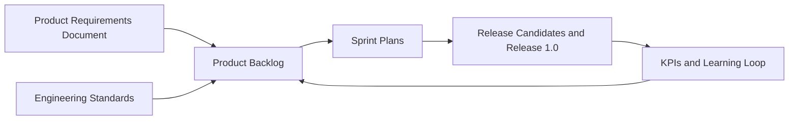
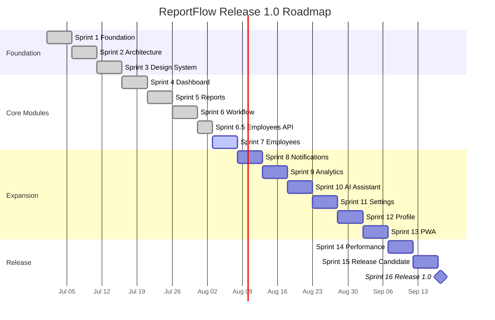
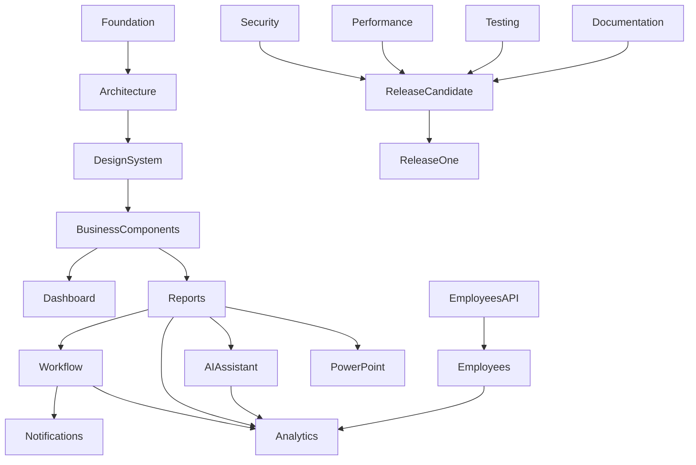

# ReportFlow Product Backlog

## Professional Cover Page

| Field | Value |
| --- | --- |
| Product | ReportFlow |
| Document | Product Backlog |
| Document Type | Enterprise SaaS Master Backlog |
| Version | 1.0.0 |
| Owner | Product Management Office |
| Executive Sponsor | CTO / Product Leadership |
| Status | Active Master Backlog |
| Last Updated | 2026-07-07 |
| Primary Audience | Product, Engineering, Design, QA, Security, Operations, Leadership |
| Source of Truth | Product Requirements Document, Engineering Standards, Release 1.0 readiness criteria |
| Local Development URL | http://localhost:8081 |

## Document Control

| Attribute | Value |
| --- | --- |
| Backlog Method | Scrum with product roadmap governance |
| Estimation Method | Fibonacci story points: 1, 2, 3, 5, 8, 13, 21 |
| Priority Model | Critical, High, Medium, Low plus MoSCoW classification |
| Tracking Style | Jira-like epics, features, stories, tasks, risks, releases, dependencies |
| Engineering Gate | ReportFlow Engineering Standards Definition of Done |
| Release Gate | Release 1.0 readiness dashboard and checklist in this document |

## Revision History

| Version | Date | Author | Description | Status |
| --- | --- | --- | --- | --- |
| 1.0.0 | 2026-07-07 | Principal Product Management / Codex | Initial enterprise-grade master product backlog aligned with PRD and engineering standards. | Active |

## Approval Table

| Role | Name | Approval Status | Date | Notes |
| --- | --- | --- | --- | --- |
| Product Owner | TBD | Pending | TBD | Owns backlog priority and release scope. |
| CTO | TBD | Pending | TBD | Owns technical feasibility and release readiness. |
| Engineering Lead | TBD | Pending | TBD | Owns engineering delivery plan. |
| QA Lead | TBD | Pending | TBD | Owns test strategy and release validation. |
| Security Owner | TBD | Pending | TBD | Owns security, RBAC, and data protection review. |
| Operations Lead | TBD | Pending | TBD | Owns deployment and operational acceptance. |

## Table of Contents

1. [Product Vision Summary](#1-product-vision-summary)
2. [Agile Methodology](#2-agile-methodology)
3. [Product Roadmap](#3-product-roadmap)
4. [Epic Overview](#4-epic-overview)
5. [Complete Epic Breakdown](#5-complete-epic-breakdown)
6. [Features](#6-features)
7. [User Stories](#7-user-stories)
8. [Technical Tasks](#8-technical-tasks)
9. [Sprint Planning](#9-sprint-planning)
10. [Story Point Estimation](#10-story-point-estimation)
11. [Priority Matrix](#11-priority-matrix)
12. [Dependency Matrix](#12-dependency-matrix)
13. [Risk Register](#13-risk-register)
14. [Release Planning](#14-release-planning)
15. [KPI Tracking](#15-kpi-tracking)
16. [Technical Debt](#16-technical-debt)
17. [Known Issues](#17-known-issues)
18. [Future Ideas](#18-future-ideas)
19. [Release Readiness Dashboard](#19-release-readiness-dashboard)
20. [Appendix](#20-appendix)

---

# 1. Product Vision Summary

ReportFlow is an enterprise SaaS platform for structured weekly reporting, approval workflows, employee visibility, operational analytics, AI-assisted reporting, PowerPoint generation, activity logs, and future enterprise integrations. The product exists to reduce reporting friction, improve accountability, standardize operational visibility, and give managers and executives trustworthy reporting data for timely decisions.

This backlog is the execution companion to the Product Requirements Document. It translates the PRD into epics, features, user stories, implementation tasks, sprint plans, dependencies, risks, release gates, success metrics, and future product opportunities. It is intended to remain the master planning artifact until Release 1.0 and beyond.

| Product Principle | Backlog Interpretation |
| --- | --- |
| Backend authority | Stories must consume existing APIs and respect Laravel validation, policies, workflow, and RBAC. |
| Frontend scalability | Stories must preserve React feature-first architecture, strict TypeScript, TanStack Query, Zustand, React Hook Form, Zod, and design system reuse. |
| No production mocks | Business modules must use backend data; mock data is not acceptable for production features. |
| Enterprise quality | Every story inherits accessibility, responsiveness, dark mode, error states, security, and documentation expectations. |
| Release discipline | Work is not complete until it satisfies Engineering Standards Definition of Done and Release 1.0 readiness gates. |

# 2. Agile Methodology

ReportFlow delivery uses Scrum with enterprise-grade product governance. Scrum ceremonies drive delivery cadence while product, engineering, security, and release gates preserve quality.

## 2.1 Scrum

| Scrum Element | ReportFlow Practice |
| --- | --- |
| Product Backlog | Single ordered list of epics, features, stories, tasks, dependencies, risks, and release gates. |
| Sprint Backlog | Sprint-specific selection of ready stories committed by the delivery team. |
| Increment | Working, integrated, tested product slice meeting Definition of Done. |
| Product Owner | Owns priority, acceptance, and business value. |
| Scrum Master | Facilitates process, removes impediments, and protects sprint focus. |
| Development Team | Owns technical execution, quality, and implementation discipline. |
| Stakeholders | Review increments, provide feedback, and approve release scope. |

## 2.2 Sprint Duration

| Attribute | Decision |
| --- | --- |
| Default sprint length | 1 week during rapid foundation and module delivery; 2 weeks may be used for stabilization. |
| Sprint cadence | Planning at start, daily sync, review and retrospective at end. |
| Scope policy | Sprint scope may be adjusted only by Product Owner and Engineering Lead agreement. |
| Quality policy | Quality gates cannot be traded away to increase scope. |

## 2.3 Definition of Ready

- [ ] Story has clear user value.
- [ ] Story references the relevant epic and feature.
- [ ] Dependencies are known or explicitly marked as blockers.
- [ ] Acceptance criteria are testable.
- [ ] Backend API contract is known or an API task is included.
- [ ] Authorization expectations are defined.
- [ ] Design System and Business Component reuse is considered.
- [ ] Data source is real backend data unless explicitly a non-production spike.
- [ ] Story point estimate exists.
- [ ] Definition of Done is understood by the team.

## 2.4 Definition of Done

- [ ] Business requirement completed.
- [ ] Responsive on desktop, tablet, and mobile.
- [ ] Accessible keyboard behavior verified.
- [ ] Dark mode verified.
- [ ] Loading, empty, error, success, and forbidden states handled where applicable.
- [ ] Confirmation dialogs exist for destructive and workflow actions.
- [ ] TypeScript passes.
- [ ] Production build passes.
- [ ] Backend tests pass when backend changed.
- [ ] Frontend tests pass when frontend tests exist.
- [ ] API documentation updated when endpoints changed.
- [ ] Engineering docs updated when architecture changed.
- [ ] No critical bugs or console errors.
- [ ] No duplicated logic or duplicated UI primitives.
- [ ] No unauthorized data exposure.
- [ ] Final delivery report includes changed files, commands, results, and limitations.

## 2.5 Backlog Refinement

| Activity | Expected Output | Frequency |
| --- | --- | --- |
| Requirement clarification | Updated acceptance criteria and dependencies. | Weekly |
| Technical decomposition | Tasks for backend, frontend, API, tests, docs, deployment. | Weekly |
| Estimation | Fibonacci story point estimate. | Weekly |
| Risk review | Updated risk owner and mitigation. | Weekly |
| Readiness review | Stories moved to Ready only when Definition of Ready is satisfied. | Weekly |

## 2.6 Sprint Planning

Sprint Planning selects ready stories based on product priority, dependencies, capacity, risk, and release goals. The team must not pull stories that require undefined APIs, unclear permissions, or unsupported backend contracts unless the sprint explicitly includes discovery or API implementation work.

## 2.7 Sprint Review

Sprint Review demonstrates working product increments against acceptance criteria. Demonstrations must use the official local development URL, http://localhost:8081, and real backend data for implemented business modules.

## 2.8 Sprint Retrospective

Sprint Retrospective identifies process improvements, quality gaps, estimation misses, dependency friction, testing improvements, and backlog hygiene actions. Retrospective actions should be tracked as process tasks or technical debt items when applicable.

# 3. Product Roadmap

| Release | Sprint | Goal | Status | Dependencies |
| --- | --- | --- | --- | --- |
| Release 0.1 | Sprint 1 | Frontend foundation and local development alignment | Completed / Validate | PRD, Engineering Standards |
| Release 0.2 | Sprint 2 | Frontend architecture and app shell | Completed / Validate | Sprint 1 |
| Release 0.3 | Sprint 3 | Design System and reusable UI primitives | Completed / Validate | Sprint 2 |
| Release 0.4 | Sprint 4 | Dashboard V1 connected to backend APIs | Completed / Validate | Sprints 1-3 |
| Release 0.5 | Sprint 5 | Reports module end to end | Completed / Validate | Dashboard, Reports API |
| Release 0.6 | Sprint 6 | Workflow module end to end | Completed / Validate | Reports module, Workflow API |
| Release 0.6.5 | Sprint 6.5 | Employees REST API | Completed / Validate | Backend models, policies, resources |
| Release 0.7 | Sprint 7 | Employees frontend module | In Progress / Validate | Employees API |
| Release 0.8 | Sprint 8 | Notifications module | Planned | Workflow events, notification endpoints |
| Release 0.9 | Sprint 9 | Analytics module | Planned | Reports, Workflow, Employees data |
| Release 0.10 | Sprint 10 | AI Assistant expansion | Planned | AI service endpoints |
| Release 0.11 | Sprint 11 | Settings and administration | Planned | RBAC and settings APIs |
| Release 0.12 | Sprint 12 | Profile module | Planned | Authenticated user and employee profile APIs |
| Release 0.13 | Sprint 13 | PWA readiness | Planned | App shell, notification strategy |
| Release 0.14 | Sprint 14 | Performance hardening | Planned | All core modules |
| Release 1.0-RC1 | Sprint 15 | Release candidate hardening | Planned | All V1 scope complete |
| Release 1.0 | Sprint 16 | Production release 1.0 | Planned | RC approval, readiness checklist |

# 4. Epic Overview

| Epic ID | Epic Name | Business Value | Priority | Estimated Story Points | Status | Owner | Risk |
| --- | --- | --- | --- | --- | --- | --- | --- |
| EPIC-001 | Platform Foundation | Creates the technical base that enables reliable product delivery. | Critical | 55 | Completed / Validate | Frontend Lead | Medium |
| EPIC-002 | Frontend Architecture and App Shell | Provides scalable navigation, routing, layout, and responsive structure for all modules. | Critical | 89 | Completed / Validate | Frontend Lead | Medium |
| EPIC-003 | Design System | Creates the single source of reusable UI primitives for ReportFlow. | Critical | 144 | Completed / Validate | Design System Lead | Medium |
| EPIC-004 | Business Component Library | Accelerates feature delivery through reusable domain components without API coupling. | Critical | 89 | Completed / Validate | Frontend Lead | Low |
| EPIC-005 | Authentication | Protects the platform and establishes current user context. | Critical | 55 | Planned | Full Stack Lead | High |
| EPIC-006 | Dashboard | Gives users immediate operational visibility after sign-in. | Critical | 89 | Completed / Validate | Product Owner | Medium |
| EPIC-007 | Reports | Enables users to create, manage, review, and export weekly reports. | Critical | 144 | Completed / Validate | Product Owner | High |
| EPIC-008 | Workflow | Controls report submission, approval, rejection, history, and accountability. | Critical | 144 | Completed / Validate | Workflow Owner | High |
| EPIC-009 | Employees API | Provides production-ready employee data and operations for frontend modules. | Critical | 89 | Completed / Validate | Backend Lead | Medium |
| EPIC-010 | Employees | Allows authorized users to browse employee context, activity, reports, and statistics. | High | 144 | In Progress / Validate | Product Owner | Medium |
| EPIC-011 | Notifications | Keeps users aware of workflow actions, deadlines, approvals, and system events. | High | 89 | Planned | Product Owner | Medium |
| EPIC-012 | Analytics | Transforms reporting and workflow data into management insight. | High | 144 | Planned | Analytics Owner | Medium |
| EPIC-013 | Administration | Gives authorized administrators governance controls for users, roles, settings, and platform operations. | Medium | 89 | Planned | Admin Owner | High |
| EPIC-014 | Settings | Allows authorized users to manage application and personal preferences safely. | Medium | 55 | Planned | Product Owner | Medium |
| EPIC-015 | Profile | Lets users understand and manage their personal account context. | Medium | 55 | Planned | Product Owner | Low |
| EPIC-016 | AI Assistant | Reduces reporting friction and surfaces useful insights while keeping humans in control. | High | 89 | Planned | AI Owner | High |
| EPIC-017 | PowerPoint | Turns approved reports into presentation-ready executive artifacts. | Medium | 55 | Planned | Reporting Owner | Medium |
| EPIC-018 | Audit Logs | Improves accountability, compliance, debugging, and governance. | High | 55 | Planned | Security Owner | Medium |
| EPIC-019 | PWA | Prepares ReportFlow for installable, mobile-friendly, notification-ready usage. | Medium | 89 | Planned | Frontend Lead | High |
| EPIC-020 | Security | Protects sensitive business data, authorization boundaries, and enterprise trust. | Critical | 144 | Ongoing | Security Owner | High |
| EPIC-021 | Performance | Keeps enterprise workflows fast, stable, and scalable. | High | 89 | Ongoing | Engineering Lead | Medium |
| EPIC-022 | Deployment and Release Operations | Ensures ReportFlow can be released, verified, monitored, and rolled back safely. | Critical | 89 | Ongoing | CTO | High |
| EPIC-023 | Documentation | Keeps product, engineering, API, and operational knowledge reliable. | High | 55 | Ongoing | Product Manager | Medium |
| EPIC-024 | Testing and Quality Assurance | Prevents regressions and proves release readiness. | Critical | 144 | Ongoing | QA Lead | High |

| Summary Metric | Value |
| --- | --- |
| Total Epics | 24 |
| Total Features | 99 |
| Total Generated User Stories | 198 |
| Total Epic-Level Estimate | 2283 |
| Total Story-Level Estimate | 1404 |

# 5. Complete Epic Breakdown

## EPIC-001 - Platform Foundation

| Field | Value |
| --- | --- |
| Business Value | Creates the technical base that enables reliable product delivery. |
| Priority | Critical |
| MoSCoW | Must Have |
| Estimated Story Points | 55 |
| Status | Completed / Validate |
| Owner | Frontend Lead |
| Risk | Medium |

### Epic Outcomes

- Deliver product value: Creates the technical base that enables reliable product delivery.
- Preserve backend authority for data, validation, authorization, workflow, and persistence.
- Preserve frontend architecture, design system reuse, strict typing, accessibility, dark mode, and responsive behavior.
- Meet Engineering Standards Definition of Done before acceptance.

### Epic Features

| Feature ID | Feature | Description | Priority | Dependencies | Acceptance Criteria |
| --- | --- | --- | --- | --- | --- |
| FEAT-001-01 | React TypeScript Foundation | Configure React, React DOM, Vite, TypeScript strict mode, Tailwind scanning, path aliases, and build scripts. | Critical | PRD, Engineering Standards | React TypeScript Foundation uses real backend data when business data is required; Loading, empty, error, success, and forbidden states are handled where applicable; Permissions, RBAC, and backend authorization are respected; Responsive desktop, tablet, and mobile behavior is verified where UI is affected; Dark mode, keyboard navigation, and accessibility expectations are met where UI is affected; Typecheck, build, and relevant tests pass before acceptance |
| FEAT-001-02 | Provider Composition | Create application providers for query, authentication, theme, toast, and future cross-cutting services. | Critical | React foundation | Provider Composition uses real backend data when business data is required; Loading, empty, error, success, and forbidden states are handled where applicable; Permissions, RBAC, and backend authorization are respected; Responsive desktop, tablet, and mobile behavior is verified where UI is affected; Dark mode, keyboard navigation, and accessibility expectations are met where UI is affected; Typecheck, build, and relevant tests pass before acceptance |
| FEAT-001-03 | Configuration Layer | Centralize app, navigation, permissions, theme, environment, feature flags, and constants. | High | Architecture ADR | Configuration Layer uses real backend data when business data is required; Loading, empty, error, success, and forbidden states are handled where applicable; Permissions, RBAC, and backend authorization are respected; Responsive desktop, tablet, and mobile behavior is verified where UI is affected; Dark mode, keyboard navigation, and accessibility expectations are met where UI is affected; Typecheck, build, and relevant tests pass before acceptance |
| FEAT-001-04 | HTTP and Logging Foundation | Provide production-ready HTTP client, cancellation foundation, logger, and analytics abstraction. | High | API strategy | HTTP and Logging Foundation uses real backend data when business data is required; Loading, empty, error, success, and forbidden states are handled where applicable; Permissions, RBAC, and backend authorization are respected; Responsive desktop, tablet, and mobile behavior is verified where UI is affected; Dark mode, keyboard navigation, and accessibility expectations are met where UI is affected; Typecheck, build, and relevant tests pass before acceptance |

## EPIC-002 - Frontend Architecture and App Shell

| Field | Value |
| --- | --- |
| Business Value | Provides scalable navigation, routing, layout, and responsive structure for all modules. |
| Priority | Critical |
| MoSCoW | Must Have |
| Estimated Story Points | 89 |
| Status | Completed / Validate |
| Owner | Frontend Lead |
| Risk | Medium |

### Epic Outcomes

- Deliver product value: Provides scalable navigation, routing, layout, and responsive structure for all modules.
- Preserve backend authority for data, validation, authorization, workflow, and persistence.
- Preserve frontend architecture, design system reuse, strict typing, accessibility, dark mode, and responsive behavior.
- Meet Engineering Standards Definition of Done before acceptance.

### Epic Features

| Feature ID | Feature | Description | Priority | Dependencies | Acceptance Criteria |
| --- | --- | --- | --- | --- | --- |
| FEAT-002-01 | BrowserRouter Routing | Use BrowserRouter with Laravel fallback route and configurable basename. | Critical | Laravel SPA fallback | BrowserRouter Routing uses real backend data when business data is required; Loading, empty, error, success, and forbidden states are handled where applicable; Permissions, RBAC, and backend authorization are respected; Responsive desktop, tablet, and mobile behavior is verified where UI is affected; Dark mode, keyboard navigation, and accessibility expectations are met where UI is affected; Typecheck, build, and relevant tests pass before acceptance |
| FEAT-002-02 | Authenticated App Layout | Provide sidebar, topbar, breadcrumbs, page container, footer, and responsive content regions. | Critical | Design tokens | Authenticated App Layout uses real backend data when business data is required; Loading, empty, error, success, and forbidden states are handled where applicable; Permissions, RBAC, and backend authorization are respected; Responsive desktop, tablet, and mobile behavior is verified where UI is affected; Dark mode, keyboard navigation, and accessibility expectations are met where UI is affected; Typecheck, build, and relevant tests pass before acceptance |
| FEAT-002-03 | Guest Layout | Provide guest-safe layout for authentication-oriented screens. | High | Routing foundation | Guest Layout uses real backend data when business data is required; Loading, empty, error, success, and forbidden states are handled where applicable; Permissions, RBAC, and backend authorization are respected; Responsive desktop, tablet, and mobile behavior is verified where UI is affected; Dark mode, keyboard navigation, and accessibility expectations are met where UI is affected; Typecheck, build, and relevant tests pass before acceptance |
| FEAT-002-04 | Responsive Navigation | Implement desktop sidebar, mobile drawer, user menu, notification bell, command palette placeholder, and logo placeholder. | Critical | App layout | Responsive Navigation uses real backend data when business data is required; Loading, empty, error, success, and forbidden states are handled where applicable; Permissions, RBAC, and backend authorization are respected; Responsive desktop, tablet, and mobile behavior is verified where UI is affected; Dark mode, keyboard navigation, and accessibility expectations are met where UI is affected; Typecheck, build, and relevant tests pass before acceptance |

## EPIC-003 - Design System

| Field | Value |
| --- | --- |
| Business Value | Creates the single source of reusable UI primitives for ReportFlow. |
| Priority | Critical |
| MoSCoW | Must Have |
| Estimated Story Points | 144 |
| Status | Completed / Validate |
| Owner | Design System Lead |
| Risk | Medium |

### Epic Outcomes

- Deliver product value: Creates the single source of reusable UI primitives for ReportFlow.
- Preserve backend authority for data, validation, authorization, workflow, and persistence.
- Preserve frontend architecture, design system reuse, strict typing, accessibility, dark mode, and responsive behavior.
- Meet Engineering Standards Definition of Done before acceptance.

### Epic Features

| Feature ID | Feature | Description | Priority | Dependencies | Acceptance Criteria |
| --- | --- | --- | --- | --- | --- |
| FEAT-003-01 | Core Controls | Button, IconButton, Input, Textarea, Select, Checkbox, Switch, Radio, Spinner, and LoadingOverlay. | Critical | Design tokens | Core Controls uses real backend data when business data is required; Loading, empty, error, success, and forbidden states are handled where applicable; Permissions, RBAC, and backend authorization are respected; Responsive desktop, tablet, and mobile behavior is verified where UI is affected; Dark mode, keyboard navigation, and accessibility expectations are met where UI is affected; Typecheck, build, and relevant tests pass before acceptance |
| FEAT-003-02 | Surface Components | Card, Badge, Avatar, Alert, Skeleton, EmptyState, Table, and Pagination. | Critical | Core controls | Surface Components uses real backend data when business data is required; Loading, empty, error, success, and forbidden states are handled where applicable; Permissions, RBAC, and backend authorization are respected; Responsive desktop, tablet, and mobile behavior is verified where UI is affected; Dark mode, keyboard navigation, and accessibility expectations are met where UI is affected; Typecheck, build, and relevant tests pass before acceptance |
| FEAT-003-03 | Overlay Components | Modal, Dialog, Drawer, Dropdown, Tooltip, Tabs, and Toast. | High | Core controls | Overlay Components uses real backend data when business data is required; Loading, empty, error, success, and forbidden states are handled where applicable; Permissions, RBAC, and backend authorization are respected; Responsive desktop, tablet, and mobile behavior is verified where UI is affected; Dark mode, keyboard navigation, and accessibility expectations are met where UI is affected; Typecheck, build, and relevant tests pass before acceptance |
| FEAT-003-04 | Design Tokens | Primary, secondary, success, warning, danger, muted, surface, border, radius, shadow, and typography tokens. | Critical | Tailwind config | Design Tokens uses real backend data when business data is required; Loading, empty, error, success, and forbidden states are handled where applicable; Permissions, RBAC, and backend authorization are respected; Responsive desktop, tablet, and mobile behavior is verified where UI is affected; Dark mode, keyboard navigation, and accessibility expectations are met where UI is affected; Typecheck, build, and relevant tests pass before acceptance |

## EPIC-004 - Business Component Library

| Field | Value |
| --- | --- |
| Business Value | Accelerates feature delivery through reusable domain components without API coupling. |
| Priority | Critical |
| MoSCoW | Must Have |
| Estimated Story Points | 89 |
| Status | Completed / Validate |
| Owner | Frontend Lead |
| Risk | Low |

### Epic Outcomes

- Deliver product value: Accelerates feature delivery through reusable domain components without API coupling.
- Preserve backend authority for data, validation, authorization, workflow, and persistence.
- Preserve frontend architecture, design system reuse, strict typing, accessibility, dark mode, and responsive behavior.
- Meet Engineering Standards Definition of Done before acceptance.

### Epic Features

| Feature ID | Feature | Description | Priority | Dependencies | Acceptance Criteria |
| --- | --- | --- | --- | --- | --- |
| FEAT-004-01 | Dashboard Components | StatCard, KPIWidget, MetricCard, and TrendIndicator. | High | Design System | Dashboard Components uses real backend data when business data is required; Loading, empty, error, success, and forbidden states are handled where applicable; Permissions, RBAC, and backend authorization are respected; Responsive desktop, tablet, and mobile behavior is verified where UI is affected; Dark mode, keyboard navigation, and accessibility expectations are met where UI is affected; Typecheck, build, and relevant tests pass before acceptance |
| FEAT-004-02 | Reports Components | ReportCard, ReportStatusBadge, ReportPriorityBadge, ReportProgress, and ReportSummaryCard. | Critical | Design System | Reports Components uses real backend data when business data is required; Loading, empty, error, success, and forbidden states are handled where applicable; Permissions, RBAC, and backend authorization are respected; Responsive desktop, tablet, and mobile behavior is verified where UI is affected; Dark mode, keyboard navigation, and accessibility expectations are met where UI is affected; Typecheck, build, and relevant tests pass before acceptance |
| FEAT-004-03 | Workflow Components | WorkflowStepper, ApprovalTimeline, and ApprovalStatusBadge. | Critical | Design System | Workflow Components uses real backend data when business data is required; Loading, empty, error, success, and forbidden states are handled where applicable; Permissions, RBAC, and backend authorization are respected; Responsive desktop, tablet, and mobile behavior is verified where UI is affected; Dark mode, keyboard navigation, and accessibility expectations are met where UI is affected; Typecheck, build, and relevant tests pass before acceptance |
| FEAT-004-04 | Employees and Notifications Components | EmployeeCard, EmployeeAvatar, EmployeeListItem, NotificationItem, NotificationList, and NotificationBadge. | High | Design System | Employees and Notifications Components uses real backend data when business data is required; Loading, empty, error, success, and forbidden states are handled where applicable; Permissions, RBAC, and backend authorization are respected; Responsive desktop, tablet, and mobile behavior is verified where UI is affected; Dark mode, keyboard navigation, and accessibility expectations are met where UI is affected; Typecheck, build, and relevant tests pass before acceptance |
| FEAT-004-05 | Common Business Components | SearchBar, FilterBar, PageHeader, SectionHeader, DataToolbar, ConfirmDeleteDialog, NoPermission, and ComingSoon. | Critical | Design System | Common Business Components uses real backend data when business data is required; Loading, empty, error, success, and forbidden states are handled where applicable; Permissions, RBAC, and backend authorization are respected; Responsive desktop, tablet, and mobile behavior is verified where UI is affected; Dark mode, keyboard navigation, and accessibility expectations are met where UI is affected; Typecheck, build, and relevant tests pass before acceptance |

## EPIC-005 - Authentication

| Field | Value |
| --- | --- |
| Business Value | Protects the platform and establishes current user context. |
| Priority | Critical |
| MoSCoW | Must Have |
| Estimated Story Points | 55 |
| Status | Planned |
| Owner | Full Stack Lead |
| Risk | High |

### Epic Outcomes

- Deliver product value: Protects the platform and establishes current user context.
- Preserve backend authority for data, validation, authorization, workflow, and persistence.
- Preserve frontend architecture, design system reuse, strict typing, accessibility, dark mode, and responsive behavior.
- Meet Engineering Standards Definition of Done before acceptance.

### Epic Features

| Feature ID | Feature | Description | Priority | Dependencies | Acceptance Criteria |
| --- | --- | --- | --- | --- | --- |
| FEAT-005-01 | Current User Context | Load authenticated user, roles, permissions, and employee context from backend APIs. | Critical | Sanctum, RBAC | Current User Context uses real backend data when business data is required; Loading, empty, error, success, and forbidden states are handled where applicable; Permissions, RBAC, and backend authorization are respected; Responsive desktop, tablet, and mobile behavior is verified where UI is affected; Dark mode, keyboard navigation, and accessibility expectations are met where UI is affected; Typecheck, build, and relevant tests pass before acceptance |
| FEAT-005-02 | Protected and Guest Routes | Route users based on authentication and permissions. | Critical | Routing foundation | Protected and Guest Routes uses real backend data when business data is required; Loading, empty, error, success, and forbidden states are handled where applicable; Permissions, RBAC, and backend authorization are respected; Responsive desktop, tablet, and mobile behavior is verified where UI is affected; Dark mode, keyboard navigation, and accessibility expectations are met where UI is affected; Typecheck, build, and relevant tests pass before acceptance |
| FEAT-005-03 | Token and Session Strategy | Manage Sanctum bearer-token lifecycle through an auth storage abstraction without leaking secrets. | Critical | Auth API | Token and Session Strategy uses real backend data when business data is required; Loading, empty, error, success, and forbidden states are handled where applicable; Permissions, RBAC, and backend authorization are respected; Responsive desktop, tablet, and mobile behavior is verified where UI is affected; Dark mode, keyboard navigation, and accessibility expectations are met where UI is affected; Typecheck, build, and relevant tests pass before acceptance |
| FEAT-005-04 | Logout and Recovery | Provide safe logout, expired-token recovery, and unauthenticated fallback behavior. | High | Auth provider | Logout and Recovery uses real backend data when business data is required; Loading, empty, error, success, and forbidden states are handled where applicable; Permissions, RBAC, and backend authorization are respected; Responsive desktop, tablet, and mobile behavior is verified where UI is affected; Dark mode, keyboard navigation, and accessibility expectations are met where UI is affected; Typecheck, build, and relevant tests pass before acceptance |

## EPIC-006 - Dashboard

| Field | Value |
| --- | --- |
| Business Value | Gives users immediate operational visibility after sign-in. |
| Priority | Critical |
| MoSCoW | Must Have |
| Estimated Story Points | 89 |
| Status | Completed / Validate |
| Owner | Product Owner |
| Risk | Medium |

### Epic Outcomes

- Deliver product value: Gives users immediate operational visibility after sign-in.
- Preserve backend authority for data, validation, authorization, workflow, and persistence.
- Preserve frontend architecture, design system reuse, strict typing, accessibility, dark mode, and responsive behavior.
- Meet Engineering Standards Definition of Done before acceptance.

### Epic Features

| Feature ID | Feature | Description | Priority | Dependencies | Acceptance Criteria |
| --- | --- | --- | --- | --- | --- |
| FEAT-006-01 | KPI Overview | Display report, workflow, employee, and operational KPI cards from backend APIs. | Critical | Dashboard API | KPI Overview uses real backend data when business data is required; Loading, empty, error, success, and forbidden states are handled where applicable; Permissions, RBAC, and backend authorization are respected; Responsive desktop, tablet, and mobile behavior is verified where UI is affected; Dark mode, keyboard navigation, and accessibility expectations are met where UI is affected; Typecheck, build, and relevant tests pass before acceptance |
| FEAT-006-02 | Recent Reports | Display recent report activity in dashboard context. | High | Reports API | Recent Reports uses real backend data when business data is required; Loading, empty, error, success, and forbidden states are handled where applicable; Permissions, RBAC, and backend authorization are respected; Responsive desktop, tablet, and mobile behavior is verified where UI is affected; Dark mode, keyboard navigation, and accessibility expectations are met where UI is affected; Typecheck, build, and relevant tests pass before acceptance |
| FEAT-006-03 | Pending Approvals | Display workflow items requiring user attention. | High | Workflow API | Pending Approvals uses real backend data when business data is required; Loading, empty, error, success, and forbidden states are handled where applicable; Permissions, RBAC, and backend authorization are respected; Responsive desktop, tablet, and mobile behavior is verified where UI is affected; Dark mode, keyboard navigation, and accessibility expectations are met where UI is affected; Typecheck, build, and relevant tests pass before acceptance |
| FEAT-006-04 | Activity and Quick Actions | Surface activity feed and permission-aware quick actions. | Medium | Activity logs, RBAC | Activity and Quick Actions uses real backend data when business data is required; Loading, empty, error, success, and forbidden states are handled where applicable; Permissions, RBAC, and backend authorization are respected; Responsive desktop, tablet, and mobile behavior is verified where UI is affected; Dark mode, keyboard navigation, and accessibility expectations are met where UI is affected; Typecheck, build, and relevant tests pass before acceptance |

## EPIC-007 - Reports

| Field | Value |
| --- | --- |
| Business Value | Enables users to create, manage, review, and export weekly reports. |
| Priority | Critical |
| MoSCoW | Must Have |
| Estimated Story Points | 144 |
| Status | Completed / Validate |
| Owner | Product Owner |
| Risk | High |

### Epic Outcomes

- Deliver product value: Enables users to create, manage, review, and export weekly reports.
- Preserve backend authority for data, validation, authorization, workflow, and persistence.
- Preserve frontend architecture, design system reuse, strict typing, accessibility, dark mode, and responsive behavior.
- Meet Engineering Standards Definition of Done before acceptance.

### Epic Features

| Feature ID | Feature | Description | Priority | Dependencies | Acceptance Criteria |
| --- | --- | --- | --- | --- | --- |
| FEAT-007-01 | Reports List | Search, filter, sort, paginate, and act on reports from the Reports API. | Critical | Reports API | Reports List uses real backend data when business data is required; Loading, empty, error, success, and forbidden states are handled where applicable; Permissions, RBAC, and backend authorization are respected; Responsive desktop, tablet, and mobile behavior is verified where UI is affected; Dark mode, keyboard navigation, and accessibility expectations are met where UI is affected; Typecheck, build, and relevant tests pass before acceptance |
| FEAT-007-02 | Create Report | Create weekly report through React Hook Form and Zod validation aligned with backend. | Critical | Reports API, Design System | Create Report uses real backend data when business data is required; Loading, empty, error, success, and forbidden states are handled where applicable; Permissions, RBAC, and backend authorization are respected; Responsive desktop, tablet, and mobile behavior is verified where UI is affected; Dark mode, keyboard navigation, and accessibility expectations are met where UI is affected; Typecheck, build, and relevant tests pass before acceptance |
| FEAT-007-03 | Report Details | Display complete report data, author, status, dates, timeline, and workflow context. | Critical | Reports API, Workflow API | Report Details uses real backend data when business data is required; Loading, empty, error, success, and forbidden states are handled where applicable; Permissions, RBAC, and backend authorization are respected; Responsive desktop, tablet, and mobile behavior is verified where UI is affected; Dark mode, keyboard navigation, and accessibility expectations are met where UI is affected; Typecheck, build, and relevant tests pass before acceptance |
| FEAT-007-04 | Edit Report | Edit reports only when backend workflow and permissions allow it. | Critical | Reports API, Workflow rules | Edit Report uses real backend data when business data is required; Loading, empty, error, success, and forbidden states are handled where applicable; Permissions, RBAC, and backend authorization are respected; Responsive desktop, tablet, and mobile behavior is verified where UI is affected; Dark mode, keyboard navigation, and accessibility expectations are met where UI is affected; Typecheck, build, and relevant tests pass before acceptance |
| FEAT-007-05 | Report Actions | Submit, delete, duplicate, print, and export PPTX where supported. | High | Workflow API, PowerPoint endpoint | Report Actions uses real backend data when business data is required; Loading, empty, error, success, and forbidden states are handled where applicable; Permissions, RBAC, and backend authorization are respected; Responsive desktop, tablet, and mobile behavior is verified where UI is affected; Dark mode, keyboard navigation, and accessibility expectations are met where UI is affected; Typecheck, build, and relevant tests pass before acceptance |

## EPIC-008 - Workflow

| Field | Value |
| --- | --- |
| Business Value | Controls report submission, approval, rejection, history, and accountability. |
| Priority | Critical |
| MoSCoW | Must Have |
| Estimated Story Points | 144 |
| Status | Completed / Validate |
| Owner | Workflow Owner |
| Risk | High |

### Epic Outcomes

- Deliver product value: Controls report submission, approval, rejection, history, and accountability.
- Preserve backend authority for data, validation, authorization, workflow, and persistence.
- Preserve frontend architecture, design system reuse, strict typing, accessibility, dark mode, and responsive behavior.
- Meet Engineering Standards Definition of Done before acceptance.

### Epic Features

| Feature ID | Feature | Description | Priority | Dependencies | Acceptance Criteria |
| --- | --- | --- | --- | --- | --- |
| FEAT-008-01 | Workflow Page | Provide workflow overview, pending approvals, and my pending actions from backend workflow endpoints. | Critical | Reports API, Workflow API | Workflow Page uses real backend data when business data is required; Loading, empty, error, success, and forbidden states are handled where applicable; Permissions, RBAC, and backend authorization are respected; Responsive desktop, tablet, and mobile behavior is verified where UI is affected; Dark mode, keyboard navigation, and accessibility expectations are met where UI is affected; Typecheck, build, and relevant tests pass before acceptance |
| FEAT-008-02 | Approval Actions | Support submit, manager approve, final approve, and reject with confirmation. | Critical | Workflow API, RBAC | Approval Actions uses real backend data when business data is required; Loading, empty, error, success, and forbidden states are handled where applicable; Permissions, RBAC, and backend authorization are respected; Responsive desktop, tablet, and mobile behavior is verified where UI is affected; Dark mode, keyboard navigation, and accessibility expectations are met where UI is affected; Typecheck, build, and relevant tests pass before acceptance |
| FEAT-008-03 | Rejection Dialog | Collect rejection reason when required and submit it through backend workflow endpoint. | Critical | Workflow API | Rejection Dialog uses real backend data when business data is required; Loading, empty, error, success, and forbidden states are handled where applicable; Permissions, RBAC, and backend authorization are respected; Responsive desktop, tablet, and mobile behavior is verified where UI is affected; Dark mode, keyboard navigation, and accessibility expectations are met where UI is affected; Typecheck, build, and relevant tests pass before acceptance |
| FEAT-008-04 | Timeline and History | Display workflow stepper, history, actor, timestamp, and state transitions. | High | Activity logs | Timeline and History uses real backend data when business data is required; Loading, empty, error, success, and forbidden states are handled where applicable; Permissions, RBAC, and backend authorization are respected; Responsive desktop, tablet, and mobile behavior is verified where UI is affected; Dark mode, keyboard navigation, and accessibility expectations are met where UI is affected; Typecheck, build, and relevant tests pass before acceptance |

## EPIC-009 - Employees API

| Field | Value |
| --- | --- |
| Business Value | Provides production-ready employee data and operations for frontend modules. |
| Priority | Critical |
| MoSCoW | Must Have |
| Estimated Story Points | 89 |
| Status | Completed / Validate |
| Owner | Backend Lead |
| Risk | Medium |

### Epic Outcomes

- Deliver product value: Provides production-ready employee data and operations for frontend modules.
- Preserve backend authority for data, validation, authorization, workflow, and persistence.
- Preserve frontend architecture, design system reuse, strict typing, accessibility, dark mode, and responsive behavior.
- Meet Engineering Standards Definition of Done before acceptance.

### Epic Features

| Feature ID | Feature | Description | Priority | Dependencies | Acceptance Criteria |
| --- | --- | --- | --- | --- | --- |
| FEAT-009-01 | Employees REST Endpoints | Expose GET, POST, PUT, DELETE employees endpoints with resources and requests. | Critical | Employee model, RBAC | Employees REST Endpoints uses real backend data when business data is required; Loading, empty, error, success, and forbidden states are handled where applicable; Permissions, RBAC, and backend authorization are respected; Responsive desktop, tablet, and mobile behavior is verified where UI is affected; Dark mode, keyboard navigation, and accessibility expectations are met where UI is affected; Typecheck, build, and relevant tests pass before acceptance |
| FEAT-009-02 | Employee Reports and Activity | Expose employee reports and activity endpoints using existing reports and activity logs. | Critical | Reports, Activity logs | Employee Reports and Activity uses real backend data when business data is required; Loading, empty, error, success, and forbidden states are handled where applicable; Permissions, RBAC, and backend authorization are respected; Responsive desktop, tablet, and mobile behavior is verified where UI is affected; Dark mode, keyboard navigation, and accessibility expectations are met where UI is affected; Typecheck, build, and relevant tests pass before acceptance |
| FEAT-009-03 | Employee Tests | Feature, authorization, validation, and route tests for Employees API. | Critical | Laravel tests | Employee Tests uses real backend data when business data is required; Loading, empty, error, success, and forbidden states are handled where applicable; Permissions, RBAC, and backend authorization are respected; Responsive desktop, tablet, and mobile behavior is verified where UI is affected; Dark mode, keyboard navigation, and accessibility expectations are met where UI is affected; Typecheck, build, and relevant tests pass before acceptance |
| FEAT-009-04 | Employees API Documentation | Document endpoint parameters, filters, pagination, authorization, and examples. | High | API docs | Employees API Documentation uses real backend data when business data is required; Loading, empty, error, success, and forbidden states are handled where applicable; Permissions, RBAC, and backend authorization are respected; Responsive desktop, tablet, and mobile behavior is verified where UI is affected; Dark mode, keyboard navigation, and accessibility expectations are met where UI is affected; Typecheck, build, and relevant tests pass before acceptance |

## EPIC-010 - Employees

| Field | Value |
| --- | --- |
| Business Value | Allows authorized users to browse employee context, activity, reports, and statistics. |
| Priority | High |
| MoSCoW | Must Have |
| Estimated Story Points | 144 |
| Status | In Progress / Validate |
| Owner | Product Owner |
| Risk | Medium |

### Epic Outcomes

- Deliver product value: Allows authorized users to browse employee context, activity, reports, and statistics.
- Preserve backend authority for data, validation, authorization, workflow, and persistence.
- Preserve frontend architecture, design system reuse, strict typing, accessibility, dark mode, and responsive behavior.
- Meet Engineering Standards Definition of Done before acceptance.

### Epic Features

| Feature ID | Feature | Description | Priority | Dependencies | Acceptance Criteria |
| --- | --- | --- | --- | --- | --- |
| FEAT-010-01 | Employees List | Search, filter, sort, paginate, and manage employees through the Employees API. | High | Employees API | Employees List uses real backend data when business data is required; Loading, empty, error, success, and forbidden states are handled where applicable; Permissions, RBAC, and backend authorization are respected; Responsive desktop, tablet, and mobile behavior is verified where UI is affected; Dark mode, keyboard navigation, and accessibility expectations are met where UI is affected; Typecheck, build, and relevant tests pass before acceptance |
| FEAT-010-02 | Employee Details | Display employee, user, department, role, statistics, and recent reports. | High | Employees API | Employee Details uses real backend data when business data is required; Loading, empty, error, success, and forbidden states are handled where applicable; Permissions, RBAC, and backend authorization are respected; Responsive desktop, tablet, and mobile behavior is verified where UI is affected; Dark mode, keyboard navigation, and accessibility expectations are met where UI is affected; Typecheck, build, and relevant tests pass before acceptance |
| FEAT-010-03 | Employee Profile | Display profile-oriented employee context and linked account information. | Medium | Employees API, Auth | Employee Profile uses real backend data when business data is required; Loading, empty, error, success, and forbidden states are handled where applicable; Permissions, RBAC, and backend authorization are respected; Responsive desktop, tablet, and mobile behavior is verified where UI is affected; Dark mode, keyboard navigation, and accessibility expectations are met where UI is affected; Typecheck, build, and relevant tests pass before acceptance |
| FEAT-010-04 | Employee Activity | Display employee activity timeline from employee activity endpoint. | Medium | Activity endpoint | Employee Activity uses real backend data when business data is required; Loading, empty, error, success, and forbidden states are handled where applicable; Permissions, RBAC, and backend authorization are respected; Responsive desktop, tablet, and mobile behavior is verified where UI is affected; Dark mode, keyboard navigation, and accessibility expectations are met where UI is affected; Typecheck, build, and relevant tests pass before acceptance |
| FEAT-010-05 | Employee Mutations | Create, update, and delete employees only when allowed. | Medium | Employees API, RBAC | Employee Mutations uses real backend data when business data is required; Loading, empty, error, success, and forbidden states are handled where applicable; Permissions, RBAC, and backend authorization are respected; Responsive desktop, tablet, and mobile behavior is verified where UI is affected; Dark mode, keyboard navigation, and accessibility expectations are met where UI is affected; Typecheck, build, and relevant tests pass before acceptance |

## EPIC-011 - Notifications

| Field | Value |
| --- | --- |
| Business Value | Keeps users aware of workflow actions, deadlines, approvals, and system events. |
| Priority | High |
| MoSCoW | Must Have |
| Estimated Story Points | 89 |
| Status | Planned |
| Owner | Product Owner |
| Risk | Medium |

### Epic Outcomes

- Deliver product value: Keeps users aware of workflow actions, deadlines, approvals, and system events.
- Preserve backend authority for data, validation, authorization, workflow, and persistence.
- Preserve frontend architecture, design system reuse, strict typing, accessibility, dark mode, and responsive behavior.
- Meet Engineering Standards Definition of Done before acceptance.

### Epic Features

| Feature ID | Feature | Description | Priority | Dependencies | Acceptance Criteria |
| --- | --- | --- | --- | --- | --- |
| FEAT-011-01 | Notification Center | Display in-app notifications with unread count, list, timestamp, status, and type. | High | Notification endpoints | Notification Center uses real backend data when business data is required; Loading, empty, error, success, and forbidden states are handled where applicable; Permissions, RBAC, and backend authorization are respected; Responsive desktop, tablet, and mobile behavior is verified where UI is affected; Dark mode, keyboard navigation, and accessibility expectations are met where UI is affected; Typecheck, build, and relevant tests pass before acceptance |
| FEAT-011-02 | Notification Actions | Mark as read, mark all read, and navigate to related entities when supported. | Medium | Notification endpoints | Notification Actions uses real backend data when business data is required; Loading, empty, error, success, and forbidden states are handled where applicable; Permissions, RBAC, and backend authorization are respected; Responsive desktop, tablet, and mobile behavior is verified where UI is affected; Dark mode, keyboard navigation, and accessibility expectations are met where UI is affected; Typecheck, build, and relevant tests pass before acceptance |
| FEAT-011-03 | Notification Preferences Foundation | Prepare user preferences for channels and reminder types. | Medium | Settings, Profile | Notification Preferences Foundation uses real backend data when business data is required; Loading, empty, error, success, and forbidden states are handled where applicable; Permissions, RBAC, and backend authorization are respected; Responsive desktop, tablet, and mobile behavior is verified where UI is affected; Dark mode, keyboard navigation, and accessibility expectations are met where UI is affected; Typecheck, build, and relevant tests pass before acceptance |
| FEAT-011-04 | Workflow Notifications | Notify users about submission, approval, final approval, rejection, due, and overdue events. | High | Workflow events | Workflow Notifications uses real backend data when business data is required; Loading, empty, error, success, and forbidden states are handled where applicable; Permissions, RBAC, and backend authorization are respected; Responsive desktop, tablet, and mobile behavior is verified where UI is affected; Dark mode, keyboard navigation, and accessibility expectations are met where UI is affected; Typecheck, build, and relevant tests pass before acceptance |

## EPIC-012 - Analytics

| Field | Value |
| --- | --- |
| Business Value | Transforms reporting and workflow data into management insight. |
| Priority | High |
| MoSCoW | Must Have |
| Estimated Story Points | 144 |
| Status | Planned |
| Owner | Analytics Owner |
| Risk | Medium |

### Epic Outcomes

- Deliver product value: Transforms reporting and workflow data into management insight.
- Preserve backend authority for data, validation, authorization, workflow, and persistence.
- Preserve frontend architecture, design system reuse, strict typing, accessibility, dark mode, and responsive behavior.
- Meet Engineering Standards Definition of Done before acceptance.

### Epic Features

| Feature ID | Feature | Description | Priority | Dependencies | Acceptance Criteria |
| --- | --- | --- | --- | --- | --- |
| FEAT-012-01 | Analytics Overview | Display report completion, pending approval, rejection, department, and employee metrics. | High | Analytics endpoints, Reports data | Analytics Overview uses real backend data when business data is required; Loading, empty, error, success, and forbidden states are handled where applicable; Permissions, RBAC, and backend authorization are respected; Responsive desktop, tablet, and mobile behavior is verified where UI is affected; Dark mode, keyboard navigation, and accessibility expectations are met where UI is affected; Typecheck, build, and relevant tests pass before acceptance |
| FEAT-012-02 | Workflow Analytics | Measure approval cycle time, bottlenecks, pending work, and rejection trends. | High | Workflow data | Workflow Analytics uses real backend data when business data is required; Loading, empty, error, success, and forbidden states are handled where applicable; Permissions, RBAC, and backend authorization are respected; Responsive desktop, tablet, and mobile behavior is verified where UI is affected; Dark mode, keyboard navigation, and accessibility expectations are met where UI is affected; Typecheck, build, and relevant tests pass before acceptance |
| FEAT-012-03 | Department Analytics | Compare activity, reports, blockers, and completion trends by department. | Medium | Employees, Reports | Department Analytics uses real backend data when business data is required; Loading, empty, error, success, and forbidden states are handled where applicable; Permissions, RBAC, and backend authorization are respected; Responsive desktop, tablet, and mobile behavior is verified where UI is affected; Dark mode, keyboard navigation, and accessibility expectations are met where UI is affected; Typecheck, build, and relevant tests pass before acceptance |
| FEAT-012-04 | Analytics Export Readiness | Prepare export paths when backend endpoints exist. | Low | Export endpoints | Analytics Export Readiness uses real backend data when business data is required; Loading, empty, error, success, and forbidden states are handled where applicable; Permissions, RBAC, and backend authorization are respected; Responsive desktop, tablet, and mobile behavior is verified where UI is affected; Dark mode, keyboard navigation, and accessibility expectations are met where UI is affected; Typecheck, build, and relevant tests pass before acceptance |

## EPIC-013 - Administration

| Field | Value |
| --- | --- |
| Business Value | Gives authorized administrators governance controls for users, roles, settings, and platform operations. |
| Priority | Medium |
| MoSCoW | Should Have |
| Estimated Story Points | 89 |
| Status | Planned |
| Owner | Admin Owner |
| Risk | High |

### Epic Outcomes

- Deliver product value: Gives authorized administrators governance controls for users, roles, settings, and platform operations.
- Preserve backend authority for data, validation, authorization, workflow, and persistence.
- Preserve frontend architecture, design system reuse, strict typing, accessibility, dark mode, and responsive behavior.
- Meet Engineering Standards Definition of Done before acceptance.

### Epic Features

| Feature ID | Feature | Description | Priority | Dependencies | Acceptance Criteria |
| --- | --- | --- | --- | --- | --- |
| FEAT-013-01 | Administration Navigation | Expose admin areas only to authorized roles. | High | RBAC | Administration Navigation uses real backend data when business data is required; Loading, empty, error, success, and forbidden states are handled where applicable; Permissions, RBAC, and backend authorization are respected; Responsive desktop, tablet, and mobile behavior is verified where UI is affected; Dark mode, keyboard navigation, and accessibility expectations are met where UI is affected; Typecheck, build, and relevant tests pass before acceptance |
| FEAT-013-02 | Role and Permission Visibility | Display roles and permissions available to current user where backend supports it. | Medium | RBAC endpoints | Role and Permission Visibility uses real backend data when business data is required; Loading, empty, error, success, and forbidden states are handled where applicable; Permissions, RBAC, and backend authorization are respected; Responsive desktop, tablet, and mobile behavior is verified where UI is affected; Dark mode, keyboard navigation, and accessibility expectations are met where UI is affected; Typecheck, build, and relevant tests pass before acceptance |
| FEAT-013-03 | Operational Configuration | Prepare administration screens for future configurable settings. | Medium | Settings endpoints | Operational Configuration uses real backend data when business data is required; Loading, empty, error, success, and forbidden states are handled where applicable; Permissions, RBAC, and backend authorization are respected; Responsive desktop, tablet, and mobile behavior is verified where UI is affected; Dark mode, keyboard navigation, and accessibility expectations are met where UI is affected; Typecheck, build, and relevant tests pass before acceptance |
| FEAT-013-04 | Governance Review | Capture administrative risks, approvals, audit expectations, and release controls. | Medium | Security standards | Governance Review uses real backend data when business data is required; Loading, empty, error, success, and forbidden states are handled where applicable; Permissions, RBAC, and backend authorization are respected; Responsive desktop, tablet, and mobile behavior is verified where UI is affected; Dark mode, keyboard navigation, and accessibility expectations are met where UI is affected; Typecheck, build, and relevant tests pass before acceptance |

## EPIC-014 - Settings

| Field | Value |
| --- | --- |
| Business Value | Allows authorized users to manage application and personal preferences safely. |
| Priority | Medium |
| MoSCoW | Should Have |
| Estimated Story Points | 55 |
| Status | Planned |
| Owner | Product Owner |
| Risk | Medium |

### Epic Outcomes

- Deliver product value: Allows authorized users to manage application and personal preferences safely.
- Preserve backend authority for data, validation, authorization, workflow, and persistence.
- Preserve frontend architecture, design system reuse, strict typing, accessibility, dark mode, and responsive behavior.
- Meet Engineering Standards Definition of Done before acceptance.

### Epic Features

| Feature ID | Feature | Description | Priority | Dependencies | Acceptance Criteria |
| --- | --- | --- | --- | --- | --- |
| FEAT-014-01 | Application Settings | Provide settings groups for authorized administrators when backend persistence exists. | Medium | Settings API, RBAC | Application Settings uses real backend data when business data is required; Loading, empty, error, success, and forbidden states are handled where applicable; Permissions, RBAC, and backend authorization are respected; Responsive desktop, tablet, and mobile behavior is verified where UI is affected; Dark mode, keyboard navigation, and accessibility expectations are met where UI is affected; Typecheck, build, and relevant tests pass before acceptance |
| FEAT-014-02 | Theme and Display Preferences | Allow light, dark, and system theme preferences through existing theme provider strategy. | Medium | Theme store | Theme and Display Preferences uses real backend data when business data is required; Loading, empty, error, success, and forbidden states are handled where applicable; Permissions, RBAC, and backend authorization are respected; Responsive desktop, tablet, and mobile behavior is verified where UI is affected; Dark mode, keyboard navigation, and accessibility expectations are met where UI is affected; Typecheck, build, and relevant tests pass before acceptance |
| FEAT-014-03 | Notification Settings | Prepare user-facing notification preferences when backend supports persistence. | Low | Notifications | Notification Settings uses real backend data when business data is required; Loading, empty, error, success, and forbidden states are handled where applicable; Permissions, RBAC, and backend authorization are respected; Responsive desktop, tablet, and mobile behavior is verified where UI is affected; Dark mode, keyboard navigation, and accessibility expectations are met where UI is affected; Typecheck, build, and relevant tests pass before acceptance |
| FEAT-014-04 | Settings Validation | Validate settings forms and backend errors using shared form patterns. | Medium | React Hook Form, Zod | Settings Validation uses real backend data when business data is required; Loading, empty, error, success, and forbidden states are handled where applicable; Permissions, RBAC, and backend authorization are respected; Responsive desktop, tablet, and mobile behavior is verified where UI is affected; Dark mode, keyboard navigation, and accessibility expectations are met where UI is affected; Typecheck, build, and relevant tests pass before acceptance |

## EPIC-015 - Profile

| Field | Value |
| --- | --- |
| Business Value | Lets users understand and manage their personal account context. |
| Priority | Medium |
| MoSCoW | Should Have |
| Estimated Story Points | 55 |
| Status | Planned |
| Owner | Product Owner |
| Risk | Low |

### Epic Outcomes

- Deliver product value: Lets users understand and manage their personal account context.
- Preserve backend authority for data, validation, authorization, workflow, and persistence.
- Preserve frontend architecture, design system reuse, strict typing, accessibility, dark mode, and responsive behavior.
- Meet Engineering Standards Definition of Done before acceptance.

### Epic Features

| Feature ID | Feature | Description | Priority | Dependencies | Acceptance Criteria |
| --- | --- | --- | --- | --- | --- |
| FEAT-015-01 | Profile Overview | Display current user, employee link, role, department, and permissions summary. | Medium | Auth, Employees API | Profile Overview uses real backend data when business data is required; Loading, empty, error, success, and forbidden states are handled where applicable; Permissions, RBAC, and backend authorization are respected; Responsive desktop, tablet, and mobile behavior is verified where UI is affected; Dark mode, keyboard navigation, and accessibility expectations are met where UI is affected; Typecheck, build, and relevant tests pass before acceptance |
| FEAT-015-02 | My Reports Summary | Show current user reporting summary and recent report links. | Medium | Reports API | My Reports Summary uses real backend data when business data is required; Loading, empty, error, success, and forbidden states are handled where applicable; Permissions, RBAC, and backend authorization are respected; Responsive desktop, tablet, and mobile behavior is verified where UI is affected; Dark mode, keyboard navigation, and accessibility expectations are met where UI is affected; Typecheck, build, and relevant tests pass before acceptance |
| FEAT-015-03 | Profile Preferences | Expose personal preferences when settings persistence exists. | Low | Settings | Profile Preferences uses real backend data when business data is required; Loading, empty, error, success, and forbidden states are handled where applicable; Permissions, RBAC, and backend authorization are respected; Responsive desktop, tablet, and mobile behavior is verified where UI is affected; Dark mode, keyboard navigation, and accessibility expectations are met where UI is affected; Typecheck, build, and relevant tests pass before acceptance |
| FEAT-015-04 | Account Visibility | Show safe account metadata without exposing secrets or tokens. | Medium | Security standards | Account Visibility uses real backend data when business data is required; Loading, empty, error, success, and forbidden states are handled where applicable; Permissions, RBAC, and backend authorization are respected; Responsive desktop, tablet, and mobile behavior is verified where UI is affected; Dark mode, keyboard navigation, and accessibility expectations are met where UI is affected; Typecheck, build, and relevant tests pass before acceptance |

## EPIC-016 - AI Assistant

| Field | Value |
| --- | --- |
| Business Value | Reduces reporting friction and surfaces useful insights while keeping humans in control. |
| Priority | High |
| MoSCoW | Must Have |
| Estimated Story Points | 89 |
| Status | Planned |
| Owner | AI Owner |
| Risk | High |

### Epic Outcomes

- Deliver product value: Reduces reporting friction and surfaces useful insights while keeping humans in control.
- Preserve backend authority for data, validation, authorization, workflow, and persistence.
- Preserve frontend architecture, design system reuse, strict typing, accessibility, dark mode, and responsive behavior.
- Meet Engineering Standards Definition of Done before acceptance.

### Epic Features

| Feature ID | Feature | Description | Priority | Dependencies | Acceptance Criteria |
| --- | --- | --- | --- | --- | --- |
| FEAT-016-01 | Executive Summary Generation | Generate editable report summaries using backend AI endpoints. | High | AI service, Reports | Executive Summary Generation uses real backend data when business data is required; Loading, empty, error, success, and forbidden states are handled where applicable; Permissions, RBAC, and backend authorization are respected; Responsive desktop, tablet, and mobile behavior is verified where UI is affected; Dark mode, keyboard navigation, and accessibility expectations are met where UI is affected; Typecheck, build, and relevant tests pass before acceptance |
| FEAT-016-02 | Report Quality Suggestions | Suggest improvements for clarity, completeness, and next actions. | Medium | AI service | Report Quality Suggestions uses real backend data when business data is required; Loading, empty, error, success, and forbidden states are handled where applicable; Permissions, RBAC, and backend authorization are respected; Responsive desktop, tablet, and mobile behavior is verified where UI is affected; Dark mode, keyboard navigation, and accessibility expectations are met where UI is affected; Typecheck, build, and relevant tests pass before acceptance |
| FEAT-016-03 | Risk and Trend Assistance | Surface recurring difficulties, blockers, risks, and trend summaries. | Low | Analytics, AI service | Risk and Trend Assistance uses real backend data when business data is required; Loading, empty, error, success, and forbidden states are handled where applicable; Permissions, RBAC, and backend authorization are respected; Responsive desktop, tablet, and mobile behavior is verified where UI is affected; Dark mode, keyboard navigation, and accessibility expectations are met where UI is affected; Typecheck, build, and relevant tests pass before acceptance |
| FEAT-016-04 | AI Safety Guardrails | Label AI output, preserve human review, avoid direct provider calls, and protect sensitive data. | Critical | Security review | AI Safety Guardrails uses real backend data when business data is required; Loading, empty, error, success, and forbidden states are handled where applicable; Permissions, RBAC, and backend authorization are respected; Responsive desktop, tablet, and mobile behavior is verified where UI is affected; Dark mode, keyboard navigation, and accessibility expectations are met where UI is affected; Typecheck, build, and relevant tests pass before acceptance |

## EPIC-017 - PowerPoint

| Field | Value |
| --- | --- |
| Business Value | Turns approved reports into presentation-ready executive artifacts. |
| Priority | Medium |
| MoSCoW | Should Have |
| Estimated Story Points | 55 |
| Status | Planned |
| Owner | Reporting Owner |
| Risk | Medium |

### Epic Outcomes

- Deliver product value: Turns approved reports into presentation-ready executive artifacts.
- Preserve backend authority for data, validation, authorization, workflow, and persistence.
- Preserve frontend architecture, design system reuse, strict typing, accessibility, dark mode, and responsive behavior.
- Meet Engineering Standards Definition of Done before acceptance.

### Epic Features

| Feature ID | Feature | Description | Priority | Dependencies | Acceptance Criteria |
| --- | --- | --- | --- | --- | --- |
| FEAT-017-01 | PowerPoint Export Action | Expose PPTX export only for supported states and authorized users. | Medium | Reports, Workflow, Export endpoint | PowerPoint Export Action uses real backend data when business data is required; Loading, empty, error, success, and forbidden states are handled where applicable; Permissions, RBAC, and backend authorization are respected; Responsive desktop, tablet, and mobile behavior is verified where UI is affected; Dark mode, keyboard navigation, and accessibility expectations are met where UI is affected; Typecheck, build, and relevant tests pass before acceptance |
| FEAT-017-02 | Export Download Handling | Safely handle generated file download or export job result. | Medium | Export endpoint | Export Download Handling uses real backend data when business data is required; Loading, empty, error, success, and forbidden states are handled where applicable; Permissions, RBAC, and backend authorization are respected; Responsive desktop, tablet, and mobile behavior is verified where UI is affected; Dark mode, keyboard navigation, and accessibility expectations are met where UI is affected; Typecheck, build, and relevant tests pass before acceptance |
| FEAT-017-03 | Template Readiness | Prepare future template selection without hardcoding one export path in UI. | Low | Reporting roadmap | Template Readiness uses real backend data when business data is required; Loading, empty, error, success, and forbidden states are handled where applicable; Permissions, RBAC, and backend authorization are respected; Responsive desktop, tablet, and mobile behavior is verified where UI is affected; Dark mode, keyboard navigation, and accessibility expectations are met where UI is affected; Typecheck, build, and relevant tests pass before acceptance |
| FEAT-017-04 | Export Auditability | Track export requests where backend activity logging supports it. | Medium | Activity logs | Export Auditability uses real backend data when business data is required; Loading, empty, error, success, and forbidden states are handled where applicable; Permissions, RBAC, and backend authorization are respected; Responsive desktop, tablet, and mobile behavior is verified where UI is affected; Dark mode, keyboard navigation, and accessibility expectations are met where UI is affected; Typecheck, build, and relevant tests pass before acceptance |

## EPIC-018 - Audit Logs

| Field | Value |
| --- | --- |
| Business Value | Improves accountability, compliance, debugging, and governance. |
| Priority | High |
| MoSCoW | Must Have |
| Estimated Story Points | 55 |
| Status | Planned |
| Owner | Security Owner |
| Risk | Medium |

### Epic Outcomes

- Deliver product value: Improves accountability, compliance, debugging, and governance.
- Preserve backend authority for data, validation, authorization, workflow, and persistence.
- Preserve frontend architecture, design system reuse, strict typing, accessibility, dark mode, and responsive behavior.
- Meet Engineering Standards Definition of Done before acceptance.

### Epic Features

| Feature ID | Feature | Description | Priority | Dependencies | Acceptance Criteria |
| --- | --- | --- | --- | --- | --- |
| FEAT-018-01 | Activity Timeline Reuse | Render activity logs in workflow and employee contexts. | High | Activity logs | Activity Timeline Reuse uses real backend data when business data is required; Loading, empty, error, success, and forbidden states are handled where applicable; Permissions, RBAC, and backend authorization are respected; Responsive desktop, tablet, and mobile behavior is verified where UI is affected; Dark mode, keyboard navigation, and accessibility expectations are met where UI is affected; Typecheck, build, and relevant tests pass before acceptance |
| FEAT-018-02 | Audit Log Views | Provide future authorized audit views for administrators. | Medium | Activity API, RBAC | Audit Log Views uses real backend data when business data is required; Loading, empty, error, success, and forbidden states are handled where applicable; Permissions, RBAC, and backend authorization are respected; Responsive desktop, tablet, and mobile behavior is verified where UI is affected; Dark mode, keyboard navigation, and accessibility expectations are met where UI is affected; Typecheck, build, and relevant tests pass before acceptance |
| FEAT-018-03 | Audit Documentation | Document which actions are auditable and where users can see them. | Medium | Engineering Standards | Audit Documentation uses real backend data when business data is required; Loading, empty, error, success, and forbidden states are handled where applicable; Permissions, RBAC, and backend authorization are respected; Responsive desktop, tablet, and mobile behavior is verified where UI is affected; Dark mode, keyboard navigation, and accessibility expectations are met where UI is affected; Typecheck, build, and relevant tests pass before acceptance |
| FEAT-018-04 | Audit Filters | Prepare future filtering by actor, subject, date, action, and module. | Low | Activity API | Audit Filters uses real backend data when business data is required; Loading, empty, error, success, and forbidden states are handled where applicable; Permissions, RBAC, and backend authorization are respected; Responsive desktop, tablet, and mobile behavior is verified where UI is affected; Dark mode, keyboard navigation, and accessibility expectations are met where UI is affected; Typecheck, build, and relevant tests pass before acceptance |

## EPIC-019 - PWA

| Field | Value |
| --- | --- |
| Business Value | Prepares ReportFlow for installable, mobile-friendly, notification-ready usage. |
| Priority | Medium |
| MoSCoW | Should Have |
| Estimated Story Points | 89 |
| Status | Planned |
| Owner | Frontend Lead |
| Risk | High |

### Epic Outcomes

- Deliver product value: Prepares ReportFlow for installable, mobile-friendly, notification-ready usage.
- Preserve backend authority for data, validation, authorization, workflow, and persistence.
- Preserve frontend architecture, design system reuse, strict typing, accessibility, dark mode, and responsive behavior.
- Meet Engineering Standards Definition of Done before acceptance.

### Epic Features

| Feature ID | Feature | Description | Priority | Dependencies | Acceptance Criteria |
| --- | --- | --- | --- | --- | --- |
| FEAT-019-01 | Manifest and Metadata | Validate manifest, theme-color, color-scheme, description, and app identity. | Medium | Blade shell | Manifest and Metadata uses real backend data when business data is required; Loading, empty, error, success, and forbidden states are handled where applicable; Permissions, RBAC, and backend authorization are respected; Responsive desktop, tablet, and mobile behavior is verified where UI is affected; Dark mode, keyboard navigation, and accessibility expectations are met where UI is affected; Typecheck, build, and relevant tests pass before acceptance |
| FEAT-019-02 | Service Worker Strategy | Define safe caching strategy for protected enterprise data. | Medium | Security review | Service Worker Strategy uses real backend data when business data is required; Loading, empty, error, success, and forbidden states are handled where applicable; Permissions, RBAC, and backend authorization are respected; Responsive desktop, tablet, and mobile behavior is verified where UI is affected; Dark mode, keyboard navigation, and accessibility expectations are met where UI is affected; Typecheck, build, and relevant tests pass before acceptance |
| FEAT-019-03 | Push Notification Readiness | Prepare push notification architecture for future notification channels. | Low | Notifications | Push Notification Readiness uses real backend data when business data is required; Loading, empty, error, success, and forbidden states are handled where applicable; Permissions, RBAC, and backend authorization are respected; Responsive desktop, tablet, and mobile behavior is verified where UI is affected; Dark mode, keyboard navigation, and accessibility expectations are met where UI is affected; Typecheck, build, and relevant tests pass before acceptance |
| FEAT-019-04 | Offline Mode Discovery | Research offline draft capture, conflict resolution, and synchronization risk. | Low | PWA strategy | Offline Mode Discovery uses real backend data when business data is required; Loading, empty, error, success, and forbidden states are handled where applicable; Permissions, RBAC, and backend authorization are respected; Responsive desktop, tablet, and mobile behavior is verified where UI is affected; Dark mode, keyboard navigation, and accessibility expectations are met where UI is affected; Typecheck, build, and relevant tests pass before acceptance |

## EPIC-020 - Security

| Field | Value |
| --- | --- |
| Business Value | Protects sensitive business data, authorization boundaries, and enterprise trust. |
| Priority | Critical |
| MoSCoW | Must Have |
| Estimated Story Points | 144 |
| Status | Ongoing |
| Owner | Security Owner |
| Risk | High |

### Epic Outcomes

- Deliver product value: Protects sensitive business data, authorization boundaries, and enterprise trust.
- Preserve backend authority for data, validation, authorization, workflow, and persistence.
- Preserve frontend architecture, design system reuse, strict typing, accessibility, dark mode, and responsive behavior.
- Meet Engineering Standards Definition of Done before acceptance.

### Epic Features

| Feature ID | Feature | Description | Priority | Dependencies | Acceptance Criteria |
| --- | --- | --- | --- | --- | --- |
| FEAT-020-01 | RBAC Enforcement Verification | Verify frontend visibility and backend enforcement for all protected actions. | Critical | RBAC, All modules | RBAC Enforcement Verification uses real backend data when business data is required; Loading, empty, error, success, and forbidden states are handled where applicable; Permissions, RBAC, and backend authorization are respected; Responsive desktop, tablet, and mobile behavior is verified where UI is affected; Dark mode, keyboard navigation, and accessibility expectations are met where UI is affected; Typecheck, build, and relevant tests pass before acceptance |
| FEAT-020-02 | Input and Validation Safety | Ensure forms use schemas and backend requests validate all input. | Critical | Forms, APIs | Input and Validation Safety uses real backend data when business data is required; Loading, empty, error, success, and forbidden states are handled where applicable; Permissions, RBAC, and backend authorization are respected; Responsive desktop, tablet, and mobile behavior is verified where UI is affected; Dark mode, keyboard navigation, and accessibility expectations are met where UI is affected; Typecheck, build, and relevant tests pass before acceptance |
| FEAT-020-03 | Sensitive Data Handling | Ensure secrets, tokens, personal data, and AI prompts are not leaked. | Critical | Auth, AI, Logger | Sensitive Data Handling uses real backend data when business data is required; Loading, empty, error, success, and forbidden states are handled where applicable; Permissions, RBAC, and backend authorization are respected; Responsive desktop, tablet, and mobile behavior is verified where UI is affected; Dark mode, keyboard navigation, and accessibility expectations are met where UI is affected; Typecheck, build, and relevant tests pass before acceptance |
| FEAT-020-04 | Release Security Review | Perform security checklist before RC and production release. | Critical | Release candidate | Release Security Review uses real backend data when business data is required; Loading, empty, error, success, and forbidden states are handled where applicable; Permissions, RBAC, and backend authorization are respected; Responsive desktop, tablet, and mobile behavior is verified where UI is affected; Dark mode, keyboard navigation, and accessibility expectations are met where UI is affected; Typecheck, build, and relevant tests pass before acceptance |

## EPIC-021 - Performance

| Field | Value |
| --- | --- |
| Business Value | Keeps enterprise workflows fast, stable, and scalable. |
| Priority | High |
| MoSCoW | Must Have |
| Estimated Story Points | 89 |
| Status | Ongoing |
| Owner | Engineering Lead |
| Risk | Medium |

### Epic Outcomes

- Deliver product value: Keeps enterprise workflows fast, stable, and scalable.
- Preserve backend authority for data, validation, authorization, workflow, and persistence.
- Preserve frontend architecture, design system reuse, strict typing, accessibility, dark mode, and responsive behavior.
- Meet Engineering Standards Definition of Done before acceptance.

### Epic Features

| Feature ID | Feature | Description | Priority | Dependencies | Acceptance Criteria |
| --- | --- | --- | --- | --- | --- |
| FEAT-021-01 | Bundle Optimization | Analyze and optimize frontend bundle size and route-level code splitting. | High | All frontend modules | Bundle Optimization uses real backend data when business data is required; Loading, empty, error, success, and forbidden states are handled where applicable; Permissions, RBAC, and backend authorization are respected; Responsive desktop, tablet, and mobile behavior is verified where UI is affected; Dark mode, keyboard navigation, and accessibility expectations are met where UI is affected; Typecheck, build, and relevant tests pass before acceptance |
| FEAT-021-02 | Query and Cache Optimization | Tune TanStack Query stale times, invalidation, retry, and pagination strategies. | High | All API modules | Query and Cache Optimization uses real backend data when business data is required; Loading, empty, error, success, and forbidden states are handled where applicable; Permissions, RBAC, and backend authorization are respected; Responsive desktop, tablet, and mobile behavior is verified where UI is affected; Dark mode, keyboard navigation, and accessibility expectations are met where UI is affected; Typecheck, build, and relevant tests pass before acceptance |
| FEAT-021-03 | Table and Chart Performance | Ensure large lists and charts remain responsive with backend pagination and efficient rendering. | Medium | Reports, Employees, Analytics | Table and Chart Performance uses real backend data when business data is required; Loading, empty, error, success, and forbidden states are handled where applicable; Permissions, RBAC, and backend authorization are respected; Responsive desktop, tablet, and mobile behavior is verified where UI is affected; Dark mode, keyboard navigation, and accessibility expectations are met where UI is affected; Typecheck, build, and relevant tests pass before acceptance |
| FEAT-021-04 | Production Observability | Capture safe performance and error signals for release validation. | Medium | Logger, Analytics abstraction | Production Observability uses real backend data when business data is required; Loading, empty, error, success, and forbidden states are handled where applicable; Permissions, RBAC, and backend authorization are respected; Responsive desktop, tablet, and mobile behavior is verified where UI is affected; Dark mode, keyboard navigation, and accessibility expectations are met where UI is affected; Typecheck, build, and relevant tests pass before acceptance |

## EPIC-022 - Deployment and Release Operations

| Field | Value |
| --- | --- |
| Business Value | Ensures ReportFlow can be released, verified, monitored, and rolled back safely. |
| Priority | Critical |
| MoSCoW | Must Have |
| Estimated Story Points | 89 |
| Status | Ongoing |
| Owner | CTO |
| Risk | High |

### Epic Outcomes

- Deliver product value: Ensures ReportFlow can be released, verified, monitored, and rolled back safely.
- Preserve backend authority for data, validation, authorization, workflow, and persistence.
- Preserve frontend architecture, design system reuse, strict typing, accessibility, dark mode, and responsive behavior.
- Meet Engineering Standards Definition of Done before acceptance.

### Epic Features

| Feature ID | Feature | Description | Priority | Dependencies | Acceptance Criteria |
| --- | --- | --- | --- | --- | --- |
| FEAT-022-01 | Local Development Reliability | Ensure Docker, Laravel, Vite, React, BrowserRouter, API connectivity, and http://localhost:8081 remain documented and runnable. | Critical | Local docs | Local Development Reliability uses real backend data when business data is required; Loading, empty, error, success, and forbidden states are handled where applicable; Permissions, RBAC, and backend authorization are respected; Responsive desktop, tablet, and mobile behavior is verified where UI is affected; Dark mode, keyboard navigation, and accessibility expectations are met where UI is affected; Typecheck, build, and relevant tests pass before acceptance |
| FEAT-022-02 | Release Candidate Process | Define RC1 and RC2 validation, smoke tests, rollback plan, and stakeholder signoff. | Critical | All V1 modules | Release Candidate Process uses real backend data when business data is required; Loading, empty, error, success, and forbidden states are handled where applicable; Permissions, RBAC, and backend authorization are respected; Responsive desktop, tablet, and mobile behavior is verified where UI is affected; Dark mode, keyboard navigation, and accessibility expectations are met where UI is affected; Typecheck, build, and relevant tests pass before acceptance |
| FEAT-022-03 | Production Deployment Readiness | Prepare environment validation, queues, provider keys, migrations, backups, monitoring, and smoke tests. | Critical | Release candidate | Production Deployment Readiness uses real backend data when business data is required; Loading, empty, error, success, and forbidden states are handled where applicable; Permissions, RBAC, and backend authorization are respected; Responsive desktop, tablet, and mobile behavior is verified where UI is affected; Dark mode, keyboard navigation, and accessibility expectations are met where UI is affected; Typecheck, build, and relevant tests pass before acceptance |
| FEAT-022-04 | Rollback Strategy | Document application rollback, database strategy, cache clearing, queue handling, and user impact. | Critical | Engineering Standards | Rollback Strategy uses real backend data when business data is required; Loading, empty, error, success, and forbidden states are handled where applicable; Permissions, RBAC, and backend authorization are respected; Responsive desktop, tablet, and mobile behavior is verified where UI is affected; Dark mode, keyboard navigation, and accessibility expectations are met where UI is affected; Typecheck, build, and relevant tests pass before acceptance |

## EPIC-023 - Documentation

| Field | Value |
| --- | --- |
| Business Value | Keeps product, engineering, API, and operational knowledge reliable. |
| Priority | High |
| MoSCoW | Must Have |
| Estimated Story Points | 55 |
| Status | Ongoing |
| Owner | Product Manager |
| Risk | Medium |

### Epic Outcomes

- Deliver product value: Keeps product, engineering, API, and operational knowledge reliable.
- Preserve backend authority for data, validation, authorization, workflow, and persistence.
- Preserve frontend architecture, design system reuse, strict typing, accessibility, dark mode, and responsive behavior.
- Meet Engineering Standards Definition of Done before acceptance.

### Epic Features

| Feature ID | Feature | Description | Priority | Dependencies | Acceptance Criteria |
| --- | --- | --- | --- | --- | --- |
| FEAT-023-01 | Product Documentation | Maintain PRD, Product Backlog, release notes, and roadmap alignment. | High | PRD | Product Documentation uses real backend data when business data is required; Loading, empty, error, success, and forbidden states are handled where applicable; Permissions, RBAC, and backend authorization are respected; Responsive desktop, tablet, and mobile behavior is verified where UI is affected; Dark mode, keyboard navigation, and accessibility expectations are met where UI is affected; Typecheck, build, and relevant tests pass before acceptance |
| FEAT-023-02 | Engineering Documentation | Maintain ADRs, engineering standards, local development docs, and API docs. | High | Engineering Standards | Engineering Documentation uses real backend data when business data is required; Loading, empty, error, success, and forbidden states are handled where applicable; Permissions, RBAC, and backend authorization are respected; Responsive desktop, tablet, and mobile behavior is verified where UI is affected; Dark mode, keyboard navigation, and accessibility expectations are met where UI is affected; Typecheck, build, and relevant tests pass before acceptance |
| FEAT-023-03 | User and Admin Documentation | Prepare future usage guides, workflow guides, and administrator documentation. | Medium | Core modules | User and Admin Documentation uses real backend data when business data is required; Loading, empty, error, success, and forbidden states are handled where applicable; Permissions, RBAC, and backend authorization are respected; Responsive desktop, tablet, and mobile behavior is verified where UI is affected; Dark mode, keyboard navigation, and accessibility expectations are met where UI is affected; Typecheck, build, and relevant tests pass before acceptance |
| FEAT-023-04 | Release Documentation | Prepare changelog, known issues, release notes, and support handoff. | High | Release candidate | Release Documentation uses real backend data when business data is required; Loading, empty, error, success, and forbidden states are handled where applicable; Permissions, RBAC, and backend authorization are respected; Responsive desktop, tablet, and mobile behavior is verified where UI is affected; Dark mode, keyboard navigation, and accessibility expectations are met where UI is affected; Typecheck, build, and relevant tests pass before acceptance |

## EPIC-024 - Testing and Quality Assurance

| Field | Value |
| --- | --- |
| Business Value | Prevents regressions and proves release readiness. |
| Priority | Critical |
| MoSCoW | Must Have |
| Estimated Story Points | 144 |
| Status | Ongoing |
| Owner | QA Lead |
| Risk | High |

### Epic Outcomes

- Deliver product value: Prevents regressions and proves release readiness.
- Preserve backend authority for data, validation, authorization, workflow, and persistence.
- Preserve frontend architecture, design system reuse, strict typing, accessibility, dark mode, and responsive behavior.
- Meet Engineering Standards Definition of Done before acceptance.

### Epic Features

| Feature ID | Feature | Description | Priority | Dependencies | Acceptance Criteria |
| --- | --- | --- | --- | --- | --- |
| FEAT-024-01 | Backend Feature and Authorization Tests | Ensure backend API, workflow, employees, validation, and authorization tests cover protected behavior. | Critical | Backend modules | Backend Feature and Authorization Tests uses real backend data when business data is required; Loading, empty, error, success, and forbidden states are handled where applicable; Permissions, RBAC, and backend authorization are respected; Responsive desktop, tablet, and mobile behavior is verified where UI is affected; Dark mode, keyboard navigation, and accessibility expectations are met where UI is affected; Typecheck, build, and relevant tests pass before acceptance |
| FEAT-024-02 | Frontend Typecheck and Build Gate | Require npm run typecheck and npm run build for frontend changes. | Critical | Frontend modules | Frontend Typecheck and Build Gate uses real backend data when business data is required; Loading, empty, error, success, and forbidden states are handled where applicable; Permissions, RBAC, and backend authorization are respected; Responsive desktop, tablet, and mobile behavior is verified where UI is affected; Dark mode, keyboard navigation, and accessibility expectations are met where UI is affected; Typecheck, build, and relevant tests pass before acceptance |
| FEAT-024-03 | Manual QA Matrix | Verify desktop, tablet, mobile, dark mode, light mode, accessibility, loading, error, empty, and forbidden states. | Critical | All UI modules | Manual QA Matrix uses real backend data when business data is required; Loading, empty, error, success, and forbidden states are handled where applicable; Permissions, RBAC, and backend authorization are respected; Responsive desktop, tablet, and mobile behavior is verified where UI is affected; Dark mode, keyboard navigation, and accessibility expectations are met where UI is affected; Typecheck, build, and relevant tests pass before acceptance |
| FEAT-024-04 | Release Regression Suite | Run cross-module regression for reports, workflow, employees, dashboard, auth, and deployment smoke tests. | Critical | Release candidate | Release Regression Suite uses real backend data when business data is required; Loading, empty, error, success, and forbidden states are handled where applicable; Permissions, RBAC, and backend authorization are respected; Responsive desktop, tablet, and mobile behavior is verified where UI is affected; Dark mode, keyboard navigation, and accessibility expectations are met where UI is affected; Typecheck, build, and relevant tests pass before acceptance |

# 6. Features

The following feature backlog is organized by epic. Every feature inherits ReportFlow Engineering Standards, product scope from the PRD, backend authority, and Release 1.0 readiness expectations.

## Features for EPIC-001 - Platform Foundation

### FEAT-001-01 - React TypeScript Foundation

| Field | Value |
| --- | --- |
| Feature ID | FEAT-001-01 |
| Description | Configure React, React DOM, Vite, TypeScript strict mode, Tailwind scanning, path aliases, and build scripts. |
| Priority | Critical |
| MoSCoW | Must Have |
| Dependencies | PRD, Engineering Standards |
| Acceptance Criteria | - React TypeScript Foundation uses real backend data when business data is required - Loading, empty, error, success, and forbidden states are handled where applicable - Permissions, RBAC, and backend authorization are respected - Responsive desktop, tablet, and mobile behavior is verified where UI is affected - Dark mode, keyboard navigation, and accessibility expectations are met where UI is affected - Typecheck, build, and relevant tests pass before acceptance |

### FEAT-001-02 - Provider Composition

| Field | Value |
| --- | --- |
| Feature ID | FEAT-001-02 |
| Description | Create application providers for query, authentication, theme, toast, and future cross-cutting services. |
| Priority | Critical |
| MoSCoW | Must Have |
| Dependencies | React foundation |
| Acceptance Criteria | - Provider Composition uses real backend data when business data is required - Loading, empty, error, success, and forbidden states are handled where applicable - Permissions, RBAC, and backend authorization are respected - Responsive desktop, tablet, and mobile behavior is verified where UI is affected - Dark mode, keyboard navigation, and accessibility expectations are met where UI is affected - Typecheck, build, and relevant tests pass before acceptance |

### FEAT-001-03 - Configuration Layer

| Field | Value |
| --- | --- |
| Feature ID | FEAT-001-03 |
| Description | Centralize app, navigation, permissions, theme, environment, feature flags, and constants. |
| Priority | High |
| MoSCoW | Must Have |
| Dependencies | Architecture ADR |
| Acceptance Criteria | - Configuration Layer uses real backend data when business data is required - Loading, empty, error, success, and forbidden states are handled where applicable - Permissions, RBAC, and backend authorization are respected - Responsive desktop, tablet, and mobile behavior is verified where UI is affected - Dark mode, keyboard navigation, and accessibility expectations are met where UI is affected - Typecheck, build, and relevant tests pass before acceptance |

### FEAT-001-04 - HTTP and Logging Foundation

| Field | Value |
| --- | --- |
| Feature ID | FEAT-001-04 |
| Description | Provide production-ready HTTP client, cancellation foundation, logger, and analytics abstraction. |
| Priority | High |
| MoSCoW | Must Have |
| Dependencies | API strategy |
| Acceptance Criteria | - HTTP and Logging Foundation uses real backend data when business data is required - Loading, empty, error, success, and forbidden states are handled where applicable - Permissions, RBAC, and backend authorization are respected - Responsive desktop, tablet, and mobile behavior is verified where UI is affected - Dark mode, keyboard navigation, and accessibility expectations are met where UI is affected - Typecheck, build, and relevant tests pass before acceptance |

## Features for EPIC-002 - Frontend Architecture and App Shell

### FEAT-002-01 - BrowserRouter Routing

| Field | Value |
| --- | --- |
| Feature ID | FEAT-002-01 |
| Description | Use BrowserRouter with Laravel fallback route and configurable basename. |
| Priority | Critical |
| MoSCoW | Must Have |
| Dependencies | Laravel SPA fallback |
| Acceptance Criteria | - BrowserRouter Routing uses real backend data when business data is required - Loading, empty, error, success, and forbidden states are handled where applicable - Permissions, RBAC, and backend authorization are respected - Responsive desktop, tablet, and mobile behavior is verified where UI is affected - Dark mode, keyboard navigation, and accessibility expectations are met where UI is affected - Typecheck, build, and relevant tests pass before acceptance |

### FEAT-002-02 - Authenticated App Layout

| Field | Value |
| --- | --- |
| Feature ID | FEAT-002-02 |
| Description | Provide sidebar, topbar, breadcrumbs, page container, footer, and responsive content regions. |
| Priority | Critical |
| MoSCoW | Must Have |
| Dependencies | Design tokens |
| Acceptance Criteria | - Authenticated App Layout uses real backend data when business data is required - Loading, empty, error, success, and forbidden states are handled where applicable - Permissions, RBAC, and backend authorization are respected - Responsive desktop, tablet, and mobile behavior is verified where UI is affected - Dark mode, keyboard navigation, and accessibility expectations are met where UI is affected - Typecheck, build, and relevant tests pass before acceptance |

### FEAT-002-03 - Guest Layout

| Field | Value |
| --- | --- |
| Feature ID | FEAT-002-03 |
| Description | Provide guest-safe layout for authentication-oriented screens. |
| Priority | High |
| MoSCoW | Must Have |
| Dependencies | Routing foundation |
| Acceptance Criteria | - Guest Layout uses real backend data when business data is required - Loading, empty, error, success, and forbidden states are handled where applicable - Permissions, RBAC, and backend authorization are respected - Responsive desktop, tablet, and mobile behavior is verified where UI is affected - Dark mode, keyboard navigation, and accessibility expectations are met where UI is affected - Typecheck, build, and relevant tests pass before acceptance |

### FEAT-002-04 - Responsive Navigation

| Field | Value |
| --- | --- |
| Feature ID | FEAT-002-04 |
| Description | Implement desktop sidebar, mobile drawer, user menu, notification bell, command palette placeholder, and logo placeholder. |
| Priority | Critical |
| MoSCoW | Must Have |
| Dependencies | App layout |
| Acceptance Criteria | - Responsive Navigation uses real backend data when business data is required - Loading, empty, error, success, and forbidden states are handled where applicable - Permissions, RBAC, and backend authorization are respected - Responsive desktop, tablet, and mobile behavior is verified where UI is affected - Dark mode, keyboard navigation, and accessibility expectations are met where UI is affected - Typecheck, build, and relevant tests pass before acceptance |

## Features for EPIC-003 - Design System

### FEAT-003-01 - Core Controls

| Field | Value |
| --- | --- |
| Feature ID | FEAT-003-01 |
| Description | Button, IconButton, Input, Textarea, Select, Checkbox, Switch, Radio, Spinner, and LoadingOverlay. |
| Priority | Critical |
| MoSCoW | Must Have |
| Dependencies | Design tokens |
| Acceptance Criteria | - Core Controls uses real backend data when business data is required - Loading, empty, error, success, and forbidden states are handled where applicable - Permissions, RBAC, and backend authorization are respected - Responsive desktop, tablet, and mobile behavior is verified where UI is affected - Dark mode, keyboard navigation, and accessibility expectations are met where UI is affected - Typecheck, build, and relevant tests pass before acceptance |

### FEAT-003-02 - Surface Components

| Field | Value |
| --- | --- |
| Feature ID | FEAT-003-02 |
| Description | Card, Badge, Avatar, Alert, Skeleton, EmptyState, Table, and Pagination. |
| Priority | Critical |
| MoSCoW | Must Have |
| Dependencies | Core controls |
| Acceptance Criteria | - Surface Components uses real backend data when business data is required - Loading, empty, error, success, and forbidden states are handled where applicable - Permissions, RBAC, and backend authorization are respected - Responsive desktop, tablet, and mobile behavior is verified where UI is affected - Dark mode, keyboard navigation, and accessibility expectations are met where UI is affected - Typecheck, build, and relevant tests pass before acceptance |

### FEAT-003-03 - Overlay Components

| Field | Value |
| --- | --- |
| Feature ID | FEAT-003-03 |
| Description | Modal, Dialog, Drawer, Dropdown, Tooltip, Tabs, and Toast. |
| Priority | High |
| MoSCoW | Must Have |
| Dependencies | Core controls |
| Acceptance Criteria | - Overlay Components uses real backend data when business data is required - Loading, empty, error, success, and forbidden states are handled where applicable - Permissions, RBAC, and backend authorization are respected - Responsive desktop, tablet, and mobile behavior is verified where UI is affected - Dark mode, keyboard navigation, and accessibility expectations are met where UI is affected - Typecheck, build, and relevant tests pass before acceptance |

### FEAT-003-04 - Design Tokens

| Field | Value |
| --- | --- |
| Feature ID | FEAT-003-04 |
| Description | Primary, secondary, success, warning, danger, muted, surface, border, radius, shadow, and typography tokens. |
| Priority | Critical |
| MoSCoW | Must Have |
| Dependencies | Tailwind config |
| Acceptance Criteria | - Design Tokens uses real backend data when business data is required - Loading, empty, error, success, and forbidden states are handled where applicable - Permissions, RBAC, and backend authorization are respected - Responsive desktop, tablet, and mobile behavior is verified where UI is affected - Dark mode, keyboard navigation, and accessibility expectations are met where UI is affected - Typecheck, build, and relevant tests pass before acceptance |

## Features for EPIC-004 - Business Component Library

### FEAT-004-01 - Dashboard Components

| Field | Value |
| --- | --- |
| Feature ID | FEAT-004-01 |
| Description | StatCard, KPIWidget, MetricCard, and TrendIndicator. |
| Priority | High |
| MoSCoW | Must Have |
| Dependencies | Design System |
| Acceptance Criteria | - Dashboard Components uses real backend data when business data is required - Loading, empty, error, success, and forbidden states are handled where applicable - Permissions, RBAC, and backend authorization are respected - Responsive desktop, tablet, and mobile behavior is verified where UI is affected - Dark mode, keyboard navigation, and accessibility expectations are met where UI is affected - Typecheck, build, and relevant tests pass before acceptance |

### FEAT-004-02 - Reports Components

| Field | Value |
| --- | --- |
| Feature ID | FEAT-004-02 |
| Description | ReportCard, ReportStatusBadge, ReportPriorityBadge, ReportProgress, and ReportSummaryCard. |
| Priority | Critical |
| MoSCoW | Must Have |
| Dependencies | Design System |
| Acceptance Criteria | - Reports Components uses real backend data when business data is required - Loading, empty, error, success, and forbidden states are handled where applicable - Permissions, RBAC, and backend authorization are respected - Responsive desktop, tablet, and mobile behavior is verified where UI is affected - Dark mode, keyboard navigation, and accessibility expectations are met where UI is affected - Typecheck, build, and relevant tests pass before acceptance |

### FEAT-004-03 - Workflow Components

| Field | Value |
| --- | --- |
| Feature ID | FEAT-004-03 |
| Description | WorkflowStepper, ApprovalTimeline, and ApprovalStatusBadge. |
| Priority | Critical |
| MoSCoW | Must Have |
| Dependencies | Design System |
| Acceptance Criteria | - Workflow Components uses real backend data when business data is required - Loading, empty, error, success, and forbidden states are handled where applicable - Permissions, RBAC, and backend authorization are respected - Responsive desktop, tablet, and mobile behavior is verified where UI is affected - Dark mode, keyboard navigation, and accessibility expectations are met where UI is affected - Typecheck, build, and relevant tests pass before acceptance |

### FEAT-004-04 - Employees and Notifications Components

| Field | Value |
| --- | --- |
| Feature ID | FEAT-004-04 |
| Description | EmployeeCard, EmployeeAvatar, EmployeeListItem, NotificationItem, NotificationList, and NotificationBadge. |
| Priority | High |
| MoSCoW | Must Have |
| Dependencies | Design System |
| Acceptance Criteria | - Employees and Notifications Components uses real backend data when business data is required - Loading, empty, error, success, and forbidden states are handled where applicable - Permissions, RBAC, and backend authorization are respected - Responsive desktop, tablet, and mobile behavior is verified where UI is affected - Dark mode, keyboard navigation, and accessibility expectations are met where UI is affected - Typecheck, build, and relevant tests pass before acceptance |

### FEAT-004-05 - Common Business Components

| Field | Value |
| --- | --- |
| Feature ID | FEAT-004-05 |
| Description | SearchBar, FilterBar, PageHeader, SectionHeader, DataToolbar, ConfirmDeleteDialog, NoPermission, and ComingSoon. |
| Priority | Critical |
| MoSCoW | Must Have |
| Dependencies | Design System |
| Acceptance Criteria | - Common Business Components uses real backend data when business data is required - Loading, empty, error, success, and forbidden states are handled where applicable - Permissions, RBAC, and backend authorization are respected - Responsive desktop, tablet, and mobile behavior is verified where UI is affected - Dark mode, keyboard navigation, and accessibility expectations are met where UI is affected - Typecheck, build, and relevant tests pass before acceptance |

## Features for EPIC-005 - Authentication

### FEAT-005-01 - Current User Context

| Field | Value |
| --- | --- |
| Feature ID | FEAT-005-01 |
| Description | Load authenticated user, roles, permissions, and employee context from backend APIs. |
| Priority | Critical |
| MoSCoW | Must Have |
| Dependencies | Sanctum, RBAC |
| Acceptance Criteria | - Current User Context uses real backend data when business data is required - Loading, empty, error, success, and forbidden states are handled where applicable - Permissions, RBAC, and backend authorization are respected - Responsive desktop, tablet, and mobile behavior is verified where UI is affected - Dark mode, keyboard navigation, and accessibility expectations are met where UI is affected - Typecheck, build, and relevant tests pass before acceptance |

### FEAT-005-02 - Protected and Guest Routes

| Field | Value |
| --- | --- |
| Feature ID | FEAT-005-02 |
| Description | Route users based on authentication and permissions. |
| Priority | Critical |
| MoSCoW | Must Have |
| Dependencies | Routing foundation |
| Acceptance Criteria | - Protected and Guest Routes uses real backend data when business data is required - Loading, empty, error, success, and forbidden states are handled where applicable - Permissions, RBAC, and backend authorization are respected - Responsive desktop, tablet, and mobile behavior is verified where UI is affected - Dark mode, keyboard navigation, and accessibility expectations are met where UI is affected - Typecheck, build, and relevant tests pass before acceptance |

### FEAT-005-03 - Token and Session Strategy

| Field | Value |
| --- | --- |
| Feature ID | FEAT-005-03 |
| Description | Manage Sanctum bearer-token lifecycle through an auth storage abstraction without leaking secrets. |
| Priority | Critical |
| MoSCoW | Must Have |
| Dependencies | Auth API |
| Acceptance Criteria | - Token and Session Strategy uses real backend data when business data is required - Loading, empty, error, success, and forbidden states are handled where applicable - Permissions, RBAC, and backend authorization are respected - Responsive desktop, tablet, and mobile behavior is verified where UI is affected - Dark mode, keyboard navigation, and accessibility expectations are met where UI is affected - Typecheck, build, and relevant tests pass before acceptance |

### FEAT-005-04 - Logout and Recovery

| Field | Value |
| --- | --- |
| Feature ID | FEAT-005-04 |
| Description | Provide safe logout, expired-token recovery, and unauthenticated fallback behavior. |
| Priority | High |
| MoSCoW | Must Have |
| Dependencies | Auth provider |
| Acceptance Criteria | - Logout and Recovery uses real backend data when business data is required - Loading, empty, error, success, and forbidden states are handled where applicable - Permissions, RBAC, and backend authorization are respected - Responsive desktop, tablet, and mobile behavior is verified where UI is affected - Dark mode, keyboard navigation, and accessibility expectations are met where UI is affected - Typecheck, build, and relevant tests pass before acceptance |

## Features for EPIC-006 - Dashboard

### FEAT-006-01 - KPI Overview

| Field | Value |
| --- | --- |
| Feature ID | FEAT-006-01 |
| Description | Display report, workflow, employee, and operational KPI cards from backend APIs. |
| Priority | Critical |
| MoSCoW | Must Have |
| Dependencies | Dashboard API |
| Acceptance Criteria | - KPI Overview uses real backend data when business data is required - Loading, empty, error, success, and forbidden states are handled where applicable - Permissions, RBAC, and backend authorization are respected - Responsive desktop, tablet, and mobile behavior is verified where UI is affected - Dark mode, keyboard navigation, and accessibility expectations are met where UI is affected - Typecheck, build, and relevant tests pass before acceptance |

### FEAT-006-02 - Recent Reports

| Field | Value |
| --- | --- |
| Feature ID | FEAT-006-02 |
| Description | Display recent report activity in dashboard context. |
| Priority | High |
| MoSCoW | Must Have |
| Dependencies | Reports API |
| Acceptance Criteria | - Recent Reports uses real backend data when business data is required - Loading, empty, error, success, and forbidden states are handled where applicable - Permissions, RBAC, and backend authorization are respected - Responsive desktop, tablet, and mobile behavior is verified where UI is affected - Dark mode, keyboard navigation, and accessibility expectations are met where UI is affected - Typecheck, build, and relevant tests pass before acceptance |

### FEAT-006-03 - Pending Approvals

| Field | Value |
| --- | --- |
| Feature ID | FEAT-006-03 |
| Description | Display workflow items requiring user attention. |
| Priority | High |
| MoSCoW | Must Have |
| Dependencies | Workflow API |
| Acceptance Criteria | - Pending Approvals uses real backend data when business data is required - Loading, empty, error, success, and forbidden states are handled where applicable - Permissions, RBAC, and backend authorization are respected - Responsive desktop, tablet, and mobile behavior is verified where UI is affected - Dark mode, keyboard navigation, and accessibility expectations are met where UI is affected - Typecheck, build, and relevant tests pass before acceptance |

### FEAT-006-04 - Activity and Quick Actions

| Field | Value |
| --- | --- |
| Feature ID | FEAT-006-04 |
| Description | Surface activity feed and permission-aware quick actions. |
| Priority | Medium |
| MoSCoW | Should Have |
| Dependencies | Activity logs, RBAC |
| Acceptance Criteria | - Activity and Quick Actions uses real backend data when business data is required - Loading, empty, error, success, and forbidden states are handled where applicable - Permissions, RBAC, and backend authorization are respected - Responsive desktop, tablet, and mobile behavior is verified where UI is affected - Dark mode, keyboard navigation, and accessibility expectations are met where UI is affected - Typecheck, build, and relevant tests pass before acceptance |

## Features for EPIC-007 - Reports

### FEAT-007-01 - Reports List

| Field | Value |
| --- | --- |
| Feature ID | FEAT-007-01 |
| Description | Search, filter, sort, paginate, and act on reports from the Reports API. |
| Priority | Critical |
| MoSCoW | Must Have |
| Dependencies | Reports API |
| Acceptance Criteria | - Reports List uses real backend data when business data is required - Loading, empty, error, success, and forbidden states are handled where applicable - Permissions, RBAC, and backend authorization are respected - Responsive desktop, tablet, and mobile behavior is verified where UI is affected - Dark mode, keyboard navigation, and accessibility expectations are met where UI is affected - Typecheck, build, and relevant tests pass before acceptance |

### FEAT-007-02 - Create Report

| Field | Value |
| --- | --- |
| Feature ID | FEAT-007-02 |
| Description | Create weekly report through React Hook Form and Zod validation aligned with backend. |
| Priority | Critical |
| MoSCoW | Must Have |
| Dependencies | Reports API, Design System |
| Acceptance Criteria | - Create Report uses real backend data when business data is required - Loading, empty, error, success, and forbidden states are handled where applicable - Permissions, RBAC, and backend authorization are respected - Responsive desktop, tablet, and mobile behavior is verified where UI is affected - Dark mode, keyboard navigation, and accessibility expectations are met where UI is affected - Typecheck, build, and relevant tests pass before acceptance |

### FEAT-007-03 - Report Details

| Field | Value |
| --- | --- |
| Feature ID | FEAT-007-03 |
| Description | Display complete report data, author, status, dates, timeline, and workflow context. |
| Priority | Critical |
| MoSCoW | Must Have |
| Dependencies | Reports API, Workflow API |
| Acceptance Criteria | - Report Details uses real backend data when business data is required - Loading, empty, error, success, and forbidden states are handled where applicable - Permissions, RBAC, and backend authorization are respected - Responsive desktop, tablet, and mobile behavior is verified where UI is affected - Dark mode, keyboard navigation, and accessibility expectations are met where UI is affected - Typecheck, build, and relevant tests pass before acceptance |

### FEAT-007-04 - Edit Report

| Field | Value |
| --- | --- |
| Feature ID | FEAT-007-04 |
| Description | Edit reports only when backend workflow and permissions allow it. |
| Priority | Critical |
| MoSCoW | Must Have |
| Dependencies | Reports API, Workflow rules |
| Acceptance Criteria | - Edit Report uses real backend data when business data is required - Loading, empty, error, success, and forbidden states are handled where applicable - Permissions, RBAC, and backend authorization are respected - Responsive desktop, tablet, and mobile behavior is verified where UI is affected - Dark mode, keyboard navigation, and accessibility expectations are met where UI is affected - Typecheck, build, and relevant tests pass before acceptance |

### FEAT-007-05 - Report Actions

| Field | Value |
| --- | --- |
| Feature ID | FEAT-007-05 |
| Description | Submit, delete, duplicate, print, and export PPTX where supported. |
| Priority | High |
| MoSCoW | Must Have |
| Dependencies | Workflow API, PowerPoint endpoint |
| Acceptance Criteria | - Report Actions uses real backend data when business data is required - Loading, empty, error, success, and forbidden states are handled where applicable - Permissions, RBAC, and backend authorization are respected - Responsive desktop, tablet, and mobile behavior is verified where UI is affected - Dark mode, keyboard navigation, and accessibility expectations are met where UI is affected - Typecheck, build, and relevant tests pass before acceptance |

## Features for EPIC-008 - Workflow

### FEAT-008-01 - Workflow Page

| Field | Value |
| --- | --- |
| Feature ID | FEAT-008-01 |
| Description | Provide workflow overview, pending approvals, and my pending actions from backend workflow endpoints. |
| Priority | Critical |
| MoSCoW | Must Have |
| Dependencies | Reports API, Workflow API |
| Acceptance Criteria | - Workflow Page uses real backend data when business data is required - Loading, empty, error, success, and forbidden states are handled where applicable - Permissions, RBAC, and backend authorization are respected - Responsive desktop, tablet, and mobile behavior is verified where UI is affected - Dark mode, keyboard navigation, and accessibility expectations are met where UI is affected - Typecheck, build, and relevant tests pass before acceptance |

### FEAT-008-02 - Approval Actions

| Field | Value |
| --- | --- |
| Feature ID | FEAT-008-02 |
| Description | Support submit, manager approve, final approve, and reject with confirmation. |
| Priority | Critical |
| MoSCoW | Must Have |
| Dependencies | Workflow API, RBAC |
| Acceptance Criteria | - Approval Actions uses real backend data when business data is required - Loading, empty, error, success, and forbidden states are handled where applicable - Permissions, RBAC, and backend authorization are respected - Responsive desktop, tablet, and mobile behavior is verified where UI is affected - Dark mode, keyboard navigation, and accessibility expectations are met where UI is affected - Typecheck, build, and relevant tests pass before acceptance |

### FEAT-008-03 - Rejection Dialog

| Field | Value |
| --- | --- |
| Feature ID | FEAT-008-03 |
| Description | Collect rejection reason when required and submit it through backend workflow endpoint. |
| Priority | Critical |
| MoSCoW | Must Have |
| Dependencies | Workflow API |
| Acceptance Criteria | - Rejection Dialog uses real backend data when business data is required - Loading, empty, error, success, and forbidden states are handled where applicable - Permissions, RBAC, and backend authorization are respected - Responsive desktop, tablet, and mobile behavior is verified where UI is affected - Dark mode, keyboard navigation, and accessibility expectations are met where UI is affected - Typecheck, build, and relevant tests pass before acceptance |

### FEAT-008-04 - Timeline and History

| Field | Value |
| --- | --- |
| Feature ID | FEAT-008-04 |
| Description | Display workflow stepper, history, actor, timestamp, and state transitions. |
| Priority | High |
| MoSCoW | Must Have |
| Dependencies | Activity logs |
| Acceptance Criteria | - Timeline and History uses real backend data when business data is required - Loading, empty, error, success, and forbidden states are handled where applicable - Permissions, RBAC, and backend authorization are respected - Responsive desktop, tablet, and mobile behavior is verified where UI is affected - Dark mode, keyboard navigation, and accessibility expectations are met where UI is affected - Typecheck, build, and relevant tests pass before acceptance |

## Features for EPIC-009 - Employees API

### FEAT-009-01 - Employees REST Endpoints

| Field | Value |
| --- | --- |
| Feature ID | FEAT-009-01 |
| Description | Expose GET, POST, PUT, DELETE employees endpoints with resources and requests. |
| Priority | Critical |
| MoSCoW | Must Have |
| Dependencies | Employee model, RBAC |
| Acceptance Criteria | - Employees REST Endpoints uses real backend data when business data is required - Loading, empty, error, success, and forbidden states are handled where applicable - Permissions, RBAC, and backend authorization are respected - Responsive desktop, tablet, and mobile behavior is verified where UI is affected - Dark mode, keyboard navigation, and accessibility expectations are met where UI is affected - Typecheck, build, and relevant tests pass before acceptance |

### FEAT-009-02 - Employee Reports and Activity

| Field | Value |
| --- | --- |
| Feature ID | FEAT-009-02 |
| Description | Expose employee reports and activity endpoints using existing reports and activity logs. |
| Priority | Critical |
| MoSCoW | Must Have |
| Dependencies | Reports, Activity logs |
| Acceptance Criteria | - Employee Reports and Activity uses real backend data when business data is required - Loading, empty, error, success, and forbidden states are handled where applicable - Permissions, RBAC, and backend authorization are respected - Responsive desktop, tablet, and mobile behavior is verified where UI is affected - Dark mode, keyboard navigation, and accessibility expectations are met where UI is affected - Typecheck, build, and relevant tests pass before acceptance |

### FEAT-009-03 - Employee Tests

| Field | Value |
| --- | --- |
| Feature ID | FEAT-009-03 |
| Description | Feature, authorization, validation, and route tests for Employees API. |
| Priority | Critical |
| MoSCoW | Must Have |
| Dependencies | Laravel tests |
| Acceptance Criteria | - Employee Tests uses real backend data when business data is required - Loading, empty, error, success, and forbidden states are handled where applicable - Permissions, RBAC, and backend authorization are respected - Responsive desktop, tablet, and mobile behavior is verified where UI is affected - Dark mode, keyboard navigation, and accessibility expectations are met where UI is affected - Typecheck, build, and relevant tests pass before acceptance |

### FEAT-009-04 - Employees API Documentation

| Field | Value |
| --- | --- |
| Feature ID | FEAT-009-04 |
| Description | Document endpoint parameters, filters, pagination, authorization, and examples. |
| Priority | High |
| MoSCoW | Must Have |
| Dependencies | API docs |
| Acceptance Criteria | - Employees API Documentation uses real backend data when business data is required - Loading, empty, error, success, and forbidden states are handled where applicable - Permissions, RBAC, and backend authorization are respected - Responsive desktop, tablet, and mobile behavior is verified where UI is affected - Dark mode, keyboard navigation, and accessibility expectations are met where UI is affected - Typecheck, build, and relevant tests pass before acceptance |

## Features for EPIC-010 - Employees

### FEAT-010-01 - Employees List

| Field | Value |
| --- | --- |
| Feature ID | FEAT-010-01 |
| Description | Search, filter, sort, paginate, and manage employees through the Employees API. |
| Priority | High |
| MoSCoW | Must Have |
| Dependencies | Employees API |
| Acceptance Criteria | - Employees List uses real backend data when business data is required - Loading, empty, error, success, and forbidden states are handled where applicable - Permissions, RBAC, and backend authorization are respected - Responsive desktop, tablet, and mobile behavior is verified where UI is affected - Dark mode, keyboard navigation, and accessibility expectations are met where UI is affected - Typecheck, build, and relevant tests pass before acceptance |

### FEAT-010-02 - Employee Details

| Field | Value |
| --- | --- |
| Feature ID | FEAT-010-02 |
| Description | Display employee, user, department, role, statistics, and recent reports. |
| Priority | High |
| MoSCoW | Must Have |
| Dependencies | Employees API |
| Acceptance Criteria | - Employee Details uses real backend data when business data is required - Loading, empty, error, success, and forbidden states are handled where applicable - Permissions, RBAC, and backend authorization are respected - Responsive desktop, tablet, and mobile behavior is verified where UI is affected - Dark mode, keyboard navigation, and accessibility expectations are met where UI is affected - Typecheck, build, and relevant tests pass before acceptance |

### FEAT-010-03 - Employee Profile

| Field | Value |
| --- | --- |
| Feature ID | FEAT-010-03 |
| Description | Display profile-oriented employee context and linked account information. |
| Priority | Medium |
| MoSCoW | Should Have |
| Dependencies | Employees API, Auth |
| Acceptance Criteria | - Employee Profile uses real backend data when business data is required - Loading, empty, error, success, and forbidden states are handled where applicable - Permissions, RBAC, and backend authorization are respected - Responsive desktop, tablet, and mobile behavior is verified where UI is affected - Dark mode, keyboard navigation, and accessibility expectations are met where UI is affected - Typecheck, build, and relevant tests pass before acceptance |

### FEAT-010-04 - Employee Activity

| Field | Value |
| --- | --- |
| Feature ID | FEAT-010-04 |
| Description | Display employee activity timeline from employee activity endpoint. |
| Priority | Medium |
| MoSCoW | Should Have |
| Dependencies | Activity endpoint |
| Acceptance Criteria | - Employee Activity uses real backend data when business data is required - Loading, empty, error, success, and forbidden states are handled where applicable - Permissions, RBAC, and backend authorization are respected - Responsive desktop, tablet, and mobile behavior is verified where UI is affected - Dark mode, keyboard navigation, and accessibility expectations are met where UI is affected - Typecheck, build, and relevant tests pass before acceptance |

### FEAT-010-05 - Employee Mutations

| Field | Value |
| --- | --- |
| Feature ID | FEAT-010-05 |
| Description | Create, update, and delete employees only when allowed. |
| Priority | Medium |
| MoSCoW | Should Have |
| Dependencies | Employees API, RBAC |
| Acceptance Criteria | - Employee Mutations uses real backend data when business data is required - Loading, empty, error, success, and forbidden states are handled where applicable - Permissions, RBAC, and backend authorization are respected - Responsive desktop, tablet, and mobile behavior is verified where UI is affected - Dark mode, keyboard navigation, and accessibility expectations are met where UI is affected - Typecheck, build, and relevant tests pass before acceptance |

## Features for EPIC-011 - Notifications

### FEAT-011-01 - Notification Center

| Field | Value |
| --- | --- |
| Feature ID | FEAT-011-01 |
| Description | Display in-app notifications with unread count, list, timestamp, status, and type. |
| Priority | High |
| MoSCoW | Must Have |
| Dependencies | Notification endpoints |
| Acceptance Criteria | - Notification Center uses real backend data when business data is required - Loading, empty, error, success, and forbidden states are handled where applicable - Permissions, RBAC, and backend authorization are respected - Responsive desktop, tablet, and mobile behavior is verified where UI is affected - Dark mode, keyboard navigation, and accessibility expectations are met where UI is affected - Typecheck, build, and relevant tests pass before acceptance |

### FEAT-011-02 - Notification Actions

| Field | Value |
| --- | --- |
| Feature ID | FEAT-011-02 |
| Description | Mark as read, mark all read, and navigate to related entities when supported. |
| Priority | Medium |
| MoSCoW | Should Have |
| Dependencies | Notification endpoints |
| Acceptance Criteria | - Notification Actions uses real backend data when business data is required - Loading, empty, error, success, and forbidden states are handled where applicable - Permissions, RBAC, and backend authorization are respected - Responsive desktop, tablet, and mobile behavior is verified where UI is affected - Dark mode, keyboard navigation, and accessibility expectations are met where UI is affected - Typecheck, build, and relevant tests pass before acceptance |

### FEAT-011-03 - Notification Preferences Foundation

| Field | Value |
| --- | --- |
| Feature ID | FEAT-011-03 |
| Description | Prepare user preferences for channels and reminder types. |
| Priority | Medium |
| MoSCoW | Should Have |
| Dependencies | Settings, Profile |
| Acceptance Criteria | - Notification Preferences Foundation uses real backend data when business data is required - Loading, empty, error, success, and forbidden states are handled where applicable - Permissions, RBAC, and backend authorization are respected - Responsive desktop, tablet, and mobile behavior is verified where UI is affected - Dark mode, keyboard navigation, and accessibility expectations are met where UI is affected - Typecheck, build, and relevant tests pass before acceptance |

### FEAT-011-04 - Workflow Notifications

| Field | Value |
| --- | --- |
| Feature ID | FEAT-011-04 |
| Description | Notify users about submission, approval, final approval, rejection, due, and overdue events. |
| Priority | High |
| MoSCoW | Must Have |
| Dependencies | Workflow events |
| Acceptance Criteria | - Workflow Notifications uses real backend data when business data is required - Loading, empty, error, success, and forbidden states are handled where applicable - Permissions, RBAC, and backend authorization are respected - Responsive desktop, tablet, and mobile behavior is verified where UI is affected - Dark mode, keyboard navigation, and accessibility expectations are met where UI is affected - Typecheck, build, and relevant tests pass before acceptance |

## Features for EPIC-012 - Analytics

### FEAT-012-01 - Analytics Overview

| Field | Value |
| --- | --- |
| Feature ID | FEAT-012-01 |
| Description | Display report completion, pending approval, rejection, department, and employee metrics. |
| Priority | High |
| MoSCoW | Must Have |
| Dependencies | Analytics endpoints, Reports data |
| Acceptance Criteria | - Analytics Overview uses real backend data when business data is required - Loading, empty, error, success, and forbidden states are handled where applicable - Permissions, RBAC, and backend authorization are respected - Responsive desktop, tablet, and mobile behavior is verified where UI is affected - Dark mode, keyboard navigation, and accessibility expectations are met where UI is affected - Typecheck, build, and relevant tests pass before acceptance |

### FEAT-012-02 - Workflow Analytics

| Field | Value |
| --- | --- |
| Feature ID | FEAT-012-02 |
| Description | Measure approval cycle time, bottlenecks, pending work, and rejection trends. |
| Priority | High |
| MoSCoW | Must Have |
| Dependencies | Workflow data |
| Acceptance Criteria | - Workflow Analytics uses real backend data when business data is required - Loading, empty, error, success, and forbidden states are handled where applicable - Permissions, RBAC, and backend authorization are respected - Responsive desktop, tablet, and mobile behavior is verified where UI is affected - Dark mode, keyboard navigation, and accessibility expectations are met where UI is affected - Typecheck, build, and relevant tests pass before acceptance |

### FEAT-012-03 - Department Analytics

| Field | Value |
| --- | --- |
| Feature ID | FEAT-012-03 |
| Description | Compare activity, reports, blockers, and completion trends by department. |
| Priority | Medium |
| MoSCoW | Should Have |
| Dependencies | Employees, Reports |
| Acceptance Criteria | - Department Analytics uses real backend data when business data is required - Loading, empty, error, success, and forbidden states are handled where applicable - Permissions, RBAC, and backend authorization are respected - Responsive desktop, tablet, and mobile behavior is verified where UI is affected - Dark mode, keyboard navigation, and accessibility expectations are met where UI is affected - Typecheck, build, and relevant tests pass before acceptance |

### FEAT-012-04 - Analytics Export Readiness

| Field | Value |
| --- | --- |
| Feature ID | FEAT-012-04 |
| Description | Prepare export paths when backend endpoints exist. |
| Priority | Low |
| MoSCoW | Could Have |
| Dependencies | Export endpoints |
| Acceptance Criteria | - Analytics Export Readiness uses real backend data when business data is required - Loading, empty, error, success, and forbidden states are handled where applicable - Permissions, RBAC, and backend authorization are respected - Responsive desktop, tablet, and mobile behavior is verified where UI is affected - Dark mode, keyboard navigation, and accessibility expectations are met where UI is affected - Typecheck, build, and relevant tests pass before acceptance |

## Features for EPIC-013 - Administration

### FEAT-013-01 - Administration Navigation

| Field | Value |
| --- | --- |
| Feature ID | FEAT-013-01 |
| Description | Expose admin areas only to authorized roles. |
| Priority | High |
| MoSCoW | Must Have |
| Dependencies | RBAC |
| Acceptance Criteria | - Administration Navigation uses real backend data when business data is required - Loading, empty, error, success, and forbidden states are handled where applicable - Permissions, RBAC, and backend authorization are respected - Responsive desktop, tablet, and mobile behavior is verified where UI is affected - Dark mode, keyboard navigation, and accessibility expectations are met where UI is affected - Typecheck, build, and relevant tests pass before acceptance |

### FEAT-013-02 - Role and Permission Visibility

| Field | Value |
| --- | --- |
| Feature ID | FEAT-013-02 |
| Description | Display roles and permissions available to current user where backend supports it. |
| Priority | Medium |
| MoSCoW | Should Have |
| Dependencies | RBAC endpoints |
| Acceptance Criteria | - Role and Permission Visibility uses real backend data when business data is required - Loading, empty, error, success, and forbidden states are handled where applicable - Permissions, RBAC, and backend authorization are respected - Responsive desktop, tablet, and mobile behavior is verified where UI is affected - Dark mode, keyboard navigation, and accessibility expectations are met where UI is affected - Typecheck, build, and relevant tests pass before acceptance |

### FEAT-013-03 - Operational Configuration

| Field | Value |
| --- | --- |
| Feature ID | FEAT-013-03 |
| Description | Prepare administration screens for future configurable settings. |
| Priority | Medium |
| MoSCoW | Should Have |
| Dependencies | Settings endpoints |
| Acceptance Criteria | - Operational Configuration uses real backend data when business data is required - Loading, empty, error, success, and forbidden states are handled where applicable - Permissions, RBAC, and backend authorization are respected - Responsive desktop, tablet, and mobile behavior is verified where UI is affected - Dark mode, keyboard navigation, and accessibility expectations are met where UI is affected - Typecheck, build, and relevant tests pass before acceptance |

### FEAT-013-04 - Governance Review

| Field | Value |
| --- | --- |
| Feature ID | FEAT-013-04 |
| Description | Capture administrative risks, approvals, audit expectations, and release controls. |
| Priority | Medium |
| MoSCoW | Should Have |
| Dependencies | Security standards |
| Acceptance Criteria | - Governance Review uses real backend data when business data is required - Loading, empty, error, success, and forbidden states are handled where applicable - Permissions, RBAC, and backend authorization are respected - Responsive desktop, tablet, and mobile behavior is verified where UI is affected - Dark mode, keyboard navigation, and accessibility expectations are met where UI is affected - Typecheck, build, and relevant tests pass before acceptance |

## Features for EPIC-014 - Settings

### FEAT-014-01 - Application Settings

| Field | Value |
| --- | --- |
| Feature ID | FEAT-014-01 |
| Description | Provide settings groups for authorized administrators when backend persistence exists. |
| Priority | Medium |
| MoSCoW | Should Have |
| Dependencies | Settings API, RBAC |
| Acceptance Criteria | - Application Settings uses real backend data when business data is required - Loading, empty, error, success, and forbidden states are handled where applicable - Permissions, RBAC, and backend authorization are respected - Responsive desktop, tablet, and mobile behavior is verified where UI is affected - Dark mode, keyboard navigation, and accessibility expectations are met where UI is affected - Typecheck, build, and relevant tests pass before acceptance |

### FEAT-014-02 - Theme and Display Preferences

| Field | Value |
| --- | --- |
| Feature ID | FEAT-014-02 |
| Description | Allow light, dark, and system theme preferences through existing theme provider strategy. |
| Priority | Medium |
| MoSCoW | Should Have |
| Dependencies | Theme store |
| Acceptance Criteria | - Theme and Display Preferences uses real backend data when business data is required - Loading, empty, error, success, and forbidden states are handled where applicable - Permissions, RBAC, and backend authorization are respected - Responsive desktop, tablet, and mobile behavior is verified where UI is affected - Dark mode, keyboard navigation, and accessibility expectations are met where UI is affected - Typecheck, build, and relevant tests pass before acceptance |

### FEAT-014-03 - Notification Settings

| Field | Value |
| --- | --- |
| Feature ID | FEAT-014-03 |
| Description | Prepare user-facing notification preferences when backend supports persistence. |
| Priority | Low |
| MoSCoW | Could Have |
| Dependencies | Notifications |
| Acceptance Criteria | - Notification Settings uses real backend data when business data is required - Loading, empty, error, success, and forbidden states are handled where applicable - Permissions, RBAC, and backend authorization are respected - Responsive desktop, tablet, and mobile behavior is verified where UI is affected - Dark mode, keyboard navigation, and accessibility expectations are met where UI is affected - Typecheck, build, and relevant tests pass before acceptance |

### FEAT-014-04 - Settings Validation

| Field | Value |
| --- | --- |
| Feature ID | FEAT-014-04 |
| Description | Validate settings forms and backend errors using shared form patterns. |
| Priority | Medium |
| MoSCoW | Should Have |
| Dependencies | React Hook Form, Zod |
| Acceptance Criteria | - Settings Validation uses real backend data when business data is required - Loading, empty, error, success, and forbidden states are handled where applicable - Permissions, RBAC, and backend authorization are respected - Responsive desktop, tablet, and mobile behavior is verified where UI is affected - Dark mode, keyboard navigation, and accessibility expectations are met where UI is affected - Typecheck, build, and relevant tests pass before acceptance |

## Features for EPIC-015 - Profile

### FEAT-015-01 - Profile Overview

| Field | Value |
| --- | --- |
| Feature ID | FEAT-015-01 |
| Description | Display current user, employee link, role, department, and permissions summary. |
| Priority | Medium |
| MoSCoW | Should Have |
| Dependencies | Auth, Employees API |
| Acceptance Criteria | - Profile Overview uses real backend data when business data is required - Loading, empty, error, success, and forbidden states are handled where applicable - Permissions, RBAC, and backend authorization are respected - Responsive desktop, tablet, and mobile behavior is verified where UI is affected - Dark mode, keyboard navigation, and accessibility expectations are met where UI is affected - Typecheck, build, and relevant tests pass before acceptance |

### FEAT-015-02 - My Reports Summary

| Field | Value |
| --- | --- |
| Feature ID | FEAT-015-02 |
| Description | Show current user reporting summary and recent report links. |
| Priority | Medium |
| MoSCoW | Should Have |
| Dependencies | Reports API |
| Acceptance Criteria | - My Reports Summary uses real backend data when business data is required - Loading, empty, error, success, and forbidden states are handled where applicable - Permissions, RBAC, and backend authorization are respected - Responsive desktop, tablet, and mobile behavior is verified where UI is affected - Dark mode, keyboard navigation, and accessibility expectations are met where UI is affected - Typecheck, build, and relevant tests pass before acceptance |

### FEAT-015-03 - Profile Preferences

| Field | Value |
| --- | --- |
| Feature ID | FEAT-015-03 |
| Description | Expose personal preferences when settings persistence exists. |
| Priority | Low |
| MoSCoW | Could Have |
| Dependencies | Settings |
| Acceptance Criteria | - Profile Preferences uses real backend data when business data is required - Loading, empty, error, success, and forbidden states are handled where applicable - Permissions, RBAC, and backend authorization are respected - Responsive desktop, tablet, and mobile behavior is verified where UI is affected - Dark mode, keyboard navigation, and accessibility expectations are met where UI is affected - Typecheck, build, and relevant tests pass before acceptance |

### FEAT-015-04 - Account Visibility

| Field | Value |
| --- | --- |
| Feature ID | FEAT-015-04 |
| Description | Show safe account metadata without exposing secrets or tokens. |
| Priority | Medium |
| MoSCoW | Should Have |
| Dependencies | Security standards |
| Acceptance Criteria | - Account Visibility uses real backend data when business data is required - Loading, empty, error, success, and forbidden states are handled where applicable - Permissions, RBAC, and backend authorization are respected - Responsive desktop, tablet, and mobile behavior is verified where UI is affected - Dark mode, keyboard navigation, and accessibility expectations are met where UI is affected - Typecheck, build, and relevant tests pass before acceptance |

## Features for EPIC-016 - AI Assistant

### FEAT-016-01 - Executive Summary Generation

| Field | Value |
| --- | --- |
| Feature ID | FEAT-016-01 |
| Description | Generate editable report summaries using backend AI endpoints. |
| Priority | High |
| MoSCoW | Must Have |
| Dependencies | AI service, Reports |
| Acceptance Criteria | - Executive Summary Generation uses real backend data when business data is required - Loading, empty, error, success, and forbidden states are handled where applicable - Permissions, RBAC, and backend authorization are respected - Responsive desktop, tablet, and mobile behavior is verified where UI is affected - Dark mode, keyboard navigation, and accessibility expectations are met where UI is affected - Typecheck, build, and relevant tests pass before acceptance |

### FEAT-016-02 - Report Quality Suggestions

| Field | Value |
| --- | --- |
| Feature ID | FEAT-016-02 |
| Description | Suggest improvements for clarity, completeness, and next actions. |
| Priority | Medium |
| MoSCoW | Should Have |
| Dependencies | AI service |
| Acceptance Criteria | - Report Quality Suggestions uses real backend data when business data is required - Loading, empty, error, success, and forbidden states are handled where applicable - Permissions, RBAC, and backend authorization are respected - Responsive desktop, tablet, and mobile behavior is verified where UI is affected - Dark mode, keyboard navigation, and accessibility expectations are met where UI is affected - Typecheck, build, and relevant tests pass before acceptance |

### FEAT-016-03 - Risk and Trend Assistance

| Field | Value |
| --- | --- |
| Feature ID | FEAT-016-03 |
| Description | Surface recurring difficulties, blockers, risks, and trend summaries. |
| Priority | Low |
| MoSCoW | Could Have |
| Dependencies | Analytics, AI service |
| Acceptance Criteria | - Risk and Trend Assistance uses real backend data when business data is required - Loading, empty, error, success, and forbidden states are handled where applicable - Permissions, RBAC, and backend authorization are respected - Responsive desktop, tablet, and mobile behavior is verified where UI is affected - Dark mode, keyboard navigation, and accessibility expectations are met where UI is affected - Typecheck, build, and relevant tests pass before acceptance |

### FEAT-016-04 - AI Safety Guardrails

| Field | Value |
| --- | --- |
| Feature ID | FEAT-016-04 |
| Description | Label AI output, preserve human review, avoid direct provider calls, and protect sensitive data. |
| Priority | Critical |
| MoSCoW | Must Have |
| Dependencies | Security review |
| Acceptance Criteria | - AI Safety Guardrails uses real backend data when business data is required - Loading, empty, error, success, and forbidden states are handled where applicable - Permissions, RBAC, and backend authorization are respected - Responsive desktop, tablet, and mobile behavior is verified where UI is affected - Dark mode, keyboard navigation, and accessibility expectations are met where UI is affected - Typecheck, build, and relevant tests pass before acceptance |

## Features for EPIC-017 - PowerPoint

### FEAT-017-01 - PowerPoint Export Action

| Field | Value |
| --- | --- |
| Feature ID | FEAT-017-01 |
| Description | Expose PPTX export only for supported states and authorized users. |
| Priority | Medium |
| MoSCoW | Should Have |
| Dependencies | Reports, Workflow, Export endpoint |
| Acceptance Criteria | - PowerPoint Export Action uses real backend data when business data is required - Loading, empty, error, success, and forbidden states are handled where applicable - Permissions, RBAC, and backend authorization are respected - Responsive desktop, tablet, and mobile behavior is verified where UI is affected - Dark mode, keyboard navigation, and accessibility expectations are met where UI is affected - Typecheck, build, and relevant tests pass before acceptance |

### FEAT-017-02 - Export Download Handling

| Field | Value |
| --- | --- |
| Feature ID | FEAT-017-02 |
| Description | Safely handle generated file download or export job result. |
| Priority | Medium |
| MoSCoW | Should Have |
| Dependencies | Export endpoint |
| Acceptance Criteria | - Export Download Handling uses real backend data when business data is required - Loading, empty, error, success, and forbidden states are handled where applicable - Permissions, RBAC, and backend authorization are respected - Responsive desktop, tablet, and mobile behavior is verified where UI is affected - Dark mode, keyboard navigation, and accessibility expectations are met where UI is affected - Typecheck, build, and relevant tests pass before acceptance |

### FEAT-017-03 - Template Readiness

| Field | Value |
| --- | --- |
| Feature ID | FEAT-017-03 |
| Description | Prepare future template selection without hardcoding one export path in UI. |
| Priority | Low |
| MoSCoW | Could Have |
| Dependencies | Reporting roadmap |
| Acceptance Criteria | - Template Readiness uses real backend data when business data is required - Loading, empty, error, success, and forbidden states are handled where applicable - Permissions, RBAC, and backend authorization are respected - Responsive desktop, tablet, and mobile behavior is verified where UI is affected - Dark mode, keyboard navigation, and accessibility expectations are met where UI is affected - Typecheck, build, and relevant tests pass before acceptance |

### FEAT-017-04 - Export Auditability

| Field | Value |
| --- | --- |
| Feature ID | FEAT-017-04 |
| Description | Track export requests where backend activity logging supports it. |
| Priority | Medium |
| MoSCoW | Should Have |
| Dependencies | Activity logs |
| Acceptance Criteria | - Export Auditability uses real backend data when business data is required - Loading, empty, error, success, and forbidden states are handled where applicable - Permissions, RBAC, and backend authorization are respected - Responsive desktop, tablet, and mobile behavior is verified where UI is affected - Dark mode, keyboard navigation, and accessibility expectations are met where UI is affected - Typecheck, build, and relevant tests pass before acceptance |

## Features for EPIC-018 - Audit Logs

### FEAT-018-01 - Activity Timeline Reuse

| Field | Value |
| --- | --- |
| Feature ID | FEAT-018-01 |
| Description | Render activity logs in workflow and employee contexts. |
| Priority | High |
| MoSCoW | Must Have |
| Dependencies | Activity logs |
| Acceptance Criteria | - Activity Timeline Reuse uses real backend data when business data is required - Loading, empty, error, success, and forbidden states are handled where applicable - Permissions, RBAC, and backend authorization are respected - Responsive desktop, tablet, and mobile behavior is verified where UI is affected - Dark mode, keyboard navigation, and accessibility expectations are met where UI is affected - Typecheck, build, and relevant tests pass before acceptance |

### FEAT-018-02 - Audit Log Views

| Field | Value |
| --- | --- |
| Feature ID | FEAT-018-02 |
| Description | Provide future authorized audit views for administrators. |
| Priority | Medium |
| MoSCoW | Should Have |
| Dependencies | Activity API, RBAC |
| Acceptance Criteria | - Audit Log Views uses real backend data when business data is required - Loading, empty, error, success, and forbidden states are handled where applicable - Permissions, RBAC, and backend authorization are respected - Responsive desktop, tablet, and mobile behavior is verified where UI is affected - Dark mode, keyboard navigation, and accessibility expectations are met where UI is affected - Typecheck, build, and relevant tests pass before acceptance |

### FEAT-018-03 - Audit Documentation

| Field | Value |
| --- | --- |
| Feature ID | FEAT-018-03 |
| Description | Document which actions are auditable and where users can see them. |
| Priority | Medium |
| MoSCoW | Should Have |
| Dependencies | Engineering Standards |
| Acceptance Criteria | - Audit Documentation uses real backend data when business data is required - Loading, empty, error, success, and forbidden states are handled where applicable - Permissions, RBAC, and backend authorization are respected - Responsive desktop, tablet, and mobile behavior is verified where UI is affected - Dark mode, keyboard navigation, and accessibility expectations are met where UI is affected - Typecheck, build, and relevant tests pass before acceptance |

### FEAT-018-04 - Audit Filters

| Field | Value |
| --- | --- |
| Feature ID | FEAT-018-04 |
| Description | Prepare future filtering by actor, subject, date, action, and module. |
| Priority | Low |
| MoSCoW | Could Have |
| Dependencies | Activity API |
| Acceptance Criteria | - Audit Filters uses real backend data when business data is required - Loading, empty, error, success, and forbidden states are handled where applicable - Permissions, RBAC, and backend authorization are respected - Responsive desktop, tablet, and mobile behavior is verified where UI is affected - Dark mode, keyboard navigation, and accessibility expectations are met where UI is affected - Typecheck, build, and relevant tests pass before acceptance |

## Features for EPIC-019 - PWA

### FEAT-019-01 - Manifest and Metadata

| Field | Value |
| --- | --- |
| Feature ID | FEAT-019-01 |
| Description | Validate manifest, theme-color, color-scheme, description, and app identity. |
| Priority | Medium |
| MoSCoW | Should Have |
| Dependencies | Blade shell |
| Acceptance Criteria | - Manifest and Metadata uses real backend data when business data is required - Loading, empty, error, success, and forbidden states are handled where applicable - Permissions, RBAC, and backend authorization are respected - Responsive desktop, tablet, and mobile behavior is verified where UI is affected - Dark mode, keyboard navigation, and accessibility expectations are met where UI is affected - Typecheck, build, and relevant tests pass before acceptance |

### FEAT-019-02 - Service Worker Strategy

| Field | Value |
| --- | --- |
| Feature ID | FEAT-019-02 |
| Description | Define safe caching strategy for protected enterprise data. |
| Priority | Medium |
| MoSCoW | Should Have |
| Dependencies | Security review |
| Acceptance Criteria | - Service Worker Strategy uses real backend data when business data is required - Loading, empty, error, success, and forbidden states are handled where applicable - Permissions, RBAC, and backend authorization are respected - Responsive desktop, tablet, and mobile behavior is verified where UI is affected - Dark mode, keyboard navigation, and accessibility expectations are met where UI is affected - Typecheck, build, and relevant tests pass before acceptance |

### FEAT-019-03 - Push Notification Readiness

| Field | Value |
| --- | --- |
| Feature ID | FEAT-019-03 |
| Description | Prepare push notification architecture for future notification channels. |
| Priority | Low |
| MoSCoW | Could Have |
| Dependencies | Notifications |
| Acceptance Criteria | - Push Notification Readiness uses real backend data when business data is required - Loading, empty, error, success, and forbidden states are handled where applicable - Permissions, RBAC, and backend authorization are respected - Responsive desktop, tablet, and mobile behavior is verified where UI is affected - Dark mode, keyboard navigation, and accessibility expectations are met where UI is affected - Typecheck, build, and relevant tests pass before acceptance |

### FEAT-019-04 - Offline Mode Discovery

| Field | Value |
| --- | --- |
| Feature ID | FEAT-019-04 |
| Description | Research offline draft capture, conflict resolution, and synchronization risk. |
| Priority | Low |
| MoSCoW | Could Have |
| Dependencies | PWA strategy |
| Acceptance Criteria | - Offline Mode Discovery uses real backend data when business data is required - Loading, empty, error, success, and forbidden states are handled where applicable - Permissions, RBAC, and backend authorization are respected - Responsive desktop, tablet, and mobile behavior is verified where UI is affected - Dark mode, keyboard navigation, and accessibility expectations are met where UI is affected - Typecheck, build, and relevant tests pass before acceptance |

## Features for EPIC-020 - Security

### FEAT-020-01 - RBAC Enforcement Verification

| Field | Value |
| --- | --- |
| Feature ID | FEAT-020-01 |
| Description | Verify frontend visibility and backend enforcement for all protected actions. |
| Priority | Critical |
| MoSCoW | Must Have |
| Dependencies | RBAC, All modules |
| Acceptance Criteria | - RBAC Enforcement Verification uses real backend data when business data is required - Loading, empty, error, success, and forbidden states are handled where applicable - Permissions, RBAC, and backend authorization are respected - Responsive desktop, tablet, and mobile behavior is verified where UI is affected - Dark mode, keyboard navigation, and accessibility expectations are met where UI is affected - Typecheck, build, and relevant tests pass before acceptance |

### FEAT-020-02 - Input and Validation Safety

| Field | Value |
| --- | --- |
| Feature ID | FEAT-020-02 |
| Description | Ensure forms use schemas and backend requests validate all input. |
| Priority | Critical |
| MoSCoW | Must Have |
| Dependencies | Forms, APIs |
| Acceptance Criteria | - Input and Validation Safety uses real backend data when business data is required - Loading, empty, error, success, and forbidden states are handled where applicable - Permissions, RBAC, and backend authorization are respected - Responsive desktop, tablet, and mobile behavior is verified where UI is affected - Dark mode, keyboard navigation, and accessibility expectations are met where UI is affected - Typecheck, build, and relevant tests pass before acceptance |

### FEAT-020-03 - Sensitive Data Handling

| Field | Value |
| --- | --- |
| Feature ID | FEAT-020-03 |
| Description | Ensure secrets, tokens, personal data, and AI prompts are not leaked. |
| Priority | Critical |
| MoSCoW | Must Have |
| Dependencies | Auth, AI, Logger |
| Acceptance Criteria | - Sensitive Data Handling uses real backend data when business data is required - Loading, empty, error, success, and forbidden states are handled where applicable - Permissions, RBAC, and backend authorization are respected - Responsive desktop, tablet, and mobile behavior is verified where UI is affected - Dark mode, keyboard navigation, and accessibility expectations are met where UI is affected - Typecheck, build, and relevant tests pass before acceptance |

### FEAT-020-04 - Release Security Review

| Field | Value |
| --- | --- |
| Feature ID | FEAT-020-04 |
| Description | Perform security checklist before RC and production release. |
| Priority | Critical |
| MoSCoW | Must Have |
| Dependencies | Release candidate |
| Acceptance Criteria | - Release Security Review uses real backend data when business data is required - Loading, empty, error, success, and forbidden states are handled where applicable - Permissions, RBAC, and backend authorization are respected - Responsive desktop, tablet, and mobile behavior is verified where UI is affected - Dark mode, keyboard navigation, and accessibility expectations are met where UI is affected - Typecheck, build, and relevant tests pass before acceptance |

## Features for EPIC-021 - Performance

### FEAT-021-01 - Bundle Optimization

| Field | Value |
| --- | --- |
| Feature ID | FEAT-021-01 |
| Description | Analyze and optimize frontend bundle size and route-level code splitting. |
| Priority | High |
| MoSCoW | Must Have |
| Dependencies | All frontend modules |
| Acceptance Criteria | - Bundle Optimization uses real backend data when business data is required - Loading, empty, error, success, and forbidden states are handled where applicable - Permissions, RBAC, and backend authorization are respected - Responsive desktop, tablet, and mobile behavior is verified where UI is affected - Dark mode, keyboard navigation, and accessibility expectations are met where UI is affected - Typecheck, build, and relevant tests pass before acceptance |

### FEAT-021-02 - Query and Cache Optimization

| Field | Value |
| --- | --- |
| Feature ID | FEAT-021-02 |
| Description | Tune TanStack Query stale times, invalidation, retry, and pagination strategies. |
| Priority | High |
| MoSCoW | Must Have |
| Dependencies | All API modules |
| Acceptance Criteria | - Query and Cache Optimization uses real backend data when business data is required - Loading, empty, error, success, and forbidden states are handled where applicable - Permissions, RBAC, and backend authorization are respected - Responsive desktop, tablet, and mobile behavior is verified where UI is affected - Dark mode, keyboard navigation, and accessibility expectations are met where UI is affected - Typecheck, build, and relevant tests pass before acceptance |

### FEAT-021-03 - Table and Chart Performance

| Field | Value |
| --- | --- |
| Feature ID | FEAT-021-03 |
| Description | Ensure large lists and charts remain responsive with backend pagination and efficient rendering. |
| Priority | Medium |
| MoSCoW | Should Have |
| Dependencies | Reports, Employees, Analytics |
| Acceptance Criteria | - Table and Chart Performance uses real backend data when business data is required - Loading, empty, error, success, and forbidden states are handled where applicable - Permissions, RBAC, and backend authorization are respected - Responsive desktop, tablet, and mobile behavior is verified where UI is affected - Dark mode, keyboard navigation, and accessibility expectations are met where UI is affected - Typecheck, build, and relevant tests pass before acceptance |

### FEAT-021-04 - Production Observability

| Field | Value |
| --- | --- |
| Feature ID | FEAT-021-04 |
| Description | Capture safe performance and error signals for release validation. |
| Priority | Medium |
| MoSCoW | Should Have |
| Dependencies | Logger, Analytics abstraction |
| Acceptance Criteria | - Production Observability uses real backend data when business data is required - Loading, empty, error, success, and forbidden states are handled where applicable - Permissions, RBAC, and backend authorization are respected - Responsive desktop, tablet, and mobile behavior is verified where UI is affected - Dark mode, keyboard navigation, and accessibility expectations are met where UI is affected - Typecheck, build, and relevant tests pass before acceptance |

## Features for EPIC-022 - Deployment and Release Operations

### FEAT-022-01 - Local Development Reliability

| Field | Value |
| --- | --- |
| Feature ID | FEAT-022-01 |
| Description | Ensure Docker, Laravel, Vite, React, BrowserRouter, API connectivity, and http://localhost:8081 remain documented and runnable. |
| Priority | Critical |
| MoSCoW | Must Have |
| Dependencies | Local docs |
| Acceptance Criteria | - Local Development Reliability uses real backend data when business data is required - Loading, empty, error, success, and forbidden states are handled where applicable - Permissions, RBAC, and backend authorization are respected - Responsive desktop, tablet, and mobile behavior is verified where UI is affected - Dark mode, keyboard navigation, and accessibility expectations are met where UI is affected - Typecheck, build, and relevant tests pass before acceptance |

### FEAT-022-02 - Release Candidate Process

| Field | Value |
| --- | --- |
| Feature ID | FEAT-022-02 |
| Description | Define RC1 and RC2 validation, smoke tests, rollback plan, and stakeholder signoff. |
| Priority | Critical |
| MoSCoW | Must Have |
| Dependencies | All V1 modules |
| Acceptance Criteria | - Release Candidate Process uses real backend data when business data is required - Loading, empty, error, success, and forbidden states are handled where applicable - Permissions, RBAC, and backend authorization are respected - Responsive desktop, tablet, and mobile behavior is verified where UI is affected - Dark mode, keyboard navigation, and accessibility expectations are met where UI is affected - Typecheck, build, and relevant tests pass before acceptance |

### FEAT-022-03 - Production Deployment Readiness

| Field | Value |
| --- | --- |
| Feature ID | FEAT-022-03 |
| Description | Prepare environment validation, queues, provider keys, migrations, backups, monitoring, and smoke tests. |
| Priority | Critical |
| MoSCoW | Must Have |
| Dependencies | Release candidate |
| Acceptance Criteria | - Production Deployment Readiness uses real backend data when business data is required - Loading, empty, error, success, and forbidden states are handled where applicable - Permissions, RBAC, and backend authorization are respected - Responsive desktop, tablet, and mobile behavior is verified where UI is affected - Dark mode, keyboard navigation, and accessibility expectations are met where UI is affected - Typecheck, build, and relevant tests pass before acceptance |

### FEAT-022-04 - Rollback Strategy

| Field | Value |
| --- | --- |
| Feature ID | FEAT-022-04 |
| Description | Document application rollback, database strategy, cache clearing, queue handling, and user impact. |
| Priority | Critical |
| MoSCoW | Must Have |
| Dependencies | Engineering Standards |
| Acceptance Criteria | - Rollback Strategy uses real backend data when business data is required - Loading, empty, error, success, and forbidden states are handled where applicable - Permissions, RBAC, and backend authorization are respected - Responsive desktop, tablet, and mobile behavior is verified where UI is affected - Dark mode, keyboard navigation, and accessibility expectations are met where UI is affected - Typecheck, build, and relevant tests pass before acceptance |

## Features for EPIC-023 - Documentation

### FEAT-023-01 - Product Documentation

| Field | Value |
| --- | --- |
| Feature ID | FEAT-023-01 |
| Description | Maintain PRD, Product Backlog, release notes, and roadmap alignment. |
| Priority | High |
| MoSCoW | Must Have |
| Dependencies | PRD |
| Acceptance Criteria | - Product Documentation uses real backend data when business data is required - Loading, empty, error, success, and forbidden states are handled where applicable - Permissions, RBAC, and backend authorization are respected - Responsive desktop, tablet, and mobile behavior is verified where UI is affected - Dark mode, keyboard navigation, and accessibility expectations are met where UI is affected - Typecheck, build, and relevant tests pass before acceptance |

### FEAT-023-02 - Engineering Documentation

| Field | Value |
| --- | --- |
| Feature ID | FEAT-023-02 |
| Description | Maintain ADRs, engineering standards, local development docs, and API docs. |
| Priority | High |
| MoSCoW | Must Have |
| Dependencies | Engineering Standards |
| Acceptance Criteria | - Engineering Documentation uses real backend data when business data is required - Loading, empty, error, success, and forbidden states are handled where applicable - Permissions, RBAC, and backend authorization are respected - Responsive desktop, tablet, and mobile behavior is verified where UI is affected - Dark mode, keyboard navigation, and accessibility expectations are met where UI is affected - Typecheck, build, and relevant tests pass before acceptance |

### FEAT-023-03 - User and Admin Documentation

| Field | Value |
| --- | --- |
| Feature ID | FEAT-023-03 |
| Description | Prepare future usage guides, workflow guides, and administrator documentation. |
| Priority | Medium |
| MoSCoW | Should Have |
| Dependencies | Core modules |
| Acceptance Criteria | - User and Admin Documentation uses real backend data when business data is required - Loading, empty, error, success, and forbidden states are handled where applicable - Permissions, RBAC, and backend authorization are respected - Responsive desktop, tablet, and mobile behavior is verified where UI is affected - Dark mode, keyboard navigation, and accessibility expectations are met where UI is affected - Typecheck, build, and relevant tests pass before acceptance |

### FEAT-023-04 - Release Documentation

| Field | Value |
| --- | --- |
| Feature ID | FEAT-023-04 |
| Description | Prepare changelog, known issues, release notes, and support handoff. |
| Priority | High |
| MoSCoW | Must Have |
| Dependencies | Release candidate |
| Acceptance Criteria | - Release Documentation uses real backend data when business data is required - Loading, empty, error, success, and forbidden states are handled where applicable - Permissions, RBAC, and backend authorization are respected - Responsive desktop, tablet, and mobile behavior is verified where UI is affected - Dark mode, keyboard navigation, and accessibility expectations are met where UI is affected - Typecheck, build, and relevant tests pass before acceptance |

## Features for EPIC-024 - Testing and Quality Assurance

### FEAT-024-01 - Backend Feature and Authorization Tests

| Field | Value |
| --- | --- |
| Feature ID | FEAT-024-01 |
| Description | Ensure backend API, workflow, employees, validation, and authorization tests cover protected behavior. |
| Priority | Critical |
| MoSCoW | Must Have |
| Dependencies | Backend modules |
| Acceptance Criteria | - Backend Feature and Authorization Tests uses real backend data when business data is required - Loading, empty, error, success, and forbidden states are handled where applicable - Permissions, RBAC, and backend authorization are respected - Responsive desktop, tablet, and mobile behavior is verified where UI is affected - Dark mode, keyboard navigation, and accessibility expectations are met where UI is affected - Typecheck, build, and relevant tests pass before acceptance |

### FEAT-024-02 - Frontend Typecheck and Build Gate

| Field | Value |
| --- | --- |
| Feature ID | FEAT-024-02 |
| Description | Require npm run typecheck and npm run build for frontend changes. |
| Priority | Critical |
| MoSCoW | Must Have |
| Dependencies | Frontend modules |
| Acceptance Criteria | - Frontend Typecheck and Build Gate uses real backend data when business data is required - Loading, empty, error, success, and forbidden states are handled where applicable - Permissions, RBAC, and backend authorization are respected - Responsive desktop, tablet, and mobile behavior is verified where UI is affected - Dark mode, keyboard navigation, and accessibility expectations are met where UI is affected - Typecheck, build, and relevant tests pass before acceptance |

### FEAT-024-03 - Manual QA Matrix

| Field | Value |
| --- | --- |
| Feature ID | FEAT-024-03 |
| Description | Verify desktop, tablet, mobile, dark mode, light mode, accessibility, loading, error, empty, and forbidden states. |
| Priority | Critical |
| MoSCoW | Must Have |
| Dependencies | All UI modules |
| Acceptance Criteria | - Manual QA Matrix uses real backend data when business data is required - Loading, empty, error, success, and forbidden states are handled where applicable - Permissions, RBAC, and backend authorization are respected - Responsive desktop, tablet, and mobile behavior is verified where UI is affected - Dark mode, keyboard navigation, and accessibility expectations are met where UI is affected - Typecheck, build, and relevant tests pass before acceptance |

### FEAT-024-04 - Release Regression Suite

| Field | Value |
| --- | --- |
| Feature ID | FEAT-024-04 |
| Description | Run cross-module regression for reports, workflow, employees, dashboard, auth, and deployment smoke tests. |
| Priority | Critical |
| MoSCoW | Must Have |
| Dependencies | Release candidate |
| Acceptance Criteria | - Release Regression Suite uses real backend data when business data is required - Loading, empty, error, success, and forbidden states are handled where applicable - Permissions, RBAC, and backend authorization are respected - Responsive desktop, tablet, and mobile behavior is verified where UI is affected - Dark mode, keyboard navigation, and accessibility expectations are met where UI is affected - Typecheck, build, and relevant tests pass before acceptance |

# 7. User Stories

Every user story uses the standard format: As a..., I want..., So that.... Each story includes priority, business value, story points, dependencies, acceptance criteria, and Definition of Done.

## STORY-001-01-A - React TypeScript Foundation

**As a** authorized ReportFlow user  
**I want** to use react typescript foundation  
**So that** I can complete platform foundation work reliably and consistently.

| Field | Value |
| --- | --- |
| Story ID | STORY-001-01-A |
| Epic | EPIC-001 - Platform Foundation |
| Feature | FEAT-001-01 - React TypeScript Foundation |
| Priority | Critical |
| MoSCoW | Must Have |
| Business Value | Creates the technical base that enables reliable product delivery. |
| Story Points | 5 |
| Dependencies | PRD, Engineering Standards |

### Acceptance Criteria

- AC1: React TypeScript Foundation uses real backend data when business data is required.
- AC2: Loading, empty, error, success, and forbidden states are handled where applicable.
- AC3: Permissions, RBAC, and backend authorization are respected.
- AC4: Responsive desktop, tablet, and mobile behavior is verified where UI is affected.
- AC5: Dark mode, keyboard navigation, and accessibility expectations are met where UI is affected.
- AC6: Typecheck, build, and relevant tests pass before acceptance.

### Definition of Done

- [ ] Acceptance criteria satisfied.
- [ ] Implementation follows approved architecture.
- [ ] Real backend data used when business data is required.
- [ ] Loading, empty, error, success, and forbidden states handled where applicable.
- [ ] Responsive desktop, tablet, and mobile behavior verified where UI is affected.
- [ ] Dark mode verified where UI is affected.
- [ ] Keyboard accessibility verified where UI is affected.
- [ ] Typecheck and build pass for frontend changes.
- [ ] Backend tests pass for backend changes.
- [ ] Documentation updated when behavior, API, architecture, or release process changes.

## STORY-001-01-B - React TypeScript Foundation

**As a** product owner, QA engineer, or support lead  
**I want** react typescript foundation to be observable, testable, permission-aware, and documented  
**So that** the team can validate platform foundation quality before release.

| Field | Value |
| --- | --- |
| Story ID | STORY-001-01-B |
| Epic | EPIC-001 - Platform Foundation |
| Feature | FEAT-001-01 - React TypeScript Foundation |
| Priority | Critical |
| MoSCoW | Must Have |
| Business Value | Improves release confidence, supportability, and operational quality. |
| Story Points | 8 |
| Dependencies | PRD, Engineering Standards |

### Acceptance Criteria

- AC1: Relevant acceptance evidence is captured.
- AC2: No production mock data is introduced.
- AC3: Affected documentation is updated.
- AC4: Errors and permissions are verified.
- AC5: Release notes or known issues are updated when needed.

### Definition of Done

- [ ] Acceptance criteria satisfied.
- [ ] Implementation follows approved architecture.
- [ ] Real backend data used when business data is required.
- [ ] Loading, empty, error, success, and forbidden states handled where applicable.
- [ ] Responsive desktop, tablet, and mobile behavior verified where UI is affected.
- [ ] Dark mode verified where UI is affected.
- [ ] Keyboard accessibility verified where UI is affected.
- [ ] Typecheck and build pass for frontend changes.
- [ ] Backend tests pass for backend changes.
- [ ] Documentation updated when behavior, API, architecture, or release process changes.

## STORY-001-02-A - Provider Composition

**As a** authorized ReportFlow user  
**I want** to use provider composition  
**So that** I can complete platform foundation work reliably and consistently.

| Field | Value |
| --- | --- |
| Story ID | STORY-001-02-A |
| Epic | EPIC-001 - Platform Foundation |
| Feature | FEAT-001-02 - Provider Composition |
| Priority | Critical |
| MoSCoW | Must Have |
| Business Value | Creates the technical base that enables reliable product delivery. |
| Story Points | 5 |
| Dependencies | React foundation |

### Acceptance Criteria

- AC1: Provider Composition uses real backend data when business data is required.
- AC2: Loading, empty, error, success, and forbidden states are handled where applicable.
- AC3: Permissions, RBAC, and backend authorization are respected.
- AC4: Responsive desktop, tablet, and mobile behavior is verified where UI is affected.
- AC5: Dark mode, keyboard navigation, and accessibility expectations are met where UI is affected.
- AC6: Typecheck, build, and relevant tests pass before acceptance.

### Definition of Done

- [ ] Acceptance criteria satisfied.
- [ ] Implementation follows approved architecture.
- [ ] Real backend data used when business data is required.
- [ ] Loading, empty, error, success, and forbidden states handled where applicable.
- [ ] Responsive desktop, tablet, and mobile behavior verified where UI is affected.
- [ ] Dark mode verified where UI is affected.
- [ ] Keyboard accessibility verified where UI is affected.
- [ ] Typecheck and build pass for frontend changes.
- [ ] Backend tests pass for backend changes.
- [ ] Documentation updated when behavior, API, architecture, or release process changes.

## STORY-001-02-B - Provider Composition

**As a** product owner, QA engineer, or support lead  
**I want** provider composition to be observable, testable, permission-aware, and documented  
**So that** the team can validate platform foundation quality before release.

| Field | Value |
| --- | --- |
| Story ID | STORY-001-02-B |
| Epic | EPIC-001 - Platform Foundation |
| Feature | FEAT-001-02 - Provider Composition |
| Priority | Critical |
| MoSCoW | Must Have |
| Business Value | Improves release confidence, supportability, and operational quality. |
| Story Points | 8 |
| Dependencies | React foundation |

### Acceptance Criteria

- AC1: Relevant acceptance evidence is captured.
- AC2: No production mock data is introduced.
- AC3: Affected documentation is updated.
- AC4: Errors and permissions are verified.
- AC5: Release notes or known issues are updated when needed.

### Definition of Done

- [ ] Acceptance criteria satisfied.
- [ ] Implementation follows approved architecture.
- [ ] Real backend data used when business data is required.
- [ ] Loading, empty, error, success, and forbidden states handled where applicable.
- [ ] Responsive desktop, tablet, and mobile behavior verified where UI is affected.
- [ ] Dark mode verified where UI is affected.
- [ ] Keyboard accessibility verified where UI is affected.
- [ ] Typecheck and build pass for frontend changes.
- [ ] Backend tests pass for backend changes.
- [ ] Documentation updated when behavior, API, architecture, or release process changes.

## STORY-001-03-A - Configuration Layer

**As a** authorized ReportFlow user  
**I want** to use configuration layer  
**So that** I can complete platform foundation work reliably and consistently.

| Field | Value |
| --- | --- |
| Story ID | STORY-001-03-A |
| Epic | EPIC-001 - Platform Foundation |
| Feature | FEAT-001-03 - Configuration Layer |
| Priority | High |
| MoSCoW | Must Have |
| Business Value | Creates the technical base that enables reliable product delivery. |
| Story Points | 13 |
| Dependencies | Architecture ADR |

### Acceptance Criteria

- AC1: Configuration Layer uses real backend data when business data is required.
- AC2: Loading, empty, error, success, and forbidden states are handled where applicable.
- AC3: Permissions, RBAC, and backend authorization are respected.
- AC4: Responsive desktop, tablet, and mobile behavior is verified where UI is affected.
- AC5: Dark mode, keyboard navigation, and accessibility expectations are met where UI is affected.
- AC6: Typecheck, build, and relevant tests pass before acceptance.

### Definition of Done

- [ ] Acceptance criteria satisfied.
- [ ] Implementation follows approved architecture.
- [ ] Real backend data used when business data is required.
- [ ] Loading, empty, error, success, and forbidden states handled where applicable.
- [ ] Responsive desktop, tablet, and mobile behavior verified where UI is affected.
- [ ] Dark mode verified where UI is affected.
- [ ] Keyboard accessibility verified where UI is affected.
- [ ] Typecheck and build pass for frontend changes.
- [ ] Backend tests pass for backend changes.
- [ ] Documentation updated when behavior, API, architecture, or release process changes.

## STORY-001-03-B - Configuration Layer

**As a** product owner, QA engineer, or support lead  
**I want** configuration layer to be observable, testable, permission-aware, and documented  
**So that** the team can validate platform foundation quality before release.

| Field | Value |
| --- | --- |
| Story ID | STORY-001-03-B |
| Epic | EPIC-001 - Platform Foundation |
| Feature | FEAT-001-03 - Configuration Layer |
| Priority | High |
| MoSCoW | Must Have |
| Business Value | Improves release confidence, supportability, and operational quality. |
| Story Points | 3 |
| Dependencies | Architecture ADR |

### Acceptance Criteria

- AC1: Relevant acceptance evidence is captured.
- AC2: No production mock data is introduced.
- AC3: Affected documentation is updated.
- AC4: Errors and permissions are verified.
- AC5: Release notes or known issues are updated when needed.

### Definition of Done

- [ ] Acceptance criteria satisfied.
- [ ] Implementation follows approved architecture.
- [ ] Real backend data used when business data is required.
- [ ] Loading, empty, error, success, and forbidden states handled where applicable.
- [ ] Responsive desktop, tablet, and mobile behavior verified where UI is affected.
- [ ] Dark mode verified where UI is affected.
- [ ] Keyboard accessibility verified where UI is affected.
- [ ] Typecheck and build pass for frontend changes.
- [ ] Backend tests pass for backend changes.
- [ ] Documentation updated when behavior, API, architecture, or release process changes.

## STORY-001-04-A - HTTP and Logging Foundation

**As a** authorized ReportFlow user  
**I want** to use http and logging foundation  
**So that** I can complete platform foundation work reliably and consistently.

| Field | Value |
| --- | --- |
| Story ID | STORY-001-04-A |
| Epic | EPIC-001 - Platform Foundation |
| Feature | FEAT-001-04 - HTTP and Logging Foundation |
| Priority | High |
| MoSCoW | Must Have |
| Business Value | Creates the technical base that enables reliable product delivery. |
| Story Points | 5 |
| Dependencies | API strategy |

### Acceptance Criteria

- AC1: HTTP and Logging Foundation uses real backend data when business data is required.
- AC2: Loading, empty, error, success, and forbidden states are handled where applicable.
- AC3: Permissions, RBAC, and backend authorization are respected.
- AC4: Responsive desktop, tablet, and mobile behavior is verified where UI is affected.
- AC5: Dark mode, keyboard navigation, and accessibility expectations are met where UI is affected.
- AC6: Typecheck, build, and relevant tests pass before acceptance.

### Definition of Done

- [ ] Acceptance criteria satisfied.
- [ ] Implementation follows approved architecture.
- [ ] Real backend data used when business data is required.
- [ ] Loading, empty, error, success, and forbidden states handled where applicable.
- [ ] Responsive desktop, tablet, and mobile behavior verified where UI is affected.
- [ ] Dark mode verified where UI is affected.
- [ ] Keyboard accessibility verified where UI is affected.
- [ ] Typecheck and build pass for frontend changes.
- [ ] Backend tests pass for backend changes.
- [ ] Documentation updated when behavior, API, architecture, or release process changes.

## STORY-001-04-B - HTTP and Logging Foundation

**As a** product owner, QA engineer, or support lead  
**I want** http and logging foundation to be observable, testable, permission-aware, and documented  
**So that** the team can validate platform foundation quality before release.

| Field | Value |
| --- | --- |
| Story ID | STORY-001-04-B |
| Epic | EPIC-001 - Platform Foundation |
| Feature | FEAT-001-04 - HTTP and Logging Foundation |
| Priority | High |
| MoSCoW | Must Have |
| Business Value | Improves release confidence, supportability, and operational quality. |
| Story Points | 8 |
| Dependencies | API strategy |

### Acceptance Criteria

- AC1: Relevant acceptance evidence is captured.
- AC2: No production mock data is introduced.
- AC3: Affected documentation is updated.
- AC4: Errors and permissions are verified.
- AC5: Release notes or known issues are updated when needed.

### Definition of Done

- [ ] Acceptance criteria satisfied.
- [ ] Implementation follows approved architecture.
- [ ] Real backend data used when business data is required.
- [ ] Loading, empty, error, success, and forbidden states handled where applicable.
- [ ] Responsive desktop, tablet, and mobile behavior verified where UI is affected.
- [ ] Dark mode verified where UI is affected.
- [ ] Keyboard accessibility verified where UI is affected.
- [ ] Typecheck and build pass for frontend changes.
- [ ] Backend tests pass for backend changes.
- [ ] Documentation updated when behavior, API, architecture, or release process changes.

## STORY-002-01-A - BrowserRouter Routing

**As a** authorized ReportFlow user  
**I want** to use browserrouter routing  
**So that** I can complete frontend architecture and app shell work reliably and consistently.

| Field | Value |
| --- | --- |
| Story ID | STORY-002-01-A |
| Epic | EPIC-002 - Frontend Architecture and App Shell |
| Feature | FEAT-002-01 - BrowserRouter Routing |
| Priority | Critical |
| MoSCoW | Must Have |
| Business Value | Provides scalable navigation, routing, layout, and responsive structure for all modules. |
| Story Points | 13 |
| Dependencies | Laravel SPA fallback |

### Acceptance Criteria

- AC1: BrowserRouter Routing uses real backend data when business data is required.
- AC2: Loading, empty, error, success, and forbidden states are handled where applicable.
- AC3: Permissions, RBAC, and backend authorization are respected.
- AC4: Responsive desktop, tablet, and mobile behavior is verified where UI is affected.
- AC5: Dark mode, keyboard navigation, and accessibility expectations are met where UI is affected.
- AC6: Typecheck, build, and relevant tests pass before acceptance.

### Definition of Done

- [ ] Acceptance criteria satisfied.
- [ ] Implementation follows approved architecture.
- [ ] Real backend data used when business data is required.
- [ ] Loading, empty, error, success, and forbidden states handled where applicable.
- [ ] Responsive desktop, tablet, and mobile behavior verified where UI is affected.
- [ ] Dark mode verified where UI is affected.
- [ ] Keyboard accessibility verified where UI is affected.
- [ ] Typecheck and build pass for frontend changes.
- [ ] Backend tests pass for backend changes.
- [ ] Documentation updated when behavior, API, architecture, or release process changes.

## STORY-002-01-B - BrowserRouter Routing

**As a** product owner, QA engineer, or support lead  
**I want** browserrouter routing to be observable, testable, permission-aware, and documented  
**So that** the team can validate frontend architecture and app shell quality before release.

| Field | Value |
| --- | --- |
| Story ID | STORY-002-01-B |
| Epic | EPIC-002 - Frontend Architecture and App Shell |
| Feature | FEAT-002-01 - BrowserRouter Routing |
| Priority | Critical |
| MoSCoW | Must Have |
| Business Value | Improves release confidence, supportability, and operational quality. |
| Story Points | 3 |
| Dependencies | Laravel SPA fallback |

### Acceptance Criteria

- AC1: Relevant acceptance evidence is captured.
- AC2: No production mock data is introduced.
- AC3: Affected documentation is updated.
- AC4: Errors and permissions are verified.
- AC5: Release notes or known issues are updated when needed.

### Definition of Done

- [ ] Acceptance criteria satisfied.
- [ ] Implementation follows approved architecture.
- [ ] Real backend data used when business data is required.
- [ ] Loading, empty, error, success, and forbidden states handled where applicable.
- [ ] Responsive desktop, tablet, and mobile behavior verified where UI is affected.
- [ ] Dark mode verified where UI is affected.
- [ ] Keyboard accessibility verified where UI is affected.
- [ ] Typecheck and build pass for frontend changes.
- [ ] Backend tests pass for backend changes.
- [ ] Documentation updated when behavior, API, architecture, or release process changes.

## STORY-002-02-A - Authenticated App Layout

**As a** authorized ReportFlow user  
**I want** to use authenticated app layout  
**So that** I can complete frontend architecture and app shell work reliably and consistently.

| Field | Value |
| --- | --- |
| Story ID | STORY-002-02-A |
| Epic | EPIC-002 - Frontend Architecture and App Shell |
| Feature | FEAT-002-02 - Authenticated App Layout |
| Priority | Critical |
| MoSCoW | Must Have |
| Business Value | Provides scalable navigation, routing, layout, and responsive structure for all modules. |
| Story Points | 5 |
| Dependencies | Design tokens |

### Acceptance Criteria

- AC1: Authenticated App Layout uses real backend data when business data is required.
- AC2: Loading, empty, error, success, and forbidden states are handled where applicable.
- AC3: Permissions, RBAC, and backend authorization are respected.
- AC4: Responsive desktop, tablet, and mobile behavior is verified where UI is affected.
- AC5: Dark mode, keyboard navigation, and accessibility expectations are met where UI is affected.
- AC6: Typecheck, build, and relevant tests pass before acceptance.

### Definition of Done

- [ ] Acceptance criteria satisfied.
- [ ] Implementation follows approved architecture.
- [ ] Real backend data used when business data is required.
- [ ] Loading, empty, error, success, and forbidden states handled where applicable.
- [ ] Responsive desktop, tablet, and mobile behavior verified where UI is affected.
- [ ] Dark mode verified where UI is affected.
- [ ] Keyboard accessibility verified where UI is affected.
- [ ] Typecheck and build pass for frontend changes.
- [ ] Backend tests pass for backend changes.
- [ ] Documentation updated when behavior, API, architecture, or release process changes.

## STORY-002-02-B - Authenticated App Layout

**As a** product owner, QA engineer, or support lead  
**I want** authenticated app layout to be observable, testable, permission-aware, and documented  
**So that** the team can validate frontend architecture and app shell quality before release.

| Field | Value |
| --- | --- |
| Story ID | STORY-002-02-B |
| Epic | EPIC-002 - Frontend Architecture and App Shell |
| Feature | FEAT-002-02 - Authenticated App Layout |
| Priority | Critical |
| MoSCoW | Must Have |
| Business Value | Improves release confidence, supportability, and operational quality. |
| Story Points | 8 |
| Dependencies | Design tokens |

### Acceptance Criteria

- AC1: Relevant acceptance evidence is captured.
- AC2: No production mock data is introduced.
- AC3: Affected documentation is updated.
- AC4: Errors and permissions are verified.
- AC5: Release notes or known issues are updated when needed.

### Definition of Done

- [ ] Acceptance criteria satisfied.
- [ ] Implementation follows approved architecture.
- [ ] Real backend data used when business data is required.
- [ ] Loading, empty, error, success, and forbidden states handled where applicable.
- [ ] Responsive desktop, tablet, and mobile behavior verified where UI is affected.
- [ ] Dark mode verified where UI is affected.
- [ ] Keyboard accessibility verified where UI is affected.
- [ ] Typecheck and build pass for frontend changes.
- [ ] Backend tests pass for backend changes.
- [ ] Documentation updated when behavior, API, architecture, or release process changes.

## STORY-002-03-A - Guest Layout

**As a** authorized ReportFlow user  
**I want** to use guest layout  
**So that** I can complete frontend architecture and app shell work reliably and consistently.

| Field | Value |
| --- | --- |
| Story ID | STORY-002-03-A |
| Epic | EPIC-002 - Frontend Architecture and App Shell |
| Feature | FEAT-002-03 - Guest Layout |
| Priority | High |
| MoSCoW | Must Have |
| Business Value | Provides scalable navigation, routing, layout, and responsive structure for all modules. |
| Story Points | 5 |
| Dependencies | Routing foundation |

### Acceptance Criteria

- AC1: Guest Layout uses real backend data when business data is required.
- AC2: Loading, empty, error, success, and forbidden states are handled where applicable.
- AC3: Permissions, RBAC, and backend authorization are respected.
- AC4: Responsive desktop, tablet, and mobile behavior is verified where UI is affected.
- AC5: Dark mode, keyboard navigation, and accessibility expectations are met where UI is affected.
- AC6: Typecheck, build, and relevant tests pass before acceptance.

### Definition of Done

- [ ] Acceptance criteria satisfied.
- [ ] Implementation follows approved architecture.
- [ ] Real backend data used when business data is required.
- [ ] Loading, empty, error, success, and forbidden states handled where applicable.
- [ ] Responsive desktop, tablet, and mobile behavior verified where UI is affected.
- [ ] Dark mode verified where UI is affected.
- [ ] Keyboard accessibility verified where UI is affected.
- [ ] Typecheck and build pass for frontend changes.
- [ ] Backend tests pass for backend changes.
- [ ] Documentation updated when behavior, API, architecture, or release process changes.

## STORY-002-03-B - Guest Layout

**As a** product owner, QA engineer, or support lead  
**I want** guest layout to be observable, testable, permission-aware, and documented  
**So that** the team can validate frontend architecture and app shell quality before release.

| Field | Value |
| --- | --- |
| Story ID | STORY-002-03-B |
| Epic | EPIC-002 - Frontend Architecture and App Shell |
| Feature | FEAT-002-03 - Guest Layout |
| Priority | High |
| MoSCoW | Must Have |
| Business Value | Improves release confidence, supportability, and operational quality. |
| Story Points | 8 |
| Dependencies | Routing foundation |

### Acceptance Criteria

- AC1: Relevant acceptance evidence is captured.
- AC2: No production mock data is introduced.
- AC3: Affected documentation is updated.
- AC4: Errors and permissions are verified.
- AC5: Release notes or known issues are updated when needed.

### Definition of Done

- [ ] Acceptance criteria satisfied.
- [ ] Implementation follows approved architecture.
- [ ] Real backend data used when business data is required.
- [ ] Loading, empty, error, success, and forbidden states handled where applicable.
- [ ] Responsive desktop, tablet, and mobile behavior verified where UI is affected.
- [ ] Dark mode verified where UI is affected.
- [ ] Keyboard accessibility verified where UI is affected.
- [ ] Typecheck and build pass for frontend changes.
- [ ] Backend tests pass for backend changes.
- [ ] Documentation updated when behavior, API, architecture, or release process changes.

## STORY-002-04-A - Responsive Navigation

**As a** authorized ReportFlow user  
**I want** to use responsive navigation  
**So that** I can complete frontend architecture and app shell work reliably and consistently.

| Field | Value |
| --- | --- |
| Story ID | STORY-002-04-A |
| Epic | EPIC-002 - Frontend Architecture and App Shell |
| Feature | FEAT-002-04 - Responsive Navigation |
| Priority | Critical |
| MoSCoW | Must Have |
| Business Value | Provides scalable navigation, routing, layout, and responsive structure for all modules. |
| Story Points | 13 |
| Dependencies | App layout |

### Acceptance Criteria

- AC1: Responsive Navigation uses real backend data when business data is required.
- AC2: Loading, empty, error, success, and forbidden states are handled where applicable.
- AC3: Permissions, RBAC, and backend authorization are respected.
- AC4: Responsive desktop, tablet, and mobile behavior is verified where UI is affected.
- AC5: Dark mode, keyboard navigation, and accessibility expectations are met where UI is affected.
- AC6: Typecheck, build, and relevant tests pass before acceptance.

### Definition of Done

- [ ] Acceptance criteria satisfied.
- [ ] Implementation follows approved architecture.
- [ ] Real backend data used when business data is required.
- [ ] Loading, empty, error, success, and forbidden states handled where applicable.
- [ ] Responsive desktop, tablet, and mobile behavior verified where UI is affected.
- [ ] Dark mode verified where UI is affected.
- [ ] Keyboard accessibility verified where UI is affected.
- [ ] Typecheck and build pass for frontend changes.
- [ ] Backend tests pass for backend changes.
- [ ] Documentation updated when behavior, API, architecture, or release process changes.

## STORY-002-04-B - Responsive Navigation

**As a** product owner, QA engineer, or support lead  
**I want** responsive navigation to be observable, testable, permission-aware, and documented  
**So that** the team can validate frontend architecture and app shell quality before release.

| Field | Value |
| --- | --- |
| Story ID | STORY-002-04-B |
| Epic | EPIC-002 - Frontend Architecture and App Shell |
| Feature | FEAT-002-04 - Responsive Navigation |
| Priority | Critical |
| MoSCoW | Must Have |
| Business Value | Improves release confidence, supportability, and operational quality. |
| Story Points | 3 |
| Dependencies | App layout |

### Acceptance Criteria

- AC1: Relevant acceptance evidence is captured.
- AC2: No production mock data is introduced.
- AC3: Affected documentation is updated.
- AC4: Errors and permissions are verified.
- AC5: Release notes or known issues are updated when needed.

### Definition of Done

- [ ] Acceptance criteria satisfied.
- [ ] Implementation follows approved architecture.
- [ ] Real backend data used when business data is required.
- [ ] Loading, empty, error, success, and forbidden states handled where applicable.
- [ ] Responsive desktop, tablet, and mobile behavior verified where UI is affected.
- [ ] Dark mode verified where UI is affected.
- [ ] Keyboard accessibility verified where UI is affected.
- [ ] Typecheck and build pass for frontend changes.
- [ ] Backend tests pass for backend changes.
- [ ] Documentation updated when behavior, API, architecture, or release process changes.

## STORY-003-01-A - Core Controls

**As a** authorized ReportFlow user  
**I want** to use core controls  
**So that** I can complete design system work reliably and consistently.

| Field | Value |
| --- | --- |
| Story ID | STORY-003-01-A |
| Epic | EPIC-003 - Design System |
| Feature | FEAT-003-01 - Core Controls |
| Priority | Critical |
| MoSCoW | Must Have |
| Business Value | Creates the single source of reusable UI primitives for ReportFlow. |
| Story Points | 5 |
| Dependencies | Design tokens |

### Acceptance Criteria

- AC1: Core Controls uses real backend data when business data is required.
- AC2: Loading, empty, error, success, and forbidden states are handled where applicable.
- AC3: Permissions, RBAC, and backend authorization are respected.
- AC4: Responsive desktop, tablet, and mobile behavior is verified where UI is affected.
- AC5: Dark mode, keyboard navigation, and accessibility expectations are met where UI is affected.
- AC6: Typecheck, build, and relevant tests pass before acceptance.

### Definition of Done

- [ ] Acceptance criteria satisfied.
- [ ] Implementation follows approved architecture.
- [ ] Real backend data used when business data is required.
- [ ] Loading, empty, error, success, and forbidden states handled where applicable.
- [ ] Responsive desktop, tablet, and mobile behavior verified where UI is affected.
- [ ] Dark mode verified where UI is affected.
- [ ] Keyboard accessibility verified where UI is affected.
- [ ] Typecheck and build pass for frontend changes.
- [ ] Backend tests pass for backend changes.
- [ ] Documentation updated when behavior, API, architecture, or release process changes.

## STORY-003-01-B - Core Controls

**As a** product owner, QA engineer, or support lead  
**I want** core controls to be observable, testable, permission-aware, and documented  
**So that** the team can validate design system quality before release.

| Field | Value |
| --- | --- |
| Story ID | STORY-003-01-B |
| Epic | EPIC-003 - Design System |
| Feature | FEAT-003-01 - Core Controls |
| Priority | Critical |
| MoSCoW | Must Have |
| Business Value | Improves release confidence, supportability, and operational quality. |
| Story Points | 8 |
| Dependencies | Design tokens |

### Acceptance Criteria

- AC1: Relevant acceptance evidence is captured.
- AC2: No production mock data is introduced.
- AC3: Affected documentation is updated.
- AC4: Errors and permissions are verified.
- AC5: Release notes or known issues are updated when needed.

### Definition of Done

- [ ] Acceptance criteria satisfied.
- [ ] Implementation follows approved architecture.
- [ ] Real backend data used when business data is required.
- [ ] Loading, empty, error, success, and forbidden states handled where applicable.
- [ ] Responsive desktop, tablet, and mobile behavior verified where UI is affected.
- [ ] Dark mode verified where UI is affected.
- [ ] Keyboard accessibility verified where UI is affected.
- [ ] Typecheck and build pass for frontend changes.
- [ ] Backend tests pass for backend changes.
- [ ] Documentation updated when behavior, API, architecture, or release process changes.

## STORY-003-02-A - Surface Components

**As a** authorized ReportFlow user  
**I want** to use surface components  
**So that** I can complete design system work reliably and consistently.

| Field | Value |
| --- | --- |
| Story ID | STORY-003-02-A |
| Epic | EPIC-003 - Design System |
| Feature | FEAT-003-02 - Surface Components |
| Priority | Critical |
| MoSCoW | Must Have |
| Business Value | Creates the single source of reusable UI primitives for ReportFlow. |
| Story Points | 13 |
| Dependencies | Core controls |

### Acceptance Criteria

- AC1: Surface Components uses real backend data when business data is required.
- AC2: Loading, empty, error, success, and forbidden states are handled where applicable.
- AC3: Permissions, RBAC, and backend authorization are respected.
- AC4: Responsive desktop, tablet, and mobile behavior is verified where UI is affected.
- AC5: Dark mode, keyboard navigation, and accessibility expectations are met where UI is affected.
- AC6: Typecheck, build, and relevant tests pass before acceptance.

### Definition of Done

- [ ] Acceptance criteria satisfied.
- [ ] Implementation follows approved architecture.
- [ ] Real backend data used when business data is required.
- [ ] Loading, empty, error, success, and forbidden states handled where applicable.
- [ ] Responsive desktop, tablet, and mobile behavior verified where UI is affected.
- [ ] Dark mode verified where UI is affected.
- [ ] Keyboard accessibility verified where UI is affected.
- [ ] Typecheck and build pass for frontend changes.
- [ ] Backend tests pass for backend changes.
- [ ] Documentation updated when behavior, API, architecture, or release process changes.

## STORY-003-02-B - Surface Components

**As a** product owner, QA engineer, or support lead  
**I want** surface components to be observable, testable, permission-aware, and documented  
**So that** the team can validate design system quality before release.

| Field | Value |
| --- | --- |
| Story ID | STORY-003-02-B |
| Epic | EPIC-003 - Design System |
| Feature | FEAT-003-02 - Surface Components |
| Priority | Critical |
| MoSCoW | Must Have |
| Business Value | Improves release confidence, supportability, and operational quality. |
| Story Points | 3 |
| Dependencies | Core controls |

### Acceptance Criteria

- AC1: Relevant acceptance evidence is captured.
- AC2: No production mock data is introduced.
- AC3: Affected documentation is updated.
- AC4: Errors and permissions are verified.
- AC5: Release notes or known issues are updated when needed.

### Definition of Done

- [ ] Acceptance criteria satisfied.
- [ ] Implementation follows approved architecture.
- [ ] Real backend data used when business data is required.
- [ ] Loading, empty, error, success, and forbidden states handled where applicable.
- [ ] Responsive desktop, tablet, and mobile behavior verified where UI is affected.
- [ ] Dark mode verified where UI is affected.
- [ ] Keyboard accessibility verified where UI is affected.
- [ ] Typecheck and build pass for frontend changes.
- [ ] Backend tests pass for backend changes.
- [ ] Documentation updated when behavior, API, architecture, or release process changes.

## STORY-003-03-A - Overlay Components

**As a** authorized ReportFlow user  
**I want** to use overlay components  
**So that** I can complete design system work reliably and consistently.

| Field | Value |
| --- | --- |
| Story ID | STORY-003-03-A |
| Epic | EPIC-003 - Design System |
| Feature | FEAT-003-03 - Overlay Components |
| Priority | High |
| MoSCoW | Must Have |
| Business Value | Creates the single source of reusable UI primitives for ReportFlow. |
| Story Points | 5 |
| Dependencies | Core controls |

### Acceptance Criteria

- AC1: Overlay Components uses real backend data when business data is required.
- AC2: Loading, empty, error, success, and forbidden states are handled where applicable.
- AC3: Permissions, RBAC, and backend authorization are respected.
- AC4: Responsive desktop, tablet, and mobile behavior is verified where UI is affected.
- AC5: Dark mode, keyboard navigation, and accessibility expectations are met where UI is affected.
- AC6: Typecheck, build, and relevant tests pass before acceptance.

### Definition of Done

- [ ] Acceptance criteria satisfied.
- [ ] Implementation follows approved architecture.
- [ ] Real backend data used when business data is required.
- [ ] Loading, empty, error, success, and forbidden states handled where applicable.
- [ ] Responsive desktop, tablet, and mobile behavior verified where UI is affected.
- [ ] Dark mode verified where UI is affected.
- [ ] Keyboard accessibility verified where UI is affected.
- [ ] Typecheck and build pass for frontend changes.
- [ ] Backend tests pass for backend changes.
- [ ] Documentation updated when behavior, API, architecture, or release process changes.

## STORY-003-03-B - Overlay Components

**As a** product owner, QA engineer, or support lead  
**I want** overlay components to be observable, testable, permission-aware, and documented  
**So that** the team can validate design system quality before release.

| Field | Value |
| --- | --- |
| Story ID | STORY-003-03-B |
| Epic | EPIC-003 - Design System |
| Feature | FEAT-003-03 - Overlay Components |
| Priority | High |
| MoSCoW | Must Have |
| Business Value | Improves release confidence, supportability, and operational quality. |
| Story Points | 8 |
| Dependencies | Core controls |

### Acceptance Criteria

- AC1: Relevant acceptance evidence is captured.
- AC2: No production mock data is introduced.
- AC3: Affected documentation is updated.
- AC4: Errors and permissions are verified.
- AC5: Release notes or known issues are updated when needed.

### Definition of Done

- [ ] Acceptance criteria satisfied.
- [ ] Implementation follows approved architecture.
- [ ] Real backend data used when business data is required.
- [ ] Loading, empty, error, success, and forbidden states handled where applicable.
- [ ] Responsive desktop, tablet, and mobile behavior verified where UI is affected.
- [ ] Dark mode verified where UI is affected.
- [ ] Keyboard accessibility verified where UI is affected.
- [ ] Typecheck and build pass for frontend changes.
- [ ] Backend tests pass for backend changes.
- [ ] Documentation updated when behavior, API, architecture, or release process changes.

## STORY-003-04-A - Design Tokens

**As a** authorized ReportFlow user  
**I want** to use design tokens  
**So that** I can complete design system work reliably and consistently.

| Field | Value |
| --- | --- |
| Story ID | STORY-003-04-A |
| Epic | EPIC-003 - Design System |
| Feature | FEAT-003-04 - Design Tokens |
| Priority | Critical |
| MoSCoW | Must Have |
| Business Value | Creates the single source of reusable UI primitives for ReportFlow. |
| Story Points | 5 |
| Dependencies | Tailwind config |

### Acceptance Criteria

- AC1: Design Tokens uses real backend data when business data is required.
- AC2: Loading, empty, error, success, and forbidden states are handled where applicable.
- AC3: Permissions, RBAC, and backend authorization are respected.
- AC4: Responsive desktop, tablet, and mobile behavior is verified where UI is affected.
- AC5: Dark mode, keyboard navigation, and accessibility expectations are met where UI is affected.
- AC6: Typecheck, build, and relevant tests pass before acceptance.

### Definition of Done

- [ ] Acceptance criteria satisfied.
- [ ] Implementation follows approved architecture.
- [ ] Real backend data used when business data is required.
- [ ] Loading, empty, error, success, and forbidden states handled where applicable.
- [ ] Responsive desktop, tablet, and mobile behavior verified where UI is affected.
- [ ] Dark mode verified where UI is affected.
- [ ] Keyboard accessibility verified where UI is affected.
- [ ] Typecheck and build pass for frontend changes.
- [ ] Backend tests pass for backend changes.
- [ ] Documentation updated when behavior, API, architecture, or release process changes.

## STORY-003-04-B - Design Tokens

**As a** product owner, QA engineer, or support lead  
**I want** design tokens to be observable, testable, permission-aware, and documented  
**So that** the team can validate design system quality before release.

| Field | Value |
| --- | --- |
| Story ID | STORY-003-04-B |
| Epic | EPIC-003 - Design System |
| Feature | FEAT-003-04 - Design Tokens |
| Priority | Critical |
| MoSCoW | Must Have |
| Business Value | Improves release confidence, supportability, and operational quality. |
| Story Points | 8 |
| Dependencies | Tailwind config |

### Acceptance Criteria

- AC1: Relevant acceptance evidence is captured.
- AC2: No production mock data is introduced.
- AC3: Affected documentation is updated.
- AC4: Errors and permissions are verified.
- AC5: Release notes or known issues are updated when needed.

### Definition of Done

- [ ] Acceptance criteria satisfied.
- [ ] Implementation follows approved architecture.
- [ ] Real backend data used when business data is required.
- [ ] Loading, empty, error, success, and forbidden states handled where applicable.
- [ ] Responsive desktop, tablet, and mobile behavior verified where UI is affected.
- [ ] Dark mode verified where UI is affected.
- [ ] Keyboard accessibility verified where UI is affected.
- [ ] Typecheck and build pass for frontend changes.
- [ ] Backend tests pass for backend changes.
- [ ] Documentation updated when behavior, API, architecture, or release process changes.

## STORY-004-01-A - Dashboard Components

**As a** authorized ReportFlow user  
**I want** to use dashboard components  
**So that** I can complete business component library work reliably and consistently.

| Field | Value |
| --- | --- |
| Story ID | STORY-004-01-A |
| Epic | EPIC-004 - Business Component Library |
| Feature | FEAT-004-01 - Dashboard Components |
| Priority | High |
| MoSCoW | Must Have |
| Business Value | Accelerates feature delivery through reusable domain components without API coupling. |
| Story Points | 13 |
| Dependencies | Design System |

### Acceptance Criteria

- AC1: Dashboard Components uses real backend data when business data is required.
- AC2: Loading, empty, error, success, and forbidden states are handled where applicable.
- AC3: Permissions, RBAC, and backend authorization are respected.
- AC4: Responsive desktop, tablet, and mobile behavior is verified where UI is affected.
- AC5: Dark mode, keyboard navigation, and accessibility expectations are met where UI is affected.
- AC6: Typecheck, build, and relevant tests pass before acceptance.

### Definition of Done

- [ ] Acceptance criteria satisfied.
- [ ] Implementation follows approved architecture.
- [ ] Real backend data used when business data is required.
- [ ] Loading, empty, error, success, and forbidden states handled where applicable.
- [ ] Responsive desktop, tablet, and mobile behavior verified where UI is affected.
- [ ] Dark mode verified where UI is affected.
- [ ] Keyboard accessibility verified where UI is affected.
- [ ] Typecheck and build pass for frontend changes.
- [ ] Backend tests pass for backend changes.
- [ ] Documentation updated when behavior, API, architecture, or release process changes.

## STORY-004-01-B - Dashboard Components

**As a** product owner, QA engineer, or support lead  
**I want** dashboard components to be observable, testable, permission-aware, and documented  
**So that** the team can validate business component library quality before release.

| Field | Value |
| --- | --- |
| Story ID | STORY-004-01-B |
| Epic | EPIC-004 - Business Component Library |
| Feature | FEAT-004-01 - Dashboard Components |
| Priority | High |
| MoSCoW | Must Have |
| Business Value | Improves release confidence, supportability, and operational quality. |
| Story Points | 3 |
| Dependencies | Design System |

### Acceptance Criteria

- AC1: Relevant acceptance evidence is captured.
- AC2: No production mock data is introduced.
- AC3: Affected documentation is updated.
- AC4: Errors and permissions are verified.
- AC5: Release notes or known issues are updated when needed.

### Definition of Done

- [ ] Acceptance criteria satisfied.
- [ ] Implementation follows approved architecture.
- [ ] Real backend data used when business data is required.
- [ ] Loading, empty, error, success, and forbidden states handled where applicable.
- [ ] Responsive desktop, tablet, and mobile behavior verified where UI is affected.
- [ ] Dark mode verified where UI is affected.
- [ ] Keyboard accessibility verified where UI is affected.
- [ ] Typecheck and build pass for frontend changes.
- [ ] Backend tests pass for backend changes.
- [ ] Documentation updated when behavior, API, architecture, or release process changes.

## STORY-004-02-A - Reports Components

**As a** authorized ReportFlow user  
**I want** to use reports components  
**So that** I can complete business component library work reliably and consistently.

| Field | Value |
| --- | --- |
| Story ID | STORY-004-02-A |
| Epic | EPIC-004 - Business Component Library |
| Feature | FEAT-004-02 - Reports Components |
| Priority | Critical |
| MoSCoW | Must Have |
| Business Value | Accelerates feature delivery through reusable domain components without API coupling. |
| Story Points | 5 |
| Dependencies | Design System |

### Acceptance Criteria

- AC1: Reports Components uses real backend data when business data is required.
- AC2: Loading, empty, error, success, and forbidden states are handled where applicable.
- AC3: Permissions, RBAC, and backend authorization are respected.
- AC4: Responsive desktop, tablet, and mobile behavior is verified where UI is affected.
- AC5: Dark mode, keyboard navigation, and accessibility expectations are met where UI is affected.
- AC6: Typecheck, build, and relevant tests pass before acceptance.

### Definition of Done

- [ ] Acceptance criteria satisfied.
- [ ] Implementation follows approved architecture.
- [ ] Real backend data used when business data is required.
- [ ] Loading, empty, error, success, and forbidden states handled where applicable.
- [ ] Responsive desktop, tablet, and mobile behavior verified where UI is affected.
- [ ] Dark mode verified where UI is affected.
- [ ] Keyboard accessibility verified where UI is affected.
- [ ] Typecheck and build pass for frontend changes.
- [ ] Backend tests pass for backend changes.
- [ ] Documentation updated when behavior, API, architecture, or release process changes.

## STORY-004-02-B - Reports Components

**As a** product owner, QA engineer, or support lead  
**I want** reports components to be observable, testable, permission-aware, and documented  
**So that** the team can validate business component library quality before release.

| Field | Value |
| --- | --- |
| Story ID | STORY-004-02-B |
| Epic | EPIC-004 - Business Component Library |
| Feature | FEAT-004-02 - Reports Components |
| Priority | Critical |
| MoSCoW | Must Have |
| Business Value | Improves release confidence, supportability, and operational quality. |
| Story Points | 8 |
| Dependencies | Design System |

### Acceptance Criteria

- AC1: Relevant acceptance evidence is captured.
- AC2: No production mock data is introduced.
- AC3: Affected documentation is updated.
- AC4: Errors and permissions are verified.
- AC5: Release notes or known issues are updated when needed.

### Definition of Done

- [ ] Acceptance criteria satisfied.
- [ ] Implementation follows approved architecture.
- [ ] Real backend data used when business data is required.
- [ ] Loading, empty, error, success, and forbidden states handled where applicable.
- [ ] Responsive desktop, tablet, and mobile behavior verified where UI is affected.
- [ ] Dark mode verified where UI is affected.
- [ ] Keyboard accessibility verified where UI is affected.
- [ ] Typecheck and build pass for frontend changes.
- [ ] Backend tests pass for backend changes.
- [ ] Documentation updated when behavior, API, architecture, or release process changes.

## STORY-004-03-A - Workflow Components

**As a** authorized ReportFlow user  
**I want** to use workflow components  
**So that** I can complete business component library work reliably and consistently.

| Field | Value |
| --- | --- |
| Story ID | STORY-004-03-A |
| Epic | EPIC-004 - Business Component Library |
| Feature | FEAT-004-03 - Workflow Components |
| Priority | Critical |
| MoSCoW | Must Have |
| Business Value | Accelerates feature delivery through reusable domain components without API coupling. |
| Story Points | 13 |
| Dependencies | Design System |

### Acceptance Criteria

- AC1: Workflow Components uses real backend data when business data is required.
- AC2: Loading, empty, error, success, and forbidden states are handled where applicable.
- AC3: Permissions, RBAC, and backend authorization are respected.
- AC4: Responsive desktop, tablet, and mobile behavior is verified where UI is affected.
- AC5: Dark mode, keyboard navigation, and accessibility expectations are met where UI is affected.
- AC6: Typecheck, build, and relevant tests pass before acceptance.

### Definition of Done

- [ ] Acceptance criteria satisfied.
- [ ] Implementation follows approved architecture.
- [ ] Real backend data used when business data is required.
- [ ] Loading, empty, error, success, and forbidden states handled where applicable.
- [ ] Responsive desktop, tablet, and mobile behavior verified where UI is affected.
- [ ] Dark mode verified where UI is affected.
- [ ] Keyboard accessibility verified where UI is affected.
- [ ] Typecheck and build pass for frontend changes.
- [ ] Backend tests pass for backend changes.
- [ ] Documentation updated when behavior, API, architecture, or release process changes.

## STORY-004-03-B - Workflow Components

**As a** product owner, QA engineer, or support lead  
**I want** workflow components to be observable, testable, permission-aware, and documented  
**So that** the team can validate business component library quality before release.

| Field | Value |
| --- | --- |
| Story ID | STORY-004-03-B |
| Epic | EPIC-004 - Business Component Library |
| Feature | FEAT-004-03 - Workflow Components |
| Priority | Critical |
| MoSCoW | Must Have |
| Business Value | Improves release confidence, supportability, and operational quality. |
| Story Points | 3 |
| Dependencies | Design System |

### Acceptance Criteria

- AC1: Relevant acceptance evidence is captured.
- AC2: No production mock data is introduced.
- AC3: Affected documentation is updated.
- AC4: Errors and permissions are verified.
- AC5: Release notes or known issues are updated when needed.

### Definition of Done

- [ ] Acceptance criteria satisfied.
- [ ] Implementation follows approved architecture.
- [ ] Real backend data used when business data is required.
- [ ] Loading, empty, error, success, and forbidden states handled where applicable.
- [ ] Responsive desktop, tablet, and mobile behavior verified where UI is affected.
- [ ] Dark mode verified where UI is affected.
- [ ] Keyboard accessibility verified where UI is affected.
- [ ] Typecheck and build pass for frontend changes.
- [ ] Backend tests pass for backend changes.
- [ ] Documentation updated when behavior, API, architecture, or release process changes.

## STORY-004-04-A - Employees and Notifications Components

**As a** authorized ReportFlow user  
**I want** to use employees and notifications components  
**So that** I can complete business component library work reliably and consistently.

| Field | Value |
| --- | --- |
| Story ID | STORY-004-04-A |
| Epic | EPIC-004 - Business Component Library |
| Feature | FEAT-004-04 - Employees and Notifications Components |
| Priority | High |
| MoSCoW | Must Have |
| Business Value | Accelerates feature delivery through reusable domain components without API coupling. |
| Story Points | 5 |
| Dependencies | Design System |

### Acceptance Criteria

- AC1: Employees and Notifications Components uses real backend data when business data is required.
- AC2: Loading, empty, error, success, and forbidden states are handled where applicable.
- AC3: Permissions, RBAC, and backend authorization are respected.
- AC4: Responsive desktop, tablet, and mobile behavior is verified where UI is affected.
- AC5: Dark mode, keyboard navigation, and accessibility expectations are met where UI is affected.
- AC6: Typecheck, build, and relevant tests pass before acceptance.

### Definition of Done

- [ ] Acceptance criteria satisfied.
- [ ] Implementation follows approved architecture.
- [ ] Real backend data used when business data is required.
- [ ] Loading, empty, error, success, and forbidden states handled where applicable.
- [ ] Responsive desktop, tablet, and mobile behavior verified where UI is affected.
- [ ] Dark mode verified where UI is affected.
- [ ] Keyboard accessibility verified where UI is affected.
- [ ] Typecheck and build pass for frontend changes.
- [ ] Backend tests pass for backend changes.
- [ ] Documentation updated when behavior, API, architecture, or release process changes.

## STORY-004-04-B - Employees and Notifications Components

**As a** product owner, QA engineer, or support lead  
**I want** employees and notifications components to be observable, testable, permission-aware, and documented  
**So that** the team can validate business component library quality before release.

| Field | Value |
| --- | --- |
| Story ID | STORY-004-04-B |
| Epic | EPIC-004 - Business Component Library |
| Feature | FEAT-004-04 - Employees and Notifications Components |
| Priority | High |
| MoSCoW | Must Have |
| Business Value | Improves release confidence, supportability, and operational quality. |
| Story Points | 8 |
| Dependencies | Design System |

### Acceptance Criteria

- AC1: Relevant acceptance evidence is captured.
- AC2: No production mock data is introduced.
- AC3: Affected documentation is updated.
- AC4: Errors and permissions are verified.
- AC5: Release notes or known issues are updated when needed.

### Definition of Done

- [ ] Acceptance criteria satisfied.
- [ ] Implementation follows approved architecture.
- [ ] Real backend data used when business data is required.
- [ ] Loading, empty, error, success, and forbidden states handled where applicable.
- [ ] Responsive desktop, tablet, and mobile behavior verified where UI is affected.
- [ ] Dark mode verified where UI is affected.
- [ ] Keyboard accessibility verified where UI is affected.
- [ ] Typecheck and build pass for frontend changes.
- [ ] Backend tests pass for backend changes.
- [ ] Documentation updated when behavior, API, architecture, or release process changes.

## STORY-004-05-A - Common Business Components

**As a** authorized ReportFlow user  
**I want** to use common business components  
**So that** I can complete business component library work reliably and consistently.

| Field | Value |
| --- | --- |
| Story ID | STORY-004-05-A |
| Epic | EPIC-004 - Business Component Library |
| Feature | FEAT-004-05 - Common Business Components |
| Priority | Critical |
| MoSCoW | Must Have |
| Business Value | Accelerates feature delivery through reusable domain components without API coupling. |
| Story Points | 5 |
| Dependencies | Design System |

### Acceptance Criteria

- AC1: Common Business Components uses real backend data when business data is required.
- AC2: Loading, empty, error, success, and forbidden states are handled where applicable.
- AC3: Permissions, RBAC, and backend authorization are respected.
- AC4: Responsive desktop, tablet, and mobile behavior is verified where UI is affected.
- AC5: Dark mode, keyboard navigation, and accessibility expectations are met where UI is affected.
- AC6: Typecheck, build, and relevant tests pass before acceptance.

### Definition of Done

- [ ] Acceptance criteria satisfied.
- [ ] Implementation follows approved architecture.
- [ ] Real backend data used when business data is required.
- [ ] Loading, empty, error, success, and forbidden states handled where applicable.
- [ ] Responsive desktop, tablet, and mobile behavior verified where UI is affected.
- [ ] Dark mode verified where UI is affected.
- [ ] Keyboard accessibility verified where UI is affected.
- [ ] Typecheck and build pass for frontend changes.
- [ ] Backend tests pass for backend changes.
- [ ] Documentation updated when behavior, API, architecture, or release process changes.

## STORY-004-05-B - Common Business Components

**As a** product owner, QA engineer, or support lead  
**I want** common business components to be observable, testable, permission-aware, and documented  
**So that** the team can validate business component library quality before release.

| Field | Value |
| --- | --- |
| Story ID | STORY-004-05-B |
| Epic | EPIC-004 - Business Component Library |
| Feature | FEAT-004-05 - Common Business Components |
| Priority | Critical |
| MoSCoW | Must Have |
| Business Value | Improves release confidence, supportability, and operational quality. |
| Story Points | 8 |
| Dependencies | Design System |

### Acceptance Criteria

- AC1: Relevant acceptance evidence is captured.
- AC2: No production mock data is introduced.
- AC3: Affected documentation is updated.
- AC4: Errors and permissions are verified.
- AC5: Release notes or known issues are updated when needed.

### Definition of Done

- [ ] Acceptance criteria satisfied.
- [ ] Implementation follows approved architecture.
- [ ] Real backend data used when business data is required.
- [ ] Loading, empty, error, success, and forbidden states handled where applicable.
- [ ] Responsive desktop, tablet, and mobile behavior verified where UI is affected.
- [ ] Dark mode verified where UI is affected.
- [ ] Keyboard accessibility verified where UI is affected.
- [ ] Typecheck and build pass for frontend changes.
- [ ] Backend tests pass for backend changes.
- [ ] Documentation updated when behavior, API, architecture, or release process changes.

## STORY-005-01-A - Current User Context

**As a** authorized ReportFlow user  
**I want** to use current user context  
**So that** I can complete authentication work reliably and consistently.

| Field | Value |
| --- | --- |
| Story ID | STORY-005-01-A |
| Epic | EPIC-005 - Authentication |
| Feature | FEAT-005-01 - Current User Context |
| Priority | Critical |
| MoSCoW | Must Have |
| Business Value | Protects the platform and establishes current user context. |
| Story Points | 13 |
| Dependencies | Sanctum, RBAC |

### Acceptance Criteria

- AC1: Current User Context uses real backend data when business data is required.
- AC2: Loading, empty, error, success, and forbidden states are handled where applicable.
- AC3: Permissions, RBAC, and backend authorization are respected.
- AC4: Responsive desktop, tablet, and mobile behavior is verified where UI is affected.
- AC5: Dark mode, keyboard navigation, and accessibility expectations are met where UI is affected.
- AC6: Typecheck, build, and relevant tests pass before acceptance.

### Definition of Done

- [ ] Acceptance criteria satisfied.
- [ ] Implementation follows approved architecture.
- [ ] Real backend data used when business data is required.
- [ ] Loading, empty, error, success, and forbidden states handled where applicable.
- [ ] Responsive desktop, tablet, and mobile behavior verified where UI is affected.
- [ ] Dark mode verified where UI is affected.
- [ ] Keyboard accessibility verified where UI is affected.
- [ ] Typecheck and build pass for frontend changes.
- [ ] Backend tests pass for backend changes.
- [ ] Documentation updated when behavior, API, architecture, or release process changes.

## STORY-005-01-B - Current User Context

**As a** product owner, QA engineer, or support lead  
**I want** current user context to be observable, testable, permission-aware, and documented  
**So that** the team can validate authentication quality before release.

| Field | Value |
| --- | --- |
| Story ID | STORY-005-01-B |
| Epic | EPIC-005 - Authentication |
| Feature | FEAT-005-01 - Current User Context |
| Priority | Critical |
| MoSCoW | Must Have |
| Business Value | Improves release confidence, supportability, and operational quality. |
| Story Points | 3 |
| Dependencies | Sanctum, RBAC |

### Acceptance Criteria

- AC1: Relevant acceptance evidence is captured.
- AC2: No production mock data is introduced.
- AC3: Affected documentation is updated.
- AC4: Errors and permissions are verified.
- AC5: Release notes or known issues are updated when needed.

### Definition of Done

- [ ] Acceptance criteria satisfied.
- [ ] Implementation follows approved architecture.
- [ ] Real backend data used when business data is required.
- [ ] Loading, empty, error, success, and forbidden states handled where applicable.
- [ ] Responsive desktop, tablet, and mobile behavior verified where UI is affected.
- [ ] Dark mode verified where UI is affected.
- [ ] Keyboard accessibility verified where UI is affected.
- [ ] Typecheck and build pass for frontend changes.
- [ ] Backend tests pass for backend changes.
- [ ] Documentation updated when behavior, API, architecture, or release process changes.

## STORY-005-02-A - Protected and Guest Routes

**As a** authorized ReportFlow user  
**I want** to use protected and guest routes  
**So that** I can complete authentication work reliably and consistently.

| Field | Value |
| --- | --- |
| Story ID | STORY-005-02-A |
| Epic | EPIC-005 - Authentication |
| Feature | FEAT-005-02 - Protected and Guest Routes |
| Priority | Critical |
| MoSCoW | Must Have |
| Business Value | Protects the platform and establishes current user context. |
| Story Points | 5 |
| Dependencies | Routing foundation |

### Acceptance Criteria

- AC1: Protected and Guest Routes uses real backend data when business data is required.
- AC2: Loading, empty, error, success, and forbidden states are handled where applicable.
- AC3: Permissions, RBAC, and backend authorization are respected.
- AC4: Responsive desktop, tablet, and mobile behavior is verified where UI is affected.
- AC5: Dark mode, keyboard navigation, and accessibility expectations are met where UI is affected.
- AC6: Typecheck, build, and relevant tests pass before acceptance.

### Definition of Done

- [ ] Acceptance criteria satisfied.
- [ ] Implementation follows approved architecture.
- [ ] Real backend data used when business data is required.
- [ ] Loading, empty, error, success, and forbidden states handled where applicable.
- [ ] Responsive desktop, tablet, and mobile behavior verified where UI is affected.
- [ ] Dark mode verified where UI is affected.
- [ ] Keyboard accessibility verified where UI is affected.
- [ ] Typecheck and build pass for frontend changes.
- [ ] Backend tests pass for backend changes.
- [ ] Documentation updated when behavior, API, architecture, or release process changes.

## STORY-005-02-B - Protected and Guest Routes

**As a** product owner, QA engineer, or support lead  
**I want** protected and guest routes to be observable, testable, permission-aware, and documented  
**So that** the team can validate authentication quality before release.

| Field | Value |
| --- | --- |
| Story ID | STORY-005-02-B |
| Epic | EPIC-005 - Authentication |
| Feature | FEAT-005-02 - Protected and Guest Routes |
| Priority | Critical |
| MoSCoW | Must Have |
| Business Value | Improves release confidence, supportability, and operational quality. |
| Story Points | 8 |
| Dependencies | Routing foundation |

### Acceptance Criteria

- AC1: Relevant acceptance evidence is captured.
- AC2: No production mock data is introduced.
- AC3: Affected documentation is updated.
- AC4: Errors and permissions are verified.
- AC5: Release notes or known issues are updated when needed.

### Definition of Done

- [ ] Acceptance criteria satisfied.
- [ ] Implementation follows approved architecture.
- [ ] Real backend data used when business data is required.
- [ ] Loading, empty, error, success, and forbidden states handled where applicable.
- [ ] Responsive desktop, tablet, and mobile behavior verified where UI is affected.
- [ ] Dark mode verified where UI is affected.
- [ ] Keyboard accessibility verified where UI is affected.
- [ ] Typecheck and build pass for frontend changes.
- [ ] Backend tests pass for backend changes.
- [ ] Documentation updated when behavior, API, architecture, or release process changes.

## STORY-005-03-A - Token and Session Strategy

**As a** authorized ReportFlow user  
**I want** to use token and session strategy  
**So that** I can complete authentication work reliably and consistently.

| Field | Value |
| --- | --- |
| Story ID | STORY-005-03-A |
| Epic | EPIC-005 - Authentication |
| Feature | FEAT-005-03 - Token and Session Strategy |
| Priority | Critical |
| MoSCoW | Must Have |
| Business Value | Protects the platform and establishes current user context. |
| Story Points | 13 |
| Dependencies | Auth API |

### Acceptance Criteria

- AC1: Token and Session Strategy uses real backend data when business data is required.
- AC2: Loading, empty, error, success, and forbidden states are handled where applicable.
- AC3: Permissions, RBAC, and backend authorization are respected.
- AC4: Responsive desktop, tablet, and mobile behavior is verified where UI is affected.
- AC5: Dark mode, keyboard navigation, and accessibility expectations are met where UI is affected.
- AC6: Typecheck, build, and relevant tests pass before acceptance.

### Definition of Done

- [ ] Acceptance criteria satisfied.
- [ ] Implementation follows approved architecture.
- [ ] Real backend data used when business data is required.
- [ ] Loading, empty, error, success, and forbidden states handled where applicable.
- [ ] Responsive desktop, tablet, and mobile behavior verified where UI is affected.
- [ ] Dark mode verified where UI is affected.
- [ ] Keyboard accessibility verified where UI is affected.
- [ ] Typecheck and build pass for frontend changes.
- [ ] Backend tests pass for backend changes.
- [ ] Documentation updated when behavior, API, architecture, or release process changes.

## STORY-005-03-B - Token and Session Strategy

**As a** product owner, QA engineer, or support lead  
**I want** token and session strategy to be observable, testable, permission-aware, and documented  
**So that** the team can validate authentication quality before release.

| Field | Value |
| --- | --- |
| Story ID | STORY-005-03-B |
| Epic | EPIC-005 - Authentication |
| Feature | FEAT-005-03 - Token and Session Strategy |
| Priority | Critical |
| MoSCoW | Must Have |
| Business Value | Improves release confidence, supportability, and operational quality. |
| Story Points | 3 |
| Dependencies | Auth API |

### Acceptance Criteria

- AC1: Relevant acceptance evidence is captured.
- AC2: No production mock data is introduced.
- AC3: Affected documentation is updated.
- AC4: Errors and permissions are verified.
- AC5: Release notes or known issues are updated when needed.

### Definition of Done

- [ ] Acceptance criteria satisfied.
- [ ] Implementation follows approved architecture.
- [ ] Real backend data used when business data is required.
- [ ] Loading, empty, error, success, and forbidden states handled where applicable.
- [ ] Responsive desktop, tablet, and mobile behavior verified where UI is affected.
- [ ] Dark mode verified where UI is affected.
- [ ] Keyboard accessibility verified where UI is affected.
- [ ] Typecheck and build pass for frontend changes.
- [ ] Backend tests pass for backend changes.
- [ ] Documentation updated when behavior, API, architecture, or release process changes.

## STORY-005-04-A - Logout and Recovery

**As a** authorized ReportFlow user  
**I want** to use logout and recovery  
**So that** I can complete authentication work reliably and consistently.

| Field | Value |
| --- | --- |
| Story ID | STORY-005-04-A |
| Epic | EPIC-005 - Authentication |
| Feature | FEAT-005-04 - Logout and Recovery |
| Priority | High |
| MoSCoW | Must Have |
| Business Value | Protects the platform and establishes current user context. |
| Story Points | 5 |
| Dependencies | Auth provider |

### Acceptance Criteria

- AC1: Logout and Recovery uses real backend data when business data is required.
- AC2: Loading, empty, error, success, and forbidden states are handled where applicable.
- AC3: Permissions, RBAC, and backend authorization are respected.
- AC4: Responsive desktop, tablet, and mobile behavior is verified where UI is affected.
- AC5: Dark mode, keyboard navigation, and accessibility expectations are met where UI is affected.
- AC6: Typecheck, build, and relevant tests pass before acceptance.

### Definition of Done

- [ ] Acceptance criteria satisfied.
- [ ] Implementation follows approved architecture.
- [ ] Real backend data used when business data is required.
- [ ] Loading, empty, error, success, and forbidden states handled where applicable.
- [ ] Responsive desktop, tablet, and mobile behavior verified where UI is affected.
- [ ] Dark mode verified where UI is affected.
- [ ] Keyboard accessibility verified where UI is affected.
- [ ] Typecheck and build pass for frontend changes.
- [ ] Backend tests pass for backend changes.
- [ ] Documentation updated when behavior, API, architecture, or release process changes.

## STORY-005-04-B - Logout and Recovery

**As a** product owner, QA engineer, or support lead  
**I want** logout and recovery to be observable, testable, permission-aware, and documented  
**So that** the team can validate authentication quality before release.

| Field | Value |
| --- | --- |
| Story ID | STORY-005-04-B |
| Epic | EPIC-005 - Authentication |
| Feature | FEAT-005-04 - Logout and Recovery |
| Priority | High |
| MoSCoW | Must Have |
| Business Value | Improves release confidence, supportability, and operational quality. |
| Story Points | 8 |
| Dependencies | Auth provider |

### Acceptance Criteria

- AC1: Relevant acceptance evidence is captured.
- AC2: No production mock data is introduced.
- AC3: Affected documentation is updated.
- AC4: Errors and permissions are verified.
- AC5: Release notes or known issues are updated when needed.

### Definition of Done

- [ ] Acceptance criteria satisfied.
- [ ] Implementation follows approved architecture.
- [ ] Real backend data used when business data is required.
- [ ] Loading, empty, error, success, and forbidden states handled where applicable.
- [ ] Responsive desktop, tablet, and mobile behavior verified where UI is affected.
- [ ] Dark mode verified where UI is affected.
- [ ] Keyboard accessibility verified where UI is affected.
- [ ] Typecheck and build pass for frontend changes.
- [ ] Backend tests pass for backend changes.
- [ ] Documentation updated when behavior, API, architecture, or release process changes.

## STORY-006-01-A - KPI Overview

**As a** authorized ReportFlow user  
**I want** to use kpi overview  
**So that** I can complete dashboard work reliably and consistently.

| Field | Value |
| --- | --- |
| Story ID | STORY-006-01-A |
| Epic | EPIC-006 - Dashboard |
| Feature | FEAT-006-01 - KPI Overview |
| Priority | Critical |
| MoSCoW | Must Have |
| Business Value | Gives users immediate operational visibility after sign-in. |
| Story Points | 5 |
| Dependencies | Dashboard API |

### Acceptance Criteria

- AC1: KPI Overview uses real backend data when business data is required.
- AC2: Loading, empty, error, success, and forbidden states are handled where applicable.
- AC3: Permissions, RBAC, and backend authorization are respected.
- AC4: Responsive desktop, tablet, and mobile behavior is verified where UI is affected.
- AC5: Dark mode, keyboard navigation, and accessibility expectations are met where UI is affected.
- AC6: Typecheck, build, and relevant tests pass before acceptance.

### Definition of Done

- [ ] Acceptance criteria satisfied.
- [ ] Implementation follows approved architecture.
- [ ] Real backend data used when business data is required.
- [ ] Loading, empty, error, success, and forbidden states handled where applicable.
- [ ] Responsive desktop, tablet, and mobile behavior verified where UI is affected.
- [ ] Dark mode verified where UI is affected.
- [ ] Keyboard accessibility verified where UI is affected.
- [ ] Typecheck and build pass for frontend changes.
- [ ] Backend tests pass for backend changes.
- [ ] Documentation updated when behavior, API, architecture, or release process changes.

## STORY-006-01-B - KPI Overview

**As a** product owner, QA engineer, or support lead  
**I want** kpi overview to be observable, testable, permission-aware, and documented  
**So that** the team can validate dashboard quality before release.

| Field | Value |
| --- | --- |
| Story ID | STORY-006-01-B |
| Epic | EPIC-006 - Dashboard |
| Feature | FEAT-006-01 - KPI Overview |
| Priority | Critical |
| MoSCoW | Must Have |
| Business Value | Improves release confidence, supportability, and operational quality. |
| Story Points | 8 |
| Dependencies | Dashboard API |

### Acceptance Criteria

- AC1: Relevant acceptance evidence is captured.
- AC2: No production mock data is introduced.
- AC3: Affected documentation is updated.
- AC4: Errors and permissions are verified.
- AC5: Release notes or known issues are updated when needed.

### Definition of Done

- [ ] Acceptance criteria satisfied.
- [ ] Implementation follows approved architecture.
- [ ] Real backend data used when business data is required.
- [ ] Loading, empty, error, success, and forbidden states handled where applicable.
- [ ] Responsive desktop, tablet, and mobile behavior verified where UI is affected.
- [ ] Dark mode verified where UI is affected.
- [ ] Keyboard accessibility verified where UI is affected.
- [ ] Typecheck and build pass for frontend changes.
- [ ] Backend tests pass for backend changes.
- [ ] Documentation updated when behavior, API, architecture, or release process changes.

## STORY-006-02-A - Recent Reports

**As a** authorized ReportFlow user  
**I want** to use recent reports  
**So that** I can complete dashboard work reliably and consistently.

| Field | Value |
| --- | --- |
| Story ID | STORY-006-02-A |
| Epic | EPIC-006 - Dashboard |
| Feature | FEAT-006-02 - Recent Reports |
| Priority | High |
| MoSCoW | Must Have |
| Business Value | Gives users immediate operational visibility after sign-in. |
| Story Points | 13 |
| Dependencies | Reports API |

### Acceptance Criteria

- AC1: Recent Reports uses real backend data when business data is required.
- AC2: Loading, empty, error, success, and forbidden states are handled where applicable.
- AC3: Permissions, RBAC, and backend authorization are respected.
- AC4: Responsive desktop, tablet, and mobile behavior is verified where UI is affected.
- AC5: Dark mode, keyboard navigation, and accessibility expectations are met where UI is affected.
- AC6: Typecheck, build, and relevant tests pass before acceptance.

### Definition of Done

- [ ] Acceptance criteria satisfied.
- [ ] Implementation follows approved architecture.
- [ ] Real backend data used when business data is required.
- [ ] Loading, empty, error, success, and forbidden states handled where applicable.
- [ ] Responsive desktop, tablet, and mobile behavior verified where UI is affected.
- [ ] Dark mode verified where UI is affected.
- [ ] Keyboard accessibility verified where UI is affected.
- [ ] Typecheck and build pass for frontend changes.
- [ ] Backend tests pass for backend changes.
- [ ] Documentation updated when behavior, API, architecture, or release process changes.

## STORY-006-02-B - Recent Reports

**As a** product owner, QA engineer, or support lead  
**I want** recent reports to be observable, testable, permission-aware, and documented  
**So that** the team can validate dashboard quality before release.

| Field | Value |
| --- | --- |
| Story ID | STORY-006-02-B |
| Epic | EPIC-006 - Dashboard |
| Feature | FEAT-006-02 - Recent Reports |
| Priority | High |
| MoSCoW | Must Have |
| Business Value | Improves release confidence, supportability, and operational quality. |
| Story Points | 3 |
| Dependencies | Reports API |

### Acceptance Criteria

- AC1: Relevant acceptance evidence is captured.
- AC2: No production mock data is introduced.
- AC3: Affected documentation is updated.
- AC4: Errors and permissions are verified.
- AC5: Release notes or known issues are updated when needed.

### Definition of Done

- [ ] Acceptance criteria satisfied.
- [ ] Implementation follows approved architecture.
- [ ] Real backend data used when business data is required.
- [ ] Loading, empty, error, success, and forbidden states handled where applicable.
- [ ] Responsive desktop, tablet, and mobile behavior verified where UI is affected.
- [ ] Dark mode verified where UI is affected.
- [ ] Keyboard accessibility verified where UI is affected.
- [ ] Typecheck and build pass for frontend changes.
- [ ] Backend tests pass for backend changes.
- [ ] Documentation updated when behavior, API, architecture, or release process changes.

## STORY-006-03-A - Pending Approvals

**As a** authorized ReportFlow user  
**I want** to use pending approvals  
**So that** I can complete dashboard work reliably and consistently.

| Field | Value |
| --- | --- |
| Story ID | STORY-006-03-A |
| Epic | EPIC-006 - Dashboard |
| Feature | FEAT-006-03 - Pending Approvals |
| Priority | High |
| MoSCoW | Must Have |
| Business Value | Gives users immediate operational visibility after sign-in. |
| Story Points | 5 |
| Dependencies | Workflow API |

### Acceptance Criteria

- AC1: Pending Approvals uses real backend data when business data is required.
- AC2: Loading, empty, error, success, and forbidden states are handled where applicable.
- AC3: Permissions, RBAC, and backend authorization are respected.
- AC4: Responsive desktop, tablet, and mobile behavior is verified where UI is affected.
- AC5: Dark mode, keyboard navigation, and accessibility expectations are met where UI is affected.
- AC6: Typecheck, build, and relevant tests pass before acceptance.

### Definition of Done

- [ ] Acceptance criteria satisfied.
- [ ] Implementation follows approved architecture.
- [ ] Real backend data used when business data is required.
- [ ] Loading, empty, error, success, and forbidden states handled where applicable.
- [ ] Responsive desktop, tablet, and mobile behavior verified where UI is affected.
- [ ] Dark mode verified where UI is affected.
- [ ] Keyboard accessibility verified where UI is affected.
- [ ] Typecheck and build pass for frontend changes.
- [ ] Backend tests pass for backend changes.
- [ ] Documentation updated when behavior, API, architecture, or release process changes.

## STORY-006-03-B - Pending Approvals

**As a** product owner, QA engineer, or support lead  
**I want** pending approvals to be observable, testable, permission-aware, and documented  
**So that** the team can validate dashboard quality before release.

| Field | Value |
| --- | --- |
| Story ID | STORY-006-03-B |
| Epic | EPIC-006 - Dashboard |
| Feature | FEAT-006-03 - Pending Approvals |
| Priority | High |
| MoSCoW | Must Have |
| Business Value | Improves release confidence, supportability, and operational quality. |
| Story Points | 8 |
| Dependencies | Workflow API |

### Acceptance Criteria

- AC1: Relevant acceptance evidence is captured.
- AC2: No production mock data is introduced.
- AC3: Affected documentation is updated.
- AC4: Errors and permissions are verified.
- AC5: Release notes or known issues are updated when needed.

### Definition of Done

- [ ] Acceptance criteria satisfied.
- [ ] Implementation follows approved architecture.
- [ ] Real backend data used when business data is required.
- [ ] Loading, empty, error, success, and forbidden states handled where applicable.
- [ ] Responsive desktop, tablet, and mobile behavior verified where UI is affected.
- [ ] Dark mode verified where UI is affected.
- [ ] Keyboard accessibility verified where UI is affected.
- [ ] Typecheck and build pass for frontend changes.
- [ ] Backend tests pass for backend changes.
- [ ] Documentation updated when behavior, API, architecture, or release process changes.

## STORY-006-04-A - Activity and Quick Actions

**As a** authorized ReportFlow user  
**I want** to use activity and quick actions  
**So that** I can complete dashboard work reliably and consistently.

| Field | Value |
| --- | --- |
| Story ID | STORY-006-04-A |
| Epic | EPIC-006 - Dashboard |
| Feature | FEAT-006-04 - Activity and Quick Actions |
| Priority | Medium |
| MoSCoW | Should Have |
| Business Value | Gives users immediate operational visibility after sign-in. |
| Story Points | 13 |
| Dependencies | Activity logs, RBAC |

### Acceptance Criteria

- AC1: Activity and Quick Actions uses real backend data when business data is required.
- AC2: Loading, empty, error, success, and forbidden states are handled where applicable.
- AC3: Permissions, RBAC, and backend authorization are respected.
- AC4: Responsive desktop, tablet, and mobile behavior is verified where UI is affected.
- AC5: Dark mode, keyboard navigation, and accessibility expectations are met where UI is affected.
- AC6: Typecheck, build, and relevant tests pass before acceptance.

### Definition of Done

- [ ] Acceptance criteria satisfied.
- [ ] Implementation follows approved architecture.
- [ ] Real backend data used when business data is required.
- [ ] Loading, empty, error, success, and forbidden states handled where applicable.
- [ ] Responsive desktop, tablet, and mobile behavior verified where UI is affected.
- [ ] Dark mode verified where UI is affected.
- [ ] Keyboard accessibility verified where UI is affected.
- [ ] Typecheck and build pass for frontend changes.
- [ ] Backend tests pass for backend changes.
- [ ] Documentation updated when behavior, API, architecture, or release process changes.

## STORY-006-04-B - Activity and Quick Actions

**As a** product owner, QA engineer, or support lead  
**I want** activity and quick actions to be observable, testable, permission-aware, and documented  
**So that** the team can validate dashboard quality before release.

| Field | Value |
| --- | --- |
| Story ID | STORY-006-04-B |
| Epic | EPIC-006 - Dashboard |
| Feature | FEAT-006-04 - Activity and Quick Actions |
| Priority | Medium |
| MoSCoW | Should Have |
| Business Value | Improves release confidence, supportability, and operational quality. |
| Story Points | 3 |
| Dependencies | Activity logs, RBAC |

### Acceptance Criteria

- AC1: Relevant acceptance evidence is captured.
- AC2: No production mock data is introduced.
- AC3: Affected documentation is updated.
- AC4: Errors and permissions are verified.
- AC5: Release notes or known issues are updated when needed.

### Definition of Done

- [ ] Acceptance criteria satisfied.
- [ ] Implementation follows approved architecture.
- [ ] Real backend data used when business data is required.
- [ ] Loading, empty, error, success, and forbidden states handled where applicable.
- [ ] Responsive desktop, tablet, and mobile behavior verified where UI is affected.
- [ ] Dark mode verified where UI is affected.
- [ ] Keyboard accessibility verified where UI is affected.
- [ ] Typecheck and build pass for frontend changes.
- [ ] Backend tests pass for backend changes.
- [ ] Documentation updated when behavior, API, architecture, or release process changes.

## STORY-007-01-A - Reports List

**As a** report author or reviewer  
**I want** to use reports list  
**So that** I can complete reports work reliably and consistently.

| Field | Value |
| --- | --- |
| Story ID | STORY-007-01-A |
| Epic | EPIC-007 - Reports |
| Feature | FEAT-007-01 - Reports List |
| Priority | Critical |
| MoSCoW | Must Have |
| Business Value | Enables users to create, manage, review, and export weekly reports. |
| Story Points | 5 |
| Dependencies | Reports API |

### Acceptance Criteria

- AC1: Reports List uses real backend data when business data is required.
- AC2: Loading, empty, error, success, and forbidden states are handled where applicable.
- AC3: Permissions, RBAC, and backend authorization are respected.
- AC4: Responsive desktop, tablet, and mobile behavior is verified where UI is affected.
- AC5: Dark mode, keyboard navigation, and accessibility expectations are met where UI is affected.
- AC6: Typecheck, build, and relevant tests pass before acceptance.

### Definition of Done

- [ ] Acceptance criteria satisfied.
- [ ] Implementation follows approved architecture.
- [ ] Real backend data used when business data is required.
- [ ] Loading, empty, error, success, and forbidden states handled where applicable.
- [ ] Responsive desktop, tablet, and mobile behavior verified where UI is affected.
- [ ] Dark mode verified where UI is affected.
- [ ] Keyboard accessibility verified where UI is affected.
- [ ] Typecheck and build pass for frontend changes.
- [ ] Backend tests pass for backend changes.
- [ ] Documentation updated when behavior, API, architecture, or release process changes.

## STORY-007-01-B - Reports List

**As a** product owner, QA engineer, or support lead  
**I want** reports list to be observable, testable, permission-aware, and documented  
**So that** the team can validate reports quality before release.

| Field | Value |
| --- | --- |
| Story ID | STORY-007-01-B |
| Epic | EPIC-007 - Reports |
| Feature | FEAT-007-01 - Reports List |
| Priority | Critical |
| MoSCoW | Must Have |
| Business Value | Improves release confidence, supportability, and operational quality. |
| Story Points | 8 |
| Dependencies | Reports API |

### Acceptance Criteria

- AC1: Relevant acceptance evidence is captured.
- AC2: No production mock data is introduced.
- AC3: Affected documentation is updated.
- AC4: Errors and permissions are verified.
- AC5: Release notes or known issues are updated when needed.

### Definition of Done

- [ ] Acceptance criteria satisfied.
- [ ] Implementation follows approved architecture.
- [ ] Real backend data used when business data is required.
- [ ] Loading, empty, error, success, and forbidden states handled where applicable.
- [ ] Responsive desktop, tablet, and mobile behavior verified where UI is affected.
- [ ] Dark mode verified where UI is affected.
- [ ] Keyboard accessibility verified where UI is affected.
- [ ] Typecheck and build pass for frontend changes.
- [ ] Backend tests pass for backend changes.
- [ ] Documentation updated when behavior, API, architecture, or release process changes.

## STORY-007-02-A - Create Report

**As a** report author or reviewer  
**I want** to use create report  
**So that** I can complete reports work reliably and consistently.

| Field | Value |
| --- | --- |
| Story ID | STORY-007-02-A |
| Epic | EPIC-007 - Reports |
| Feature | FEAT-007-02 - Create Report |
| Priority | Critical |
| MoSCoW | Must Have |
| Business Value | Enables users to create, manage, review, and export weekly reports. |
| Story Points | 5 |
| Dependencies | Reports API, Design System |

### Acceptance Criteria

- AC1: Create Report uses real backend data when business data is required.
- AC2: Loading, empty, error, success, and forbidden states are handled where applicable.
- AC3: Permissions, RBAC, and backend authorization are respected.
- AC4: Responsive desktop, tablet, and mobile behavior is verified where UI is affected.
- AC5: Dark mode, keyboard navigation, and accessibility expectations are met where UI is affected.
- AC6: Typecheck, build, and relevant tests pass before acceptance.

### Definition of Done

- [ ] Acceptance criteria satisfied.
- [ ] Implementation follows approved architecture.
- [ ] Real backend data used when business data is required.
- [ ] Loading, empty, error, success, and forbidden states handled where applicable.
- [ ] Responsive desktop, tablet, and mobile behavior verified where UI is affected.
- [ ] Dark mode verified where UI is affected.
- [ ] Keyboard accessibility verified where UI is affected.
- [ ] Typecheck and build pass for frontend changes.
- [ ] Backend tests pass for backend changes.
- [ ] Documentation updated when behavior, API, architecture, or release process changes.

## STORY-007-02-B - Create Report

**As a** product owner, QA engineer, or support lead  
**I want** create report to be observable, testable, permission-aware, and documented  
**So that** the team can validate reports quality before release.

| Field | Value |
| --- | --- |
| Story ID | STORY-007-02-B |
| Epic | EPIC-007 - Reports |
| Feature | FEAT-007-02 - Create Report |
| Priority | Critical |
| MoSCoW | Must Have |
| Business Value | Improves release confidence, supportability, and operational quality. |
| Story Points | 8 |
| Dependencies | Reports API, Design System |

### Acceptance Criteria

- AC1: Relevant acceptance evidence is captured.
- AC2: No production mock data is introduced.
- AC3: Affected documentation is updated.
- AC4: Errors and permissions are verified.
- AC5: Release notes or known issues are updated when needed.

### Definition of Done

- [ ] Acceptance criteria satisfied.
- [ ] Implementation follows approved architecture.
- [ ] Real backend data used when business data is required.
- [ ] Loading, empty, error, success, and forbidden states handled where applicable.
- [ ] Responsive desktop, tablet, and mobile behavior verified where UI is affected.
- [ ] Dark mode verified where UI is affected.
- [ ] Keyboard accessibility verified where UI is affected.
- [ ] Typecheck and build pass for frontend changes.
- [ ] Backend tests pass for backend changes.
- [ ] Documentation updated when behavior, API, architecture, or release process changes.

## STORY-007-03-A - Report Details

**As a** report author or reviewer  
**I want** to use report details  
**So that** I can complete reports work reliably and consistently.

| Field | Value |
| --- | --- |
| Story ID | STORY-007-03-A |
| Epic | EPIC-007 - Reports |
| Feature | FEAT-007-03 - Report Details |
| Priority | Critical |
| MoSCoW | Must Have |
| Business Value | Enables users to create, manage, review, and export weekly reports. |
| Story Points | 13 |
| Dependencies | Reports API, Workflow API |

### Acceptance Criteria

- AC1: Report Details uses real backend data when business data is required.
- AC2: Loading, empty, error, success, and forbidden states are handled where applicable.
- AC3: Permissions, RBAC, and backend authorization are respected.
- AC4: Responsive desktop, tablet, and mobile behavior is verified where UI is affected.
- AC5: Dark mode, keyboard navigation, and accessibility expectations are met where UI is affected.
- AC6: Typecheck, build, and relevant tests pass before acceptance.

### Definition of Done

- [ ] Acceptance criteria satisfied.
- [ ] Implementation follows approved architecture.
- [ ] Real backend data used when business data is required.
- [ ] Loading, empty, error, success, and forbidden states handled where applicable.
- [ ] Responsive desktop, tablet, and mobile behavior verified where UI is affected.
- [ ] Dark mode verified where UI is affected.
- [ ] Keyboard accessibility verified where UI is affected.
- [ ] Typecheck and build pass for frontend changes.
- [ ] Backend tests pass for backend changes.
- [ ] Documentation updated when behavior, API, architecture, or release process changes.

## STORY-007-03-B - Report Details

**As a** product owner, QA engineer, or support lead  
**I want** report details to be observable, testable, permission-aware, and documented  
**So that** the team can validate reports quality before release.

| Field | Value |
| --- | --- |
| Story ID | STORY-007-03-B |
| Epic | EPIC-007 - Reports |
| Feature | FEAT-007-03 - Report Details |
| Priority | Critical |
| MoSCoW | Must Have |
| Business Value | Improves release confidence, supportability, and operational quality. |
| Story Points | 3 |
| Dependencies | Reports API, Workflow API |

### Acceptance Criteria

- AC1: Relevant acceptance evidence is captured.
- AC2: No production mock data is introduced.
- AC3: Affected documentation is updated.
- AC4: Errors and permissions are verified.
- AC5: Release notes or known issues are updated when needed.

### Definition of Done

- [ ] Acceptance criteria satisfied.
- [ ] Implementation follows approved architecture.
- [ ] Real backend data used when business data is required.
- [ ] Loading, empty, error, success, and forbidden states handled where applicable.
- [ ] Responsive desktop, tablet, and mobile behavior verified where UI is affected.
- [ ] Dark mode verified where UI is affected.
- [ ] Keyboard accessibility verified where UI is affected.
- [ ] Typecheck and build pass for frontend changes.
- [ ] Backend tests pass for backend changes.
- [ ] Documentation updated when behavior, API, architecture, or release process changes.

## STORY-007-04-A - Edit Report

**As a** report author or reviewer  
**I want** to use edit report  
**So that** I can complete reports work reliably and consistently.

| Field | Value |
| --- | --- |
| Story ID | STORY-007-04-A |
| Epic | EPIC-007 - Reports |
| Feature | FEAT-007-04 - Edit Report |
| Priority | Critical |
| MoSCoW | Must Have |
| Business Value | Enables users to create, manage, review, and export weekly reports. |
| Story Points | 5 |
| Dependencies | Reports API, Workflow rules |

### Acceptance Criteria

- AC1: Edit Report uses real backend data when business data is required.
- AC2: Loading, empty, error, success, and forbidden states are handled where applicable.
- AC3: Permissions, RBAC, and backend authorization are respected.
- AC4: Responsive desktop, tablet, and mobile behavior is verified where UI is affected.
- AC5: Dark mode, keyboard navigation, and accessibility expectations are met where UI is affected.
- AC6: Typecheck, build, and relevant tests pass before acceptance.

### Definition of Done

- [ ] Acceptance criteria satisfied.
- [ ] Implementation follows approved architecture.
- [ ] Real backend data used when business data is required.
- [ ] Loading, empty, error, success, and forbidden states handled where applicable.
- [ ] Responsive desktop, tablet, and mobile behavior verified where UI is affected.
- [ ] Dark mode verified where UI is affected.
- [ ] Keyboard accessibility verified where UI is affected.
- [ ] Typecheck and build pass for frontend changes.
- [ ] Backend tests pass for backend changes.
- [ ] Documentation updated when behavior, API, architecture, or release process changes.

## STORY-007-04-B - Edit Report

**As a** product owner, QA engineer, or support lead  
**I want** edit report to be observable, testable, permission-aware, and documented  
**So that** the team can validate reports quality before release.

| Field | Value |
| --- | --- |
| Story ID | STORY-007-04-B |
| Epic | EPIC-007 - Reports |
| Feature | FEAT-007-04 - Edit Report |
| Priority | Critical |
| MoSCoW | Must Have |
| Business Value | Improves release confidence, supportability, and operational quality. |
| Story Points | 8 |
| Dependencies | Reports API, Workflow rules |

### Acceptance Criteria

- AC1: Relevant acceptance evidence is captured.
- AC2: No production mock data is introduced.
- AC3: Affected documentation is updated.
- AC4: Errors and permissions are verified.
- AC5: Release notes or known issues are updated when needed.

### Definition of Done

- [ ] Acceptance criteria satisfied.
- [ ] Implementation follows approved architecture.
- [ ] Real backend data used when business data is required.
- [ ] Loading, empty, error, success, and forbidden states handled where applicable.
- [ ] Responsive desktop, tablet, and mobile behavior verified where UI is affected.
- [ ] Dark mode verified where UI is affected.
- [ ] Keyboard accessibility verified where UI is affected.
- [ ] Typecheck and build pass for frontend changes.
- [ ] Backend tests pass for backend changes.
- [ ] Documentation updated when behavior, API, architecture, or release process changes.

## STORY-007-05-A - Report Actions

**As a** report author or reviewer  
**I want** to use report actions  
**So that** I can complete reports work reliably and consistently.

| Field | Value |
| --- | --- |
| Story ID | STORY-007-05-A |
| Epic | EPIC-007 - Reports |
| Feature | FEAT-007-05 - Report Actions |
| Priority | High |
| MoSCoW | Must Have |
| Business Value | Enables users to create, manage, review, and export weekly reports. |
| Story Points | 13 |
| Dependencies | Workflow API, PowerPoint endpoint |

### Acceptance Criteria

- AC1: Report Actions uses real backend data when business data is required.
- AC2: Loading, empty, error, success, and forbidden states are handled where applicable.
- AC3: Permissions, RBAC, and backend authorization are respected.
- AC4: Responsive desktop, tablet, and mobile behavior is verified where UI is affected.
- AC5: Dark mode, keyboard navigation, and accessibility expectations are met where UI is affected.
- AC6: Typecheck, build, and relevant tests pass before acceptance.

### Definition of Done

- [ ] Acceptance criteria satisfied.
- [ ] Implementation follows approved architecture.
- [ ] Real backend data used when business data is required.
- [ ] Loading, empty, error, success, and forbidden states handled where applicable.
- [ ] Responsive desktop, tablet, and mobile behavior verified where UI is affected.
- [ ] Dark mode verified where UI is affected.
- [ ] Keyboard accessibility verified where UI is affected.
- [ ] Typecheck and build pass for frontend changes.
- [ ] Backend tests pass for backend changes.
- [ ] Documentation updated when behavior, API, architecture, or release process changes.

## STORY-007-05-B - Report Actions

**As a** product owner, QA engineer, or support lead  
**I want** report actions to be observable, testable, permission-aware, and documented  
**So that** the team can validate reports quality before release.

| Field | Value |
| --- | --- |
| Story ID | STORY-007-05-B |
| Epic | EPIC-007 - Reports |
| Feature | FEAT-007-05 - Report Actions |
| Priority | High |
| MoSCoW | Must Have |
| Business Value | Improves release confidence, supportability, and operational quality. |
| Story Points | 3 |
| Dependencies | Workflow API, PowerPoint endpoint |

### Acceptance Criteria

- AC1: Relevant acceptance evidence is captured.
- AC2: No production mock data is introduced.
- AC3: Affected documentation is updated.
- AC4: Errors and permissions are verified.
- AC5: Release notes or known issues are updated when needed.

### Definition of Done

- [ ] Acceptance criteria satisfied.
- [ ] Implementation follows approved architecture.
- [ ] Real backend data used when business data is required.
- [ ] Loading, empty, error, success, and forbidden states handled where applicable.
- [ ] Responsive desktop, tablet, and mobile behavior verified where UI is affected.
- [ ] Dark mode verified where UI is affected.
- [ ] Keyboard accessibility verified where UI is affected.
- [ ] Typecheck and build pass for frontend changes.
- [ ] Backend tests pass for backend changes.
- [ ] Documentation updated when behavior, API, architecture, or release process changes.

## STORY-008-01-A - Workflow Page

**As a** approver  
**I want** to use workflow page  
**So that** I can complete workflow work reliably and consistently.

| Field | Value |
| --- | --- |
| Story ID | STORY-008-01-A |
| Epic | EPIC-008 - Workflow |
| Feature | FEAT-008-01 - Workflow Page |
| Priority | Critical |
| MoSCoW | Must Have |
| Business Value | Controls report submission, approval, rejection, history, and accountability. |
| Story Points | 5 |
| Dependencies | Reports API, Workflow API |

### Acceptance Criteria

- AC1: Workflow Page uses real backend data when business data is required.
- AC2: Loading, empty, error, success, and forbidden states are handled where applicable.
- AC3: Permissions, RBAC, and backend authorization are respected.
- AC4: Responsive desktop, tablet, and mobile behavior is verified where UI is affected.
- AC5: Dark mode, keyboard navigation, and accessibility expectations are met where UI is affected.
- AC6: Typecheck, build, and relevant tests pass before acceptance.

### Definition of Done

- [ ] Acceptance criteria satisfied.
- [ ] Implementation follows approved architecture.
- [ ] Real backend data used when business data is required.
- [ ] Loading, empty, error, success, and forbidden states handled where applicable.
- [ ] Responsive desktop, tablet, and mobile behavior verified where UI is affected.
- [ ] Dark mode verified where UI is affected.
- [ ] Keyboard accessibility verified where UI is affected.
- [ ] Typecheck and build pass for frontend changes.
- [ ] Backend tests pass for backend changes.
- [ ] Documentation updated when behavior, API, architecture, or release process changes.

## STORY-008-01-B - Workflow Page

**As a** product owner, QA engineer, or support lead  
**I want** workflow page to be observable, testable, permission-aware, and documented  
**So that** the team can validate workflow quality before release.

| Field | Value |
| --- | --- |
| Story ID | STORY-008-01-B |
| Epic | EPIC-008 - Workflow |
| Feature | FEAT-008-01 - Workflow Page |
| Priority | Critical |
| MoSCoW | Must Have |
| Business Value | Improves release confidence, supportability, and operational quality. |
| Story Points | 8 |
| Dependencies | Reports API, Workflow API |

### Acceptance Criteria

- AC1: Relevant acceptance evidence is captured.
- AC2: No production mock data is introduced.
- AC3: Affected documentation is updated.
- AC4: Errors and permissions are verified.
- AC5: Release notes or known issues are updated when needed.

### Definition of Done

- [ ] Acceptance criteria satisfied.
- [ ] Implementation follows approved architecture.
- [ ] Real backend data used when business data is required.
- [ ] Loading, empty, error, success, and forbidden states handled where applicable.
- [ ] Responsive desktop, tablet, and mobile behavior verified where UI is affected.
- [ ] Dark mode verified where UI is affected.
- [ ] Keyboard accessibility verified where UI is affected.
- [ ] Typecheck and build pass for frontend changes.
- [ ] Backend tests pass for backend changes.
- [ ] Documentation updated when behavior, API, architecture, or release process changes.

## STORY-008-02-A - Approval Actions

**As a** approver  
**I want** to use approval actions  
**So that** I can complete workflow work reliably and consistently.

| Field | Value |
| --- | --- |
| Story ID | STORY-008-02-A |
| Epic | EPIC-008 - Workflow |
| Feature | FEAT-008-02 - Approval Actions |
| Priority | Critical |
| MoSCoW | Must Have |
| Business Value | Controls report submission, approval, rejection, history, and accountability. |
| Story Points | 5 |
| Dependencies | Workflow API, RBAC |

### Acceptance Criteria

- AC1: Approval Actions uses real backend data when business data is required.
- AC2: Loading, empty, error, success, and forbidden states are handled where applicable.
- AC3: Permissions, RBAC, and backend authorization are respected.
- AC4: Responsive desktop, tablet, and mobile behavior is verified where UI is affected.
- AC5: Dark mode, keyboard navigation, and accessibility expectations are met where UI is affected.
- AC6: Typecheck, build, and relevant tests pass before acceptance.

### Definition of Done

- [ ] Acceptance criteria satisfied.
- [ ] Implementation follows approved architecture.
- [ ] Real backend data used when business data is required.
- [ ] Loading, empty, error, success, and forbidden states handled where applicable.
- [ ] Responsive desktop, tablet, and mobile behavior verified where UI is affected.
- [ ] Dark mode verified where UI is affected.
- [ ] Keyboard accessibility verified where UI is affected.
- [ ] Typecheck and build pass for frontend changes.
- [ ] Backend tests pass for backend changes.
- [ ] Documentation updated when behavior, API, architecture, or release process changes.

## STORY-008-02-B - Approval Actions

**As a** product owner, QA engineer, or support lead  
**I want** approval actions to be observable, testable, permission-aware, and documented  
**So that** the team can validate workflow quality before release.

| Field | Value |
| --- | --- |
| Story ID | STORY-008-02-B |
| Epic | EPIC-008 - Workflow |
| Feature | FEAT-008-02 - Approval Actions |
| Priority | Critical |
| MoSCoW | Must Have |
| Business Value | Improves release confidence, supportability, and operational quality. |
| Story Points | 8 |
| Dependencies | Workflow API, RBAC |

### Acceptance Criteria

- AC1: Relevant acceptance evidence is captured.
- AC2: No production mock data is introduced.
- AC3: Affected documentation is updated.
- AC4: Errors and permissions are verified.
- AC5: Release notes or known issues are updated when needed.

### Definition of Done

- [ ] Acceptance criteria satisfied.
- [ ] Implementation follows approved architecture.
- [ ] Real backend data used when business data is required.
- [ ] Loading, empty, error, success, and forbidden states handled where applicable.
- [ ] Responsive desktop, tablet, and mobile behavior verified where UI is affected.
- [ ] Dark mode verified where UI is affected.
- [ ] Keyboard accessibility verified where UI is affected.
- [ ] Typecheck and build pass for frontend changes.
- [ ] Backend tests pass for backend changes.
- [ ] Documentation updated when behavior, API, architecture, or release process changes.

## STORY-008-03-A - Rejection Dialog

**As a** approver  
**I want** to use rejection dialog  
**So that** I can complete workflow work reliably and consistently.

| Field | Value |
| --- | --- |
| Story ID | STORY-008-03-A |
| Epic | EPIC-008 - Workflow |
| Feature | FEAT-008-03 - Rejection Dialog |
| Priority | Critical |
| MoSCoW | Must Have |
| Business Value | Controls report submission, approval, rejection, history, and accountability. |
| Story Points | 13 |
| Dependencies | Workflow API |

### Acceptance Criteria

- AC1: Rejection Dialog uses real backend data when business data is required.
- AC2: Loading, empty, error, success, and forbidden states are handled where applicable.
- AC3: Permissions, RBAC, and backend authorization are respected.
- AC4: Responsive desktop, tablet, and mobile behavior is verified where UI is affected.
- AC5: Dark mode, keyboard navigation, and accessibility expectations are met where UI is affected.
- AC6: Typecheck, build, and relevant tests pass before acceptance.

### Definition of Done

- [ ] Acceptance criteria satisfied.
- [ ] Implementation follows approved architecture.
- [ ] Real backend data used when business data is required.
- [ ] Loading, empty, error, success, and forbidden states handled where applicable.
- [ ] Responsive desktop, tablet, and mobile behavior verified where UI is affected.
- [ ] Dark mode verified where UI is affected.
- [ ] Keyboard accessibility verified where UI is affected.
- [ ] Typecheck and build pass for frontend changes.
- [ ] Backend tests pass for backend changes.
- [ ] Documentation updated when behavior, API, architecture, or release process changes.

## STORY-008-03-B - Rejection Dialog

**As a** product owner, QA engineer, or support lead  
**I want** rejection dialog to be observable, testable, permission-aware, and documented  
**So that** the team can validate workflow quality before release.

| Field | Value |
| --- | --- |
| Story ID | STORY-008-03-B |
| Epic | EPIC-008 - Workflow |
| Feature | FEAT-008-03 - Rejection Dialog |
| Priority | Critical |
| MoSCoW | Must Have |
| Business Value | Improves release confidence, supportability, and operational quality. |
| Story Points | 3 |
| Dependencies | Workflow API |

### Acceptance Criteria

- AC1: Relevant acceptance evidence is captured.
- AC2: No production mock data is introduced.
- AC3: Affected documentation is updated.
- AC4: Errors and permissions are verified.
- AC5: Release notes or known issues are updated when needed.

### Definition of Done

- [ ] Acceptance criteria satisfied.
- [ ] Implementation follows approved architecture.
- [ ] Real backend data used when business data is required.
- [ ] Loading, empty, error, success, and forbidden states handled where applicable.
- [ ] Responsive desktop, tablet, and mobile behavior verified where UI is affected.
- [ ] Dark mode verified where UI is affected.
- [ ] Keyboard accessibility verified where UI is affected.
- [ ] Typecheck and build pass for frontend changes.
- [ ] Backend tests pass for backend changes.
- [ ] Documentation updated when behavior, API, architecture, or release process changes.

## STORY-008-04-A - Timeline and History

**As a** approver  
**I want** to use timeline and history  
**So that** I can complete workflow work reliably and consistently.

| Field | Value |
| --- | --- |
| Story ID | STORY-008-04-A |
| Epic | EPIC-008 - Workflow |
| Feature | FEAT-008-04 - Timeline and History |
| Priority | High |
| MoSCoW | Must Have |
| Business Value | Controls report submission, approval, rejection, history, and accountability. |
| Story Points | 5 |
| Dependencies | Activity logs |

### Acceptance Criteria

- AC1: Timeline and History uses real backend data when business data is required.
- AC2: Loading, empty, error, success, and forbidden states are handled where applicable.
- AC3: Permissions, RBAC, and backend authorization are respected.
- AC4: Responsive desktop, tablet, and mobile behavior is verified where UI is affected.
- AC5: Dark mode, keyboard navigation, and accessibility expectations are met where UI is affected.
- AC6: Typecheck, build, and relevant tests pass before acceptance.

### Definition of Done

- [ ] Acceptance criteria satisfied.
- [ ] Implementation follows approved architecture.
- [ ] Real backend data used when business data is required.
- [ ] Loading, empty, error, success, and forbidden states handled where applicable.
- [ ] Responsive desktop, tablet, and mobile behavior verified where UI is affected.
- [ ] Dark mode verified where UI is affected.
- [ ] Keyboard accessibility verified where UI is affected.
- [ ] Typecheck and build pass for frontend changes.
- [ ] Backend tests pass for backend changes.
- [ ] Documentation updated when behavior, API, architecture, or release process changes.

## STORY-008-04-B - Timeline and History

**As a** product owner, QA engineer, or support lead  
**I want** timeline and history to be observable, testable, permission-aware, and documented  
**So that** the team can validate workflow quality before release.

| Field | Value |
| --- | --- |
| Story ID | STORY-008-04-B |
| Epic | EPIC-008 - Workflow |
| Feature | FEAT-008-04 - Timeline and History |
| Priority | High |
| MoSCoW | Must Have |
| Business Value | Improves release confidence, supportability, and operational quality. |
| Story Points | 8 |
| Dependencies | Activity logs |

### Acceptance Criteria

- AC1: Relevant acceptance evidence is captured.
- AC2: No production mock data is introduced.
- AC3: Affected documentation is updated.
- AC4: Errors and permissions are verified.
- AC5: Release notes or known issues are updated when needed.

### Definition of Done

- [ ] Acceptance criteria satisfied.
- [ ] Implementation follows approved architecture.
- [ ] Real backend data used when business data is required.
- [ ] Loading, empty, error, success, and forbidden states handled where applicable.
- [ ] Responsive desktop, tablet, and mobile behavior verified where UI is affected.
- [ ] Dark mode verified where UI is affected.
- [ ] Keyboard accessibility verified where UI is affected.
- [ ] Typecheck and build pass for frontend changes.
- [ ] Backend tests pass for backend changes.
- [ ] Documentation updated when behavior, API, architecture, or release process changes.

## STORY-009-01-A - Employees REST Endpoints

**As a** people operations user  
**I want** to use employees rest endpoints  
**So that** I can complete employees api work reliably and consistently.

| Field | Value |
| --- | --- |
| Story ID | STORY-009-01-A |
| Epic | EPIC-009 - Employees API |
| Feature | FEAT-009-01 - Employees REST Endpoints |
| Priority | Critical |
| MoSCoW | Must Have |
| Business Value | Provides production-ready employee data and operations for frontend modules. |
| Story Points | 13 |
| Dependencies | Employee model, RBAC |

### Acceptance Criteria

- AC1: Employees REST Endpoints uses real backend data when business data is required.
- AC2: Loading, empty, error, success, and forbidden states are handled where applicable.
- AC3: Permissions, RBAC, and backend authorization are respected.
- AC4: Responsive desktop, tablet, and mobile behavior is verified where UI is affected.
- AC5: Dark mode, keyboard navigation, and accessibility expectations are met where UI is affected.
- AC6: Typecheck, build, and relevant tests pass before acceptance.

### Definition of Done

- [ ] Acceptance criteria satisfied.
- [ ] Implementation follows approved architecture.
- [ ] Real backend data used when business data is required.
- [ ] Loading, empty, error, success, and forbidden states handled where applicable.
- [ ] Responsive desktop, tablet, and mobile behavior verified where UI is affected.
- [ ] Dark mode verified where UI is affected.
- [ ] Keyboard accessibility verified where UI is affected.
- [ ] Typecheck and build pass for frontend changes.
- [ ] Backend tests pass for backend changes.
- [ ] Documentation updated when behavior, API, architecture, or release process changes.

## STORY-009-01-B - Employees REST Endpoints

**As a** product owner, QA engineer, or support lead  
**I want** employees rest endpoints to be observable, testable, permission-aware, and documented  
**So that** the team can validate employees api quality before release.

| Field | Value |
| --- | --- |
| Story ID | STORY-009-01-B |
| Epic | EPIC-009 - Employees API |
| Feature | FEAT-009-01 - Employees REST Endpoints |
| Priority | Critical |
| MoSCoW | Must Have |
| Business Value | Improves release confidence, supportability, and operational quality. |
| Story Points | 3 |
| Dependencies | Employee model, RBAC |

### Acceptance Criteria

- AC1: Relevant acceptance evidence is captured.
- AC2: No production mock data is introduced.
- AC3: Affected documentation is updated.
- AC4: Errors and permissions are verified.
- AC5: Release notes or known issues are updated when needed.

### Definition of Done

- [ ] Acceptance criteria satisfied.
- [ ] Implementation follows approved architecture.
- [ ] Real backend data used when business data is required.
- [ ] Loading, empty, error, success, and forbidden states handled where applicable.
- [ ] Responsive desktop, tablet, and mobile behavior verified where UI is affected.
- [ ] Dark mode verified where UI is affected.
- [ ] Keyboard accessibility verified where UI is affected.
- [ ] Typecheck and build pass for frontend changes.
- [ ] Backend tests pass for backend changes.
- [ ] Documentation updated when behavior, API, architecture, or release process changes.

## STORY-009-02-A - Employee Reports and Activity

**As a** people operations user  
**I want** to use employee reports and activity  
**So that** I can complete employees api work reliably and consistently.

| Field | Value |
| --- | --- |
| Story ID | STORY-009-02-A |
| Epic | EPIC-009 - Employees API |
| Feature | FEAT-009-02 - Employee Reports and Activity |
| Priority | Critical |
| MoSCoW | Must Have |
| Business Value | Provides production-ready employee data and operations for frontend modules. |
| Story Points | 5 |
| Dependencies | Reports, Activity logs |

### Acceptance Criteria

- AC1: Employee Reports and Activity uses real backend data when business data is required.
- AC2: Loading, empty, error, success, and forbidden states are handled where applicable.
- AC3: Permissions, RBAC, and backend authorization are respected.
- AC4: Responsive desktop, tablet, and mobile behavior is verified where UI is affected.
- AC5: Dark mode, keyboard navigation, and accessibility expectations are met where UI is affected.
- AC6: Typecheck, build, and relevant tests pass before acceptance.

### Definition of Done

- [ ] Acceptance criteria satisfied.
- [ ] Implementation follows approved architecture.
- [ ] Real backend data used when business data is required.
- [ ] Loading, empty, error, success, and forbidden states handled where applicable.
- [ ] Responsive desktop, tablet, and mobile behavior verified where UI is affected.
- [ ] Dark mode verified where UI is affected.
- [ ] Keyboard accessibility verified where UI is affected.
- [ ] Typecheck and build pass for frontend changes.
- [ ] Backend tests pass for backend changes.
- [ ] Documentation updated when behavior, API, architecture, or release process changes.

## STORY-009-02-B - Employee Reports and Activity

**As a** product owner, QA engineer, or support lead  
**I want** employee reports and activity to be observable, testable, permission-aware, and documented  
**So that** the team can validate employees api quality before release.

| Field | Value |
| --- | --- |
| Story ID | STORY-009-02-B |
| Epic | EPIC-009 - Employees API |
| Feature | FEAT-009-02 - Employee Reports and Activity |
| Priority | Critical |
| MoSCoW | Must Have |
| Business Value | Improves release confidence, supportability, and operational quality. |
| Story Points | 8 |
| Dependencies | Reports, Activity logs |

### Acceptance Criteria

- AC1: Relevant acceptance evidence is captured.
- AC2: No production mock data is introduced.
- AC3: Affected documentation is updated.
- AC4: Errors and permissions are verified.
- AC5: Release notes or known issues are updated when needed.

### Definition of Done

- [ ] Acceptance criteria satisfied.
- [ ] Implementation follows approved architecture.
- [ ] Real backend data used when business data is required.
- [ ] Loading, empty, error, success, and forbidden states handled where applicable.
- [ ] Responsive desktop, tablet, and mobile behavior verified where UI is affected.
- [ ] Dark mode verified where UI is affected.
- [ ] Keyboard accessibility verified where UI is affected.
- [ ] Typecheck and build pass for frontend changes.
- [ ] Backend tests pass for backend changes.
- [ ] Documentation updated when behavior, API, architecture, or release process changes.

## STORY-009-03-A - Employee Tests

**As a** people operations user  
**I want** to use employee tests  
**So that** I can complete employees api work reliably and consistently.

| Field | Value |
| --- | --- |
| Story ID | STORY-009-03-A |
| Epic | EPIC-009 - Employees API |
| Feature | FEAT-009-03 - Employee Tests |
| Priority | Critical |
| MoSCoW | Must Have |
| Business Value | Provides production-ready employee data and operations for frontend modules. |
| Story Points | 5 |
| Dependencies | Laravel tests |

### Acceptance Criteria

- AC1: Employee Tests uses real backend data when business data is required.
- AC2: Loading, empty, error, success, and forbidden states are handled where applicable.
- AC3: Permissions, RBAC, and backend authorization are respected.
- AC4: Responsive desktop, tablet, and mobile behavior is verified where UI is affected.
- AC5: Dark mode, keyboard navigation, and accessibility expectations are met where UI is affected.
- AC6: Typecheck, build, and relevant tests pass before acceptance.

### Definition of Done

- [ ] Acceptance criteria satisfied.
- [ ] Implementation follows approved architecture.
- [ ] Real backend data used when business data is required.
- [ ] Loading, empty, error, success, and forbidden states handled where applicable.
- [ ] Responsive desktop, tablet, and mobile behavior verified where UI is affected.
- [ ] Dark mode verified where UI is affected.
- [ ] Keyboard accessibility verified where UI is affected.
- [ ] Typecheck and build pass for frontend changes.
- [ ] Backend tests pass for backend changes.
- [ ] Documentation updated when behavior, API, architecture, or release process changes.

## STORY-009-03-B - Employee Tests

**As a** product owner, QA engineer, or support lead  
**I want** employee tests to be observable, testable, permission-aware, and documented  
**So that** the team can validate employees api quality before release.

| Field | Value |
| --- | --- |
| Story ID | STORY-009-03-B |
| Epic | EPIC-009 - Employees API |
| Feature | FEAT-009-03 - Employee Tests |
| Priority | Critical |
| MoSCoW | Must Have |
| Business Value | Improves release confidence, supportability, and operational quality. |
| Story Points | 8 |
| Dependencies | Laravel tests |

### Acceptance Criteria

- AC1: Relevant acceptance evidence is captured.
- AC2: No production mock data is introduced.
- AC3: Affected documentation is updated.
- AC4: Errors and permissions are verified.
- AC5: Release notes or known issues are updated when needed.

### Definition of Done

- [ ] Acceptance criteria satisfied.
- [ ] Implementation follows approved architecture.
- [ ] Real backend data used when business data is required.
- [ ] Loading, empty, error, success, and forbidden states handled where applicable.
- [ ] Responsive desktop, tablet, and mobile behavior verified where UI is affected.
- [ ] Dark mode verified where UI is affected.
- [ ] Keyboard accessibility verified where UI is affected.
- [ ] Typecheck and build pass for frontend changes.
- [ ] Backend tests pass for backend changes.
- [ ] Documentation updated when behavior, API, architecture, or release process changes.

## STORY-009-04-A - Employees API Documentation

**As a** people operations user  
**I want** to use employees api documentation  
**So that** I can complete employees api work reliably and consistently.

| Field | Value |
| --- | --- |
| Story ID | STORY-009-04-A |
| Epic | EPIC-009 - Employees API |
| Feature | FEAT-009-04 - Employees API Documentation |
| Priority | High |
| MoSCoW | Must Have |
| Business Value | Provides production-ready employee data and operations for frontend modules. |
| Story Points | 13 |
| Dependencies | API docs |

### Acceptance Criteria

- AC1: Employees API Documentation uses real backend data when business data is required.
- AC2: Loading, empty, error, success, and forbidden states are handled where applicable.
- AC3: Permissions, RBAC, and backend authorization are respected.
- AC4: Responsive desktop, tablet, and mobile behavior is verified where UI is affected.
- AC5: Dark mode, keyboard navigation, and accessibility expectations are met where UI is affected.
- AC6: Typecheck, build, and relevant tests pass before acceptance.

### Definition of Done

- [ ] Acceptance criteria satisfied.
- [ ] Implementation follows approved architecture.
- [ ] Real backend data used when business data is required.
- [ ] Loading, empty, error, success, and forbidden states handled where applicable.
- [ ] Responsive desktop, tablet, and mobile behavior verified where UI is affected.
- [ ] Dark mode verified where UI is affected.
- [ ] Keyboard accessibility verified where UI is affected.
- [ ] Typecheck and build pass for frontend changes.
- [ ] Backend tests pass for backend changes.
- [ ] Documentation updated when behavior, API, architecture, or release process changes.

## STORY-009-04-B - Employees API Documentation

**As a** product owner, QA engineer, or support lead  
**I want** employees api documentation to be observable, testable, permission-aware, and documented  
**So that** the team can validate employees api quality before release.

| Field | Value |
| --- | --- |
| Story ID | STORY-009-04-B |
| Epic | EPIC-009 - Employees API |
| Feature | FEAT-009-04 - Employees API Documentation |
| Priority | High |
| MoSCoW | Must Have |
| Business Value | Improves release confidence, supportability, and operational quality. |
| Story Points | 3 |
| Dependencies | API docs |

### Acceptance Criteria

- AC1: Relevant acceptance evidence is captured.
- AC2: No production mock data is introduced.
- AC3: Affected documentation is updated.
- AC4: Errors and permissions are verified.
- AC5: Release notes or known issues are updated when needed.

### Definition of Done

- [ ] Acceptance criteria satisfied.
- [ ] Implementation follows approved architecture.
- [ ] Real backend data used when business data is required.
- [ ] Loading, empty, error, success, and forbidden states handled where applicable.
- [ ] Responsive desktop, tablet, and mobile behavior verified where UI is affected.
- [ ] Dark mode verified where UI is affected.
- [ ] Keyboard accessibility verified where UI is affected.
- [ ] Typecheck and build pass for frontend changes.
- [ ] Backend tests pass for backend changes.
- [ ] Documentation updated when behavior, API, architecture, or release process changes.

## STORY-010-01-A - Employees List

**As a** people operations user  
**I want** to use employees list  
**So that** I can complete employees work reliably and consistently.

| Field | Value |
| --- | --- |
| Story ID | STORY-010-01-A |
| Epic | EPIC-010 - Employees |
| Feature | FEAT-010-01 - Employees List |
| Priority | High |
| MoSCoW | Must Have |
| Business Value | Allows authorized users to browse employee context, activity, reports, and statistics. |
| Story Points | 5 |
| Dependencies | Employees API |

### Acceptance Criteria

- AC1: Employees List uses real backend data when business data is required.
- AC2: Loading, empty, error, success, and forbidden states are handled where applicable.
- AC3: Permissions, RBAC, and backend authorization are respected.
- AC4: Responsive desktop, tablet, and mobile behavior is verified where UI is affected.
- AC5: Dark mode, keyboard navigation, and accessibility expectations are met where UI is affected.
- AC6: Typecheck, build, and relevant tests pass before acceptance.

### Definition of Done

- [ ] Acceptance criteria satisfied.
- [ ] Implementation follows approved architecture.
- [ ] Real backend data used when business data is required.
- [ ] Loading, empty, error, success, and forbidden states handled where applicable.
- [ ] Responsive desktop, tablet, and mobile behavior verified where UI is affected.
- [ ] Dark mode verified where UI is affected.
- [ ] Keyboard accessibility verified where UI is affected.
- [ ] Typecheck and build pass for frontend changes.
- [ ] Backend tests pass for backend changes.
- [ ] Documentation updated when behavior, API, architecture, or release process changes.

## STORY-010-01-B - Employees List

**As a** product owner, QA engineer, or support lead  
**I want** employees list to be observable, testable, permission-aware, and documented  
**So that** the team can validate employees quality before release.

| Field | Value |
| --- | --- |
| Story ID | STORY-010-01-B |
| Epic | EPIC-010 - Employees |
| Feature | FEAT-010-01 - Employees List |
| Priority | High |
| MoSCoW | Must Have |
| Business Value | Improves release confidence, supportability, and operational quality. |
| Story Points | 8 |
| Dependencies | Employees API |

### Acceptance Criteria

- AC1: Relevant acceptance evidence is captured.
- AC2: No production mock data is introduced.
- AC3: Affected documentation is updated.
- AC4: Errors and permissions are verified.
- AC5: Release notes or known issues are updated when needed.

### Definition of Done

- [ ] Acceptance criteria satisfied.
- [ ] Implementation follows approved architecture.
- [ ] Real backend data used when business data is required.
- [ ] Loading, empty, error, success, and forbidden states handled where applicable.
- [ ] Responsive desktop, tablet, and mobile behavior verified where UI is affected.
- [ ] Dark mode verified where UI is affected.
- [ ] Keyboard accessibility verified where UI is affected.
- [ ] Typecheck and build pass for frontend changes.
- [ ] Backend tests pass for backend changes.
- [ ] Documentation updated when behavior, API, architecture, or release process changes.

## STORY-010-02-A - Employee Details

**As a** people operations user  
**I want** to use employee details  
**So that** I can complete employees work reliably and consistently.

| Field | Value |
| --- | --- |
| Story ID | STORY-010-02-A |
| Epic | EPIC-010 - Employees |
| Feature | FEAT-010-02 - Employee Details |
| Priority | High |
| MoSCoW | Must Have |
| Business Value | Allows authorized users to browse employee context, activity, reports, and statistics. |
| Story Points | 13 |
| Dependencies | Employees API |

### Acceptance Criteria

- AC1: Employee Details uses real backend data when business data is required.
- AC2: Loading, empty, error, success, and forbidden states are handled where applicable.
- AC3: Permissions, RBAC, and backend authorization are respected.
- AC4: Responsive desktop, tablet, and mobile behavior is verified where UI is affected.
- AC5: Dark mode, keyboard navigation, and accessibility expectations are met where UI is affected.
- AC6: Typecheck, build, and relevant tests pass before acceptance.

### Definition of Done

- [ ] Acceptance criteria satisfied.
- [ ] Implementation follows approved architecture.
- [ ] Real backend data used when business data is required.
- [ ] Loading, empty, error, success, and forbidden states handled where applicable.
- [ ] Responsive desktop, tablet, and mobile behavior verified where UI is affected.
- [ ] Dark mode verified where UI is affected.
- [ ] Keyboard accessibility verified where UI is affected.
- [ ] Typecheck and build pass for frontend changes.
- [ ] Backend tests pass for backend changes.
- [ ] Documentation updated when behavior, API, architecture, or release process changes.

## STORY-010-02-B - Employee Details

**As a** product owner, QA engineer, or support lead  
**I want** employee details to be observable, testable, permission-aware, and documented  
**So that** the team can validate employees quality before release.

| Field | Value |
| --- | --- |
| Story ID | STORY-010-02-B |
| Epic | EPIC-010 - Employees |
| Feature | FEAT-010-02 - Employee Details |
| Priority | High |
| MoSCoW | Must Have |
| Business Value | Improves release confidence, supportability, and operational quality. |
| Story Points | 3 |
| Dependencies | Employees API |

### Acceptance Criteria

- AC1: Relevant acceptance evidence is captured.
- AC2: No production mock data is introduced.
- AC3: Affected documentation is updated.
- AC4: Errors and permissions are verified.
- AC5: Release notes or known issues are updated when needed.

### Definition of Done

- [ ] Acceptance criteria satisfied.
- [ ] Implementation follows approved architecture.
- [ ] Real backend data used when business data is required.
- [ ] Loading, empty, error, success, and forbidden states handled where applicable.
- [ ] Responsive desktop, tablet, and mobile behavior verified where UI is affected.
- [ ] Dark mode verified where UI is affected.
- [ ] Keyboard accessibility verified where UI is affected.
- [ ] Typecheck and build pass for frontend changes.
- [ ] Backend tests pass for backend changes.
- [ ] Documentation updated when behavior, API, architecture, or release process changes.

## STORY-010-03-A - Employee Profile

**As a** people operations user  
**I want** to use employee profile  
**So that** I can complete employees work reliably and consistently.

| Field | Value |
| --- | --- |
| Story ID | STORY-010-03-A |
| Epic | EPIC-010 - Employees |
| Feature | FEAT-010-03 - Employee Profile |
| Priority | Medium |
| MoSCoW | Should Have |
| Business Value | Allows authorized users to browse employee context, activity, reports, and statistics. |
| Story Points | 5 |
| Dependencies | Employees API, Auth |

### Acceptance Criteria

- AC1: Employee Profile uses real backend data when business data is required.
- AC2: Loading, empty, error, success, and forbidden states are handled where applicable.
- AC3: Permissions, RBAC, and backend authorization are respected.
- AC4: Responsive desktop, tablet, and mobile behavior is verified where UI is affected.
- AC5: Dark mode, keyboard navigation, and accessibility expectations are met where UI is affected.
- AC6: Typecheck, build, and relevant tests pass before acceptance.

### Definition of Done

- [ ] Acceptance criteria satisfied.
- [ ] Implementation follows approved architecture.
- [ ] Real backend data used when business data is required.
- [ ] Loading, empty, error, success, and forbidden states handled where applicable.
- [ ] Responsive desktop, tablet, and mobile behavior verified where UI is affected.
- [ ] Dark mode verified where UI is affected.
- [ ] Keyboard accessibility verified where UI is affected.
- [ ] Typecheck and build pass for frontend changes.
- [ ] Backend tests pass for backend changes.
- [ ] Documentation updated when behavior, API, architecture, or release process changes.

## STORY-010-03-B - Employee Profile

**As a** product owner, QA engineer, or support lead  
**I want** employee profile to be observable, testable, permission-aware, and documented  
**So that** the team can validate employees quality before release.

| Field | Value |
| --- | --- |
| Story ID | STORY-010-03-B |
| Epic | EPIC-010 - Employees |
| Feature | FEAT-010-03 - Employee Profile |
| Priority | Medium |
| MoSCoW | Should Have |
| Business Value | Improves release confidence, supportability, and operational quality. |
| Story Points | 8 |
| Dependencies | Employees API, Auth |

### Acceptance Criteria

- AC1: Relevant acceptance evidence is captured.
- AC2: No production mock data is introduced.
- AC3: Affected documentation is updated.
- AC4: Errors and permissions are verified.
- AC5: Release notes or known issues are updated when needed.

### Definition of Done

- [ ] Acceptance criteria satisfied.
- [ ] Implementation follows approved architecture.
- [ ] Real backend data used when business data is required.
- [ ] Loading, empty, error, success, and forbidden states handled where applicable.
- [ ] Responsive desktop, tablet, and mobile behavior verified where UI is affected.
- [ ] Dark mode verified where UI is affected.
- [ ] Keyboard accessibility verified where UI is affected.
- [ ] Typecheck and build pass for frontend changes.
- [ ] Backend tests pass for backend changes.
- [ ] Documentation updated when behavior, API, architecture, or release process changes.

## STORY-010-04-A - Employee Activity

**As a** people operations user  
**I want** to use employee activity  
**So that** I can complete employees work reliably and consistently.

| Field | Value |
| --- | --- |
| Story ID | STORY-010-04-A |
| Epic | EPIC-010 - Employees |
| Feature | FEAT-010-04 - Employee Activity |
| Priority | Medium |
| MoSCoW | Should Have |
| Business Value | Allows authorized users to browse employee context, activity, reports, and statistics. |
| Story Points | 5 |
| Dependencies | Activity endpoint |

### Acceptance Criteria

- AC1: Employee Activity uses real backend data when business data is required.
- AC2: Loading, empty, error, success, and forbidden states are handled where applicable.
- AC3: Permissions, RBAC, and backend authorization are respected.
- AC4: Responsive desktop, tablet, and mobile behavior is verified where UI is affected.
- AC5: Dark mode, keyboard navigation, and accessibility expectations are met where UI is affected.
- AC6: Typecheck, build, and relevant tests pass before acceptance.

### Definition of Done

- [ ] Acceptance criteria satisfied.
- [ ] Implementation follows approved architecture.
- [ ] Real backend data used when business data is required.
- [ ] Loading, empty, error, success, and forbidden states handled where applicable.
- [ ] Responsive desktop, tablet, and mobile behavior verified where UI is affected.
- [ ] Dark mode verified where UI is affected.
- [ ] Keyboard accessibility verified where UI is affected.
- [ ] Typecheck and build pass for frontend changes.
- [ ] Backend tests pass for backend changes.
- [ ] Documentation updated when behavior, API, architecture, or release process changes.

## STORY-010-04-B - Employee Activity

**As a** product owner, QA engineer, or support lead  
**I want** employee activity to be observable, testable, permission-aware, and documented  
**So that** the team can validate employees quality before release.

| Field | Value |
| --- | --- |
| Story ID | STORY-010-04-B |
| Epic | EPIC-010 - Employees |
| Feature | FEAT-010-04 - Employee Activity |
| Priority | Medium |
| MoSCoW | Should Have |
| Business Value | Improves release confidence, supportability, and operational quality. |
| Story Points | 8 |
| Dependencies | Activity endpoint |

### Acceptance Criteria

- AC1: Relevant acceptance evidence is captured.
- AC2: No production mock data is introduced.
- AC3: Affected documentation is updated.
- AC4: Errors and permissions are verified.
- AC5: Release notes or known issues are updated when needed.

### Definition of Done

- [ ] Acceptance criteria satisfied.
- [ ] Implementation follows approved architecture.
- [ ] Real backend data used when business data is required.
- [ ] Loading, empty, error, success, and forbidden states handled where applicable.
- [ ] Responsive desktop, tablet, and mobile behavior verified where UI is affected.
- [ ] Dark mode verified where UI is affected.
- [ ] Keyboard accessibility verified where UI is affected.
- [ ] Typecheck and build pass for frontend changes.
- [ ] Backend tests pass for backend changes.
- [ ] Documentation updated when behavior, API, architecture, or release process changes.

## STORY-010-05-A - Employee Mutations

**As a** people operations user  
**I want** to use employee mutations  
**So that** I can complete employees work reliably and consistently.

| Field | Value |
| --- | --- |
| Story ID | STORY-010-05-A |
| Epic | EPIC-010 - Employees |
| Feature | FEAT-010-05 - Employee Mutations |
| Priority | Medium |
| MoSCoW | Should Have |
| Business Value | Allows authorized users to browse employee context, activity, reports, and statistics. |
| Story Points | 13 |
| Dependencies | Employees API, RBAC |

### Acceptance Criteria

- AC1: Employee Mutations uses real backend data when business data is required.
- AC2: Loading, empty, error, success, and forbidden states are handled where applicable.
- AC3: Permissions, RBAC, and backend authorization are respected.
- AC4: Responsive desktop, tablet, and mobile behavior is verified where UI is affected.
- AC5: Dark mode, keyboard navigation, and accessibility expectations are met where UI is affected.
- AC6: Typecheck, build, and relevant tests pass before acceptance.

### Definition of Done

- [ ] Acceptance criteria satisfied.
- [ ] Implementation follows approved architecture.
- [ ] Real backend data used when business data is required.
- [ ] Loading, empty, error, success, and forbidden states handled where applicable.
- [ ] Responsive desktop, tablet, and mobile behavior verified where UI is affected.
- [ ] Dark mode verified where UI is affected.
- [ ] Keyboard accessibility verified where UI is affected.
- [ ] Typecheck and build pass for frontend changes.
- [ ] Backend tests pass for backend changes.
- [ ] Documentation updated when behavior, API, architecture, or release process changes.

## STORY-010-05-B - Employee Mutations

**As a** product owner, QA engineer, or support lead  
**I want** employee mutations to be observable, testable, permission-aware, and documented  
**So that** the team can validate employees quality before release.

| Field | Value |
| --- | --- |
| Story ID | STORY-010-05-B |
| Epic | EPIC-010 - Employees |
| Feature | FEAT-010-05 - Employee Mutations |
| Priority | Medium |
| MoSCoW | Should Have |
| Business Value | Improves release confidence, supportability, and operational quality. |
| Story Points | 3 |
| Dependencies | Employees API, RBAC |

### Acceptance Criteria

- AC1: Relevant acceptance evidence is captured.
- AC2: No production mock data is introduced.
- AC3: Affected documentation is updated.
- AC4: Errors and permissions are verified.
- AC5: Release notes or known issues are updated when needed.

### Definition of Done

- [ ] Acceptance criteria satisfied.
- [ ] Implementation follows approved architecture.
- [ ] Real backend data used when business data is required.
- [ ] Loading, empty, error, success, and forbidden states handled where applicable.
- [ ] Responsive desktop, tablet, and mobile behavior verified where UI is affected.
- [ ] Dark mode verified where UI is affected.
- [ ] Keyboard accessibility verified where UI is affected.
- [ ] Typecheck and build pass for frontend changes.
- [ ] Backend tests pass for backend changes.
- [ ] Documentation updated when behavior, API, architecture, or release process changes.

## STORY-011-01-A - Notification Center

**As a** authorized ReportFlow user  
**I want** to use notification center  
**So that** I can complete notifications work reliably and consistently.

| Field | Value |
| --- | --- |
| Story ID | STORY-011-01-A |
| Epic | EPIC-011 - Notifications |
| Feature | FEAT-011-01 - Notification Center |
| Priority | High |
| MoSCoW | Must Have |
| Business Value | Keeps users aware of workflow actions, deadlines, approvals, and system events. |
| Story Points | 5 |
| Dependencies | Notification endpoints |

### Acceptance Criteria

- AC1: Notification Center uses real backend data when business data is required.
- AC2: Loading, empty, error, success, and forbidden states are handled where applicable.
- AC3: Permissions, RBAC, and backend authorization are respected.
- AC4: Responsive desktop, tablet, and mobile behavior is verified where UI is affected.
- AC5: Dark mode, keyboard navigation, and accessibility expectations are met where UI is affected.
- AC6: Typecheck, build, and relevant tests pass before acceptance.

### Definition of Done

- [ ] Acceptance criteria satisfied.
- [ ] Implementation follows approved architecture.
- [ ] Real backend data used when business data is required.
- [ ] Loading, empty, error, success, and forbidden states handled where applicable.
- [ ] Responsive desktop, tablet, and mobile behavior verified where UI is affected.
- [ ] Dark mode verified where UI is affected.
- [ ] Keyboard accessibility verified where UI is affected.
- [ ] Typecheck and build pass for frontend changes.
- [ ] Backend tests pass for backend changes.
- [ ] Documentation updated when behavior, API, architecture, or release process changes.

## STORY-011-01-B - Notification Center

**As a** product owner, QA engineer, or support lead  
**I want** notification center to be observable, testable, permission-aware, and documented  
**So that** the team can validate notifications quality before release.

| Field | Value |
| --- | --- |
| Story ID | STORY-011-01-B |
| Epic | EPIC-011 - Notifications |
| Feature | FEAT-011-01 - Notification Center |
| Priority | High |
| MoSCoW | Must Have |
| Business Value | Improves release confidence, supportability, and operational quality. |
| Story Points | 8 |
| Dependencies | Notification endpoints |

### Acceptance Criteria

- AC1: Relevant acceptance evidence is captured.
- AC2: No production mock data is introduced.
- AC3: Affected documentation is updated.
- AC4: Errors and permissions are verified.
- AC5: Release notes or known issues are updated when needed.

### Definition of Done

- [ ] Acceptance criteria satisfied.
- [ ] Implementation follows approved architecture.
- [ ] Real backend data used when business data is required.
- [ ] Loading, empty, error, success, and forbidden states handled where applicable.
- [ ] Responsive desktop, tablet, and mobile behavior verified where UI is affected.
- [ ] Dark mode verified where UI is affected.
- [ ] Keyboard accessibility verified where UI is affected.
- [ ] Typecheck and build pass for frontend changes.
- [ ] Backend tests pass for backend changes.
- [ ] Documentation updated when behavior, API, architecture, or release process changes.

## STORY-011-02-A - Notification Actions

**As a** authorized ReportFlow user  
**I want** to use notification actions  
**So that** I can complete notifications work reliably and consistently.

| Field | Value |
| --- | --- |
| Story ID | STORY-011-02-A |
| Epic | EPIC-011 - Notifications |
| Feature | FEAT-011-02 - Notification Actions |
| Priority | Medium |
| MoSCoW | Should Have |
| Business Value | Keeps users aware of workflow actions, deadlines, approvals, and system events. |
| Story Points | 13 |
| Dependencies | Notification endpoints |

### Acceptance Criteria

- AC1: Notification Actions uses real backend data when business data is required.
- AC2: Loading, empty, error, success, and forbidden states are handled where applicable.
- AC3: Permissions, RBAC, and backend authorization are respected.
- AC4: Responsive desktop, tablet, and mobile behavior is verified where UI is affected.
- AC5: Dark mode, keyboard navigation, and accessibility expectations are met where UI is affected.
- AC6: Typecheck, build, and relevant tests pass before acceptance.

### Definition of Done

- [ ] Acceptance criteria satisfied.
- [ ] Implementation follows approved architecture.
- [ ] Real backend data used when business data is required.
- [ ] Loading, empty, error, success, and forbidden states handled where applicable.
- [ ] Responsive desktop, tablet, and mobile behavior verified where UI is affected.
- [ ] Dark mode verified where UI is affected.
- [ ] Keyboard accessibility verified where UI is affected.
- [ ] Typecheck and build pass for frontend changes.
- [ ] Backend tests pass for backend changes.
- [ ] Documentation updated when behavior, API, architecture, or release process changes.

## STORY-011-02-B - Notification Actions

**As a** product owner, QA engineer, or support lead  
**I want** notification actions to be observable, testable, permission-aware, and documented  
**So that** the team can validate notifications quality before release.

| Field | Value |
| --- | --- |
| Story ID | STORY-011-02-B |
| Epic | EPIC-011 - Notifications |
| Feature | FEAT-011-02 - Notification Actions |
| Priority | Medium |
| MoSCoW | Should Have |
| Business Value | Improves release confidence, supportability, and operational quality. |
| Story Points | 3 |
| Dependencies | Notification endpoints |

### Acceptance Criteria

- AC1: Relevant acceptance evidence is captured.
- AC2: No production mock data is introduced.
- AC3: Affected documentation is updated.
- AC4: Errors and permissions are verified.
- AC5: Release notes or known issues are updated when needed.

### Definition of Done

- [ ] Acceptance criteria satisfied.
- [ ] Implementation follows approved architecture.
- [ ] Real backend data used when business data is required.
- [ ] Loading, empty, error, success, and forbidden states handled where applicable.
- [ ] Responsive desktop, tablet, and mobile behavior verified where UI is affected.
- [ ] Dark mode verified where UI is affected.
- [ ] Keyboard accessibility verified where UI is affected.
- [ ] Typecheck and build pass for frontend changes.
- [ ] Backend tests pass for backend changes.
- [ ] Documentation updated when behavior, API, architecture, or release process changes.

## STORY-011-03-A - Notification Preferences Foundation

**As a** authorized ReportFlow user  
**I want** to use notification preferences foundation  
**So that** I can complete notifications work reliably and consistently.

| Field | Value |
| --- | --- |
| Story ID | STORY-011-03-A |
| Epic | EPIC-011 - Notifications |
| Feature | FEAT-011-03 - Notification Preferences Foundation |
| Priority | Medium |
| MoSCoW | Should Have |
| Business Value | Keeps users aware of workflow actions, deadlines, approvals, and system events. |
| Story Points | 5 |
| Dependencies | Settings, Profile |

### Acceptance Criteria

- AC1: Notification Preferences Foundation uses real backend data when business data is required.
- AC2: Loading, empty, error, success, and forbidden states are handled where applicable.
- AC3: Permissions, RBAC, and backend authorization are respected.
- AC4: Responsive desktop, tablet, and mobile behavior is verified where UI is affected.
- AC5: Dark mode, keyboard navigation, and accessibility expectations are met where UI is affected.
- AC6: Typecheck, build, and relevant tests pass before acceptance.

### Definition of Done

- [ ] Acceptance criteria satisfied.
- [ ] Implementation follows approved architecture.
- [ ] Real backend data used when business data is required.
- [ ] Loading, empty, error, success, and forbidden states handled where applicable.
- [ ] Responsive desktop, tablet, and mobile behavior verified where UI is affected.
- [ ] Dark mode verified where UI is affected.
- [ ] Keyboard accessibility verified where UI is affected.
- [ ] Typecheck and build pass for frontend changes.
- [ ] Backend tests pass for backend changes.
- [ ] Documentation updated when behavior, API, architecture, or release process changes.

## STORY-011-03-B - Notification Preferences Foundation

**As a** product owner, QA engineer, or support lead  
**I want** notification preferences foundation to be observable, testable, permission-aware, and documented  
**So that** the team can validate notifications quality before release.

| Field | Value |
| --- | --- |
| Story ID | STORY-011-03-B |
| Epic | EPIC-011 - Notifications |
| Feature | FEAT-011-03 - Notification Preferences Foundation |
| Priority | Medium |
| MoSCoW | Should Have |
| Business Value | Improves release confidence, supportability, and operational quality. |
| Story Points | 8 |
| Dependencies | Settings, Profile |

### Acceptance Criteria

- AC1: Relevant acceptance evidence is captured.
- AC2: No production mock data is introduced.
- AC3: Affected documentation is updated.
- AC4: Errors and permissions are verified.
- AC5: Release notes or known issues are updated when needed.

### Definition of Done

- [ ] Acceptance criteria satisfied.
- [ ] Implementation follows approved architecture.
- [ ] Real backend data used when business data is required.
- [ ] Loading, empty, error, success, and forbidden states handled where applicable.
- [ ] Responsive desktop, tablet, and mobile behavior verified where UI is affected.
- [ ] Dark mode verified where UI is affected.
- [ ] Keyboard accessibility verified where UI is affected.
- [ ] Typecheck and build pass for frontend changes.
- [ ] Backend tests pass for backend changes.
- [ ] Documentation updated when behavior, API, architecture, or release process changes.

## STORY-011-04-A - Workflow Notifications

**As a** authorized ReportFlow user  
**I want** to use workflow notifications  
**So that** I can complete notifications work reliably and consistently.

| Field | Value |
| --- | --- |
| Story ID | STORY-011-04-A |
| Epic | EPIC-011 - Notifications |
| Feature | FEAT-011-04 - Workflow Notifications |
| Priority | High |
| MoSCoW | Must Have |
| Business Value | Keeps users aware of workflow actions, deadlines, approvals, and system events. |
| Story Points | 5 |
| Dependencies | Workflow events |

### Acceptance Criteria

- AC1: Workflow Notifications uses real backend data when business data is required.
- AC2: Loading, empty, error, success, and forbidden states are handled where applicable.
- AC3: Permissions, RBAC, and backend authorization are respected.
- AC4: Responsive desktop, tablet, and mobile behavior is verified where UI is affected.
- AC5: Dark mode, keyboard navigation, and accessibility expectations are met where UI is affected.
- AC6: Typecheck, build, and relevant tests pass before acceptance.

### Definition of Done

- [ ] Acceptance criteria satisfied.
- [ ] Implementation follows approved architecture.
- [ ] Real backend data used when business data is required.
- [ ] Loading, empty, error, success, and forbidden states handled where applicable.
- [ ] Responsive desktop, tablet, and mobile behavior verified where UI is affected.
- [ ] Dark mode verified where UI is affected.
- [ ] Keyboard accessibility verified where UI is affected.
- [ ] Typecheck and build pass for frontend changes.
- [ ] Backend tests pass for backend changes.
- [ ] Documentation updated when behavior, API, architecture, or release process changes.

## STORY-011-04-B - Workflow Notifications

**As a** product owner, QA engineer, or support lead  
**I want** workflow notifications to be observable, testable, permission-aware, and documented  
**So that** the team can validate notifications quality before release.

| Field | Value |
| --- | --- |
| Story ID | STORY-011-04-B |
| Epic | EPIC-011 - Notifications |
| Feature | FEAT-011-04 - Workflow Notifications |
| Priority | High |
| MoSCoW | Must Have |
| Business Value | Improves release confidence, supportability, and operational quality. |
| Story Points | 8 |
| Dependencies | Workflow events |

### Acceptance Criteria

- AC1: Relevant acceptance evidence is captured.
- AC2: No production mock data is introduced.
- AC3: Affected documentation is updated.
- AC4: Errors and permissions are verified.
- AC5: Release notes or known issues are updated when needed.

### Definition of Done

- [ ] Acceptance criteria satisfied.
- [ ] Implementation follows approved architecture.
- [ ] Real backend data used when business data is required.
- [ ] Loading, empty, error, success, and forbidden states handled where applicable.
- [ ] Responsive desktop, tablet, and mobile behavior verified where UI is affected.
- [ ] Dark mode verified where UI is affected.
- [ ] Keyboard accessibility verified where UI is affected.
- [ ] Typecheck and build pass for frontend changes.
- [ ] Backend tests pass for backend changes.
- [ ] Documentation updated when behavior, API, architecture, or release process changes.

## STORY-012-01-A - Analytics Overview

**As a** authorized ReportFlow user  
**I want** to use analytics overview  
**So that** I can complete analytics work reliably and consistently.

| Field | Value |
| --- | --- |
| Story ID | STORY-012-01-A |
| Epic | EPIC-012 - Analytics |
| Feature | FEAT-012-01 - Analytics Overview |
| Priority | High |
| MoSCoW | Must Have |
| Business Value | Transforms reporting and workflow data into management insight. |
| Story Points | 13 |
| Dependencies | Analytics endpoints, Reports data |

### Acceptance Criteria

- AC1: Analytics Overview uses real backend data when business data is required.
- AC2: Loading, empty, error, success, and forbidden states are handled where applicable.
- AC3: Permissions, RBAC, and backend authorization are respected.
- AC4: Responsive desktop, tablet, and mobile behavior is verified where UI is affected.
- AC5: Dark mode, keyboard navigation, and accessibility expectations are met where UI is affected.
- AC6: Typecheck, build, and relevant tests pass before acceptance.

### Definition of Done

- [ ] Acceptance criteria satisfied.
- [ ] Implementation follows approved architecture.
- [ ] Real backend data used when business data is required.
- [ ] Loading, empty, error, success, and forbidden states handled where applicable.
- [ ] Responsive desktop, tablet, and mobile behavior verified where UI is affected.
- [ ] Dark mode verified where UI is affected.
- [ ] Keyboard accessibility verified where UI is affected.
- [ ] Typecheck and build pass for frontend changes.
- [ ] Backend tests pass for backend changes.
- [ ] Documentation updated when behavior, API, architecture, or release process changes.

## STORY-012-01-B - Analytics Overview

**As a** product owner, QA engineer, or support lead  
**I want** analytics overview to be observable, testable, permission-aware, and documented  
**So that** the team can validate analytics quality before release.

| Field | Value |
| --- | --- |
| Story ID | STORY-012-01-B |
| Epic | EPIC-012 - Analytics |
| Feature | FEAT-012-01 - Analytics Overview |
| Priority | High |
| MoSCoW | Must Have |
| Business Value | Improves release confidence, supportability, and operational quality. |
| Story Points | 3 |
| Dependencies | Analytics endpoints, Reports data |

### Acceptance Criteria

- AC1: Relevant acceptance evidence is captured.
- AC2: No production mock data is introduced.
- AC3: Affected documentation is updated.
- AC4: Errors and permissions are verified.
- AC5: Release notes or known issues are updated when needed.

### Definition of Done

- [ ] Acceptance criteria satisfied.
- [ ] Implementation follows approved architecture.
- [ ] Real backend data used when business data is required.
- [ ] Loading, empty, error, success, and forbidden states handled where applicable.
- [ ] Responsive desktop, tablet, and mobile behavior verified where UI is affected.
- [ ] Dark mode verified where UI is affected.
- [ ] Keyboard accessibility verified where UI is affected.
- [ ] Typecheck and build pass for frontend changes.
- [ ] Backend tests pass for backend changes.
- [ ] Documentation updated when behavior, API, architecture, or release process changes.

## STORY-012-02-A - Workflow Analytics

**As a** authorized ReportFlow user  
**I want** to use workflow analytics  
**So that** I can complete analytics work reliably and consistently.

| Field | Value |
| --- | --- |
| Story ID | STORY-012-02-A |
| Epic | EPIC-012 - Analytics |
| Feature | FEAT-012-02 - Workflow Analytics |
| Priority | High |
| MoSCoW | Must Have |
| Business Value | Transforms reporting and workflow data into management insight. |
| Story Points | 5 |
| Dependencies | Workflow data |

### Acceptance Criteria

- AC1: Workflow Analytics uses real backend data when business data is required.
- AC2: Loading, empty, error, success, and forbidden states are handled where applicable.
- AC3: Permissions, RBAC, and backend authorization are respected.
- AC4: Responsive desktop, tablet, and mobile behavior is verified where UI is affected.
- AC5: Dark mode, keyboard navigation, and accessibility expectations are met where UI is affected.
- AC6: Typecheck, build, and relevant tests pass before acceptance.

### Definition of Done

- [ ] Acceptance criteria satisfied.
- [ ] Implementation follows approved architecture.
- [ ] Real backend data used when business data is required.
- [ ] Loading, empty, error, success, and forbidden states handled where applicable.
- [ ] Responsive desktop, tablet, and mobile behavior verified where UI is affected.
- [ ] Dark mode verified where UI is affected.
- [ ] Keyboard accessibility verified where UI is affected.
- [ ] Typecheck and build pass for frontend changes.
- [ ] Backend tests pass for backend changes.
- [ ] Documentation updated when behavior, API, architecture, or release process changes.

## STORY-012-02-B - Workflow Analytics

**As a** product owner, QA engineer, or support lead  
**I want** workflow analytics to be observable, testable, permission-aware, and documented  
**So that** the team can validate analytics quality before release.

| Field | Value |
| --- | --- |
| Story ID | STORY-012-02-B |
| Epic | EPIC-012 - Analytics |
| Feature | FEAT-012-02 - Workflow Analytics |
| Priority | High |
| MoSCoW | Must Have |
| Business Value | Improves release confidence, supportability, and operational quality. |
| Story Points | 8 |
| Dependencies | Workflow data |

### Acceptance Criteria

- AC1: Relevant acceptance evidence is captured.
- AC2: No production mock data is introduced.
- AC3: Affected documentation is updated.
- AC4: Errors and permissions are verified.
- AC5: Release notes or known issues are updated when needed.

### Definition of Done

- [ ] Acceptance criteria satisfied.
- [ ] Implementation follows approved architecture.
- [ ] Real backend data used when business data is required.
- [ ] Loading, empty, error, success, and forbidden states handled where applicable.
- [ ] Responsive desktop, tablet, and mobile behavior verified where UI is affected.
- [ ] Dark mode verified where UI is affected.
- [ ] Keyboard accessibility verified where UI is affected.
- [ ] Typecheck and build pass for frontend changes.
- [ ] Backend tests pass for backend changes.
- [ ] Documentation updated when behavior, API, architecture, or release process changes.

## STORY-012-03-A - Department Analytics

**As a** authorized ReportFlow user  
**I want** to use department analytics  
**So that** I can complete analytics work reliably and consistently.

| Field | Value |
| --- | --- |
| Story ID | STORY-012-03-A |
| Epic | EPIC-012 - Analytics |
| Feature | FEAT-012-03 - Department Analytics |
| Priority | Medium |
| MoSCoW | Should Have |
| Business Value | Transforms reporting and workflow data into management insight. |
| Story Points | 13 |
| Dependencies | Employees, Reports |

### Acceptance Criteria

- AC1: Department Analytics uses real backend data when business data is required.
- AC2: Loading, empty, error, success, and forbidden states are handled where applicable.
- AC3: Permissions, RBAC, and backend authorization are respected.
- AC4: Responsive desktop, tablet, and mobile behavior is verified where UI is affected.
- AC5: Dark mode, keyboard navigation, and accessibility expectations are met where UI is affected.
- AC6: Typecheck, build, and relevant tests pass before acceptance.

### Definition of Done

- [ ] Acceptance criteria satisfied.
- [ ] Implementation follows approved architecture.
- [ ] Real backend data used when business data is required.
- [ ] Loading, empty, error, success, and forbidden states handled where applicable.
- [ ] Responsive desktop, tablet, and mobile behavior verified where UI is affected.
- [ ] Dark mode verified where UI is affected.
- [ ] Keyboard accessibility verified where UI is affected.
- [ ] Typecheck and build pass for frontend changes.
- [ ] Backend tests pass for backend changes.
- [ ] Documentation updated when behavior, API, architecture, or release process changes.

## STORY-012-03-B - Department Analytics

**As a** product owner, QA engineer, or support lead  
**I want** department analytics to be observable, testable, permission-aware, and documented  
**So that** the team can validate analytics quality before release.

| Field | Value |
| --- | --- |
| Story ID | STORY-012-03-B |
| Epic | EPIC-012 - Analytics |
| Feature | FEAT-012-03 - Department Analytics |
| Priority | Medium |
| MoSCoW | Should Have |
| Business Value | Improves release confidence, supportability, and operational quality. |
| Story Points | 3 |
| Dependencies | Employees, Reports |

### Acceptance Criteria

- AC1: Relevant acceptance evidence is captured.
- AC2: No production mock data is introduced.
- AC3: Affected documentation is updated.
- AC4: Errors and permissions are verified.
- AC5: Release notes or known issues are updated when needed.

### Definition of Done

- [ ] Acceptance criteria satisfied.
- [ ] Implementation follows approved architecture.
- [ ] Real backend data used when business data is required.
- [ ] Loading, empty, error, success, and forbidden states handled where applicable.
- [ ] Responsive desktop, tablet, and mobile behavior verified where UI is affected.
- [ ] Dark mode verified where UI is affected.
- [ ] Keyboard accessibility verified where UI is affected.
- [ ] Typecheck and build pass for frontend changes.
- [ ] Backend tests pass for backend changes.
- [ ] Documentation updated when behavior, API, architecture, or release process changes.

## STORY-012-04-A - Analytics Export Readiness

**As a** authorized ReportFlow user  
**I want** to use analytics export readiness  
**So that** I can complete analytics work reliably and consistently.

| Field | Value |
| --- | --- |
| Story ID | STORY-012-04-A |
| Epic | EPIC-012 - Analytics |
| Feature | FEAT-012-04 - Analytics Export Readiness |
| Priority | Low |
| MoSCoW | Could Have |
| Business Value | Transforms reporting and workflow data into management insight. |
| Story Points | 5 |
| Dependencies | Export endpoints |

### Acceptance Criteria

- AC1: Analytics Export Readiness uses real backend data when business data is required.
- AC2: Loading, empty, error, success, and forbidden states are handled where applicable.
- AC3: Permissions, RBAC, and backend authorization are respected.
- AC4: Responsive desktop, tablet, and mobile behavior is verified where UI is affected.
- AC5: Dark mode, keyboard navigation, and accessibility expectations are met where UI is affected.
- AC6: Typecheck, build, and relevant tests pass before acceptance.

### Definition of Done

- [ ] Acceptance criteria satisfied.
- [ ] Implementation follows approved architecture.
- [ ] Real backend data used when business data is required.
- [ ] Loading, empty, error, success, and forbidden states handled where applicable.
- [ ] Responsive desktop, tablet, and mobile behavior verified where UI is affected.
- [ ] Dark mode verified where UI is affected.
- [ ] Keyboard accessibility verified where UI is affected.
- [ ] Typecheck and build pass for frontend changes.
- [ ] Backend tests pass for backend changes.
- [ ] Documentation updated when behavior, API, architecture, or release process changes.

## STORY-012-04-B - Analytics Export Readiness

**As a** product owner, QA engineer, or support lead  
**I want** analytics export readiness to be observable, testable, permission-aware, and documented  
**So that** the team can validate analytics quality before release.

| Field | Value |
| --- | --- |
| Story ID | STORY-012-04-B |
| Epic | EPIC-012 - Analytics |
| Feature | FEAT-012-04 - Analytics Export Readiness |
| Priority | Medium |
| MoSCoW | Should Have |
| Business Value | Improves release confidence, supportability, and operational quality. |
| Story Points | 8 |
| Dependencies | Export endpoints |

### Acceptance Criteria

- AC1: Relevant acceptance evidence is captured.
- AC2: No production mock data is introduced.
- AC3: Affected documentation is updated.
- AC4: Errors and permissions are verified.
- AC5: Release notes or known issues are updated when needed.

### Definition of Done

- [ ] Acceptance criteria satisfied.
- [ ] Implementation follows approved architecture.
- [ ] Real backend data used when business data is required.
- [ ] Loading, empty, error, success, and forbidden states handled where applicable.
- [ ] Responsive desktop, tablet, and mobile behavior verified where UI is affected.
- [ ] Dark mode verified where UI is affected.
- [ ] Keyboard accessibility verified where UI is affected.
- [ ] Typecheck and build pass for frontend changes.
- [ ] Backend tests pass for backend changes.
- [ ] Documentation updated when behavior, API, architecture, or release process changes.

## STORY-013-01-A - Administration Navigation

**As a** administrator  
**I want** to use administration navigation  
**So that** I can complete administration work reliably and consistently.

| Field | Value |
| --- | --- |
| Story ID | STORY-013-01-A |
| Epic | EPIC-013 - Administration |
| Feature | FEAT-013-01 - Administration Navigation |
| Priority | High |
| MoSCoW | Must Have |
| Business Value | Gives authorized administrators governance controls for users, roles, settings, and platform operations. |
| Story Points | 5 |
| Dependencies | RBAC |

### Acceptance Criteria

- AC1: Administration Navigation uses real backend data when business data is required.
- AC2: Loading, empty, error, success, and forbidden states are handled where applicable.
- AC3: Permissions, RBAC, and backend authorization are respected.
- AC4: Responsive desktop, tablet, and mobile behavior is verified where UI is affected.
- AC5: Dark mode, keyboard navigation, and accessibility expectations are met where UI is affected.
- AC6: Typecheck, build, and relevant tests pass before acceptance.

### Definition of Done

- [ ] Acceptance criteria satisfied.
- [ ] Implementation follows approved architecture.
- [ ] Real backend data used when business data is required.
- [ ] Loading, empty, error, success, and forbidden states handled where applicable.
- [ ] Responsive desktop, tablet, and mobile behavior verified where UI is affected.
- [ ] Dark mode verified where UI is affected.
- [ ] Keyboard accessibility verified where UI is affected.
- [ ] Typecheck and build pass for frontend changes.
- [ ] Backend tests pass for backend changes.
- [ ] Documentation updated when behavior, API, architecture, or release process changes.

## STORY-013-01-B - Administration Navigation

**As a** product owner, QA engineer, or support lead  
**I want** administration navigation to be observable, testable, permission-aware, and documented  
**So that** the team can validate administration quality before release.

| Field | Value |
| --- | --- |
| Story ID | STORY-013-01-B |
| Epic | EPIC-013 - Administration |
| Feature | FEAT-013-01 - Administration Navigation |
| Priority | High |
| MoSCoW | Must Have |
| Business Value | Improves release confidence, supportability, and operational quality. |
| Story Points | 8 |
| Dependencies | RBAC |

### Acceptance Criteria

- AC1: Relevant acceptance evidence is captured.
- AC2: No production mock data is introduced.
- AC3: Affected documentation is updated.
- AC4: Errors and permissions are verified.
- AC5: Release notes or known issues are updated when needed.

### Definition of Done

- [ ] Acceptance criteria satisfied.
- [ ] Implementation follows approved architecture.
- [ ] Real backend data used when business data is required.
- [ ] Loading, empty, error, success, and forbidden states handled where applicable.
- [ ] Responsive desktop, tablet, and mobile behavior verified where UI is affected.
- [ ] Dark mode verified where UI is affected.
- [ ] Keyboard accessibility verified where UI is affected.
- [ ] Typecheck and build pass for frontend changes.
- [ ] Backend tests pass for backend changes.
- [ ] Documentation updated when behavior, API, architecture, or release process changes.

## STORY-013-02-A - Role and Permission Visibility

**As a** administrator  
**I want** to use role and permission visibility  
**So that** I can complete administration work reliably and consistently.

| Field | Value |
| --- | --- |
| Story ID | STORY-013-02-A |
| Epic | EPIC-013 - Administration |
| Feature | FEAT-013-02 - Role and Permission Visibility |
| Priority | Medium |
| MoSCoW | Should Have |
| Business Value | Gives authorized administrators governance controls for users, roles, settings, and platform operations. |
| Story Points | 13 |
| Dependencies | RBAC endpoints |

### Acceptance Criteria

- AC1: Role and Permission Visibility uses real backend data when business data is required.
- AC2: Loading, empty, error, success, and forbidden states are handled where applicable.
- AC3: Permissions, RBAC, and backend authorization are respected.
- AC4: Responsive desktop, tablet, and mobile behavior is verified where UI is affected.
- AC5: Dark mode, keyboard navigation, and accessibility expectations are met where UI is affected.
- AC6: Typecheck, build, and relevant tests pass before acceptance.

### Definition of Done

- [ ] Acceptance criteria satisfied.
- [ ] Implementation follows approved architecture.
- [ ] Real backend data used when business data is required.
- [ ] Loading, empty, error, success, and forbidden states handled where applicable.
- [ ] Responsive desktop, tablet, and mobile behavior verified where UI is affected.
- [ ] Dark mode verified where UI is affected.
- [ ] Keyboard accessibility verified where UI is affected.
- [ ] Typecheck and build pass for frontend changes.
- [ ] Backend tests pass for backend changes.
- [ ] Documentation updated when behavior, API, architecture, or release process changes.

## STORY-013-02-B - Role and Permission Visibility

**As a** product owner, QA engineer, or support lead  
**I want** role and permission visibility to be observable, testable, permission-aware, and documented  
**So that** the team can validate administration quality before release.

| Field | Value |
| --- | --- |
| Story ID | STORY-013-02-B |
| Epic | EPIC-013 - Administration |
| Feature | FEAT-013-02 - Role and Permission Visibility |
| Priority | Medium |
| MoSCoW | Should Have |
| Business Value | Improves release confidence, supportability, and operational quality. |
| Story Points | 3 |
| Dependencies | RBAC endpoints |

### Acceptance Criteria

- AC1: Relevant acceptance evidence is captured.
- AC2: No production mock data is introduced.
- AC3: Affected documentation is updated.
- AC4: Errors and permissions are verified.
- AC5: Release notes or known issues are updated when needed.

### Definition of Done

- [ ] Acceptance criteria satisfied.
- [ ] Implementation follows approved architecture.
- [ ] Real backend data used when business data is required.
- [ ] Loading, empty, error, success, and forbidden states handled where applicable.
- [ ] Responsive desktop, tablet, and mobile behavior verified where UI is affected.
- [ ] Dark mode verified where UI is affected.
- [ ] Keyboard accessibility verified where UI is affected.
- [ ] Typecheck and build pass for frontend changes.
- [ ] Backend tests pass for backend changes.
- [ ] Documentation updated when behavior, API, architecture, or release process changes.

## STORY-013-03-A - Operational Configuration

**As a** administrator  
**I want** to use operational configuration  
**So that** I can complete administration work reliably and consistently.

| Field | Value |
| --- | --- |
| Story ID | STORY-013-03-A |
| Epic | EPIC-013 - Administration |
| Feature | FEAT-013-03 - Operational Configuration |
| Priority | Medium |
| MoSCoW | Should Have |
| Business Value | Gives authorized administrators governance controls for users, roles, settings, and platform operations. |
| Story Points | 5 |
| Dependencies | Settings endpoints |

### Acceptance Criteria

- AC1: Operational Configuration uses real backend data when business data is required.
- AC2: Loading, empty, error, success, and forbidden states are handled where applicable.
- AC3: Permissions, RBAC, and backend authorization are respected.
- AC4: Responsive desktop, tablet, and mobile behavior is verified where UI is affected.
- AC5: Dark mode, keyboard navigation, and accessibility expectations are met where UI is affected.
- AC6: Typecheck, build, and relevant tests pass before acceptance.

### Definition of Done

- [ ] Acceptance criteria satisfied.
- [ ] Implementation follows approved architecture.
- [ ] Real backend data used when business data is required.
- [ ] Loading, empty, error, success, and forbidden states handled where applicable.
- [ ] Responsive desktop, tablet, and mobile behavior verified where UI is affected.
- [ ] Dark mode verified where UI is affected.
- [ ] Keyboard accessibility verified where UI is affected.
- [ ] Typecheck and build pass for frontend changes.
- [ ] Backend tests pass for backend changes.
- [ ] Documentation updated when behavior, API, architecture, or release process changes.

## STORY-013-03-B - Operational Configuration

**As a** product owner, QA engineer, or support lead  
**I want** operational configuration to be observable, testable, permission-aware, and documented  
**So that** the team can validate administration quality before release.

| Field | Value |
| --- | --- |
| Story ID | STORY-013-03-B |
| Epic | EPIC-013 - Administration |
| Feature | FEAT-013-03 - Operational Configuration |
| Priority | Medium |
| MoSCoW | Should Have |
| Business Value | Improves release confidence, supportability, and operational quality. |
| Story Points | 8 |
| Dependencies | Settings endpoints |

### Acceptance Criteria

- AC1: Relevant acceptance evidence is captured.
- AC2: No production mock data is introduced.
- AC3: Affected documentation is updated.
- AC4: Errors and permissions are verified.
- AC5: Release notes or known issues are updated when needed.

### Definition of Done

- [ ] Acceptance criteria satisfied.
- [ ] Implementation follows approved architecture.
- [ ] Real backend data used when business data is required.
- [ ] Loading, empty, error, success, and forbidden states handled where applicable.
- [ ] Responsive desktop, tablet, and mobile behavior verified where UI is affected.
- [ ] Dark mode verified where UI is affected.
- [ ] Keyboard accessibility verified where UI is affected.
- [ ] Typecheck and build pass for frontend changes.
- [ ] Backend tests pass for backend changes.
- [ ] Documentation updated when behavior, API, architecture, or release process changes.

## STORY-013-04-A - Governance Review

**As a** administrator  
**I want** to use governance review  
**So that** I can complete administration work reliably and consistently.

| Field | Value |
| --- | --- |
| Story ID | STORY-013-04-A |
| Epic | EPIC-013 - Administration |
| Feature | FEAT-013-04 - Governance Review |
| Priority | Medium |
| MoSCoW | Should Have |
| Business Value | Gives authorized administrators governance controls for users, roles, settings, and platform operations. |
| Story Points | 13 |
| Dependencies | Security standards |

### Acceptance Criteria

- AC1: Governance Review uses real backend data when business data is required.
- AC2: Loading, empty, error, success, and forbidden states are handled where applicable.
- AC3: Permissions, RBAC, and backend authorization are respected.
- AC4: Responsive desktop, tablet, and mobile behavior is verified where UI is affected.
- AC5: Dark mode, keyboard navigation, and accessibility expectations are met where UI is affected.
- AC6: Typecheck, build, and relevant tests pass before acceptance.

### Definition of Done

- [ ] Acceptance criteria satisfied.
- [ ] Implementation follows approved architecture.
- [ ] Real backend data used when business data is required.
- [ ] Loading, empty, error, success, and forbidden states handled where applicable.
- [ ] Responsive desktop, tablet, and mobile behavior verified where UI is affected.
- [ ] Dark mode verified where UI is affected.
- [ ] Keyboard accessibility verified where UI is affected.
- [ ] Typecheck and build pass for frontend changes.
- [ ] Backend tests pass for backend changes.
- [ ] Documentation updated when behavior, API, architecture, or release process changes.

## STORY-013-04-B - Governance Review

**As a** product owner, QA engineer, or support lead  
**I want** governance review to be observable, testable, permission-aware, and documented  
**So that** the team can validate administration quality before release.

| Field | Value |
| --- | --- |
| Story ID | STORY-013-04-B |
| Epic | EPIC-013 - Administration |
| Feature | FEAT-013-04 - Governance Review |
| Priority | Medium |
| MoSCoW | Should Have |
| Business Value | Improves release confidence, supportability, and operational quality. |
| Story Points | 3 |
| Dependencies | Security standards |

### Acceptance Criteria

- AC1: Relevant acceptance evidence is captured.
- AC2: No production mock data is introduced.
- AC3: Affected documentation is updated.
- AC4: Errors and permissions are verified.
- AC5: Release notes or known issues are updated when needed.

### Definition of Done

- [ ] Acceptance criteria satisfied.
- [ ] Implementation follows approved architecture.
- [ ] Real backend data used when business data is required.
- [ ] Loading, empty, error, success, and forbidden states handled where applicable.
- [ ] Responsive desktop, tablet, and mobile behavior verified where UI is affected.
- [ ] Dark mode verified where UI is affected.
- [ ] Keyboard accessibility verified where UI is affected.
- [ ] Typecheck and build pass for frontend changes.
- [ ] Backend tests pass for backend changes.
- [ ] Documentation updated when behavior, API, architecture, or release process changes.

## STORY-014-01-A - Application Settings

**As a** authorized ReportFlow user  
**I want** to use application settings  
**So that** I can complete settings work reliably and consistently.

| Field | Value |
| --- | --- |
| Story ID | STORY-014-01-A |
| Epic | EPIC-014 - Settings |
| Feature | FEAT-014-01 - Application Settings |
| Priority | Medium |
| MoSCoW | Should Have |
| Business Value | Allows authorized users to manage application and personal preferences safely. |
| Story Points | 5 |
| Dependencies | Settings API, RBAC |

### Acceptance Criteria

- AC1: Application Settings uses real backend data when business data is required.
- AC2: Loading, empty, error, success, and forbidden states are handled where applicable.
- AC3: Permissions, RBAC, and backend authorization are respected.
- AC4: Responsive desktop, tablet, and mobile behavior is verified where UI is affected.
- AC5: Dark mode, keyboard navigation, and accessibility expectations are met where UI is affected.
- AC6: Typecheck, build, and relevant tests pass before acceptance.

### Definition of Done

- [ ] Acceptance criteria satisfied.
- [ ] Implementation follows approved architecture.
- [ ] Real backend data used when business data is required.
- [ ] Loading, empty, error, success, and forbidden states handled where applicable.
- [ ] Responsive desktop, tablet, and mobile behavior verified where UI is affected.
- [ ] Dark mode verified where UI is affected.
- [ ] Keyboard accessibility verified where UI is affected.
- [ ] Typecheck and build pass for frontend changes.
- [ ] Backend tests pass for backend changes.
- [ ] Documentation updated when behavior, API, architecture, or release process changes.

## STORY-014-01-B - Application Settings

**As a** product owner, QA engineer, or support lead  
**I want** application settings to be observable, testable, permission-aware, and documented  
**So that** the team can validate settings quality before release.

| Field | Value |
| --- | --- |
| Story ID | STORY-014-01-B |
| Epic | EPIC-014 - Settings |
| Feature | FEAT-014-01 - Application Settings |
| Priority | Medium |
| MoSCoW | Should Have |
| Business Value | Improves release confidence, supportability, and operational quality. |
| Story Points | 8 |
| Dependencies | Settings API, RBAC |

### Acceptance Criteria

- AC1: Relevant acceptance evidence is captured.
- AC2: No production mock data is introduced.
- AC3: Affected documentation is updated.
- AC4: Errors and permissions are verified.
- AC5: Release notes or known issues are updated when needed.

### Definition of Done

- [ ] Acceptance criteria satisfied.
- [ ] Implementation follows approved architecture.
- [ ] Real backend data used when business data is required.
- [ ] Loading, empty, error, success, and forbidden states handled where applicable.
- [ ] Responsive desktop, tablet, and mobile behavior verified where UI is affected.
- [ ] Dark mode verified where UI is affected.
- [ ] Keyboard accessibility verified where UI is affected.
- [ ] Typecheck and build pass for frontend changes.
- [ ] Backend tests pass for backend changes.
- [ ] Documentation updated when behavior, API, architecture, or release process changes.

## STORY-014-02-A - Theme and Display Preferences

**As a** authorized ReportFlow user  
**I want** to use theme and display preferences  
**So that** I can complete settings work reliably and consistently.

| Field | Value |
| --- | --- |
| Story ID | STORY-014-02-A |
| Epic | EPIC-014 - Settings |
| Feature | FEAT-014-02 - Theme and Display Preferences |
| Priority | Medium |
| MoSCoW | Should Have |
| Business Value | Allows authorized users to manage application and personal preferences safely. |
| Story Points | 5 |
| Dependencies | Theme store |

### Acceptance Criteria

- AC1: Theme and Display Preferences uses real backend data when business data is required.
- AC2: Loading, empty, error, success, and forbidden states are handled where applicable.
- AC3: Permissions, RBAC, and backend authorization are respected.
- AC4: Responsive desktop, tablet, and mobile behavior is verified where UI is affected.
- AC5: Dark mode, keyboard navigation, and accessibility expectations are met where UI is affected.
- AC6: Typecheck, build, and relevant tests pass before acceptance.

### Definition of Done

- [ ] Acceptance criteria satisfied.
- [ ] Implementation follows approved architecture.
- [ ] Real backend data used when business data is required.
- [ ] Loading, empty, error, success, and forbidden states handled where applicable.
- [ ] Responsive desktop, tablet, and mobile behavior verified where UI is affected.
- [ ] Dark mode verified where UI is affected.
- [ ] Keyboard accessibility verified where UI is affected.
- [ ] Typecheck and build pass for frontend changes.
- [ ] Backend tests pass for backend changes.
- [ ] Documentation updated when behavior, API, architecture, or release process changes.

## STORY-014-02-B - Theme and Display Preferences

**As a** product owner, QA engineer, or support lead  
**I want** theme and display preferences to be observable, testable, permission-aware, and documented  
**So that** the team can validate settings quality before release.

| Field | Value |
| --- | --- |
| Story ID | STORY-014-02-B |
| Epic | EPIC-014 - Settings |
| Feature | FEAT-014-02 - Theme and Display Preferences |
| Priority | Medium |
| MoSCoW | Should Have |
| Business Value | Improves release confidence, supportability, and operational quality. |
| Story Points | 8 |
| Dependencies | Theme store |

### Acceptance Criteria

- AC1: Relevant acceptance evidence is captured.
- AC2: No production mock data is introduced.
- AC3: Affected documentation is updated.
- AC4: Errors and permissions are verified.
- AC5: Release notes or known issues are updated when needed.

### Definition of Done

- [ ] Acceptance criteria satisfied.
- [ ] Implementation follows approved architecture.
- [ ] Real backend data used when business data is required.
- [ ] Loading, empty, error, success, and forbidden states handled where applicable.
- [ ] Responsive desktop, tablet, and mobile behavior verified where UI is affected.
- [ ] Dark mode verified where UI is affected.
- [ ] Keyboard accessibility verified where UI is affected.
- [ ] Typecheck and build pass for frontend changes.
- [ ] Backend tests pass for backend changes.
- [ ] Documentation updated when behavior, API, architecture, or release process changes.

## STORY-014-03-A - Notification Settings

**As a** authorized ReportFlow user  
**I want** to use notification settings  
**So that** I can complete settings work reliably and consistently.

| Field | Value |
| --- | --- |
| Story ID | STORY-014-03-A |
| Epic | EPIC-014 - Settings |
| Feature | FEAT-014-03 - Notification Settings |
| Priority | Low |
| MoSCoW | Could Have |
| Business Value | Allows authorized users to manage application and personal preferences safely. |
| Story Points | 13 |
| Dependencies | Notifications |

### Acceptance Criteria

- AC1: Notification Settings uses real backend data when business data is required.
- AC2: Loading, empty, error, success, and forbidden states are handled where applicable.
- AC3: Permissions, RBAC, and backend authorization are respected.
- AC4: Responsive desktop, tablet, and mobile behavior is verified where UI is affected.
- AC5: Dark mode, keyboard navigation, and accessibility expectations are met where UI is affected.
- AC6: Typecheck, build, and relevant tests pass before acceptance.

### Definition of Done

- [ ] Acceptance criteria satisfied.
- [ ] Implementation follows approved architecture.
- [ ] Real backend data used when business data is required.
- [ ] Loading, empty, error, success, and forbidden states handled where applicable.
- [ ] Responsive desktop, tablet, and mobile behavior verified where UI is affected.
- [ ] Dark mode verified where UI is affected.
- [ ] Keyboard accessibility verified where UI is affected.
- [ ] Typecheck and build pass for frontend changes.
- [ ] Backend tests pass for backend changes.
- [ ] Documentation updated when behavior, API, architecture, or release process changes.

## STORY-014-03-B - Notification Settings

**As a** product owner, QA engineer, or support lead  
**I want** notification settings to be observable, testable, permission-aware, and documented  
**So that** the team can validate settings quality before release.

| Field | Value |
| --- | --- |
| Story ID | STORY-014-03-B |
| Epic | EPIC-014 - Settings |
| Feature | FEAT-014-03 - Notification Settings |
| Priority | Medium |
| MoSCoW | Should Have |
| Business Value | Improves release confidence, supportability, and operational quality. |
| Story Points | 3 |
| Dependencies | Notifications |

### Acceptance Criteria

- AC1: Relevant acceptance evidence is captured.
- AC2: No production mock data is introduced.
- AC3: Affected documentation is updated.
- AC4: Errors and permissions are verified.
- AC5: Release notes or known issues are updated when needed.

### Definition of Done

- [ ] Acceptance criteria satisfied.
- [ ] Implementation follows approved architecture.
- [ ] Real backend data used when business data is required.
- [ ] Loading, empty, error, success, and forbidden states handled where applicable.
- [ ] Responsive desktop, tablet, and mobile behavior verified where UI is affected.
- [ ] Dark mode verified where UI is affected.
- [ ] Keyboard accessibility verified where UI is affected.
- [ ] Typecheck and build pass for frontend changes.
- [ ] Backend tests pass for backend changes.
- [ ] Documentation updated when behavior, API, architecture, or release process changes.

## STORY-014-04-A - Settings Validation

**As a** authorized ReportFlow user  
**I want** to use settings validation  
**So that** I can complete settings work reliably and consistently.

| Field | Value |
| --- | --- |
| Story ID | STORY-014-04-A |
| Epic | EPIC-014 - Settings |
| Feature | FEAT-014-04 - Settings Validation |
| Priority | Medium |
| MoSCoW | Should Have |
| Business Value | Allows authorized users to manage application and personal preferences safely. |
| Story Points | 5 |
| Dependencies | React Hook Form, Zod |

### Acceptance Criteria

- AC1: Settings Validation uses real backend data when business data is required.
- AC2: Loading, empty, error, success, and forbidden states are handled where applicable.
- AC3: Permissions, RBAC, and backend authorization are respected.
- AC4: Responsive desktop, tablet, and mobile behavior is verified where UI is affected.
- AC5: Dark mode, keyboard navigation, and accessibility expectations are met where UI is affected.
- AC6: Typecheck, build, and relevant tests pass before acceptance.

### Definition of Done

- [ ] Acceptance criteria satisfied.
- [ ] Implementation follows approved architecture.
- [ ] Real backend data used when business data is required.
- [ ] Loading, empty, error, success, and forbidden states handled where applicable.
- [ ] Responsive desktop, tablet, and mobile behavior verified where UI is affected.
- [ ] Dark mode verified where UI is affected.
- [ ] Keyboard accessibility verified where UI is affected.
- [ ] Typecheck and build pass for frontend changes.
- [ ] Backend tests pass for backend changes.
- [ ] Documentation updated when behavior, API, architecture, or release process changes.

## STORY-014-04-B - Settings Validation

**As a** product owner, QA engineer, or support lead  
**I want** settings validation to be observable, testable, permission-aware, and documented  
**So that** the team can validate settings quality before release.

| Field | Value |
| --- | --- |
| Story ID | STORY-014-04-B |
| Epic | EPIC-014 - Settings |
| Feature | FEAT-014-04 - Settings Validation |
| Priority | Medium |
| MoSCoW | Should Have |
| Business Value | Improves release confidence, supportability, and operational quality. |
| Story Points | 8 |
| Dependencies | React Hook Form, Zod |

### Acceptance Criteria

- AC1: Relevant acceptance evidence is captured.
- AC2: No production mock data is introduced.
- AC3: Affected documentation is updated.
- AC4: Errors and permissions are verified.
- AC5: Release notes or known issues are updated when needed.

### Definition of Done

- [ ] Acceptance criteria satisfied.
- [ ] Implementation follows approved architecture.
- [ ] Real backend data used when business data is required.
- [ ] Loading, empty, error, success, and forbidden states handled where applicable.
- [ ] Responsive desktop, tablet, and mobile behavior verified where UI is affected.
- [ ] Dark mode verified where UI is affected.
- [ ] Keyboard accessibility verified where UI is affected.
- [ ] Typecheck and build pass for frontend changes.
- [ ] Backend tests pass for backend changes.
- [ ] Documentation updated when behavior, API, architecture, or release process changes.

## STORY-015-01-A - Profile Overview

**As a** authorized ReportFlow user  
**I want** to use profile overview  
**So that** I can complete profile work reliably and consistently.

| Field | Value |
| --- | --- |
| Story ID | STORY-015-01-A |
| Epic | EPIC-015 - Profile |
| Feature | FEAT-015-01 - Profile Overview |
| Priority | Medium |
| MoSCoW | Should Have |
| Business Value | Lets users understand and manage their personal account context. |
| Story Points | 13 |
| Dependencies | Auth, Employees API |

### Acceptance Criteria

- AC1: Profile Overview uses real backend data when business data is required.
- AC2: Loading, empty, error, success, and forbidden states are handled where applicable.
- AC3: Permissions, RBAC, and backend authorization are respected.
- AC4: Responsive desktop, tablet, and mobile behavior is verified where UI is affected.
- AC5: Dark mode, keyboard navigation, and accessibility expectations are met where UI is affected.
- AC6: Typecheck, build, and relevant tests pass before acceptance.

### Definition of Done

- [ ] Acceptance criteria satisfied.
- [ ] Implementation follows approved architecture.
- [ ] Real backend data used when business data is required.
- [ ] Loading, empty, error, success, and forbidden states handled where applicable.
- [ ] Responsive desktop, tablet, and mobile behavior verified where UI is affected.
- [ ] Dark mode verified where UI is affected.
- [ ] Keyboard accessibility verified where UI is affected.
- [ ] Typecheck and build pass for frontend changes.
- [ ] Backend tests pass for backend changes.
- [ ] Documentation updated when behavior, API, architecture, or release process changes.

## STORY-015-01-B - Profile Overview

**As a** product owner, QA engineer, or support lead  
**I want** profile overview to be observable, testable, permission-aware, and documented  
**So that** the team can validate profile quality before release.

| Field | Value |
| --- | --- |
| Story ID | STORY-015-01-B |
| Epic | EPIC-015 - Profile |
| Feature | FEAT-015-01 - Profile Overview |
| Priority | Medium |
| MoSCoW | Should Have |
| Business Value | Improves release confidence, supportability, and operational quality. |
| Story Points | 3 |
| Dependencies | Auth, Employees API |

### Acceptance Criteria

- AC1: Relevant acceptance evidence is captured.
- AC2: No production mock data is introduced.
- AC3: Affected documentation is updated.
- AC4: Errors and permissions are verified.
- AC5: Release notes or known issues are updated when needed.

### Definition of Done

- [ ] Acceptance criteria satisfied.
- [ ] Implementation follows approved architecture.
- [ ] Real backend data used when business data is required.
- [ ] Loading, empty, error, success, and forbidden states handled where applicable.
- [ ] Responsive desktop, tablet, and mobile behavior verified where UI is affected.
- [ ] Dark mode verified where UI is affected.
- [ ] Keyboard accessibility verified where UI is affected.
- [ ] Typecheck and build pass for frontend changes.
- [ ] Backend tests pass for backend changes.
- [ ] Documentation updated when behavior, API, architecture, or release process changes.

## STORY-015-02-A - My Reports Summary

**As a** authorized ReportFlow user  
**I want** to use my reports summary  
**So that** I can complete profile work reliably and consistently.

| Field | Value |
| --- | --- |
| Story ID | STORY-015-02-A |
| Epic | EPIC-015 - Profile |
| Feature | FEAT-015-02 - My Reports Summary |
| Priority | Medium |
| MoSCoW | Should Have |
| Business Value | Lets users understand and manage their personal account context. |
| Story Points | 5 |
| Dependencies | Reports API |

### Acceptance Criteria

- AC1: My Reports Summary uses real backend data when business data is required.
- AC2: Loading, empty, error, success, and forbidden states are handled where applicable.
- AC3: Permissions, RBAC, and backend authorization are respected.
- AC4: Responsive desktop, tablet, and mobile behavior is verified where UI is affected.
- AC5: Dark mode, keyboard navigation, and accessibility expectations are met where UI is affected.
- AC6: Typecheck, build, and relevant tests pass before acceptance.

### Definition of Done

- [ ] Acceptance criteria satisfied.
- [ ] Implementation follows approved architecture.
- [ ] Real backend data used when business data is required.
- [ ] Loading, empty, error, success, and forbidden states handled where applicable.
- [ ] Responsive desktop, tablet, and mobile behavior verified where UI is affected.
- [ ] Dark mode verified where UI is affected.
- [ ] Keyboard accessibility verified where UI is affected.
- [ ] Typecheck and build pass for frontend changes.
- [ ] Backend tests pass for backend changes.
- [ ] Documentation updated when behavior, API, architecture, or release process changes.

## STORY-015-02-B - My Reports Summary

**As a** product owner, QA engineer, or support lead  
**I want** my reports summary to be observable, testable, permission-aware, and documented  
**So that** the team can validate profile quality before release.

| Field | Value |
| --- | --- |
| Story ID | STORY-015-02-B |
| Epic | EPIC-015 - Profile |
| Feature | FEAT-015-02 - My Reports Summary |
| Priority | Medium |
| MoSCoW | Should Have |
| Business Value | Improves release confidence, supportability, and operational quality. |
| Story Points | 8 |
| Dependencies | Reports API |

### Acceptance Criteria

- AC1: Relevant acceptance evidence is captured.
- AC2: No production mock data is introduced.
- AC3: Affected documentation is updated.
- AC4: Errors and permissions are verified.
- AC5: Release notes or known issues are updated when needed.

### Definition of Done

- [ ] Acceptance criteria satisfied.
- [ ] Implementation follows approved architecture.
- [ ] Real backend data used when business data is required.
- [ ] Loading, empty, error, success, and forbidden states handled where applicable.
- [ ] Responsive desktop, tablet, and mobile behavior verified where UI is affected.
- [ ] Dark mode verified where UI is affected.
- [ ] Keyboard accessibility verified where UI is affected.
- [ ] Typecheck and build pass for frontend changes.
- [ ] Backend tests pass for backend changes.
- [ ] Documentation updated when behavior, API, architecture, or release process changes.

## STORY-015-03-A - Profile Preferences

**As a** authorized ReportFlow user  
**I want** to use profile preferences  
**So that** I can complete profile work reliably and consistently.

| Field | Value |
| --- | --- |
| Story ID | STORY-015-03-A |
| Epic | EPIC-015 - Profile |
| Feature | FEAT-015-03 - Profile Preferences |
| Priority | Low |
| MoSCoW | Could Have |
| Business Value | Lets users understand and manage their personal account context. |
| Story Points | 5 |
| Dependencies | Settings |

### Acceptance Criteria

- AC1: Profile Preferences uses real backend data when business data is required.
- AC2: Loading, empty, error, success, and forbidden states are handled where applicable.
- AC3: Permissions, RBAC, and backend authorization are respected.
- AC4: Responsive desktop, tablet, and mobile behavior is verified where UI is affected.
- AC5: Dark mode, keyboard navigation, and accessibility expectations are met where UI is affected.
- AC6: Typecheck, build, and relevant tests pass before acceptance.

### Definition of Done

- [ ] Acceptance criteria satisfied.
- [ ] Implementation follows approved architecture.
- [ ] Real backend data used when business data is required.
- [ ] Loading, empty, error, success, and forbidden states handled where applicable.
- [ ] Responsive desktop, tablet, and mobile behavior verified where UI is affected.
- [ ] Dark mode verified where UI is affected.
- [ ] Keyboard accessibility verified where UI is affected.
- [ ] Typecheck and build pass for frontend changes.
- [ ] Backend tests pass for backend changes.
- [ ] Documentation updated when behavior, API, architecture, or release process changes.

## STORY-015-03-B - Profile Preferences

**As a** product owner, QA engineer, or support lead  
**I want** profile preferences to be observable, testable, permission-aware, and documented  
**So that** the team can validate profile quality before release.

| Field | Value |
| --- | --- |
| Story ID | STORY-015-03-B |
| Epic | EPIC-015 - Profile |
| Feature | FEAT-015-03 - Profile Preferences |
| Priority | Medium |
| MoSCoW | Should Have |
| Business Value | Improves release confidence, supportability, and operational quality. |
| Story Points | 8 |
| Dependencies | Settings |

### Acceptance Criteria

- AC1: Relevant acceptance evidence is captured.
- AC2: No production mock data is introduced.
- AC3: Affected documentation is updated.
- AC4: Errors and permissions are verified.
- AC5: Release notes or known issues are updated when needed.

### Definition of Done

- [ ] Acceptance criteria satisfied.
- [ ] Implementation follows approved architecture.
- [ ] Real backend data used when business data is required.
- [ ] Loading, empty, error, success, and forbidden states handled where applicable.
- [ ] Responsive desktop, tablet, and mobile behavior verified where UI is affected.
- [ ] Dark mode verified where UI is affected.
- [ ] Keyboard accessibility verified where UI is affected.
- [ ] Typecheck and build pass for frontend changes.
- [ ] Backend tests pass for backend changes.
- [ ] Documentation updated when behavior, API, architecture, or release process changes.

## STORY-015-04-A - Account Visibility

**As a** authorized ReportFlow user  
**I want** to use account visibility  
**So that** I can complete profile work reliably and consistently.

| Field | Value |
| --- | --- |
| Story ID | STORY-015-04-A |
| Epic | EPIC-015 - Profile |
| Feature | FEAT-015-04 - Account Visibility |
| Priority | Medium |
| MoSCoW | Should Have |
| Business Value | Lets users understand and manage their personal account context. |
| Story Points | 13 |
| Dependencies | Security standards |

### Acceptance Criteria

- AC1: Account Visibility uses real backend data when business data is required.
- AC2: Loading, empty, error, success, and forbidden states are handled where applicable.
- AC3: Permissions, RBAC, and backend authorization are respected.
- AC4: Responsive desktop, tablet, and mobile behavior is verified where UI is affected.
- AC5: Dark mode, keyboard navigation, and accessibility expectations are met where UI is affected.
- AC6: Typecheck, build, and relevant tests pass before acceptance.

### Definition of Done

- [ ] Acceptance criteria satisfied.
- [ ] Implementation follows approved architecture.
- [ ] Real backend data used when business data is required.
- [ ] Loading, empty, error, success, and forbidden states handled where applicable.
- [ ] Responsive desktop, tablet, and mobile behavior verified where UI is affected.
- [ ] Dark mode verified where UI is affected.
- [ ] Keyboard accessibility verified where UI is affected.
- [ ] Typecheck and build pass for frontend changes.
- [ ] Backend tests pass for backend changes.
- [ ] Documentation updated when behavior, API, architecture, or release process changes.

## STORY-015-04-B - Account Visibility

**As a** product owner, QA engineer, or support lead  
**I want** account visibility to be observable, testable, permission-aware, and documented  
**So that** the team can validate profile quality before release.

| Field | Value |
| --- | --- |
| Story ID | STORY-015-04-B |
| Epic | EPIC-015 - Profile |
| Feature | FEAT-015-04 - Account Visibility |
| Priority | Medium |
| MoSCoW | Should Have |
| Business Value | Improves release confidence, supportability, and operational quality. |
| Story Points | 3 |
| Dependencies | Security standards |

### Acceptance Criteria

- AC1: Relevant acceptance evidence is captured.
- AC2: No production mock data is introduced.
- AC3: Affected documentation is updated.
- AC4: Errors and permissions are verified.
- AC5: Release notes or known issues are updated when needed.

### Definition of Done

- [ ] Acceptance criteria satisfied.
- [ ] Implementation follows approved architecture.
- [ ] Real backend data used when business data is required.
- [ ] Loading, empty, error, success, and forbidden states handled where applicable.
- [ ] Responsive desktop, tablet, and mobile behavior verified where UI is affected.
- [ ] Dark mode verified where UI is affected.
- [ ] Keyboard accessibility verified where UI is affected.
- [ ] Typecheck and build pass for frontend changes.
- [ ] Backend tests pass for backend changes.
- [ ] Documentation updated when behavior, API, architecture, or release process changes.

## STORY-016-01-A - Executive Summary Generation

**As a** authorized ReportFlow user  
**I want** to use executive summary generation  
**So that** I can complete ai assistant work reliably and consistently.

| Field | Value |
| --- | --- |
| Story ID | STORY-016-01-A |
| Epic | EPIC-016 - AI Assistant |
| Feature | FEAT-016-01 - Executive Summary Generation |
| Priority | High |
| MoSCoW | Must Have |
| Business Value | Reduces reporting friction and surfaces useful insights while keeping humans in control. |
| Story Points | 5 |
| Dependencies | AI service, Reports |

### Acceptance Criteria

- AC1: Executive Summary Generation uses real backend data when business data is required.
- AC2: Loading, empty, error, success, and forbidden states are handled where applicable.
- AC3: Permissions, RBAC, and backend authorization are respected.
- AC4: Responsive desktop, tablet, and mobile behavior is verified where UI is affected.
- AC5: Dark mode, keyboard navigation, and accessibility expectations are met where UI is affected.
- AC6: Typecheck, build, and relevant tests pass before acceptance.

### Definition of Done

- [ ] Acceptance criteria satisfied.
- [ ] Implementation follows approved architecture.
- [ ] Real backend data used when business data is required.
- [ ] Loading, empty, error, success, and forbidden states handled where applicable.
- [ ] Responsive desktop, tablet, and mobile behavior verified where UI is affected.
- [ ] Dark mode verified where UI is affected.
- [ ] Keyboard accessibility verified where UI is affected.
- [ ] Typecheck and build pass for frontend changes.
- [ ] Backend tests pass for backend changes.
- [ ] Documentation updated when behavior, API, architecture, or release process changes.

## STORY-016-01-B - Executive Summary Generation

**As a** product owner, QA engineer, or support lead  
**I want** executive summary generation to be observable, testable, permission-aware, and documented  
**So that** the team can validate ai assistant quality before release.

| Field | Value |
| --- | --- |
| Story ID | STORY-016-01-B |
| Epic | EPIC-016 - AI Assistant |
| Feature | FEAT-016-01 - Executive Summary Generation |
| Priority | High |
| MoSCoW | Must Have |
| Business Value | Improves release confidence, supportability, and operational quality. |
| Story Points | 8 |
| Dependencies | AI service, Reports |

### Acceptance Criteria

- AC1: Relevant acceptance evidence is captured.
- AC2: No production mock data is introduced.
- AC3: Affected documentation is updated.
- AC4: Errors and permissions are verified.
- AC5: Release notes or known issues are updated when needed.

### Definition of Done

- [ ] Acceptance criteria satisfied.
- [ ] Implementation follows approved architecture.
- [ ] Real backend data used when business data is required.
- [ ] Loading, empty, error, success, and forbidden states handled where applicable.
- [ ] Responsive desktop, tablet, and mobile behavior verified where UI is affected.
- [ ] Dark mode verified where UI is affected.
- [ ] Keyboard accessibility verified where UI is affected.
- [ ] Typecheck and build pass for frontend changes.
- [ ] Backend tests pass for backend changes.
- [ ] Documentation updated when behavior, API, architecture, or release process changes.

## STORY-016-02-A - Report Quality Suggestions

**As a** authorized ReportFlow user  
**I want** to use report quality suggestions  
**So that** I can complete ai assistant work reliably and consistently.

| Field | Value |
| --- | --- |
| Story ID | STORY-016-02-A |
| Epic | EPIC-016 - AI Assistant |
| Feature | FEAT-016-02 - Report Quality Suggestions |
| Priority | Medium |
| MoSCoW | Should Have |
| Business Value | Reduces reporting friction and surfaces useful insights while keeping humans in control. |
| Story Points | 13 |
| Dependencies | AI service |

### Acceptance Criteria

- AC1: Report Quality Suggestions uses real backend data when business data is required.
- AC2: Loading, empty, error, success, and forbidden states are handled where applicable.
- AC3: Permissions, RBAC, and backend authorization are respected.
- AC4: Responsive desktop, tablet, and mobile behavior is verified where UI is affected.
- AC5: Dark mode, keyboard navigation, and accessibility expectations are met where UI is affected.
- AC6: Typecheck, build, and relevant tests pass before acceptance.

### Definition of Done

- [ ] Acceptance criteria satisfied.
- [ ] Implementation follows approved architecture.
- [ ] Real backend data used when business data is required.
- [ ] Loading, empty, error, success, and forbidden states handled where applicable.
- [ ] Responsive desktop, tablet, and mobile behavior verified where UI is affected.
- [ ] Dark mode verified where UI is affected.
- [ ] Keyboard accessibility verified where UI is affected.
- [ ] Typecheck and build pass for frontend changes.
- [ ] Backend tests pass for backend changes.
- [ ] Documentation updated when behavior, API, architecture, or release process changes.

## STORY-016-02-B - Report Quality Suggestions

**As a** product owner, QA engineer, or support lead  
**I want** report quality suggestions to be observable, testable, permission-aware, and documented  
**So that** the team can validate ai assistant quality before release.

| Field | Value |
| --- | --- |
| Story ID | STORY-016-02-B |
| Epic | EPIC-016 - AI Assistant |
| Feature | FEAT-016-02 - Report Quality Suggestions |
| Priority | Medium |
| MoSCoW | Should Have |
| Business Value | Improves release confidence, supportability, and operational quality. |
| Story Points | 3 |
| Dependencies | AI service |

### Acceptance Criteria

- AC1: Relevant acceptance evidence is captured.
- AC2: No production mock data is introduced.
- AC3: Affected documentation is updated.
- AC4: Errors and permissions are verified.
- AC5: Release notes or known issues are updated when needed.

### Definition of Done

- [ ] Acceptance criteria satisfied.
- [ ] Implementation follows approved architecture.
- [ ] Real backend data used when business data is required.
- [ ] Loading, empty, error, success, and forbidden states handled where applicable.
- [ ] Responsive desktop, tablet, and mobile behavior verified where UI is affected.
- [ ] Dark mode verified where UI is affected.
- [ ] Keyboard accessibility verified where UI is affected.
- [ ] Typecheck and build pass for frontend changes.
- [ ] Backend tests pass for backend changes.
- [ ] Documentation updated when behavior, API, architecture, or release process changes.

## STORY-016-03-A - Risk and Trend Assistance

**As a** authorized ReportFlow user  
**I want** to use risk and trend assistance  
**So that** I can complete ai assistant work reliably and consistently.

| Field | Value |
| --- | --- |
| Story ID | STORY-016-03-A |
| Epic | EPIC-016 - AI Assistant |
| Feature | FEAT-016-03 - Risk and Trend Assistance |
| Priority | Low |
| MoSCoW | Could Have |
| Business Value | Reduces reporting friction and surfaces useful insights while keeping humans in control. |
| Story Points | 5 |
| Dependencies | Analytics, AI service |

### Acceptance Criteria

- AC1: Risk and Trend Assistance uses real backend data when business data is required.
- AC2: Loading, empty, error, success, and forbidden states are handled where applicable.
- AC3: Permissions, RBAC, and backend authorization are respected.
- AC4: Responsive desktop, tablet, and mobile behavior is verified where UI is affected.
- AC5: Dark mode, keyboard navigation, and accessibility expectations are met where UI is affected.
- AC6: Typecheck, build, and relevant tests pass before acceptance.

### Definition of Done

- [ ] Acceptance criteria satisfied.
- [ ] Implementation follows approved architecture.
- [ ] Real backend data used when business data is required.
- [ ] Loading, empty, error, success, and forbidden states handled where applicable.
- [ ] Responsive desktop, tablet, and mobile behavior verified where UI is affected.
- [ ] Dark mode verified where UI is affected.
- [ ] Keyboard accessibility verified where UI is affected.
- [ ] Typecheck and build pass for frontend changes.
- [ ] Backend tests pass for backend changes.
- [ ] Documentation updated when behavior, API, architecture, or release process changes.

## STORY-016-03-B - Risk and Trend Assistance

**As a** product owner, QA engineer, or support lead  
**I want** risk and trend assistance to be observable, testable, permission-aware, and documented  
**So that** the team can validate ai assistant quality before release.

| Field | Value |
| --- | --- |
| Story ID | STORY-016-03-B |
| Epic | EPIC-016 - AI Assistant |
| Feature | FEAT-016-03 - Risk and Trend Assistance |
| Priority | Medium |
| MoSCoW | Should Have |
| Business Value | Improves release confidence, supportability, and operational quality. |
| Story Points | 8 |
| Dependencies | Analytics, AI service |

### Acceptance Criteria

- AC1: Relevant acceptance evidence is captured.
- AC2: No production mock data is introduced.
- AC3: Affected documentation is updated.
- AC4: Errors and permissions are verified.
- AC5: Release notes or known issues are updated when needed.

### Definition of Done

- [ ] Acceptance criteria satisfied.
- [ ] Implementation follows approved architecture.
- [ ] Real backend data used when business data is required.
- [ ] Loading, empty, error, success, and forbidden states handled where applicable.
- [ ] Responsive desktop, tablet, and mobile behavior verified where UI is affected.
- [ ] Dark mode verified where UI is affected.
- [ ] Keyboard accessibility verified where UI is affected.
- [ ] Typecheck and build pass for frontend changes.
- [ ] Backend tests pass for backend changes.
- [ ] Documentation updated when behavior, API, architecture, or release process changes.

## STORY-016-04-A - AI Safety Guardrails

**As a** authorized ReportFlow user  
**I want** to use ai safety guardrails  
**So that** I can complete ai assistant work reliably and consistently.

| Field | Value |
| --- | --- |
| Story ID | STORY-016-04-A |
| Epic | EPIC-016 - AI Assistant |
| Feature | FEAT-016-04 - AI Safety Guardrails |
| Priority | Critical |
| MoSCoW | Must Have |
| Business Value | Reduces reporting friction and surfaces useful insights while keeping humans in control. |
| Story Points | 5 |
| Dependencies | Security review |

### Acceptance Criteria

- AC1: AI Safety Guardrails uses real backend data when business data is required.
- AC2: Loading, empty, error, success, and forbidden states are handled where applicable.
- AC3: Permissions, RBAC, and backend authorization are respected.
- AC4: Responsive desktop, tablet, and mobile behavior is verified where UI is affected.
- AC5: Dark mode, keyboard navigation, and accessibility expectations are met where UI is affected.
- AC6: Typecheck, build, and relevant tests pass before acceptance.

### Definition of Done

- [ ] Acceptance criteria satisfied.
- [ ] Implementation follows approved architecture.
- [ ] Real backend data used when business data is required.
- [ ] Loading, empty, error, success, and forbidden states handled where applicable.
- [ ] Responsive desktop, tablet, and mobile behavior verified where UI is affected.
- [ ] Dark mode verified where UI is affected.
- [ ] Keyboard accessibility verified where UI is affected.
- [ ] Typecheck and build pass for frontend changes.
- [ ] Backend tests pass for backend changes.
- [ ] Documentation updated when behavior, API, architecture, or release process changes.

## STORY-016-04-B - AI Safety Guardrails

**As a** product owner, QA engineer, or support lead  
**I want** ai safety guardrails to be observable, testable, permission-aware, and documented  
**So that** the team can validate ai assistant quality before release.

| Field | Value |
| --- | --- |
| Story ID | STORY-016-04-B |
| Epic | EPIC-016 - AI Assistant |
| Feature | FEAT-016-04 - AI Safety Guardrails |
| Priority | Critical |
| MoSCoW | Must Have |
| Business Value | Improves release confidence, supportability, and operational quality. |
| Story Points | 8 |
| Dependencies | Security review |

### Acceptance Criteria

- AC1: Relevant acceptance evidence is captured.
- AC2: No production mock data is introduced.
- AC3: Affected documentation is updated.
- AC4: Errors and permissions are verified.
- AC5: Release notes or known issues are updated when needed.

### Definition of Done

- [ ] Acceptance criteria satisfied.
- [ ] Implementation follows approved architecture.
- [ ] Real backend data used when business data is required.
- [ ] Loading, empty, error, success, and forbidden states handled where applicable.
- [ ] Responsive desktop, tablet, and mobile behavior verified where UI is affected.
- [ ] Dark mode verified where UI is affected.
- [ ] Keyboard accessibility verified where UI is affected.
- [ ] Typecheck and build pass for frontend changes.
- [ ] Backend tests pass for backend changes.
- [ ] Documentation updated when behavior, API, architecture, or release process changes.

## STORY-017-01-A - PowerPoint Export Action

**As a** authorized ReportFlow user  
**I want** to use powerpoint export action  
**So that** I can complete powerpoint work reliably and consistently.

| Field | Value |
| --- | --- |
| Story ID | STORY-017-01-A |
| Epic | EPIC-017 - PowerPoint |
| Feature | FEAT-017-01 - PowerPoint Export Action |
| Priority | Medium |
| MoSCoW | Should Have |
| Business Value | Turns approved reports into presentation-ready executive artifacts. |
| Story Points | 13 |
| Dependencies | Reports, Workflow, Export endpoint |

### Acceptance Criteria

- AC1: PowerPoint Export Action uses real backend data when business data is required.
- AC2: Loading, empty, error, success, and forbidden states are handled where applicable.
- AC3: Permissions, RBAC, and backend authorization are respected.
- AC4: Responsive desktop, tablet, and mobile behavior is verified where UI is affected.
- AC5: Dark mode, keyboard navigation, and accessibility expectations are met where UI is affected.
- AC6: Typecheck, build, and relevant tests pass before acceptance.

### Definition of Done

- [ ] Acceptance criteria satisfied.
- [ ] Implementation follows approved architecture.
- [ ] Real backend data used when business data is required.
- [ ] Loading, empty, error, success, and forbidden states handled where applicable.
- [ ] Responsive desktop, tablet, and mobile behavior verified where UI is affected.
- [ ] Dark mode verified where UI is affected.
- [ ] Keyboard accessibility verified where UI is affected.
- [ ] Typecheck and build pass for frontend changes.
- [ ] Backend tests pass for backend changes.
- [ ] Documentation updated when behavior, API, architecture, or release process changes.

## STORY-017-01-B - PowerPoint Export Action

**As a** product owner, QA engineer, or support lead  
**I want** powerpoint export action to be observable, testable, permission-aware, and documented  
**So that** the team can validate powerpoint quality before release.

| Field | Value |
| --- | --- |
| Story ID | STORY-017-01-B |
| Epic | EPIC-017 - PowerPoint |
| Feature | FEAT-017-01 - PowerPoint Export Action |
| Priority | Medium |
| MoSCoW | Should Have |
| Business Value | Improves release confidence, supportability, and operational quality. |
| Story Points | 3 |
| Dependencies | Reports, Workflow, Export endpoint |

### Acceptance Criteria

- AC1: Relevant acceptance evidence is captured.
- AC2: No production mock data is introduced.
- AC3: Affected documentation is updated.
- AC4: Errors and permissions are verified.
- AC5: Release notes or known issues are updated when needed.

### Definition of Done

- [ ] Acceptance criteria satisfied.
- [ ] Implementation follows approved architecture.
- [ ] Real backend data used when business data is required.
- [ ] Loading, empty, error, success, and forbidden states handled where applicable.
- [ ] Responsive desktop, tablet, and mobile behavior verified where UI is affected.
- [ ] Dark mode verified where UI is affected.
- [ ] Keyboard accessibility verified where UI is affected.
- [ ] Typecheck and build pass for frontend changes.
- [ ] Backend tests pass for backend changes.
- [ ] Documentation updated when behavior, API, architecture, or release process changes.

## STORY-017-02-A - Export Download Handling

**As a** authorized ReportFlow user  
**I want** to use export download handling  
**So that** I can complete powerpoint work reliably and consistently.

| Field | Value |
| --- | --- |
| Story ID | STORY-017-02-A |
| Epic | EPIC-017 - PowerPoint |
| Feature | FEAT-017-02 - Export Download Handling |
| Priority | Medium |
| MoSCoW | Should Have |
| Business Value | Turns approved reports into presentation-ready executive artifacts. |
| Story Points | 5 |
| Dependencies | Export endpoint |

### Acceptance Criteria

- AC1: Export Download Handling uses real backend data when business data is required.
- AC2: Loading, empty, error, success, and forbidden states are handled where applicable.
- AC3: Permissions, RBAC, and backend authorization are respected.
- AC4: Responsive desktop, tablet, and mobile behavior is verified where UI is affected.
- AC5: Dark mode, keyboard navigation, and accessibility expectations are met where UI is affected.
- AC6: Typecheck, build, and relevant tests pass before acceptance.

### Definition of Done

- [ ] Acceptance criteria satisfied.
- [ ] Implementation follows approved architecture.
- [ ] Real backend data used when business data is required.
- [ ] Loading, empty, error, success, and forbidden states handled where applicable.
- [ ] Responsive desktop, tablet, and mobile behavior verified where UI is affected.
- [ ] Dark mode verified where UI is affected.
- [ ] Keyboard accessibility verified where UI is affected.
- [ ] Typecheck and build pass for frontend changes.
- [ ] Backend tests pass for backend changes.
- [ ] Documentation updated when behavior, API, architecture, or release process changes.

## STORY-017-02-B - Export Download Handling

**As a** product owner, QA engineer, or support lead  
**I want** export download handling to be observable, testable, permission-aware, and documented  
**So that** the team can validate powerpoint quality before release.

| Field | Value |
| --- | --- |
| Story ID | STORY-017-02-B |
| Epic | EPIC-017 - PowerPoint |
| Feature | FEAT-017-02 - Export Download Handling |
| Priority | Medium |
| MoSCoW | Should Have |
| Business Value | Improves release confidence, supportability, and operational quality. |
| Story Points | 8 |
| Dependencies | Export endpoint |

### Acceptance Criteria

- AC1: Relevant acceptance evidence is captured.
- AC2: No production mock data is introduced.
- AC3: Affected documentation is updated.
- AC4: Errors and permissions are verified.
- AC5: Release notes or known issues are updated when needed.

### Definition of Done

- [ ] Acceptance criteria satisfied.
- [ ] Implementation follows approved architecture.
- [ ] Real backend data used when business data is required.
- [ ] Loading, empty, error, success, and forbidden states handled where applicable.
- [ ] Responsive desktop, tablet, and mobile behavior verified where UI is affected.
- [ ] Dark mode verified where UI is affected.
- [ ] Keyboard accessibility verified where UI is affected.
- [ ] Typecheck and build pass for frontend changes.
- [ ] Backend tests pass for backend changes.
- [ ] Documentation updated when behavior, API, architecture, or release process changes.

## STORY-017-03-A - Template Readiness

**As a** authorized ReportFlow user  
**I want** to use template readiness  
**So that** I can complete powerpoint work reliably and consistently.

| Field | Value |
| --- | --- |
| Story ID | STORY-017-03-A |
| Epic | EPIC-017 - PowerPoint |
| Feature | FEAT-017-03 - Template Readiness |
| Priority | Low |
| MoSCoW | Could Have |
| Business Value | Turns approved reports into presentation-ready executive artifacts. |
| Story Points | 13 |
| Dependencies | Reporting roadmap |

### Acceptance Criteria

- AC1: Template Readiness uses real backend data when business data is required.
- AC2: Loading, empty, error, success, and forbidden states are handled where applicable.
- AC3: Permissions, RBAC, and backend authorization are respected.
- AC4: Responsive desktop, tablet, and mobile behavior is verified where UI is affected.
- AC5: Dark mode, keyboard navigation, and accessibility expectations are met where UI is affected.
- AC6: Typecheck, build, and relevant tests pass before acceptance.

### Definition of Done

- [ ] Acceptance criteria satisfied.
- [ ] Implementation follows approved architecture.
- [ ] Real backend data used when business data is required.
- [ ] Loading, empty, error, success, and forbidden states handled where applicable.
- [ ] Responsive desktop, tablet, and mobile behavior verified where UI is affected.
- [ ] Dark mode verified where UI is affected.
- [ ] Keyboard accessibility verified where UI is affected.
- [ ] Typecheck and build pass for frontend changes.
- [ ] Backend tests pass for backend changes.
- [ ] Documentation updated when behavior, API, architecture, or release process changes.

## STORY-017-03-B - Template Readiness

**As a** product owner, QA engineer, or support lead  
**I want** template readiness to be observable, testable, permission-aware, and documented  
**So that** the team can validate powerpoint quality before release.

| Field | Value |
| --- | --- |
| Story ID | STORY-017-03-B |
| Epic | EPIC-017 - PowerPoint |
| Feature | FEAT-017-03 - Template Readiness |
| Priority | Medium |
| MoSCoW | Should Have |
| Business Value | Improves release confidence, supportability, and operational quality. |
| Story Points | 3 |
| Dependencies | Reporting roadmap |

### Acceptance Criteria

- AC1: Relevant acceptance evidence is captured.
- AC2: No production mock data is introduced.
- AC3: Affected documentation is updated.
- AC4: Errors and permissions are verified.
- AC5: Release notes or known issues are updated when needed.

### Definition of Done

- [ ] Acceptance criteria satisfied.
- [ ] Implementation follows approved architecture.
- [ ] Real backend data used when business data is required.
- [ ] Loading, empty, error, success, and forbidden states handled where applicable.
- [ ] Responsive desktop, tablet, and mobile behavior verified where UI is affected.
- [ ] Dark mode verified where UI is affected.
- [ ] Keyboard accessibility verified where UI is affected.
- [ ] Typecheck and build pass for frontend changes.
- [ ] Backend tests pass for backend changes.
- [ ] Documentation updated when behavior, API, architecture, or release process changes.

## STORY-017-04-A - Export Auditability

**As a** authorized ReportFlow user  
**I want** to use export auditability  
**So that** I can complete powerpoint work reliably and consistently.

| Field | Value |
| --- | --- |
| Story ID | STORY-017-04-A |
| Epic | EPIC-017 - PowerPoint |
| Feature | FEAT-017-04 - Export Auditability |
| Priority | Medium |
| MoSCoW | Should Have |
| Business Value | Turns approved reports into presentation-ready executive artifacts. |
| Story Points | 5 |
| Dependencies | Activity logs |

### Acceptance Criteria

- AC1: Export Auditability uses real backend data when business data is required.
- AC2: Loading, empty, error, success, and forbidden states are handled where applicable.
- AC3: Permissions, RBAC, and backend authorization are respected.
- AC4: Responsive desktop, tablet, and mobile behavior is verified where UI is affected.
- AC5: Dark mode, keyboard navigation, and accessibility expectations are met where UI is affected.
- AC6: Typecheck, build, and relevant tests pass before acceptance.

### Definition of Done

- [ ] Acceptance criteria satisfied.
- [ ] Implementation follows approved architecture.
- [ ] Real backend data used when business data is required.
- [ ] Loading, empty, error, success, and forbidden states handled where applicable.
- [ ] Responsive desktop, tablet, and mobile behavior verified where UI is affected.
- [ ] Dark mode verified where UI is affected.
- [ ] Keyboard accessibility verified where UI is affected.
- [ ] Typecheck and build pass for frontend changes.
- [ ] Backend tests pass for backend changes.
- [ ] Documentation updated when behavior, API, architecture, or release process changes.

## STORY-017-04-B - Export Auditability

**As a** product owner, QA engineer, or support lead  
**I want** export auditability to be observable, testable, permission-aware, and documented  
**So that** the team can validate powerpoint quality before release.

| Field | Value |
| --- | --- |
| Story ID | STORY-017-04-B |
| Epic | EPIC-017 - PowerPoint |
| Feature | FEAT-017-04 - Export Auditability |
| Priority | Medium |
| MoSCoW | Should Have |
| Business Value | Improves release confidence, supportability, and operational quality. |
| Story Points | 8 |
| Dependencies | Activity logs |

### Acceptance Criteria

- AC1: Relevant acceptance evidence is captured.
- AC2: No production mock data is introduced.
- AC3: Affected documentation is updated.
- AC4: Errors and permissions are verified.
- AC5: Release notes or known issues are updated when needed.

### Definition of Done

- [ ] Acceptance criteria satisfied.
- [ ] Implementation follows approved architecture.
- [ ] Real backend data used when business data is required.
- [ ] Loading, empty, error, success, and forbidden states handled where applicable.
- [ ] Responsive desktop, tablet, and mobile behavior verified where UI is affected.
- [ ] Dark mode verified where UI is affected.
- [ ] Keyboard accessibility verified where UI is affected.
- [ ] Typecheck and build pass for frontend changes.
- [ ] Backend tests pass for backend changes.
- [ ] Documentation updated when behavior, API, architecture, or release process changes.

## STORY-018-01-A - Activity Timeline Reuse

**As a** authorized ReportFlow user  
**I want** to use activity timeline reuse  
**So that** I can complete audit logs work reliably and consistently.

| Field | Value |
| --- | --- |
| Story ID | STORY-018-01-A |
| Epic | EPIC-018 - Audit Logs |
| Feature | FEAT-018-01 - Activity Timeline Reuse |
| Priority | High |
| MoSCoW | Must Have |
| Business Value | Improves accountability, compliance, debugging, and governance. |
| Story Points | 5 |
| Dependencies | Activity logs |

### Acceptance Criteria

- AC1: Activity Timeline Reuse uses real backend data when business data is required.
- AC2: Loading, empty, error, success, and forbidden states are handled where applicable.
- AC3: Permissions, RBAC, and backend authorization are respected.
- AC4: Responsive desktop, tablet, and mobile behavior is verified where UI is affected.
- AC5: Dark mode, keyboard navigation, and accessibility expectations are met where UI is affected.
- AC6: Typecheck, build, and relevant tests pass before acceptance.

### Definition of Done

- [ ] Acceptance criteria satisfied.
- [ ] Implementation follows approved architecture.
- [ ] Real backend data used when business data is required.
- [ ] Loading, empty, error, success, and forbidden states handled where applicable.
- [ ] Responsive desktop, tablet, and mobile behavior verified where UI is affected.
- [ ] Dark mode verified where UI is affected.
- [ ] Keyboard accessibility verified where UI is affected.
- [ ] Typecheck and build pass for frontend changes.
- [ ] Backend tests pass for backend changes.
- [ ] Documentation updated when behavior, API, architecture, or release process changes.

## STORY-018-01-B - Activity Timeline Reuse

**As a** product owner, QA engineer, or support lead  
**I want** activity timeline reuse to be observable, testable, permission-aware, and documented  
**So that** the team can validate audit logs quality before release.

| Field | Value |
| --- | --- |
| Story ID | STORY-018-01-B |
| Epic | EPIC-018 - Audit Logs |
| Feature | FEAT-018-01 - Activity Timeline Reuse |
| Priority | High |
| MoSCoW | Must Have |
| Business Value | Improves release confidence, supportability, and operational quality. |
| Story Points | 8 |
| Dependencies | Activity logs |

### Acceptance Criteria

- AC1: Relevant acceptance evidence is captured.
- AC2: No production mock data is introduced.
- AC3: Affected documentation is updated.
- AC4: Errors and permissions are verified.
- AC5: Release notes or known issues are updated when needed.

### Definition of Done

- [ ] Acceptance criteria satisfied.
- [ ] Implementation follows approved architecture.
- [ ] Real backend data used when business data is required.
- [ ] Loading, empty, error, success, and forbidden states handled where applicable.
- [ ] Responsive desktop, tablet, and mobile behavior verified where UI is affected.
- [ ] Dark mode verified where UI is affected.
- [ ] Keyboard accessibility verified where UI is affected.
- [ ] Typecheck and build pass for frontend changes.
- [ ] Backend tests pass for backend changes.
- [ ] Documentation updated when behavior, API, architecture, or release process changes.

## STORY-018-02-A - Audit Log Views

**As a** authorized ReportFlow user  
**I want** to use audit log views  
**So that** I can complete audit logs work reliably and consistently.

| Field | Value |
| --- | --- |
| Story ID | STORY-018-02-A |
| Epic | EPIC-018 - Audit Logs |
| Feature | FEAT-018-02 - Audit Log Views |
| Priority | Medium |
| MoSCoW | Should Have |
| Business Value | Improves accountability, compliance, debugging, and governance. |
| Story Points | 13 |
| Dependencies | Activity API, RBAC |

### Acceptance Criteria

- AC1: Audit Log Views uses real backend data when business data is required.
- AC2: Loading, empty, error, success, and forbidden states are handled where applicable.
- AC3: Permissions, RBAC, and backend authorization are respected.
- AC4: Responsive desktop, tablet, and mobile behavior is verified where UI is affected.
- AC5: Dark mode, keyboard navigation, and accessibility expectations are met where UI is affected.
- AC6: Typecheck, build, and relevant tests pass before acceptance.

### Definition of Done

- [ ] Acceptance criteria satisfied.
- [ ] Implementation follows approved architecture.
- [ ] Real backend data used when business data is required.
- [ ] Loading, empty, error, success, and forbidden states handled where applicable.
- [ ] Responsive desktop, tablet, and mobile behavior verified where UI is affected.
- [ ] Dark mode verified where UI is affected.
- [ ] Keyboard accessibility verified where UI is affected.
- [ ] Typecheck and build pass for frontend changes.
- [ ] Backend tests pass for backend changes.
- [ ] Documentation updated when behavior, API, architecture, or release process changes.

## STORY-018-02-B - Audit Log Views

**As a** product owner, QA engineer, or support lead  
**I want** audit log views to be observable, testable, permission-aware, and documented  
**So that** the team can validate audit logs quality before release.

| Field | Value |
| --- | --- |
| Story ID | STORY-018-02-B |
| Epic | EPIC-018 - Audit Logs |
| Feature | FEAT-018-02 - Audit Log Views |
| Priority | Medium |
| MoSCoW | Should Have |
| Business Value | Improves release confidence, supportability, and operational quality. |
| Story Points | 3 |
| Dependencies | Activity API, RBAC |

### Acceptance Criteria

- AC1: Relevant acceptance evidence is captured.
- AC2: No production mock data is introduced.
- AC3: Affected documentation is updated.
- AC4: Errors and permissions are verified.
- AC5: Release notes or known issues are updated when needed.

### Definition of Done

- [ ] Acceptance criteria satisfied.
- [ ] Implementation follows approved architecture.
- [ ] Real backend data used when business data is required.
- [ ] Loading, empty, error, success, and forbidden states handled where applicable.
- [ ] Responsive desktop, tablet, and mobile behavior verified where UI is affected.
- [ ] Dark mode verified where UI is affected.
- [ ] Keyboard accessibility verified where UI is affected.
- [ ] Typecheck and build pass for frontend changes.
- [ ] Backend tests pass for backend changes.
- [ ] Documentation updated when behavior, API, architecture, or release process changes.

## STORY-018-03-A - Audit Documentation

**As a** authorized ReportFlow user  
**I want** to use audit documentation  
**So that** I can complete audit logs work reliably and consistently.

| Field | Value |
| --- | --- |
| Story ID | STORY-018-03-A |
| Epic | EPIC-018 - Audit Logs |
| Feature | FEAT-018-03 - Audit Documentation |
| Priority | Medium |
| MoSCoW | Should Have |
| Business Value | Improves accountability, compliance, debugging, and governance. |
| Story Points | 5 |
| Dependencies | Engineering Standards |

### Acceptance Criteria

- AC1: Audit Documentation uses real backend data when business data is required.
- AC2: Loading, empty, error, success, and forbidden states are handled where applicable.
- AC3: Permissions, RBAC, and backend authorization are respected.
- AC4: Responsive desktop, tablet, and mobile behavior is verified where UI is affected.
- AC5: Dark mode, keyboard navigation, and accessibility expectations are met where UI is affected.
- AC6: Typecheck, build, and relevant tests pass before acceptance.

### Definition of Done

- [ ] Acceptance criteria satisfied.
- [ ] Implementation follows approved architecture.
- [ ] Real backend data used when business data is required.
- [ ] Loading, empty, error, success, and forbidden states handled where applicable.
- [ ] Responsive desktop, tablet, and mobile behavior verified where UI is affected.
- [ ] Dark mode verified where UI is affected.
- [ ] Keyboard accessibility verified where UI is affected.
- [ ] Typecheck and build pass for frontend changes.
- [ ] Backend tests pass for backend changes.
- [ ] Documentation updated when behavior, API, architecture, or release process changes.

## STORY-018-03-B - Audit Documentation

**As a** product owner, QA engineer, or support lead  
**I want** audit documentation to be observable, testable, permission-aware, and documented  
**So that** the team can validate audit logs quality before release.

| Field | Value |
| --- | --- |
| Story ID | STORY-018-03-B |
| Epic | EPIC-018 - Audit Logs |
| Feature | FEAT-018-03 - Audit Documentation |
| Priority | Medium |
| MoSCoW | Should Have |
| Business Value | Improves release confidence, supportability, and operational quality. |
| Story Points | 8 |
| Dependencies | Engineering Standards |

### Acceptance Criteria

- AC1: Relevant acceptance evidence is captured.
- AC2: No production mock data is introduced.
- AC3: Affected documentation is updated.
- AC4: Errors and permissions are verified.
- AC5: Release notes or known issues are updated when needed.

### Definition of Done

- [ ] Acceptance criteria satisfied.
- [ ] Implementation follows approved architecture.
- [ ] Real backend data used when business data is required.
- [ ] Loading, empty, error, success, and forbidden states handled where applicable.
- [ ] Responsive desktop, tablet, and mobile behavior verified where UI is affected.
- [ ] Dark mode verified where UI is affected.
- [ ] Keyboard accessibility verified where UI is affected.
- [ ] Typecheck and build pass for frontend changes.
- [ ] Backend tests pass for backend changes.
- [ ] Documentation updated when behavior, API, architecture, or release process changes.

## STORY-018-04-A - Audit Filters

**As a** authorized ReportFlow user  
**I want** to use audit filters  
**So that** I can complete audit logs work reliably and consistently.

| Field | Value |
| --- | --- |
| Story ID | STORY-018-04-A |
| Epic | EPIC-018 - Audit Logs |
| Feature | FEAT-018-04 - Audit Filters |
| Priority | Low |
| MoSCoW | Could Have |
| Business Value | Improves accountability, compliance, debugging, and governance. |
| Story Points | 13 |
| Dependencies | Activity API |

### Acceptance Criteria

- AC1: Audit Filters uses real backend data when business data is required.
- AC2: Loading, empty, error, success, and forbidden states are handled where applicable.
- AC3: Permissions, RBAC, and backend authorization are respected.
- AC4: Responsive desktop, tablet, and mobile behavior is verified where UI is affected.
- AC5: Dark mode, keyboard navigation, and accessibility expectations are met where UI is affected.
- AC6: Typecheck, build, and relevant tests pass before acceptance.

### Definition of Done

- [ ] Acceptance criteria satisfied.
- [ ] Implementation follows approved architecture.
- [ ] Real backend data used when business data is required.
- [ ] Loading, empty, error, success, and forbidden states handled where applicable.
- [ ] Responsive desktop, tablet, and mobile behavior verified where UI is affected.
- [ ] Dark mode verified where UI is affected.
- [ ] Keyboard accessibility verified where UI is affected.
- [ ] Typecheck and build pass for frontend changes.
- [ ] Backend tests pass for backend changes.
- [ ] Documentation updated when behavior, API, architecture, or release process changes.

## STORY-018-04-B - Audit Filters

**As a** product owner, QA engineer, or support lead  
**I want** audit filters to be observable, testable, permission-aware, and documented  
**So that** the team can validate audit logs quality before release.

| Field | Value |
| --- | --- |
| Story ID | STORY-018-04-B |
| Epic | EPIC-018 - Audit Logs |
| Feature | FEAT-018-04 - Audit Filters |
| Priority | Medium |
| MoSCoW | Should Have |
| Business Value | Improves release confidence, supportability, and operational quality. |
| Story Points | 3 |
| Dependencies | Activity API |

### Acceptance Criteria

- AC1: Relevant acceptance evidence is captured.
- AC2: No production mock data is introduced.
- AC3: Affected documentation is updated.
- AC4: Errors and permissions are verified.
- AC5: Release notes or known issues are updated when needed.

### Definition of Done

- [ ] Acceptance criteria satisfied.
- [ ] Implementation follows approved architecture.
- [ ] Real backend data used when business data is required.
- [ ] Loading, empty, error, success, and forbidden states handled where applicable.
- [ ] Responsive desktop, tablet, and mobile behavior verified where UI is affected.
- [ ] Dark mode verified where UI is affected.
- [ ] Keyboard accessibility verified where UI is affected.
- [ ] Typecheck and build pass for frontend changes.
- [ ] Backend tests pass for backend changes.
- [ ] Documentation updated when behavior, API, architecture, or release process changes.

## STORY-019-01-A - Manifest and Metadata

**As a** authorized ReportFlow user  
**I want** to use manifest and metadata  
**So that** I can complete pwa work reliably and consistently.

| Field | Value |
| --- | --- |
| Story ID | STORY-019-01-A |
| Epic | EPIC-019 - PWA |
| Feature | FEAT-019-01 - Manifest and Metadata |
| Priority | Medium |
| MoSCoW | Should Have |
| Business Value | Prepares ReportFlow for installable, mobile-friendly, notification-ready usage. |
| Story Points | 5 |
| Dependencies | Blade shell |

### Acceptance Criteria

- AC1: Manifest and Metadata uses real backend data when business data is required.
- AC2: Loading, empty, error, success, and forbidden states are handled where applicable.
- AC3: Permissions, RBAC, and backend authorization are respected.
- AC4: Responsive desktop, tablet, and mobile behavior is verified where UI is affected.
- AC5: Dark mode, keyboard navigation, and accessibility expectations are met where UI is affected.
- AC6: Typecheck, build, and relevant tests pass before acceptance.

### Definition of Done

- [ ] Acceptance criteria satisfied.
- [ ] Implementation follows approved architecture.
- [ ] Real backend data used when business data is required.
- [ ] Loading, empty, error, success, and forbidden states handled where applicable.
- [ ] Responsive desktop, tablet, and mobile behavior verified where UI is affected.
- [ ] Dark mode verified where UI is affected.
- [ ] Keyboard accessibility verified where UI is affected.
- [ ] Typecheck and build pass for frontend changes.
- [ ] Backend tests pass for backend changes.
- [ ] Documentation updated when behavior, API, architecture, or release process changes.

## STORY-019-01-B - Manifest and Metadata

**As a** product owner, QA engineer, or support lead  
**I want** manifest and metadata to be observable, testable, permission-aware, and documented  
**So that** the team can validate pwa quality before release.

| Field | Value |
| --- | --- |
| Story ID | STORY-019-01-B |
| Epic | EPIC-019 - PWA |
| Feature | FEAT-019-01 - Manifest and Metadata |
| Priority | Medium |
| MoSCoW | Should Have |
| Business Value | Improves release confidence, supportability, and operational quality. |
| Story Points | 8 |
| Dependencies | Blade shell |

### Acceptance Criteria

- AC1: Relevant acceptance evidence is captured.
- AC2: No production mock data is introduced.
- AC3: Affected documentation is updated.
- AC4: Errors and permissions are verified.
- AC5: Release notes or known issues are updated when needed.

### Definition of Done

- [ ] Acceptance criteria satisfied.
- [ ] Implementation follows approved architecture.
- [ ] Real backend data used when business data is required.
- [ ] Loading, empty, error, success, and forbidden states handled where applicable.
- [ ] Responsive desktop, tablet, and mobile behavior verified where UI is affected.
- [ ] Dark mode verified where UI is affected.
- [ ] Keyboard accessibility verified where UI is affected.
- [ ] Typecheck and build pass for frontend changes.
- [ ] Backend tests pass for backend changes.
- [ ] Documentation updated when behavior, API, architecture, or release process changes.

## STORY-019-02-A - Service Worker Strategy

**As a** authorized ReportFlow user  
**I want** to use service worker strategy  
**So that** I can complete pwa work reliably and consistently.

| Field | Value |
| --- | --- |
| Story ID | STORY-019-02-A |
| Epic | EPIC-019 - PWA |
| Feature | FEAT-019-02 - Service Worker Strategy |
| Priority | Medium |
| MoSCoW | Should Have |
| Business Value | Prepares ReportFlow for installable, mobile-friendly, notification-ready usage. |
| Story Points | 5 |
| Dependencies | Security review |

### Acceptance Criteria

- AC1: Service Worker Strategy uses real backend data when business data is required.
- AC2: Loading, empty, error, success, and forbidden states are handled where applicable.
- AC3: Permissions, RBAC, and backend authorization are respected.
- AC4: Responsive desktop, tablet, and mobile behavior is verified where UI is affected.
- AC5: Dark mode, keyboard navigation, and accessibility expectations are met where UI is affected.
- AC6: Typecheck, build, and relevant tests pass before acceptance.

### Definition of Done

- [ ] Acceptance criteria satisfied.
- [ ] Implementation follows approved architecture.
- [ ] Real backend data used when business data is required.
- [ ] Loading, empty, error, success, and forbidden states handled where applicable.
- [ ] Responsive desktop, tablet, and mobile behavior verified where UI is affected.
- [ ] Dark mode verified where UI is affected.
- [ ] Keyboard accessibility verified where UI is affected.
- [ ] Typecheck and build pass for frontend changes.
- [ ] Backend tests pass for backend changes.
- [ ] Documentation updated when behavior, API, architecture, or release process changes.

## STORY-019-02-B - Service Worker Strategy

**As a** product owner, QA engineer, or support lead  
**I want** service worker strategy to be observable, testable, permission-aware, and documented  
**So that** the team can validate pwa quality before release.

| Field | Value |
| --- | --- |
| Story ID | STORY-019-02-B |
| Epic | EPIC-019 - PWA |
| Feature | FEAT-019-02 - Service Worker Strategy |
| Priority | Medium |
| MoSCoW | Should Have |
| Business Value | Improves release confidence, supportability, and operational quality. |
| Story Points | 8 |
| Dependencies | Security review |

### Acceptance Criteria

- AC1: Relevant acceptance evidence is captured.
- AC2: No production mock data is introduced.
- AC3: Affected documentation is updated.
- AC4: Errors and permissions are verified.
- AC5: Release notes or known issues are updated when needed.

### Definition of Done

- [ ] Acceptance criteria satisfied.
- [ ] Implementation follows approved architecture.
- [ ] Real backend data used when business data is required.
- [ ] Loading, empty, error, success, and forbidden states handled where applicable.
- [ ] Responsive desktop, tablet, and mobile behavior verified where UI is affected.
- [ ] Dark mode verified where UI is affected.
- [ ] Keyboard accessibility verified where UI is affected.
- [ ] Typecheck and build pass for frontend changes.
- [ ] Backend tests pass for backend changes.
- [ ] Documentation updated when behavior, API, architecture, or release process changes.

## STORY-019-03-A - Push Notification Readiness

**As a** authorized ReportFlow user  
**I want** to use push notification readiness  
**So that** I can complete pwa work reliably and consistently.

| Field | Value |
| --- | --- |
| Story ID | STORY-019-03-A |
| Epic | EPIC-019 - PWA |
| Feature | FEAT-019-03 - Push Notification Readiness |
| Priority | Low |
| MoSCoW | Could Have |
| Business Value | Prepares ReportFlow for installable, mobile-friendly, notification-ready usage. |
| Story Points | 13 |
| Dependencies | Notifications |

### Acceptance Criteria

- AC1: Push Notification Readiness uses real backend data when business data is required.
- AC2: Loading, empty, error, success, and forbidden states are handled where applicable.
- AC3: Permissions, RBAC, and backend authorization are respected.
- AC4: Responsive desktop, tablet, and mobile behavior is verified where UI is affected.
- AC5: Dark mode, keyboard navigation, and accessibility expectations are met where UI is affected.
- AC6: Typecheck, build, and relevant tests pass before acceptance.

### Definition of Done

- [ ] Acceptance criteria satisfied.
- [ ] Implementation follows approved architecture.
- [ ] Real backend data used when business data is required.
- [ ] Loading, empty, error, success, and forbidden states handled where applicable.
- [ ] Responsive desktop, tablet, and mobile behavior verified where UI is affected.
- [ ] Dark mode verified where UI is affected.
- [ ] Keyboard accessibility verified where UI is affected.
- [ ] Typecheck and build pass for frontend changes.
- [ ] Backend tests pass for backend changes.
- [ ] Documentation updated when behavior, API, architecture, or release process changes.

## STORY-019-03-B - Push Notification Readiness

**As a** product owner, QA engineer, or support lead  
**I want** push notification readiness to be observable, testable, permission-aware, and documented  
**So that** the team can validate pwa quality before release.

| Field | Value |
| --- | --- |
| Story ID | STORY-019-03-B |
| Epic | EPIC-019 - PWA |
| Feature | FEAT-019-03 - Push Notification Readiness |
| Priority | Medium |
| MoSCoW | Should Have |
| Business Value | Improves release confidence, supportability, and operational quality. |
| Story Points | 3 |
| Dependencies | Notifications |

### Acceptance Criteria

- AC1: Relevant acceptance evidence is captured.
- AC2: No production mock data is introduced.
- AC3: Affected documentation is updated.
- AC4: Errors and permissions are verified.
- AC5: Release notes or known issues are updated when needed.

### Definition of Done

- [ ] Acceptance criteria satisfied.
- [ ] Implementation follows approved architecture.
- [ ] Real backend data used when business data is required.
- [ ] Loading, empty, error, success, and forbidden states handled where applicable.
- [ ] Responsive desktop, tablet, and mobile behavior verified where UI is affected.
- [ ] Dark mode verified where UI is affected.
- [ ] Keyboard accessibility verified where UI is affected.
- [ ] Typecheck and build pass for frontend changes.
- [ ] Backend tests pass for backend changes.
- [ ] Documentation updated when behavior, API, architecture, or release process changes.

## STORY-019-04-A - Offline Mode Discovery

**As a** authorized ReportFlow user  
**I want** to use offline mode discovery  
**So that** I can complete pwa work reliably and consistently.

| Field | Value |
| --- | --- |
| Story ID | STORY-019-04-A |
| Epic | EPIC-019 - PWA |
| Feature | FEAT-019-04 - Offline Mode Discovery |
| Priority | Low |
| MoSCoW | Could Have |
| Business Value | Prepares ReportFlow for installable, mobile-friendly, notification-ready usage. |
| Story Points | 5 |
| Dependencies | PWA strategy |

### Acceptance Criteria

- AC1: Offline Mode Discovery uses real backend data when business data is required.
- AC2: Loading, empty, error, success, and forbidden states are handled where applicable.
- AC3: Permissions, RBAC, and backend authorization are respected.
- AC4: Responsive desktop, tablet, and mobile behavior is verified where UI is affected.
- AC5: Dark mode, keyboard navigation, and accessibility expectations are met where UI is affected.
- AC6: Typecheck, build, and relevant tests pass before acceptance.

### Definition of Done

- [ ] Acceptance criteria satisfied.
- [ ] Implementation follows approved architecture.
- [ ] Real backend data used when business data is required.
- [ ] Loading, empty, error, success, and forbidden states handled where applicable.
- [ ] Responsive desktop, tablet, and mobile behavior verified where UI is affected.
- [ ] Dark mode verified where UI is affected.
- [ ] Keyboard accessibility verified where UI is affected.
- [ ] Typecheck and build pass for frontend changes.
- [ ] Backend tests pass for backend changes.
- [ ] Documentation updated when behavior, API, architecture, or release process changes.

## STORY-019-04-B - Offline Mode Discovery

**As a** product owner, QA engineer, or support lead  
**I want** offline mode discovery to be observable, testable, permission-aware, and documented  
**So that** the team can validate pwa quality before release.

| Field | Value |
| --- | --- |
| Story ID | STORY-019-04-B |
| Epic | EPIC-019 - PWA |
| Feature | FEAT-019-04 - Offline Mode Discovery |
| Priority | Medium |
| MoSCoW | Should Have |
| Business Value | Improves release confidence, supportability, and operational quality. |
| Story Points | 8 |
| Dependencies | PWA strategy |

### Acceptance Criteria

- AC1: Relevant acceptance evidence is captured.
- AC2: No production mock data is introduced.
- AC3: Affected documentation is updated.
- AC4: Errors and permissions are verified.
- AC5: Release notes or known issues are updated when needed.

### Definition of Done

- [ ] Acceptance criteria satisfied.
- [ ] Implementation follows approved architecture.
- [ ] Real backend data used when business data is required.
- [ ] Loading, empty, error, success, and forbidden states handled where applicable.
- [ ] Responsive desktop, tablet, and mobile behavior verified where UI is affected.
- [ ] Dark mode verified where UI is affected.
- [ ] Keyboard accessibility verified where UI is affected.
- [ ] Typecheck and build pass for frontend changes.
- [ ] Backend tests pass for backend changes.
- [ ] Documentation updated when behavior, API, architecture, or release process changes.

## STORY-020-01-A - RBAC Enforcement Verification

**As a** security owner  
**I want** to use rbac enforcement verification  
**So that** I can complete security work reliably and consistently.

| Field | Value |
| --- | --- |
| Story ID | STORY-020-01-A |
| Epic | EPIC-020 - Security |
| Feature | FEAT-020-01 - RBAC Enforcement Verification |
| Priority | Critical |
| MoSCoW | Must Have |
| Business Value | Protects sensitive business data, authorization boundaries, and enterprise trust. |
| Story Points | 13 |
| Dependencies | RBAC, All modules |

### Acceptance Criteria

- AC1: RBAC Enforcement Verification uses real backend data when business data is required.
- AC2: Loading, empty, error, success, and forbidden states are handled where applicable.
- AC3: Permissions, RBAC, and backend authorization are respected.
- AC4: Responsive desktop, tablet, and mobile behavior is verified where UI is affected.
- AC5: Dark mode, keyboard navigation, and accessibility expectations are met where UI is affected.
- AC6: Typecheck, build, and relevant tests pass before acceptance.

### Definition of Done

- [ ] Acceptance criteria satisfied.
- [ ] Implementation follows approved architecture.
- [ ] Real backend data used when business data is required.
- [ ] Loading, empty, error, success, and forbidden states handled where applicable.
- [ ] Responsive desktop, tablet, and mobile behavior verified where UI is affected.
- [ ] Dark mode verified where UI is affected.
- [ ] Keyboard accessibility verified where UI is affected.
- [ ] Typecheck and build pass for frontend changes.
- [ ] Backend tests pass for backend changes.
- [ ] Documentation updated when behavior, API, architecture, or release process changes.

## STORY-020-01-B - RBAC Enforcement Verification

**As a** product owner, QA engineer, or support lead  
**I want** rbac enforcement verification to be observable, testable, permission-aware, and documented  
**So that** the team can validate security quality before release.

| Field | Value |
| --- | --- |
| Story ID | STORY-020-01-B |
| Epic | EPIC-020 - Security |
| Feature | FEAT-020-01 - RBAC Enforcement Verification |
| Priority | Critical |
| MoSCoW | Must Have |
| Business Value | Improves release confidence, supportability, and operational quality. |
| Story Points | 3 |
| Dependencies | RBAC, All modules |

### Acceptance Criteria

- AC1: Relevant acceptance evidence is captured.
- AC2: No production mock data is introduced.
- AC3: Affected documentation is updated.
- AC4: Errors and permissions are verified.
- AC5: Release notes or known issues are updated when needed.

### Definition of Done

- [ ] Acceptance criteria satisfied.
- [ ] Implementation follows approved architecture.
- [ ] Real backend data used when business data is required.
- [ ] Loading, empty, error, success, and forbidden states handled where applicable.
- [ ] Responsive desktop, tablet, and mobile behavior verified where UI is affected.
- [ ] Dark mode verified where UI is affected.
- [ ] Keyboard accessibility verified where UI is affected.
- [ ] Typecheck and build pass for frontend changes.
- [ ] Backend tests pass for backend changes.
- [ ] Documentation updated when behavior, API, architecture, or release process changes.

## STORY-020-02-A - Input and Validation Safety

**As a** security owner  
**I want** to use input and validation safety  
**So that** I can complete security work reliably and consistently.

| Field | Value |
| --- | --- |
| Story ID | STORY-020-02-A |
| Epic | EPIC-020 - Security |
| Feature | FEAT-020-02 - Input and Validation Safety |
| Priority | Critical |
| MoSCoW | Must Have |
| Business Value | Protects sensitive business data, authorization boundaries, and enterprise trust. |
| Story Points | 5 |
| Dependencies | Forms, APIs |

### Acceptance Criteria

- AC1: Input and Validation Safety uses real backend data when business data is required.
- AC2: Loading, empty, error, success, and forbidden states are handled where applicable.
- AC3: Permissions, RBAC, and backend authorization are respected.
- AC4: Responsive desktop, tablet, and mobile behavior is verified where UI is affected.
- AC5: Dark mode, keyboard navigation, and accessibility expectations are met where UI is affected.
- AC6: Typecheck, build, and relevant tests pass before acceptance.

### Definition of Done

- [ ] Acceptance criteria satisfied.
- [ ] Implementation follows approved architecture.
- [ ] Real backend data used when business data is required.
- [ ] Loading, empty, error, success, and forbidden states handled where applicable.
- [ ] Responsive desktop, tablet, and mobile behavior verified where UI is affected.
- [ ] Dark mode verified where UI is affected.
- [ ] Keyboard accessibility verified where UI is affected.
- [ ] Typecheck and build pass for frontend changes.
- [ ] Backend tests pass for backend changes.
- [ ] Documentation updated when behavior, API, architecture, or release process changes.

## STORY-020-02-B - Input and Validation Safety

**As a** product owner, QA engineer, or support lead  
**I want** input and validation safety to be observable, testable, permission-aware, and documented  
**So that** the team can validate security quality before release.

| Field | Value |
| --- | --- |
| Story ID | STORY-020-02-B |
| Epic | EPIC-020 - Security |
| Feature | FEAT-020-02 - Input and Validation Safety |
| Priority | Critical |
| MoSCoW | Must Have |
| Business Value | Improves release confidence, supportability, and operational quality. |
| Story Points | 8 |
| Dependencies | Forms, APIs |

### Acceptance Criteria

- AC1: Relevant acceptance evidence is captured.
- AC2: No production mock data is introduced.
- AC3: Affected documentation is updated.
- AC4: Errors and permissions are verified.
- AC5: Release notes or known issues are updated when needed.

### Definition of Done

- [ ] Acceptance criteria satisfied.
- [ ] Implementation follows approved architecture.
- [ ] Real backend data used when business data is required.
- [ ] Loading, empty, error, success, and forbidden states handled where applicable.
- [ ] Responsive desktop, tablet, and mobile behavior verified where UI is affected.
- [ ] Dark mode verified where UI is affected.
- [ ] Keyboard accessibility verified where UI is affected.
- [ ] Typecheck and build pass for frontend changes.
- [ ] Backend tests pass for backend changes.
- [ ] Documentation updated when behavior, API, architecture, or release process changes.

## STORY-020-03-A - Sensitive Data Handling

**As a** security owner  
**I want** to use sensitive data handling  
**So that** I can complete security work reliably and consistently.

| Field | Value |
| --- | --- |
| Story ID | STORY-020-03-A |
| Epic | EPIC-020 - Security |
| Feature | FEAT-020-03 - Sensitive Data Handling |
| Priority | Critical |
| MoSCoW | Must Have |
| Business Value | Protects sensitive business data, authorization boundaries, and enterprise trust. |
| Story Points | 5 |
| Dependencies | Auth, AI, Logger |

### Acceptance Criteria

- AC1: Sensitive Data Handling uses real backend data when business data is required.
- AC2: Loading, empty, error, success, and forbidden states are handled where applicable.
- AC3: Permissions, RBAC, and backend authorization are respected.
- AC4: Responsive desktop, tablet, and mobile behavior is verified where UI is affected.
- AC5: Dark mode, keyboard navigation, and accessibility expectations are met where UI is affected.
- AC6: Typecheck, build, and relevant tests pass before acceptance.

### Definition of Done

- [ ] Acceptance criteria satisfied.
- [ ] Implementation follows approved architecture.
- [ ] Real backend data used when business data is required.
- [ ] Loading, empty, error, success, and forbidden states handled where applicable.
- [ ] Responsive desktop, tablet, and mobile behavior verified where UI is affected.
- [ ] Dark mode verified where UI is affected.
- [ ] Keyboard accessibility verified where UI is affected.
- [ ] Typecheck and build pass for frontend changes.
- [ ] Backend tests pass for backend changes.
- [ ] Documentation updated when behavior, API, architecture, or release process changes.

## STORY-020-03-B - Sensitive Data Handling

**As a** product owner, QA engineer, or support lead  
**I want** sensitive data handling to be observable, testable, permission-aware, and documented  
**So that** the team can validate security quality before release.

| Field | Value |
| --- | --- |
| Story ID | STORY-020-03-B |
| Epic | EPIC-020 - Security |
| Feature | FEAT-020-03 - Sensitive Data Handling |
| Priority | Critical |
| MoSCoW | Must Have |
| Business Value | Improves release confidence, supportability, and operational quality. |
| Story Points | 8 |
| Dependencies | Auth, AI, Logger |

### Acceptance Criteria

- AC1: Relevant acceptance evidence is captured.
- AC2: No production mock data is introduced.
- AC3: Affected documentation is updated.
- AC4: Errors and permissions are verified.
- AC5: Release notes or known issues are updated when needed.

### Definition of Done

- [ ] Acceptance criteria satisfied.
- [ ] Implementation follows approved architecture.
- [ ] Real backend data used when business data is required.
- [ ] Loading, empty, error, success, and forbidden states handled where applicable.
- [ ] Responsive desktop, tablet, and mobile behavior verified where UI is affected.
- [ ] Dark mode verified where UI is affected.
- [ ] Keyboard accessibility verified where UI is affected.
- [ ] Typecheck and build pass for frontend changes.
- [ ] Backend tests pass for backend changes.
- [ ] Documentation updated when behavior, API, architecture, or release process changes.

## STORY-020-04-A - Release Security Review

**As a** security owner  
**I want** to use release security review  
**So that** I can complete security work reliably and consistently.

| Field | Value |
| --- | --- |
| Story ID | STORY-020-04-A |
| Epic | EPIC-020 - Security |
| Feature | FEAT-020-04 - Release Security Review |
| Priority | Critical |
| MoSCoW | Must Have |
| Business Value | Protects sensitive business data, authorization boundaries, and enterprise trust. |
| Story Points | 13 |
| Dependencies | Release candidate |

### Acceptance Criteria

- AC1: Release Security Review uses real backend data when business data is required.
- AC2: Loading, empty, error, success, and forbidden states are handled where applicable.
- AC3: Permissions, RBAC, and backend authorization are respected.
- AC4: Responsive desktop, tablet, and mobile behavior is verified where UI is affected.
- AC5: Dark mode, keyboard navigation, and accessibility expectations are met where UI is affected.
- AC6: Typecheck, build, and relevant tests pass before acceptance.

### Definition of Done

- [ ] Acceptance criteria satisfied.
- [ ] Implementation follows approved architecture.
- [ ] Real backend data used when business data is required.
- [ ] Loading, empty, error, success, and forbidden states handled where applicable.
- [ ] Responsive desktop, tablet, and mobile behavior verified where UI is affected.
- [ ] Dark mode verified where UI is affected.
- [ ] Keyboard accessibility verified where UI is affected.
- [ ] Typecheck and build pass for frontend changes.
- [ ] Backend tests pass for backend changes.
- [ ] Documentation updated when behavior, API, architecture, or release process changes.

## STORY-020-04-B - Release Security Review

**As a** product owner, QA engineer, or support lead  
**I want** release security review to be observable, testable, permission-aware, and documented  
**So that** the team can validate security quality before release.

| Field | Value |
| --- | --- |
| Story ID | STORY-020-04-B |
| Epic | EPIC-020 - Security |
| Feature | FEAT-020-04 - Release Security Review |
| Priority | Critical |
| MoSCoW | Must Have |
| Business Value | Improves release confidence, supportability, and operational quality. |
| Story Points | 3 |
| Dependencies | Release candidate |

### Acceptance Criteria

- AC1: Relevant acceptance evidence is captured.
- AC2: No production mock data is introduced.
- AC3: Affected documentation is updated.
- AC4: Errors and permissions are verified.
- AC5: Release notes or known issues are updated when needed.

### Definition of Done

- [ ] Acceptance criteria satisfied.
- [ ] Implementation follows approved architecture.
- [ ] Real backend data used when business data is required.
- [ ] Loading, empty, error, success, and forbidden states handled where applicable.
- [ ] Responsive desktop, tablet, and mobile behavior verified where UI is affected.
- [ ] Dark mode verified where UI is affected.
- [ ] Keyboard accessibility verified where UI is affected.
- [ ] Typecheck and build pass for frontend changes.
- [ ] Backend tests pass for backend changes.
- [ ] Documentation updated when behavior, API, architecture, or release process changes.

## STORY-021-01-A - Bundle Optimization

**As a** authorized ReportFlow user  
**I want** to use bundle optimization  
**So that** I can complete performance work reliably and consistently.

| Field | Value |
| --- | --- |
| Story ID | STORY-021-01-A |
| Epic | EPIC-021 - Performance |
| Feature | FEAT-021-01 - Bundle Optimization |
| Priority | High |
| MoSCoW | Must Have |
| Business Value | Keeps enterprise workflows fast, stable, and scalable. |
| Story Points | 5 |
| Dependencies | All frontend modules |

### Acceptance Criteria

- AC1: Bundle Optimization uses real backend data when business data is required.
- AC2: Loading, empty, error, success, and forbidden states are handled where applicable.
- AC3: Permissions, RBAC, and backend authorization are respected.
- AC4: Responsive desktop, tablet, and mobile behavior is verified where UI is affected.
- AC5: Dark mode, keyboard navigation, and accessibility expectations are met where UI is affected.
- AC6: Typecheck, build, and relevant tests pass before acceptance.

### Definition of Done

- [ ] Acceptance criteria satisfied.
- [ ] Implementation follows approved architecture.
- [ ] Real backend data used when business data is required.
- [ ] Loading, empty, error, success, and forbidden states handled where applicable.
- [ ] Responsive desktop, tablet, and mobile behavior verified where UI is affected.
- [ ] Dark mode verified where UI is affected.
- [ ] Keyboard accessibility verified where UI is affected.
- [ ] Typecheck and build pass for frontend changes.
- [ ] Backend tests pass for backend changes.
- [ ] Documentation updated when behavior, API, architecture, or release process changes.

## STORY-021-01-B - Bundle Optimization

**As a** product owner, QA engineer, or support lead  
**I want** bundle optimization to be observable, testable, permission-aware, and documented  
**So that** the team can validate performance quality before release.

| Field | Value |
| --- | --- |
| Story ID | STORY-021-01-B |
| Epic | EPIC-021 - Performance |
| Feature | FEAT-021-01 - Bundle Optimization |
| Priority | High |
| MoSCoW | Must Have |
| Business Value | Improves release confidence, supportability, and operational quality. |
| Story Points | 8 |
| Dependencies | All frontend modules |

### Acceptance Criteria

- AC1: Relevant acceptance evidence is captured.
- AC2: No production mock data is introduced.
- AC3: Affected documentation is updated.
- AC4: Errors and permissions are verified.
- AC5: Release notes or known issues are updated when needed.

### Definition of Done

- [ ] Acceptance criteria satisfied.
- [ ] Implementation follows approved architecture.
- [ ] Real backend data used when business data is required.
- [ ] Loading, empty, error, success, and forbidden states handled where applicable.
- [ ] Responsive desktop, tablet, and mobile behavior verified where UI is affected.
- [ ] Dark mode verified where UI is affected.
- [ ] Keyboard accessibility verified where UI is affected.
- [ ] Typecheck and build pass for frontend changes.
- [ ] Backend tests pass for backend changes.
- [ ] Documentation updated when behavior, API, architecture, or release process changes.

## STORY-021-02-A - Query and Cache Optimization

**As a** authorized ReportFlow user  
**I want** to use query and cache optimization  
**So that** I can complete performance work reliably and consistently.

| Field | Value |
| --- | --- |
| Story ID | STORY-021-02-A |
| Epic | EPIC-021 - Performance |
| Feature | FEAT-021-02 - Query and Cache Optimization |
| Priority | High |
| MoSCoW | Must Have |
| Business Value | Keeps enterprise workflows fast, stable, and scalable. |
| Story Points | 13 |
| Dependencies | All API modules |

### Acceptance Criteria

- AC1: Query and Cache Optimization uses real backend data when business data is required.
- AC2: Loading, empty, error, success, and forbidden states are handled where applicable.
- AC3: Permissions, RBAC, and backend authorization are respected.
- AC4: Responsive desktop, tablet, and mobile behavior is verified where UI is affected.
- AC5: Dark mode, keyboard navigation, and accessibility expectations are met where UI is affected.
- AC6: Typecheck, build, and relevant tests pass before acceptance.

### Definition of Done

- [ ] Acceptance criteria satisfied.
- [ ] Implementation follows approved architecture.
- [ ] Real backend data used when business data is required.
- [ ] Loading, empty, error, success, and forbidden states handled where applicable.
- [ ] Responsive desktop, tablet, and mobile behavior verified where UI is affected.
- [ ] Dark mode verified where UI is affected.
- [ ] Keyboard accessibility verified where UI is affected.
- [ ] Typecheck and build pass for frontend changes.
- [ ] Backend tests pass for backend changes.
- [ ] Documentation updated when behavior, API, architecture, or release process changes.

## STORY-021-02-B - Query and Cache Optimization

**As a** product owner, QA engineer, or support lead  
**I want** query and cache optimization to be observable, testable, permission-aware, and documented  
**So that** the team can validate performance quality before release.

| Field | Value |
| --- | --- |
| Story ID | STORY-021-02-B |
| Epic | EPIC-021 - Performance |
| Feature | FEAT-021-02 - Query and Cache Optimization |
| Priority | High |
| MoSCoW | Must Have |
| Business Value | Improves release confidence, supportability, and operational quality. |
| Story Points | 3 |
| Dependencies | All API modules |

### Acceptance Criteria

- AC1: Relevant acceptance evidence is captured.
- AC2: No production mock data is introduced.
- AC3: Affected documentation is updated.
- AC4: Errors and permissions are verified.
- AC5: Release notes or known issues are updated when needed.

### Definition of Done

- [ ] Acceptance criteria satisfied.
- [ ] Implementation follows approved architecture.
- [ ] Real backend data used when business data is required.
- [ ] Loading, empty, error, success, and forbidden states handled where applicable.
- [ ] Responsive desktop, tablet, and mobile behavior verified where UI is affected.
- [ ] Dark mode verified where UI is affected.
- [ ] Keyboard accessibility verified where UI is affected.
- [ ] Typecheck and build pass for frontend changes.
- [ ] Backend tests pass for backend changes.
- [ ] Documentation updated when behavior, API, architecture, or release process changes.

## STORY-021-03-A - Table and Chart Performance

**As a** authorized ReportFlow user  
**I want** to use table and chart performance  
**So that** I can complete performance work reliably and consistently.

| Field | Value |
| --- | --- |
| Story ID | STORY-021-03-A |
| Epic | EPIC-021 - Performance |
| Feature | FEAT-021-03 - Table and Chart Performance |
| Priority | Medium |
| MoSCoW | Should Have |
| Business Value | Keeps enterprise workflows fast, stable, and scalable. |
| Story Points | 5 |
| Dependencies | Reports, Employees, Analytics |

### Acceptance Criteria

- AC1: Table and Chart Performance uses real backend data when business data is required.
- AC2: Loading, empty, error, success, and forbidden states are handled where applicable.
- AC3: Permissions, RBAC, and backend authorization are respected.
- AC4: Responsive desktop, tablet, and mobile behavior is verified where UI is affected.
- AC5: Dark mode, keyboard navigation, and accessibility expectations are met where UI is affected.
- AC6: Typecheck, build, and relevant tests pass before acceptance.

### Definition of Done

- [ ] Acceptance criteria satisfied.
- [ ] Implementation follows approved architecture.
- [ ] Real backend data used when business data is required.
- [ ] Loading, empty, error, success, and forbidden states handled where applicable.
- [ ] Responsive desktop, tablet, and mobile behavior verified where UI is affected.
- [ ] Dark mode verified where UI is affected.
- [ ] Keyboard accessibility verified where UI is affected.
- [ ] Typecheck and build pass for frontend changes.
- [ ] Backend tests pass for backend changes.
- [ ] Documentation updated when behavior, API, architecture, or release process changes.

## STORY-021-03-B - Table and Chart Performance

**As a** product owner, QA engineer, or support lead  
**I want** table and chart performance to be observable, testable, permission-aware, and documented  
**So that** the team can validate performance quality before release.

| Field | Value |
| --- | --- |
| Story ID | STORY-021-03-B |
| Epic | EPIC-021 - Performance |
| Feature | FEAT-021-03 - Table and Chart Performance |
| Priority | Medium |
| MoSCoW | Should Have |
| Business Value | Improves release confidence, supportability, and operational quality. |
| Story Points | 8 |
| Dependencies | Reports, Employees, Analytics |

### Acceptance Criteria

- AC1: Relevant acceptance evidence is captured.
- AC2: No production mock data is introduced.
- AC3: Affected documentation is updated.
- AC4: Errors and permissions are verified.
- AC5: Release notes or known issues are updated when needed.

### Definition of Done

- [ ] Acceptance criteria satisfied.
- [ ] Implementation follows approved architecture.
- [ ] Real backend data used when business data is required.
- [ ] Loading, empty, error, success, and forbidden states handled where applicable.
- [ ] Responsive desktop, tablet, and mobile behavior verified where UI is affected.
- [ ] Dark mode verified where UI is affected.
- [ ] Keyboard accessibility verified where UI is affected.
- [ ] Typecheck and build pass for frontend changes.
- [ ] Backend tests pass for backend changes.
- [ ] Documentation updated when behavior, API, architecture, or release process changes.

## STORY-021-04-A - Production Observability

**As a** authorized ReportFlow user  
**I want** to use production observability  
**So that** I can complete performance work reliably and consistently.

| Field | Value |
| --- | --- |
| Story ID | STORY-021-04-A |
| Epic | EPIC-021 - Performance |
| Feature | FEAT-021-04 - Production Observability |
| Priority | Medium |
| MoSCoW | Should Have |
| Business Value | Keeps enterprise workflows fast, stable, and scalable. |
| Story Points | 5 |
| Dependencies | Logger, Analytics abstraction |

### Acceptance Criteria

- AC1: Production Observability uses real backend data when business data is required.
- AC2: Loading, empty, error, success, and forbidden states are handled where applicable.
- AC3: Permissions, RBAC, and backend authorization are respected.
- AC4: Responsive desktop, tablet, and mobile behavior is verified where UI is affected.
- AC5: Dark mode, keyboard navigation, and accessibility expectations are met where UI is affected.
- AC6: Typecheck, build, and relevant tests pass before acceptance.

### Definition of Done

- [ ] Acceptance criteria satisfied.
- [ ] Implementation follows approved architecture.
- [ ] Real backend data used when business data is required.
- [ ] Loading, empty, error, success, and forbidden states handled where applicable.
- [ ] Responsive desktop, tablet, and mobile behavior verified where UI is affected.
- [ ] Dark mode verified where UI is affected.
- [ ] Keyboard accessibility verified where UI is affected.
- [ ] Typecheck and build pass for frontend changes.
- [ ] Backend tests pass for backend changes.
- [ ] Documentation updated when behavior, API, architecture, or release process changes.

## STORY-021-04-B - Production Observability

**As a** product owner, QA engineer, or support lead  
**I want** production observability to be observable, testable, permission-aware, and documented  
**So that** the team can validate performance quality before release.

| Field | Value |
| --- | --- |
| Story ID | STORY-021-04-B |
| Epic | EPIC-021 - Performance |
| Feature | FEAT-021-04 - Production Observability |
| Priority | Medium |
| MoSCoW | Should Have |
| Business Value | Improves release confidence, supportability, and operational quality. |
| Story Points | 8 |
| Dependencies | Logger, Analytics abstraction |

### Acceptance Criteria

- AC1: Relevant acceptance evidence is captured.
- AC2: No production mock data is introduced.
- AC3: Affected documentation is updated.
- AC4: Errors and permissions are verified.
- AC5: Release notes or known issues are updated when needed.

### Definition of Done

- [ ] Acceptance criteria satisfied.
- [ ] Implementation follows approved architecture.
- [ ] Real backend data used when business data is required.
- [ ] Loading, empty, error, success, and forbidden states handled where applicable.
- [ ] Responsive desktop, tablet, and mobile behavior verified where UI is affected.
- [ ] Dark mode verified where UI is affected.
- [ ] Keyboard accessibility verified where UI is affected.
- [ ] Typecheck and build pass for frontend changes.
- [ ] Backend tests pass for backend changes.
- [ ] Documentation updated when behavior, API, architecture, or release process changes.

## STORY-022-01-A - Local Development Reliability

**As a** release manager  
**I want** to use local development reliability  
**So that** I can complete deployment and release operations work reliably and consistently.

| Field | Value |
| --- | --- |
| Story ID | STORY-022-01-A |
| Epic | EPIC-022 - Deployment and Release Operations |
| Feature | FEAT-022-01 - Local Development Reliability |
| Priority | Critical |
| MoSCoW | Must Have |
| Business Value | Ensures ReportFlow can be released, verified, monitored, and rolled back safely. |
| Story Points | 13 |
| Dependencies | Local docs |

### Acceptance Criteria

- AC1: Local Development Reliability uses real backend data when business data is required.
- AC2: Loading, empty, error, success, and forbidden states are handled where applicable.
- AC3: Permissions, RBAC, and backend authorization are respected.
- AC4: Responsive desktop, tablet, and mobile behavior is verified where UI is affected.
- AC5: Dark mode, keyboard navigation, and accessibility expectations are met where UI is affected.
- AC6: Typecheck, build, and relevant tests pass before acceptance.

### Definition of Done

- [ ] Acceptance criteria satisfied.
- [ ] Implementation follows approved architecture.
- [ ] Real backend data used when business data is required.
- [ ] Loading, empty, error, success, and forbidden states handled where applicable.
- [ ] Responsive desktop, tablet, and mobile behavior verified where UI is affected.
- [ ] Dark mode verified where UI is affected.
- [ ] Keyboard accessibility verified where UI is affected.
- [ ] Typecheck and build pass for frontend changes.
- [ ] Backend tests pass for backend changes.
- [ ] Documentation updated when behavior, API, architecture, or release process changes.

## STORY-022-01-B - Local Development Reliability

**As a** product owner, QA engineer, or support lead  
**I want** local development reliability to be observable, testable, permission-aware, and documented  
**So that** the team can validate deployment and release operations quality before release.

| Field | Value |
| --- | --- |
| Story ID | STORY-022-01-B |
| Epic | EPIC-022 - Deployment and Release Operations |
| Feature | FEAT-022-01 - Local Development Reliability |
| Priority | Critical |
| MoSCoW | Must Have |
| Business Value | Improves release confidence, supportability, and operational quality. |
| Story Points | 3 |
| Dependencies | Local docs |

### Acceptance Criteria

- AC1: Relevant acceptance evidence is captured.
- AC2: No production mock data is introduced.
- AC3: Affected documentation is updated.
- AC4: Errors and permissions are verified.
- AC5: Release notes or known issues are updated when needed.

### Definition of Done

- [ ] Acceptance criteria satisfied.
- [ ] Implementation follows approved architecture.
- [ ] Real backend data used when business data is required.
- [ ] Loading, empty, error, success, and forbidden states handled where applicable.
- [ ] Responsive desktop, tablet, and mobile behavior verified where UI is affected.
- [ ] Dark mode verified where UI is affected.
- [ ] Keyboard accessibility verified where UI is affected.
- [ ] Typecheck and build pass for frontend changes.
- [ ] Backend tests pass for backend changes.
- [ ] Documentation updated when behavior, API, architecture, or release process changes.

## STORY-022-02-A - Release Candidate Process

**As a** release manager  
**I want** to use release candidate process  
**So that** I can complete deployment and release operations work reliably and consistently.

| Field | Value |
| --- | --- |
| Story ID | STORY-022-02-A |
| Epic | EPIC-022 - Deployment and Release Operations |
| Feature | FEAT-022-02 - Release Candidate Process |
| Priority | Critical |
| MoSCoW | Must Have |
| Business Value | Ensures ReportFlow can be released, verified, monitored, and rolled back safely. |
| Story Points | 5 |
| Dependencies | All V1 modules |

### Acceptance Criteria

- AC1: Release Candidate Process uses real backend data when business data is required.
- AC2: Loading, empty, error, success, and forbidden states are handled where applicable.
- AC3: Permissions, RBAC, and backend authorization are respected.
- AC4: Responsive desktop, tablet, and mobile behavior is verified where UI is affected.
- AC5: Dark mode, keyboard navigation, and accessibility expectations are met where UI is affected.
- AC6: Typecheck, build, and relevant tests pass before acceptance.

### Definition of Done

- [ ] Acceptance criteria satisfied.
- [ ] Implementation follows approved architecture.
- [ ] Real backend data used when business data is required.
- [ ] Loading, empty, error, success, and forbidden states handled where applicable.
- [ ] Responsive desktop, tablet, and mobile behavior verified where UI is affected.
- [ ] Dark mode verified where UI is affected.
- [ ] Keyboard accessibility verified where UI is affected.
- [ ] Typecheck and build pass for frontend changes.
- [ ] Backend tests pass for backend changes.
- [ ] Documentation updated when behavior, API, architecture, or release process changes.

## STORY-022-02-B - Release Candidate Process

**As a** product owner, QA engineer, or support lead  
**I want** release candidate process to be observable, testable, permission-aware, and documented  
**So that** the team can validate deployment and release operations quality before release.

| Field | Value |
| --- | --- |
| Story ID | STORY-022-02-B |
| Epic | EPIC-022 - Deployment and Release Operations |
| Feature | FEAT-022-02 - Release Candidate Process |
| Priority | Critical |
| MoSCoW | Must Have |
| Business Value | Improves release confidence, supportability, and operational quality. |
| Story Points | 8 |
| Dependencies | All V1 modules |

### Acceptance Criteria

- AC1: Relevant acceptance evidence is captured.
- AC2: No production mock data is introduced.
- AC3: Affected documentation is updated.
- AC4: Errors and permissions are verified.
- AC5: Release notes or known issues are updated when needed.

### Definition of Done

- [ ] Acceptance criteria satisfied.
- [ ] Implementation follows approved architecture.
- [ ] Real backend data used when business data is required.
- [ ] Loading, empty, error, success, and forbidden states handled where applicable.
- [ ] Responsive desktop, tablet, and mobile behavior verified where UI is affected.
- [ ] Dark mode verified where UI is affected.
- [ ] Keyboard accessibility verified where UI is affected.
- [ ] Typecheck and build pass for frontend changes.
- [ ] Backend tests pass for backend changes.
- [ ] Documentation updated when behavior, API, architecture, or release process changes.

## STORY-022-03-A - Production Deployment Readiness

**As a** release manager  
**I want** to use production deployment readiness  
**So that** I can complete deployment and release operations work reliably and consistently.

| Field | Value |
| --- | --- |
| Story ID | STORY-022-03-A |
| Epic | EPIC-022 - Deployment and Release Operations |
| Feature | FEAT-022-03 - Production Deployment Readiness |
| Priority | Critical |
| MoSCoW | Must Have |
| Business Value | Ensures ReportFlow can be released, verified, monitored, and rolled back safely. |
| Story Points | 13 |
| Dependencies | Release candidate |

### Acceptance Criteria

- AC1: Production Deployment Readiness uses real backend data when business data is required.
- AC2: Loading, empty, error, success, and forbidden states are handled where applicable.
- AC3: Permissions, RBAC, and backend authorization are respected.
- AC4: Responsive desktop, tablet, and mobile behavior is verified where UI is affected.
- AC5: Dark mode, keyboard navigation, and accessibility expectations are met where UI is affected.
- AC6: Typecheck, build, and relevant tests pass before acceptance.

### Definition of Done

- [ ] Acceptance criteria satisfied.
- [ ] Implementation follows approved architecture.
- [ ] Real backend data used when business data is required.
- [ ] Loading, empty, error, success, and forbidden states handled where applicable.
- [ ] Responsive desktop, tablet, and mobile behavior verified where UI is affected.
- [ ] Dark mode verified where UI is affected.
- [ ] Keyboard accessibility verified where UI is affected.
- [ ] Typecheck and build pass for frontend changes.
- [ ] Backend tests pass for backend changes.
- [ ] Documentation updated when behavior, API, architecture, or release process changes.

## STORY-022-03-B - Production Deployment Readiness

**As a** product owner, QA engineer, or support lead  
**I want** production deployment readiness to be observable, testable, permission-aware, and documented  
**So that** the team can validate deployment and release operations quality before release.

| Field | Value |
| --- | --- |
| Story ID | STORY-022-03-B |
| Epic | EPIC-022 - Deployment and Release Operations |
| Feature | FEAT-022-03 - Production Deployment Readiness |
| Priority | Critical |
| MoSCoW | Must Have |
| Business Value | Improves release confidence, supportability, and operational quality. |
| Story Points | 3 |
| Dependencies | Release candidate |

### Acceptance Criteria

- AC1: Relevant acceptance evidence is captured.
- AC2: No production mock data is introduced.
- AC3: Affected documentation is updated.
- AC4: Errors and permissions are verified.
- AC5: Release notes or known issues are updated when needed.

### Definition of Done

- [ ] Acceptance criteria satisfied.
- [ ] Implementation follows approved architecture.
- [ ] Real backend data used when business data is required.
- [ ] Loading, empty, error, success, and forbidden states handled where applicable.
- [ ] Responsive desktop, tablet, and mobile behavior verified where UI is affected.
- [ ] Dark mode verified where UI is affected.
- [ ] Keyboard accessibility verified where UI is affected.
- [ ] Typecheck and build pass for frontend changes.
- [ ] Backend tests pass for backend changes.
- [ ] Documentation updated when behavior, API, architecture, or release process changes.

## STORY-022-04-A - Rollback Strategy

**As a** release manager  
**I want** to use rollback strategy  
**So that** I can complete deployment and release operations work reliably and consistently.

| Field | Value |
| --- | --- |
| Story ID | STORY-022-04-A |
| Epic | EPIC-022 - Deployment and Release Operations |
| Feature | FEAT-022-04 - Rollback Strategy |
| Priority | Critical |
| MoSCoW | Must Have |
| Business Value | Ensures ReportFlow can be released, verified, monitored, and rolled back safely. |
| Story Points | 5 |
| Dependencies | Engineering Standards |

### Acceptance Criteria

- AC1: Rollback Strategy uses real backend data when business data is required.
- AC2: Loading, empty, error, success, and forbidden states are handled where applicable.
- AC3: Permissions, RBAC, and backend authorization are respected.
- AC4: Responsive desktop, tablet, and mobile behavior is verified where UI is affected.
- AC5: Dark mode, keyboard navigation, and accessibility expectations are met where UI is affected.
- AC6: Typecheck, build, and relevant tests pass before acceptance.

### Definition of Done

- [ ] Acceptance criteria satisfied.
- [ ] Implementation follows approved architecture.
- [ ] Real backend data used when business data is required.
- [ ] Loading, empty, error, success, and forbidden states handled where applicable.
- [ ] Responsive desktop, tablet, and mobile behavior verified where UI is affected.
- [ ] Dark mode verified where UI is affected.
- [ ] Keyboard accessibility verified where UI is affected.
- [ ] Typecheck and build pass for frontend changes.
- [ ] Backend tests pass for backend changes.
- [ ] Documentation updated when behavior, API, architecture, or release process changes.

## STORY-022-04-B - Rollback Strategy

**As a** product owner, QA engineer, or support lead  
**I want** rollback strategy to be observable, testable, permission-aware, and documented  
**So that** the team can validate deployment and release operations quality before release.

| Field | Value |
| --- | --- |
| Story ID | STORY-022-04-B |
| Epic | EPIC-022 - Deployment and Release Operations |
| Feature | FEAT-022-04 - Rollback Strategy |
| Priority | Critical |
| MoSCoW | Must Have |
| Business Value | Improves release confidence, supportability, and operational quality. |
| Story Points | 8 |
| Dependencies | Engineering Standards |

### Acceptance Criteria

- AC1: Relevant acceptance evidence is captured.
- AC2: No production mock data is introduced.
- AC3: Affected documentation is updated.
- AC4: Errors and permissions are verified.
- AC5: Release notes or known issues are updated when needed.

### Definition of Done

- [ ] Acceptance criteria satisfied.
- [ ] Implementation follows approved architecture.
- [ ] Real backend data used when business data is required.
- [ ] Loading, empty, error, success, and forbidden states handled where applicable.
- [ ] Responsive desktop, tablet, and mobile behavior verified where UI is affected.
- [ ] Dark mode verified where UI is affected.
- [ ] Keyboard accessibility verified where UI is affected.
- [ ] Typecheck and build pass for frontend changes.
- [ ] Backend tests pass for backend changes.
- [ ] Documentation updated when behavior, API, architecture, or release process changes.

## STORY-023-01-A - Product Documentation

**As a** product or engineering contributor  
**I want** to use product documentation  
**So that** I can complete documentation work reliably and consistently.

| Field | Value |
| --- | --- |
| Story ID | STORY-023-01-A |
| Epic | EPIC-023 - Documentation |
| Feature | FEAT-023-01 - Product Documentation |
| Priority | High |
| MoSCoW | Must Have |
| Business Value | Keeps product, engineering, API, and operational knowledge reliable. |
| Story Points | 5 |
| Dependencies | PRD |

### Acceptance Criteria

- AC1: Product Documentation uses real backend data when business data is required.
- AC2: Loading, empty, error, success, and forbidden states are handled where applicable.
- AC3: Permissions, RBAC, and backend authorization are respected.
- AC4: Responsive desktop, tablet, and mobile behavior is verified where UI is affected.
- AC5: Dark mode, keyboard navigation, and accessibility expectations are met where UI is affected.
- AC6: Typecheck, build, and relevant tests pass before acceptance.

### Definition of Done

- [ ] Acceptance criteria satisfied.
- [ ] Implementation follows approved architecture.
- [ ] Real backend data used when business data is required.
- [ ] Loading, empty, error, success, and forbidden states handled where applicable.
- [ ] Responsive desktop, tablet, and mobile behavior verified where UI is affected.
- [ ] Dark mode verified where UI is affected.
- [ ] Keyboard accessibility verified where UI is affected.
- [ ] Typecheck and build pass for frontend changes.
- [ ] Backend tests pass for backend changes.
- [ ] Documentation updated when behavior, API, architecture, or release process changes.

## STORY-023-01-B - Product Documentation

**As a** product owner, QA engineer, or support lead  
**I want** product documentation to be observable, testable, permission-aware, and documented  
**So that** the team can validate documentation quality before release.

| Field | Value |
| --- | --- |
| Story ID | STORY-023-01-B |
| Epic | EPIC-023 - Documentation |
| Feature | FEAT-023-01 - Product Documentation |
| Priority | High |
| MoSCoW | Must Have |
| Business Value | Improves release confidence, supportability, and operational quality. |
| Story Points | 8 |
| Dependencies | PRD |

### Acceptance Criteria

- AC1: Relevant acceptance evidence is captured.
- AC2: No production mock data is introduced.
- AC3: Affected documentation is updated.
- AC4: Errors and permissions are verified.
- AC5: Release notes or known issues are updated when needed.

### Definition of Done

- [ ] Acceptance criteria satisfied.
- [ ] Implementation follows approved architecture.
- [ ] Real backend data used when business data is required.
- [ ] Loading, empty, error, success, and forbidden states handled where applicable.
- [ ] Responsive desktop, tablet, and mobile behavior verified where UI is affected.
- [ ] Dark mode verified where UI is affected.
- [ ] Keyboard accessibility verified where UI is affected.
- [ ] Typecheck and build pass for frontend changes.
- [ ] Backend tests pass for backend changes.
- [ ] Documentation updated when behavior, API, architecture, or release process changes.

## STORY-023-02-A - Engineering Documentation

**As a** product or engineering contributor  
**I want** to use engineering documentation  
**So that** I can complete documentation work reliably and consistently.

| Field | Value |
| --- | --- |
| Story ID | STORY-023-02-A |
| Epic | EPIC-023 - Documentation |
| Feature | FEAT-023-02 - Engineering Documentation |
| Priority | High |
| MoSCoW | Must Have |
| Business Value | Keeps product, engineering, API, and operational knowledge reliable. |
| Story Points | 13 |
| Dependencies | Engineering Standards |

### Acceptance Criteria

- AC1: Engineering Documentation uses real backend data when business data is required.
- AC2: Loading, empty, error, success, and forbidden states are handled where applicable.
- AC3: Permissions, RBAC, and backend authorization are respected.
- AC4: Responsive desktop, tablet, and mobile behavior is verified where UI is affected.
- AC5: Dark mode, keyboard navigation, and accessibility expectations are met where UI is affected.
- AC6: Typecheck, build, and relevant tests pass before acceptance.

### Definition of Done

- [ ] Acceptance criteria satisfied.
- [ ] Implementation follows approved architecture.
- [ ] Real backend data used when business data is required.
- [ ] Loading, empty, error, success, and forbidden states handled where applicable.
- [ ] Responsive desktop, tablet, and mobile behavior verified where UI is affected.
- [ ] Dark mode verified where UI is affected.
- [ ] Keyboard accessibility verified where UI is affected.
- [ ] Typecheck and build pass for frontend changes.
- [ ] Backend tests pass for backend changes.
- [ ] Documentation updated when behavior, API, architecture, or release process changes.

## STORY-023-02-B - Engineering Documentation

**As a** product owner, QA engineer, or support lead  
**I want** engineering documentation to be observable, testable, permission-aware, and documented  
**So that** the team can validate documentation quality before release.

| Field | Value |
| --- | --- |
| Story ID | STORY-023-02-B |
| Epic | EPIC-023 - Documentation |
| Feature | FEAT-023-02 - Engineering Documentation |
| Priority | High |
| MoSCoW | Must Have |
| Business Value | Improves release confidence, supportability, and operational quality. |
| Story Points | 3 |
| Dependencies | Engineering Standards |

### Acceptance Criteria

- AC1: Relevant acceptance evidence is captured.
- AC2: No production mock data is introduced.
- AC3: Affected documentation is updated.
- AC4: Errors and permissions are verified.
- AC5: Release notes or known issues are updated when needed.

### Definition of Done

- [ ] Acceptance criteria satisfied.
- [ ] Implementation follows approved architecture.
- [ ] Real backend data used when business data is required.
- [ ] Loading, empty, error, success, and forbidden states handled where applicable.
- [ ] Responsive desktop, tablet, and mobile behavior verified where UI is affected.
- [ ] Dark mode verified where UI is affected.
- [ ] Keyboard accessibility verified where UI is affected.
- [ ] Typecheck and build pass for frontend changes.
- [ ] Backend tests pass for backend changes.
- [ ] Documentation updated when behavior, API, architecture, or release process changes.

## STORY-023-03-A - User and Admin Documentation

**As a** product or engineering contributor  
**I want** to use user and admin documentation  
**So that** I can complete documentation work reliably and consistently.

| Field | Value |
| --- | --- |
| Story ID | STORY-023-03-A |
| Epic | EPIC-023 - Documentation |
| Feature | FEAT-023-03 - User and Admin Documentation |
| Priority | Medium |
| MoSCoW | Should Have |
| Business Value | Keeps product, engineering, API, and operational knowledge reliable. |
| Story Points | 5 |
| Dependencies | Core modules |

### Acceptance Criteria

- AC1: User and Admin Documentation uses real backend data when business data is required.
- AC2: Loading, empty, error, success, and forbidden states are handled where applicable.
- AC3: Permissions, RBAC, and backend authorization are respected.
- AC4: Responsive desktop, tablet, and mobile behavior is verified where UI is affected.
- AC5: Dark mode, keyboard navigation, and accessibility expectations are met where UI is affected.
- AC6: Typecheck, build, and relevant tests pass before acceptance.

### Definition of Done

- [ ] Acceptance criteria satisfied.
- [ ] Implementation follows approved architecture.
- [ ] Real backend data used when business data is required.
- [ ] Loading, empty, error, success, and forbidden states handled where applicable.
- [ ] Responsive desktop, tablet, and mobile behavior verified where UI is affected.
- [ ] Dark mode verified where UI is affected.
- [ ] Keyboard accessibility verified where UI is affected.
- [ ] Typecheck and build pass for frontend changes.
- [ ] Backend tests pass for backend changes.
- [ ] Documentation updated when behavior, API, architecture, or release process changes.

## STORY-023-03-B - User and Admin Documentation

**As a** product owner, QA engineer, or support lead  
**I want** user and admin documentation to be observable, testable, permission-aware, and documented  
**So that** the team can validate documentation quality before release.

| Field | Value |
| --- | --- |
| Story ID | STORY-023-03-B |
| Epic | EPIC-023 - Documentation |
| Feature | FEAT-023-03 - User and Admin Documentation |
| Priority | Medium |
| MoSCoW | Should Have |
| Business Value | Improves release confidence, supportability, and operational quality. |
| Story Points | 8 |
| Dependencies | Core modules |

### Acceptance Criteria

- AC1: Relevant acceptance evidence is captured.
- AC2: No production mock data is introduced.
- AC3: Affected documentation is updated.
- AC4: Errors and permissions are verified.
- AC5: Release notes or known issues are updated when needed.

### Definition of Done

- [ ] Acceptance criteria satisfied.
- [ ] Implementation follows approved architecture.
- [ ] Real backend data used when business data is required.
- [ ] Loading, empty, error, success, and forbidden states handled where applicable.
- [ ] Responsive desktop, tablet, and mobile behavior verified where UI is affected.
- [ ] Dark mode verified where UI is affected.
- [ ] Keyboard accessibility verified where UI is affected.
- [ ] Typecheck and build pass for frontend changes.
- [ ] Backend tests pass for backend changes.
- [ ] Documentation updated when behavior, API, architecture, or release process changes.

## STORY-023-04-A - Release Documentation

**As a** product or engineering contributor  
**I want** to use release documentation  
**So that** I can complete documentation work reliably and consistently.

| Field | Value |
| --- | --- |
| Story ID | STORY-023-04-A |
| Epic | EPIC-023 - Documentation |
| Feature | FEAT-023-04 - Release Documentation |
| Priority | High |
| MoSCoW | Must Have |
| Business Value | Keeps product, engineering, API, and operational knowledge reliable. |
| Story Points | 13 |
| Dependencies | Release candidate |

### Acceptance Criteria

- AC1: Release Documentation uses real backend data when business data is required.
- AC2: Loading, empty, error, success, and forbidden states are handled where applicable.
- AC3: Permissions, RBAC, and backend authorization are respected.
- AC4: Responsive desktop, tablet, and mobile behavior is verified where UI is affected.
- AC5: Dark mode, keyboard navigation, and accessibility expectations are met where UI is affected.
- AC6: Typecheck, build, and relevant tests pass before acceptance.

### Definition of Done

- [ ] Acceptance criteria satisfied.
- [ ] Implementation follows approved architecture.
- [ ] Real backend data used when business data is required.
- [ ] Loading, empty, error, success, and forbidden states handled where applicable.
- [ ] Responsive desktop, tablet, and mobile behavior verified where UI is affected.
- [ ] Dark mode verified where UI is affected.
- [ ] Keyboard accessibility verified where UI is affected.
- [ ] Typecheck and build pass for frontend changes.
- [ ] Backend tests pass for backend changes.
- [ ] Documentation updated when behavior, API, architecture, or release process changes.

## STORY-023-04-B - Release Documentation

**As a** product owner, QA engineer, or support lead  
**I want** release documentation to be observable, testable, permission-aware, and documented  
**So that** the team can validate documentation quality before release.

| Field | Value |
| --- | --- |
| Story ID | STORY-023-04-B |
| Epic | EPIC-023 - Documentation |
| Feature | FEAT-023-04 - Release Documentation |
| Priority | High |
| MoSCoW | Must Have |
| Business Value | Improves release confidence, supportability, and operational quality. |
| Story Points | 3 |
| Dependencies | Release candidate |

### Acceptance Criteria

- AC1: Relevant acceptance evidence is captured.
- AC2: No production mock data is introduced.
- AC3: Affected documentation is updated.
- AC4: Errors and permissions are verified.
- AC5: Release notes or known issues are updated when needed.

### Definition of Done

- [ ] Acceptance criteria satisfied.
- [ ] Implementation follows approved architecture.
- [ ] Real backend data used when business data is required.
- [ ] Loading, empty, error, success, and forbidden states handled where applicable.
- [ ] Responsive desktop, tablet, and mobile behavior verified where UI is affected.
- [ ] Dark mode verified where UI is affected.
- [ ] Keyboard accessibility verified where UI is affected.
- [ ] Typecheck and build pass for frontend changes.
- [ ] Backend tests pass for backend changes.
- [ ] Documentation updated when behavior, API, architecture, or release process changes.

## STORY-024-01-A - Backend Feature and Authorization Tests

**As a** QA engineer  
**I want** to use backend feature and authorization tests  
**So that** I can complete testing and quality assurance work reliably and consistently.

| Field | Value |
| --- | --- |
| Story ID | STORY-024-01-A |
| Epic | EPIC-024 - Testing and Quality Assurance |
| Feature | FEAT-024-01 - Backend Feature and Authorization Tests |
| Priority | Critical |
| MoSCoW | Must Have |
| Business Value | Prevents regressions and proves release readiness. |
| Story Points | 5 |
| Dependencies | Backend modules |

### Acceptance Criteria

- AC1: Backend Feature and Authorization Tests uses real backend data when business data is required.
- AC2: Loading, empty, error, success, and forbidden states are handled where applicable.
- AC3: Permissions, RBAC, and backend authorization are respected.
- AC4: Responsive desktop, tablet, and mobile behavior is verified where UI is affected.
- AC5: Dark mode, keyboard navigation, and accessibility expectations are met where UI is affected.
- AC6: Typecheck, build, and relevant tests pass before acceptance.

### Definition of Done

- [ ] Acceptance criteria satisfied.
- [ ] Implementation follows approved architecture.
- [ ] Real backend data used when business data is required.
- [ ] Loading, empty, error, success, and forbidden states handled where applicable.
- [ ] Responsive desktop, tablet, and mobile behavior verified where UI is affected.
- [ ] Dark mode verified where UI is affected.
- [ ] Keyboard accessibility verified where UI is affected.
- [ ] Typecheck and build pass for frontend changes.
- [ ] Backend tests pass for backend changes.
- [ ] Documentation updated when behavior, API, architecture, or release process changes.

## STORY-024-01-B - Backend Feature and Authorization Tests

**As a** product owner, QA engineer, or support lead  
**I want** backend feature and authorization tests to be observable, testable, permission-aware, and documented  
**So that** the team can validate testing and quality assurance quality before release.

| Field | Value |
| --- | --- |
| Story ID | STORY-024-01-B |
| Epic | EPIC-024 - Testing and Quality Assurance |
| Feature | FEAT-024-01 - Backend Feature and Authorization Tests |
| Priority | Critical |
| MoSCoW | Must Have |
| Business Value | Improves release confidence, supportability, and operational quality. |
| Story Points | 8 |
| Dependencies | Backend modules |

### Acceptance Criteria

- AC1: Relevant acceptance evidence is captured.
- AC2: No production mock data is introduced.
- AC3: Affected documentation is updated.
- AC4: Errors and permissions are verified.
- AC5: Release notes or known issues are updated when needed.

### Definition of Done

- [ ] Acceptance criteria satisfied.
- [ ] Implementation follows approved architecture.
- [ ] Real backend data used when business data is required.
- [ ] Loading, empty, error, success, and forbidden states handled where applicable.
- [ ] Responsive desktop, tablet, and mobile behavior verified where UI is affected.
- [ ] Dark mode verified where UI is affected.
- [ ] Keyboard accessibility verified where UI is affected.
- [ ] Typecheck and build pass for frontend changes.
- [ ] Backend tests pass for backend changes.
- [ ] Documentation updated when behavior, API, architecture, or release process changes.

## STORY-024-02-A - Frontend Typecheck and Build Gate

**As a** QA engineer  
**I want** to use frontend typecheck and build gate  
**So that** I can complete testing and quality assurance work reliably and consistently.

| Field | Value |
| --- | --- |
| Story ID | STORY-024-02-A |
| Epic | EPIC-024 - Testing and Quality Assurance |
| Feature | FEAT-024-02 - Frontend Typecheck and Build Gate |
| Priority | Critical |
| MoSCoW | Must Have |
| Business Value | Prevents regressions and proves release readiness. |
| Story Points | 5 |
| Dependencies | Frontend modules |

### Acceptance Criteria

- AC1: Frontend Typecheck and Build Gate uses real backend data when business data is required.
- AC2: Loading, empty, error, success, and forbidden states are handled where applicable.
- AC3: Permissions, RBAC, and backend authorization are respected.
- AC4: Responsive desktop, tablet, and mobile behavior is verified where UI is affected.
- AC5: Dark mode, keyboard navigation, and accessibility expectations are met where UI is affected.
- AC6: Typecheck, build, and relevant tests pass before acceptance.

### Definition of Done

- [ ] Acceptance criteria satisfied.
- [ ] Implementation follows approved architecture.
- [ ] Real backend data used when business data is required.
- [ ] Loading, empty, error, success, and forbidden states handled where applicable.
- [ ] Responsive desktop, tablet, and mobile behavior verified where UI is affected.
- [ ] Dark mode verified where UI is affected.
- [ ] Keyboard accessibility verified where UI is affected.
- [ ] Typecheck and build pass for frontend changes.
- [ ] Backend tests pass for backend changes.
- [ ] Documentation updated when behavior, API, architecture, or release process changes.

## STORY-024-02-B - Frontend Typecheck and Build Gate

**As a** product owner, QA engineer, or support lead  
**I want** frontend typecheck and build gate to be observable, testable, permission-aware, and documented  
**So that** the team can validate testing and quality assurance quality before release.

| Field | Value |
| --- | --- |
| Story ID | STORY-024-02-B |
| Epic | EPIC-024 - Testing and Quality Assurance |
| Feature | FEAT-024-02 - Frontend Typecheck and Build Gate |
| Priority | Critical |
| MoSCoW | Must Have |
| Business Value | Improves release confidence, supportability, and operational quality. |
| Story Points | 8 |
| Dependencies | Frontend modules |

### Acceptance Criteria

- AC1: Relevant acceptance evidence is captured.
- AC2: No production mock data is introduced.
- AC3: Affected documentation is updated.
- AC4: Errors and permissions are verified.
- AC5: Release notes or known issues are updated when needed.

### Definition of Done

- [ ] Acceptance criteria satisfied.
- [ ] Implementation follows approved architecture.
- [ ] Real backend data used when business data is required.
- [ ] Loading, empty, error, success, and forbidden states handled where applicable.
- [ ] Responsive desktop, tablet, and mobile behavior verified where UI is affected.
- [ ] Dark mode verified where UI is affected.
- [ ] Keyboard accessibility verified where UI is affected.
- [ ] Typecheck and build pass for frontend changes.
- [ ] Backend tests pass for backend changes.
- [ ] Documentation updated when behavior, API, architecture, or release process changes.

## STORY-024-03-A - Manual QA Matrix

**As a** QA engineer  
**I want** to use manual qa matrix  
**So that** I can complete testing and quality assurance work reliably and consistently.

| Field | Value |
| --- | --- |
| Story ID | STORY-024-03-A |
| Epic | EPIC-024 - Testing and Quality Assurance |
| Feature | FEAT-024-03 - Manual QA Matrix |
| Priority | Critical |
| MoSCoW | Must Have |
| Business Value | Prevents regressions and proves release readiness. |
| Story Points | 13 |
| Dependencies | All UI modules |

### Acceptance Criteria

- AC1: Manual QA Matrix uses real backend data when business data is required.
- AC2: Loading, empty, error, success, and forbidden states are handled where applicable.
- AC3: Permissions, RBAC, and backend authorization are respected.
- AC4: Responsive desktop, tablet, and mobile behavior is verified where UI is affected.
- AC5: Dark mode, keyboard navigation, and accessibility expectations are met where UI is affected.
- AC6: Typecheck, build, and relevant tests pass before acceptance.

### Definition of Done

- [ ] Acceptance criteria satisfied.
- [ ] Implementation follows approved architecture.
- [ ] Real backend data used when business data is required.
- [ ] Loading, empty, error, success, and forbidden states handled where applicable.
- [ ] Responsive desktop, tablet, and mobile behavior verified where UI is affected.
- [ ] Dark mode verified where UI is affected.
- [ ] Keyboard accessibility verified where UI is affected.
- [ ] Typecheck and build pass for frontend changes.
- [ ] Backend tests pass for backend changes.
- [ ] Documentation updated when behavior, API, architecture, or release process changes.

## STORY-024-03-B - Manual QA Matrix

**As a** product owner, QA engineer, or support lead  
**I want** manual qa matrix to be observable, testable, permission-aware, and documented  
**So that** the team can validate testing and quality assurance quality before release.

| Field | Value |
| --- | --- |
| Story ID | STORY-024-03-B |
| Epic | EPIC-024 - Testing and Quality Assurance |
| Feature | FEAT-024-03 - Manual QA Matrix |
| Priority | Critical |
| MoSCoW | Must Have |
| Business Value | Improves release confidence, supportability, and operational quality. |
| Story Points | 3 |
| Dependencies | All UI modules |

### Acceptance Criteria

- AC1: Relevant acceptance evidence is captured.
- AC2: No production mock data is introduced.
- AC3: Affected documentation is updated.
- AC4: Errors and permissions are verified.
- AC5: Release notes or known issues are updated when needed.

### Definition of Done

- [ ] Acceptance criteria satisfied.
- [ ] Implementation follows approved architecture.
- [ ] Real backend data used when business data is required.
- [ ] Loading, empty, error, success, and forbidden states handled where applicable.
- [ ] Responsive desktop, tablet, and mobile behavior verified where UI is affected.
- [ ] Dark mode verified where UI is affected.
- [ ] Keyboard accessibility verified where UI is affected.
- [ ] Typecheck and build pass for frontend changes.
- [ ] Backend tests pass for backend changes.
- [ ] Documentation updated when behavior, API, architecture, or release process changes.

## STORY-024-04-A - Release Regression Suite

**As a** QA engineer  
**I want** to use release regression suite  
**So that** I can complete testing and quality assurance work reliably and consistently.

| Field | Value |
| --- | --- |
| Story ID | STORY-024-04-A |
| Epic | EPIC-024 - Testing and Quality Assurance |
| Feature | FEAT-024-04 - Release Regression Suite |
| Priority | Critical |
| MoSCoW | Must Have |
| Business Value | Prevents regressions and proves release readiness. |
| Story Points | 5 |
| Dependencies | Release candidate |

### Acceptance Criteria

- AC1: Release Regression Suite uses real backend data when business data is required.
- AC2: Loading, empty, error, success, and forbidden states are handled where applicable.
- AC3: Permissions, RBAC, and backend authorization are respected.
- AC4: Responsive desktop, tablet, and mobile behavior is verified where UI is affected.
- AC5: Dark mode, keyboard navigation, and accessibility expectations are met where UI is affected.
- AC6: Typecheck, build, and relevant tests pass before acceptance.

### Definition of Done

- [ ] Acceptance criteria satisfied.
- [ ] Implementation follows approved architecture.
- [ ] Real backend data used when business data is required.
- [ ] Loading, empty, error, success, and forbidden states handled where applicable.
- [ ] Responsive desktop, tablet, and mobile behavior verified where UI is affected.
- [ ] Dark mode verified where UI is affected.
- [ ] Keyboard accessibility verified where UI is affected.
- [ ] Typecheck and build pass for frontend changes.
- [ ] Backend tests pass for backend changes.
- [ ] Documentation updated when behavior, API, architecture, or release process changes.

## STORY-024-04-B - Release Regression Suite

**As a** product owner, QA engineer, or support lead  
**I want** release regression suite to be observable, testable, permission-aware, and documented  
**So that** the team can validate testing and quality assurance quality before release.

| Field | Value |
| --- | --- |
| Story ID | STORY-024-04-B |
| Epic | EPIC-024 - Testing and Quality Assurance |
| Feature | FEAT-024-04 - Release Regression Suite |
| Priority | Critical |
| MoSCoW | Must Have |
| Business Value | Improves release confidence, supportability, and operational quality. |
| Story Points | 8 |
| Dependencies | Release candidate |

### Acceptance Criteria

- AC1: Relevant acceptance evidence is captured.
- AC2: No production mock data is introduced.
- AC3: Affected documentation is updated.
- AC4: Errors and permissions are verified.
- AC5: Release notes or known issues are updated when needed.

### Definition of Done

- [ ] Acceptance criteria satisfied.
- [ ] Implementation follows approved architecture.
- [ ] Real backend data used when business data is required.
- [ ] Loading, empty, error, success, and forbidden states handled where applicable.
- [ ] Responsive desktop, tablet, and mobile behavior verified where UI is affected.
- [ ] Dark mode verified where UI is affected.
- [ ] Keyboard accessibility verified where UI is affected.
- [ ] Typecheck and build pass for frontend changes.
- [ ] Backend tests pass for backend changes.
- [ ] Documentation updated when behavior, API, architecture, or release process changes.

# 8. Technical Tasks

Every user story contains implementation tasks across backend, frontend, database, API, tests, documentation, and deployment. A task may be marked Not Applicable during sprint planning only when the team explicitly confirms no work is required in that area.

## Technical Tasks for STORY-001-01-A

| Workstream | Task |
| --- | --- |
| Backend | Confirm API contract, authorization behavior, validation, resource shape, and activity logging impact for STORY-001-01-A. |
| Frontend | Implement or verify typed UI, route integration, query hooks, form handling, state, and responsive behavior for STORY-001-01-A. |
| Database | Confirm no schema change is required; if schema work is required, create migration story and approval path for STORY-001-01-A. |
| API | Document endpoints, parameters, response shape, error responses, and cache invalidation requirements for STORY-001-01-A. |
| Tests | Run or create applicable feature, authorization, validation, typecheck, build, and regression checks for STORY-001-01-A. |
| Documentation | Update PRD, backlog, API docs, engineering docs, user docs, or release notes when STORY-001-01-A changes behavior. |
| Deployment | Validate environment, build output, route behavior, smoke test coverage, and rollback considerations for STORY-001-01-A. |

## Technical Tasks for STORY-001-01-B

| Workstream | Task |
| --- | --- |
| Backend | Confirm API contract, authorization behavior, validation, resource shape, and activity logging impact for STORY-001-01-B. |
| Frontend | Implement or verify typed UI, route integration, query hooks, form handling, state, and responsive behavior for STORY-001-01-B. |
| Database | Confirm no schema change is required; if schema work is required, create migration story and approval path for STORY-001-01-B. |
| API | Document endpoints, parameters, response shape, error responses, and cache invalidation requirements for STORY-001-01-B. |
| Tests | Run or create applicable feature, authorization, validation, typecheck, build, and regression checks for STORY-001-01-B. |
| Documentation | Update PRD, backlog, API docs, engineering docs, user docs, or release notes when STORY-001-01-B changes behavior. |
| Deployment | Validate environment, build output, route behavior, smoke test coverage, and rollback considerations for STORY-001-01-B. |

## Technical Tasks for STORY-001-02-A

| Workstream | Task |
| --- | --- |
| Backend | Confirm API contract, authorization behavior, validation, resource shape, and activity logging impact for STORY-001-02-A. |
| Frontend | Implement or verify typed UI, route integration, query hooks, form handling, state, and responsive behavior for STORY-001-02-A. |
| Database | Confirm no schema change is required; if schema work is required, create migration story and approval path for STORY-001-02-A. |
| API | Document endpoints, parameters, response shape, error responses, and cache invalidation requirements for STORY-001-02-A. |
| Tests | Run or create applicable feature, authorization, validation, typecheck, build, and regression checks for STORY-001-02-A. |
| Documentation | Update PRD, backlog, API docs, engineering docs, user docs, or release notes when STORY-001-02-A changes behavior. |
| Deployment | Validate environment, build output, route behavior, smoke test coverage, and rollback considerations for STORY-001-02-A. |

## Technical Tasks for STORY-001-02-B

| Workstream | Task |
| --- | --- |
| Backend | Confirm API contract, authorization behavior, validation, resource shape, and activity logging impact for STORY-001-02-B. |
| Frontend | Implement or verify typed UI, route integration, query hooks, form handling, state, and responsive behavior for STORY-001-02-B. |
| Database | Confirm no schema change is required; if schema work is required, create migration story and approval path for STORY-001-02-B. |
| API | Document endpoints, parameters, response shape, error responses, and cache invalidation requirements for STORY-001-02-B. |
| Tests | Run or create applicable feature, authorization, validation, typecheck, build, and regression checks for STORY-001-02-B. |
| Documentation | Update PRD, backlog, API docs, engineering docs, user docs, or release notes when STORY-001-02-B changes behavior. |
| Deployment | Validate environment, build output, route behavior, smoke test coverage, and rollback considerations for STORY-001-02-B. |

## Technical Tasks for STORY-001-03-A

| Workstream | Task |
| --- | --- |
| Backend | Confirm API contract, authorization behavior, validation, resource shape, and activity logging impact for STORY-001-03-A. |
| Frontend | Implement or verify typed UI, route integration, query hooks, form handling, state, and responsive behavior for STORY-001-03-A. |
| Database | Confirm no schema change is required; if schema work is required, create migration story and approval path for STORY-001-03-A. |
| API | Document endpoints, parameters, response shape, error responses, and cache invalidation requirements for STORY-001-03-A. |
| Tests | Run or create applicable feature, authorization, validation, typecheck, build, and regression checks for STORY-001-03-A. |
| Documentation | Update PRD, backlog, API docs, engineering docs, user docs, or release notes when STORY-001-03-A changes behavior. |
| Deployment | Validate environment, build output, route behavior, smoke test coverage, and rollback considerations for STORY-001-03-A. |

## Technical Tasks for STORY-001-03-B

| Workstream | Task |
| --- | --- |
| Backend | Confirm API contract, authorization behavior, validation, resource shape, and activity logging impact for STORY-001-03-B. |
| Frontend | Implement or verify typed UI, route integration, query hooks, form handling, state, and responsive behavior for STORY-001-03-B. |
| Database | Confirm no schema change is required; if schema work is required, create migration story and approval path for STORY-001-03-B. |
| API | Document endpoints, parameters, response shape, error responses, and cache invalidation requirements for STORY-001-03-B. |
| Tests | Run or create applicable feature, authorization, validation, typecheck, build, and regression checks for STORY-001-03-B. |
| Documentation | Update PRD, backlog, API docs, engineering docs, user docs, or release notes when STORY-001-03-B changes behavior. |
| Deployment | Validate environment, build output, route behavior, smoke test coverage, and rollback considerations for STORY-001-03-B. |

## Technical Tasks for STORY-001-04-A

| Workstream | Task |
| --- | --- |
| Backend | Confirm API contract, authorization behavior, validation, resource shape, and activity logging impact for STORY-001-04-A. |
| Frontend | Implement or verify typed UI, route integration, query hooks, form handling, state, and responsive behavior for STORY-001-04-A. |
| Database | Confirm no schema change is required; if schema work is required, create migration story and approval path for STORY-001-04-A. |
| API | Document endpoints, parameters, response shape, error responses, and cache invalidation requirements for STORY-001-04-A. |
| Tests | Run or create applicable feature, authorization, validation, typecheck, build, and regression checks for STORY-001-04-A. |
| Documentation | Update PRD, backlog, API docs, engineering docs, user docs, or release notes when STORY-001-04-A changes behavior. |
| Deployment | Validate environment, build output, route behavior, smoke test coverage, and rollback considerations for STORY-001-04-A. |

## Technical Tasks for STORY-001-04-B

| Workstream | Task |
| --- | --- |
| Backend | Confirm API contract, authorization behavior, validation, resource shape, and activity logging impact for STORY-001-04-B. |
| Frontend | Implement or verify typed UI, route integration, query hooks, form handling, state, and responsive behavior for STORY-001-04-B. |
| Database | Confirm no schema change is required; if schema work is required, create migration story and approval path for STORY-001-04-B. |
| API | Document endpoints, parameters, response shape, error responses, and cache invalidation requirements for STORY-001-04-B. |
| Tests | Run or create applicable feature, authorization, validation, typecheck, build, and regression checks for STORY-001-04-B. |
| Documentation | Update PRD, backlog, API docs, engineering docs, user docs, or release notes when STORY-001-04-B changes behavior. |
| Deployment | Validate environment, build output, route behavior, smoke test coverage, and rollback considerations for STORY-001-04-B. |

## Technical Tasks for STORY-002-01-A

| Workstream | Task |
| --- | --- |
| Backend | Confirm API contract, authorization behavior, validation, resource shape, and activity logging impact for STORY-002-01-A. |
| Frontend | Implement or verify typed UI, route integration, query hooks, form handling, state, and responsive behavior for STORY-002-01-A. |
| Database | Confirm no schema change is required; if schema work is required, create migration story and approval path for STORY-002-01-A. |
| API | Document endpoints, parameters, response shape, error responses, and cache invalidation requirements for STORY-002-01-A. |
| Tests | Run or create applicable feature, authorization, validation, typecheck, build, and regression checks for STORY-002-01-A. |
| Documentation | Update PRD, backlog, API docs, engineering docs, user docs, or release notes when STORY-002-01-A changes behavior. |
| Deployment | Validate environment, build output, route behavior, smoke test coverage, and rollback considerations for STORY-002-01-A. |

## Technical Tasks for STORY-002-01-B

| Workstream | Task |
| --- | --- |
| Backend | Confirm API contract, authorization behavior, validation, resource shape, and activity logging impact for STORY-002-01-B. |
| Frontend | Implement or verify typed UI, route integration, query hooks, form handling, state, and responsive behavior for STORY-002-01-B. |
| Database | Confirm no schema change is required; if schema work is required, create migration story and approval path for STORY-002-01-B. |
| API | Document endpoints, parameters, response shape, error responses, and cache invalidation requirements for STORY-002-01-B. |
| Tests | Run or create applicable feature, authorization, validation, typecheck, build, and regression checks for STORY-002-01-B. |
| Documentation | Update PRD, backlog, API docs, engineering docs, user docs, or release notes when STORY-002-01-B changes behavior. |
| Deployment | Validate environment, build output, route behavior, smoke test coverage, and rollback considerations for STORY-002-01-B. |

## Technical Tasks for STORY-002-02-A

| Workstream | Task |
| --- | --- |
| Backend | Confirm API contract, authorization behavior, validation, resource shape, and activity logging impact for STORY-002-02-A. |
| Frontend | Implement or verify typed UI, route integration, query hooks, form handling, state, and responsive behavior for STORY-002-02-A. |
| Database | Confirm no schema change is required; if schema work is required, create migration story and approval path for STORY-002-02-A. |
| API | Document endpoints, parameters, response shape, error responses, and cache invalidation requirements for STORY-002-02-A. |
| Tests | Run or create applicable feature, authorization, validation, typecheck, build, and regression checks for STORY-002-02-A. |
| Documentation | Update PRD, backlog, API docs, engineering docs, user docs, or release notes when STORY-002-02-A changes behavior. |
| Deployment | Validate environment, build output, route behavior, smoke test coverage, and rollback considerations for STORY-002-02-A. |

## Technical Tasks for STORY-002-02-B

| Workstream | Task |
| --- | --- |
| Backend | Confirm API contract, authorization behavior, validation, resource shape, and activity logging impact for STORY-002-02-B. |
| Frontend | Implement or verify typed UI, route integration, query hooks, form handling, state, and responsive behavior for STORY-002-02-B. |
| Database | Confirm no schema change is required; if schema work is required, create migration story and approval path for STORY-002-02-B. |
| API | Document endpoints, parameters, response shape, error responses, and cache invalidation requirements for STORY-002-02-B. |
| Tests | Run or create applicable feature, authorization, validation, typecheck, build, and regression checks for STORY-002-02-B. |
| Documentation | Update PRD, backlog, API docs, engineering docs, user docs, or release notes when STORY-002-02-B changes behavior. |
| Deployment | Validate environment, build output, route behavior, smoke test coverage, and rollback considerations for STORY-002-02-B. |

## Technical Tasks for STORY-002-03-A

| Workstream | Task |
| --- | --- |
| Backend | Confirm API contract, authorization behavior, validation, resource shape, and activity logging impact for STORY-002-03-A. |
| Frontend | Implement or verify typed UI, route integration, query hooks, form handling, state, and responsive behavior for STORY-002-03-A. |
| Database | Confirm no schema change is required; if schema work is required, create migration story and approval path for STORY-002-03-A. |
| API | Document endpoints, parameters, response shape, error responses, and cache invalidation requirements for STORY-002-03-A. |
| Tests | Run or create applicable feature, authorization, validation, typecheck, build, and regression checks for STORY-002-03-A. |
| Documentation | Update PRD, backlog, API docs, engineering docs, user docs, or release notes when STORY-002-03-A changes behavior. |
| Deployment | Validate environment, build output, route behavior, smoke test coverage, and rollback considerations for STORY-002-03-A. |

## Technical Tasks for STORY-002-03-B

| Workstream | Task |
| --- | --- |
| Backend | Confirm API contract, authorization behavior, validation, resource shape, and activity logging impact for STORY-002-03-B. |
| Frontend | Implement or verify typed UI, route integration, query hooks, form handling, state, and responsive behavior for STORY-002-03-B. |
| Database | Confirm no schema change is required; if schema work is required, create migration story and approval path for STORY-002-03-B. |
| API | Document endpoints, parameters, response shape, error responses, and cache invalidation requirements for STORY-002-03-B. |
| Tests | Run or create applicable feature, authorization, validation, typecheck, build, and regression checks for STORY-002-03-B. |
| Documentation | Update PRD, backlog, API docs, engineering docs, user docs, or release notes when STORY-002-03-B changes behavior. |
| Deployment | Validate environment, build output, route behavior, smoke test coverage, and rollback considerations for STORY-002-03-B. |

## Technical Tasks for STORY-002-04-A

| Workstream | Task |
| --- | --- |
| Backend | Confirm API contract, authorization behavior, validation, resource shape, and activity logging impact for STORY-002-04-A. |
| Frontend | Implement or verify typed UI, route integration, query hooks, form handling, state, and responsive behavior for STORY-002-04-A. |
| Database | Confirm no schema change is required; if schema work is required, create migration story and approval path for STORY-002-04-A. |
| API | Document endpoints, parameters, response shape, error responses, and cache invalidation requirements for STORY-002-04-A. |
| Tests | Run or create applicable feature, authorization, validation, typecheck, build, and regression checks for STORY-002-04-A. |
| Documentation | Update PRD, backlog, API docs, engineering docs, user docs, or release notes when STORY-002-04-A changes behavior. |
| Deployment | Validate environment, build output, route behavior, smoke test coverage, and rollback considerations for STORY-002-04-A. |

## Technical Tasks for STORY-002-04-B

| Workstream | Task |
| --- | --- |
| Backend | Confirm API contract, authorization behavior, validation, resource shape, and activity logging impact for STORY-002-04-B. |
| Frontend | Implement or verify typed UI, route integration, query hooks, form handling, state, and responsive behavior for STORY-002-04-B. |
| Database | Confirm no schema change is required; if schema work is required, create migration story and approval path for STORY-002-04-B. |
| API | Document endpoints, parameters, response shape, error responses, and cache invalidation requirements for STORY-002-04-B. |
| Tests | Run or create applicable feature, authorization, validation, typecheck, build, and regression checks for STORY-002-04-B. |
| Documentation | Update PRD, backlog, API docs, engineering docs, user docs, or release notes when STORY-002-04-B changes behavior. |
| Deployment | Validate environment, build output, route behavior, smoke test coverage, and rollback considerations for STORY-002-04-B. |

## Technical Tasks for STORY-003-01-A

| Workstream | Task |
| --- | --- |
| Backend | Confirm API contract, authorization behavior, validation, resource shape, and activity logging impact for STORY-003-01-A. |
| Frontend | Implement or verify typed UI, route integration, query hooks, form handling, state, and responsive behavior for STORY-003-01-A. |
| Database | Confirm no schema change is required; if schema work is required, create migration story and approval path for STORY-003-01-A. |
| API | Document endpoints, parameters, response shape, error responses, and cache invalidation requirements for STORY-003-01-A. |
| Tests | Run or create applicable feature, authorization, validation, typecheck, build, and regression checks for STORY-003-01-A. |
| Documentation | Update PRD, backlog, API docs, engineering docs, user docs, or release notes when STORY-003-01-A changes behavior. |
| Deployment | Validate environment, build output, route behavior, smoke test coverage, and rollback considerations for STORY-003-01-A. |

## Technical Tasks for STORY-003-01-B

| Workstream | Task |
| --- | --- |
| Backend | Confirm API contract, authorization behavior, validation, resource shape, and activity logging impact for STORY-003-01-B. |
| Frontend | Implement or verify typed UI, route integration, query hooks, form handling, state, and responsive behavior for STORY-003-01-B. |
| Database | Confirm no schema change is required; if schema work is required, create migration story and approval path for STORY-003-01-B. |
| API | Document endpoints, parameters, response shape, error responses, and cache invalidation requirements for STORY-003-01-B. |
| Tests | Run or create applicable feature, authorization, validation, typecheck, build, and regression checks for STORY-003-01-B. |
| Documentation | Update PRD, backlog, API docs, engineering docs, user docs, or release notes when STORY-003-01-B changes behavior. |
| Deployment | Validate environment, build output, route behavior, smoke test coverage, and rollback considerations for STORY-003-01-B. |

## Technical Tasks for STORY-003-02-A

| Workstream | Task |
| --- | --- |
| Backend | Confirm API contract, authorization behavior, validation, resource shape, and activity logging impact for STORY-003-02-A. |
| Frontend | Implement or verify typed UI, route integration, query hooks, form handling, state, and responsive behavior for STORY-003-02-A. |
| Database | Confirm no schema change is required; if schema work is required, create migration story and approval path for STORY-003-02-A. |
| API | Document endpoints, parameters, response shape, error responses, and cache invalidation requirements for STORY-003-02-A. |
| Tests | Run or create applicable feature, authorization, validation, typecheck, build, and regression checks for STORY-003-02-A. |
| Documentation | Update PRD, backlog, API docs, engineering docs, user docs, or release notes when STORY-003-02-A changes behavior. |
| Deployment | Validate environment, build output, route behavior, smoke test coverage, and rollback considerations for STORY-003-02-A. |

## Technical Tasks for STORY-003-02-B

| Workstream | Task |
| --- | --- |
| Backend | Confirm API contract, authorization behavior, validation, resource shape, and activity logging impact for STORY-003-02-B. |
| Frontend | Implement or verify typed UI, route integration, query hooks, form handling, state, and responsive behavior for STORY-003-02-B. |
| Database | Confirm no schema change is required; if schema work is required, create migration story and approval path for STORY-003-02-B. |
| API | Document endpoints, parameters, response shape, error responses, and cache invalidation requirements for STORY-003-02-B. |
| Tests | Run or create applicable feature, authorization, validation, typecheck, build, and regression checks for STORY-003-02-B. |
| Documentation | Update PRD, backlog, API docs, engineering docs, user docs, or release notes when STORY-003-02-B changes behavior. |
| Deployment | Validate environment, build output, route behavior, smoke test coverage, and rollback considerations for STORY-003-02-B. |

## Technical Tasks for STORY-003-03-A

| Workstream | Task |
| --- | --- |
| Backend | Confirm API contract, authorization behavior, validation, resource shape, and activity logging impact for STORY-003-03-A. |
| Frontend | Implement or verify typed UI, route integration, query hooks, form handling, state, and responsive behavior for STORY-003-03-A. |
| Database | Confirm no schema change is required; if schema work is required, create migration story and approval path for STORY-003-03-A. |
| API | Document endpoints, parameters, response shape, error responses, and cache invalidation requirements for STORY-003-03-A. |
| Tests | Run or create applicable feature, authorization, validation, typecheck, build, and regression checks for STORY-003-03-A. |
| Documentation | Update PRD, backlog, API docs, engineering docs, user docs, or release notes when STORY-003-03-A changes behavior. |
| Deployment | Validate environment, build output, route behavior, smoke test coverage, and rollback considerations for STORY-003-03-A. |

## Technical Tasks for STORY-003-03-B

| Workstream | Task |
| --- | --- |
| Backend | Confirm API contract, authorization behavior, validation, resource shape, and activity logging impact for STORY-003-03-B. |
| Frontend | Implement or verify typed UI, route integration, query hooks, form handling, state, and responsive behavior for STORY-003-03-B. |
| Database | Confirm no schema change is required; if schema work is required, create migration story and approval path for STORY-003-03-B. |
| API | Document endpoints, parameters, response shape, error responses, and cache invalidation requirements for STORY-003-03-B. |
| Tests | Run or create applicable feature, authorization, validation, typecheck, build, and regression checks for STORY-003-03-B. |
| Documentation | Update PRD, backlog, API docs, engineering docs, user docs, or release notes when STORY-003-03-B changes behavior. |
| Deployment | Validate environment, build output, route behavior, smoke test coverage, and rollback considerations for STORY-003-03-B. |

## Technical Tasks for STORY-003-04-A

| Workstream | Task |
| --- | --- |
| Backend | Confirm API contract, authorization behavior, validation, resource shape, and activity logging impact for STORY-003-04-A. |
| Frontend | Implement or verify typed UI, route integration, query hooks, form handling, state, and responsive behavior for STORY-003-04-A. |
| Database | Confirm no schema change is required; if schema work is required, create migration story and approval path for STORY-003-04-A. |
| API | Document endpoints, parameters, response shape, error responses, and cache invalidation requirements for STORY-003-04-A. |
| Tests | Run or create applicable feature, authorization, validation, typecheck, build, and regression checks for STORY-003-04-A. |
| Documentation | Update PRD, backlog, API docs, engineering docs, user docs, or release notes when STORY-003-04-A changes behavior. |
| Deployment | Validate environment, build output, route behavior, smoke test coverage, and rollback considerations for STORY-003-04-A. |

## Technical Tasks for STORY-003-04-B

| Workstream | Task |
| --- | --- |
| Backend | Confirm API contract, authorization behavior, validation, resource shape, and activity logging impact for STORY-003-04-B. |
| Frontend | Implement or verify typed UI, route integration, query hooks, form handling, state, and responsive behavior for STORY-003-04-B. |
| Database | Confirm no schema change is required; if schema work is required, create migration story and approval path for STORY-003-04-B. |
| API | Document endpoints, parameters, response shape, error responses, and cache invalidation requirements for STORY-003-04-B. |
| Tests | Run or create applicable feature, authorization, validation, typecheck, build, and regression checks for STORY-003-04-B. |
| Documentation | Update PRD, backlog, API docs, engineering docs, user docs, or release notes when STORY-003-04-B changes behavior. |
| Deployment | Validate environment, build output, route behavior, smoke test coverage, and rollback considerations for STORY-003-04-B. |

## Technical Tasks for STORY-004-01-A

| Workstream | Task |
| --- | --- |
| Backend | Confirm API contract, authorization behavior, validation, resource shape, and activity logging impact for STORY-004-01-A. |
| Frontend | Implement or verify typed UI, route integration, query hooks, form handling, state, and responsive behavior for STORY-004-01-A. |
| Database | Confirm no schema change is required; if schema work is required, create migration story and approval path for STORY-004-01-A. |
| API | Document endpoints, parameters, response shape, error responses, and cache invalidation requirements for STORY-004-01-A. |
| Tests | Run or create applicable feature, authorization, validation, typecheck, build, and regression checks for STORY-004-01-A. |
| Documentation | Update PRD, backlog, API docs, engineering docs, user docs, or release notes when STORY-004-01-A changes behavior. |
| Deployment | Validate environment, build output, route behavior, smoke test coverage, and rollback considerations for STORY-004-01-A. |

## Technical Tasks for STORY-004-01-B

| Workstream | Task |
| --- | --- |
| Backend | Confirm API contract, authorization behavior, validation, resource shape, and activity logging impact for STORY-004-01-B. |
| Frontend | Implement or verify typed UI, route integration, query hooks, form handling, state, and responsive behavior for STORY-004-01-B. |
| Database | Confirm no schema change is required; if schema work is required, create migration story and approval path for STORY-004-01-B. |
| API | Document endpoints, parameters, response shape, error responses, and cache invalidation requirements for STORY-004-01-B. |
| Tests | Run or create applicable feature, authorization, validation, typecheck, build, and regression checks for STORY-004-01-B. |
| Documentation | Update PRD, backlog, API docs, engineering docs, user docs, or release notes when STORY-004-01-B changes behavior. |
| Deployment | Validate environment, build output, route behavior, smoke test coverage, and rollback considerations for STORY-004-01-B. |

## Technical Tasks for STORY-004-02-A

| Workstream | Task |
| --- | --- |
| Backend | Confirm API contract, authorization behavior, validation, resource shape, and activity logging impact for STORY-004-02-A. |
| Frontend | Implement or verify typed UI, route integration, query hooks, form handling, state, and responsive behavior for STORY-004-02-A. |
| Database | Confirm no schema change is required; if schema work is required, create migration story and approval path for STORY-004-02-A. |
| API | Document endpoints, parameters, response shape, error responses, and cache invalidation requirements for STORY-004-02-A. |
| Tests | Run or create applicable feature, authorization, validation, typecheck, build, and regression checks for STORY-004-02-A. |
| Documentation | Update PRD, backlog, API docs, engineering docs, user docs, or release notes when STORY-004-02-A changes behavior. |
| Deployment | Validate environment, build output, route behavior, smoke test coverage, and rollback considerations for STORY-004-02-A. |

## Technical Tasks for STORY-004-02-B

| Workstream | Task |
| --- | --- |
| Backend | Confirm API contract, authorization behavior, validation, resource shape, and activity logging impact for STORY-004-02-B. |
| Frontend | Implement or verify typed UI, route integration, query hooks, form handling, state, and responsive behavior for STORY-004-02-B. |
| Database | Confirm no schema change is required; if schema work is required, create migration story and approval path for STORY-004-02-B. |
| API | Document endpoints, parameters, response shape, error responses, and cache invalidation requirements for STORY-004-02-B. |
| Tests | Run or create applicable feature, authorization, validation, typecheck, build, and regression checks for STORY-004-02-B. |
| Documentation | Update PRD, backlog, API docs, engineering docs, user docs, or release notes when STORY-004-02-B changes behavior. |
| Deployment | Validate environment, build output, route behavior, smoke test coverage, and rollback considerations for STORY-004-02-B. |

## Technical Tasks for STORY-004-03-A

| Workstream | Task |
| --- | --- |
| Backend | Confirm API contract, authorization behavior, validation, resource shape, and activity logging impact for STORY-004-03-A. |
| Frontend | Implement or verify typed UI, route integration, query hooks, form handling, state, and responsive behavior for STORY-004-03-A. |
| Database | Confirm no schema change is required; if schema work is required, create migration story and approval path for STORY-004-03-A. |
| API | Document endpoints, parameters, response shape, error responses, and cache invalidation requirements for STORY-004-03-A. |
| Tests | Run or create applicable feature, authorization, validation, typecheck, build, and regression checks for STORY-004-03-A. |
| Documentation | Update PRD, backlog, API docs, engineering docs, user docs, or release notes when STORY-004-03-A changes behavior. |
| Deployment | Validate environment, build output, route behavior, smoke test coverage, and rollback considerations for STORY-004-03-A. |

## Technical Tasks for STORY-004-03-B

| Workstream | Task |
| --- | --- |
| Backend | Confirm API contract, authorization behavior, validation, resource shape, and activity logging impact for STORY-004-03-B. |
| Frontend | Implement or verify typed UI, route integration, query hooks, form handling, state, and responsive behavior for STORY-004-03-B. |
| Database | Confirm no schema change is required; if schema work is required, create migration story and approval path for STORY-004-03-B. |
| API | Document endpoints, parameters, response shape, error responses, and cache invalidation requirements for STORY-004-03-B. |
| Tests | Run or create applicable feature, authorization, validation, typecheck, build, and regression checks for STORY-004-03-B. |
| Documentation | Update PRD, backlog, API docs, engineering docs, user docs, or release notes when STORY-004-03-B changes behavior. |
| Deployment | Validate environment, build output, route behavior, smoke test coverage, and rollback considerations for STORY-004-03-B. |

## Technical Tasks for STORY-004-04-A

| Workstream | Task |
| --- | --- |
| Backend | Confirm API contract, authorization behavior, validation, resource shape, and activity logging impact for STORY-004-04-A. |
| Frontend | Implement or verify typed UI, route integration, query hooks, form handling, state, and responsive behavior for STORY-004-04-A. |
| Database | Confirm no schema change is required; if schema work is required, create migration story and approval path for STORY-004-04-A. |
| API | Document endpoints, parameters, response shape, error responses, and cache invalidation requirements for STORY-004-04-A. |
| Tests | Run or create applicable feature, authorization, validation, typecheck, build, and regression checks for STORY-004-04-A. |
| Documentation | Update PRD, backlog, API docs, engineering docs, user docs, or release notes when STORY-004-04-A changes behavior. |
| Deployment | Validate environment, build output, route behavior, smoke test coverage, and rollback considerations for STORY-004-04-A. |

## Technical Tasks for STORY-004-04-B

| Workstream | Task |
| --- | --- |
| Backend | Confirm API contract, authorization behavior, validation, resource shape, and activity logging impact for STORY-004-04-B. |
| Frontend | Implement or verify typed UI, route integration, query hooks, form handling, state, and responsive behavior for STORY-004-04-B. |
| Database | Confirm no schema change is required; if schema work is required, create migration story and approval path for STORY-004-04-B. |
| API | Document endpoints, parameters, response shape, error responses, and cache invalidation requirements for STORY-004-04-B. |
| Tests | Run or create applicable feature, authorization, validation, typecheck, build, and regression checks for STORY-004-04-B. |
| Documentation | Update PRD, backlog, API docs, engineering docs, user docs, or release notes when STORY-004-04-B changes behavior. |
| Deployment | Validate environment, build output, route behavior, smoke test coverage, and rollback considerations for STORY-004-04-B. |

## Technical Tasks for STORY-004-05-A

| Workstream | Task |
| --- | --- |
| Backend | Confirm API contract, authorization behavior, validation, resource shape, and activity logging impact for STORY-004-05-A. |
| Frontend | Implement or verify typed UI, route integration, query hooks, form handling, state, and responsive behavior for STORY-004-05-A. |
| Database | Confirm no schema change is required; if schema work is required, create migration story and approval path for STORY-004-05-A. |
| API | Document endpoints, parameters, response shape, error responses, and cache invalidation requirements for STORY-004-05-A. |
| Tests | Run or create applicable feature, authorization, validation, typecheck, build, and regression checks for STORY-004-05-A. |
| Documentation | Update PRD, backlog, API docs, engineering docs, user docs, or release notes when STORY-004-05-A changes behavior. |
| Deployment | Validate environment, build output, route behavior, smoke test coverage, and rollback considerations for STORY-004-05-A. |

## Technical Tasks for STORY-004-05-B

| Workstream | Task |
| --- | --- |
| Backend | Confirm API contract, authorization behavior, validation, resource shape, and activity logging impact for STORY-004-05-B. |
| Frontend | Implement or verify typed UI, route integration, query hooks, form handling, state, and responsive behavior for STORY-004-05-B. |
| Database | Confirm no schema change is required; if schema work is required, create migration story and approval path for STORY-004-05-B. |
| API | Document endpoints, parameters, response shape, error responses, and cache invalidation requirements for STORY-004-05-B. |
| Tests | Run or create applicable feature, authorization, validation, typecheck, build, and regression checks for STORY-004-05-B. |
| Documentation | Update PRD, backlog, API docs, engineering docs, user docs, or release notes when STORY-004-05-B changes behavior. |
| Deployment | Validate environment, build output, route behavior, smoke test coverage, and rollback considerations for STORY-004-05-B. |

## Technical Tasks for STORY-005-01-A

| Workstream | Task |
| --- | --- |
| Backend | Confirm API contract, authorization behavior, validation, resource shape, and activity logging impact for STORY-005-01-A. |
| Frontend | Implement or verify typed UI, route integration, query hooks, form handling, state, and responsive behavior for STORY-005-01-A. |
| Database | Confirm no schema change is required; if schema work is required, create migration story and approval path for STORY-005-01-A. |
| API | Document endpoints, parameters, response shape, error responses, and cache invalidation requirements for STORY-005-01-A. |
| Tests | Run or create applicable feature, authorization, validation, typecheck, build, and regression checks for STORY-005-01-A. |
| Documentation | Update PRD, backlog, API docs, engineering docs, user docs, or release notes when STORY-005-01-A changes behavior. |
| Deployment | Validate environment, build output, route behavior, smoke test coverage, and rollback considerations for STORY-005-01-A. |

## Technical Tasks for STORY-005-01-B

| Workstream | Task |
| --- | --- |
| Backend | Confirm API contract, authorization behavior, validation, resource shape, and activity logging impact for STORY-005-01-B. |
| Frontend | Implement or verify typed UI, route integration, query hooks, form handling, state, and responsive behavior for STORY-005-01-B. |
| Database | Confirm no schema change is required; if schema work is required, create migration story and approval path for STORY-005-01-B. |
| API | Document endpoints, parameters, response shape, error responses, and cache invalidation requirements for STORY-005-01-B. |
| Tests | Run or create applicable feature, authorization, validation, typecheck, build, and regression checks for STORY-005-01-B. |
| Documentation | Update PRD, backlog, API docs, engineering docs, user docs, or release notes when STORY-005-01-B changes behavior. |
| Deployment | Validate environment, build output, route behavior, smoke test coverage, and rollback considerations for STORY-005-01-B. |

## Technical Tasks for STORY-005-02-A

| Workstream | Task |
| --- | --- |
| Backend | Confirm API contract, authorization behavior, validation, resource shape, and activity logging impact for STORY-005-02-A. |
| Frontend | Implement or verify typed UI, route integration, query hooks, form handling, state, and responsive behavior for STORY-005-02-A. |
| Database | Confirm no schema change is required; if schema work is required, create migration story and approval path for STORY-005-02-A. |
| API | Document endpoints, parameters, response shape, error responses, and cache invalidation requirements for STORY-005-02-A. |
| Tests | Run or create applicable feature, authorization, validation, typecheck, build, and regression checks for STORY-005-02-A. |
| Documentation | Update PRD, backlog, API docs, engineering docs, user docs, or release notes when STORY-005-02-A changes behavior. |
| Deployment | Validate environment, build output, route behavior, smoke test coverage, and rollback considerations for STORY-005-02-A. |

## Technical Tasks for STORY-005-02-B

| Workstream | Task |
| --- | --- |
| Backend | Confirm API contract, authorization behavior, validation, resource shape, and activity logging impact for STORY-005-02-B. |
| Frontend | Implement or verify typed UI, route integration, query hooks, form handling, state, and responsive behavior for STORY-005-02-B. |
| Database | Confirm no schema change is required; if schema work is required, create migration story and approval path for STORY-005-02-B. |
| API | Document endpoints, parameters, response shape, error responses, and cache invalidation requirements for STORY-005-02-B. |
| Tests | Run or create applicable feature, authorization, validation, typecheck, build, and regression checks for STORY-005-02-B. |
| Documentation | Update PRD, backlog, API docs, engineering docs, user docs, or release notes when STORY-005-02-B changes behavior. |
| Deployment | Validate environment, build output, route behavior, smoke test coverage, and rollback considerations for STORY-005-02-B. |

## Technical Tasks for STORY-005-03-A

| Workstream | Task |
| --- | --- |
| Backend | Confirm API contract, authorization behavior, validation, resource shape, and activity logging impact for STORY-005-03-A. |
| Frontend | Implement or verify typed UI, route integration, query hooks, form handling, state, and responsive behavior for STORY-005-03-A. |
| Database | Confirm no schema change is required; if schema work is required, create migration story and approval path for STORY-005-03-A. |
| API | Document endpoints, parameters, response shape, error responses, and cache invalidation requirements for STORY-005-03-A. |
| Tests | Run or create applicable feature, authorization, validation, typecheck, build, and regression checks for STORY-005-03-A. |
| Documentation | Update PRD, backlog, API docs, engineering docs, user docs, or release notes when STORY-005-03-A changes behavior. |
| Deployment | Validate environment, build output, route behavior, smoke test coverage, and rollback considerations for STORY-005-03-A. |

## Technical Tasks for STORY-005-03-B

| Workstream | Task |
| --- | --- |
| Backend | Confirm API contract, authorization behavior, validation, resource shape, and activity logging impact for STORY-005-03-B. |
| Frontend | Implement or verify typed UI, route integration, query hooks, form handling, state, and responsive behavior for STORY-005-03-B. |
| Database | Confirm no schema change is required; if schema work is required, create migration story and approval path for STORY-005-03-B. |
| API | Document endpoints, parameters, response shape, error responses, and cache invalidation requirements for STORY-005-03-B. |
| Tests | Run or create applicable feature, authorization, validation, typecheck, build, and regression checks for STORY-005-03-B. |
| Documentation | Update PRD, backlog, API docs, engineering docs, user docs, or release notes when STORY-005-03-B changes behavior. |
| Deployment | Validate environment, build output, route behavior, smoke test coverage, and rollback considerations for STORY-005-03-B. |

## Technical Tasks for STORY-005-04-A

| Workstream | Task |
| --- | --- |
| Backend | Confirm API contract, authorization behavior, validation, resource shape, and activity logging impact for STORY-005-04-A. |
| Frontend | Implement or verify typed UI, route integration, query hooks, form handling, state, and responsive behavior for STORY-005-04-A. |
| Database | Confirm no schema change is required; if schema work is required, create migration story and approval path for STORY-005-04-A. |
| API | Document endpoints, parameters, response shape, error responses, and cache invalidation requirements for STORY-005-04-A. |
| Tests | Run or create applicable feature, authorization, validation, typecheck, build, and regression checks for STORY-005-04-A. |
| Documentation | Update PRD, backlog, API docs, engineering docs, user docs, or release notes when STORY-005-04-A changes behavior. |
| Deployment | Validate environment, build output, route behavior, smoke test coverage, and rollback considerations for STORY-005-04-A. |

## Technical Tasks for STORY-005-04-B

| Workstream | Task |
| --- | --- |
| Backend | Confirm API contract, authorization behavior, validation, resource shape, and activity logging impact for STORY-005-04-B. |
| Frontend | Implement or verify typed UI, route integration, query hooks, form handling, state, and responsive behavior for STORY-005-04-B. |
| Database | Confirm no schema change is required; if schema work is required, create migration story and approval path for STORY-005-04-B. |
| API | Document endpoints, parameters, response shape, error responses, and cache invalidation requirements for STORY-005-04-B. |
| Tests | Run or create applicable feature, authorization, validation, typecheck, build, and regression checks for STORY-005-04-B. |
| Documentation | Update PRD, backlog, API docs, engineering docs, user docs, or release notes when STORY-005-04-B changes behavior. |
| Deployment | Validate environment, build output, route behavior, smoke test coverage, and rollback considerations for STORY-005-04-B. |

## Technical Tasks for STORY-006-01-A

| Workstream | Task |
| --- | --- |
| Backend | Confirm API contract, authorization behavior, validation, resource shape, and activity logging impact for STORY-006-01-A. |
| Frontend | Implement or verify typed UI, route integration, query hooks, form handling, state, and responsive behavior for STORY-006-01-A. |
| Database | Confirm no schema change is required; if schema work is required, create migration story and approval path for STORY-006-01-A. |
| API | Document endpoints, parameters, response shape, error responses, and cache invalidation requirements for STORY-006-01-A. |
| Tests | Run or create applicable feature, authorization, validation, typecheck, build, and regression checks for STORY-006-01-A. |
| Documentation | Update PRD, backlog, API docs, engineering docs, user docs, or release notes when STORY-006-01-A changes behavior. |
| Deployment | Validate environment, build output, route behavior, smoke test coverage, and rollback considerations for STORY-006-01-A. |

## Technical Tasks for STORY-006-01-B

| Workstream | Task |
| --- | --- |
| Backend | Confirm API contract, authorization behavior, validation, resource shape, and activity logging impact for STORY-006-01-B. |
| Frontend | Implement or verify typed UI, route integration, query hooks, form handling, state, and responsive behavior for STORY-006-01-B. |
| Database | Confirm no schema change is required; if schema work is required, create migration story and approval path for STORY-006-01-B. |
| API | Document endpoints, parameters, response shape, error responses, and cache invalidation requirements for STORY-006-01-B. |
| Tests | Run or create applicable feature, authorization, validation, typecheck, build, and regression checks for STORY-006-01-B. |
| Documentation | Update PRD, backlog, API docs, engineering docs, user docs, or release notes when STORY-006-01-B changes behavior. |
| Deployment | Validate environment, build output, route behavior, smoke test coverage, and rollback considerations for STORY-006-01-B. |

## Technical Tasks for STORY-006-02-A

| Workstream | Task |
| --- | --- |
| Backend | Confirm API contract, authorization behavior, validation, resource shape, and activity logging impact for STORY-006-02-A. |
| Frontend | Implement or verify typed UI, route integration, query hooks, form handling, state, and responsive behavior for STORY-006-02-A. |
| Database | Confirm no schema change is required; if schema work is required, create migration story and approval path for STORY-006-02-A. |
| API | Document endpoints, parameters, response shape, error responses, and cache invalidation requirements for STORY-006-02-A. |
| Tests | Run or create applicable feature, authorization, validation, typecheck, build, and regression checks for STORY-006-02-A. |
| Documentation | Update PRD, backlog, API docs, engineering docs, user docs, or release notes when STORY-006-02-A changes behavior. |
| Deployment | Validate environment, build output, route behavior, smoke test coverage, and rollback considerations for STORY-006-02-A. |

## Technical Tasks for STORY-006-02-B

| Workstream | Task |
| --- | --- |
| Backend | Confirm API contract, authorization behavior, validation, resource shape, and activity logging impact for STORY-006-02-B. |
| Frontend | Implement or verify typed UI, route integration, query hooks, form handling, state, and responsive behavior for STORY-006-02-B. |
| Database | Confirm no schema change is required; if schema work is required, create migration story and approval path for STORY-006-02-B. |
| API | Document endpoints, parameters, response shape, error responses, and cache invalidation requirements for STORY-006-02-B. |
| Tests | Run or create applicable feature, authorization, validation, typecheck, build, and regression checks for STORY-006-02-B. |
| Documentation | Update PRD, backlog, API docs, engineering docs, user docs, or release notes when STORY-006-02-B changes behavior. |
| Deployment | Validate environment, build output, route behavior, smoke test coverage, and rollback considerations for STORY-006-02-B. |

## Technical Tasks for STORY-006-03-A

| Workstream | Task |
| --- | --- |
| Backend | Confirm API contract, authorization behavior, validation, resource shape, and activity logging impact for STORY-006-03-A. |
| Frontend | Implement or verify typed UI, route integration, query hooks, form handling, state, and responsive behavior for STORY-006-03-A. |
| Database | Confirm no schema change is required; if schema work is required, create migration story and approval path for STORY-006-03-A. |
| API | Document endpoints, parameters, response shape, error responses, and cache invalidation requirements for STORY-006-03-A. |
| Tests | Run or create applicable feature, authorization, validation, typecheck, build, and regression checks for STORY-006-03-A. |
| Documentation | Update PRD, backlog, API docs, engineering docs, user docs, or release notes when STORY-006-03-A changes behavior. |
| Deployment | Validate environment, build output, route behavior, smoke test coverage, and rollback considerations for STORY-006-03-A. |

## Technical Tasks for STORY-006-03-B

| Workstream | Task |
| --- | --- |
| Backend | Confirm API contract, authorization behavior, validation, resource shape, and activity logging impact for STORY-006-03-B. |
| Frontend | Implement or verify typed UI, route integration, query hooks, form handling, state, and responsive behavior for STORY-006-03-B. |
| Database | Confirm no schema change is required; if schema work is required, create migration story and approval path for STORY-006-03-B. |
| API | Document endpoints, parameters, response shape, error responses, and cache invalidation requirements for STORY-006-03-B. |
| Tests | Run or create applicable feature, authorization, validation, typecheck, build, and regression checks for STORY-006-03-B. |
| Documentation | Update PRD, backlog, API docs, engineering docs, user docs, or release notes when STORY-006-03-B changes behavior. |
| Deployment | Validate environment, build output, route behavior, smoke test coverage, and rollback considerations for STORY-006-03-B. |

## Technical Tasks for STORY-006-04-A

| Workstream | Task |
| --- | --- |
| Backend | Confirm API contract, authorization behavior, validation, resource shape, and activity logging impact for STORY-006-04-A. |
| Frontend | Implement or verify typed UI, route integration, query hooks, form handling, state, and responsive behavior for STORY-006-04-A. |
| Database | Confirm no schema change is required; if schema work is required, create migration story and approval path for STORY-006-04-A. |
| API | Document endpoints, parameters, response shape, error responses, and cache invalidation requirements for STORY-006-04-A. |
| Tests | Run or create applicable feature, authorization, validation, typecheck, build, and regression checks for STORY-006-04-A. |
| Documentation | Update PRD, backlog, API docs, engineering docs, user docs, or release notes when STORY-006-04-A changes behavior. |
| Deployment | Validate environment, build output, route behavior, smoke test coverage, and rollback considerations for STORY-006-04-A. |

## Technical Tasks for STORY-006-04-B

| Workstream | Task |
| --- | --- |
| Backend | Confirm API contract, authorization behavior, validation, resource shape, and activity logging impact for STORY-006-04-B. |
| Frontend | Implement or verify typed UI, route integration, query hooks, form handling, state, and responsive behavior for STORY-006-04-B. |
| Database | Confirm no schema change is required; if schema work is required, create migration story and approval path for STORY-006-04-B. |
| API | Document endpoints, parameters, response shape, error responses, and cache invalidation requirements for STORY-006-04-B. |
| Tests | Run or create applicable feature, authorization, validation, typecheck, build, and regression checks for STORY-006-04-B. |
| Documentation | Update PRD, backlog, API docs, engineering docs, user docs, or release notes when STORY-006-04-B changes behavior. |
| Deployment | Validate environment, build output, route behavior, smoke test coverage, and rollback considerations for STORY-006-04-B. |

## Technical Tasks for STORY-007-01-A

| Workstream | Task |
| --- | --- |
| Backend | Confirm API contract, authorization behavior, validation, resource shape, and activity logging impact for STORY-007-01-A. |
| Frontend | Implement or verify typed UI, route integration, query hooks, form handling, state, and responsive behavior for STORY-007-01-A. |
| Database | Confirm no schema change is required; if schema work is required, create migration story and approval path for STORY-007-01-A. |
| API | Document endpoints, parameters, response shape, error responses, and cache invalidation requirements for STORY-007-01-A. |
| Tests | Run or create applicable feature, authorization, validation, typecheck, build, and regression checks for STORY-007-01-A. |
| Documentation | Update PRD, backlog, API docs, engineering docs, user docs, or release notes when STORY-007-01-A changes behavior. |
| Deployment | Validate environment, build output, route behavior, smoke test coverage, and rollback considerations for STORY-007-01-A. |

## Technical Tasks for STORY-007-01-B

| Workstream | Task |
| --- | --- |
| Backend | Confirm API contract, authorization behavior, validation, resource shape, and activity logging impact for STORY-007-01-B. |
| Frontend | Implement or verify typed UI, route integration, query hooks, form handling, state, and responsive behavior for STORY-007-01-B. |
| Database | Confirm no schema change is required; if schema work is required, create migration story and approval path for STORY-007-01-B. |
| API | Document endpoints, parameters, response shape, error responses, and cache invalidation requirements for STORY-007-01-B. |
| Tests | Run or create applicable feature, authorization, validation, typecheck, build, and regression checks for STORY-007-01-B. |
| Documentation | Update PRD, backlog, API docs, engineering docs, user docs, or release notes when STORY-007-01-B changes behavior. |
| Deployment | Validate environment, build output, route behavior, smoke test coverage, and rollback considerations for STORY-007-01-B. |

## Technical Tasks for STORY-007-02-A

| Workstream | Task |
| --- | --- |
| Backend | Confirm API contract, authorization behavior, validation, resource shape, and activity logging impact for STORY-007-02-A. |
| Frontend | Implement or verify typed UI, route integration, query hooks, form handling, state, and responsive behavior for STORY-007-02-A. |
| Database | Confirm no schema change is required; if schema work is required, create migration story and approval path for STORY-007-02-A. |
| API | Document endpoints, parameters, response shape, error responses, and cache invalidation requirements for STORY-007-02-A. |
| Tests | Run or create applicable feature, authorization, validation, typecheck, build, and regression checks for STORY-007-02-A. |
| Documentation | Update PRD, backlog, API docs, engineering docs, user docs, or release notes when STORY-007-02-A changes behavior. |
| Deployment | Validate environment, build output, route behavior, smoke test coverage, and rollback considerations for STORY-007-02-A. |

## Technical Tasks for STORY-007-02-B

| Workstream | Task |
| --- | --- |
| Backend | Confirm API contract, authorization behavior, validation, resource shape, and activity logging impact for STORY-007-02-B. |
| Frontend | Implement or verify typed UI, route integration, query hooks, form handling, state, and responsive behavior for STORY-007-02-B. |
| Database | Confirm no schema change is required; if schema work is required, create migration story and approval path for STORY-007-02-B. |
| API | Document endpoints, parameters, response shape, error responses, and cache invalidation requirements for STORY-007-02-B. |
| Tests | Run or create applicable feature, authorization, validation, typecheck, build, and regression checks for STORY-007-02-B. |
| Documentation | Update PRD, backlog, API docs, engineering docs, user docs, or release notes when STORY-007-02-B changes behavior. |
| Deployment | Validate environment, build output, route behavior, smoke test coverage, and rollback considerations for STORY-007-02-B. |

## Technical Tasks for STORY-007-03-A

| Workstream | Task |
| --- | --- |
| Backend | Confirm API contract, authorization behavior, validation, resource shape, and activity logging impact for STORY-007-03-A. |
| Frontend | Implement or verify typed UI, route integration, query hooks, form handling, state, and responsive behavior for STORY-007-03-A. |
| Database | Confirm no schema change is required; if schema work is required, create migration story and approval path for STORY-007-03-A. |
| API | Document endpoints, parameters, response shape, error responses, and cache invalidation requirements for STORY-007-03-A. |
| Tests | Run or create applicable feature, authorization, validation, typecheck, build, and regression checks for STORY-007-03-A. |
| Documentation | Update PRD, backlog, API docs, engineering docs, user docs, or release notes when STORY-007-03-A changes behavior. |
| Deployment | Validate environment, build output, route behavior, smoke test coverage, and rollback considerations for STORY-007-03-A. |

## Technical Tasks for STORY-007-03-B

| Workstream | Task |
| --- | --- |
| Backend | Confirm API contract, authorization behavior, validation, resource shape, and activity logging impact for STORY-007-03-B. |
| Frontend | Implement or verify typed UI, route integration, query hooks, form handling, state, and responsive behavior for STORY-007-03-B. |
| Database | Confirm no schema change is required; if schema work is required, create migration story and approval path for STORY-007-03-B. |
| API | Document endpoints, parameters, response shape, error responses, and cache invalidation requirements for STORY-007-03-B. |
| Tests | Run or create applicable feature, authorization, validation, typecheck, build, and regression checks for STORY-007-03-B. |
| Documentation | Update PRD, backlog, API docs, engineering docs, user docs, or release notes when STORY-007-03-B changes behavior. |
| Deployment | Validate environment, build output, route behavior, smoke test coverage, and rollback considerations for STORY-007-03-B. |

## Technical Tasks for STORY-007-04-A

| Workstream | Task |
| --- | --- |
| Backend | Confirm API contract, authorization behavior, validation, resource shape, and activity logging impact for STORY-007-04-A. |
| Frontend | Implement or verify typed UI, route integration, query hooks, form handling, state, and responsive behavior for STORY-007-04-A. |
| Database | Confirm no schema change is required; if schema work is required, create migration story and approval path for STORY-007-04-A. |
| API | Document endpoints, parameters, response shape, error responses, and cache invalidation requirements for STORY-007-04-A. |
| Tests | Run or create applicable feature, authorization, validation, typecheck, build, and regression checks for STORY-007-04-A. |
| Documentation | Update PRD, backlog, API docs, engineering docs, user docs, or release notes when STORY-007-04-A changes behavior. |
| Deployment | Validate environment, build output, route behavior, smoke test coverage, and rollback considerations for STORY-007-04-A. |

## Technical Tasks for STORY-007-04-B

| Workstream | Task |
| --- | --- |
| Backend | Confirm API contract, authorization behavior, validation, resource shape, and activity logging impact for STORY-007-04-B. |
| Frontend | Implement or verify typed UI, route integration, query hooks, form handling, state, and responsive behavior for STORY-007-04-B. |
| Database | Confirm no schema change is required; if schema work is required, create migration story and approval path for STORY-007-04-B. |
| API | Document endpoints, parameters, response shape, error responses, and cache invalidation requirements for STORY-007-04-B. |
| Tests | Run or create applicable feature, authorization, validation, typecheck, build, and regression checks for STORY-007-04-B. |
| Documentation | Update PRD, backlog, API docs, engineering docs, user docs, or release notes when STORY-007-04-B changes behavior. |
| Deployment | Validate environment, build output, route behavior, smoke test coverage, and rollback considerations for STORY-007-04-B. |

## Technical Tasks for STORY-007-05-A

| Workstream | Task |
| --- | --- |
| Backend | Confirm API contract, authorization behavior, validation, resource shape, and activity logging impact for STORY-007-05-A. |
| Frontend | Implement or verify typed UI, route integration, query hooks, form handling, state, and responsive behavior for STORY-007-05-A. |
| Database | Confirm no schema change is required; if schema work is required, create migration story and approval path for STORY-007-05-A. |
| API | Document endpoints, parameters, response shape, error responses, and cache invalidation requirements for STORY-007-05-A. |
| Tests | Run or create applicable feature, authorization, validation, typecheck, build, and regression checks for STORY-007-05-A. |
| Documentation | Update PRD, backlog, API docs, engineering docs, user docs, or release notes when STORY-007-05-A changes behavior. |
| Deployment | Validate environment, build output, route behavior, smoke test coverage, and rollback considerations for STORY-007-05-A. |

## Technical Tasks for STORY-007-05-B

| Workstream | Task |
| --- | --- |
| Backend | Confirm API contract, authorization behavior, validation, resource shape, and activity logging impact for STORY-007-05-B. |
| Frontend | Implement or verify typed UI, route integration, query hooks, form handling, state, and responsive behavior for STORY-007-05-B. |
| Database | Confirm no schema change is required; if schema work is required, create migration story and approval path for STORY-007-05-B. |
| API | Document endpoints, parameters, response shape, error responses, and cache invalidation requirements for STORY-007-05-B. |
| Tests | Run or create applicable feature, authorization, validation, typecheck, build, and regression checks for STORY-007-05-B. |
| Documentation | Update PRD, backlog, API docs, engineering docs, user docs, or release notes when STORY-007-05-B changes behavior. |
| Deployment | Validate environment, build output, route behavior, smoke test coverage, and rollback considerations for STORY-007-05-B. |

## Technical Tasks for STORY-008-01-A

| Workstream | Task |
| --- | --- |
| Backend | Confirm API contract, authorization behavior, validation, resource shape, and activity logging impact for STORY-008-01-A. |
| Frontend | Implement or verify typed UI, route integration, query hooks, form handling, state, and responsive behavior for STORY-008-01-A. |
| Database | Confirm no schema change is required; if schema work is required, create migration story and approval path for STORY-008-01-A. |
| API | Document endpoints, parameters, response shape, error responses, and cache invalidation requirements for STORY-008-01-A. |
| Tests | Run or create applicable feature, authorization, validation, typecheck, build, and regression checks for STORY-008-01-A. |
| Documentation | Update PRD, backlog, API docs, engineering docs, user docs, or release notes when STORY-008-01-A changes behavior. |
| Deployment | Validate environment, build output, route behavior, smoke test coverage, and rollback considerations for STORY-008-01-A. |

## Technical Tasks for STORY-008-01-B

| Workstream | Task |
| --- | --- |
| Backend | Confirm API contract, authorization behavior, validation, resource shape, and activity logging impact for STORY-008-01-B. |
| Frontend | Implement or verify typed UI, route integration, query hooks, form handling, state, and responsive behavior for STORY-008-01-B. |
| Database | Confirm no schema change is required; if schema work is required, create migration story and approval path for STORY-008-01-B. |
| API | Document endpoints, parameters, response shape, error responses, and cache invalidation requirements for STORY-008-01-B. |
| Tests | Run or create applicable feature, authorization, validation, typecheck, build, and regression checks for STORY-008-01-B. |
| Documentation | Update PRD, backlog, API docs, engineering docs, user docs, or release notes when STORY-008-01-B changes behavior. |
| Deployment | Validate environment, build output, route behavior, smoke test coverage, and rollback considerations for STORY-008-01-B. |

## Technical Tasks for STORY-008-02-A

| Workstream | Task |
| --- | --- |
| Backend | Confirm API contract, authorization behavior, validation, resource shape, and activity logging impact for STORY-008-02-A. |
| Frontend | Implement or verify typed UI, route integration, query hooks, form handling, state, and responsive behavior for STORY-008-02-A. |
| Database | Confirm no schema change is required; if schema work is required, create migration story and approval path for STORY-008-02-A. |
| API | Document endpoints, parameters, response shape, error responses, and cache invalidation requirements for STORY-008-02-A. |
| Tests | Run or create applicable feature, authorization, validation, typecheck, build, and regression checks for STORY-008-02-A. |
| Documentation | Update PRD, backlog, API docs, engineering docs, user docs, or release notes when STORY-008-02-A changes behavior. |
| Deployment | Validate environment, build output, route behavior, smoke test coverage, and rollback considerations for STORY-008-02-A. |

## Technical Tasks for STORY-008-02-B

| Workstream | Task |
| --- | --- |
| Backend | Confirm API contract, authorization behavior, validation, resource shape, and activity logging impact for STORY-008-02-B. |
| Frontend | Implement or verify typed UI, route integration, query hooks, form handling, state, and responsive behavior for STORY-008-02-B. |
| Database | Confirm no schema change is required; if schema work is required, create migration story and approval path for STORY-008-02-B. |
| API | Document endpoints, parameters, response shape, error responses, and cache invalidation requirements for STORY-008-02-B. |
| Tests | Run or create applicable feature, authorization, validation, typecheck, build, and regression checks for STORY-008-02-B. |
| Documentation | Update PRD, backlog, API docs, engineering docs, user docs, or release notes when STORY-008-02-B changes behavior. |
| Deployment | Validate environment, build output, route behavior, smoke test coverage, and rollback considerations for STORY-008-02-B. |

## Technical Tasks for STORY-008-03-A

| Workstream | Task |
| --- | --- |
| Backend | Confirm API contract, authorization behavior, validation, resource shape, and activity logging impact for STORY-008-03-A. |
| Frontend | Implement or verify typed UI, route integration, query hooks, form handling, state, and responsive behavior for STORY-008-03-A. |
| Database | Confirm no schema change is required; if schema work is required, create migration story and approval path for STORY-008-03-A. |
| API | Document endpoints, parameters, response shape, error responses, and cache invalidation requirements for STORY-008-03-A. |
| Tests | Run or create applicable feature, authorization, validation, typecheck, build, and regression checks for STORY-008-03-A. |
| Documentation | Update PRD, backlog, API docs, engineering docs, user docs, or release notes when STORY-008-03-A changes behavior. |
| Deployment | Validate environment, build output, route behavior, smoke test coverage, and rollback considerations for STORY-008-03-A. |

## Technical Tasks for STORY-008-03-B

| Workstream | Task |
| --- | --- |
| Backend | Confirm API contract, authorization behavior, validation, resource shape, and activity logging impact for STORY-008-03-B. |
| Frontend | Implement or verify typed UI, route integration, query hooks, form handling, state, and responsive behavior for STORY-008-03-B. |
| Database | Confirm no schema change is required; if schema work is required, create migration story and approval path for STORY-008-03-B. |
| API | Document endpoints, parameters, response shape, error responses, and cache invalidation requirements for STORY-008-03-B. |
| Tests | Run or create applicable feature, authorization, validation, typecheck, build, and regression checks for STORY-008-03-B. |
| Documentation | Update PRD, backlog, API docs, engineering docs, user docs, or release notes when STORY-008-03-B changes behavior. |
| Deployment | Validate environment, build output, route behavior, smoke test coverage, and rollback considerations for STORY-008-03-B. |

## Technical Tasks for STORY-008-04-A

| Workstream | Task |
| --- | --- |
| Backend | Confirm API contract, authorization behavior, validation, resource shape, and activity logging impact for STORY-008-04-A. |
| Frontend | Implement or verify typed UI, route integration, query hooks, form handling, state, and responsive behavior for STORY-008-04-A. |
| Database | Confirm no schema change is required; if schema work is required, create migration story and approval path for STORY-008-04-A. |
| API | Document endpoints, parameters, response shape, error responses, and cache invalidation requirements for STORY-008-04-A. |
| Tests | Run or create applicable feature, authorization, validation, typecheck, build, and regression checks for STORY-008-04-A. |
| Documentation | Update PRD, backlog, API docs, engineering docs, user docs, or release notes when STORY-008-04-A changes behavior. |
| Deployment | Validate environment, build output, route behavior, smoke test coverage, and rollback considerations for STORY-008-04-A. |

## Technical Tasks for STORY-008-04-B

| Workstream | Task |
| --- | --- |
| Backend | Confirm API contract, authorization behavior, validation, resource shape, and activity logging impact for STORY-008-04-B. |
| Frontend | Implement or verify typed UI, route integration, query hooks, form handling, state, and responsive behavior for STORY-008-04-B. |
| Database | Confirm no schema change is required; if schema work is required, create migration story and approval path for STORY-008-04-B. |
| API | Document endpoints, parameters, response shape, error responses, and cache invalidation requirements for STORY-008-04-B. |
| Tests | Run or create applicable feature, authorization, validation, typecheck, build, and regression checks for STORY-008-04-B. |
| Documentation | Update PRD, backlog, API docs, engineering docs, user docs, or release notes when STORY-008-04-B changes behavior. |
| Deployment | Validate environment, build output, route behavior, smoke test coverage, and rollback considerations for STORY-008-04-B. |

## Technical Tasks for STORY-009-01-A

| Workstream | Task |
| --- | --- |
| Backend | Confirm API contract, authorization behavior, validation, resource shape, and activity logging impact for STORY-009-01-A. |
| Frontend | Implement or verify typed UI, route integration, query hooks, form handling, state, and responsive behavior for STORY-009-01-A. |
| Database | Confirm no schema change is required; if schema work is required, create migration story and approval path for STORY-009-01-A. |
| API | Document endpoints, parameters, response shape, error responses, and cache invalidation requirements for STORY-009-01-A. |
| Tests | Run or create applicable feature, authorization, validation, typecheck, build, and regression checks for STORY-009-01-A. |
| Documentation | Update PRD, backlog, API docs, engineering docs, user docs, or release notes when STORY-009-01-A changes behavior. |
| Deployment | Validate environment, build output, route behavior, smoke test coverage, and rollback considerations for STORY-009-01-A. |

## Technical Tasks for STORY-009-01-B

| Workstream | Task |
| --- | --- |
| Backend | Confirm API contract, authorization behavior, validation, resource shape, and activity logging impact for STORY-009-01-B. |
| Frontend | Implement or verify typed UI, route integration, query hooks, form handling, state, and responsive behavior for STORY-009-01-B. |
| Database | Confirm no schema change is required; if schema work is required, create migration story and approval path for STORY-009-01-B. |
| API | Document endpoints, parameters, response shape, error responses, and cache invalidation requirements for STORY-009-01-B. |
| Tests | Run or create applicable feature, authorization, validation, typecheck, build, and regression checks for STORY-009-01-B. |
| Documentation | Update PRD, backlog, API docs, engineering docs, user docs, or release notes when STORY-009-01-B changes behavior. |
| Deployment | Validate environment, build output, route behavior, smoke test coverage, and rollback considerations for STORY-009-01-B. |

## Technical Tasks for STORY-009-02-A

| Workstream | Task |
| --- | --- |
| Backend | Confirm API contract, authorization behavior, validation, resource shape, and activity logging impact for STORY-009-02-A. |
| Frontend | Implement or verify typed UI, route integration, query hooks, form handling, state, and responsive behavior for STORY-009-02-A. |
| Database | Confirm no schema change is required; if schema work is required, create migration story and approval path for STORY-009-02-A. |
| API | Document endpoints, parameters, response shape, error responses, and cache invalidation requirements for STORY-009-02-A. |
| Tests | Run or create applicable feature, authorization, validation, typecheck, build, and regression checks for STORY-009-02-A. |
| Documentation | Update PRD, backlog, API docs, engineering docs, user docs, or release notes when STORY-009-02-A changes behavior. |
| Deployment | Validate environment, build output, route behavior, smoke test coverage, and rollback considerations for STORY-009-02-A. |

## Technical Tasks for STORY-009-02-B

| Workstream | Task |
| --- | --- |
| Backend | Confirm API contract, authorization behavior, validation, resource shape, and activity logging impact for STORY-009-02-B. |
| Frontend | Implement or verify typed UI, route integration, query hooks, form handling, state, and responsive behavior for STORY-009-02-B. |
| Database | Confirm no schema change is required; if schema work is required, create migration story and approval path for STORY-009-02-B. |
| API | Document endpoints, parameters, response shape, error responses, and cache invalidation requirements for STORY-009-02-B. |
| Tests | Run or create applicable feature, authorization, validation, typecheck, build, and regression checks for STORY-009-02-B. |
| Documentation | Update PRD, backlog, API docs, engineering docs, user docs, or release notes when STORY-009-02-B changes behavior. |
| Deployment | Validate environment, build output, route behavior, smoke test coverage, and rollback considerations for STORY-009-02-B. |

## Technical Tasks for STORY-009-03-A

| Workstream | Task |
| --- | --- |
| Backend | Confirm API contract, authorization behavior, validation, resource shape, and activity logging impact for STORY-009-03-A. |
| Frontend | Implement or verify typed UI, route integration, query hooks, form handling, state, and responsive behavior for STORY-009-03-A. |
| Database | Confirm no schema change is required; if schema work is required, create migration story and approval path for STORY-009-03-A. |
| API | Document endpoints, parameters, response shape, error responses, and cache invalidation requirements for STORY-009-03-A. |
| Tests | Run or create applicable feature, authorization, validation, typecheck, build, and regression checks for STORY-009-03-A. |
| Documentation | Update PRD, backlog, API docs, engineering docs, user docs, or release notes when STORY-009-03-A changes behavior. |
| Deployment | Validate environment, build output, route behavior, smoke test coverage, and rollback considerations for STORY-009-03-A. |

## Technical Tasks for STORY-009-03-B

| Workstream | Task |
| --- | --- |
| Backend | Confirm API contract, authorization behavior, validation, resource shape, and activity logging impact for STORY-009-03-B. |
| Frontend | Implement or verify typed UI, route integration, query hooks, form handling, state, and responsive behavior for STORY-009-03-B. |
| Database | Confirm no schema change is required; if schema work is required, create migration story and approval path for STORY-009-03-B. |
| API | Document endpoints, parameters, response shape, error responses, and cache invalidation requirements for STORY-009-03-B. |
| Tests | Run or create applicable feature, authorization, validation, typecheck, build, and regression checks for STORY-009-03-B. |
| Documentation | Update PRD, backlog, API docs, engineering docs, user docs, or release notes when STORY-009-03-B changes behavior. |
| Deployment | Validate environment, build output, route behavior, smoke test coverage, and rollback considerations for STORY-009-03-B. |

## Technical Tasks for STORY-009-04-A

| Workstream | Task |
| --- | --- |
| Backend | Confirm API contract, authorization behavior, validation, resource shape, and activity logging impact for STORY-009-04-A. |
| Frontend | Implement or verify typed UI, route integration, query hooks, form handling, state, and responsive behavior for STORY-009-04-A. |
| Database | Confirm no schema change is required; if schema work is required, create migration story and approval path for STORY-009-04-A. |
| API | Document endpoints, parameters, response shape, error responses, and cache invalidation requirements for STORY-009-04-A. |
| Tests | Run or create applicable feature, authorization, validation, typecheck, build, and regression checks for STORY-009-04-A. |
| Documentation | Update PRD, backlog, API docs, engineering docs, user docs, or release notes when STORY-009-04-A changes behavior. |
| Deployment | Validate environment, build output, route behavior, smoke test coverage, and rollback considerations for STORY-009-04-A. |

## Technical Tasks for STORY-009-04-B

| Workstream | Task |
| --- | --- |
| Backend | Confirm API contract, authorization behavior, validation, resource shape, and activity logging impact for STORY-009-04-B. |
| Frontend | Implement or verify typed UI, route integration, query hooks, form handling, state, and responsive behavior for STORY-009-04-B. |
| Database | Confirm no schema change is required; if schema work is required, create migration story and approval path for STORY-009-04-B. |
| API | Document endpoints, parameters, response shape, error responses, and cache invalidation requirements for STORY-009-04-B. |
| Tests | Run or create applicable feature, authorization, validation, typecheck, build, and regression checks for STORY-009-04-B. |
| Documentation | Update PRD, backlog, API docs, engineering docs, user docs, or release notes when STORY-009-04-B changes behavior. |
| Deployment | Validate environment, build output, route behavior, smoke test coverage, and rollback considerations for STORY-009-04-B. |

## Technical Tasks for STORY-010-01-A

| Workstream | Task |
| --- | --- |
| Backend | Confirm API contract, authorization behavior, validation, resource shape, and activity logging impact for STORY-010-01-A. |
| Frontend | Implement or verify typed UI, route integration, query hooks, form handling, state, and responsive behavior for STORY-010-01-A. |
| Database | Confirm no schema change is required; if schema work is required, create migration story and approval path for STORY-010-01-A. |
| API | Document endpoints, parameters, response shape, error responses, and cache invalidation requirements for STORY-010-01-A. |
| Tests | Run or create applicable feature, authorization, validation, typecheck, build, and regression checks for STORY-010-01-A. |
| Documentation | Update PRD, backlog, API docs, engineering docs, user docs, or release notes when STORY-010-01-A changes behavior. |
| Deployment | Validate environment, build output, route behavior, smoke test coverage, and rollback considerations for STORY-010-01-A. |

## Technical Tasks for STORY-010-01-B

| Workstream | Task |
| --- | --- |
| Backend | Confirm API contract, authorization behavior, validation, resource shape, and activity logging impact for STORY-010-01-B. |
| Frontend | Implement or verify typed UI, route integration, query hooks, form handling, state, and responsive behavior for STORY-010-01-B. |
| Database | Confirm no schema change is required; if schema work is required, create migration story and approval path for STORY-010-01-B. |
| API | Document endpoints, parameters, response shape, error responses, and cache invalidation requirements for STORY-010-01-B. |
| Tests | Run or create applicable feature, authorization, validation, typecheck, build, and regression checks for STORY-010-01-B. |
| Documentation | Update PRD, backlog, API docs, engineering docs, user docs, or release notes when STORY-010-01-B changes behavior. |
| Deployment | Validate environment, build output, route behavior, smoke test coverage, and rollback considerations for STORY-010-01-B. |

## Technical Tasks for STORY-010-02-A

| Workstream | Task |
| --- | --- |
| Backend | Confirm API contract, authorization behavior, validation, resource shape, and activity logging impact for STORY-010-02-A. |
| Frontend | Implement or verify typed UI, route integration, query hooks, form handling, state, and responsive behavior for STORY-010-02-A. |
| Database | Confirm no schema change is required; if schema work is required, create migration story and approval path for STORY-010-02-A. |
| API | Document endpoints, parameters, response shape, error responses, and cache invalidation requirements for STORY-010-02-A. |
| Tests | Run or create applicable feature, authorization, validation, typecheck, build, and regression checks for STORY-010-02-A. |
| Documentation | Update PRD, backlog, API docs, engineering docs, user docs, or release notes when STORY-010-02-A changes behavior. |
| Deployment | Validate environment, build output, route behavior, smoke test coverage, and rollback considerations for STORY-010-02-A. |

## Technical Tasks for STORY-010-02-B

| Workstream | Task |
| --- | --- |
| Backend | Confirm API contract, authorization behavior, validation, resource shape, and activity logging impact for STORY-010-02-B. |
| Frontend | Implement or verify typed UI, route integration, query hooks, form handling, state, and responsive behavior for STORY-010-02-B. |
| Database | Confirm no schema change is required; if schema work is required, create migration story and approval path for STORY-010-02-B. |
| API | Document endpoints, parameters, response shape, error responses, and cache invalidation requirements for STORY-010-02-B. |
| Tests | Run or create applicable feature, authorization, validation, typecheck, build, and regression checks for STORY-010-02-B. |
| Documentation | Update PRD, backlog, API docs, engineering docs, user docs, or release notes when STORY-010-02-B changes behavior. |
| Deployment | Validate environment, build output, route behavior, smoke test coverage, and rollback considerations for STORY-010-02-B. |

## Technical Tasks for STORY-010-03-A

| Workstream | Task |
| --- | --- |
| Backend | Confirm API contract, authorization behavior, validation, resource shape, and activity logging impact for STORY-010-03-A. |
| Frontend | Implement or verify typed UI, route integration, query hooks, form handling, state, and responsive behavior for STORY-010-03-A. |
| Database | Confirm no schema change is required; if schema work is required, create migration story and approval path for STORY-010-03-A. |
| API | Document endpoints, parameters, response shape, error responses, and cache invalidation requirements for STORY-010-03-A. |
| Tests | Run or create applicable feature, authorization, validation, typecheck, build, and regression checks for STORY-010-03-A. |
| Documentation | Update PRD, backlog, API docs, engineering docs, user docs, or release notes when STORY-010-03-A changes behavior. |
| Deployment | Validate environment, build output, route behavior, smoke test coverage, and rollback considerations for STORY-010-03-A. |

## Technical Tasks for STORY-010-03-B

| Workstream | Task |
| --- | --- |
| Backend | Confirm API contract, authorization behavior, validation, resource shape, and activity logging impact for STORY-010-03-B. |
| Frontend | Implement or verify typed UI, route integration, query hooks, form handling, state, and responsive behavior for STORY-010-03-B. |
| Database | Confirm no schema change is required; if schema work is required, create migration story and approval path for STORY-010-03-B. |
| API | Document endpoints, parameters, response shape, error responses, and cache invalidation requirements for STORY-010-03-B. |
| Tests | Run or create applicable feature, authorization, validation, typecheck, build, and regression checks for STORY-010-03-B. |
| Documentation | Update PRD, backlog, API docs, engineering docs, user docs, or release notes when STORY-010-03-B changes behavior. |
| Deployment | Validate environment, build output, route behavior, smoke test coverage, and rollback considerations for STORY-010-03-B. |

## Technical Tasks for STORY-010-04-A

| Workstream | Task |
| --- | --- |
| Backend | Confirm API contract, authorization behavior, validation, resource shape, and activity logging impact for STORY-010-04-A. |
| Frontend | Implement or verify typed UI, route integration, query hooks, form handling, state, and responsive behavior for STORY-010-04-A. |
| Database | Confirm no schema change is required; if schema work is required, create migration story and approval path for STORY-010-04-A. |
| API | Document endpoints, parameters, response shape, error responses, and cache invalidation requirements for STORY-010-04-A. |
| Tests | Run or create applicable feature, authorization, validation, typecheck, build, and regression checks for STORY-010-04-A. |
| Documentation | Update PRD, backlog, API docs, engineering docs, user docs, or release notes when STORY-010-04-A changes behavior. |
| Deployment | Validate environment, build output, route behavior, smoke test coverage, and rollback considerations for STORY-010-04-A. |

## Technical Tasks for STORY-010-04-B

| Workstream | Task |
| --- | --- |
| Backend | Confirm API contract, authorization behavior, validation, resource shape, and activity logging impact for STORY-010-04-B. |
| Frontend | Implement or verify typed UI, route integration, query hooks, form handling, state, and responsive behavior for STORY-010-04-B. |
| Database | Confirm no schema change is required; if schema work is required, create migration story and approval path for STORY-010-04-B. |
| API | Document endpoints, parameters, response shape, error responses, and cache invalidation requirements for STORY-010-04-B. |
| Tests | Run or create applicable feature, authorization, validation, typecheck, build, and regression checks for STORY-010-04-B. |
| Documentation | Update PRD, backlog, API docs, engineering docs, user docs, or release notes when STORY-010-04-B changes behavior. |
| Deployment | Validate environment, build output, route behavior, smoke test coverage, and rollback considerations for STORY-010-04-B. |

## Technical Tasks for STORY-010-05-A

| Workstream | Task |
| --- | --- |
| Backend | Confirm API contract, authorization behavior, validation, resource shape, and activity logging impact for STORY-010-05-A. |
| Frontend | Implement or verify typed UI, route integration, query hooks, form handling, state, and responsive behavior for STORY-010-05-A. |
| Database | Confirm no schema change is required; if schema work is required, create migration story and approval path for STORY-010-05-A. |
| API | Document endpoints, parameters, response shape, error responses, and cache invalidation requirements for STORY-010-05-A. |
| Tests | Run or create applicable feature, authorization, validation, typecheck, build, and regression checks for STORY-010-05-A. |
| Documentation | Update PRD, backlog, API docs, engineering docs, user docs, or release notes when STORY-010-05-A changes behavior. |
| Deployment | Validate environment, build output, route behavior, smoke test coverage, and rollback considerations for STORY-010-05-A. |

## Technical Tasks for STORY-010-05-B

| Workstream | Task |
| --- | --- |
| Backend | Confirm API contract, authorization behavior, validation, resource shape, and activity logging impact for STORY-010-05-B. |
| Frontend | Implement or verify typed UI, route integration, query hooks, form handling, state, and responsive behavior for STORY-010-05-B. |
| Database | Confirm no schema change is required; if schema work is required, create migration story and approval path for STORY-010-05-B. |
| API | Document endpoints, parameters, response shape, error responses, and cache invalidation requirements for STORY-010-05-B. |
| Tests | Run or create applicable feature, authorization, validation, typecheck, build, and regression checks for STORY-010-05-B. |
| Documentation | Update PRD, backlog, API docs, engineering docs, user docs, or release notes when STORY-010-05-B changes behavior. |
| Deployment | Validate environment, build output, route behavior, smoke test coverage, and rollback considerations for STORY-010-05-B. |

## Technical Tasks for STORY-011-01-A

| Workstream | Task |
| --- | --- |
| Backend | Confirm API contract, authorization behavior, validation, resource shape, and activity logging impact for STORY-011-01-A. |
| Frontend | Implement or verify typed UI, route integration, query hooks, form handling, state, and responsive behavior for STORY-011-01-A. |
| Database | Confirm no schema change is required; if schema work is required, create migration story and approval path for STORY-011-01-A. |
| API | Document endpoints, parameters, response shape, error responses, and cache invalidation requirements for STORY-011-01-A. |
| Tests | Run or create applicable feature, authorization, validation, typecheck, build, and regression checks for STORY-011-01-A. |
| Documentation | Update PRD, backlog, API docs, engineering docs, user docs, or release notes when STORY-011-01-A changes behavior. |
| Deployment | Validate environment, build output, route behavior, smoke test coverage, and rollback considerations for STORY-011-01-A. |

## Technical Tasks for STORY-011-01-B

| Workstream | Task |
| --- | --- |
| Backend | Confirm API contract, authorization behavior, validation, resource shape, and activity logging impact for STORY-011-01-B. |
| Frontend | Implement or verify typed UI, route integration, query hooks, form handling, state, and responsive behavior for STORY-011-01-B. |
| Database | Confirm no schema change is required; if schema work is required, create migration story and approval path for STORY-011-01-B. |
| API | Document endpoints, parameters, response shape, error responses, and cache invalidation requirements for STORY-011-01-B. |
| Tests | Run or create applicable feature, authorization, validation, typecheck, build, and regression checks for STORY-011-01-B. |
| Documentation | Update PRD, backlog, API docs, engineering docs, user docs, or release notes when STORY-011-01-B changes behavior. |
| Deployment | Validate environment, build output, route behavior, smoke test coverage, and rollback considerations for STORY-011-01-B. |

## Technical Tasks for STORY-011-02-A

| Workstream | Task |
| --- | --- |
| Backend | Confirm API contract, authorization behavior, validation, resource shape, and activity logging impact for STORY-011-02-A. |
| Frontend | Implement or verify typed UI, route integration, query hooks, form handling, state, and responsive behavior for STORY-011-02-A. |
| Database | Confirm no schema change is required; if schema work is required, create migration story and approval path for STORY-011-02-A. |
| API | Document endpoints, parameters, response shape, error responses, and cache invalidation requirements for STORY-011-02-A. |
| Tests | Run or create applicable feature, authorization, validation, typecheck, build, and regression checks for STORY-011-02-A. |
| Documentation | Update PRD, backlog, API docs, engineering docs, user docs, or release notes when STORY-011-02-A changes behavior. |
| Deployment | Validate environment, build output, route behavior, smoke test coverage, and rollback considerations for STORY-011-02-A. |

## Technical Tasks for STORY-011-02-B

| Workstream | Task |
| --- | --- |
| Backend | Confirm API contract, authorization behavior, validation, resource shape, and activity logging impact for STORY-011-02-B. |
| Frontend | Implement or verify typed UI, route integration, query hooks, form handling, state, and responsive behavior for STORY-011-02-B. |
| Database | Confirm no schema change is required; if schema work is required, create migration story and approval path for STORY-011-02-B. |
| API | Document endpoints, parameters, response shape, error responses, and cache invalidation requirements for STORY-011-02-B. |
| Tests | Run or create applicable feature, authorization, validation, typecheck, build, and regression checks for STORY-011-02-B. |
| Documentation | Update PRD, backlog, API docs, engineering docs, user docs, or release notes when STORY-011-02-B changes behavior. |
| Deployment | Validate environment, build output, route behavior, smoke test coverage, and rollback considerations for STORY-011-02-B. |

## Technical Tasks for STORY-011-03-A

| Workstream | Task |
| --- | --- |
| Backend | Confirm API contract, authorization behavior, validation, resource shape, and activity logging impact for STORY-011-03-A. |
| Frontend | Implement or verify typed UI, route integration, query hooks, form handling, state, and responsive behavior for STORY-011-03-A. |
| Database | Confirm no schema change is required; if schema work is required, create migration story and approval path for STORY-011-03-A. |
| API | Document endpoints, parameters, response shape, error responses, and cache invalidation requirements for STORY-011-03-A. |
| Tests | Run or create applicable feature, authorization, validation, typecheck, build, and regression checks for STORY-011-03-A. |
| Documentation | Update PRD, backlog, API docs, engineering docs, user docs, or release notes when STORY-011-03-A changes behavior. |
| Deployment | Validate environment, build output, route behavior, smoke test coverage, and rollback considerations for STORY-011-03-A. |

## Technical Tasks for STORY-011-03-B

| Workstream | Task |
| --- | --- |
| Backend | Confirm API contract, authorization behavior, validation, resource shape, and activity logging impact for STORY-011-03-B. |
| Frontend | Implement or verify typed UI, route integration, query hooks, form handling, state, and responsive behavior for STORY-011-03-B. |
| Database | Confirm no schema change is required; if schema work is required, create migration story and approval path for STORY-011-03-B. |
| API | Document endpoints, parameters, response shape, error responses, and cache invalidation requirements for STORY-011-03-B. |
| Tests | Run or create applicable feature, authorization, validation, typecheck, build, and regression checks for STORY-011-03-B. |
| Documentation | Update PRD, backlog, API docs, engineering docs, user docs, or release notes when STORY-011-03-B changes behavior. |
| Deployment | Validate environment, build output, route behavior, smoke test coverage, and rollback considerations for STORY-011-03-B. |

## Technical Tasks for STORY-011-04-A

| Workstream | Task |
| --- | --- |
| Backend | Confirm API contract, authorization behavior, validation, resource shape, and activity logging impact for STORY-011-04-A. |
| Frontend | Implement or verify typed UI, route integration, query hooks, form handling, state, and responsive behavior for STORY-011-04-A. |
| Database | Confirm no schema change is required; if schema work is required, create migration story and approval path for STORY-011-04-A. |
| API | Document endpoints, parameters, response shape, error responses, and cache invalidation requirements for STORY-011-04-A. |
| Tests | Run or create applicable feature, authorization, validation, typecheck, build, and regression checks for STORY-011-04-A. |
| Documentation | Update PRD, backlog, API docs, engineering docs, user docs, or release notes when STORY-011-04-A changes behavior. |
| Deployment | Validate environment, build output, route behavior, smoke test coverage, and rollback considerations for STORY-011-04-A. |

## Technical Tasks for STORY-011-04-B

| Workstream | Task |
| --- | --- |
| Backend | Confirm API contract, authorization behavior, validation, resource shape, and activity logging impact for STORY-011-04-B. |
| Frontend | Implement or verify typed UI, route integration, query hooks, form handling, state, and responsive behavior for STORY-011-04-B. |
| Database | Confirm no schema change is required; if schema work is required, create migration story and approval path for STORY-011-04-B. |
| API | Document endpoints, parameters, response shape, error responses, and cache invalidation requirements for STORY-011-04-B. |
| Tests | Run or create applicable feature, authorization, validation, typecheck, build, and regression checks for STORY-011-04-B. |
| Documentation | Update PRD, backlog, API docs, engineering docs, user docs, or release notes when STORY-011-04-B changes behavior. |
| Deployment | Validate environment, build output, route behavior, smoke test coverage, and rollback considerations for STORY-011-04-B. |

## Technical Tasks for STORY-012-01-A

| Workstream | Task |
| --- | --- |
| Backend | Confirm API contract, authorization behavior, validation, resource shape, and activity logging impact for STORY-012-01-A. |
| Frontend | Implement or verify typed UI, route integration, query hooks, form handling, state, and responsive behavior for STORY-012-01-A. |
| Database | Confirm no schema change is required; if schema work is required, create migration story and approval path for STORY-012-01-A. |
| API | Document endpoints, parameters, response shape, error responses, and cache invalidation requirements for STORY-012-01-A. |
| Tests | Run or create applicable feature, authorization, validation, typecheck, build, and regression checks for STORY-012-01-A. |
| Documentation | Update PRD, backlog, API docs, engineering docs, user docs, or release notes when STORY-012-01-A changes behavior. |
| Deployment | Validate environment, build output, route behavior, smoke test coverage, and rollback considerations for STORY-012-01-A. |

## Technical Tasks for STORY-012-01-B

| Workstream | Task |
| --- | --- |
| Backend | Confirm API contract, authorization behavior, validation, resource shape, and activity logging impact for STORY-012-01-B. |
| Frontend | Implement or verify typed UI, route integration, query hooks, form handling, state, and responsive behavior for STORY-012-01-B. |
| Database | Confirm no schema change is required; if schema work is required, create migration story and approval path for STORY-012-01-B. |
| API | Document endpoints, parameters, response shape, error responses, and cache invalidation requirements for STORY-012-01-B. |
| Tests | Run or create applicable feature, authorization, validation, typecheck, build, and regression checks for STORY-012-01-B. |
| Documentation | Update PRD, backlog, API docs, engineering docs, user docs, or release notes when STORY-012-01-B changes behavior. |
| Deployment | Validate environment, build output, route behavior, smoke test coverage, and rollback considerations for STORY-012-01-B. |

## Technical Tasks for STORY-012-02-A

| Workstream | Task |
| --- | --- |
| Backend | Confirm API contract, authorization behavior, validation, resource shape, and activity logging impact for STORY-012-02-A. |
| Frontend | Implement or verify typed UI, route integration, query hooks, form handling, state, and responsive behavior for STORY-012-02-A. |
| Database | Confirm no schema change is required; if schema work is required, create migration story and approval path for STORY-012-02-A. |
| API | Document endpoints, parameters, response shape, error responses, and cache invalidation requirements for STORY-012-02-A. |
| Tests | Run or create applicable feature, authorization, validation, typecheck, build, and regression checks for STORY-012-02-A. |
| Documentation | Update PRD, backlog, API docs, engineering docs, user docs, or release notes when STORY-012-02-A changes behavior. |
| Deployment | Validate environment, build output, route behavior, smoke test coverage, and rollback considerations for STORY-012-02-A. |

## Technical Tasks for STORY-012-02-B

| Workstream | Task |
| --- | --- |
| Backend | Confirm API contract, authorization behavior, validation, resource shape, and activity logging impact for STORY-012-02-B. |
| Frontend | Implement or verify typed UI, route integration, query hooks, form handling, state, and responsive behavior for STORY-012-02-B. |
| Database | Confirm no schema change is required; if schema work is required, create migration story and approval path for STORY-012-02-B. |
| API | Document endpoints, parameters, response shape, error responses, and cache invalidation requirements for STORY-012-02-B. |
| Tests | Run or create applicable feature, authorization, validation, typecheck, build, and regression checks for STORY-012-02-B. |
| Documentation | Update PRD, backlog, API docs, engineering docs, user docs, or release notes when STORY-012-02-B changes behavior. |
| Deployment | Validate environment, build output, route behavior, smoke test coverage, and rollback considerations for STORY-012-02-B. |

## Technical Tasks for STORY-012-03-A

| Workstream | Task |
| --- | --- |
| Backend | Confirm API contract, authorization behavior, validation, resource shape, and activity logging impact for STORY-012-03-A. |
| Frontend | Implement or verify typed UI, route integration, query hooks, form handling, state, and responsive behavior for STORY-012-03-A. |
| Database | Confirm no schema change is required; if schema work is required, create migration story and approval path for STORY-012-03-A. |
| API | Document endpoints, parameters, response shape, error responses, and cache invalidation requirements for STORY-012-03-A. |
| Tests | Run or create applicable feature, authorization, validation, typecheck, build, and regression checks for STORY-012-03-A. |
| Documentation | Update PRD, backlog, API docs, engineering docs, user docs, or release notes when STORY-012-03-A changes behavior. |
| Deployment | Validate environment, build output, route behavior, smoke test coverage, and rollback considerations for STORY-012-03-A. |

## Technical Tasks for STORY-012-03-B

| Workstream | Task |
| --- | --- |
| Backend | Confirm API contract, authorization behavior, validation, resource shape, and activity logging impact for STORY-012-03-B. |
| Frontend | Implement or verify typed UI, route integration, query hooks, form handling, state, and responsive behavior for STORY-012-03-B. |
| Database | Confirm no schema change is required; if schema work is required, create migration story and approval path for STORY-012-03-B. |
| API | Document endpoints, parameters, response shape, error responses, and cache invalidation requirements for STORY-012-03-B. |
| Tests | Run or create applicable feature, authorization, validation, typecheck, build, and regression checks for STORY-012-03-B. |
| Documentation | Update PRD, backlog, API docs, engineering docs, user docs, or release notes when STORY-012-03-B changes behavior. |
| Deployment | Validate environment, build output, route behavior, smoke test coverage, and rollback considerations for STORY-012-03-B. |

## Technical Tasks for STORY-012-04-A

| Workstream | Task |
| --- | --- |
| Backend | Confirm API contract, authorization behavior, validation, resource shape, and activity logging impact for STORY-012-04-A. |
| Frontend | Implement or verify typed UI, route integration, query hooks, form handling, state, and responsive behavior for STORY-012-04-A. |
| Database | Confirm no schema change is required; if schema work is required, create migration story and approval path for STORY-012-04-A. |
| API | Document endpoints, parameters, response shape, error responses, and cache invalidation requirements for STORY-012-04-A. |
| Tests | Run or create applicable feature, authorization, validation, typecheck, build, and regression checks for STORY-012-04-A. |
| Documentation | Update PRD, backlog, API docs, engineering docs, user docs, or release notes when STORY-012-04-A changes behavior. |
| Deployment | Validate environment, build output, route behavior, smoke test coverage, and rollback considerations for STORY-012-04-A. |

## Technical Tasks for STORY-012-04-B

| Workstream | Task |
| --- | --- |
| Backend | Confirm API contract, authorization behavior, validation, resource shape, and activity logging impact for STORY-012-04-B. |
| Frontend | Implement or verify typed UI, route integration, query hooks, form handling, state, and responsive behavior for STORY-012-04-B. |
| Database | Confirm no schema change is required; if schema work is required, create migration story and approval path for STORY-012-04-B. |
| API | Document endpoints, parameters, response shape, error responses, and cache invalidation requirements for STORY-012-04-B. |
| Tests | Run or create applicable feature, authorization, validation, typecheck, build, and regression checks for STORY-012-04-B. |
| Documentation | Update PRD, backlog, API docs, engineering docs, user docs, or release notes when STORY-012-04-B changes behavior. |
| Deployment | Validate environment, build output, route behavior, smoke test coverage, and rollback considerations for STORY-012-04-B. |

## Technical Tasks for STORY-013-01-A

| Workstream | Task |
| --- | --- |
| Backend | Confirm API contract, authorization behavior, validation, resource shape, and activity logging impact for STORY-013-01-A. |
| Frontend | Implement or verify typed UI, route integration, query hooks, form handling, state, and responsive behavior for STORY-013-01-A. |
| Database | Confirm no schema change is required; if schema work is required, create migration story and approval path for STORY-013-01-A. |
| API | Document endpoints, parameters, response shape, error responses, and cache invalidation requirements for STORY-013-01-A. |
| Tests | Run or create applicable feature, authorization, validation, typecheck, build, and regression checks for STORY-013-01-A. |
| Documentation | Update PRD, backlog, API docs, engineering docs, user docs, or release notes when STORY-013-01-A changes behavior. |
| Deployment | Validate environment, build output, route behavior, smoke test coverage, and rollback considerations for STORY-013-01-A. |

## Technical Tasks for STORY-013-01-B

| Workstream | Task |
| --- | --- |
| Backend | Confirm API contract, authorization behavior, validation, resource shape, and activity logging impact for STORY-013-01-B. |
| Frontend | Implement or verify typed UI, route integration, query hooks, form handling, state, and responsive behavior for STORY-013-01-B. |
| Database | Confirm no schema change is required; if schema work is required, create migration story and approval path for STORY-013-01-B. |
| API | Document endpoints, parameters, response shape, error responses, and cache invalidation requirements for STORY-013-01-B. |
| Tests | Run or create applicable feature, authorization, validation, typecheck, build, and regression checks for STORY-013-01-B. |
| Documentation | Update PRD, backlog, API docs, engineering docs, user docs, or release notes when STORY-013-01-B changes behavior. |
| Deployment | Validate environment, build output, route behavior, smoke test coverage, and rollback considerations for STORY-013-01-B. |

## Technical Tasks for STORY-013-02-A

| Workstream | Task |
| --- | --- |
| Backend | Confirm API contract, authorization behavior, validation, resource shape, and activity logging impact for STORY-013-02-A. |
| Frontend | Implement or verify typed UI, route integration, query hooks, form handling, state, and responsive behavior for STORY-013-02-A. |
| Database | Confirm no schema change is required; if schema work is required, create migration story and approval path for STORY-013-02-A. |
| API | Document endpoints, parameters, response shape, error responses, and cache invalidation requirements for STORY-013-02-A. |
| Tests | Run or create applicable feature, authorization, validation, typecheck, build, and regression checks for STORY-013-02-A. |
| Documentation | Update PRD, backlog, API docs, engineering docs, user docs, or release notes when STORY-013-02-A changes behavior. |
| Deployment | Validate environment, build output, route behavior, smoke test coverage, and rollback considerations for STORY-013-02-A. |

## Technical Tasks for STORY-013-02-B

| Workstream | Task |
| --- | --- |
| Backend | Confirm API contract, authorization behavior, validation, resource shape, and activity logging impact for STORY-013-02-B. |
| Frontend | Implement or verify typed UI, route integration, query hooks, form handling, state, and responsive behavior for STORY-013-02-B. |
| Database | Confirm no schema change is required; if schema work is required, create migration story and approval path for STORY-013-02-B. |
| API | Document endpoints, parameters, response shape, error responses, and cache invalidation requirements for STORY-013-02-B. |
| Tests | Run or create applicable feature, authorization, validation, typecheck, build, and regression checks for STORY-013-02-B. |
| Documentation | Update PRD, backlog, API docs, engineering docs, user docs, or release notes when STORY-013-02-B changes behavior. |
| Deployment | Validate environment, build output, route behavior, smoke test coverage, and rollback considerations for STORY-013-02-B. |

## Technical Tasks for STORY-013-03-A

| Workstream | Task |
| --- | --- |
| Backend | Confirm API contract, authorization behavior, validation, resource shape, and activity logging impact for STORY-013-03-A. |
| Frontend | Implement or verify typed UI, route integration, query hooks, form handling, state, and responsive behavior for STORY-013-03-A. |
| Database | Confirm no schema change is required; if schema work is required, create migration story and approval path for STORY-013-03-A. |
| API | Document endpoints, parameters, response shape, error responses, and cache invalidation requirements for STORY-013-03-A. |
| Tests | Run or create applicable feature, authorization, validation, typecheck, build, and regression checks for STORY-013-03-A. |
| Documentation | Update PRD, backlog, API docs, engineering docs, user docs, or release notes when STORY-013-03-A changes behavior. |
| Deployment | Validate environment, build output, route behavior, smoke test coverage, and rollback considerations for STORY-013-03-A. |

## Technical Tasks for STORY-013-03-B

| Workstream | Task |
| --- | --- |
| Backend | Confirm API contract, authorization behavior, validation, resource shape, and activity logging impact for STORY-013-03-B. |
| Frontend | Implement or verify typed UI, route integration, query hooks, form handling, state, and responsive behavior for STORY-013-03-B. |
| Database | Confirm no schema change is required; if schema work is required, create migration story and approval path for STORY-013-03-B. |
| API | Document endpoints, parameters, response shape, error responses, and cache invalidation requirements for STORY-013-03-B. |
| Tests | Run or create applicable feature, authorization, validation, typecheck, build, and regression checks for STORY-013-03-B. |
| Documentation | Update PRD, backlog, API docs, engineering docs, user docs, or release notes when STORY-013-03-B changes behavior. |
| Deployment | Validate environment, build output, route behavior, smoke test coverage, and rollback considerations for STORY-013-03-B. |

## Technical Tasks for STORY-013-04-A

| Workstream | Task |
| --- | --- |
| Backend | Confirm API contract, authorization behavior, validation, resource shape, and activity logging impact for STORY-013-04-A. |
| Frontend | Implement or verify typed UI, route integration, query hooks, form handling, state, and responsive behavior for STORY-013-04-A. |
| Database | Confirm no schema change is required; if schema work is required, create migration story and approval path for STORY-013-04-A. |
| API | Document endpoints, parameters, response shape, error responses, and cache invalidation requirements for STORY-013-04-A. |
| Tests | Run or create applicable feature, authorization, validation, typecheck, build, and regression checks for STORY-013-04-A. |
| Documentation | Update PRD, backlog, API docs, engineering docs, user docs, or release notes when STORY-013-04-A changes behavior. |
| Deployment | Validate environment, build output, route behavior, smoke test coverage, and rollback considerations for STORY-013-04-A. |

## Technical Tasks for STORY-013-04-B

| Workstream | Task |
| --- | --- |
| Backend | Confirm API contract, authorization behavior, validation, resource shape, and activity logging impact for STORY-013-04-B. |
| Frontend | Implement or verify typed UI, route integration, query hooks, form handling, state, and responsive behavior for STORY-013-04-B. |
| Database | Confirm no schema change is required; if schema work is required, create migration story and approval path for STORY-013-04-B. |
| API | Document endpoints, parameters, response shape, error responses, and cache invalidation requirements for STORY-013-04-B. |
| Tests | Run or create applicable feature, authorization, validation, typecheck, build, and regression checks for STORY-013-04-B. |
| Documentation | Update PRD, backlog, API docs, engineering docs, user docs, or release notes when STORY-013-04-B changes behavior. |
| Deployment | Validate environment, build output, route behavior, smoke test coverage, and rollback considerations for STORY-013-04-B. |

## Technical Tasks for STORY-014-01-A

| Workstream | Task |
| --- | --- |
| Backend | Confirm API contract, authorization behavior, validation, resource shape, and activity logging impact for STORY-014-01-A. |
| Frontend | Implement or verify typed UI, route integration, query hooks, form handling, state, and responsive behavior for STORY-014-01-A. |
| Database | Confirm no schema change is required; if schema work is required, create migration story and approval path for STORY-014-01-A. |
| API | Document endpoints, parameters, response shape, error responses, and cache invalidation requirements for STORY-014-01-A. |
| Tests | Run or create applicable feature, authorization, validation, typecheck, build, and regression checks for STORY-014-01-A. |
| Documentation | Update PRD, backlog, API docs, engineering docs, user docs, or release notes when STORY-014-01-A changes behavior. |
| Deployment | Validate environment, build output, route behavior, smoke test coverage, and rollback considerations for STORY-014-01-A. |

## Technical Tasks for STORY-014-01-B

| Workstream | Task |
| --- | --- |
| Backend | Confirm API contract, authorization behavior, validation, resource shape, and activity logging impact for STORY-014-01-B. |
| Frontend | Implement or verify typed UI, route integration, query hooks, form handling, state, and responsive behavior for STORY-014-01-B. |
| Database | Confirm no schema change is required; if schema work is required, create migration story and approval path for STORY-014-01-B. |
| API | Document endpoints, parameters, response shape, error responses, and cache invalidation requirements for STORY-014-01-B. |
| Tests | Run or create applicable feature, authorization, validation, typecheck, build, and regression checks for STORY-014-01-B. |
| Documentation | Update PRD, backlog, API docs, engineering docs, user docs, or release notes when STORY-014-01-B changes behavior. |
| Deployment | Validate environment, build output, route behavior, smoke test coverage, and rollback considerations for STORY-014-01-B. |

## Technical Tasks for STORY-014-02-A

| Workstream | Task |
| --- | --- |
| Backend | Confirm API contract, authorization behavior, validation, resource shape, and activity logging impact for STORY-014-02-A. |
| Frontend | Implement or verify typed UI, route integration, query hooks, form handling, state, and responsive behavior for STORY-014-02-A. |
| Database | Confirm no schema change is required; if schema work is required, create migration story and approval path for STORY-014-02-A. |
| API | Document endpoints, parameters, response shape, error responses, and cache invalidation requirements for STORY-014-02-A. |
| Tests | Run or create applicable feature, authorization, validation, typecheck, build, and regression checks for STORY-014-02-A. |
| Documentation | Update PRD, backlog, API docs, engineering docs, user docs, or release notes when STORY-014-02-A changes behavior. |
| Deployment | Validate environment, build output, route behavior, smoke test coverage, and rollback considerations for STORY-014-02-A. |

## Technical Tasks for STORY-014-02-B

| Workstream | Task |
| --- | --- |
| Backend | Confirm API contract, authorization behavior, validation, resource shape, and activity logging impact for STORY-014-02-B. |
| Frontend | Implement or verify typed UI, route integration, query hooks, form handling, state, and responsive behavior for STORY-014-02-B. |
| Database | Confirm no schema change is required; if schema work is required, create migration story and approval path for STORY-014-02-B. |
| API | Document endpoints, parameters, response shape, error responses, and cache invalidation requirements for STORY-014-02-B. |
| Tests | Run or create applicable feature, authorization, validation, typecheck, build, and regression checks for STORY-014-02-B. |
| Documentation | Update PRD, backlog, API docs, engineering docs, user docs, or release notes when STORY-014-02-B changes behavior. |
| Deployment | Validate environment, build output, route behavior, smoke test coverage, and rollback considerations for STORY-014-02-B. |

## Technical Tasks for STORY-014-03-A

| Workstream | Task |
| --- | --- |
| Backend | Confirm API contract, authorization behavior, validation, resource shape, and activity logging impact for STORY-014-03-A. |
| Frontend | Implement or verify typed UI, route integration, query hooks, form handling, state, and responsive behavior for STORY-014-03-A. |
| Database | Confirm no schema change is required; if schema work is required, create migration story and approval path for STORY-014-03-A. |
| API | Document endpoints, parameters, response shape, error responses, and cache invalidation requirements for STORY-014-03-A. |
| Tests | Run or create applicable feature, authorization, validation, typecheck, build, and regression checks for STORY-014-03-A. |
| Documentation | Update PRD, backlog, API docs, engineering docs, user docs, or release notes when STORY-014-03-A changes behavior. |
| Deployment | Validate environment, build output, route behavior, smoke test coverage, and rollback considerations for STORY-014-03-A. |

## Technical Tasks for STORY-014-03-B

| Workstream | Task |
| --- | --- |
| Backend | Confirm API contract, authorization behavior, validation, resource shape, and activity logging impact for STORY-014-03-B. |
| Frontend | Implement or verify typed UI, route integration, query hooks, form handling, state, and responsive behavior for STORY-014-03-B. |
| Database | Confirm no schema change is required; if schema work is required, create migration story and approval path for STORY-014-03-B. |
| API | Document endpoints, parameters, response shape, error responses, and cache invalidation requirements for STORY-014-03-B. |
| Tests | Run or create applicable feature, authorization, validation, typecheck, build, and regression checks for STORY-014-03-B. |
| Documentation | Update PRD, backlog, API docs, engineering docs, user docs, or release notes when STORY-014-03-B changes behavior. |
| Deployment | Validate environment, build output, route behavior, smoke test coverage, and rollback considerations for STORY-014-03-B. |

## Technical Tasks for STORY-014-04-A

| Workstream | Task |
| --- | --- |
| Backend | Confirm API contract, authorization behavior, validation, resource shape, and activity logging impact for STORY-014-04-A. |
| Frontend | Implement or verify typed UI, route integration, query hooks, form handling, state, and responsive behavior for STORY-014-04-A. |
| Database | Confirm no schema change is required; if schema work is required, create migration story and approval path for STORY-014-04-A. |
| API | Document endpoints, parameters, response shape, error responses, and cache invalidation requirements for STORY-014-04-A. |
| Tests | Run or create applicable feature, authorization, validation, typecheck, build, and regression checks for STORY-014-04-A. |
| Documentation | Update PRD, backlog, API docs, engineering docs, user docs, or release notes when STORY-014-04-A changes behavior. |
| Deployment | Validate environment, build output, route behavior, smoke test coverage, and rollback considerations for STORY-014-04-A. |

## Technical Tasks for STORY-014-04-B

| Workstream | Task |
| --- | --- |
| Backend | Confirm API contract, authorization behavior, validation, resource shape, and activity logging impact for STORY-014-04-B. |
| Frontend | Implement or verify typed UI, route integration, query hooks, form handling, state, and responsive behavior for STORY-014-04-B. |
| Database | Confirm no schema change is required; if schema work is required, create migration story and approval path for STORY-014-04-B. |
| API | Document endpoints, parameters, response shape, error responses, and cache invalidation requirements for STORY-014-04-B. |
| Tests | Run or create applicable feature, authorization, validation, typecheck, build, and regression checks for STORY-014-04-B. |
| Documentation | Update PRD, backlog, API docs, engineering docs, user docs, or release notes when STORY-014-04-B changes behavior. |
| Deployment | Validate environment, build output, route behavior, smoke test coverage, and rollback considerations for STORY-014-04-B. |

## Technical Tasks for STORY-015-01-A

| Workstream | Task |
| --- | --- |
| Backend | Confirm API contract, authorization behavior, validation, resource shape, and activity logging impact for STORY-015-01-A. |
| Frontend | Implement or verify typed UI, route integration, query hooks, form handling, state, and responsive behavior for STORY-015-01-A. |
| Database | Confirm no schema change is required; if schema work is required, create migration story and approval path for STORY-015-01-A. |
| API | Document endpoints, parameters, response shape, error responses, and cache invalidation requirements for STORY-015-01-A. |
| Tests | Run or create applicable feature, authorization, validation, typecheck, build, and regression checks for STORY-015-01-A. |
| Documentation | Update PRD, backlog, API docs, engineering docs, user docs, or release notes when STORY-015-01-A changes behavior. |
| Deployment | Validate environment, build output, route behavior, smoke test coverage, and rollback considerations for STORY-015-01-A. |

## Technical Tasks for STORY-015-01-B

| Workstream | Task |
| --- | --- |
| Backend | Confirm API contract, authorization behavior, validation, resource shape, and activity logging impact for STORY-015-01-B. |
| Frontend | Implement or verify typed UI, route integration, query hooks, form handling, state, and responsive behavior for STORY-015-01-B. |
| Database | Confirm no schema change is required; if schema work is required, create migration story and approval path for STORY-015-01-B. |
| API | Document endpoints, parameters, response shape, error responses, and cache invalidation requirements for STORY-015-01-B. |
| Tests | Run or create applicable feature, authorization, validation, typecheck, build, and regression checks for STORY-015-01-B. |
| Documentation | Update PRD, backlog, API docs, engineering docs, user docs, or release notes when STORY-015-01-B changes behavior. |
| Deployment | Validate environment, build output, route behavior, smoke test coverage, and rollback considerations for STORY-015-01-B. |

## Technical Tasks for STORY-015-02-A

| Workstream | Task |
| --- | --- |
| Backend | Confirm API contract, authorization behavior, validation, resource shape, and activity logging impact for STORY-015-02-A. |
| Frontend | Implement or verify typed UI, route integration, query hooks, form handling, state, and responsive behavior for STORY-015-02-A. |
| Database | Confirm no schema change is required; if schema work is required, create migration story and approval path for STORY-015-02-A. |
| API | Document endpoints, parameters, response shape, error responses, and cache invalidation requirements for STORY-015-02-A. |
| Tests | Run or create applicable feature, authorization, validation, typecheck, build, and regression checks for STORY-015-02-A. |
| Documentation | Update PRD, backlog, API docs, engineering docs, user docs, or release notes when STORY-015-02-A changes behavior. |
| Deployment | Validate environment, build output, route behavior, smoke test coverage, and rollback considerations for STORY-015-02-A. |

## Technical Tasks for STORY-015-02-B

| Workstream | Task |
| --- | --- |
| Backend | Confirm API contract, authorization behavior, validation, resource shape, and activity logging impact for STORY-015-02-B. |
| Frontend | Implement or verify typed UI, route integration, query hooks, form handling, state, and responsive behavior for STORY-015-02-B. |
| Database | Confirm no schema change is required; if schema work is required, create migration story and approval path for STORY-015-02-B. |
| API | Document endpoints, parameters, response shape, error responses, and cache invalidation requirements for STORY-015-02-B. |
| Tests | Run or create applicable feature, authorization, validation, typecheck, build, and regression checks for STORY-015-02-B. |
| Documentation | Update PRD, backlog, API docs, engineering docs, user docs, or release notes when STORY-015-02-B changes behavior. |
| Deployment | Validate environment, build output, route behavior, smoke test coverage, and rollback considerations for STORY-015-02-B. |

## Technical Tasks for STORY-015-03-A

| Workstream | Task |
| --- | --- |
| Backend | Confirm API contract, authorization behavior, validation, resource shape, and activity logging impact for STORY-015-03-A. |
| Frontend | Implement or verify typed UI, route integration, query hooks, form handling, state, and responsive behavior for STORY-015-03-A. |
| Database | Confirm no schema change is required; if schema work is required, create migration story and approval path for STORY-015-03-A. |
| API | Document endpoints, parameters, response shape, error responses, and cache invalidation requirements for STORY-015-03-A. |
| Tests | Run or create applicable feature, authorization, validation, typecheck, build, and regression checks for STORY-015-03-A. |
| Documentation | Update PRD, backlog, API docs, engineering docs, user docs, or release notes when STORY-015-03-A changes behavior. |
| Deployment | Validate environment, build output, route behavior, smoke test coverage, and rollback considerations for STORY-015-03-A. |

## Technical Tasks for STORY-015-03-B

| Workstream | Task |
| --- | --- |
| Backend | Confirm API contract, authorization behavior, validation, resource shape, and activity logging impact for STORY-015-03-B. |
| Frontend | Implement or verify typed UI, route integration, query hooks, form handling, state, and responsive behavior for STORY-015-03-B. |
| Database | Confirm no schema change is required; if schema work is required, create migration story and approval path for STORY-015-03-B. |
| API | Document endpoints, parameters, response shape, error responses, and cache invalidation requirements for STORY-015-03-B. |
| Tests | Run or create applicable feature, authorization, validation, typecheck, build, and regression checks for STORY-015-03-B. |
| Documentation | Update PRD, backlog, API docs, engineering docs, user docs, or release notes when STORY-015-03-B changes behavior. |
| Deployment | Validate environment, build output, route behavior, smoke test coverage, and rollback considerations for STORY-015-03-B. |

## Technical Tasks for STORY-015-04-A

| Workstream | Task |
| --- | --- |
| Backend | Confirm API contract, authorization behavior, validation, resource shape, and activity logging impact for STORY-015-04-A. |
| Frontend | Implement or verify typed UI, route integration, query hooks, form handling, state, and responsive behavior for STORY-015-04-A. |
| Database | Confirm no schema change is required; if schema work is required, create migration story and approval path for STORY-015-04-A. |
| API | Document endpoints, parameters, response shape, error responses, and cache invalidation requirements for STORY-015-04-A. |
| Tests | Run or create applicable feature, authorization, validation, typecheck, build, and regression checks for STORY-015-04-A. |
| Documentation | Update PRD, backlog, API docs, engineering docs, user docs, or release notes when STORY-015-04-A changes behavior. |
| Deployment | Validate environment, build output, route behavior, smoke test coverage, and rollback considerations for STORY-015-04-A. |

## Technical Tasks for STORY-015-04-B

| Workstream | Task |
| --- | --- |
| Backend | Confirm API contract, authorization behavior, validation, resource shape, and activity logging impact for STORY-015-04-B. |
| Frontend | Implement or verify typed UI, route integration, query hooks, form handling, state, and responsive behavior for STORY-015-04-B. |
| Database | Confirm no schema change is required; if schema work is required, create migration story and approval path for STORY-015-04-B. |
| API | Document endpoints, parameters, response shape, error responses, and cache invalidation requirements for STORY-015-04-B. |
| Tests | Run or create applicable feature, authorization, validation, typecheck, build, and regression checks for STORY-015-04-B. |
| Documentation | Update PRD, backlog, API docs, engineering docs, user docs, or release notes when STORY-015-04-B changes behavior. |
| Deployment | Validate environment, build output, route behavior, smoke test coverage, and rollback considerations for STORY-015-04-B. |

## Technical Tasks for STORY-016-01-A

| Workstream | Task |
| --- | --- |
| Backend | Confirm API contract, authorization behavior, validation, resource shape, and activity logging impact for STORY-016-01-A. |
| Frontend | Implement or verify typed UI, route integration, query hooks, form handling, state, and responsive behavior for STORY-016-01-A. |
| Database | Confirm no schema change is required; if schema work is required, create migration story and approval path for STORY-016-01-A. |
| API | Document endpoints, parameters, response shape, error responses, and cache invalidation requirements for STORY-016-01-A. |
| Tests | Run or create applicable feature, authorization, validation, typecheck, build, and regression checks for STORY-016-01-A. |
| Documentation | Update PRD, backlog, API docs, engineering docs, user docs, or release notes when STORY-016-01-A changes behavior. |
| Deployment | Validate environment, build output, route behavior, smoke test coverage, and rollback considerations for STORY-016-01-A. |

## Technical Tasks for STORY-016-01-B

| Workstream | Task |
| --- | --- |
| Backend | Confirm API contract, authorization behavior, validation, resource shape, and activity logging impact for STORY-016-01-B. |
| Frontend | Implement or verify typed UI, route integration, query hooks, form handling, state, and responsive behavior for STORY-016-01-B. |
| Database | Confirm no schema change is required; if schema work is required, create migration story and approval path for STORY-016-01-B. |
| API | Document endpoints, parameters, response shape, error responses, and cache invalidation requirements for STORY-016-01-B. |
| Tests | Run or create applicable feature, authorization, validation, typecheck, build, and regression checks for STORY-016-01-B. |
| Documentation | Update PRD, backlog, API docs, engineering docs, user docs, or release notes when STORY-016-01-B changes behavior. |
| Deployment | Validate environment, build output, route behavior, smoke test coverage, and rollback considerations for STORY-016-01-B. |

## Technical Tasks for STORY-016-02-A

| Workstream | Task |
| --- | --- |
| Backend | Confirm API contract, authorization behavior, validation, resource shape, and activity logging impact for STORY-016-02-A. |
| Frontend | Implement or verify typed UI, route integration, query hooks, form handling, state, and responsive behavior for STORY-016-02-A. |
| Database | Confirm no schema change is required; if schema work is required, create migration story and approval path for STORY-016-02-A. |
| API | Document endpoints, parameters, response shape, error responses, and cache invalidation requirements for STORY-016-02-A. |
| Tests | Run or create applicable feature, authorization, validation, typecheck, build, and regression checks for STORY-016-02-A. |
| Documentation | Update PRD, backlog, API docs, engineering docs, user docs, or release notes when STORY-016-02-A changes behavior. |
| Deployment | Validate environment, build output, route behavior, smoke test coverage, and rollback considerations for STORY-016-02-A. |

## Technical Tasks for STORY-016-02-B

| Workstream | Task |
| --- | --- |
| Backend | Confirm API contract, authorization behavior, validation, resource shape, and activity logging impact for STORY-016-02-B. |
| Frontend | Implement or verify typed UI, route integration, query hooks, form handling, state, and responsive behavior for STORY-016-02-B. |
| Database | Confirm no schema change is required; if schema work is required, create migration story and approval path for STORY-016-02-B. |
| API | Document endpoints, parameters, response shape, error responses, and cache invalidation requirements for STORY-016-02-B. |
| Tests | Run or create applicable feature, authorization, validation, typecheck, build, and regression checks for STORY-016-02-B. |
| Documentation | Update PRD, backlog, API docs, engineering docs, user docs, or release notes when STORY-016-02-B changes behavior. |
| Deployment | Validate environment, build output, route behavior, smoke test coverage, and rollback considerations for STORY-016-02-B. |

## Technical Tasks for STORY-016-03-A

| Workstream | Task |
| --- | --- |
| Backend | Confirm API contract, authorization behavior, validation, resource shape, and activity logging impact for STORY-016-03-A. |
| Frontend | Implement or verify typed UI, route integration, query hooks, form handling, state, and responsive behavior for STORY-016-03-A. |
| Database | Confirm no schema change is required; if schema work is required, create migration story and approval path for STORY-016-03-A. |
| API | Document endpoints, parameters, response shape, error responses, and cache invalidation requirements for STORY-016-03-A. |
| Tests | Run or create applicable feature, authorization, validation, typecheck, build, and regression checks for STORY-016-03-A. |
| Documentation | Update PRD, backlog, API docs, engineering docs, user docs, or release notes when STORY-016-03-A changes behavior. |
| Deployment | Validate environment, build output, route behavior, smoke test coverage, and rollback considerations for STORY-016-03-A. |

## Technical Tasks for STORY-016-03-B

| Workstream | Task |
| --- | --- |
| Backend | Confirm API contract, authorization behavior, validation, resource shape, and activity logging impact for STORY-016-03-B. |
| Frontend | Implement or verify typed UI, route integration, query hooks, form handling, state, and responsive behavior for STORY-016-03-B. |
| Database | Confirm no schema change is required; if schema work is required, create migration story and approval path for STORY-016-03-B. |
| API | Document endpoints, parameters, response shape, error responses, and cache invalidation requirements for STORY-016-03-B. |
| Tests | Run or create applicable feature, authorization, validation, typecheck, build, and regression checks for STORY-016-03-B. |
| Documentation | Update PRD, backlog, API docs, engineering docs, user docs, or release notes when STORY-016-03-B changes behavior. |
| Deployment | Validate environment, build output, route behavior, smoke test coverage, and rollback considerations for STORY-016-03-B. |

## Technical Tasks for STORY-016-04-A

| Workstream | Task |
| --- | --- |
| Backend | Confirm API contract, authorization behavior, validation, resource shape, and activity logging impact for STORY-016-04-A. |
| Frontend | Implement or verify typed UI, route integration, query hooks, form handling, state, and responsive behavior for STORY-016-04-A. |
| Database | Confirm no schema change is required; if schema work is required, create migration story and approval path for STORY-016-04-A. |
| API | Document endpoints, parameters, response shape, error responses, and cache invalidation requirements for STORY-016-04-A. |
| Tests | Run or create applicable feature, authorization, validation, typecheck, build, and regression checks for STORY-016-04-A. |
| Documentation | Update PRD, backlog, API docs, engineering docs, user docs, or release notes when STORY-016-04-A changes behavior. |
| Deployment | Validate environment, build output, route behavior, smoke test coverage, and rollback considerations for STORY-016-04-A. |

## Technical Tasks for STORY-016-04-B

| Workstream | Task |
| --- | --- |
| Backend | Confirm API contract, authorization behavior, validation, resource shape, and activity logging impact for STORY-016-04-B. |
| Frontend | Implement or verify typed UI, route integration, query hooks, form handling, state, and responsive behavior for STORY-016-04-B. |
| Database | Confirm no schema change is required; if schema work is required, create migration story and approval path for STORY-016-04-B. |
| API | Document endpoints, parameters, response shape, error responses, and cache invalidation requirements for STORY-016-04-B. |
| Tests | Run or create applicable feature, authorization, validation, typecheck, build, and regression checks for STORY-016-04-B. |
| Documentation | Update PRD, backlog, API docs, engineering docs, user docs, or release notes when STORY-016-04-B changes behavior. |
| Deployment | Validate environment, build output, route behavior, smoke test coverage, and rollback considerations for STORY-016-04-B. |

## Technical Tasks for STORY-017-01-A

| Workstream | Task |
| --- | --- |
| Backend | Confirm API contract, authorization behavior, validation, resource shape, and activity logging impact for STORY-017-01-A. |
| Frontend | Implement or verify typed UI, route integration, query hooks, form handling, state, and responsive behavior for STORY-017-01-A. |
| Database | Confirm no schema change is required; if schema work is required, create migration story and approval path for STORY-017-01-A. |
| API | Document endpoints, parameters, response shape, error responses, and cache invalidation requirements for STORY-017-01-A. |
| Tests | Run or create applicable feature, authorization, validation, typecheck, build, and regression checks for STORY-017-01-A. |
| Documentation | Update PRD, backlog, API docs, engineering docs, user docs, or release notes when STORY-017-01-A changes behavior. |
| Deployment | Validate environment, build output, route behavior, smoke test coverage, and rollback considerations for STORY-017-01-A. |

## Technical Tasks for STORY-017-01-B

| Workstream | Task |
| --- | --- |
| Backend | Confirm API contract, authorization behavior, validation, resource shape, and activity logging impact for STORY-017-01-B. |
| Frontend | Implement or verify typed UI, route integration, query hooks, form handling, state, and responsive behavior for STORY-017-01-B. |
| Database | Confirm no schema change is required; if schema work is required, create migration story and approval path for STORY-017-01-B. |
| API | Document endpoints, parameters, response shape, error responses, and cache invalidation requirements for STORY-017-01-B. |
| Tests | Run or create applicable feature, authorization, validation, typecheck, build, and regression checks for STORY-017-01-B. |
| Documentation | Update PRD, backlog, API docs, engineering docs, user docs, or release notes when STORY-017-01-B changes behavior. |
| Deployment | Validate environment, build output, route behavior, smoke test coverage, and rollback considerations for STORY-017-01-B. |

## Technical Tasks for STORY-017-02-A

| Workstream | Task |
| --- | --- |
| Backend | Confirm API contract, authorization behavior, validation, resource shape, and activity logging impact for STORY-017-02-A. |
| Frontend | Implement or verify typed UI, route integration, query hooks, form handling, state, and responsive behavior for STORY-017-02-A. |
| Database | Confirm no schema change is required; if schema work is required, create migration story and approval path for STORY-017-02-A. |
| API | Document endpoints, parameters, response shape, error responses, and cache invalidation requirements for STORY-017-02-A. |
| Tests | Run or create applicable feature, authorization, validation, typecheck, build, and regression checks for STORY-017-02-A. |
| Documentation | Update PRD, backlog, API docs, engineering docs, user docs, or release notes when STORY-017-02-A changes behavior. |
| Deployment | Validate environment, build output, route behavior, smoke test coverage, and rollback considerations for STORY-017-02-A. |

## Technical Tasks for STORY-017-02-B

| Workstream | Task |
| --- | --- |
| Backend | Confirm API contract, authorization behavior, validation, resource shape, and activity logging impact for STORY-017-02-B. |
| Frontend | Implement or verify typed UI, route integration, query hooks, form handling, state, and responsive behavior for STORY-017-02-B. |
| Database | Confirm no schema change is required; if schema work is required, create migration story and approval path for STORY-017-02-B. |
| API | Document endpoints, parameters, response shape, error responses, and cache invalidation requirements for STORY-017-02-B. |
| Tests | Run or create applicable feature, authorization, validation, typecheck, build, and regression checks for STORY-017-02-B. |
| Documentation | Update PRD, backlog, API docs, engineering docs, user docs, or release notes when STORY-017-02-B changes behavior. |
| Deployment | Validate environment, build output, route behavior, smoke test coverage, and rollback considerations for STORY-017-02-B. |

## Technical Tasks for STORY-017-03-A

| Workstream | Task |
| --- | --- |
| Backend | Confirm API contract, authorization behavior, validation, resource shape, and activity logging impact for STORY-017-03-A. |
| Frontend | Implement or verify typed UI, route integration, query hooks, form handling, state, and responsive behavior for STORY-017-03-A. |
| Database | Confirm no schema change is required; if schema work is required, create migration story and approval path for STORY-017-03-A. |
| API | Document endpoints, parameters, response shape, error responses, and cache invalidation requirements for STORY-017-03-A. |
| Tests | Run or create applicable feature, authorization, validation, typecheck, build, and regression checks for STORY-017-03-A. |
| Documentation | Update PRD, backlog, API docs, engineering docs, user docs, or release notes when STORY-017-03-A changes behavior. |
| Deployment | Validate environment, build output, route behavior, smoke test coverage, and rollback considerations for STORY-017-03-A. |

## Technical Tasks for STORY-017-03-B

| Workstream | Task |
| --- | --- |
| Backend | Confirm API contract, authorization behavior, validation, resource shape, and activity logging impact for STORY-017-03-B. |
| Frontend | Implement or verify typed UI, route integration, query hooks, form handling, state, and responsive behavior for STORY-017-03-B. |
| Database | Confirm no schema change is required; if schema work is required, create migration story and approval path for STORY-017-03-B. |
| API | Document endpoints, parameters, response shape, error responses, and cache invalidation requirements for STORY-017-03-B. |
| Tests | Run or create applicable feature, authorization, validation, typecheck, build, and regression checks for STORY-017-03-B. |
| Documentation | Update PRD, backlog, API docs, engineering docs, user docs, or release notes when STORY-017-03-B changes behavior. |
| Deployment | Validate environment, build output, route behavior, smoke test coverage, and rollback considerations for STORY-017-03-B. |

## Technical Tasks for STORY-017-04-A

| Workstream | Task |
| --- | --- |
| Backend | Confirm API contract, authorization behavior, validation, resource shape, and activity logging impact for STORY-017-04-A. |
| Frontend | Implement or verify typed UI, route integration, query hooks, form handling, state, and responsive behavior for STORY-017-04-A. |
| Database | Confirm no schema change is required; if schema work is required, create migration story and approval path for STORY-017-04-A. |
| API | Document endpoints, parameters, response shape, error responses, and cache invalidation requirements for STORY-017-04-A. |
| Tests | Run or create applicable feature, authorization, validation, typecheck, build, and regression checks for STORY-017-04-A. |
| Documentation | Update PRD, backlog, API docs, engineering docs, user docs, or release notes when STORY-017-04-A changes behavior. |
| Deployment | Validate environment, build output, route behavior, smoke test coverage, and rollback considerations for STORY-017-04-A. |

## Technical Tasks for STORY-017-04-B

| Workstream | Task |
| --- | --- |
| Backend | Confirm API contract, authorization behavior, validation, resource shape, and activity logging impact for STORY-017-04-B. |
| Frontend | Implement or verify typed UI, route integration, query hooks, form handling, state, and responsive behavior for STORY-017-04-B. |
| Database | Confirm no schema change is required; if schema work is required, create migration story and approval path for STORY-017-04-B. |
| API | Document endpoints, parameters, response shape, error responses, and cache invalidation requirements for STORY-017-04-B. |
| Tests | Run or create applicable feature, authorization, validation, typecheck, build, and regression checks for STORY-017-04-B. |
| Documentation | Update PRD, backlog, API docs, engineering docs, user docs, or release notes when STORY-017-04-B changes behavior. |
| Deployment | Validate environment, build output, route behavior, smoke test coverage, and rollback considerations for STORY-017-04-B. |

## Technical Tasks for STORY-018-01-A

| Workstream | Task |
| --- | --- |
| Backend | Confirm API contract, authorization behavior, validation, resource shape, and activity logging impact for STORY-018-01-A. |
| Frontend | Implement or verify typed UI, route integration, query hooks, form handling, state, and responsive behavior for STORY-018-01-A. |
| Database | Confirm no schema change is required; if schema work is required, create migration story and approval path for STORY-018-01-A. |
| API | Document endpoints, parameters, response shape, error responses, and cache invalidation requirements for STORY-018-01-A. |
| Tests | Run or create applicable feature, authorization, validation, typecheck, build, and regression checks for STORY-018-01-A. |
| Documentation | Update PRD, backlog, API docs, engineering docs, user docs, or release notes when STORY-018-01-A changes behavior. |
| Deployment | Validate environment, build output, route behavior, smoke test coverage, and rollback considerations for STORY-018-01-A. |

## Technical Tasks for STORY-018-01-B

| Workstream | Task |
| --- | --- |
| Backend | Confirm API contract, authorization behavior, validation, resource shape, and activity logging impact for STORY-018-01-B. |
| Frontend | Implement or verify typed UI, route integration, query hooks, form handling, state, and responsive behavior for STORY-018-01-B. |
| Database | Confirm no schema change is required; if schema work is required, create migration story and approval path for STORY-018-01-B. |
| API | Document endpoints, parameters, response shape, error responses, and cache invalidation requirements for STORY-018-01-B. |
| Tests | Run or create applicable feature, authorization, validation, typecheck, build, and regression checks for STORY-018-01-B. |
| Documentation | Update PRD, backlog, API docs, engineering docs, user docs, or release notes when STORY-018-01-B changes behavior. |
| Deployment | Validate environment, build output, route behavior, smoke test coverage, and rollback considerations for STORY-018-01-B. |

## Technical Tasks for STORY-018-02-A

| Workstream | Task |
| --- | --- |
| Backend | Confirm API contract, authorization behavior, validation, resource shape, and activity logging impact for STORY-018-02-A. |
| Frontend | Implement or verify typed UI, route integration, query hooks, form handling, state, and responsive behavior for STORY-018-02-A. |
| Database | Confirm no schema change is required; if schema work is required, create migration story and approval path for STORY-018-02-A. |
| API | Document endpoints, parameters, response shape, error responses, and cache invalidation requirements for STORY-018-02-A. |
| Tests | Run or create applicable feature, authorization, validation, typecheck, build, and regression checks for STORY-018-02-A. |
| Documentation | Update PRD, backlog, API docs, engineering docs, user docs, or release notes when STORY-018-02-A changes behavior. |
| Deployment | Validate environment, build output, route behavior, smoke test coverage, and rollback considerations for STORY-018-02-A. |

## Technical Tasks for STORY-018-02-B

| Workstream | Task |
| --- | --- |
| Backend | Confirm API contract, authorization behavior, validation, resource shape, and activity logging impact for STORY-018-02-B. |
| Frontend | Implement or verify typed UI, route integration, query hooks, form handling, state, and responsive behavior for STORY-018-02-B. |
| Database | Confirm no schema change is required; if schema work is required, create migration story and approval path for STORY-018-02-B. |
| API | Document endpoints, parameters, response shape, error responses, and cache invalidation requirements for STORY-018-02-B. |
| Tests | Run or create applicable feature, authorization, validation, typecheck, build, and regression checks for STORY-018-02-B. |
| Documentation | Update PRD, backlog, API docs, engineering docs, user docs, or release notes when STORY-018-02-B changes behavior. |
| Deployment | Validate environment, build output, route behavior, smoke test coverage, and rollback considerations for STORY-018-02-B. |

## Technical Tasks for STORY-018-03-A

| Workstream | Task |
| --- | --- |
| Backend | Confirm API contract, authorization behavior, validation, resource shape, and activity logging impact for STORY-018-03-A. |
| Frontend | Implement or verify typed UI, route integration, query hooks, form handling, state, and responsive behavior for STORY-018-03-A. |
| Database | Confirm no schema change is required; if schema work is required, create migration story and approval path for STORY-018-03-A. |
| API | Document endpoints, parameters, response shape, error responses, and cache invalidation requirements for STORY-018-03-A. |
| Tests | Run or create applicable feature, authorization, validation, typecheck, build, and regression checks for STORY-018-03-A. |
| Documentation | Update PRD, backlog, API docs, engineering docs, user docs, or release notes when STORY-018-03-A changes behavior. |
| Deployment | Validate environment, build output, route behavior, smoke test coverage, and rollback considerations for STORY-018-03-A. |

## Technical Tasks for STORY-018-03-B

| Workstream | Task |
| --- | --- |
| Backend | Confirm API contract, authorization behavior, validation, resource shape, and activity logging impact for STORY-018-03-B. |
| Frontend | Implement or verify typed UI, route integration, query hooks, form handling, state, and responsive behavior for STORY-018-03-B. |
| Database | Confirm no schema change is required; if schema work is required, create migration story and approval path for STORY-018-03-B. |
| API | Document endpoints, parameters, response shape, error responses, and cache invalidation requirements for STORY-018-03-B. |
| Tests | Run or create applicable feature, authorization, validation, typecheck, build, and regression checks for STORY-018-03-B. |
| Documentation | Update PRD, backlog, API docs, engineering docs, user docs, or release notes when STORY-018-03-B changes behavior. |
| Deployment | Validate environment, build output, route behavior, smoke test coverage, and rollback considerations for STORY-018-03-B. |

## Technical Tasks for STORY-018-04-A

| Workstream | Task |
| --- | --- |
| Backend | Confirm API contract, authorization behavior, validation, resource shape, and activity logging impact for STORY-018-04-A. |
| Frontend | Implement or verify typed UI, route integration, query hooks, form handling, state, and responsive behavior for STORY-018-04-A. |
| Database | Confirm no schema change is required; if schema work is required, create migration story and approval path for STORY-018-04-A. |
| API | Document endpoints, parameters, response shape, error responses, and cache invalidation requirements for STORY-018-04-A. |
| Tests | Run or create applicable feature, authorization, validation, typecheck, build, and regression checks for STORY-018-04-A. |
| Documentation | Update PRD, backlog, API docs, engineering docs, user docs, or release notes when STORY-018-04-A changes behavior. |
| Deployment | Validate environment, build output, route behavior, smoke test coverage, and rollback considerations for STORY-018-04-A. |

## Technical Tasks for STORY-018-04-B

| Workstream | Task |
| --- | --- |
| Backend | Confirm API contract, authorization behavior, validation, resource shape, and activity logging impact for STORY-018-04-B. |
| Frontend | Implement or verify typed UI, route integration, query hooks, form handling, state, and responsive behavior for STORY-018-04-B. |
| Database | Confirm no schema change is required; if schema work is required, create migration story and approval path for STORY-018-04-B. |
| API | Document endpoints, parameters, response shape, error responses, and cache invalidation requirements for STORY-018-04-B. |
| Tests | Run or create applicable feature, authorization, validation, typecheck, build, and regression checks for STORY-018-04-B. |
| Documentation | Update PRD, backlog, API docs, engineering docs, user docs, or release notes when STORY-018-04-B changes behavior. |
| Deployment | Validate environment, build output, route behavior, smoke test coverage, and rollback considerations for STORY-018-04-B. |

## Technical Tasks for STORY-019-01-A

| Workstream | Task |
| --- | --- |
| Backend | Confirm API contract, authorization behavior, validation, resource shape, and activity logging impact for STORY-019-01-A. |
| Frontend | Implement or verify typed UI, route integration, query hooks, form handling, state, and responsive behavior for STORY-019-01-A. |
| Database | Confirm no schema change is required; if schema work is required, create migration story and approval path for STORY-019-01-A. |
| API | Document endpoints, parameters, response shape, error responses, and cache invalidation requirements for STORY-019-01-A. |
| Tests | Run or create applicable feature, authorization, validation, typecheck, build, and regression checks for STORY-019-01-A. |
| Documentation | Update PRD, backlog, API docs, engineering docs, user docs, or release notes when STORY-019-01-A changes behavior. |
| Deployment | Validate environment, build output, route behavior, smoke test coverage, and rollback considerations for STORY-019-01-A. |

## Technical Tasks for STORY-019-01-B

| Workstream | Task |
| --- | --- |
| Backend | Confirm API contract, authorization behavior, validation, resource shape, and activity logging impact for STORY-019-01-B. |
| Frontend | Implement or verify typed UI, route integration, query hooks, form handling, state, and responsive behavior for STORY-019-01-B. |
| Database | Confirm no schema change is required; if schema work is required, create migration story and approval path for STORY-019-01-B. |
| API | Document endpoints, parameters, response shape, error responses, and cache invalidation requirements for STORY-019-01-B. |
| Tests | Run or create applicable feature, authorization, validation, typecheck, build, and regression checks for STORY-019-01-B. |
| Documentation | Update PRD, backlog, API docs, engineering docs, user docs, or release notes when STORY-019-01-B changes behavior. |
| Deployment | Validate environment, build output, route behavior, smoke test coverage, and rollback considerations for STORY-019-01-B. |

## Technical Tasks for STORY-019-02-A

| Workstream | Task |
| --- | --- |
| Backend | Confirm API contract, authorization behavior, validation, resource shape, and activity logging impact for STORY-019-02-A. |
| Frontend | Implement or verify typed UI, route integration, query hooks, form handling, state, and responsive behavior for STORY-019-02-A. |
| Database | Confirm no schema change is required; if schema work is required, create migration story and approval path for STORY-019-02-A. |
| API | Document endpoints, parameters, response shape, error responses, and cache invalidation requirements for STORY-019-02-A. |
| Tests | Run or create applicable feature, authorization, validation, typecheck, build, and regression checks for STORY-019-02-A. |
| Documentation | Update PRD, backlog, API docs, engineering docs, user docs, or release notes when STORY-019-02-A changes behavior. |
| Deployment | Validate environment, build output, route behavior, smoke test coverage, and rollback considerations for STORY-019-02-A. |

## Technical Tasks for STORY-019-02-B

| Workstream | Task |
| --- | --- |
| Backend | Confirm API contract, authorization behavior, validation, resource shape, and activity logging impact for STORY-019-02-B. |
| Frontend | Implement or verify typed UI, route integration, query hooks, form handling, state, and responsive behavior for STORY-019-02-B. |
| Database | Confirm no schema change is required; if schema work is required, create migration story and approval path for STORY-019-02-B. |
| API | Document endpoints, parameters, response shape, error responses, and cache invalidation requirements for STORY-019-02-B. |
| Tests | Run or create applicable feature, authorization, validation, typecheck, build, and regression checks for STORY-019-02-B. |
| Documentation | Update PRD, backlog, API docs, engineering docs, user docs, or release notes when STORY-019-02-B changes behavior. |
| Deployment | Validate environment, build output, route behavior, smoke test coverage, and rollback considerations for STORY-019-02-B. |

## Technical Tasks for STORY-019-03-A

| Workstream | Task |
| --- | --- |
| Backend | Confirm API contract, authorization behavior, validation, resource shape, and activity logging impact for STORY-019-03-A. |
| Frontend | Implement or verify typed UI, route integration, query hooks, form handling, state, and responsive behavior for STORY-019-03-A. |
| Database | Confirm no schema change is required; if schema work is required, create migration story and approval path for STORY-019-03-A. |
| API | Document endpoints, parameters, response shape, error responses, and cache invalidation requirements for STORY-019-03-A. |
| Tests | Run or create applicable feature, authorization, validation, typecheck, build, and regression checks for STORY-019-03-A. |
| Documentation | Update PRD, backlog, API docs, engineering docs, user docs, or release notes when STORY-019-03-A changes behavior. |
| Deployment | Validate environment, build output, route behavior, smoke test coverage, and rollback considerations for STORY-019-03-A. |

## Technical Tasks for STORY-019-03-B

| Workstream | Task |
| --- | --- |
| Backend | Confirm API contract, authorization behavior, validation, resource shape, and activity logging impact for STORY-019-03-B. |
| Frontend | Implement or verify typed UI, route integration, query hooks, form handling, state, and responsive behavior for STORY-019-03-B. |
| Database | Confirm no schema change is required; if schema work is required, create migration story and approval path for STORY-019-03-B. |
| API | Document endpoints, parameters, response shape, error responses, and cache invalidation requirements for STORY-019-03-B. |
| Tests | Run or create applicable feature, authorization, validation, typecheck, build, and regression checks for STORY-019-03-B. |
| Documentation | Update PRD, backlog, API docs, engineering docs, user docs, or release notes when STORY-019-03-B changes behavior. |
| Deployment | Validate environment, build output, route behavior, smoke test coverage, and rollback considerations for STORY-019-03-B. |

## Technical Tasks for STORY-019-04-A

| Workstream | Task |
| --- | --- |
| Backend | Confirm API contract, authorization behavior, validation, resource shape, and activity logging impact for STORY-019-04-A. |
| Frontend | Implement or verify typed UI, route integration, query hooks, form handling, state, and responsive behavior for STORY-019-04-A. |
| Database | Confirm no schema change is required; if schema work is required, create migration story and approval path for STORY-019-04-A. |
| API | Document endpoints, parameters, response shape, error responses, and cache invalidation requirements for STORY-019-04-A. |
| Tests | Run or create applicable feature, authorization, validation, typecheck, build, and regression checks for STORY-019-04-A. |
| Documentation | Update PRD, backlog, API docs, engineering docs, user docs, or release notes when STORY-019-04-A changes behavior. |
| Deployment | Validate environment, build output, route behavior, smoke test coverage, and rollback considerations for STORY-019-04-A. |

## Technical Tasks for STORY-019-04-B

| Workstream | Task |
| --- | --- |
| Backend | Confirm API contract, authorization behavior, validation, resource shape, and activity logging impact for STORY-019-04-B. |
| Frontend | Implement or verify typed UI, route integration, query hooks, form handling, state, and responsive behavior for STORY-019-04-B. |
| Database | Confirm no schema change is required; if schema work is required, create migration story and approval path for STORY-019-04-B. |
| API | Document endpoints, parameters, response shape, error responses, and cache invalidation requirements for STORY-019-04-B. |
| Tests | Run or create applicable feature, authorization, validation, typecheck, build, and regression checks for STORY-019-04-B. |
| Documentation | Update PRD, backlog, API docs, engineering docs, user docs, or release notes when STORY-019-04-B changes behavior. |
| Deployment | Validate environment, build output, route behavior, smoke test coverage, and rollback considerations for STORY-019-04-B. |

## Technical Tasks for STORY-020-01-A

| Workstream | Task |
| --- | --- |
| Backend | Confirm API contract, authorization behavior, validation, resource shape, and activity logging impact for STORY-020-01-A. |
| Frontend | Implement or verify typed UI, route integration, query hooks, form handling, state, and responsive behavior for STORY-020-01-A. |
| Database | Confirm no schema change is required; if schema work is required, create migration story and approval path for STORY-020-01-A. |
| API | Document endpoints, parameters, response shape, error responses, and cache invalidation requirements for STORY-020-01-A. |
| Tests | Run or create applicable feature, authorization, validation, typecheck, build, and regression checks for STORY-020-01-A. |
| Documentation | Update PRD, backlog, API docs, engineering docs, user docs, or release notes when STORY-020-01-A changes behavior. |
| Deployment | Validate environment, build output, route behavior, smoke test coverage, and rollback considerations for STORY-020-01-A. |

## Technical Tasks for STORY-020-01-B

| Workstream | Task |
| --- | --- |
| Backend | Confirm API contract, authorization behavior, validation, resource shape, and activity logging impact for STORY-020-01-B. |
| Frontend | Implement or verify typed UI, route integration, query hooks, form handling, state, and responsive behavior for STORY-020-01-B. |
| Database | Confirm no schema change is required; if schema work is required, create migration story and approval path for STORY-020-01-B. |
| API | Document endpoints, parameters, response shape, error responses, and cache invalidation requirements for STORY-020-01-B. |
| Tests | Run or create applicable feature, authorization, validation, typecheck, build, and regression checks for STORY-020-01-B. |
| Documentation | Update PRD, backlog, API docs, engineering docs, user docs, or release notes when STORY-020-01-B changes behavior. |
| Deployment | Validate environment, build output, route behavior, smoke test coverage, and rollback considerations for STORY-020-01-B. |

## Technical Tasks for STORY-020-02-A

| Workstream | Task |
| --- | --- |
| Backend | Confirm API contract, authorization behavior, validation, resource shape, and activity logging impact for STORY-020-02-A. |
| Frontend | Implement or verify typed UI, route integration, query hooks, form handling, state, and responsive behavior for STORY-020-02-A. |
| Database | Confirm no schema change is required; if schema work is required, create migration story and approval path for STORY-020-02-A. |
| API | Document endpoints, parameters, response shape, error responses, and cache invalidation requirements for STORY-020-02-A. |
| Tests | Run or create applicable feature, authorization, validation, typecheck, build, and regression checks for STORY-020-02-A. |
| Documentation | Update PRD, backlog, API docs, engineering docs, user docs, or release notes when STORY-020-02-A changes behavior. |
| Deployment | Validate environment, build output, route behavior, smoke test coverage, and rollback considerations for STORY-020-02-A. |

## Technical Tasks for STORY-020-02-B

| Workstream | Task |
| --- | --- |
| Backend | Confirm API contract, authorization behavior, validation, resource shape, and activity logging impact for STORY-020-02-B. |
| Frontend | Implement or verify typed UI, route integration, query hooks, form handling, state, and responsive behavior for STORY-020-02-B. |
| Database | Confirm no schema change is required; if schema work is required, create migration story and approval path for STORY-020-02-B. |
| API | Document endpoints, parameters, response shape, error responses, and cache invalidation requirements for STORY-020-02-B. |
| Tests | Run or create applicable feature, authorization, validation, typecheck, build, and regression checks for STORY-020-02-B. |
| Documentation | Update PRD, backlog, API docs, engineering docs, user docs, or release notes when STORY-020-02-B changes behavior. |
| Deployment | Validate environment, build output, route behavior, smoke test coverage, and rollback considerations for STORY-020-02-B. |

## Technical Tasks for STORY-020-03-A

| Workstream | Task |
| --- | --- |
| Backend | Confirm API contract, authorization behavior, validation, resource shape, and activity logging impact for STORY-020-03-A. |
| Frontend | Implement or verify typed UI, route integration, query hooks, form handling, state, and responsive behavior for STORY-020-03-A. |
| Database | Confirm no schema change is required; if schema work is required, create migration story and approval path for STORY-020-03-A. |
| API | Document endpoints, parameters, response shape, error responses, and cache invalidation requirements for STORY-020-03-A. |
| Tests | Run or create applicable feature, authorization, validation, typecheck, build, and regression checks for STORY-020-03-A. |
| Documentation | Update PRD, backlog, API docs, engineering docs, user docs, or release notes when STORY-020-03-A changes behavior. |
| Deployment | Validate environment, build output, route behavior, smoke test coverage, and rollback considerations for STORY-020-03-A. |

## Technical Tasks for STORY-020-03-B

| Workstream | Task |
| --- | --- |
| Backend | Confirm API contract, authorization behavior, validation, resource shape, and activity logging impact for STORY-020-03-B. |
| Frontend | Implement or verify typed UI, route integration, query hooks, form handling, state, and responsive behavior for STORY-020-03-B. |
| Database | Confirm no schema change is required; if schema work is required, create migration story and approval path for STORY-020-03-B. |
| API | Document endpoints, parameters, response shape, error responses, and cache invalidation requirements for STORY-020-03-B. |
| Tests | Run or create applicable feature, authorization, validation, typecheck, build, and regression checks for STORY-020-03-B. |
| Documentation | Update PRD, backlog, API docs, engineering docs, user docs, or release notes when STORY-020-03-B changes behavior. |
| Deployment | Validate environment, build output, route behavior, smoke test coverage, and rollback considerations for STORY-020-03-B. |

## Technical Tasks for STORY-020-04-A

| Workstream | Task |
| --- | --- |
| Backend | Confirm API contract, authorization behavior, validation, resource shape, and activity logging impact for STORY-020-04-A. |
| Frontend | Implement or verify typed UI, route integration, query hooks, form handling, state, and responsive behavior for STORY-020-04-A. |
| Database | Confirm no schema change is required; if schema work is required, create migration story and approval path for STORY-020-04-A. |
| API | Document endpoints, parameters, response shape, error responses, and cache invalidation requirements for STORY-020-04-A. |
| Tests | Run or create applicable feature, authorization, validation, typecheck, build, and regression checks for STORY-020-04-A. |
| Documentation | Update PRD, backlog, API docs, engineering docs, user docs, or release notes when STORY-020-04-A changes behavior. |
| Deployment | Validate environment, build output, route behavior, smoke test coverage, and rollback considerations for STORY-020-04-A. |

## Technical Tasks for STORY-020-04-B

| Workstream | Task |
| --- | --- |
| Backend | Confirm API contract, authorization behavior, validation, resource shape, and activity logging impact for STORY-020-04-B. |
| Frontend | Implement or verify typed UI, route integration, query hooks, form handling, state, and responsive behavior for STORY-020-04-B. |
| Database | Confirm no schema change is required; if schema work is required, create migration story and approval path for STORY-020-04-B. |
| API | Document endpoints, parameters, response shape, error responses, and cache invalidation requirements for STORY-020-04-B. |
| Tests | Run or create applicable feature, authorization, validation, typecheck, build, and regression checks for STORY-020-04-B. |
| Documentation | Update PRD, backlog, API docs, engineering docs, user docs, or release notes when STORY-020-04-B changes behavior. |
| Deployment | Validate environment, build output, route behavior, smoke test coverage, and rollback considerations for STORY-020-04-B. |

## Technical Tasks for STORY-021-01-A

| Workstream | Task |
| --- | --- |
| Backend | Confirm API contract, authorization behavior, validation, resource shape, and activity logging impact for STORY-021-01-A. |
| Frontend | Implement or verify typed UI, route integration, query hooks, form handling, state, and responsive behavior for STORY-021-01-A. |
| Database | Confirm no schema change is required; if schema work is required, create migration story and approval path for STORY-021-01-A. |
| API | Document endpoints, parameters, response shape, error responses, and cache invalidation requirements for STORY-021-01-A. |
| Tests | Run or create applicable feature, authorization, validation, typecheck, build, and regression checks for STORY-021-01-A. |
| Documentation | Update PRD, backlog, API docs, engineering docs, user docs, or release notes when STORY-021-01-A changes behavior. |
| Deployment | Validate environment, build output, route behavior, smoke test coverage, and rollback considerations for STORY-021-01-A. |

## Technical Tasks for STORY-021-01-B

| Workstream | Task |
| --- | --- |
| Backend | Confirm API contract, authorization behavior, validation, resource shape, and activity logging impact for STORY-021-01-B. |
| Frontend | Implement or verify typed UI, route integration, query hooks, form handling, state, and responsive behavior for STORY-021-01-B. |
| Database | Confirm no schema change is required; if schema work is required, create migration story and approval path for STORY-021-01-B. |
| API | Document endpoints, parameters, response shape, error responses, and cache invalidation requirements for STORY-021-01-B. |
| Tests | Run or create applicable feature, authorization, validation, typecheck, build, and regression checks for STORY-021-01-B. |
| Documentation | Update PRD, backlog, API docs, engineering docs, user docs, or release notes when STORY-021-01-B changes behavior. |
| Deployment | Validate environment, build output, route behavior, smoke test coverage, and rollback considerations for STORY-021-01-B. |

## Technical Tasks for STORY-021-02-A

| Workstream | Task |
| --- | --- |
| Backend | Confirm API contract, authorization behavior, validation, resource shape, and activity logging impact for STORY-021-02-A. |
| Frontend | Implement or verify typed UI, route integration, query hooks, form handling, state, and responsive behavior for STORY-021-02-A. |
| Database | Confirm no schema change is required; if schema work is required, create migration story and approval path for STORY-021-02-A. |
| API | Document endpoints, parameters, response shape, error responses, and cache invalidation requirements for STORY-021-02-A. |
| Tests | Run or create applicable feature, authorization, validation, typecheck, build, and regression checks for STORY-021-02-A. |
| Documentation | Update PRD, backlog, API docs, engineering docs, user docs, or release notes when STORY-021-02-A changes behavior. |
| Deployment | Validate environment, build output, route behavior, smoke test coverage, and rollback considerations for STORY-021-02-A. |

## Technical Tasks for STORY-021-02-B

| Workstream | Task |
| --- | --- |
| Backend | Confirm API contract, authorization behavior, validation, resource shape, and activity logging impact for STORY-021-02-B. |
| Frontend | Implement or verify typed UI, route integration, query hooks, form handling, state, and responsive behavior for STORY-021-02-B. |
| Database | Confirm no schema change is required; if schema work is required, create migration story and approval path for STORY-021-02-B. |
| API | Document endpoints, parameters, response shape, error responses, and cache invalidation requirements for STORY-021-02-B. |
| Tests | Run or create applicable feature, authorization, validation, typecheck, build, and regression checks for STORY-021-02-B. |
| Documentation | Update PRD, backlog, API docs, engineering docs, user docs, or release notes when STORY-021-02-B changes behavior. |
| Deployment | Validate environment, build output, route behavior, smoke test coverage, and rollback considerations for STORY-021-02-B. |

## Technical Tasks for STORY-021-03-A

| Workstream | Task |
| --- | --- |
| Backend | Confirm API contract, authorization behavior, validation, resource shape, and activity logging impact for STORY-021-03-A. |
| Frontend | Implement or verify typed UI, route integration, query hooks, form handling, state, and responsive behavior for STORY-021-03-A. |
| Database | Confirm no schema change is required; if schema work is required, create migration story and approval path for STORY-021-03-A. |
| API | Document endpoints, parameters, response shape, error responses, and cache invalidation requirements for STORY-021-03-A. |
| Tests | Run or create applicable feature, authorization, validation, typecheck, build, and regression checks for STORY-021-03-A. |
| Documentation | Update PRD, backlog, API docs, engineering docs, user docs, or release notes when STORY-021-03-A changes behavior. |
| Deployment | Validate environment, build output, route behavior, smoke test coverage, and rollback considerations for STORY-021-03-A. |

## Technical Tasks for STORY-021-03-B

| Workstream | Task |
| --- | --- |
| Backend | Confirm API contract, authorization behavior, validation, resource shape, and activity logging impact for STORY-021-03-B. |
| Frontend | Implement or verify typed UI, route integration, query hooks, form handling, state, and responsive behavior for STORY-021-03-B. |
| Database | Confirm no schema change is required; if schema work is required, create migration story and approval path for STORY-021-03-B. |
| API | Document endpoints, parameters, response shape, error responses, and cache invalidation requirements for STORY-021-03-B. |
| Tests | Run or create applicable feature, authorization, validation, typecheck, build, and regression checks for STORY-021-03-B. |
| Documentation | Update PRD, backlog, API docs, engineering docs, user docs, or release notes when STORY-021-03-B changes behavior. |
| Deployment | Validate environment, build output, route behavior, smoke test coverage, and rollback considerations for STORY-021-03-B. |

## Technical Tasks for STORY-021-04-A

| Workstream | Task |
| --- | --- |
| Backend | Confirm API contract, authorization behavior, validation, resource shape, and activity logging impact for STORY-021-04-A. |
| Frontend | Implement or verify typed UI, route integration, query hooks, form handling, state, and responsive behavior for STORY-021-04-A. |
| Database | Confirm no schema change is required; if schema work is required, create migration story and approval path for STORY-021-04-A. |
| API | Document endpoints, parameters, response shape, error responses, and cache invalidation requirements for STORY-021-04-A. |
| Tests | Run or create applicable feature, authorization, validation, typecheck, build, and regression checks for STORY-021-04-A. |
| Documentation | Update PRD, backlog, API docs, engineering docs, user docs, or release notes when STORY-021-04-A changes behavior. |
| Deployment | Validate environment, build output, route behavior, smoke test coverage, and rollback considerations for STORY-021-04-A. |

## Technical Tasks for STORY-021-04-B

| Workstream | Task |
| --- | --- |
| Backend | Confirm API contract, authorization behavior, validation, resource shape, and activity logging impact for STORY-021-04-B. |
| Frontend | Implement or verify typed UI, route integration, query hooks, form handling, state, and responsive behavior for STORY-021-04-B. |
| Database | Confirm no schema change is required; if schema work is required, create migration story and approval path for STORY-021-04-B. |
| API | Document endpoints, parameters, response shape, error responses, and cache invalidation requirements for STORY-021-04-B. |
| Tests | Run or create applicable feature, authorization, validation, typecheck, build, and regression checks for STORY-021-04-B. |
| Documentation | Update PRD, backlog, API docs, engineering docs, user docs, or release notes when STORY-021-04-B changes behavior. |
| Deployment | Validate environment, build output, route behavior, smoke test coverage, and rollback considerations for STORY-021-04-B. |

## Technical Tasks for STORY-022-01-A

| Workstream | Task |
| --- | --- |
| Backend | Confirm API contract, authorization behavior, validation, resource shape, and activity logging impact for STORY-022-01-A. |
| Frontend | Implement or verify typed UI, route integration, query hooks, form handling, state, and responsive behavior for STORY-022-01-A. |
| Database | Confirm no schema change is required; if schema work is required, create migration story and approval path for STORY-022-01-A. |
| API | Document endpoints, parameters, response shape, error responses, and cache invalidation requirements for STORY-022-01-A. |
| Tests | Run or create applicable feature, authorization, validation, typecheck, build, and regression checks for STORY-022-01-A. |
| Documentation | Update PRD, backlog, API docs, engineering docs, user docs, or release notes when STORY-022-01-A changes behavior. |
| Deployment | Validate environment, build output, route behavior, smoke test coverage, and rollback considerations for STORY-022-01-A. |

## Technical Tasks for STORY-022-01-B

| Workstream | Task |
| --- | --- |
| Backend | Confirm API contract, authorization behavior, validation, resource shape, and activity logging impact for STORY-022-01-B. |
| Frontend | Implement or verify typed UI, route integration, query hooks, form handling, state, and responsive behavior for STORY-022-01-B. |
| Database | Confirm no schema change is required; if schema work is required, create migration story and approval path for STORY-022-01-B. |
| API | Document endpoints, parameters, response shape, error responses, and cache invalidation requirements for STORY-022-01-B. |
| Tests | Run or create applicable feature, authorization, validation, typecheck, build, and regression checks for STORY-022-01-B. |
| Documentation | Update PRD, backlog, API docs, engineering docs, user docs, or release notes when STORY-022-01-B changes behavior. |
| Deployment | Validate environment, build output, route behavior, smoke test coverage, and rollback considerations for STORY-022-01-B. |

## Technical Tasks for STORY-022-02-A

| Workstream | Task |
| --- | --- |
| Backend | Confirm API contract, authorization behavior, validation, resource shape, and activity logging impact for STORY-022-02-A. |
| Frontend | Implement or verify typed UI, route integration, query hooks, form handling, state, and responsive behavior for STORY-022-02-A. |
| Database | Confirm no schema change is required; if schema work is required, create migration story and approval path for STORY-022-02-A. |
| API | Document endpoints, parameters, response shape, error responses, and cache invalidation requirements for STORY-022-02-A. |
| Tests | Run or create applicable feature, authorization, validation, typecheck, build, and regression checks for STORY-022-02-A. |
| Documentation | Update PRD, backlog, API docs, engineering docs, user docs, or release notes when STORY-022-02-A changes behavior. |
| Deployment | Validate environment, build output, route behavior, smoke test coverage, and rollback considerations for STORY-022-02-A. |

## Technical Tasks for STORY-022-02-B

| Workstream | Task |
| --- | --- |
| Backend | Confirm API contract, authorization behavior, validation, resource shape, and activity logging impact for STORY-022-02-B. |
| Frontend | Implement or verify typed UI, route integration, query hooks, form handling, state, and responsive behavior for STORY-022-02-B. |
| Database | Confirm no schema change is required; if schema work is required, create migration story and approval path for STORY-022-02-B. |
| API | Document endpoints, parameters, response shape, error responses, and cache invalidation requirements for STORY-022-02-B. |
| Tests | Run or create applicable feature, authorization, validation, typecheck, build, and regression checks for STORY-022-02-B. |
| Documentation | Update PRD, backlog, API docs, engineering docs, user docs, or release notes when STORY-022-02-B changes behavior. |
| Deployment | Validate environment, build output, route behavior, smoke test coverage, and rollback considerations for STORY-022-02-B. |

## Technical Tasks for STORY-022-03-A

| Workstream | Task |
| --- | --- |
| Backend | Confirm API contract, authorization behavior, validation, resource shape, and activity logging impact for STORY-022-03-A. |
| Frontend | Implement or verify typed UI, route integration, query hooks, form handling, state, and responsive behavior for STORY-022-03-A. |
| Database | Confirm no schema change is required; if schema work is required, create migration story and approval path for STORY-022-03-A. |
| API | Document endpoints, parameters, response shape, error responses, and cache invalidation requirements for STORY-022-03-A. |
| Tests | Run or create applicable feature, authorization, validation, typecheck, build, and regression checks for STORY-022-03-A. |
| Documentation | Update PRD, backlog, API docs, engineering docs, user docs, or release notes when STORY-022-03-A changes behavior. |
| Deployment | Validate environment, build output, route behavior, smoke test coverage, and rollback considerations for STORY-022-03-A. |

## Technical Tasks for STORY-022-03-B

| Workstream | Task |
| --- | --- |
| Backend | Confirm API contract, authorization behavior, validation, resource shape, and activity logging impact for STORY-022-03-B. |
| Frontend | Implement or verify typed UI, route integration, query hooks, form handling, state, and responsive behavior for STORY-022-03-B. |
| Database | Confirm no schema change is required; if schema work is required, create migration story and approval path for STORY-022-03-B. |
| API | Document endpoints, parameters, response shape, error responses, and cache invalidation requirements for STORY-022-03-B. |
| Tests | Run or create applicable feature, authorization, validation, typecheck, build, and regression checks for STORY-022-03-B. |
| Documentation | Update PRD, backlog, API docs, engineering docs, user docs, or release notes when STORY-022-03-B changes behavior. |
| Deployment | Validate environment, build output, route behavior, smoke test coverage, and rollback considerations for STORY-022-03-B. |

## Technical Tasks for STORY-022-04-A

| Workstream | Task |
| --- | --- |
| Backend | Confirm API contract, authorization behavior, validation, resource shape, and activity logging impact for STORY-022-04-A. |
| Frontend | Implement or verify typed UI, route integration, query hooks, form handling, state, and responsive behavior for STORY-022-04-A. |
| Database | Confirm no schema change is required; if schema work is required, create migration story and approval path for STORY-022-04-A. |
| API | Document endpoints, parameters, response shape, error responses, and cache invalidation requirements for STORY-022-04-A. |
| Tests | Run or create applicable feature, authorization, validation, typecheck, build, and regression checks for STORY-022-04-A. |
| Documentation | Update PRD, backlog, API docs, engineering docs, user docs, or release notes when STORY-022-04-A changes behavior. |
| Deployment | Validate environment, build output, route behavior, smoke test coverage, and rollback considerations for STORY-022-04-A. |

## Technical Tasks for STORY-022-04-B

| Workstream | Task |
| --- | --- |
| Backend | Confirm API contract, authorization behavior, validation, resource shape, and activity logging impact for STORY-022-04-B. |
| Frontend | Implement or verify typed UI, route integration, query hooks, form handling, state, and responsive behavior for STORY-022-04-B. |
| Database | Confirm no schema change is required; if schema work is required, create migration story and approval path for STORY-022-04-B. |
| API | Document endpoints, parameters, response shape, error responses, and cache invalidation requirements for STORY-022-04-B. |
| Tests | Run or create applicable feature, authorization, validation, typecheck, build, and regression checks for STORY-022-04-B. |
| Documentation | Update PRD, backlog, API docs, engineering docs, user docs, or release notes when STORY-022-04-B changes behavior. |
| Deployment | Validate environment, build output, route behavior, smoke test coverage, and rollback considerations for STORY-022-04-B. |

## Technical Tasks for STORY-023-01-A

| Workstream | Task |
| --- | --- |
| Backend | Confirm API contract, authorization behavior, validation, resource shape, and activity logging impact for STORY-023-01-A. |
| Frontend | Implement or verify typed UI, route integration, query hooks, form handling, state, and responsive behavior for STORY-023-01-A. |
| Database | Confirm no schema change is required; if schema work is required, create migration story and approval path for STORY-023-01-A. |
| API | Document endpoints, parameters, response shape, error responses, and cache invalidation requirements for STORY-023-01-A. |
| Tests | Run or create applicable feature, authorization, validation, typecheck, build, and regression checks for STORY-023-01-A. |
| Documentation | Update PRD, backlog, API docs, engineering docs, user docs, or release notes when STORY-023-01-A changes behavior. |
| Deployment | Validate environment, build output, route behavior, smoke test coverage, and rollback considerations for STORY-023-01-A. |

## Technical Tasks for STORY-023-01-B

| Workstream | Task |
| --- | --- |
| Backend | Confirm API contract, authorization behavior, validation, resource shape, and activity logging impact for STORY-023-01-B. |
| Frontend | Implement or verify typed UI, route integration, query hooks, form handling, state, and responsive behavior for STORY-023-01-B. |
| Database | Confirm no schema change is required; if schema work is required, create migration story and approval path for STORY-023-01-B. |
| API | Document endpoints, parameters, response shape, error responses, and cache invalidation requirements for STORY-023-01-B. |
| Tests | Run or create applicable feature, authorization, validation, typecheck, build, and regression checks for STORY-023-01-B. |
| Documentation | Update PRD, backlog, API docs, engineering docs, user docs, or release notes when STORY-023-01-B changes behavior. |
| Deployment | Validate environment, build output, route behavior, smoke test coverage, and rollback considerations for STORY-023-01-B. |

## Technical Tasks for STORY-023-02-A

| Workstream | Task |
| --- | --- |
| Backend | Confirm API contract, authorization behavior, validation, resource shape, and activity logging impact for STORY-023-02-A. |
| Frontend | Implement or verify typed UI, route integration, query hooks, form handling, state, and responsive behavior for STORY-023-02-A. |
| Database | Confirm no schema change is required; if schema work is required, create migration story and approval path for STORY-023-02-A. |
| API | Document endpoints, parameters, response shape, error responses, and cache invalidation requirements for STORY-023-02-A. |
| Tests | Run or create applicable feature, authorization, validation, typecheck, build, and regression checks for STORY-023-02-A. |
| Documentation | Update PRD, backlog, API docs, engineering docs, user docs, or release notes when STORY-023-02-A changes behavior. |
| Deployment | Validate environment, build output, route behavior, smoke test coverage, and rollback considerations for STORY-023-02-A. |

## Technical Tasks for STORY-023-02-B

| Workstream | Task |
| --- | --- |
| Backend | Confirm API contract, authorization behavior, validation, resource shape, and activity logging impact for STORY-023-02-B. |
| Frontend | Implement or verify typed UI, route integration, query hooks, form handling, state, and responsive behavior for STORY-023-02-B. |
| Database | Confirm no schema change is required; if schema work is required, create migration story and approval path for STORY-023-02-B. |
| API | Document endpoints, parameters, response shape, error responses, and cache invalidation requirements for STORY-023-02-B. |
| Tests | Run or create applicable feature, authorization, validation, typecheck, build, and regression checks for STORY-023-02-B. |
| Documentation | Update PRD, backlog, API docs, engineering docs, user docs, or release notes when STORY-023-02-B changes behavior. |
| Deployment | Validate environment, build output, route behavior, smoke test coverage, and rollback considerations for STORY-023-02-B. |

## Technical Tasks for STORY-023-03-A

| Workstream | Task |
| --- | --- |
| Backend | Confirm API contract, authorization behavior, validation, resource shape, and activity logging impact for STORY-023-03-A. |
| Frontend | Implement or verify typed UI, route integration, query hooks, form handling, state, and responsive behavior for STORY-023-03-A. |
| Database | Confirm no schema change is required; if schema work is required, create migration story and approval path for STORY-023-03-A. |
| API | Document endpoints, parameters, response shape, error responses, and cache invalidation requirements for STORY-023-03-A. |
| Tests | Run or create applicable feature, authorization, validation, typecheck, build, and regression checks for STORY-023-03-A. |
| Documentation | Update PRD, backlog, API docs, engineering docs, user docs, or release notes when STORY-023-03-A changes behavior. |
| Deployment | Validate environment, build output, route behavior, smoke test coverage, and rollback considerations for STORY-023-03-A. |

## Technical Tasks for STORY-023-03-B

| Workstream | Task |
| --- | --- |
| Backend | Confirm API contract, authorization behavior, validation, resource shape, and activity logging impact for STORY-023-03-B. |
| Frontend | Implement or verify typed UI, route integration, query hooks, form handling, state, and responsive behavior for STORY-023-03-B. |
| Database | Confirm no schema change is required; if schema work is required, create migration story and approval path for STORY-023-03-B. |
| API | Document endpoints, parameters, response shape, error responses, and cache invalidation requirements for STORY-023-03-B. |
| Tests | Run or create applicable feature, authorization, validation, typecheck, build, and regression checks for STORY-023-03-B. |
| Documentation | Update PRD, backlog, API docs, engineering docs, user docs, or release notes when STORY-023-03-B changes behavior. |
| Deployment | Validate environment, build output, route behavior, smoke test coverage, and rollback considerations for STORY-023-03-B. |

## Technical Tasks for STORY-023-04-A

| Workstream | Task |
| --- | --- |
| Backend | Confirm API contract, authorization behavior, validation, resource shape, and activity logging impact for STORY-023-04-A. |
| Frontend | Implement or verify typed UI, route integration, query hooks, form handling, state, and responsive behavior for STORY-023-04-A. |
| Database | Confirm no schema change is required; if schema work is required, create migration story and approval path for STORY-023-04-A. |
| API | Document endpoints, parameters, response shape, error responses, and cache invalidation requirements for STORY-023-04-A. |
| Tests | Run or create applicable feature, authorization, validation, typecheck, build, and regression checks for STORY-023-04-A. |
| Documentation | Update PRD, backlog, API docs, engineering docs, user docs, or release notes when STORY-023-04-A changes behavior. |
| Deployment | Validate environment, build output, route behavior, smoke test coverage, and rollback considerations for STORY-023-04-A. |

## Technical Tasks for STORY-023-04-B

| Workstream | Task |
| --- | --- |
| Backend | Confirm API contract, authorization behavior, validation, resource shape, and activity logging impact for STORY-023-04-B. |
| Frontend | Implement or verify typed UI, route integration, query hooks, form handling, state, and responsive behavior for STORY-023-04-B. |
| Database | Confirm no schema change is required; if schema work is required, create migration story and approval path for STORY-023-04-B. |
| API | Document endpoints, parameters, response shape, error responses, and cache invalidation requirements for STORY-023-04-B. |
| Tests | Run or create applicable feature, authorization, validation, typecheck, build, and regression checks for STORY-023-04-B. |
| Documentation | Update PRD, backlog, API docs, engineering docs, user docs, or release notes when STORY-023-04-B changes behavior. |
| Deployment | Validate environment, build output, route behavior, smoke test coverage, and rollback considerations for STORY-023-04-B. |

## Technical Tasks for STORY-024-01-A

| Workstream | Task |
| --- | --- |
| Backend | Confirm API contract, authorization behavior, validation, resource shape, and activity logging impact for STORY-024-01-A. |
| Frontend | Implement or verify typed UI, route integration, query hooks, form handling, state, and responsive behavior for STORY-024-01-A. |
| Database | Confirm no schema change is required; if schema work is required, create migration story and approval path for STORY-024-01-A. |
| API | Document endpoints, parameters, response shape, error responses, and cache invalidation requirements for STORY-024-01-A. |
| Tests | Run or create applicable feature, authorization, validation, typecheck, build, and regression checks for STORY-024-01-A. |
| Documentation | Update PRD, backlog, API docs, engineering docs, user docs, or release notes when STORY-024-01-A changes behavior. |
| Deployment | Validate environment, build output, route behavior, smoke test coverage, and rollback considerations for STORY-024-01-A. |

## Technical Tasks for STORY-024-01-B

| Workstream | Task |
| --- | --- |
| Backend | Confirm API contract, authorization behavior, validation, resource shape, and activity logging impact for STORY-024-01-B. |
| Frontend | Implement or verify typed UI, route integration, query hooks, form handling, state, and responsive behavior for STORY-024-01-B. |
| Database | Confirm no schema change is required; if schema work is required, create migration story and approval path for STORY-024-01-B. |
| API | Document endpoints, parameters, response shape, error responses, and cache invalidation requirements for STORY-024-01-B. |
| Tests | Run or create applicable feature, authorization, validation, typecheck, build, and regression checks for STORY-024-01-B. |
| Documentation | Update PRD, backlog, API docs, engineering docs, user docs, or release notes when STORY-024-01-B changes behavior. |
| Deployment | Validate environment, build output, route behavior, smoke test coverage, and rollback considerations for STORY-024-01-B. |

## Technical Tasks for STORY-024-02-A

| Workstream | Task |
| --- | --- |
| Backend | Confirm API contract, authorization behavior, validation, resource shape, and activity logging impact for STORY-024-02-A. |
| Frontend | Implement or verify typed UI, route integration, query hooks, form handling, state, and responsive behavior for STORY-024-02-A. |
| Database | Confirm no schema change is required; if schema work is required, create migration story and approval path for STORY-024-02-A. |
| API | Document endpoints, parameters, response shape, error responses, and cache invalidation requirements for STORY-024-02-A. |
| Tests | Run or create applicable feature, authorization, validation, typecheck, build, and regression checks for STORY-024-02-A. |
| Documentation | Update PRD, backlog, API docs, engineering docs, user docs, or release notes when STORY-024-02-A changes behavior. |
| Deployment | Validate environment, build output, route behavior, smoke test coverage, and rollback considerations for STORY-024-02-A. |

## Technical Tasks for STORY-024-02-B

| Workstream | Task |
| --- | --- |
| Backend | Confirm API contract, authorization behavior, validation, resource shape, and activity logging impact for STORY-024-02-B. |
| Frontend | Implement or verify typed UI, route integration, query hooks, form handling, state, and responsive behavior for STORY-024-02-B. |
| Database | Confirm no schema change is required; if schema work is required, create migration story and approval path for STORY-024-02-B. |
| API | Document endpoints, parameters, response shape, error responses, and cache invalidation requirements for STORY-024-02-B. |
| Tests | Run or create applicable feature, authorization, validation, typecheck, build, and regression checks for STORY-024-02-B. |
| Documentation | Update PRD, backlog, API docs, engineering docs, user docs, or release notes when STORY-024-02-B changes behavior. |
| Deployment | Validate environment, build output, route behavior, smoke test coverage, and rollback considerations for STORY-024-02-B. |

## Technical Tasks for STORY-024-03-A

| Workstream | Task |
| --- | --- |
| Backend | Confirm API contract, authorization behavior, validation, resource shape, and activity logging impact for STORY-024-03-A. |
| Frontend | Implement or verify typed UI, route integration, query hooks, form handling, state, and responsive behavior for STORY-024-03-A. |
| Database | Confirm no schema change is required; if schema work is required, create migration story and approval path for STORY-024-03-A. |
| API | Document endpoints, parameters, response shape, error responses, and cache invalidation requirements for STORY-024-03-A. |
| Tests | Run or create applicable feature, authorization, validation, typecheck, build, and regression checks for STORY-024-03-A. |
| Documentation | Update PRD, backlog, API docs, engineering docs, user docs, or release notes when STORY-024-03-A changes behavior. |
| Deployment | Validate environment, build output, route behavior, smoke test coverage, and rollback considerations for STORY-024-03-A. |

## Technical Tasks for STORY-024-03-B

| Workstream | Task |
| --- | --- |
| Backend | Confirm API contract, authorization behavior, validation, resource shape, and activity logging impact for STORY-024-03-B. |
| Frontend | Implement or verify typed UI, route integration, query hooks, form handling, state, and responsive behavior for STORY-024-03-B. |
| Database | Confirm no schema change is required; if schema work is required, create migration story and approval path for STORY-024-03-B. |
| API | Document endpoints, parameters, response shape, error responses, and cache invalidation requirements for STORY-024-03-B. |
| Tests | Run or create applicable feature, authorization, validation, typecheck, build, and regression checks for STORY-024-03-B. |
| Documentation | Update PRD, backlog, API docs, engineering docs, user docs, or release notes when STORY-024-03-B changes behavior. |
| Deployment | Validate environment, build output, route behavior, smoke test coverage, and rollback considerations for STORY-024-03-B. |

## Technical Tasks for STORY-024-04-A

| Workstream | Task |
| --- | --- |
| Backend | Confirm API contract, authorization behavior, validation, resource shape, and activity logging impact for STORY-024-04-A. |
| Frontend | Implement or verify typed UI, route integration, query hooks, form handling, state, and responsive behavior for STORY-024-04-A. |
| Database | Confirm no schema change is required; if schema work is required, create migration story and approval path for STORY-024-04-A. |
| API | Document endpoints, parameters, response shape, error responses, and cache invalidation requirements for STORY-024-04-A. |
| Tests | Run or create applicable feature, authorization, validation, typecheck, build, and regression checks for STORY-024-04-A. |
| Documentation | Update PRD, backlog, API docs, engineering docs, user docs, or release notes when STORY-024-04-A changes behavior. |
| Deployment | Validate environment, build output, route behavior, smoke test coverage, and rollback considerations for STORY-024-04-A. |

## Technical Tasks for STORY-024-04-B

| Workstream | Task |
| --- | --- |
| Backend | Confirm API contract, authorization behavior, validation, resource shape, and activity logging impact for STORY-024-04-B. |
| Frontend | Implement or verify typed UI, route integration, query hooks, form handling, state, and responsive behavior for STORY-024-04-B. |
| Database | Confirm no schema change is required; if schema work is required, create migration story and approval path for STORY-024-04-B. |
| API | Document endpoints, parameters, response shape, error responses, and cache invalidation requirements for STORY-024-04-B. |
| Tests | Run or create applicable feature, authorization, validation, typecheck, build, and regression checks for STORY-024-04-B. |
| Documentation | Update PRD, backlog, API docs, engineering docs, user docs, or release notes when STORY-024-04-B changes behavior. |
| Deployment | Validate environment, build output, route behavior, smoke test coverage, and rollback considerations for STORY-024-04-B. |

# 9. Sprint Planning

| Sprint | Name | Sprint Goal | Primary Dependencies | Status |
| --- | --- | --- | --- | --- |
| Sprint 1 | Foundation | Establish React, TypeScript, Vite, Tailwind scanning, providers, stores, config, routing foundation, and strict build safety. | Foundation, Architecture, Security | Completed / Validate |
| Sprint 2 | Architecture | Implement application shell, BrowserRouter fallback behavior, layouts, navigation, theme orchestration, and local development docs. | Foundation | Completed / Validate |
| Sprint 3 | Design System | Create ReportFlow reusable UI primitives with accessibility, dark mode, CVA variants, and tokens. | Architecture | Completed / Validate |
| Sprint 4 | Dashboard | Build dashboard V1 with backend API data, KPIs, metrics, recent reports, pending approvals, activity, quick actions, and responsive states. | Design System, Business Components, Dashboard API | Completed / Validate |
| Sprint 5 | Reports | Deliver Reports list, create, detail, edit, workflow actions, form validation, query hooks, and backend integration. | Dashboard, Reports API | Completed / Validate |
| Sprint 6 | Workflow | Deliver workflow page, approvals, rejection dialog, timeline, history, pending actions, and workflow mutations. | Reports, Workflow endpoints | Completed / Validate |
| Sprint 6.5 | Employees API | Expose production-ready Employees REST API with policies, filters, pagination, reports, activity, tests, and docs. | Employee model, RBAC | Completed / Validate |
| Sprint 7 | Employees | Deliver Employees frontend module using new API: list, details, profile, activity, statistics, reports, permissions, and responsive UX. | Employees API | In Progress / Validate |
| Sprint 8 | Notifications | Deliver notification center, unread badges, notification list, read state, action routing, preferences foundation, and notification QA. | Workflow events, notification endpoints | Planned |
| Sprint 9 | Analytics | Deliver analytics dashboards, trends, filters, charts, completion metrics, workflow cycle times, and export readiness. | Reports, Workflow, Employees | Planned |
| Sprint 10 | AI Assistant | Expand AI assistant with report suggestions, risk detection, trend summaries, guardrails, and usage metrics. | AI service, Reports, Analytics | Planned |
| Sprint 11 | Settings | Deliver administration and settings screens for authorized users with RBAC-aware controls. | RBAC, settings endpoints | Planned |
| Sprint 12 | Profile | Deliver current user profile, employee context, preferences, linked reports, and account visibility. | Auth, Employees, Settings | Planned |
| Sprint 13 | PWA | Deliver manifest validation, service worker strategy, installability, notification readiness, and safe caching rules. | App shell, Notifications, Security | Planned |
| Sprint 14 | Performance | Optimize bundles, queries, caching, rendering, tables, charts, and production monitoring signals. | Core modules complete | Planned |
| Sprint 15 | Release Candidate | Complete RC hardening: regression testing, security review, accessibility review, docs, changelog, and deployment checklist. | All V1 modules | Planned |
| Sprint 16 | Release 1.0 | Ship Release 1.0 with production readiness, rollback plan, release notes, monitoring, smoke tests, and stakeholder approval. | Approved RC | Planned |

## Sprint 1 - Foundation

| Field | Value |
| --- | --- |
| Goal | Establish React, TypeScript, Vite, Tailwind scanning, providers, stores, config, routing foundation, and strict build safety. |
| Dependencies | Foundation, Architecture, Security |
| Status | Completed / Validate |
| Sprint Review Evidence | Working software, command results, screenshots where UI changed, API docs where API changed, known issues. |

### Planned Backlog Items

| Story ID | Epic | Feature | Points | Priority |
| --- | --- | --- | --- | --- |
| STORY-001-01-A | EPIC-001 | FEAT-001-01 | 5 | Critical |
| STORY-001-01-B | EPIC-001 | FEAT-001-01 | 8 | Critical |
| STORY-001-02-A | EPIC-001 | FEAT-001-02 | 5 | Critical |
| STORY-001-02-B | EPIC-001 | FEAT-001-02 | 8 | Critical |
| STORY-001-03-A | EPIC-001 | FEAT-001-03 | 13 | High |
| STORY-001-03-B | EPIC-001 | FEAT-001-03 | 3 | High |
| STORY-001-04-A | EPIC-001 | FEAT-001-04 | 5 | High |
| STORY-001-04-B | EPIC-001 | FEAT-001-04 | 8 | High |

### Sprint Exit Criteria

- [ ] Committed stories meet Definition of Done.
- [ ] No critical defects remain open.
- [ ] Affected documentation is updated.
- [ ] Product Owner reviews acceptance criteria.
- [ ] Engineering Lead confirms architecture and quality gates.
- [ ] QA evidence is captured for changed behavior.

## Sprint 2 - Architecture

| Field | Value |
| --- | --- |
| Goal | Implement application shell, BrowserRouter fallback behavior, layouts, navigation, theme orchestration, and local development docs. |
| Dependencies | Foundation |
| Status | Completed / Validate |
| Sprint Review Evidence | Working software, command results, screenshots where UI changed, API docs where API changed, known issues. |

### Planned Backlog Items

| Story ID | Epic | Feature | Points | Priority |
| --- | --- | --- | --- | --- |
| STORY-002-01-A | EPIC-002 | FEAT-002-01 | 13 | Critical |
| STORY-002-01-B | EPIC-002 | FEAT-002-01 | 3 | Critical |
| STORY-002-02-A | EPIC-002 | FEAT-002-02 | 5 | Critical |
| STORY-002-02-B | EPIC-002 | FEAT-002-02 | 8 | Critical |
| STORY-002-03-A | EPIC-002 | FEAT-002-03 | 5 | High |
| STORY-002-03-B | EPIC-002 | FEAT-002-03 | 8 | High |
| STORY-002-04-A | EPIC-002 | FEAT-002-04 | 13 | Critical |
| STORY-002-04-B | EPIC-002 | FEAT-002-04 | 3 | Critical |

### Sprint Exit Criteria

- [ ] Committed stories meet Definition of Done.
- [ ] No critical defects remain open.
- [ ] Affected documentation is updated.
- [ ] Product Owner reviews acceptance criteria.
- [ ] Engineering Lead confirms architecture and quality gates.
- [ ] QA evidence is captured for changed behavior.

## Sprint 3 - Design System

| Field | Value |
| --- | --- |
| Goal | Create ReportFlow reusable UI primitives with accessibility, dark mode, CVA variants, and tokens. |
| Dependencies | Architecture |
| Status | Completed / Validate |
| Sprint Review Evidence | Working software, command results, screenshots where UI changed, API docs where API changed, known issues. |

### Planned Backlog Items

| Story ID | Epic | Feature | Points | Priority |
| --- | --- | --- | --- | --- |
| STORY-003-01-A | EPIC-003 | FEAT-003-01 | 5 | Critical |
| STORY-003-01-B | EPIC-003 | FEAT-003-01 | 8 | Critical |
| STORY-003-02-A | EPIC-003 | FEAT-003-02 | 13 | Critical |
| STORY-003-02-B | EPIC-003 | FEAT-003-02 | 3 | Critical |
| STORY-003-03-A | EPIC-003 | FEAT-003-03 | 5 | High |
| STORY-003-03-B | EPIC-003 | FEAT-003-03 | 8 | High |
| STORY-003-04-A | EPIC-003 | FEAT-003-04 | 5 | Critical |
| STORY-003-04-B | EPIC-003 | FEAT-003-04 | 8 | Critical |
| STORY-004-01-A | EPIC-004 | FEAT-004-01 | 13 | High |
| STORY-004-01-B | EPIC-004 | FEAT-004-01 | 3 | High |
| STORY-004-02-A | EPIC-004 | FEAT-004-02 | 5 | Critical |
| STORY-004-02-B | EPIC-004 | FEAT-004-02 | 8 | Critical |
| STORY-004-03-A | EPIC-004 | FEAT-004-03 | 13 | Critical |
| STORY-004-03-B | EPIC-004 | FEAT-004-03 | 3 | Critical |
| STORY-004-04-A | EPIC-004 | FEAT-004-04 | 5 | High |
| STORY-004-04-B | EPIC-004 | FEAT-004-04 | 8 | High |
| STORY-004-05-A | EPIC-004 | FEAT-004-05 | 5 | Critical |
| STORY-004-05-B | EPIC-004 | FEAT-004-05 | 8 | Critical |

### Sprint Exit Criteria

- [ ] Committed stories meet Definition of Done.
- [ ] No critical defects remain open.
- [ ] Affected documentation is updated.
- [ ] Product Owner reviews acceptance criteria.
- [ ] Engineering Lead confirms architecture and quality gates.
- [ ] QA evidence is captured for changed behavior.

## Sprint 4 - Dashboard

| Field | Value |
| --- | --- |
| Goal | Build dashboard V1 with backend API data, KPIs, metrics, recent reports, pending approvals, activity, quick actions, and responsive states. |
| Dependencies | Design System, Business Components, Dashboard API |
| Status | Completed / Validate |
| Sprint Review Evidence | Working software, command results, screenshots where UI changed, API docs where API changed, known issues. |

### Planned Backlog Items

| Story ID | Epic | Feature | Points | Priority |
| --- | --- | --- | --- | --- |
| STORY-006-01-A | EPIC-006 | FEAT-006-01 | 5 | Critical |
| STORY-006-01-B | EPIC-006 | FEAT-006-01 | 8 | Critical |
| STORY-006-02-A | EPIC-006 | FEAT-006-02 | 13 | High |
| STORY-006-02-B | EPIC-006 | FEAT-006-02 | 3 | High |
| STORY-006-03-A | EPIC-006 | FEAT-006-03 | 5 | High |
| STORY-006-03-B | EPIC-006 | FEAT-006-03 | 8 | High |
| STORY-006-04-A | EPIC-006 | FEAT-006-04 | 13 | Medium |
| STORY-006-04-B | EPIC-006 | FEAT-006-04 | 3 | Medium |

### Sprint Exit Criteria

- [ ] Committed stories meet Definition of Done.
- [ ] No critical defects remain open.
- [ ] Affected documentation is updated.
- [ ] Product Owner reviews acceptance criteria.
- [ ] Engineering Lead confirms architecture and quality gates.
- [ ] QA evidence is captured for changed behavior.

## Sprint 5 - Reports

| Field | Value |
| --- | --- |
| Goal | Deliver Reports list, create, detail, edit, workflow actions, form validation, query hooks, and backend integration. |
| Dependencies | Dashboard, Reports API |
| Status | Completed / Validate |
| Sprint Review Evidence | Working software, command results, screenshots where UI changed, API docs where API changed, known issues. |

### Planned Backlog Items

| Story ID | Epic | Feature | Points | Priority |
| --- | --- | --- | --- | --- |
| STORY-007-01-A | EPIC-007 | FEAT-007-01 | 5 | Critical |
| STORY-007-01-B | EPIC-007 | FEAT-007-01 | 8 | Critical |
| STORY-007-02-A | EPIC-007 | FEAT-007-02 | 5 | Critical |
| STORY-007-02-B | EPIC-007 | FEAT-007-02 | 8 | Critical |
| STORY-007-03-A | EPIC-007 | FEAT-007-03 | 13 | Critical |
| STORY-007-03-B | EPIC-007 | FEAT-007-03 | 3 | Critical |
| STORY-007-04-A | EPIC-007 | FEAT-007-04 | 5 | Critical |
| STORY-007-04-B | EPIC-007 | FEAT-007-04 | 8 | Critical |
| STORY-007-05-A | EPIC-007 | FEAT-007-05 | 13 | High |
| STORY-007-05-B | EPIC-007 | FEAT-007-05 | 3 | High |

### Sprint Exit Criteria

- [ ] Committed stories meet Definition of Done.
- [ ] No critical defects remain open.
- [ ] Affected documentation is updated.
- [ ] Product Owner reviews acceptance criteria.
- [ ] Engineering Lead confirms architecture and quality gates.
- [ ] QA evidence is captured for changed behavior.

## Sprint 6 - Workflow

| Field | Value |
| --- | --- |
| Goal | Deliver workflow page, approvals, rejection dialog, timeline, history, pending actions, and workflow mutations. |
| Dependencies | Reports, Workflow endpoints |
| Status | Completed / Validate |
| Sprint Review Evidence | Working software, command results, screenshots where UI changed, API docs where API changed, known issues. |

### Planned Backlog Items

| Story ID | Epic | Feature | Points | Priority |
| --- | --- | --- | --- | --- |
| STORY-008-01-A | EPIC-008 | FEAT-008-01 | 5 | Critical |
| STORY-008-01-B | EPIC-008 | FEAT-008-01 | 8 | Critical |
| STORY-008-02-A | EPIC-008 | FEAT-008-02 | 5 | Critical |
| STORY-008-02-B | EPIC-008 | FEAT-008-02 | 8 | Critical |
| STORY-008-03-A | EPIC-008 | FEAT-008-03 | 13 | Critical |
| STORY-008-03-B | EPIC-008 | FEAT-008-03 | 3 | Critical |
| STORY-008-04-A | EPIC-008 | FEAT-008-04 | 5 | High |
| STORY-008-04-B | EPIC-008 | FEAT-008-04 | 8 | High |

### Sprint Exit Criteria

- [ ] Committed stories meet Definition of Done.
- [ ] No critical defects remain open.
- [ ] Affected documentation is updated.
- [ ] Product Owner reviews acceptance criteria.
- [ ] Engineering Lead confirms architecture and quality gates.
- [ ] QA evidence is captured for changed behavior.

## Sprint 6.5 - Employees API

| Field | Value |
| --- | --- |
| Goal | Expose production-ready Employees REST API with policies, filters, pagination, reports, activity, tests, and docs. |
| Dependencies | Employee model, RBAC |
| Status | Completed / Validate |
| Sprint Review Evidence | Working software, command results, screenshots where UI changed, API docs where API changed, known issues. |

### Planned Backlog Items

| Story ID | Epic | Feature | Points | Priority |
| --- | --- | --- | --- | --- |
| STORY-009-01-A | EPIC-009 | FEAT-009-01 | 13 | Critical |
| STORY-009-01-B | EPIC-009 | FEAT-009-01 | 3 | Critical |
| STORY-009-02-A | EPIC-009 | FEAT-009-02 | 5 | Critical |
| STORY-009-02-B | EPIC-009 | FEAT-009-02 | 8 | Critical |
| STORY-009-03-A | EPIC-009 | FEAT-009-03 | 5 | Critical |
| STORY-009-03-B | EPIC-009 | FEAT-009-03 | 8 | Critical |
| STORY-009-04-A | EPIC-009 | FEAT-009-04 | 13 | High |
| STORY-009-04-B | EPIC-009 | FEAT-009-04 | 3 | High |

### Sprint Exit Criteria

- [ ] Committed stories meet Definition of Done.
- [ ] No critical defects remain open.
- [ ] Affected documentation is updated.
- [ ] Product Owner reviews acceptance criteria.
- [ ] Engineering Lead confirms architecture and quality gates.
- [ ] QA evidence is captured for changed behavior.

## Sprint 7 - Employees

| Field | Value |
| --- | --- |
| Goal | Deliver Employees frontend module using new API: list, details, profile, activity, statistics, reports, permissions, and responsive UX. |
| Dependencies | Employees API |
| Status | In Progress / Validate |
| Sprint Review Evidence | Working software, command results, screenshots where UI changed, API docs where API changed, known issues. |

### Planned Backlog Items

| Story ID | Epic | Feature | Points | Priority |
| --- | --- | --- | --- | --- |
| STORY-010-01-A | EPIC-010 | FEAT-010-01 | 5 | High |
| STORY-010-01-B | EPIC-010 | FEAT-010-01 | 8 | High |
| STORY-010-02-A | EPIC-010 | FEAT-010-02 | 13 | High |
| STORY-010-02-B | EPIC-010 | FEAT-010-02 | 3 | High |
| STORY-010-03-A | EPIC-010 | FEAT-010-03 | 5 | Medium |
| STORY-010-03-B | EPIC-010 | FEAT-010-03 | 8 | Medium |
| STORY-010-04-A | EPIC-010 | FEAT-010-04 | 5 | Medium |
| STORY-010-04-B | EPIC-010 | FEAT-010-04 | 8 | Medium |
| STORY-010-05-A | EPIC-010 | FEAT-010-05 | 13 | Medium |
| STORY-010-05-B | EPIC-010 | FEAT-010-05 | 3 | Medium |

### Sprint Exit Criteria

- [ ] Committed stories meet Definition of Done.
- [ ] No critical defects remain open.
- [ ] Affected documentation is updated.
- [ ] Product Owner reviews acceptance criteria.
- [ ] Engineering Lead confirms architecture and quality gates.
- [ ] QA evidence is captured for changed behavior.

## Sprint 8 - Notifications

| Field | Value |
| --- | --- |
| Goal | Deliver notification center, unread badges, notification list, read state, action routing, preferences foundation, and notification QA. |
| Dependencies | Workflow events, notification endpoints |
| Status | Planned |
| Sprint Review Evidence | Working software, command results, screenshots where UI changed, API docs where API changed, known issues. |

### Planned Backlog Items

| Story ID | Epic | Feature | Points | Priority |
| --- | --- | --- | --- | --- |
| STORY-011-01-A | EPIC-011 | FEAT-011-01 | 5 | High |
| STORY-011-01-B | EPIC-011 | FEAT-011-01 | 8 | High |
| STORY-011-02-A | EPIC-011 | FEAT-011-02 | 13 | Medium |
| STORY-011-02-B | EPIC-011 | FEAT-011-02 | 3 | Medium |
| STORY-011-03-A | EPIC-011 | FEAT-011-03 | 5 | Medium |
| STORY-011-03-B | EPIC-011 | FEAT-011-03 | 8 | Medium |
| STORY-011-04-A | EPIC-011 | FEAT-011-04 | 5 | High |
| STORY-011-04-B | EPIC-011 | FEAT-011-04 | 8 | High |

### Sprint Exit Criteria

- [ ] Committed stories meet Definition of Done.
- [ ] No critical defects remain open.
- [ ] Affected documentation is updated.
- [ ] Product Owner reviews acceptance criteria.
- [ ] Engineering Lead confirms architecture and quality gates.
- [ ] QA evidence is captured for changed behavior.

## Sprint 9 - Analytics

| Field | Value |
| --- | --- |
| Goal | Deliver analytics dashboards, trends, filters, charts, completion metrics, workflow cycle times, and export readiness. |
| Dependencies | Reports, Workflow, Employees |
| Status | Planned |
| Sprint Review Evidence | Working software, command results, screenshots where UI changed, API docs where API changed, known issues. |

### Planned Backlog Items

| Story ID | Epic | Feature | Points | Priority |
| --- | --- | --- | --- | --- |
| STORY-012-01-A | EPIC-012 | FEAT-012-01 | 13 | High |
| STORY-012-01-B | EPIC-012 | FEAT-012-01 | 3 | High |
| STORY-012-02-A | EPIC-012 | FEAT-012-02 | 5 | High |
| STORY-012-02-B | EPIC-012 | FEAT-012-02 | 8 | High |
| STORY-012-03-A | EPIC-012 | FEAT-012-03 | 13 | Medium |
| STORY-012-03-B | EPIC-012 | FEAT-012-03 | 3 | Medium |
| STORY-012-04-A | EPIC-012 | FEAT-012-04 | 5 | Low |
| STORY-012-04-B | EPIC-012 | FEAT-012-04 | 8 | Medium |

### Sprint Exit Criteria

- [ ] Committed stories meet Definition of Done.
- [ ] No critical defects remain open.
- [ ] Affected documentation is updated.
- [ ] Product Owner reviews acceptance criteria.
- [ ] Engineering Lead confirms architecture and quality gates.
- [ ] QA evidence is captured for changed behavior.

## Sprint 10 - AI Assistant

| Field | Value |
| --- | --- |
| Goal | Expand AI assistant with report suggestions, risk detection, trend summaries, guardrails, and usage metrics. |
| Dependencies | AI service, Reports, Analytics |
| Status | Planned |
| Sprint Review Evidence | Working software, command results, screenshots where UI changed, API docs where API changed, known issues. |

### Planned Backlog Items

| Story ID | Epic | Feature | Points | Priority |
| --- | --- | --- | --- | --- |
| STORY-016-01-A | EPIC-016 | FEAT-016-01 | 5 | High |
| STORY-016-01-B | EPIC-016 | FEAT-016-01 | 8 | High |
| STORY-016-02-A | EPIC-016 | FEAT-016-02 | 13 | Medium |
| STORY-016-02-B | EPIC-016 | FEAT-016-02 | 3 | Medium |
| STORY-016-03-A | EPIC-016 | FEAT-016-03 | 5 | Low |
| STORY-016-03-B | EPIC-016 | FEAT-016-03 | 8 | Medium |
| STORY-016-04-A | EPIC-016 | FEAT-016-04 | 5 | Critical |
| STORY-016-04-B | EPIC-016 | FEAT-016-04 | 8 | Critical |

### Sprint Exit Criteria

- [ ] Committed stories meet Definition of Done.
- [ ] No critical defects remain open.
- [ ] Affected documentation is updated.
- [ ] Product Owner reviews acceptance criteria.
- [ ] Engineering Lead confirms architecture and quality gates.
- [ ] QA evidence is captured for changed behavior.

## Sprint 11 - Settings

| Field | Value |
| --- | --- |
| Goal | Deliver administration and settings screens for authorized users with RBAC-aware controls. |
| Dependencies | RBAC, settings endpoints |
| Status | Planned |
| Sprint Review Evidence | Working software, command results, screenshots where UI changed, API docs where API changed, known issues. |

### Planned Backlog Items

| Story ID | Epic | Feature | Points | Priority |
| --- | --- | --- | --- | --- |
| STORY-013-01-A | EPIC-013 | FEAT-013-01 | 5 | High |
| STORY-013-01-B | EPIC-013 | FEAT-013-01 | 8 | High |
| STORY-013-02-A | EPIC-013 | FEAT-013-02 | 13 | Medium |
| STORY-013-02-B | EPIC-013 | FEAT-013-02 | 3 | Medium |
| STORY-013-03-A | EPIC-013 | FEAT-013-03 | 5 | Medium |
| STORY-013-03-B | EPIC-013 | FEAT-013-03 | 8 | Medium |
| STORY-013-04-A | EPIC-013 | FEAT-013-04 | 13 | Medium |
| STORY-013-04-B | EPIC-013 | FEAT-013-04 | 3 | Medium |
| STORY-014-01-A | EPIC-014 | FEAT-014-01 | 5 | Medium |
| STORY-014-01-B | EPIC-014 | FEAT-014-01 | 8 | Medium |
| STORY-014-02-A | EPIC-014 | FEAT-014-02 | 5 | Medium |
| STORY-014-02-B | EPIC-014 | FEAT-014-02 | 8 | Medium |
| STORY-014-03-A | EPIC-014 | FEAT-014-03 | 13 | Low |
| STORY-014-03-B | EPIC-014 | FEAT-014-03 | 3 | Medium |
| STORY-014-04-A | EPIC-014 | FEAT-014-04 | 5 | Medium |
| STORY-014-04-B | EPIC-014 | FEAT-014-04 | 8 | Medium |

### Sprint Exit Criteria

- [ ] Committed stories meet Definition of Done.
- [ ] No critical defects remain open.
- [ ] Affected documentation is updated.
- [ ] Product Owner reviews acceptance criteria.
- [ ] Engineering Lead confirms architecture and quality gates.
- [ ] QA evidence is captured for changed behavior.

## Sprint 12 - Profile

| Field | Value |
| --- | --- |
| Goal | Deliver current user profile, employee context, preferences, linked reports, and account visibility. |
| Dependencies | Auth, Employees, Settings |
| Status | Planned |
| Sprint Review Evidence | Working software, command results, screenshots where UI changed, API docs where API changed, known issues. |

### Planned Backlog Items

| Story ID | Epic | Feature | Points | Priority |
| --- | --- | --- | --- | --- |
| STORY-015-01-A | EPIC-015 | FEAT-015-01 | 13 | Medium |
| STORY-015-01-B | EPIC-015 | FEAT-015-01 | 3 | Medium |
| STORY-015-02-A | EPIC-015 | FEAT-015-02 | 5 | Medium |
| STORY-015-02-B | EPIC-015 | FEAT-015-02 | 8 | Medium |
| STORY-015-03-A | EPIC-015 | FEAT-015-03 | 5 | Low |
| STORY-015-03-B | EPIC-015 | FEAT-015-03 | 8 | Medium |
| STORY-015-04-A | EPIC-015 | FEAT-015-04 | 13 | Medium |
| STORY-015-04-B | EPIC-015 | FEAT-015-04 | 3 | Medium |

### Sprint Exit Criteria

- [ ] Committed stories meet Definition of Done.
- [ ] No critical defects remain open.
- [ ] Affected documentation is updated.
- [ ] Product Owner reviews acceptance criteria.
- [ ] Engineering Lead confirms architecture and quality gates.
- [ ] QA evidence is captured for changed behavior.

## Sprint 13 - PWA

| Field | Value |
| --- | --- |
| Goal | Deliver manifest validation, service worker strategy, installability, notification readiness, and safe caching rules. |
| Dependencies | App shell, Notifications, Security |
| Status | Planned |
| Sprint Review Evidence | Working software, command results, screenshots where UI changed, API docs where API changed, known issues. |

### Planned Backlog Items

| Story ID | Epic | Feature | Points | Priority |
| --- | --- | --- | --- | --- |
| STORY-019-01-A | EPIC-019 | FEAT-019-01 | 5 | Medium |
| STORY-019-01-B | EPIC-019 | FEAT-019-01 | 8 | Medium |
| STORY-019-02-A | EPIC-019 | FEAT-019-02 | 5 | Medium |
| STORY-019-02-B | EPIC-019 | FEAT-019-02 | 8 | Medium |
| STORY-019-03-A | EPIC-019 | FEAT-019-03 | 13 | Low |
| STORY-019-03-B | EPIC-019 | FEAT-019-03 | 3 | Medium |
| STORY-019-04-A | EPIC-019 | FEAT-019-04 | 5 | Low |
| STORY-019-04-B | EPIC-019 | FEAT-019-04 | 8 | Medium |

### Sprint Exit Criteria

- [ ] Committed stories meet Definition of Done.
- [ ] No critical defects remain open.
- [ ] Affected documentation is updated.
- [ ] Product Owner reviews acceptance criteria.
- [ ] Engineering Lead confirms architecture and quality gates.
- [ ] QA evidence is captured for changed behavior.

## Sprint 14 - Performance

| Field | Value |
| --- | --- |
| Goal | Optimize bundles, queries, caching, rendering, tables, charts, and production monitoring signals. |
| Dependencies | Core modules complete |
| Status | Planned |
| Sprint Review Evidence | Working software, command results, screenshots where UI changed, API docs where API changed, known issues. |

### Planned Backlog Items

| Story ID | Epic | Feature | Points | Priority |
| --- | --- | --- | --- | --- |
| STORY-020-01-A | EPIC-020 | FEAT-020-01 | 13 | Critical |
| STORY-020-01-B | EPIC-020 | FEAT-020-01 | 3 | Critical |
| STORY-020-02-A | EPIC-020 | FEAT-020-02 | 5 | Critical |
| STORY-020-02-B | EPIC-020 | FEAT-020-02 | 8 | Critical |
| STORY-020-03-A | EPIC-020 | FEAT-020-03 | 5 | Critical |
| STORY-020-03-B | EPIC-020 | FEAT-020-03 | 8 | Critical |
| STORY-020-04-A | EPIC-020 | FEAT-020-04 | 13 | Critical |
| STORY-020-04-B | EPIC-020 | FEAT-020-04 | 3 | Critical |
| STORY-021-01-A | EPIC-021 | FEAT-021-01 | 5 | High |
| STORY-021-01-B | EPIC-021 | FEAT-021-01 | 8 | High |
| STORY-021-02-A | EPIC-021 | FEAT-021-02 | 13 | High |
| STORY-021-02-B | EPIC-021 | FEAT-021-02 | 3 | High |
| STORY-021-03-A | EPIC-021 | FEAT-021-03 | 5 | Medium |
| STORY-021-03-B | EPIC-021 | FEAT-021-03 | 8 | Medium |
| STORY-021-04-A | EPIC-021 | FEAT-021-04 | 5 | Medium |
| STORY-021-04-B | EPIC-021 | FEAT-021-04 | 8 | Medium |

### Sprint Exit Criteria

- [ ] Committed stories meet Definition of Done.
- [ ] No critical defects remain open.
- [ ] Affected documentation is updated.
- [ ] Product Owner reviews acceptance criteria.
- [ ] Engineering Lead confirms architecture and quality gates.
- [ ] QA evidence is captured for changed behavior.

## Sprint 15 - Release Candidate

| Field | Value |
| --- | --- |
| Goal | Complete RC hardening: regression testing, security review, accessibility review, docs, changelog, and deployment checklist. |
| Dependencies | All V1 modules |
| Status | Planned |
| Sprint Review Evidence | Working software, command results, screenshots where UI changed, API docs where API changed, known issues. |

### Planned Backlog Items

| Story ID | Epic | Feature | Points | Priority |
| --- | --- | --- | --- | --- |
| STORY-022-01-A | EPIC-022 | FEAT-022-01 | 13 | Critical |
| STORY-022-01-B | EPIC-022 | FEAT-022-01 | 3 | Critical |
| STORY-022-02-A | EPIC-022 | FEAT-022-02 | 5 | Critical |
| STORY-022-02-B | EPIC-022 | FEAT-022-02 | 8 | Critical |
| STORY-022-03-A | EPIC-022 | FEAT-022-03 | 13 | Critical |
| STORY-022-03-B | EPIC-022 | FEAT-022-03 | 3 | Critical |
| STORY-022-04-A | EPIC-022 | FEAT-022-04 | 5 | Critical |
| STORY-022-04-B | EPIC-022 | FEAT-022-04 | 8 | Critical |
| STORY-023-01-A | EPIC-023 | FEAT-023-01 | 5 | High |
| STORY-023-01-B | EPIC-023 | FEAT-023-01 | 8 | High |
| STORY-023-02-A | EPIC-023 | FEAT-023-02 | 13 | High |
| STORY-023-02-B | EPIC-023 | FEAT-023-02 | 3 | High |
| STORY-023-03-A | EPIC-023 | FEAT-023-03 | 5 | Medium |
| STORY-023-03-B | EPIC-023 | FEAT-023-03 | 8 | Medium |
| STORY-023-04-A | EPIC-023 | FEAT-023-04 | 13 | High |
| STORY-023-04-B | EPIC-023 | FEAT-023-04 | 3 | High |
| STORY-024-01-A | EPIC-024 | FEAT-024-01 | 5 | Critical |
| STORY-024-01-B | EPIC-024 | FEAT-024-01 | 8 | Critical |
| STORY-024-02-A | EPIC-024 | FEAT-024-02 | 5 | Critical |
| STORY-024-02-B | EPIC-024 | FEAT-024-02 | 8 | Critical |
| STORY-024-03-A | EPIC-024 | FEAT-024-03 | 13 | Critical |
| STORY-024-03-B | EPIC-024 | FEAT-024-03 | 3 | Critical |
| STORY-024-04-A | EPIC-024 | FEAT-024-04 | 5 | Critical |
| STORY-024-04-B | EPIC-024 | FEAT-024-04 | 8 | Critical |

### Sprint Exit Criteria

- [ ] Committed stories meet Definition of Done.
- [ ] No critical defects remain open.
- [ ] Affected documentation is updated.
- [ ] Product Owner reviews acceptance criteria.
- [ ] Engineering Lead confirms architecture and quality gates.
- [ ] QA evidence is captured for changed behavior.

## Sprint 16 - Release 1.0

| Field | Value |
| --- | --- |
| Goal | Ship Release 1.0 with production readiness, rollback plan, release notes, monitoring, smoke tests, and stakeholder approval. |
| Dependencies | Approved RC |
| Status | Planned |
| Sprint Review Evidence | Working software, command results, screenshots where UI changed, API docs where API changed, known issues. |

### Planned Backlog Items

| Story ID | Epic | Feature | Points | Priority |
| --- | --- | --- | --- | --- |
| STORY-020-01-A | EPIC-020 | FEAT-020-01 | 13 | Critical |
| STORY-020-01-B | EPIC-020 | FEAT-020-01 | 3 | Critical |
| STORY-020-02-A | EPIC-020 | FEAT-020-02 | 5 | Critical |
| STORY-020-02-B | EPIC-020 | FEAT-020-02 | 8 | Critical |
| STORY-020-03-A | EPIC-020 | FEAT-020-03 | 5 | Critical |
| STORY-020-03-B | EPIC-020 | FEAT-020-03 | 8 | Critical |
| STORY-020-04-A | EPIC-020 | FEAT-020-04 | 13 | Critical |
| STORY-020-04-B | EPIC-020 | FEAT-020-04 | 3 | Critical |
| STORY-022-01-A | EPIC-022 | FEAT-022-01 | 13 | Critical |
| STORY-022-01-B | EPIC-022 | FEAT-022-01 | 3 | Critical |
| STORY-022-02-A | EPIC-022 | FEAT-022-02 | 5 | Critical |
| STORY-022-02-B | EPIC-022 | FEAT-022-02 | 8 | Critical |
| STORY-022-03-A | EPIC-022 | FEAT-022-03 | 13 | Critical |
| STORY-022-03-B | EPIC-022 | FEAT-022-03 | 3 | Critical |
| STORY-022-04-A | EPIC-022 | FEAT-022-04 | 5 | Critical |
| STORY-022-04-B | EPIC-022 | FEAT-022-04 | 8 | Critical |
| STORY-023-01-A | EPIC-023 | FEAT-023-01 | 5 | High |
| STORY-023-01-B | EPIC-023 | FEAT-023-01 | 8 | High |
| STORY-023-02-A | EPIC-023 | FEAT-023-02 | 13 | High |
| STORY-023-02-B | EPIC-023 | FEAT-023-02 | 3 | High |
| STORY-023-03-A | EPIC-023 | FEAT-023-03 | 5 | Medium |
| STORY-023-03-B | EPIC-023 | FEAT-023-03 | 8 | Medium |
| STORY-023-04-A | EPIC-023 | FEAT-023-04 | 13 | High |
| STORY-023-04-B | EPIC-023 | FEAT-023-04 | 3 | High |

### Sprint Exit Criteria

- [ ] Committed stories meet Definition of Done.
- [ ] No critical defects remain open.
- [ ] Affected documentation is updated.
- [ ] Product Owner reviews acceptance criteria.
- [ ] Engineering Lead confirms architecture and quality gates.
- [ ] QA evidence is captured for changed behavior.

# 10. Story Point Estimation

ReportFlow uses Fibonacci estimates to reflect uncertainty, complexity, integration risk, and validation effort. Estimates are planning tools, not performance targets.

| Story Points | Meaning | Example |
| --- | --- | --- |
| 1 | Trivial, well-understood task | Copy update or small config adjustment |
| 2 | Small task with minimal integration | Simple UI state or documentation update |
| 3 | Small story with known pattern | Add typed hook using existing API style |
| 5 | Medium story with UI and API integration | List page filter or detail panel |
| 8 | Complex story with multiple states | Create or edit form with validation and errors |
| 13 | Large story with workflow or cross-module impact | Approval mutation with timeline and cache invalidation |
| 21 | Too large for normal sprint story | Should be split unless approved as exceptional spike or epic-level estimate |

## 10.1 Story Estimate Register

| Story ID | Epic | Feature | Priority | Story Points | Dependencies |
| --- | --- | --- | --- | --- | --- |
| STORY-001-01-A | EPIC-001 | FEAT-001-01 | Critical | 5 | PRD, Engineering Standards |
| STORY-001-01-B | EPIC-001 | FEAT-001-01 | Critical | 8 | PRD, Engineering Standards |
| STORY-001-02-A | EPIC-001 | FEAT-001-02 | Critical | 5 | React foundation |
| STORY-001-02-B | EPIC-001 | FEAT-001-02 | Critical | 8 | React foundation |
| STORY-001-03-A | EPIC-001 | FEAT-001-03 | High | 13 | Architecture ADR |
| STORY-001-03-B | EPIC-001 | FEAT-001-03 | High | 3 | Architecture ADR |
| STORY-001-04-A | EPIC-001 | FEAT-001-04 | High | 5 | API strategy |
| STORY-001-04-B | EPIC-001 | FEAT-001-04 | High | 8 | API strategy |
| STORY-002-01-A | EPIC-002 | FEAT-002-01 | Critical | 13 | Laravel SPA fallback |
| STORY-002-01-B | EPIC-002 | FEAT-002-01 | Critical | 3 | Laravel SPA fallback |
| STORY-002-02-A | EPIC-002 | FEAT-002-02 | Critical | 5 | Design tokens |
| STORY-002-02-B | EPIC-002 | FEAT-002-02 | Critical | 8 | Design tokens |
| STORY-002-03-A | EPIC-002 | FEAT-002-03 | High | 5 | Routing foundation |
| STORY-002-03-B | EPIC-002 | FEAT-002-03 | High | 8 | Routing foundation |
| STORY-002-04-A | EPIC-002 | FEAT-002-04 | Critical | 13 | App layout |
| STORY-002-04-B | EPIC-002 | FEAT-002-04 | Critical | 3 | App layout |
| STORY-003-01-A | EPIC-003 | FEAT-003-01 | Critical | 5 | Design tokens |
| STORY-003-01-B | EPIC-003 | FEAT-003-01 | Critical | 8 | Design tokens |
| STORY-003-02-A | EPIC-003 | FEAT-003-02 | Critical | 13 | Core controls |
| STORY-003-02-B | EPIC-003 | FEAT-003-02 | Critical | 3 | Core controls |
| STORY-003-03-A | EPIC-003 | FEAT-003-03 | High | 5 | Core controls |
| STORY-003-03-B | EPIC-003 | FEAT-003-03 | High | 8 | Core controls |
| STORY-003-04-A | EPIC-003 | FEAT-003-04 | Critical | 5 | Tailwind config |
| STORY-003-04-B | EPIC-003 | FEAT-003-04 | Critical | 8 | Tailwind config |
| STORY-004-01-A | EPIC-004 | FEAT-004-01 | High | 13 | Design System |
| STORY-004-01-B | EPIC-004 | FEAT-004-01 | High | 3 | Design System |
| STORY-004-02-A | EPIC-004 | FEAT-004-02 | Critical | 5 | Design System |
| STORY-004-02-B | EPIC-004 | FEAT-004-02 | Critical | 8 | Design System |
| STORY-004-03-A | EPIC-004 | FEAT-004-03 | Critical | 13 | Design System |
| STORY-004-03-B | EPIC-004 | FEAT-004-03 | Critical | 3 | Design System |
| STORY-004-04-A | EPIC-004 | FEAT-004-04 | High | 5 | Design System |
| STORY-004-04-B | EPIC-004 | FEAT-004-04 | High | 8 | Design System |
| STORY-004-05-A | EPIC-004 | FEAT-004-05 | Critical | 5 | Design System |
| STORY-004-05-B | EPIC-004 | FEAT-004-05 | Critical | 8 | Design System |
| STORY-005-01-A | EPIC-005 | FEAT-005-01 | Critical | 13 | Sanctum, RBAC |
| STORY-005-01-B | EPIC-005 | FEAT-005-01 | Critical | 3 | Sanctum, RBAC |
| STORY-005-02-A | EPIC-005 | FEAT-005-02 | Critical | 5 | Routing foundation |
| STORY-005-02-B | EPIC-005 | FEAT-005-02 | Critical | 8 | Routing foundation |
| STORY-005-03-A | EPIC-005 | FEAT-005-03 | Critical | 13 | Auth API |
| STORY-005-03-B | EPIC-005 | FEAT-005-03 | Critical | 3 | Auth API |
| STORY-005-04-A | EPIC-005 | FEAT-005-04 | High | 5 | Auth provider |
| STORY-005-04-B | EPIC-005 | FEAT-005-04 | High | 8 | Auth provider |
| STORY-006-01-A | EPIC-006 | FEAT-006-01 | Critical | 5 | Dashboard API |
| STORY-006-01-B | EPIC-006 | FEAT-006-01 | Critical | 8 | Dashboard API |
| STORY-006-02-A | EPIC-006 | FEAT-006-02 | High | 13 | Reports API |
| STORY-006-02-B | EPIC-006 | FEAT-006-02 | High | 3 | Reports API |
| STORY-006-03-A | EPIC-006 | FEAT-006-03 | High | 5 | Workflow API |
| STORY-006-03-B | EPIC-006 | FEAT-006-03 | High | 8 | Workflow API |
| STORY-006-04-A | EPIC-006 | FEAT-006-04 | Medium | 13 | Activity logs, RBAC |
| STORY-006-04-B | EPIC-006 | FEAT-006-04 | Medium | 3 | Activity logs, RBAC |
| STORY-007-01-A | EPIC-007 | FEAT-007-01 | Critical | 5 | Reports API |
| STORY-007-01-B | EPIC-007 | FEAT-007-01 | Critical | 8 | Reports API |
| STORY-007-02-A | EPIC-007 | FEAT-007-02 | Critical | 5 | Reports API, Design System |
| STORY-007-02-B | EPIC-007 | FEAT-007-02 | Critical | 8 | Reports API, Design System |
| STORY-007-03-A | EPIC-007 | FEAT-007-03 | Critical | 13 | Reports API, Workflow API |
| STORY-007-03-B | EPIC-007 | FEAT-007-03 | Critical | 3 | Reports API, Workflow API |
| STORY-007-04-A | EPIC-007 | FEAT-007-04 | Critical | 5 | Reports API, Workflow rules |
| STORY-007-04-B | EPIC-007 | FEAT-007-04 | Critical | 8 | Reports API, Workflow rules |
| STORY-007-05-A | EPIC-007 | FEAT-007-05 | High | 13 | Workflow API, PowerPoint endpoint |
| STORY-007-05-B | EPIC-007 | FEAT-007-05 | High | 3 | Workflow API, PowerPoint endpoint |
| STORY-008-01-A | EPIC-008 | FEAT-008-01 | Critical | 5 | Reports API, Workflow API |
| STORY-008-01-B | EPIC-008 | FEAT-008-01 | Critical | 8 | Reports API, Workflow API |
| STORY-008-02-A | EPIC-008 | FEAT-008-02 | Critical | 5 | Workflow API, RBAC |
| STORY-008-02-B | EPIC-008 | FEAT-008-02 | Critical | 8 | Workflow API, RBAC |
| STORY-008-03-A | EPIC-008 | FEAT-008-03 | Critical | 13 | Workflow API |
| STORY-008-03-B | EPIC-008 | FEAT-008-03 | Critical | 3 | Workflow API |
| STORY-008-04-A | EPIC-008 | FEAT-008-04 | High | 5 | Activity logs |
| STORY-008-04-B | EPIC-008 | FEAT-008-04 | High | 8 | Activity logs |
| STORY-009-01-A | EPIC-009 | FEAT-009-01 | Critical | 13 | Employee model, RBAC |
| STORY-009-01-B | EPIC-009 | FEAT-009-01 | Critical | 3 | Employee model, RBAC |
| STORY-009-02-A | EPIC-009 | FEAT-009-02 | Critical | 5 | Reports, Activity logs |
| STORY-009-02-B | EPIC-009 | FEAT-009-02 | Critical | 8 | Reports, Activity logs |
| STORY-009-03-A | EPIC-009 | FEAT-009-03 | Critical | 5 | Laravel tests |
| STORY-009-03-B | EPIC-009 | FEAT-009-03 | Critical | 8 | Laravel tests |
| STORY-009-04-A | EPIC-009 | FEAT-009-04 | High | 13 | API docs |
| STORY-009-04-B | EPIC-009 | FEAT-009-04 | High | 3 | API docs |
| STORY-010-01-A | EPIC-010 | FEAT-010-01 | High | 5 | Employees API |
| STORY-010-01-B | EPIC-010 | FEAT-010-01 | High | 8 | Employees API |
| STORY-010-02-A | EPIC-010 | FEAT-010-02 | High | 13 | Employees API |
| STORY-010-02-B | EPIC-010 | FEAT-010-02 | High | 3 | Employees API |
| STORY-010-03-A | EPIC-010 | FEAT-010-03 | Medium | 5 | Employees API, Auth |
| STORY-010-03-B | EPIC-010 | FEAT-010-03 | Medium | 8 | Employees API, Auth |
| STORY-010-04-A | EPIC-010 | FEAT-010-04 | Medium | 5 | Activity endpoint |
| STORY-010-04-B | EPIC-010 | FEAT-010-04 | Medium | 8 | Activity endpoint |
| STORY-010-05-A | EPIC-010 | FEAT-010-05 | Medium | 13 | Employees API, RBAC |
| STORY-010-05-B | EPIC-010 | FEAT-010-05 | Medium | 3 | Employees API, RBAC |
| STORY-011-01-A | EPIC-011 | FEAT-011-01 | High | 5 | Notification endpoints |
| STORY-011-01-B | EPIC-011 | FEAT-011-01 | High | 8 | Notification endpoints |
| STORY-011-02-A | EPIC-011 | FEAT-011-02 | Medium | 13 | Notification endpoints |
| STORY-011-02-B | EPIC-011 | FEAT-011-02 | Medium | 3 | Notification endpoints |
| STORY-011-03-A | EPIC-011 | FEAT-011-03 | Medium | 5 | Settings, Profile |
| STORY-011-03-B | EPIC-011 | FEAT-011-03 | Medium | 8 | Settings, Profile |
| STORY-011-04-A | EPIC-011 | FEAT-011-04 | High | 5 | Workflow events |
| STORY-011-04-B | EPIC-011 | FEAT-011-04 | High | 8 | Workflow events |
| STORY-012-01-A | EPIC-012 | FEAT-012-01 | High | 13 | Analytics endpoints, Reports data |
| STORY-012-01-B | EPIC-012 | FEAT-012-01 | High | 3 | Analytics endpoints, Reports data |
| STORY-012-02-A | EPIC-012 | FEAT-012-02 | High | 5 | Workflow data |
| STORY-012-02-B | EPIC-012 | FEAT-012-02 | High | 8 | Workflow data |
| STORY-012-03-A | EPIC-012 | FEAT-012-03 | Medium | 13 | Employees, Reports |
| STORY-012-03-B | EPIC-012 | FEAT-012-03 | Medium | 3 | Employees, Reports |
| STORY-012-04-A | EPIC-012 | FEAT-012-04 | Low | 5 | Export endpoints |
| STORY-012-04-B | EPIC-012 | FEAT-012-04 | Medium | 8 | Export endpoints |
| STORY-013-01-A | EPIC-013 | FEAT-013-01 | High | 5 | RBAC |
| STORY-013-01-B | EPIC-013 | FEAT-013-01 | High | 8 | RBAC |
| STORY-013-02-A | EPIC-013 | FEAT-013-02 | Medium | 13 | RBAC endpoints |
| STORY-013-02-B | EPIC-013 | FEAT-013-02 | Medium | 3 | RBAC endpoints |
| STORY-013-03-A | EPIC-013 | FEAT-013-03 | Medium | 5 | Settings endpoints |
| STORY-013-03-B | EPIC-013 | FEAT-013-03 | Medium | 8 | Settings endpoints |
| STORY-013-04-A | EPIC-013 | FEAT-013-04 | Medium | 13 | Security standards |
| STORY-013-04-B | EPIC-013 | FEAT-013-04 | Medium | 3 | Security standards |
| STORY-014-01-A | EPIC-014 | FEAT-014-01 | Medium | 5 | Settings API, RBAC |
| STORY-014-01-B | EPIC-014 | FEAT-014-01 | Medium | 8 | Settings API, RBAC |
| STORY-014-02-A | EPIC-014 | FEAT-014-02 | Medium | 5 | Theme store |
| STORY-014-02-B | EPIC-014 | FEAT-014-02 | Medium | 8 | Theme store |
| STORY-014-03-A | EPIC-014 | FEAT-014-03 | Low | 13 | Notifications |
| STORY-014-03-B | EPIC-014 | FEAT-014-03 | Medium | 3 | Notifications |
| STORY-014-04-A | EPIC-014 | FEAT-014-04 | Medium | 5 | React Hook Form, Zod |
| STORY-014-04-B | EPIC-014 | FEAT-014-04 | Medium | 8 | React Hook Form, Zod |
| STORY-015-01-A | EPIC-015 | FEAT-015-01 | Medium | 13 | Auth, Employees API |
| STORY-015-01-B | EPIC-015 | FEAT-015-01 | Medium | 3 | Auth, Employees API |
| STORY-015-02-A | EPIC-015 | FEAT-015-02 | Medium | 5 | Reports API |
| STORY-015-02-B | EPIC-015 | FEAT-015-02 | Medium | 8 | Reports API |
| STORY-015-03-A | EPIC-015 | FEAT-015-03 | Low | 5 | Settings |
| STORY-015-03-B | EPIC-015 | FEAT-015-03 | Medium | 8 | Settings |
| STORY-015-04-A | EPIC-015 | FEAT-015-04 | Medium | 13 | Security standards |
| STORY-015-04-B | EPIC-015 | FEAT-015-04 | Medium | 3 | Security standards |
| STORY-016-01-A | EPIC-016 | FEAT-016-01 | High | 5 | AI service, Reports |
| STORY-016-01-B | EPIC-016 | FEAT-016-01 | High | 8 | AI service, Reports |
| STORY-016-02-A | EPIC-016 | FEAT-016-02 | Medium | 13 | AI service |
| STORY-016-02-B | EPIC-016 | FEAT-016-02 | Medium | 3 | AI service |
| STORY-016-03-A | EPIC-016 | FEAT-016-03 | Low | 5 | Analytics, AI service |
| STORY-016-03-B | EPIC-016 | FEAT-016-03 | Medium | 8 | Analytics, AI service |
| STORY-016-04-A | EPIC-016 | FEAT-016-04 | Critical | 5 | Security review |
| STORY-016-04-B | EPIC-016 | FEAT-016-04 | Critical | 8 | Security review |
| STORY-017-01-A | EPIC-017 | FEAT-017-01 | Medium | 13 | Reports, Workflow, Export endpoint |
| STORY-017-01-B | EPIC-017 | FEAT-017-01 | Medium | 3 | Reports, Workflow, Export endpoint |
| STORY-017-02-A | EPIC-017 | FEAT-017-02 | Medium | 5 | Export endpoint |
| STORY-017-02-B | EPIC-017 | FEAT-017-02 | Medium | 8 | Export endpoint |
| STORY-017-03-A | EPIC-017 | FEAT-017-03 | Low | 13 | Reporting roadmap |
| STORY-017-03-B | EPIC-017 | FEAT-017-03 | Medium | 3 | Reporting roadmap |
| STORY-017-04-A | EPIC-017 | FEAT-017-04 | Medium | 5 | Activity logs |
| STORY-017-04-B | EPIC-017 | FEAT-017-04 | Medium | 8 | Activity logs |
| STORY-018-01-A | EPIC-018 | FEAT-018-01 | High | 5 | Activity logs |
| STORY-018-01-B | EPIC-018 | FEAT-018-01 | High | 8 | Activity logs |
| STORY-018-02-A | EPIC-018 | FEAT-018-02 | Medium | 13 | Activity API, RBAC |
| STORY-018-02-B | EPIC-018 | FEAT-018-02 | Medium | 3 | Activity API, RBAC |
| STORY-018-03-A | EPIC-018 | FEAT-018-03 | Medium | 5 | Engineering Standards |
| STORY-018-03-B | EPIC-018 | FEAT-018-03 | Medium | 8 | Engineering Standards |
| STORY-018-04-A | EPIC-018 | FEAT-018-04 | Low | 13 | Activity API |
| STORY-018-04-B | EPIC-018 | FEAT-018-04 | Medium | 3 | Activity API |
| STORY-019-01-A | EPIC-019 | FEAT-019-01 | Medium | 5 | Blade shell |
| STORY-019-01-B | EPIC-019 | FEAT-019-01 | Medium | 8 | Blade shell |
| STORY-019-02-A | EPIC-019 | FEAT-019-02 | Medium | 5 | Security review |
| STORY-019-02-B | EPIC-019 | FEAT-019-02 | Medium | 8 | Security review |
| STORY-019-03-A | EPIC-019 | FEAT-019-03 | Low | 13 | Notifications |
| STORY-019-03-B | EPIC-019 | FEAT-019-03 | Medium | 3 | Notifications |
| STORY-019-04-A | EPIC-019 | FEAT-019-04 | Low | 5 | PWA strategy |
| STORY-019-04-B | EPIC-019 | FEAT-019-04 | Medium | 8 | PWA strategy |
| STORY-020-01-A | EPIC-020 | FEAT-020-01 | Critical | 13 | RBAC, All modules |
| STORY-020-01-B | EPIC-020 | FEAT-020-01 | Critical | 3 | RBAC, All modules |
| STORY-020-02-A | EPIC-020 | FEAT-020-02 | Critical | 5 | Forms, APIs |
| STORY-020-02-B | EPIC-020 | FEAT-020-02 | Critical | 8 | Forms, APIs |
| STORY-020-03-A | EPIC-020 | FEAT-020-03 | Critical | 5 | Auth, AI, Logger |
| STORY-020-03-B | EPIC-020 | FEAT-020-03 | Critical | 8 | Auth, AI, Logger |
| STORY-020-04-A | EPIC-020 | FEAT-020-04 | Critical | 13 | Release candidate |
| STORY-020-04-B | EPIC-020 | FEAT-020-04 | Critical | 3 | Release candidate |
| STORY-021-01-A | EPIC-021 | FEAT-021-01 | High | 5 | All frontend modules |
| STORY-021-01-B | EPIC-021 | FEAT-021-01 | High | 8 | All frontend modules |
| STORY-021-02-A | EPIC-021 | FEAT-021-02 | High | 13 | All API modules |
| STORY-021-02-B | EPIC-021 | FEAT-021-02 | High | 3 | All API modules |
| STORY-021-03-A | EPIC-021 | FEAT-021-03 | Medium | 5 | Reports, Employees, Analytics |
| STORY-021-03-B | EPIC-021 | FEAT-021-03 | Medium | 8 | Reports, Employees, Analytics |
| STORY-021-04-A | EPIC-021 | FEAT-021-04 | Medium | 5 | Logger, Analytics abstraction |
| STORY-021-04-B | EPIC-021 | FEAT-021-04 | Medium | 8 | Logger, Analytics abstraction |
| STORY-022-01-A | EPIC-022 | FEAT-022-01 | Critical | 13 | Local docs |
| STORY-022-01-B | EPIC-022 | FEAT-022-01 | Critical | 3 | Local docs |
| STORY-022-02-A | EPIC-022 | FEAT-022-02 | Critical | 5 | All V1 modules |
| STORY-022-02-B | EPIC-022 | FEAT-022-02 | Critical | 8 | All V1 modules |
| STORY-022-03-A | EPIC-022 | FEAT-022-03 | Critical | 13 | Release candidate |
| STORY-022-03-B | EPIC-022 | FEAT-022-03 | Critical | 3 | Release candidate |
| STORY-022-04-A | EPIC-022 | FEAT-022-04 | Critical | 5 | Engineering Standards |
| STORY-022-04-B | EPIC-022 | FEAT-022-04 | Critical | 8 | Engineering Standards |
| STORY-023-01-A | EPIC-023 | FEAT-023-01 | High | 5 | PRD |
| STORY-023-01-B | EPIC-023 | FEAT-023-01 | High | 8 | PRD |
| STORY-023-02-A | EPIC-023 | FEAT-023-02 | High | 13 | Engineering Standards |
| STORY-023-02-B | EPIC-023 | FEAT-023-02 | High | 3 | Engineering Standards |
| STORY-023-03-A | EPIC-023 | FEAT-023-03 | Medium | 5 | Core modules |
| STORY-023-03-B | EPIC-023 | FEAT-023-03 | Medium | 8 | Core modules |
| STORY-023-04-A | EPIC-023 | FEAT-023-04 | High | 13 | Release candidate |
| STORY-023-04-B | EPIC-023 | FEAT-023-04 | High | 3 | Release candidate |
| STORY-024-01-A | EPIC-024 | FEAT-024-01 | Critical | 5 | Backend modules |
| STORY-024-01-B | EPIC-024 | FEAT-024-01 | Critical | 8 | Backend modules |
| STORY-024-02-A | EPIC-024 | FEAT-024-02 | Critical | 5 | Frontend modules |
| STORY-024-02-B | EPIC-024 | FEAT-024-02 | Critical | 8 | Frontend modules |
| STORY-024-03-A | EPIC-024 | FEAT-024-03 | Critical | 13 | All UI modules |
| STORY-024-03-B | EPIC-024 | FEAT-024-03 | Critical | 3 | All UI modules |
| STORY-024-04-A | EPIC-024 | FEAT-024-04 | Critical | 5 | Release candidate |
| STORY-024-04-B | EPIC-024 | FEAT-024-04 | Critical | 8 | Release candidate |

| Estimate Summary | Value |
| --- | --- |
| Total Stories | 198 |
| Total Story Points | 1404 |
| Average Story Points | 7.09 |

# 11. Priority Matrix

| Priority | MoSCoW | Meaning | Product Handling |
| --- | --- | --- | --- |
| Critical | Must Have | Required for Release 1.0 or security/release integrity. | Must be planned, validated, and accepted before release. |
| High | Must Have | Required for core user value or operational readiness. | Must be completed unless formally descoped. |
| Medium | Should Have | Important for completeness and enterprise polish. | Planned after critical/high dependencies. |
| Low | Could Have | Valuable but deferrable. | Delivered if capacity allows or moved to later release. |
| Future | Won't Have for V1 | Explicitly outside Release 1.0 scope. | Captured in future ideas or later roadmap. |

## 11.1 Epic Priority Matrix

| Epic | Priority | MoSCoW | Release Treatment |
| --- | --- | --- | --- |
| EPIC-001 - Platform Foundation | Critical | Must Have | Release 1.0 gate |
| EPIC-002 - Frontend Architecture and App Shell | Critical | Must Have | Release 1.0 gate |
| EPIC-003 - Design System | Critical | Must Have | Release 1.0 gate |
| EPIC-004 - Business Component Library | Critical | Must Have | Release 1.0 gate |
| EPIC-005 - Authentication | Critical | Must Have | Release 1.0 gate |
| EPIC-006 - Dashboard | Critical | Must Have | Release 1.0 gate |
| EPIC-007 - Reports | Critical | Must Have | Release 1.0 gate |
| EPIC-008 - Workflow | Critical | Must Have | Release 1.0 gate |
| EPIC-009 - Employees API | Critical | Must Have | Release 1.0 gate |
| EPIC-010 - Employees | High | Must Have | Release 1.0 planned |
| EPIC-011 - Notifications | High | Must Have | Release 1.0 planned |
| EPIC-012 - Analytics | High | Must Have | Release 1.0 planned |
| EPIC-013 - Administration | Medium | Should Have | Phased or post-core delivery |
| EPIC-014 - Settings | Medium | Should Have | Phased or post-core delivery |
| EPIC-015 - Profile | Medium | Should Have | Phased or post-core delivery |
| EPIC-016 - AI Assistant | High | Must Have | Release 1.0 planned |
| EPIC-017 - PowerPoint | Medium | Should Have | Phased or post-core delivery |
| EPIC-018 - Audit Logs | High | Must Have | Release 1.0 planned |
| EPIC-019 - PWA | Medium | Should Have | Phased or post-core delivery |
| EPIC-020 - Security | Critical | Must Have | Release 1.0 gate |
| EPIC-021 - Performance | High | Must Have | Release 1.0 planned |
| EPIC-022 - Deployment and Release Operations | Critical | Must Have | Release 1.0 gate |
| EPIC-023 - Documentation | High | Must Have | Release 1.0 planned |
| EPIC-024 - Testing and Quality Assurance | Critical | Must Have | Release 1.0 gate |

# 12. Dependency Matrix

| Epic | Feature | Story | API | Backend | Frontend | Dependency Notes |
| --- | --- | --- | --- | --- | --- | --- |
| EPIC-001 | FEAT-001-01 | STORY-001-01-A | No new API expected | Laravel validation, policy, resource, and service behavior must be confirmed | React feature module, typed hooks, design system, and app shell integration | Dependencies: PRD, Engineering Standards |
| EPIC-001 | FEAT-001-01 | STORY-001-01-B | No new API expected | Laravel validation, policy, resource, and service behavior must be confirmed | React feature module, typed hooks, design system, and app shell integration | Dependencies: PRD, Engineering Standards |
| EPIC-001 | FEAT-001-02 | STORY-001-02-A | No new API expected | Laravel validation, policy, resource, and service behavior must be confirmed | React feature module, typed hooks, design system, and app shell integration | Dependencies: React foundation |
| EPIC-001 | FEAT-001-02 | STORY-001-02-B | No new API expected | Laravel validation, policy, resource, and service behavior must be confirmed | React feature module, typed hooks, design system, and app shell integration | Dependencies: React foundation |
| EPIC-001 | FEAT-001-03 | STORY-001-03-A | No new API expected | Laravel validation, policy, resource, and service behavior must be confirmed | React feature module, typed hooks, design system, and app shell integration | Dependencies: Architecture ADR |
| EPIC-001 | FEAT-001-03 | STORY-001-03-B | No new API expected | Laravel validation, policy, resource, and service behavior must be confirmed | React feature module, typed hooks, design system, and app shell integration | Dependencies: Architecture ADR |
| EPIC-001 | FEAT-001-04 | STORY-001-04-A | No new API expected | Laravel validation, policy, resource, and service behavior must be confirmed | React feature module, typed hooks, design system, and app shell integration | Dependencies: API strategy |
| EPIC-001 | FEAT-001-04 | STORY-001-04-B | No new API expected | Laravel validation, policy, resource, and service behavior must be confirmed | React feature module, typed hooks, design system, and app shell integration | Dependencies: API strategy |
| EPIC-002 | FEAT-002-01 | STORY-002-01-A | No new API expected | Laravel validation, policy, resource, and service behavior must be confirmed | React feature module, typed hooks, design system, and app shell integration | Dependencies: Laravel SPA fallback |
| EPIC-002 | FEAT-002-01 | STORY-002-01-B | No new API expected | Laravel validation, policy, resource, and service behavior must be confirmed | React feature module, typed hooks, design system, and app shell integration | Dependencies: Laravel SPA fallback |
| EPIC-002 | FEAT-002-02 | STORY-002-02-A | No new API expected | Laravel validation, policy, resource, and service behavior must be confirmed | React feature module, typed hooks, design system, and app shell integration | Dependencies: Design tokens |
| EPIC-002 | FEAT-002-02 | STORY-002-02-B | No new API expected | Laravel validation, policy, resource, and service behavior must be confirmed | React feature module, typed hooks, design system, and app shell integration | Dependencies: Design tokens |
| EPIC-002 | FEAT-002-03 | STORY-002-03-A | No new API expected | Laravel validation, policy, resource, and service behavior must be confirmed | React feature module, typed hooks, design system, and app shell integration | Dependencies: Routing foundation |
| EPIC-002 | FEAT-002-03 | STORY-002-03-B | No new API expected | Laravel validation, policy, resource, and service behavior must be confirmed | React feature module, typed hooks, design system, and app shell integration | Dependencies: Routing foundation |
| EPIC-002 | FEAT-002-04 | STORY-002-04-A | No new API expected | Laravel validation, policy, resource, and service behavior must be confirmed | React feature module, typed hooks, design system, and app shell integration | Dependencies: App layout |
| EPIC-002 | FEAT-002-04 | STORY-002-04-B | No new API expected | Laravel validation, policy, resource, and service behavior must be confirmed | React feature module, typed hooks, design system, and app shell integration | Dependencies: App layout |
| EPIC-003 | FEAT-003-01 | STORY-003-01-A | No new API expected | Laravel validation, policy, resource, and service behavior must be confirmed | React feature module, typed hooks, design system, and app shell integration | Dependencies: Design tokens |
| EPIC-003 | FEAT-003-01 | STORY-003-01-B | No new API expected | Laravel validation, policy, resource, and service behavior must be confirmed | React feature module, typed hooks, design system, and app shell integration | Dependencies: Design tokens |
| EPIC-003 | FEAT-003-02 | STORY-003-02-A | No new API expected | Laravel validation, policy, resource, and service behavior must be confirmed | React feature module, typed hooks, design system, and app shell integration | Dependencies: Core controls |
| EPIC-003 | FEAT-003-02 | STORY-003-02-B | No new API expected | Laravel validation, policy, resource, and service behavior must be confirmed | React feature module, typed hooks, design system, and app shell integration | Dependencies: Core controls |
| EPIC-003 | FEAT-003-03 | STORY-003-03-A | No new API expected | Laravel validation, policy, resource, and service behavior must be confirmed | React feature module, typed hooks, design system, and app shell integration | Dependencies: Core controls |
| EPIC-003 | FEAT-003-03 | STORY-003-03-B | No new API expected | Laravel validation, policy, resource, and service behavior must be confirmed | React feature module, typed hooks, design system, and app shell integration | Dependencies: Core controls |
| EPIC-003 | FEAT-003-04 | STORY-003-04-A | No new API expected | Laravel validation, policy, resource, and service behavior must be confirmed | React feature module, typed hooks, design system, and app shell integration | Dependencies: Tailwind config |
| EPIC-003 | FEAT-003-04 | STORY-003-04-B | No new API expected | Laravel validation, policy, resource, and service behavior must be confirmed | React feature module, typed hooks, design system, and app shell integration | Dependencies: Tailwind config |
| EPIC-004 | FEAT-004-01 | STORY-004-01-A | No new API expected | Laravel validation, policy, resource, and service behavior must be confirmed | React feature module, typed hooks, design system, and app shell integration | Dependencies: Design System |
| EPIC-004 | FEAT-004-01 | STORY-004-01-B | No new API expected | Laravel validation, policy, resource, and service behavior must be confirmed | React feature module, typed hooks, design system, and app shell integration | Dependencies: Design System |
| EPIC-004 | FEAT-004-02 | STORY-004-02-A | No new API expected | Laravel validation, policy, resource, and service behavior must be confirmed | React feature module, typed hooks, design system, and app shell integration | Dependencies: Design System |
| EPIC-004 | FEAT-004-02 | STORY-004-02-B | No new API expected | Laravel validation, policy, resource, and service behavior must be confirmed | React feature module, typed hooks, design system, and app shell integration | Dependencies: Design System |
| EPIC-004 | FEAT-004-03 | STORY-004-03-A | No new API expected | Laravel validation, policy, resource, and service behavior must be confirmed | React feature module, typed hooks, design system, and app shell integration | Dependencies: Design System |
| EPIC-004 | FEAT-004-03 | STORY-004-03-B | No new API expected | Laravel validation, policy, resource, and service behavior must be confirmed | React feature module, typed hooks, design system, and app shell integration | Dependencies: Design System |
| EPIC-004 | FEAT-004-04 | STORY-004-04-A | No new API expected | Laravel validation, policy, resource, and service behavior must be confirmed | React feature module, typed hooks, design system, and app shell integration | Dependencies: Design System |
| EPIC-004 | FEAT-004-04 | STORY-004-04-B | No new API expected | Laravel validation, policy, resource, and service behavior must be confirmed | React feature module, typed hooks, design system, and app shell integration | Dependencies: Design System |
| EPIC-004 | FEAT-004-05 | STORY-004-05-A | No new API expected | Laravel validation, policy, resource, and service behavior must be confirmed | React feature module, typed hooks, design system, and app shell integration | Dependencies: Design System |
| EPIC-004 | FEAT-004-05 | STORY-004-05-B | No new API expected | Laravel validation, policy, resource, and service behavior must be confirmed | React feature module, typed hooks, design system, and app shell integration | Dependencies: Design System |
| EPIC-005 | FEAT-005-01 | STORY-005-01-A | Existing or planned API contract required | Laravel validation, policy, resource, and service behavior must be confirmed | React feature module, typed hooks, design system, and app shell integration | Dependencies: Sanctum, RBAC |
| EPIC-005 | FEAT-005-01 | STORY-005-01-B | Existing or planned API contract required | Laravel validation, policy, resource, and service behavior must be confirmed | React feature module, typed hooks, design system, and app shell integration | Dependencies: Sanctum, RBAC |
| EPIC-005 | FEAT-005-02 | STORY-005-02-A | Existing or planned API contract required | Laravel validation, policy, resource, and service behavior must be confirmed | React feature module, typed hooks, design system, and app shell integration | Dependencies: Routing foundation |
| EPIC-005 | FEAT-005-02 | STORY-005-02-B | Existing or planned API contract required | Laravel validation, policy, resource, and service behavior must be confirmed | React feature module, typed hooks, design system, and app shell integration | Dependencies: Routing foundation |
| EPIC-005 | FEAT-005-03 | STORY-005-03-A | Existing or planned API contract required | Laravel validation, policy, resource, and service behavior must be confirmed | React feature module, typed hooks, design system, and app shell integration | Dependencies: Auth API |
| EPIC-005 | FEAT-005-03 | STORY-005-03-B | Existing or planned API contract required | Laravel validation, policy, resource, and service behavior must be confirmed | React feature module, typed hooks, design system, and app shell integration | Dependencies: Auth API |
| EPIC-005 | FEAT-005-04 | STORY-005-04-A | Existing or planned API contract required | Laravel validation, policy, resource, and service behavior must be confirmed | React feature module, typed hooks, design system, and app shell integration | Dependencies: Auth provider |
| EPIC-005 | FEAT-005-04 | STORY-005-04-B | Existing or planned API contract required | Laravel validation, policy, resource, and service behavior must be confirmed | React feature module, typed hooks, design system, and app shell integration | Dependencies: Auth provider |
| EPIC-006 | FEAT-006-01 | STORY-006-01-A | Existing or planned API contract required | Laravel validation, policy, resource, and service behavior must be confirmed | React feature module, typed hooks, design system, and app shell integration | Dependencies: Dashboard API |
| EPIC-006 | FEAT-006-01 | STORY-006-01-B | Existing or planned API contract required | Laravel validation, policy, resource, and service behavior must be confirmed | React feature module, typed hooks, design system, and app shell integration | Dependencies: Dashboard API |
| EPIC-006 | FEAT-006-02 | STORY-006-02-A | Existing or planned API contract required | Laravel validation, policy, resource, and service behavior must be confirmed | React feature module, typed hooks, design system, and app shell integration | Dependencies: Reports API |
| EPIC-006 | FEAT-006-02 | STORY-006-02-B | Existing or planned API contract required | Laravel validation, policy, resource, and service behavior must be confirmed | React feature module, typed hooks, design system, and app shell integration | Dependencies: Reports API |
| EPIC-006 | FEAT-006-03 | STORY-006-03-A | Existing or planned API contract required | Laravel validation, policy, resource, and service behavior must be confirmed | React feature module, typed hooks, design system, and app shell integration | Dependencies: Workflow API |
| EPIC-006 | FEAT-006-03 | STORY-006-03-B | Existing or planned API contract required | Laravel validation, policy, resource, and service behavior must be confirmed | React feature module, typed hooks, design system, and app shell integration | Dependencies: Workflow API |
| EPIC-006 | FEAT-006-04 | STORY-006-04-A | Existing or planned API contract required | Laravel validation, policy, resource, and service behavior must be confirmed | React feature module, typed hooks, design system, and app shell integration | Dependencies: Activity logs, RBAC |
| EPIC-006 | FEAT-006-04 | STORY-006-04-B | Existing or planned API contract required | Laravel validation, policy, resource, and service behavior must be confirmed | React feature module, typed hooks, design system, and app shell integration | Dependencies: Activity logs, RBAC |
| EPIC-007 | FEAT-007-01 | STORY-007-01-A | Existing or planned API contract required | Laravel validation, policy, resource, and service behavior must be confirmed | React feature module, typed hooks, design system, and app shell integration | Dependencies: Reports API |
| EPIC-007 | FEAT-007-01 | STORY-007-01-B | Existing or planned API contract required | Laravel validation, policy, resource, and service behavior must be confirmed | React feature module, typed hooks, design system, and app shell integration | Dependencies: Reports API |
| EPIC-007 | FEAT-007-02 | STORY-007-02-A | Existing or planned API contract required | Laravel validation, policy, resource, and service behavior must be confirmed | React feature module, typed hooks, design system, and app shell integration | Dependencies: Reports API, Design System |
| EPIC-007 | FEAT-007-02 | STORY-007-02-B | Existing or planned API contract required | Laravel validation, policy, resource, and service behavior must be confirmed | React feature module, typed hooks, design system, and app shell integration | Dependencies: Reports API, Design System |
| EPIC-007 | FEAT-007-03 | STORY-007-03-A | Existing or planned API contract required | Laravel validation, policy, resource, and service behavior must be confirmed | React feature module, typed hooks, design system, and app shell integration | Dependencies: Reports API, Workflow API |
| EPIC-007 | FEAT-007-03 | STORY-007-03-B | Existing or planned API contract required | Laravel validation, policy, resource, and service behavior must be confirmed | React feature module, typed hooks, design system, and app shell integration | Dependencies: Reports API, Workflow API |
| EPIC-007 | FEAT-007-04 | STORY-007-04-A | Existing or planned API contract required | Laravel validation, policy, resource, and service behavior must be confirmed | React feature module, typed hooks, design system, and app shell integration | Dependencies: Reports API, Workflow rules |
| EPIC-007 | FEAT-007-04 | STORY-007-04-B | Existing or planned API contract required | Laravel validation, policy, resource, and service behavior must be confirmed | React feature module, typed hooks, design system, and app shell integration | Dependencies: Reports API, Workflow rules |
| EPIC-007 | FEAT-007-05 | STORY-007-05-A | Existing or planned API contract required | Laravel validation, policy, resource, and service behavior must be confirmed | React feature module, typed hooks, design system, and app shell integration | Dependencies: Workflow API, PowerPoint endpoint |
| EPIC-007 | FEAT-007-05 | STORY-007-05-B | Existing or planned API contract required | Laravel validation, policy, resource, and service behavior must be confirmed | React feature module, typed hooks, design system, and app shell integration | Dependencies: Workflow API, PowerPoint endpoint |
| EPIC-008 | FEAT-008-01 | STORY-008-01-A | Existing or planned API contract required | Laravel validation, policy, resource, and service behavior must be confirmed | React feature module, typed hooks, design system, and app shell integration | Dependencies: Reports API, Workflow API |
| EPIC-008 | FEAT-008-01 | STORY-008-01-B | Existing or planned API contract required | Laravel validation, policy, resource, and service behavior must be confirmed | React feature module, typed hooks, design system, and app shell integration | Dependencies: Reports API, Workflow API |
| EPIC-008 | FEAT-008-02 | STORY-008-02-A | Existing or planned API contract required | Laravel validation, policy, resource, and service behavior must be confirmed | React feature module, typed hooks, design system, and app shell integration | Dependencies: Workflow API, RBAC |
| EPIC-008 | FEAT-008-02 | STORY-008-02-B | Existing or planned API contract required | Laravel validation, policy, resource, and service behavior must be confirmed | React feature module, typed hooks, design system, and app shell integration | Dependencies: Workflow API, RBAC |
| EPIC-008 | FEAT-008-03 | STORY-008-03-A | Existing or planned API contract required | Laravel validation, policy, resource, and service behavior must be confirmed | React feature module, typed hooks, design system, and app shell integration | Dependencies: Workflow API |
| EPIC-008 | FEAT-008-03 | STORY-008-03-B | Existing or planned API contract required | Laravel validation, policy, resource, and service behavior must be confirmed | React feature module, typed hooks, design system, and app shell integration | Dependencies: Workflow API |
| EPIC-008 | FEAT-008-04 | STORY-008-04-A | Existing or planned API contract required | Laravel validation, policy, resource, and service behavior must be confirmed | React feature module, typed hooks, design system, and app shell integration | Dependencies: Activity logs |
| EPIC-008 | FEAT-008-04 | STORY-008-04-B | Existing or planned API contract required | Laravel validation, policy, resource, and service behavior must be confirmed | React feature module, typed hooks, design system, and app shell integration | Dependencies: Activity logs |
| EPIC-009 | FEAT-009-01 | STORY-009-01-A | Existing or planned API contract required | Laravel validation, policy, resource, and service behavior must be confirmed | React feature module, typed hooks, design system, and app shell integration | Dependencies: Employee model, RBAC |
| EPIC-009 | FEAT-009-01 | STORY-009-01-B | Existing or planned API contract required | Laravel validation, policy, resource, and service behavior must be confirmed | React feature module, typed hooks, design system, and app shell integration | Dependencies: Employee model, RBAC |
| EPIC-009 | FEAT-009-02 | STORY-009-02-A | Existing or planned API contract required | Laravel validation, policy, resource, and service behavior must be confirmed | React feature module, typed hooks, design system, and app shell integration | Dependencies: Reports, Activity logs |
| EPIC-009 | FEAT-009-02 | STORY-009-02-B | Existing or planned API contract required | Laravel validation, policy, resource, and service behavior must be confirmed | React feature module, typed hooks, design system, and app shell integration | Dependencies: Reports, Activity logs |
| EPIC-009 | FEAT-009-03 | STORY-009-03-A | Existing or planned API contract required | Laravel validation, policy, resource, and service behavior must be confirmed | React feature module, typed hooks, design system, and app shell integration | Dependencies: Laravel tests |
| EPIC-009 | FEAT-009-03 | STORY-009-03-B | Existing or planned API contract required | Laravel validation, policy, resource, and service behavior must be confirmed | React feature module, typed hooks, design system, and app shell integration | Dependencies: Laravel tests |
| EPIC-009 | FEAT-009-04 | STORY-009-04-A | Existing or planned API contract required | Laravel validation, policy, resource, and service behavior must be confirmed | React feature module, typed hooks, design system, and app shell integration | Dependencies: API docs |
| EPIC-009 | FEAT-009-04 | STORY-009-04-B | Existing or planned API contract required | Laravel validation, policy, resource, and service behavior must be confirmed | React feature module, typed hooks, design system, and app shell integration | Dependencies: API docs |
| EPIC-010 | FEAT-010-01 | STORY-010-01-A | Existing or planned API contract required | Laravel validation, policy, resource, and service behavior must be confirmed | React feature module, typed hooks, design system, and app shell integration | Dependencies: Employees API |
| EPIC-010 | FEAT-010-01 | STORY-010-01-B | Existing or planned API contract required | Laravel validation, policy, resource, and service behavior must be confirmed | React feature module, typed hooks, design system, and app shell integration | Dependencies: Employees API |
| EPIC-010 | FEAT-010-02 | STORY-010-02-A | Existing or planned API contract required | Laravel validation, policy, resource, and service behavior must be confirmed | React feature module, typed hooks, design system, and app shell integration | Dependencies: Employees API |
| EPIC-010 | FEAT-010-02 | STORY-010-02-B | Existing or planned API contract required | Laravel validation, policy, resource, and service behavior must be confirmed | React feature module, typed hooks, design system, and app shell integration | Dependencies: Employees API |
| EPIC-010 | FEAT-010-03 | STORY-010-03-A | Existing or planned API contract required | Laravel validation, policy, resource, and service behavior must be confirmed | React feature module, typed hooks, design system, and app shell integration | Dependencies: Employees API, Auth |
| EPIC-010 | FEAT-010-03 | STORY-010-03-B | Existing or planned API contract required | Laravel validation, policy, resource, and service behavior must be confirmed | React feature module, typed hooks, design system, and app shell integration | Dependencies: Employees API, Auth |
| EPIC-010 | FEAT-010-04 | STORY-010-04-A | Existing or planned API contract required | Laravel validation, policy, resource, and service behavior must be confirmed | React feature module, typed hooks, design system, and app shell integration | Dependencies: Activity endpoint |
| EPIC-010 | FEAT-010-04 | STORY-010-04-B | Existing or planned API contract required | Laravel validation, policy, resource, and service behavior must be confirmed | React feature module, typed hooks, design system, and app shell integration | Dependencies: Activity endpoint |
| EPIC-010 | FEAT-010-05 | STORY-010-05-A | Existing or planned API contract required | Laravel validation, policy, resource, and service behavior must be confirmed | React feature module, typed hooks, design system, and app shell integration | Dependencies: Employees API, RBAC |
| EPIC-010 | FEAT-010-05 | STORY-010-05-B | Existing or planned API contract required | Laravel validation, policy, resource, and service behavior must be confirmed | React feature module, typed hooks, design system, and app shell integration | Dependencies: Employees API, RBAC |
| EPIC-011 | FEAT-011-01 | STORY-011-01-A | Existing or planned API contract required | Laravel validation, policy, resource, and service behavior must be confirmed | React feature module, typed hooks, design system, and app shell integration | Dependencies: Notification endpoints |
| EPIC-011 | FEAT-011-01 | STORY-011-01-B | Existing or planned API contract required | Laravel validation, policy, resource, and service behavior must be confirmed | React feature module, typed hooks, design system, and app shell integration | Dependencies: Notification endpoints |
| EPIC-011 | FEAT-011-02 | STORY-011-02-A | Existing or planned API contract required | Laravel validation, policy, resource, and service behavior must be confirmed | React feature module, typed hooks, design system, and app shell integration | Dependencies: Notification endpoints |
| EPIC-011 | FEAT-011-02 | STORY-011-02-B | Existing or planned API contract required | Laravel validation, policy, resource, and service behavior must be confirmed | React feature module, typed hooks, design system, and app shell integration | Dependencies: Notification endpoints |
| EPIC-011 | FEAT-011-03 | STORY-011-03-A | Existing or planned API contract required | Laravel validation, policy, resource, and service behavior must be confirmed | React feature module, typed hooks, design system, and app shell integration | Dependencies: Settings, Profile |
| EPIC-011 | FEAT-011-03 | STORY-011-03-B | Existing or planned API contract required | Laravel validation, policy, resource, and service behavior must be confirmed | React feature module, typed hooks, design system, and app shell integration | Dependencies: Settings, Profile |
| EPIC-011 | FEAT-011-04 | STORY-011-04-A | Existing or planned API contract required | Laravel validation, policy, resource, and service behavior must be confirmed | React feature module, typed hooks, design system, and app shell integration | Dependencies: Workflow events |
| EPIC-011 | FEAT-011-04 | STORY-011-04-B | Existing or planned API contract required | Laravel validation, policy, resource, and service behavior must be confirmed | React feature module, typed hooks, design system, and app shell integration | Dependencies: Workflow events |
| EPIC-012 | FEAT-012-01 | STORY-012-01-A | Existing or planned API contract required | Laravel validation, policy, resource, and service behavior must be confirmed | React feature module, typed hooks, design system, and app shell integration | Dependencies: Analytics endpoints, Reports data |
| EPIC-012 | FEAT-012-01 | STORY-012-01-B | Existing or planned API contract required | Laravel validation, policy, resource, and service behavior must be confirmed | React feature module, typed hooks, design system, and app shell integration | Dependencies: Analytics endpoints, Reports data |
| EPIC-012 | FEAT-012-02 | STORY-012-02-A | Existing or planned API contract required | Laravel validation, policy, resource, and service behavior must be confirmed | React feature module, typed hooks, design system, and app shell integration | Dependencies: Workflow data |
| EPIC-012 | FEAT-012-02 | STORY-012-02-B | Existing or planned API contract required | Laravel validation, policy, resource, and service behavior must be confirmed | React feature module, typed hooks, design system, and app shell integration | Dependencies: Workflow data |
| EPIC-012 | FEAT-012-03 | STORY-012-03-A | Existing or planned API contract required | Laravel validation, policy, resource, and service behavior must be confirmed | React feature module, typed hooks, design system, and app shell integration | Dependencies: Employees, Reports |
| EPIC-012 | FEAT-012-03 | STORY-012-03-B | Existing or planned API contract required | Laravel validation, policy, resource, and service behavior must be confirmed | React feature module, typed hooks, design system, and app shell integration | Dependencies: Employees, Reports |
| EPIC-012 | FEAT-012-04 | STORY-012-04-A | Existing or planned API contract required | Laravel validation, policy, resource, and service behavior must be confirmed | React feature module, typed hooks, design system, and app shell integration | Dependencies: Export endpoints |
| EPIC-012 | FEAT-012-04 | STORY-012-04-B | Existing or planned API contract required | Laravel validation, policy, resource, and service behavior must be confirmed | React feature module, typed hooks, design system, and app shell integration | Dependencies: Export endpoints |
| EPIC-013 | FEAT-013-01 | STORY-013-01-A | Existing or planned API contract required | Laravel validation, policy, resource, and service behavior must be confirmed | React feature module, typed hooks, design system, and app shell integration | Dependencies: RBAC |
| EPIC-013 | FEAT-013-01 | STORY-013-01-B | Existing or planned API contract required | Laravel validation, policy, resource, and service behavior must be confirmed | React feature module, typed hooks, design system, and app shell integration | Dependencies: RBAC |
| EPIC-013 | FEAT-013-02 | STORY-013-02-A | Existing or planned API contract required | Laravel validation, policy, resource, and service behavior must be confirmed | React feature module, typed hooks, design system, and app shell integration | Dependencies: RBAC endpoints |
| EPIC-013 | FEAT-013-02 | STORY-013-02-B | Existing or planned API contract required | Laravel validation, policy, resource, and service behavior must be confirmed | React feature module, typed hooks, design system, and app shell integration | Dependencies: RBAC endpoints |
| EPIC-013 | FEAT-013-03 | STORY-013-03-A | Existing or planned API contract required | Laravel validation, policy, resource, and service behavior must be confirmed | React feature module, typed hooks, design system, and app shell integration | Dependencies: Settings endpoints |
| EPIC-013 | FEAT-013-03 | STORY-013-03-B | Existing or planned API contract required | Laravel validation, policy, resource, and service behavior must be confirmed | React feature module, typed hooks, design system, and app shell integration | Dependencies: Settings endpoints |
| EPIC-013 | FEAT-013-04 | STORY-013-04-A | Existing or planned API contract required | Laravel validation, policy, resource, and service behavior must be confirmed | React feature module, typed hooks, design system, and app shell integration | Dependencies: Security standards |
| EPIC-013 | FEAT-013-04 | STORY-013-04-B | Existing or planned API contract required | Laravel validation, policy, resource, and service behavior must be confirmed | React feature module, typed hooks, design system, and app shell integration | Dependencies: Security standards |
| EPIC-014 | FEAT-014-01 | STORY-014-01-A | Existing or planned API contract required | Laravel validation, policy, resource, and service behavior must be confirmed | React feature module, typed hooks, design system, and app shell integration | Dependencies: Settings API, RBAC |
| EPIC-014 | FEAT-014-01 | STORY-014-01-B | Existing or planned API contract required | Laravel validation, policy, resource, and service behavior must be confirmed | React feature module, typed hooks, design system, and app shell integration | Dependencies: Settings API, RBAC |
| EPIC-014 | FEAT-014-02 | STORY-014-02-A | Existing or planned API contract required | Laravel validation, policy, resource, and service behavior must be confirmed | React feature module, typed hooks, design system, and app shell integration | Dependencies: Theme store |
| EPIC-014 | FEAT-014-02 | STORY-014-02-B | Existing or planned API contract required | Laravel validation, policy, resource, and service behavior must be confirmed | React feature module, typed hooks, design system, and app shell integration | Dependencies: Theme store |
| EPIC-014 | FEAT-014-03 | STORY-014-03-A | Existing or planned API contract required | Laravel validation, policy, resource, and service behavior must be confirmed | React feature module, typed hooks, design system, and app shell integration | Dependencies: Notifications |
| EPIC-014 | FEAT-014-03 | STORY-014-03-B | Existing or planned API contract required | Laravel validation, policy, resource, and service behavior must be confirmed | React feature module, typed hooks, design system, and app shell integration | Dependencies: Notifications |
| EPIC-014 | FEAT-014-04 | STORY-014-04-A | Existing or planned API contract required | Laravel validation, policy, resource, and service behavior must be confirmed | React feature module, typed hooks, design system, and app shell integration | Dependencies: React Hook Form, Zod |
| EPIC-014 | FEAT-014-04 | STORY-014-04-B | Existing or planned API contract required | Laravel validation, policy, resource, and service behavior must be confirmed | React feature module, typed hooks, design system, and app shell integration | Dependencies: React Hook Form, Zod |
| EPIC-015 | FEAT-015-01 | STORY-015-01-A | Existing or planned API contract required | Laravel validation, policy, resource, and service behavior must be confirmed | React feature module, typed hooks, design system, and app shell integration | Dependencies: Auth, Employees API |
| EPIC-015 | FEAT-015-01 | STORY-015-01-B | Existing or planned API contract required | Laravel validation, policy, resource, and service behavior must be confirmed | React feature module, typed hooks, design system, and app shell integration | Dependencies: Auth, Employees API |
| EPIC-015 | FEAT-015-02 | STORY-015-02-A | Existing or planned API contract required | Laravel validation, policy, resource, and service behavior must be confirmed | React feature module, typed hooks, design system, and app shell integration | Dependencies: Reports API |
| EPIC-015 | FEAT-015-02 | STORY-015-02-B | Existing or planned API contract required | Laravel validation, policy, resource, and service behavior must be confirmed | React feature module, typed hooks, design system, and app shell integration | Dependencies: Reports API |
| EPIC-015 | FEAT-015-03 | STORY-015-03-A | Existing or planned API contract required | Laravel validation, policy, resource, and service behavior must be confirmed | React feature module, typed hooks, design system, and app shell integration | Dependencies: Settings |
| EPIC-015 | FEAT-015-03 | STORY-015-03-B | Existing or planned API contract required | Laravel validation, policy, resource, and service behavior must be confirmed | React feature module, typed hooks, design system, and app shell integration | Dependencies: Settings |
| EPIC-015 | FEAT-015-04 | STORY-015-04-A | Existing or planned API contract required | Laravel validation, policy, resource, and service behavior must be confirmed | React feature module, typed hooks, design system, and app shell integration | Dependencies: Security standards |
| EPIC-015 | FEAT-015-04 | STORY-015-04-B | Existing or planned API contract required | Laravel validation, policy, resource, and service behavior must be confirmed | React feature module, typed hooks, design system, and app shell integration | Dependencies: Security standards |
| EPIC-016 | FEAT-016-01 | STORY-016-01-A | Existing or planned API contract required | Laravel validation, policy, resource, and service behavior must be confirmed | React feature module, typed hooks, design system, and app shell integration | Dependencies: AI service, Reports |
| EPIC-016 | FEAT-016-01 | STORY-016-01-B | Existing or planned API contract required | Laravel validation, policy, resource, and service behavior must be confirmed | React feature module, typed hooks, design system, and app shell integration | Dependencies: AI service, Reports |
| EPIC-016 | FEAT-016-02 | STORY-016-02-A | Existing or planned API contract required | Laravel validation, policy, resource, and service behavior must be confirmed | React feature module, typed hooks, design system, and app shell integration | Dependencies: AI service |
| EPIC-016 | FEAT-016-02 | STORY-016-02-B | Existing or planned API contract required | Laravel validation, policy, resource, and service behavior must be confirmed | React feature module, typed hooks, design system, and app shell integration | Dependencies: AI service |
| EPIC-016 | FEAT-016-03 | STORY-016-03-A | Existing or planned API contract required | Laravel validation, policy, resource, and service behavior must be confirmed | React feature module, typed hooks, design system, and app shell integration | Dependencies: Analytics, AI service |
| EPIC-016 | FEAT-016-03 | STORY-016-03-B | Existing or planned API contract required | Laravel validation, policy, resource, and service behavior must be confirmed | React feature module, typed hooks, design system, and app shell integration | Dependencies: Analytics, AI service |
| EPIC-016 | FEAT-016-04 | STORY-016-04-A | Existing or planned API contract required | Laravel validation, policy, resource, and service behavior must be confirmed | React feature module, typed hooks, design system, and app shell integration | Dependencies: Security review |
| EPIC-016 | FEAT-016-04 | STORY-016-04-B | Existing or planned API contract required | Laravel validation, policy, resource, and service behavior must be confirmed | React feature module, typed hooks, design system, and app shell integration | Dependencies: Security review |
| EPIC-017 | FEAT-017-01 | STORY-017-01-A | Existing or planned API contract required | Laravel validation, policy, resource, and service behavior must be confirmed | React feature module, typed hooks, design system, and app shell integration | Dependencies: Reports, Workflow, Export endpoint |
| EPIC-017 | FEAT-017-01 | STORY-017-01-B | Existing or planned API contract required | Laravel validation, policy, resource, and service behavior must be confirmed | React feature module, typed hooks, design system, and app shell integration | Dependencies: Reports, Workflow, Export endpoint |
| EPIC-017 | FEAT-017-02 | STORY-017-02-A | Existing or planned API contract required | Laravel validation, policy, resource, and service behavior must be confirmed | React feature module, typed hooks, design system, and app shell integration | Dependencies: Export endpoint |
| EPIC-017 | FEAT-017-02 | STORY-017-02-B | Existing or planned API contract required | Laravel validation, policy, resource, and service behavior must be confirmed | React feature module, typed hooks, design system, and app shell integration | Dependencies: Export endpoint |
| EPIC-017 | FEAT-017-03 | STORY-017-03-A | Existing or planned API contract required | Laravel validation, policy, resource, and service behavior must be confirmed | React feature module, typed hooks, design system, and app shell integration | Dependencies: Reporting roadmap |
| EPIC-017 | FEAT-017-03 | STORY-017-03-B | Existing or planned API contract required | Laravel validation, policy, resource, and service behavior must be confirmed | React feature module, typed hooks, design system, and app shell integration | Dependencies: Reporting roadmap |
| EPIC-017 | FEAT-017-04 | STORY-017-04-A | Existing or planned API contract required | Laravel validation, policy, resource, and service behavior must be confirmed | React feature module, typed hooks, design system, and app shell integration | Dependencies: Activity logs |
| EPIC-017 | FEAT-017-04 | STORY-017-04-B | Existing or planned API contract required | Laravel validation, policy, resource, and service behavior must be confirmed | React feature module, typed hooks, design system, and app shell integration | Dependencies: Activity logs |
| EPIC-018 | FEAT-018-01 | STORY-018-01-A | Existing or planned API contract required | Laravel validation, policy, resource, and service behavior must be confirmed | React feature module, typed hooks, design system, and app shell integration | Dependencies: Activity logs |
| EPIC-018 | FEAT-018-01 | STORY-018-01-B | Existing or planned API contract required | Laravel validation, policy, resource, and service behavior must be confirmed | React feature module, typed hooks, design system, and app shell integration | Dependencies: Activity logs |
| EPIC-018 | FEAT-018-02 | STORY-018-02-A | Existing or planned API contract required | Laravel validation, policy, resource, and service behavior must be confirmed | React feature module, typed hooks, design system, and app shell integration | Dependencies: Activity API, RBAC |
| EPIC-018 | FEAT-018-02 | STORY-018-02-B | Existing or planned API contract required | Laravel validation, policy, resource, and service behavior must be confirmed | React feature module, typed hooks, design system, and app shell integration | Dependencies: Activity API, RBAC |
| EPIC-018 | FEAT-018-03 | STORY-018-03-A | Existing or planned API contract required | Laravel validation, policy, resource, and service behavior must be confirmed | React feature module, typed hooks, design system, and app shell integration | Dependencies: Engineering Standards |
| EPIC-018 | FEAT-018-03 | STORY-018-03-B | Existing or planned API contract required | Laravel validation, policy, resource, and service behavior must be confirmed | React feature module, typed hooks, design system, and app shell integration | Dependencies: Engineering Standards |
| EPIC-018 | FEAT-018-04 | STORY-018-04-A | Existing or planned API contract required | Laravel validation, policy, resource, and service behavior must be confirmed | React feature module, typed hooks, design system, and app shell integration | Dependencies: Activity API |
| EPIC-018 | FEAT-018-04 | STORY-018-04-B | Existing or planned API contract required | Laravel validation, policy, resource, and service behavior must be confirmed | React feature module, typed hooks, design system, and app shell integration | Dependencies: Activity API |
| EPIC-019 | FEAT-019-01 | STORY-019-01-A | No new API expected | Laravel validation, policy, resource, and service behavior must be confirmed | React feature module, typed hooks, design system, and app shell integration | Dependencies: Blade shell |
| EPIC-019 | FEAT-019-01 | STORY-019-01-B | No new API expected | Laravel validation, policy, resource, and service behavior must be confirmed | React feature module, typed hooks, design system, and app shell integration | Dependencies: Blade shell |
| EPIC-019 | FEAT-019-02 | STORY-019-02-A | No new API expected | Laravel validation, policy, resource, and service behavior must be confirmed | React feature module, typed hooks, design system, and app shell integration | Dependencies: Security review |
| EPIC-019 | FEAT-019-02 | STORY-019-02-B | No new API expected | Laravel validation, policy, resource, and service behavior must be confirmed | React feature module, typed hooks, design system, and app shell integration | Dependencies: Security review |
| EPIC-019 | FEAT-019-03 | STORY-019-03-A | No new API expected | Laravel validation, policy, resource, and service behavior must be confirmed | React feature module, typed hooks, design system, and app shell integration | Dependencies: Notifications |
| EPIC-019 | FEAT-019-03 | STORY-019-03-B | No new API expected | Laravel validation, policy, resource, and service behavior must be confirmed | React feature module, typed hooks, design system, and app shell integration | Dependencies: Notifications |
| EPIC-019 | FEAT-019-04 | STORY-019-04-A | No new API expected | Laravel validation, policy, resource, and service behavior must be confirmed | React feature module, typed hooks, design system, and app shell integration | Dependencies: PWA strategy |
| EPIC-019 | FEAT-019-04 | STORY-019-04-B | No new API expected | Laravel validation, policy, resource, and service behavior must be confirmed | React feature module, typed hooks, design system, and app shell integration | Dependencies: PWA strategy |
| EPIC-020 | FEAT-020-01 | STORY-020-01-A | No new API expected | Laravel validation, policy, resource, and service behavior must be confirmed | React feature module, typed hooks, design system, and app shell integration | Dependencies: RBAC, All modules |
| EPIC-020 | FEAT-020-01 | STORY-020-01-B | No new API expected | Laravel validation, policy, resource, and service behavior must be confirmed | React feature module, typed hooks, design system, and app shell integration | Dependencies: RBAC, All modules |
| EPIC-020 | FEAT-020-02 | STORY-020-02-A | No new API expected | Laravel validation, policy, resource, and service behavior must be confirmed | React feature module, typed hooks, design system, and app shell integration | Dependencies: Forms, APIs |
| EPIC-020 | FEAT-020-02 | STORY-020-02-B | No new API expected | Laravel validation, policy, resource, and service behavior must be confirmed | React feature module, typed hooks, design system, and app shell integration | Dependencies: Forms, APIs |
| EPIC-020 | FEAT-020-03 | STORY-020-03-A | No new API expected | Laravel validation, policy, resource, and service behavior must be confirmed | React feature module, typed hooks, design system, and app shell integration | Dependencies: Auth, AI, Logger |
| EPIC-020 | FEAT-020-03 | STORY-020-03-B | No new API expected | Laravel validation, policy, resource, and service behavior must be confirmed | React feature module, typed hooks, design system, and app shell integration | Dependencies: Auth, AI, Logger |
| EPIC-020 | FEAT-020-04 | STORY-020-04-A | No new API expected | Laravel validation, policy, resource, and service behavior must be confirmed | React feature module, typed hooks, design system, and app shell integration | Dependencies: Release candidate |
| EPIC-020 | FEAT-020-04 | STORY-020-04-B | No new API expected | Laravel validation, policy, resource, and service behavior must be confirmed | React feature module, typed hooks, design system, and app shell integration | Dependencies: Release candidate |
| EPIC-021 | FEAT-021-01 | STORY-021-01-A | No new API expected | Laravel validation, policy, resource, and service behavior must be confirmed | React feature module, typed hooks, design system, and app shell integration | Dependencies: All frontend modules |
| EPIC-021 | FEAT-021-01 | STORY-021-01-B | No new API expected | Laravel validation, policy, resource, and service behavior must be confirmed | React feature module, typed hooks, design system, and app shell integration | Dependencies: All frontend modules |
| EPIC-021 | FEAT-021-02 | STORY-021-02-A | No new API expected | Laravel validation, policy, resource, and service behavior must be confirmed | React feature module, typed hooks, design system, and app shell integration | Dependencies: All API modules |
| EPIC-021 | FEAT-021-02 | STORY-021-02-B | No new API expected | Laravel validation, policy, resource, and service behavior must be confirmed | React feature module, typed hooks, design system, and app shell integration | Dependencies: All API modules |
| EPIC-021 | FEAT-021-03 | STORY-021-03-A | No new API expected | Laravel validation, policy, resource, and service behavior must be confirmed | React feature module, typed hooks, design system, and app shell integration | Dependencies: Reports, Employees, Analytics |
| EPIC-021 | FEAT-021-03 | STORY-021-03-B | No new API expected | Laravel validation, policy, resource, and service behavior must be confirmed | React feature module, typed hooks, design system, and app shell integration | Dependencies: Reports, Employees, Analytics |
| EPIC-021 | FEAT-021-04 | STORY-021-04-A | No new API expected | Laravel validation, policy, resource, and service behavior must be confirmed | React feature module, typed hooks, design system, and app shell integration | Dependencies: Logger, Analytics abstraction |
| EPIC-021 | FEAT-021-04 | STORY-021-04-B | No new API expected | Laravel validation, policy, resource, and service behavior must be confirmed | React feature module, typed hooks, design system, and app shell integration | Dependencies: Logger, Analytics abstraction |
| EPIC-022 | FEAT-022-01 | STORY-022-01-A | No new API expected | Laravel validation, policy, resource, and service behavior must be confirmed | React feature module, typed hooks, design system, and app shell integration | Dependencies: Local docs |
| EPIC-022 | FEAT-022-01 | STORY-022-01-B | No new API expected | Laravel validation, policy, resource, and service behavior must be confirmed | React feature module, typed hooks, design system, and app shell integration | Dependencies: Local docs |
| EPIC-022 | FEAT-022-02 | STORY-022-02-A | No new API expected | Laravel validation, policy, resource, and service behavior must be confirmed | React feature module, typed hooks, design system, and app shell integration | Dependencies: All V1 modules |
| EPIC-022 | FEAT-022-02 | STORY-022-02-B | No new API expected | Laravel validation, policy, resource, and service behavior must be confirmed | React feature module, typed hooks, design system, and app shell integration | Dependencies: All V1 modules |
| EPIC-022 | FEAT-022-03 | STORY-022-03-A | No new API expected | Laravel validation, policy, resource, and service behavior must be confirmed | React feature module, typed hooks, design system, and app shell integration | Dependencies: Release candidate |
| EPIC-022 | FEAT-022-03 | STORY-022-03-B | No new API expected | Laravel validation, policy, resource, and service behavior must be confirmed | React feature module, typed hooks, design system, and app shell integration | Dependencies: Release candidate |
| EPIC-022 | FEAT-022-04 | STORY-022-04-A | No new API expected | Laravel validation, policy, resource, and service behavior must be confirmed | React feature module, typed hooks, design system, and app shell integration | Dependencies: Engineering Standards |
| EPIC-022 | FEAT-022-04 | STORY-022-04-B | No new API expected | Laravel validation, policy, resource, and service behavior must be confirmed | React feature module, typed hooks, design system, and app shell integration | Dependencies: Engineering Standards |
| EPIC-023 | FEAT-023-01 | STORY-023-01-A | No new API expected | Laravel validation, policy, resource, and service behavior must be confirmed | React feature module, typed hooks, design system, and app shell integration | Dependencies: PRD |
| EPIC-023 | FEAT-023-01 | STORY-023-01-B | No new API expected | Laravel validation, policy, resource, and service behavior must be confirmed | React feature module, typed hooks, design system, and app shell integration | Dependencies: PRD |
| EPIC-023 | FEAT-023-02 | STORY-023-02-A | No new API expected | Laravel validation, policy, resource, and service behavior must be confirmed | React feature module, typed hooks, design system, and app shell integration | Dependencies: Engineering Standards |
| EPIC-023 | FEAT-023-02 | STORY-023-02-B | No new API expected | Laravel validation, policy, resource, and service behavior must be confirmed | React feature module, typed hooks, design system, and app shell integration | Dependencies: Engineering Standards |
| EPIC-023 | FEAT-023-03 | STORY-023-03-A | No new API expected | Laravel validation, policy, resource, and service behavior must be confirmed | React feature module, typed hooks, design system, and app shell integration | Dependencies: Core modules |
| EPIC-023 | FEAT-023-03 | STORY-023-03-B | No new API expected | Laravel validation, policy, resource, and service behavior must be confirmed | React feature module, typed hooks, design system, and app shell integration | Dependencies: Core modules |
| EPIC-023 | FEAT-023-04 | STORY-023-04-A | No new API expected | Laravel validation, policy, resource, and service behavior must be confirmed | React feature module, typed hooks, design system, and app shell integration | Dependencies: Release candidate |
| EPIC-023 | FEAT-023-04 | STORY-023-04-B | No new API expected | Laravel validation, policy, resource, and service behavior must be confirmed | React feature module, typed hooks, design system, and app shell integration | Dependencies: Release candidate |
| EPIC-024 | FEAT-024-01 | STORY-024-01-A | No new API expected | Laravel validation, policy, resource, and service behavior must be confirmed | React feature module, typed hooks, design system, and app shell integration | Dependencies: Backend modules |
| EPIC-024 | FEAT-024-01 | STORY-024-01-B | No new API expected | Laravel validation, policy, resource, and service behavior must be confirmed | React feature module, typed hooks, design system, and app shell integration | Dependencies: Backend modules |
| EPIC-024 | FEAT-024-02 | STORY-024-02-A | No new API expected | Laravel validation, policy, resource, and service behavior must be confirmed | React feature module, typed hooks, design system, and app shell integration | Dependencies: Frontend modules |
| EPIC-024 | FEAT-024-02 | STORY-024-02-B | No new API expected | Laravel validation, policy, resource, and service behavior must be confirmed | React feature module, typed hooks, design system, and app shell integration | Dependencies: Frontend modules |
| EPIC-024 | FEAT-024-03 | STORY-024-03-A | No new API expected | Laravel validation, policy, resource, and service behavior must be confirmed | React feature module, typed hooks, design system, and app shell integration | Dependencies: All UI modules |
| EPIC-024 | FEAT-024-03 | STORY-024-03-B | No new API expected | Laravel validation, policy, resource, and service behavior must be confirmed | React feature module, typed hooks, design system, and app shell integration | Dependencies: All UI modules |
| EPIC-024 | FEAT-024-04 | STORY-024-04-A | No new API expected | Laravel validation, policy, resource, and service behavior must be confirmed | React feature module, typed hooks, design system, and app shell integration | Dependencies: Release candidate |
| EPIC-024 | FEAT-024-04 | STORY-024-04-B | No new API expected | Laravel validation, policy, resource, and service behavior must be confirmed | React feature module, typed hooks, design system, and app shell integration | Dependencies: Release candidate |

# 13. Risk Register

| Risk ID | Risk | Probability | Impact | Owner | Mitigation |
| --- | --- | --- | --- | --- | --- |
| RISK-001 | API contracts change without frontend coordination. | Medium | High | Engineering Lead | Use API documentation, contract review, and typed DTOs before implementation. |
| RISK-002 | Backend field support differs from frontend forms. | Medium | High | Product Owner | Validate every form field against backend request validation and persistence. |
| RISK-003 | Workflow logic becomes duplicated in frontend. | Medium | High | Workflow Owner | Keep backend as workflow authority; frontend only renders available actions. |
| RISK-004 | Authorization UX diverges from backend policy. | Medium | High | Security Owner | Verify roles, permissions, 401, 403, no-permission states, and authorization tests. |
| RISK-005 | AI output introduces hallucinated or sensitive content. | Medium | High | AI Owner | Require user review, backend-mediated prompts, labeling, and redaction. |
| RISK-006 | PWA caching exposes stale protected data. | Low | High | Security Owner | Define safe service worker strategy before enabling offline caching. |
| RISK-007 | Performance degrades as data volume grows. | Medium | High | Engineering Lead | Use backend pagination, code splitting, cache tuning, and performance review. |
| RISK-008 | Accessibility gaps block enterprise users. | Medium | High | QA Lead | Validate keyboard navigation, ARIA, contrast, focus management, and screen-reader basics. |
| RISK-009 | Notifications become noisy and reduce trust. | Medium | Medium | Product Owner | Prioritize actionable notifications and add preferences. |
| RISK-010 | Release readiness is declared before operational checks pass. | Low | High | CTO | Use Release Readiness Dashboard and Engineering Standards release requirements. |
| RISK-011 | Documentation falls behind implementation. | Medium | Medium | Product Manager | Include documentation tasks in every story and release gate. |
| RISK-012 | Scope creep delays Release 1.0. | Medium | High | Product Owner | Use MoSCoW priority and defer Future/Could Have items. |
| RISK-013 | Local development URL or Docker setup drifts from docs. | Medium | Medium | Engineering Lead | Use http://localhost:8081 as the official local URL and verify docs. |
| RISK-014 | Testing remains manual-only for critical backend flows. | Medium | High | QA Lead | Keep backend feature, authorization, and validation tests mandatory for backend changes. |
| RISK-015 | PowerPoint export flow is slow or synchronous under load. | Medium | Medium | Backend Lead | Consider async export jobs and clear user feedback if needed. |

# 14. Release Planning

| Release | Description | Scope | Audience | Exit Criteria |
| --- | --- | --- | --- | --- |
| Alpha | Internal validation release | Foundation, app shell, design system, dashboard skeleton/integration, early reports path | Engineering and Product | Architecture stable and major workflows demonstrable. |
| Beta | Feature-complete preview for core modules | Reports, workflow, employees, dashboard, initial notifications readiness | Product, QA, selected stakeholders | Core workflows pass acceptance criteria with known issues logged. |
| RC1 | First release candidate | All V1 scope complete, regression pass, security review started, docs updated | Product, Engineering, QA, Security | No known critical defects; release checklist mostly complete. |
| RC2 | Final release candidate | Fixes from RC1, final smoke tests, rollback rehearsal, monitoring readiness | Leadership and Operations | Approved for production if no blockers remain. |
| Version 1.0 | Production release | Core enterprise reporting workflow live | All approved users | Release approved, smoke tests passed, monitoring active. |
| Version 1.1 | Operational polish | Notifications, settings polish, profile enhancements, minor analytics improvements | All approved users | Adoption and feedback-driven improvements. |
| Version 1.5 | Analytics and AI expansion | Analytics dashboards, AI suggestions, trend summaries, risk detection | Managers, executives, analysts | Insight layer mature enough for leadership workflows. |
| Version 2.0 | Enterprise integrations | SSO, Microsoft Teams, Microsoft 365, Outlook, Slack, Power BI, enterprise integrations | Enterprise customers | ReportFlow becomes integrated reporting hub. |

## 14.1 Release 1.0 Checklist

- [ ] All Release 1.0 Must Have stories accepted.
- [ ] All frontend modules pass npm run typecheck.
- [ ] All frontend modules pass npm run build.
- [ ] Relevant backend tests pass.
- [ ] API docs updated for changed endpoints.
- [ ] Known risks documented with owners.
- [ ] Known issues accepted or resolved.
- [ ] Security checklist completed.
- [ ] Accessibility review completed for critical workflows.
- [ ] Responsive layouts verified on desktop, tablet, and mobile.
- [ ] Dark and light mode verified for critical workflows.
- [ ] Production environment variables verified.
- [ ] Database backup and rollback plan exists.
- [ ] Queue workers configured when required.
- [ ] External provider keys verified when required.
- [ ] Smoke test checklist ready.
- [ ] Monitoring and logging available.
- [ ] Rollback plan approved.
- [ ] Product owner accepts release scope.

# 15. KPI Tracking

## 15.1 Business KPIs

| KPI | Target Direction | Definition |
| --- | --- | --- |
| Report completion rate | Increase | Percentage of expected weekly reports completed. |
| Average approval cycle time | Decrease | Time from submission to final approval. |
| Pending approvals backlog | Decrease | Number of reports awaiting action. |
| Executive readiness | Increase | Final approved reports available for leadership review. |
| Operational blocker visibility | Increase | Difficulties and risks captured in reports. |
| Department coverage | Increase | Departments consistently represented in reporting. |

## 15.2 Engineering KPIs

| KPI | Target | Definition |
| --- | --- | --- |
| Typecheck pass rate | 100% | Frontend typecheck passes before release. |
| Build pass rate | 100% | Production build passes before release. |
| Backend test pass rate | 100% | Relevant Laravel tests pass for backend changes. |
| Critical bug count | 0 | No known critical bugs at release. |
| Console error count | 0 critical | No critical browser console errors in primary workflows. |
| API error handling coverage | 100% critical workflows | Loading, empty, error, forbidden, and success states present. |

## 15.3 Product KPIs

| KPI | Target Direction | Definition |
| --- | --- | --- |
| Weekly active users | Increase | Users returning weekly to create, review, or approve reports. |
| Feature adoption | Increase | Usage of dashboard, reports, workflow, employees, notifications, analytics, and AI. |
| AI summary usage | Increase if useful | Frequency of AI summary generation in eligible reports. |
| User satisfaction | Increase | Qualitative and quantitative user feedback. |
| Support tickets | Decrease | Questions or bugs related to reporting workflows. |
| Time to complete report | Decrease | Average time users spend creating a weekly report. |

# 16. Technical Debt

| Debt ID | Description | Priority | Impact | Owner | Planned Sprint |
| --- | --- | --- | --- | --- | --- |
| TD-001 | Separate Release 1.0 checklist does not exist as a standalone file; readiness criteria are embedded in this backlog and engineering standards. | Medium | Could create confusion if teams expect a separate artifact. | Product Manager | Sprint 15 |
| TD-002 | Frontend modules require continued validation against backend permissions after each API change. | High | Unauthorized controls could appear if permissions drift. | Frontend Lead | Every Sprint |
| TD-003 | Analytics API contracts are not fully defined for future analytics screens. | Medium | Analytics sprint may be blocked by unclear payloads. | Analytics Owner | Sprint 9 |
| TD-004 | Notification endpoints and preference persistence require confirmation. | Medium | Notification center could be delayed. | Product Owner | Sprint 8 |
| TD-005 | PWA service worker caching strategy requires security design before implementation. | High | Protected data could be cached unsafely. | Security Owner | Sprint 13 |
| TD-006 | AI expansion requires provider, prompt, data retention, and safety policy confirmation. | High | AI functionality may pose security or quality risk. | AI Owner | Sprint 10 |
| TD-007 | Manual QA evidence needs a durable storage convention for screenshots and release artifacts. | Medium | Release evidence may be hard to audit. | QA Lead | Sprint 15 |

# 17. Known Issues

| Issue ID | Known Issue | Status | Handling Plan |
| --- | --- | --- | --- |
| KI-001 | No separate Release 1.0 checklist file was found during backlog creation. | Open | Use this backlog section and Engineering Standards section 17 as release readiness checklist until a standalone checklist is created. |
| KI-002 | Some planned modules depend on backend endpoints that may not yet exist or may need contract confirmation. | Open | Create API discovery tasks before sprint commitment. |
| KI-003 | AI expansion requires clear data handling and provider approval before broad rollout. | Open | Schedule security and product review before Sprint 10 implementation. |
| KI-004 | PWA offline behavior is future scope and must not imply offline persistence before synchronization design exists. | Open | Mark offline mode as future idea and security-sensitive work. |
| KI-005 | Analytics and notification details may require stakeholder prioritization before implementation. | Open | Refine acceptance criteria during Sprint 8 and Sprint 9 planning. |

# 18. Future Ideas

| Idea ID | Idea | Description | Priority | Candidate Release |
| --- | --- | --- | --- | --- |
| IDEA-001 | Microsoft Teams | Workflow notifications, approval reminders, executive briefings, and collaboration alerts. | High | Version 2.0 |
| IDEA-002 | Slack | Channel and direct notifications for workflow events. | Medium | Version 2.0 |
| IDEA-003 | Outlook | Report reminders, approval emails, and calendar-driven due dates. | Medium | Version 2.0 |
| IDEA-004 | Google Workspace | Google identity, calendar, and document workflow support. | Medium | Version 2.0 |
| IDEA-005 | Power BI | Executive analytics, embedded dashboards, and enterprise BI reporting. | High | Version 1.5 or 2.0 |
| IDEA-006 | SAP | Enterprise operational data integration. | Low | Version 2.0+ |
| IDEA-007 | Odoo | ERP integration for operational context. | Low | Version 2.0+ |
| IDEA-008 | ERP | Generic ERP integration framework. | Medium | Version 2.0+ |
| IDEA-009 | LIMS | Domain-specific operational and laboratory reporting integration. | Low | Version 2.0+ |
| IDEA-010 | Mobile App | Native or hybrid mobile experience for reporting and approvals. | Medium | Post PWA validation |
| IDEA-011 | Offline Mode | Offline-safe draft capture with conflict resolution and synchronization. | Medium | After PWA security design |
| IDEA-012 | AI Copilot | Conversational assistant for report drafting, manager briefing, analytics questions, and recommendations. | High | Version 1.5+ |
| IDEA-013 | Voice Assistant | Voice-driven report capture and executive briefing assistance. | Low | Version 2.0+ |
| IDEA-014 | Predictive Analytics | Predict late submissions, bottlenecks, recurring blockers, and risk trends. | High | Version 1.5+ |

# 19. Release Readiness Dashboard

| Area | Progress | Status Bar | Notes |
| --- | --- | --- | --- |
| Backend | 98% | █████████░ | APIs, workflow, auth, RBAC, tests, AI, PowerPoint, activity logs largely available; continue endpoint validation. |
| Frontend | 80% | ████████░░ | Foundation, shell, design system, business components, dashboard, reports, workflow, and employees underway; future modules remain. |
| Testing | 65% | ██████░░░░ | Backend tests exist; frontend typecheck/build required; full regression matrix still pending for RC. |
| Documentation | 90% | █████████░ | PRD, ADR, engineering standards, local docs, API docs, and backlog exist; release checklist should be standalone later. |
| Security | 75% | ███████░░░ | RBAC and policies exist; release security review and AI/PWA reviews remain. |
| Performance | 55% | █████░░░░░ | Performance sprint planned; bundle, cache, charts, and monitoring still need hardening. |
| Accessibility | 70% | ███████░░░ | Design system and shell target accessibility; module-level QA still required. |
| Release Operations | 60% | ██████░░░░ | Local URL documented; RC, rollback, monitoring, and production smoke tests remain. |

## 19.1 Release Gate Checklist

- [ ] Backend: reach approved release threshold and resolve blockers.
- [ ] Frontend: reach approved release threshold and resolve blockers.
- [ ] Testing: reach approved release threshold and resolve blockers.
- [ ] Documentation: reach approved release threshold and resolve blockers.
- [ ] Security: reach approved release threshold and resolve blockers.
- [ ] Performance: reach approved release threshold and resolve blockers.
- [ ] Accessibility: reach approved release threshold and resolve blockers.
- [ ] Release Operations: reach approved release threshold and resolve blockers.

## 19.2 Release Dashboard Interpretation

| Progress Range | Interpretation | Action |
| --- | --- | --- |
| 90-100% | Release-ready or nearly release-ready. | Confirm evidence and signoff. |
| 75-89% | Mostly ready with known validation gaps. | Complete remaining QA and documentation. |
| 50-74% | Material work remains. | Keep planned hardening sprint active. |
| 0-49% | Not release-ready. | Block release until scope is completed or descoped. |

# 20. Appendix

## 20.1 Glossary

| Term | Definition |
| --- | --- |
| Backlog | Ordered list of product work including epics, features, stories, tasks, risks, and release gates. |
| Epic | Large product outcome containing multiple features and user stories. |
| Feature | Specific capability within an epic. |
| User Story | User-centered description of desired value and acceptance criteria. |
| Story Points | Relative estimate of effort, uncertainty, and complexity. |
| MoSCoW | Prioritization model: Must Have, Should Have, Could Have, Won't Have. |
| Definition of Ready | Criteria required before a story can enter sprint planning. |
| Definition of Done | Criteria required before a story can be accepted as complete. |
| Release Candidate | Potential production release that undergoes final validation. |
| RBAC | Role-Based Access Control. |
| PWA | Progressive Web Application. |
| SPA | Single Page Application. |
| PRD | Product Requirements Document. |
| ADR | Architecture Decision Record. |

## 20.2 Abbreviations

| Abbreviation | Meaning |
| --- | --- |
| API | Application Programming Interface |
| CRUD | Create, Read, Update, Delete |
| DTO | Data Transfer Object |
| KPI | Key Performance Indicator |
| NFR | Non Functional Requirement |
| PPTX | PowerPoint Open XML Presentation |
| QA | Quality Assurance |
| RBAC | Role-Based Access Control |
| REST | Representational State Transfer |
| SPA | Single Page Application |
| SSO | Single Sign-On |
| UI | User Interface |
| UX | User Experience |
| WCAG | Web Content Accessibility Guidelines |

## 20.3 References

| Reference | Path | Purpose |
| --- | --- | --- |
| Product Requirements Document | docs/product/PRODUCT_REQUIREMENTS_DOCUMENT.md | Official product source of truth. |
| Engineering Standards | docs/engineering/ENGINEERING_STANDARDS.md | Mandatory quality, architecture, release, and Definition of Done standards. |
| Frontend Architecture ADR | docs/engineering/Frontend-Architecture-ADR.md | Frontend architecture decisions for React, BrowserRouter, folders, providers, state, API strategy, and PWA readiness. |
| Local Development Documentation | docs/engineering/Local-Development.md | Official local development instructions using http://localhost:8081. |
| Employees API Documentation | docs/api/Employees-API.md | Employees API contract and usage guidance. |

## 20.4 Backlog Maintenance Rules

- The backlog must remain aligned with the PRD.
- New business behavior requires a backlog item before implementation.
- Requirement IDs, epic IDs, feature IDs, and story IDs should remain stable after assignment.
- Completed stories should retain acceptance evidence in sprint records.
- Future ideas must not be treated as committed scope until promoted into roadmap and sprint planning.
- Security, testing, and documentation tasks must not be removed to reduce estimates.
- Release scope changes require Product Owner and Engineering Lead approval.
- This document should be reviewed before every sprint planning session.

---

End of Document
