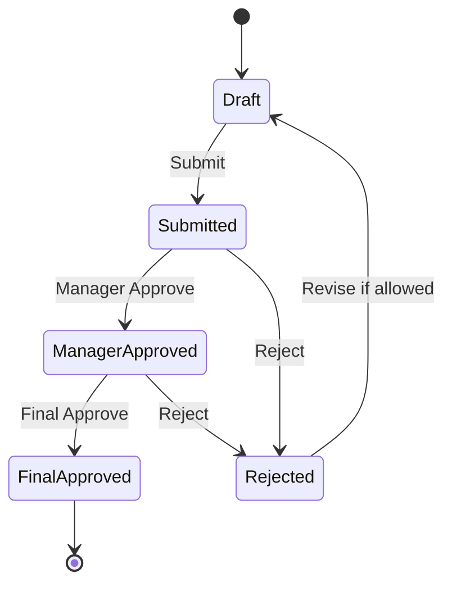
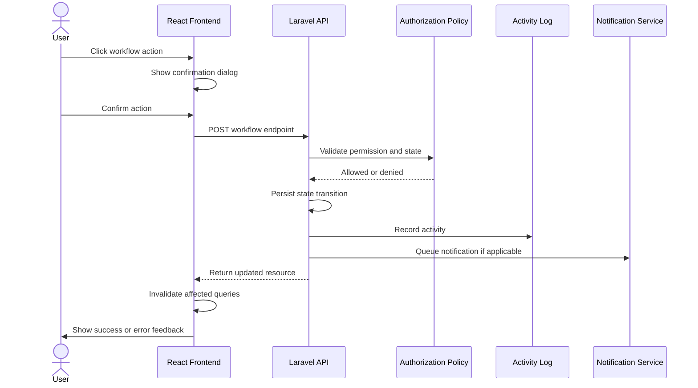
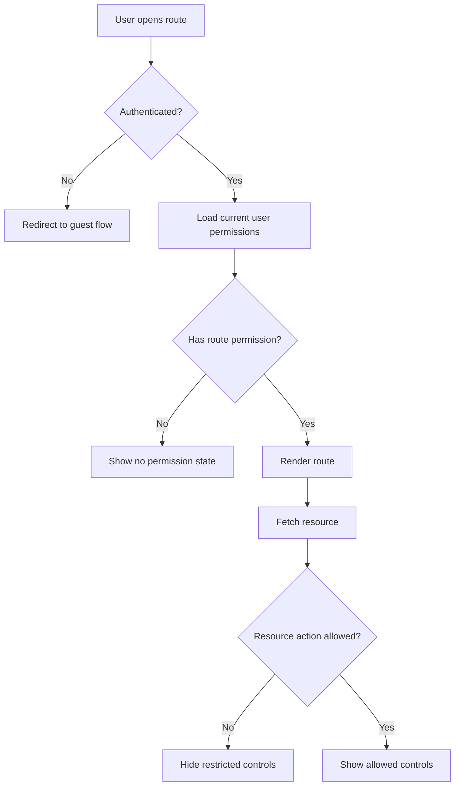
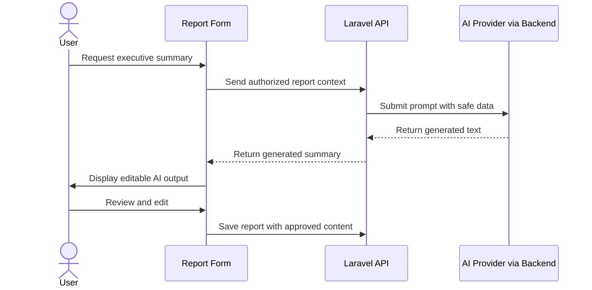
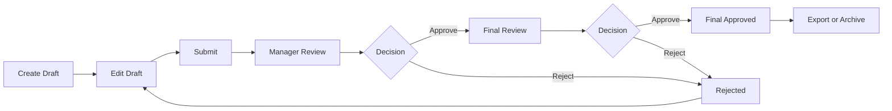

# ReportFlow Product Requirements Document

<div align="center">

**Official Product Requirements Document**

ReportFlow | Enterprise SaaS Reporting Platform

Structured Reporting | Workflow Automation | AI Summaries | Executive Analytics | Enterprise Integrations

</div>

---

## Document Control

| Field | Value |
| --- | --- |
| Product Name | ReportFlow |
| Product Type | Enterprise SaaS Platform |
| Document Type | Product Requirements Document |
| Version | 1.0.0 |
| Author | Product and Architecture Leadership |
| Owner | ReportFlow Product Management |
| Status | Approved Product Baseline |
| Last Updated | July 7, 2026 |
| Primary Audience | Product, Engineering, Design, QA, Security, Operations, Executives, AI contributors |
| Classification | Internal Product Source of Truth |

## Purpose of This Document

This Product Requirements Document defines the full product vision, business objectives, personas, modules, functional requirements, non-functional requirements, workflows, permissions, API expectations, user interface requirements, AI capabilities, reporting needs, analytics, notifications, integrations, roadmap, risks, and success metrics for ReportFlow.

This document is the product source of truth. All product decisions, engineering implementation, sprint planning, QA validation, release planning, and AI-assisted development must align with it unless a formally approved change supersedes a requirement.

## Revision History

| Version | Date | Author | Summary | Status |
| --- | --- | --- | --- | --- |
| 1.0.0 | July 7, 2026 | Product and Architecture Leadership | Initial enterprise PRD baseline for ReportFlow | Approved Baseline |

## Approval Table

| Role | Name / Group | Approval Responsibility | Status |
| --- | --- | --- | --- |
| Product Owner | ReportFlow Product Management | Product scope, personas, roadmap, success metrics | Pending Signature |
| CTO / Architecture Owner | ReportFlow Engineering Leadership | Architecture feasibility and technical alignment | Pending Signature |
| Security Owner | Security / IT Governance | Authentication, authorization, data protection, audit requirements | Pending Signature |
| QA Owner | Quality Engineering | Acceptance criteria, testability, release readiness | Pending Signature |
| Executive Sponsor | Executive Management | Business value, budget, strategic alignment | Pending Signature |

## Table of Contents

1. [Executive Summary](#1-executive-summary)
2. [Product Vision](#2-product-vision)
3. [Business Objectives](#3-business-objectives)
4. [Stakeholders](#4-stakeholders)
5. [Personas](#5-personas)
6. [Product Scope](#6-product-scope)
7. [Functional Modules](#7-functional-modules)
8. [Functional Requirements](#8-functional-requirements)
9. [Non-Functional Requirements](#9-non-functional-requirements)
10. [Business Rules](#10-business-rules)
11. [Workflow Specifications](#11-workflow-specifications)
12. [Permissions Matrix](#12-permissions-matrix)
13. [API Requirements](#13-api-requirements)
14. [User Interface Requirements](#14-user-interface-requirements)
15. [Artificial Intelligence](#15-artificial-intelligence)
16. [Reporting](#16-reporting)
17. [Analytics](#17-analytics)
18. [Notifications](#18-notifications)
19. [Future Integrations](#19-future-integrations)
20. [Release Roadmap](#20-release-roadmap)
21. [Risks](#21-risks)
22. [Success Metrics](#22-success-metrics)
23. [Appendices](#23-appendices)

## Product and Technical Baseline

### Product Baseline

| Category | Description |
| --- | --- |
| Product | ReportFlow |
| Product Type | Enterprise SaaS Platform |
| Core Use Case | Structured weekly reporting, validation workflow, executive visibility, analytics, AI summaries, and report generation |
| Primary Users | Employees, managers, executives, administrators, auditors, IT teams |
| Strategic Direction | Evolve from weekly reporting into enterprise work management and performance intelligence |

### Technical Baseline

| Layer | Technology |
| --- | --- |
| Backend Framework | Laravel 13 |
| Backend Language | PHP 8.3 |
| API | REST API |
| Authentication | Laravel Sanctum |
| RBAC | Spatie Permission |
| Audit Trail | Spatie Activity Log |
| AI Providers | OpenAI, Gemini |
| Document Generation | PowerPoint Generation |
| Admin Interface | Filament |
| Frontend Framework | React |
| Frontend Language | TypeScript |
| Build Tool | Vite |
| Styling | TailwindCSS |
| Server State | TanStack Query / React Query |
| Forms | React Hook Form |
| Validation | Zod |
| Client State | Zustand |
| Runtime | Docker, Laravel Sail |

---

# 1. Executive Summary

## 1.1 Purpose

ReportFlow is an enterprise SaaS reporting platform that enables employees to submit structured weekly activity reports, managers to review and validate those reports through controlled workflows, executives to monitor organizational performance through dashboards and analytics, and administrators to govern the reporting ecosystem through roles, settings, audit logs, and enterprise configuration.

The platform transforms a historically manual, fragmented, and inconsistent reporting process into a structured, auditable, automated, and intelligence-driven business workflow.

## 1.2 Business Context

Organizations often rely on email, spreadsheets, informal status updates, slide decks, chat messages, or ad hoc meetings to collect weekly progress information. These methods create inconsistent reporting quality, limited visibility, poor accountability, duplicated effort, delayed approvals, and weak executive decision support.

ReportFlow centralizes this process. It standardizes how employees report work, how managers validate information, how executives view progress, and how organizations convert operational activity into actionable intelligence.

## 1.3 Problem Statement

Enterprise reporting is frequently slowed by fragmented tools, inconsistent templates, unclear ownership, approval bottlenecks, missing audit trails, and limited analytics. Employees spend time formatting reports instead of communicating outcomes. Managers spend time chasing updates and validating inconsistent information. Executives lack timely visibility into trends, risks, blockers, and department-level performance.

ReportFlow exists to solve these problems by providing a single governed platform for structured reporting, workflow validation, AI-assisted summaries, executive dashboards, generated presentations, and auditable reporting history.

## 1.4 Why ReportFlow Exists

ReportFlow exists because weekly reporting should be:

- Standardized across departments.
- Fast for employees to complete.
- Easy for managers to review.
- Useful for executives to consume.
- Auditable for compliance and governance.
- Measurable through analytics.
- Enhanced by AI where AI saves time or improves clarity.
- Ready for enterprise integration.

## 1.5 Expected Business Value

| Value Area | Expected Outcome |
| --- | --- |
| Employee Productivity | Reduce time spent formatting and submitting weekly reports |
| Manager Efficiency | Reduce follow-up cycles and review delays |
| Executive Visibility | Improve access to timely operational insights |
| Accountability | Make reporting ownership, status, and approvals transparent |
| Standardization | Establish consistent reporting formats across departments |
| Compliance | Maintain activity logs and workflow history |
| Decision Support | Provide analytics, trends, summaries, and exports |
| Automation | Generate executive summaries and PowerPoint outputs |

## 1.6 Product Success Hypothesis

If ReportFlow standardizes reporting, automates workflow, and provides actionable visibility, then employees will submit reports faster, managers will approve reports sooner, executives will make better informed decisions, and the organization will reduce reporting friction while improving accountability.

---

# 2. Product Vision

## 2.1 Long-Term Vision

ReportFlow will evolve from a weekly reporting tool into an enterprise work management and performance intelligence platform. The long-term product vision is to become the organization's trusted operating layer for structured progress visibility, approval workflows, performance analytics, executive communication, and AI-assisted decision support.

ReportFlow should become the place where operational work is summarized, validated, analyzed, and transformed into management-ready outputs.

## 2.2 Vision Narrative

In its initial form, ReportFlow allows employees to submit weekly reports and managers to validate them. Over time, the platform expands into a broader enterprise intelligence system:

1. Employees document work, blockers, outcomes, and next actions.
2. Managers validate accuracy, identify risks, and approve updates.
3. Executives monitor department performance and strategic progress.
4. AI generates executive summaries, identifies trends, and suggests actions.
5. Reports become reusable assets for presentations, audits, reviews, and planning.
6. Integrations connect ReportFlow with Microsoft 365, Slack, ERP, HR, LIMS, and business intelligence systems.

## 2.3 Evolution Path

| Stage | Product Maturity | Capabilities |
| --- | --- | --- |
| Stage 1 | Weekly Reporting Platform | Employee reports, manager workflow, dashboard, PowerPoint generation |
| Stage 2 | Reporting Automation Platform | Notifications, reminders, analytics, department reporting, configurable workflows |
| Stage 3 | Enterprise Performance Intelligence | AI recommendations, trend analysis, risk detection, executive insights |
| Stage 4 | Integrated Work Management Platform | Microsoft 365, Teams, Slack, ERP, Power BI, Active Directory, SSO |
| Stage 5 | Predictive Organizational Intelligence | Forecasting, capacity signals, risk prediction, automated executive briefings |

## 2.4 Product Principles

| Principle | Product Meaning |
| --- | --- |
| Structured by default | Reporting should be consistent without requiring manual formatting |
| Human accountable | AI assists, but humans approve and remain accountable |
| Workflow-driven | Report states and transitions must be explicit and auditable |
| Enterprise ready | Security, access control, reliability, and auditability are core requirements |
| Insight-oriented | Reports should not only record activity; they should inform decisions |
| Integration-friendly | ReportFlow should connect with the enterprise ecosystem |

---

# 3. Business Objectives

## 3.1 Objective Summary

| ID | Objective | Business Outcome | Priority |
| --- | --- | --- | --- |
| BO-001 | Reduce reporting time | Employees submit weekly reports faster | P0 |
| BO-002 | Increase visibility | Managers and executives see reporting status and performance | P0 |
| BO-003 | Improve accountability | Every report has owner, status, timestamps, and approval history | P0 |
| BO-004 | Standardize reporting | Departments follow consistent structure and lifecycle | P0 |
| BO-005 | Improve decision making | Executives receive timely summaries, analytics, and exports | P1 |
| BO-006 | Enable AI-assisted reporting | AI reduces manual summary and presentation effort | P1 |
| BO-007 | Improve auditability | Activity logs preserve workflow and administrative history | P1 |
| BO-008 | Support enterprise integrations | Platform connects to communication, identity, BI, and ERP systems | P2 |

## 3.2 Reduce Reporting Time

ReportFlow must reduce the time required for employees to create weekly reports by providing structured forms, reusable templates, clear required fields, validation, autosave or future draft support, and AI assistance for summaries.

Success indicators:

- Average report submission time decreases.
- Fewer reports are returned due to missing information.
- Employees report improved usability.

## 3.3 Increase Visibility

ReportFlow must provide managers and executives with visibility into report completion, pending approvals, late reports, rejected reports, department performance, and organizational trends.

Success indicators:

- Managers can identify pending approvals quickly.
- Executives can view high-level KPIs without manual consolidation.
- Department heads can monitor team compliance.

## 3.4 Improve Accountability

Every report must have clear ownership, workflow status, timestamps, validator/rejector information where applicable, and audit history.

Success indicators:

- Report ownership is visible.
- Workflow history is accessible.
- Audit logs can answer who did what and when.

## 3.5 Standardize Reporting

ReportFlow must enforce a common reporting structure across the organization while allowing future configuration for departments and enterprise policies.

Standard weekly report sections:

- Objectives.
- Activities.
- Achievements.
- Difficulties.
- Next actions.
- Executive summary.
- Department.
- Week.

## 3.6 Improve Executive Decision Making

ReportFlow must transform weekly operational data into executive-ready intelligence through dashboards, analytics, summaries, generated presentations, trends, and risk indicators.

Success indicators:

- Executives consume dashboard insights weekly.
- Manual presentation preparation time decreases.
- Leadership meetings use ReportFlow-generated outputs.

## 3.7 Enable AI-Assisted Reporting

AI should reduce repetitive summarization work while preserving human oversight and workflow control.

Success indicators:

- AI-generated executive summaries are used in approved reports.
- Users report reduced summary preparation time.
- AI output can be reviewed and corrected by authorized users.

---

# 4. Stakeholders

## 4.1 Stakeholder Overview

| Stakeholder | Interest | Primary Needs | Influence |
| --- | --- | --- | --- |
| Executive Management | Strategic visibility and decision support | KPIs, summaries, exports, trends | High |
| Managers | Team reporting and approval workflow | Pending approvals, validation tools, team status | High |
| Employees | Fast report submission | Simple forms, draft editing, clear feedback | High |
| Administrators | Operational control | User management, settings, roles, audit logs | High |
| IT Department | Security, reliability, integrations | SSO, access control, uptime, API stability | High |
| Auditors | Traceability and compliance | Activity logs, approvals, timestamps | Medium |
| External Consultants | Project reporting and visibility | Limited secure access, report contribution | Medium |

## 4.2 Executive Management

Executives need high-level visibility into organizational performance without manually consolidating departmental reports. They require reliable dashboards, generated summaries, analytics, and presentation-ready exports.

## 4.3 Managers

Managers review employee reports, validate content, reject incomplete reports, approve accurate submissions, and monitor reporting compliance across their teams.

## 4.4 Employees

Employees submit weekly reports. Their experience must be fast, clear, and forgiving. They should understand report status, rejection reasons, and required corrections.

## 4.5 Administrators

Administrators configure platform behavior, manage users and employees, monitor audit logs, and maintain operational integrity.

## 4.6 IT Department

IT ensures secure deployment, identity integration, data protection, backups, environment configuration, uptime, and compliance with enterprise technology standards.

## 4.7 Auditors

Auditors require accurate historical evidence of submissions, approvals, rejections, generated outputs, and administrative changes.

## 4.8 External Consultants

External consultants may submit or view reports depending on contract scope. Their access must be controlled, limited, auditable, and revocable.

---

# 5. Personas

## 5.1 Persona Summary

| Persona | Primary Goal | Typical Permission Level |
| --- | --- | --- |
| Employee | Submit accurate weekly reports quickly | Employee |
| Manager | Review and approve team reports | Manager |
| Department Head | Monitor department performance and compliance | Manager / Admin |
| Executive | View cross-organization insights and summaries | Executive / Admin |
| Administrator | Operate and configure the platform | Admin |
| Super Administrator | Govern roles, settings, and system-wide controls | Super Admin |

## 5.2 Employee Persona

| Attribute | Description |
| --- | --- |
| Name | Employee Contributor |
| Goals | Submit weekly reports, track status, correct rejected reports, communicate progress clearly |
| Responsibilities | Document objectives, activities, achievements, difficulties, and next actions |
| Pain Points | Time-consuming reporting, unclear templates, repeated corrections, forgotten deadlines |
| Permissions | View own dashboard/profile, create reports, edit draft/rejected reports, submit reports, view own report history |
| Typical Workflow | Login, open reports, create draft, complete sections, submit, monitor status, revise if rejected |

User story examples:

- As an employee, I want a structured weekly report form so that I can submit updates quickly.
- As an employee, I want rejected reports to show rejection reasons so that I can correct them.
- As an employee, I want to see my submitted reports so that I know what is pending approval.

## 5.3 Manager Persona

| Attribute | Description |
| --- | --- |
| Name | Team Manager |
| Goals | Review team submissions, approve accurate reports, reject incomplete reports, monitor team compliance |
| Responsibilities | Validate reports, provide rejection feedback, ensure timely submissions, escalate risks |
| Pain Points | Chasing late reports, inconsistent report formats, unclear blockers, manual consolidation |
| Permissions | View team reports, approve submitted reports, reject reports, view employee profiles, view workflow queues |
| Typical Workflow | Login, review dashboard, open pending approvals, read report, approve or reject, monitor queue |

User story examples:

- As a manager, I want a pending approvals list so that I can process reports efficiently.
- As a manager, I want to reject reports with a reason so that employees know what to fix.
- As a manager, I want team completion metrics so that I can improve reporting compliance.

## 5.4 Department Head Persona

| Attribute | Description |
| --- | --- |
| Name | Department Head |
| Goals | Understand department performance, identify blockers, monitor report completion, prepare leadership updates |
| Responsibilities | Oversee multiple teams, ensure reporting discipline, surface department risks |
| Pain Points | Manual aggregation, delayed visibility, inconsistent manager updates |
| Permissions | View department employees, reports, analytics, workflow history, department dashboards |
| Typical Workflow | Review department dashboard, inspect late/pending reports, export summaries, discuss trends with managers |

## 5.5 Executive Persona

| Attribute | Description |
| --- | --- |
| Name | Executive Leader |
| Goals | Understand organization-wide performance and risks quickly |
| Responsibilities | Make strategic decisions, review department progress, prepare board or leadership updates |
| Pain Points | Too much raw detail, late reporting, fragmented presentation preparation |
| Permissions | View executive dashboard, analytics, generated reports, presentations, high-level trends |
| Typical Workflow | Open dashboard, review KPIs, inspect trend analysis, export PowerPoint, review AI summaries |

## 5.6 Administrator Persona

| Attribute | Description |
| --- | --- |
| Name | Platform Administrator |
| Goals | Keep ReportFlow configured, accurate, and operational |
| Responsibilities | Manage employees, monitor activity, configure settings, support users |
| Pain Points | Manual user updates, unclear access rules, limited audit visibility |
| Permissions | Manage employees, settings, notifications, audit logs, operational configuration |
| Typical Workflow | Add employees, update departments, review activity logs, manage platform settings |

## 5.7 Super Administrator Persona

| Attribute | Description |
| --- | --- |
| Name | Super Administrator |
| Goals | Govern the complete ReportFlow platform |
| Responsibilities | Manage roles, permissions, global settings, integrations, sensitive operations |
| Pain Points | Security risks, role drift, integration complexity, operational governance |
| Permissions | Full platform administration, role management, settings, employee deletion, integrations |
| Typical Workflow | Configure roles, review audit logs, manage system settings, approve enterprise integrations |

---
# 6. Product Scope

## 6.1 Scope Philosophy

ReportFlow must deliver a complete enterprise reporting lifecycle while avoiding uncontrolled expansion into unrelated project management, HR management, or ERP functionality. The product scope is intentionally centered on structured reporting, workflow validation, visibility, analytics, generated outputs, governance, and future integrations.

## 6.2 In Scope

| Scope Area | Description | Priority |
| --- | --- | --- |
| Authentication | Secure login, logout, current user session, protected API access | P0 |
| RBAC | Role-based permissions for employees, managers, admins, and super admins | P0 |
| Weekly Reports | Create, edit, submit, view, duplicate, delete where allowed | P0 |
| Workflow | Draft, submitted, manager approved, final approved, rejected lifecycle | P0 |
| Dashboard | Operational KPIs, recent reports, pending approvals, activity summary | P0 |
| Employees | Employee directory, profile, activity, reports, department/status filtering | P0 |
| Notifications | In-app and email notification foundations | P1 |
| Analytics | KPI charts, trends, completion rates, approval delays | P1 |
| AI Summaries | Executive summary generation for weekly reports | P1 |
| PowerPoint Export | Generate presentation-ready report outputs | P1 |
| Audit Logs | Track workflow and administrative actions | P1 |
| Settings | Platform preferences, theme, profile, future workflow settings | P2 |
| Administration | Filament-based administrative operations | P2 |
| API | REST APIs for product modules | P0 |

## 6.3 Out of Scope

The following are explicitly out of scope for the initial product baseline unless later approved:

| Out of Scope Item | Reason |
| --- | --- |
| Full project management replacement | ReportFlow complements work systems; it is not Jira, Asana, or MS Project |
| Payroll or HRIS ownership | Employee records support reporting, not payroll operations |
| Real-time collaborative editing | Useful future capability, not required for baseline reporting |
| Native mobile apps | Responsive web/PWA is the initial strategy |
| Offline-first enterprise sync | Offline support is future PWA scope, not initial source of truth |
| Unlimited custom workflow designer | Configurable workflow is future scope; baseline workflow is standardized |
| Full data warehouse | Analytics should be product-focused; enterprise BI integrations are future scope |
| Legal e-signature workflow | Approval is operational validation, not regulated signature by default |

## 6.4 Future Scope

| Future Capability | Description | Candidate Release |
| --- | --- | --- |
| Configurable Workflows | Department-specific approval stages and escalation rules | v2.0 |
| Reminder Engine | Scheduled reminders for late reports and pending approvals | v1.5 |
| AI Assistant | Conversational assistant for reporting, analytics, and recommendations | v2.0 |
| Trend and Risk Detection | AI-driven detection of recurring blockers and performance risks | v2.0 |
| Microsoft 365 Integration | Outlook calendar/email, Teams notifications, SSO | v2.0 |
| Slack Integration | Workflow notifications and reminders | v2.0 |
| Power BI Integration | Push analytics datasets to enterprise BI | v3.0 |
| ERP/LIMS Integration | Pull project, production, quality, and lab context into reports | v3.0 |
| Active Directory/SSO | Enterprise identity integration | v2.0 |
| PDF and Excel Exports | Additional report export formats | v1.5 |

---

# 7. Functional Modules

## 7.1 Module Overview

| Module | Primary Users | Core Purpose | Priority |
| --- | --- | --- | --- |
| Authentication | All users | Secure access to platform | P0 |
| Dashboard | All roles by permission | Operational summary and navigation hub | P0 |
| Reports | Employees, managers | Weekly report creation and management | P0 |
| Workflow | Managers, admins | Approval, rejection, final validation | P0 |
| Employees | Managers, admins, employees for self | Directory, profile, reports, activity | P0 |
| Notifications | All users | Keep users informed of required actions | P1 |
| Analytics | Managers, executives | Trends, KPIs, performance insights | P1 |
| Administration | Admins, super admins | Operational management | P2 |
| Settings | Admins, users | Preferences and platform configuration | P2 |
| Profile | All users | Manage personal account context | P1 |
| AI Assistant | Employees, managers, executives | Summary, recommendations, analysis | P2 |
| PowerPoint Generator | Managers, executives | Presentation output | P1 |
| Audit Logs | Admins, auditors | Compliance and traceability | P1 |

## 7.2 Authentication Module

### Description

The Authentication module provides secure user access through Laravel Sanctum. It enables users to log in, log out, retrieve current session/user information, and access protected APIs according to role and permission.

### Core Capabilities

- Login with email and password.
- Logout and token invalidation.
- Current user endpoint.
- Authenticated route protection.
- Bearer token support.
- Role information available to frontend.
- Employee profile relationship available where applicable.

### Business Rules

- Users must authenticate before accessing protected application pages.
- Unauthenticated users must be redirected to sign in.
- Tokens must not be exposed in URLs or logs.
- Logout must clear local session state.
- Backend remains authoritative for authentication.

## 7.3 Dashboard Module

### Description

The Dashboard module provides the landing experience after login. It summarizes reports, workflow status, recent activity, key metrics, and quick actions according to user permissions.

### Core Capabilities

- Total reports.
- Pending reports.
- Rejected reports.
- Generated reports.
- Validation rate.
- Reports by status chart.
- Recent reports.
- Pending approvals.
- Activity feed.
- Quick action shortcuts.

### Business Rules

- Dashboard content must reflect backend API data.
- Users must only see data they are authorized to view.
- Dashboard must include loading, empty, and error states.
- Metrics must not be fabricated on the frontend.

## 7.4 Reports Module

### Description

The Reports module enables employees to create structured weekly reports and authorized users to view, edit, submit, duplicate, delete, print, and export them according to backend workflow and permissions.

### Core Capabilities

- Report list with search, filters, sorting, and pagination.
- Create report form.
- Edit report form.
- Report detail page.
- Status badges.
- Priority or status indicators where applicable.
- Workflow action buttons based on permissions.
- Loading, empty, error, and success states.
- Backend validation error display.

### Standard Report Fields

| Field | Description | Required |
| --- | --- | --- |
| Employee | Owner of the report | Yes |
| Department | Department associated with report | Yes |
| Week | Reporting week | Yes |
| Objectives | Planned objectives | Yes |
| Activities | Activities completed | Yes |
| Achievements | Achievements and outcomes | Yes |
| Difficulties | Blockers or issues | Optional |
| Next Actions | Planned next actions | Yes |
| Executive Summary | AI-generated or backend-generated summary | Generated/Returned by backend |

### Business Rules

- Draft reports are editable.
- Submitted reports are read-only.
- Manager-approved reports are read-only.
- Generated reports are read-only.
- Rejected reports become editable again where backend workflow allows.
- Submit action is available only when backend workflow permits it.
- Delete action must not be shown unless backend role/policy allows it.

## 7.5 Workflow Module

### Description

The Workflow module manages report lifecycle transitions from draft to submission, manager approval, final approval, generation, or rejection.

### Core Capabilities

- Workflow overview page.
- Approval detail page.
- Pending approvals list.
- My pending actions list.
- Approval timeline.
- Workflow history.
- Visual workflow stepper.
- Submit confirmation.
- Manager approve confirmation.
- Final approve confirmation.
- Reject dialog with required reason.
- Query invalidation after workflow actions.

### Workflow States

| State | Meaning | Editable |
| --- | --- | --- |
| Draft | Report is being prepared | Yes |
| Submitted | Report is awaiting manager approval | No |
| Manager Approved | Report is awaiting final approval | No |
| Generated / Final Approved | Report is approved and output may be generated | No |
| Rejected | Report requires correction | Yes, if backend permits |

## 7.6 Employees Module

### Description

The Employees module exposes employee directory, details, profile, reports, statistics, role badges, department badges, and workflow activity through the Employees API.

### Core Capabilities

- Employee list.
- Employee detail page.
- Employee profile page.
- Employee activity page.
- Search.
- Department filter.
- Role filter.
- Active/inactive filter.
- Sorting.
- Pagination.
- Employee statistics.
- Employee reports.
- Activity timeline.
- Create, update, and delete where backend permits.

### Business Rules

- Managers and super admins can list employees.
- Employees can view their own employee record where backend permits.
- Managers can create and update employees where backend permits.
- Super admins can delete employees where backend permits.
- Role-based actions must be hidden when forbidden.
- Backend authorization remains authoritative.

## 7.7 Notifications Module

### Description

The Notifications module informs users about submissions, approvals, rejections, pending actions, reminders, and generated outputs.

### Core Capabilities

- In-app notification center.
- Notification badge.
- Email notifications.
- Future Teams/Slack/push notifications.
- Reminder scheduling.
- Read/unread states.
- Action links to relevant reports or workflow pages.

### Business Rules

- Users must receive notifications only for relevant and authorized items.
- Workflow transitions should trigger appropriate notifications.
- Rejection notifications must include reason where authorized.
- Notification delivery failure must not corrupt workflow state.

## 7.8 Analytics Module

### Description

The Analytics module provides insights into reporting completion, approval speed, department performance, rejection rates, late reports, trends, and operational risk indicators.

### Core Capabilities

- KPI cards.
- Status charts.
- Department performance charts.
- Completion rate analysis.
- Approval delay analysis.
- Late report tracking.
- Rejection trend analysis.
- Exportable analytics.

## 7.9 Administration Module

### Description

The Administration module provides operational management capabilities through Filament and future React admin surfaces.

### Core Capabilities

- User management.
- Employee management.
- Role assignment.
- Permission governance.
- Activity log review.
- System settings.
- Integration settings.
- Operational dashboards.

## 7.10 Settings Module

### Description

The Settings module controls user preferences and platform configuration.

### Core Capabilities

- Theme preference.
- Profile preferences.
- Notification preferences.
- Future workflow configuration.
- Future integration configuration.
- Future organization settings.

## 7.11 Profile Module

### Description

The Profile module allows users to view and manage their own account and employee context.

### Core Capabilities

- Profile details.
- Linked employee information.
- Role and permissions visibility.
- Personal report summary.
- Preferences.

## 7.12 AI Assistant Module

### Description

The AI Assistant module provides AI-assisted summary generation, future conversational assistance, recommendations, trend analysis, risk detection, and action suggestions.

### Core Capabilities

- Executive summary generation.
- Future report quality suggestions.
- Future trend detection.
- Future blocker summarization.
- Future risk alerts.
- Future action recommendations.

## 7.13 PowerPoint Generator Module

### Description

The PowerPoint Generator module converts validated report content into presentation-ready outputs for managers and executives.

### Core Capabilities

- Generate PowerPoint files after final approval.
- Store generated file reference.
- Allow download when authorized.
- Include executive summaries and structured report content.
- Future template selection.

## 7.14 Audit Logs Module

### Description

The Audit Logs module stores and exposes important workflow and administrative actions for accountability, compliance, debugging, and governance.

### Core Capabilities

- Workflow activity history.
- Report submission logs.
- Approval logs.
- Rejection logs.
- Final approval logs.
- Administrative change logs.
- Actor, subject, timestamp, and metadata capture.

---

# 8. Functional Requirements

## 8.1 Functional Requirements Method

Functional requirements are written as numbered, testable requirements. Each requirement is designed to be traceable to product scope, backend capability, UI behavior, authorization expectations, and acceptance criteria.

### Requirement Format

| Field | Meaning |
| --- | --- |
| Requirement ID | Stable identifier used for planning, delivery, QA, and audit. |
| Module | Product module responsible for the behavior. |
| Requirement | Business-visible capability required from the system. |
| Priority | Must, Should, Could, or Future. |
| Acceptance Criteria | Observable conditions required for acceptance. |

### Priority Definitions

| Priority | Definition |
| --- | --- |
| Must | Required for the core production release. |
| Should | Important for a complete enterprise experience but may be phased. |
| Could | Useful enhancement if time and budget allow. |
| Future | Planned for a later release or integration cycle. |

## 8.2 Authentication Requirements

| ID | Requirement | Priority | Acceptance Criteria |
| --- | --- | --- | --- |
| AUTH-FR-001 | The system shall allow authorized users to sign in using the backend authentication mechanism. | Must | A user with valid credentials can authenticate and receive access to protected application areas. |
| AUTH-FR-002 | The system shall prevent unauthenticated access to protected frontend routes. | Must | Direct navigation to protected screens redirects unauthenticated users to the guest authentication flow. |
| AUTH-FR-003 | The system shall expose the current authenticated user to the React application. | Must | The frontend can render user identity, role, and permissions after authentication. |
| AUTH-FR-004 | The system shall support logout from any authenticated application shell. | Must | Logout clears session state and returns the user to a guest-safe screen. |
| AUTH-FR-005 | The system shall handle expired or invalid authentication tokens gracefully. | Must | API responses indicating unauthenticated access trigger user-safe recovery without blank screens. |
| AUTH-FR-006 | The system shall avoid exposing sensitive tokens in logs, analytics, screenshots, or UI output. | Must | Tokens are never displayed or sent to non-authentication destinations. |
| AUTH-FR-007 | The system shall preserve a safe intended destination after authentication when appropriate. | Should | Users redirected from a protected route can return to the originally requested route after successful authentication. |
| AUTH-FR-008 | The system shall support future SSO integration without redesigning protected routing. | Future | Authentication boundaries are centralized and not duplicated across pages. |

## 8.3 Dashboard Requirements

| ID | Requirement | Priority | Acceptance Criteria |
| --- | --- | --- | --- |
| DASH-FR-001 | The dashboard shall provide a high-level operational overview after sign-in. | Must | The dashboard renders summary information from backend APIs for authorized users. |
| DASH-FR-002 | The dashboard shall display KPI cards using reusable business components. | Must | KPI values load, refresh, and display empty or error states when needed. |
| DASH-FR-003 | The dashboard shall display recent reports. | Must | Recent reports are fetched from the Reports API or dashboard aggregate endpoint. |
| DASH-FR-004 | The dashboard shall display pending approvals for users who can approve reports. | Must | Approval items are visible only when authorized and available. |
| DASH-FR-005 | The dashboard shall display a recent activity feed. | Should | Activity information is loaded from backend activity or dashboard endpoints. |
| DASH-FR-006 | The dashboard shall provide quick actions based on permissions. | Should | Only actions allowed by backend roles and permissions are shown. |
| DASH-FR-007 | The dashboard shall support responsive layouts across desktop, tablet, and mobile. | Must | Layout remains usable and readable at common viewport sizes. |
| DASH-FR-008 | The dashboard shall support light and dark themes. | Must | Theme tokens apply correctly in both display modes. |

## 8.4 Reports Requirements

| ID | Requirement | Priority | Acceptance Criteria |
| --- | --- | --- | --- |
| REP-FR-001 | The system shall list reports using the existing Reports API. | Must | The Reports list loads paginated backend data without mocked records. |
| REP-FR-002 | The system shall support searching reports. | Must | Search terms are sent to the API and results update accordingly. |
| REP-FR-003 | The system shall support filtering reports by status, department, week, employee, and other backend-supported filters. | Must | Filters are reflected in query parameters and backend responses. |
| REP-FR-004 | The system shall support report sorting. | Must | Sort selections are sent to the API and the list order updates. |
| REP-FR-005 | The system shall support pagination. | Must | Users can navigate pages without losing active filters or search terms. |
| REP-FR-006 | The system shall allow authorized users to create a weekly report. | Must | Valid report data can be submitted to the API and persisted by the backend. |
| REP-FR-007 | The system shall validate report forms before submission. | Must | Required fields and invalid formats show clear client-side messages. |
| REP-FR-008 | The system shall display backend validation errors. | Must | Server-side validation messages are mapped to user-visible fields or alerts. |
| REP-FR-009 | The system shall allow authorized users to view report details. | Must | Report detail pages show complete report information returned by the API. |
| REP-FR-010 | The system shall allow editing only when allowed by backend workflow state and permissions. | Must | Edit controls are hidden or disabled when the backend denies editing. |
| REP-FR-011 | The system shall allow authorized deletion when permitted by backend policy. | Must | Deletion requires confirmation and refreshes affected report queries. |
| REP-FR-012 | The system shall support duplication of report content when permitted. | Should | A user can initiate a copy flow without modifying the original report. |
| REP-FR-013 | The system shall support report printing. | Should | A print-friendly view or browser print action is available where allowed. |
| REP-FR-014 | The system shall expose PowerPoint export only when the endpoint and permissions exist. | Should | Export controls appear only when backend capability and authorization are available. |
| REP-FR-015 | The system shall display report status badges consistently. | Must | Draft, Submitted, Manager Approved, Final Approved, and Rejected states are visually distinct. |
| REP-FR-016 | The system shall render loading, empty, error, and success states. | Must | Users never see ambiguous blank screens during report operations. |

## 8.5 Workflow Requirements

| ID | Requirement | Priority | Acceptance Criteria |
| --- | --- | --- | --- |
| WF-FR-001 | The system shall display a workflow page for approval operations. | Must | Authorized users can access workflow views backed by existing workflow endpoints. |
| WF-FR-002 | The system shall display pending approvals. | Must | The list includes reports requiring the current user's action. |
| WF-FR-003 | The system shall display the current user's pending workflow actions. | Must | A user sees actionable workflow items assigned to their role or permission. |
| WF-FR-004 | The system shall support report submission. | Must | Submit action calls the backend endpoint and refreshes affected data. |
| WF-FR-005 | The system shall support manager approval. | Must | Manager approval is available only to authorized users and valid workflow states. |
| WF-FR-006 | The system shall support final approval. | Must | Final approval is available only to authorized users and valid workflow states. |
| WF-FR-007 | The system shall support rejection with a reason. | Must | Reject action requires confirmation and captures a rejection reason when required. |
| WF-FR-008 | The system shall show a visual workflow stepper. | Must | Draft, Submitted, Manager Approved, Final Approved, and Rejected states are visible. |
| WF-FR-009 | The system shall show workflow history and timeline details. | Must | Timestamps, actors, and events display when provided by the backend. |
| WF-FR-010 | The system shall refresh affected queries after workflow actions. | Must | Report lists, report details, dashboard, and workflow views reflect new state after mutation. |
| WF-FR-011 | The system shall display success and error feedback for workflow actions. | Must | Users receive clear confirmation or error messaging after each action. |
| WF-FR-012 | The system shall not allow frontend-only workflow transitions. | Must | All state changes are persisted through backend endpoints only. |

## 8.6 Employees Requirements

| ID | Requirement | Priority | Acceptance Criteria |
| --- | --- | --- | --- |
| EMP-FR-001 | The system shall list employees from the Employees API. | Must | Employee list uses GET /api/employees and does not infer employees from reports. |
| EMP-FR-002 | The system shall support employee search. | Must | Search input filters backend results through query parameters. |
| EMP-FR-003 | The system shall support department, role, and status filters. | Must | Filters are sent to the backend and remain shareable through route state or query parameters. |
| EMP-FR-004 | The system shall support employee sorting and pagination. | Must | Users can sort and paginate through backend-provided employee data. |
| EMP-FR-005 | The system shall display employee detail information. | Must | Employee detail page consumes GET /api/employees/{employee}. |
| EMP-FR-006 | The system shall display employee profile context. | Must | Profile information includes user, department, role, and status when returned. |
| EMP-FR-007 | The system shall display employee statistics. | Should | Statistics returned by the API are rendered in reusable metric components. |
| EMP-FR-008 | The system shall display employee reports. | Must | Employee reports are fetched from GET /api/employees/{employee}/reports. |
| EMP-FR-009 | The system shall display employee activity. | Must | Activity timeline uses GET /api/employees/{employee}/activity. |
| EMP-FR-010 | The system shall allow create, update, and delete only when authorized by backend policy. | Must | Forbidden actions are not rendered and denied API responses are handled gracefully. |
| EMP-FR-011 | The system shall display role and department badges consistently. | Must | Role and department metadata render through reusable business components or design primitives. |
| EMP-FR-012 | The system shall support empty, loading, and error states for employee data. | Must | Every employee view has deterministic user feedback for data states. |

## 8.7 Notifications Requirements

| ID | Requirement | Priority | Acceptance Criteria |
| --- | --- | --- | --- |
| NOTIF-FR-001 | The system shall expose a notification bell in the application shell. | Must | The shell includes a keyboard-accessible notification entry point. |
| NOTIF-FR-002 | The system shall display unread count when notification data is available. | Should | Unread badge updates from backend state or notification query results. |
| NOTIF-FR-003 | The system shall list notifications in a reusable notification component. | Should | Notification items show title, message, state, and timestamp where available. |
| NOTIF-FR-004 | The system shall support marking notifications as read when backend endpoint exists. | Should | Mutation updates local cache and backend state. |
| NOTIF-FR-005 | The system shall support notification-driven navigation. | Should | Clicking an actionable notification routes to the related report, workflow item, or employee context. |
| NOTIF-FR-006 | The system shall support future push notifications through PWA infrastructure. | Future | The notification strategy does not block later service worker integration. |

## 8.8 Analytics Requirements

| ID | Requirement | Priority | Acceptance Criteria |
| --- | --- | --- | --- |
| ANA-FR-001 | The system shall provide analytics pages for authorized users. | Should | Analytics routes are protected and permission-aware. |
| ANA-FR-002 | The system shall display report completion metrics. | Should | Metrics are loaded from backend analytics endpoints when available. |
| ANA-FR-003 | The system shall display approval cycle time metrics. | Should | Time between submission, manager approval, and final approval is visible. |
| ANA-FR-004 | The system shall display department-level trends. | Should | Department filters and chart views support operational comparisons. |
| ANA-FR-005 | The system shall support export of analytics where backend endpoints exist. | Could | Export controls appear only when supported by the API. |
| ANA-FR-006 | The system shall clearly distinguish raw data, calculated metrics, and AI-generated analysis. | Must | Users can understand the source and confidence of analytical content. |

## 8.9 Administration and Settings Requirements

| ID | Requirement | Priority | Acceptance Criteria |
| --- | --- | --- | --- |
| ADMIN-FR-001 | The system shall expose administrative navigation only to authorized users. | Must | Unauthorized users do not see administration entries. |
| ADMIN-FR-002 | The system shall support future management of roles and permissions. | Future | The frontend architecture includes permission-driven navigation and route guards. |
| ADMIN-FR-003 | The system shall support application settings screens. | Should | Settings are grouped by functional ownership and backend capability. |
| ADMIN-FR-004 | The system shall support profile preference management. | Should | Users can manage personal preferences when backend persistence exists. |
| ADMIN-FR-005 | The system shall avoid client-side authorization assumptions. | Must | All administrative actions remain enforced by backend authorization. |

## 8.10 Artificial Intelligence Requirements

| ID | Requirement | Priority | Acceptance Criteria |
| --- | --- | --- | --- |
| AI-FR-001 | The system shall support AI-generated executive summaries when backend AI endpoints are available. | Must | Users can request summary generation from permitted report forms or detail screens. |
| AI-FR-002 | The system shall identify AI-generated content as generated assistance. | Must | AI content is visibly marked and can be reviewed before final submission. |
| AI-FR-003 | The system shall allow users to edit AI-generated text before saving. | Must | AI output is never treated as final without user review. |
| AI-FR-004 | The system shall handle AI service failures gracefully. | Must | Failure states explain that generation failed without blocking manual report creation. |
| AI-FR-005 | The system shall support future AI recommendations and risk detection. | Future | AI boundaries are isolated in services and hooks. |
| AI-FR-006 | The system shall avoid sending unauthorized data to AI services. | Must | Only backend-approved data is transmitted through backend AI endpoints. |

## 8.11 PowerPoint Generation Requirements

| ID | Requirement | Priority | Acceptance Criteria |
| --- | --- | --- | --- |
| PPT-FR-001 | The system shall display PowerPoint export controls only when allowed. | Should | Export action appears only for valid report states and authorized users. |
| PPT-FR-002 | The system shall call the backend PowerPoint generation endpoint when available. | Should | The generated file or download response is handled safely. |
| PPT-FR-003 | The system shall provide user feedback during generation. | Should | Loading and completion messages indicate progress and result. |
| PPT-FR-004 | The system shall handle export failures. | Should | Users receive actionable error messages if generation fails. |
| PPT-FR-005 | The system shall support future template selection. | Future | UI architecture does not hardcode a single presentation template. |

## 8.12 Activity Log Requirements

| ID | Requirement | Priority | Acceptance Criteria |
| --- | --- | --- | --- |
| LOG-FR-001 | The system shall display activity logs where available. | Must | Workflow, employee, and audit views render backend activity data. |
| LOG-FR-002 | The system shall display actor, action, subject, and timestamp when available. | Must | Activity entries are understandable without reading raw metadata. |
| LOG-FR-003 | The system shall preserve activity log integrity. | Must | The frontend never mutates activity history directly. |
| LOG-FR-004 | The system shall support filtering activity by context in future audit views. | Future | Activity UI components accept filters and metadata without coupling to one page. |

---

# 9. Non Functional Requirements

## 9.1 Non Functional Requirement Categories

ReportFlow is an enterprise SaaS application. Non functional requirements are therefore treated as product requirements, not technical afterthoughts. They define expectations for performance, security, accessibility, reliability, observability, maintainability, and operational readiness.

## 9.2 Performance Requirements

| ID | Requirement | Target | Priority |
| --- | --- | --- | --- |
| NFR-PERF-001 | Initial authenticated shell should load quickly on standard office networks. | Primary shell interactive within 3 seconds under normal conditions. | Must |
| NFR-PERF-002 | Route-level JavaScript should be code split. | Business modules load only when navigated to. | Must |
| NFR-PERF-003 | Lists should use backend pagination. | No unbounded client-side loading of enterprise datasets. | Must |
| NFR-PERF-004 | API calls should be cached where appropriate. | Frequently visited resources avoid unnecessary refetching. | Must |
| NFR-PERF-005 | User interactions should provide immediate feedback. | Mutations show pending, success, or error states. | Must |
| NFR-PERF-006 | Heavy visualizations should avoid blocking the main thread. | Charts and analytics remain responsive. | Should |
| NFR-PERF-007 | Image, icon, and asset usage should be optimized. | No oversized assets in the critical shell path. | Should |

## 9.3 Scalability Requirements

| ID | Requirement | Target | Priority |
| --- | --- | --- | --- |
| NFR-SCAL-001 | The frontend shall scale by feature modules. | Each business area can evolve independently. | Must |
| NFR-SCAL-002 | Server state shall be managed through query hooks. | API cache logic is not duplicated across pages. | Must |
| NFR-SCAL-003 | Global client state shall remain minimal. | Only authentication, theme, and UI state belong in global stores. | Must |
| NFR-SCAL-004 | Navigation shall be permission-driven. | New modules can be added without rewriting the app shell. | Must |
| NFR-SCAL-005 | Design components shall remain domain-neutral. | Business components compose primitives without forking styles. | Must |

## 9.4 Availability and Reliability Requirements

| ID | Requirement | Target | Priority |
| --- | --- | --- | --- |
| NFR-REL-001 | The application shall fail gracefully when an API request fails. | Error states render with retry or recovery guidance. | Must |
| NFR-REL-002 | The application shall recover from stale authentication state. | Unauthorized responses trigger safe auth recovery. | Must |
| NFR-REL-003 | The application shall avoid data loss during form errors. | User-entered data remains visible after validation failure when safe. | Must |
| NFR-REL-004 | Long-running actions shall be cancellable where possible. | Request cancellation foundation uses AbortController-compatible APIs. | Should |
| NFR-REL-005 | The app shall remain navigable if noncritical widgets fail. | One failed widget does not collapse the full page. | Should |

## 9.5 Security Requirements

| ID | Requirement | Target | Priority |
| --- | --- | --- | --- |
| NFR-SEC-001 | All protected API calls shall require authenticated access. | Sanctum-protected endpoints enforce access. | Must |
| NFR-SEC-002 | Authorization shall be enforced by the backend. | Frontend permissions are used for UX, not security source of truth. | Must |
| NFR-SEC-003 | Sensitive values shall not be logged. | Tokens, passwords, secrets, and personal data are redacted. | Must |
| NFR-SEC-004 | Forms shall validate input on client and server. | Client validation improves UX; server validation remains authoritative. | Must |
| NFR-SEC-005 | Error messages shall avoid leaking implementation details. | User-facing messages are helpful but not sensitive. | Must |
| NFR-SEC-006 | AI interactions shall be mediated by backend APIs. | Frontend does not expose direct provider secrets. | Must |
| NFR-SEC-007 | Activity logs shall be immutable from frontend workflows. | UI can display logs but not alter historical records. | Must |

## 9.6 Accessibility Requirements

| ID | Requirement | Target | Priority |
| --- | --- | --- | --- |
| NFR-A11Y-001 | Interactive elements shall be keyboard accessible. | Buttons, menus, dialogs, drawers, tabs, and tables support keyboard navigation. | Must |
| NFR-A11Y-002 | Components shall expose appropriate ARIA semantics. | Screen readers can interpret component purpose and state. | Must |
| NFR-A11Y-003 | Color contrast shall support WCAG-oriented readability. | Light and dark modes preserve readable contrast. | Must |
| NFR-A11Y-004 | Focus management shall be implemented for overlays. | Modals and drawers trap and restore focus. | Must |
| NFR-A11Y-005 | Loading and error states shall be announced or discoverable. | Users relying on assistive technology can understand state changes. | Should |
| NFR-A11Y-006 | Motion shall be restrained and nonessential. | Users are not blocked by animation. | Should |

## 9.7 Maintainability Requirements

| ID | Requirement | Target | Priority |
| --- | --- | --- | --- |
| NFR-MAINT-001 | TypeScript strict mode shall remain enabled. | New frontend code compiles without implicit any or unsafe patterns. | Must |
| NFR-MAINT-002 | Shared types shall be centralized. | Domain models and API shapes are not redefined per page. | Must |
| NFR-MAINT-003 | Feature modules shall own their API hooks and schemas. | Reports, workflow, employees, and future modules remain isolated. | Must |
| NFR-MAINT-004 | UI primitives shall not contain business logic. | Design System components remain reusable. | Must |
| NFR-MAINT-005 | Business components shall accept data through props. | Components are reusable across pages and do not call APIs directly. | Must |
| NFR-MAINT-006 | The codebase shall avoid duplicated transformation logic. | Utilities and query mappers are reused. | Should |

## 9.8 Compatibility Requirements

| ID | Requirement | Target | Priority |
| --- | --- | --- | --- |
| NFR-COMP-001 | The frontend shall run in modern evergreen browsers. | Chrome, Edge, Firefox, and Safari current versions. | Must |
| NFR-COMP-002 | The application shall work in Docker-based local development. | Developers can run backend and frontend locally through documented commands. | Must |
| NFR-COMP-003 | BrowserRouter shall be supported by Laravel fallback routing. | Direct URL refreshes load the SPA shell. | Must |
| NFR-COMP-004 | The application shall use the documented local URL. | Local verification uses http://localhost:8081. | Must |

## 9.9 Observability Requirements

| ID | Requirement | Target | Priority |
| --- | --- | --- | --- |
| NFR-OBS-001 | Frontend errors shall be logged through a centralized logger. | Production-safe logger captures important failures without sensitive data. | Must |
| NFR-OBS-002 | Analytics events shall be routed through an analytics abstraction. | Future analytics providers can be integrated without rewriting pages. | Should |
| NFR-OBS-003 | API failures shall include enough context for debugging. | Request path, status, and safe error metadata are available. | Should |
| NFR-OBS-004 | User-impacting errors shall be visible to users. | Silent failures are avoided for critical workflows. | Must |

## 9.10 PWA and Offline Readiness Requirements

| ID | Requirement | Target | Priority |
| --- | --- | --- | --- |
| NFR-PWA-001 | The HTML shell shall include PWA metadata. | Manifest, theme color, color scheme, and description exist. | Must |
| NFR-PWA-002 | The frontend architecture shall support future service worker registration. | Service worker integration can be added without changing feature modules. | Future |
| NFR-PWA-003 | Offline behavior shall never misrepresent unsaved changes as persisted. | Offline drafts are future-only unless backend synchronization is implemented. | Future |
| NFR-PWA-004 | Push notifications shall be planned as an extension of notification architecture. | Notification components and providers do not block push integration. | Future |

---

# 10. Business Rules

## 10.1 Business Rule Method

Business rules describe invariant behavior that must remain consistent across backend API, frontend UI, authorization, reporting, analytics, and workflow. These rules are expressed independently of implementation details so they can guide product behavior, QA, support, and future enhancements.

## 10.2 Report Creation Rules

| ID | Rule | Applies To | Priority |
| --- | --- | --- | --- |
| BR-REP-001 | A weekly report belongs to an employee, department, and week. | Reports | Must |
| BR-REP-002 | A user may create a report only when authorized by backend policy. | Reports | Must |
| BR-REP-003 | Required report content must be validated before persistence. | Reports | Must |
| BR-REP-004 | Client-side validation improves feedback but backend validation is authoritative. | Reports | Must |
| BR-REP-005 | A report cannot be treated as submitted until the backend workflow endpoint confirms submission. | Reports, Workflow | Must |
| BR-REP-006 | Report status displayed in the UI must be the status returned by the backend. | Reports, Workflow | Must |
| BR-REP-007 | Empty optional fields must not be confused with lost data. | Reports | Must |
| BR-REP-008 | If a field is not supported by the backend, the frontend must not collect it as persisted data. | Reports | Must |

## 10.3 Report Editing Rules

| ID | Rule | Applies To | Priority |
| --- | --- | --- | --- |
| BR-EDIT-001 | Draft reports may be edited by authorized users. | Reports | Must |
| BR-EDIT-002 | Submitted reports may be edited only if backend workflow and policy allow it. | Reports, Workflow | Must |
| BR-EDIT-003 | Approved reports are read-only unless backend policy explicitly allows revision. | Reports, Workflow | Must |
| BR-EDIT-004 | Rejected reports may be returned to an editable state only according to backend workflow rules. | Reports, Workflow | Must |
| BR-EDIT-005 | Edit controls must disappear or become unavailable when the backend indicates editing is forbidden. | Reports | Must |
| BR-EDIT-006 | A forbidden backend response must be handled as an authorization state, not a generic crash. | Reports, Employees, Workflow | Must |

## 10.4 Workflow Rules

| ID | Rule | Applies To | Priority |
| --- | --- | --- | --- |
| BR-WF-001 | Workflow states include Draft, Submitted, Manager Approved, Final Approved, and Rejected. | Workflow | Must |
| BR-WF-002 | Only eligible reports can be submitted. | Reports, Workflow | Must |
| BR-WF-003 | Only authorized managers can perform manager approval. | Workflow | Must |
| BR-WF-004 | Only authorized final approvers can perform final approval. | Workflow | Must |
| BR-WF-005 | Rejection must be confirmed before execution. | Workflow | Must |
| BR-WF-006 | Rejection should capture a reason when required by backend validation. | Workflow | Must |
| BR-WF-007 | Every workflow action must refresh affected frontend caches. | Workflow | Must |
| BR-WF-008 | Workflow history is append-only from the perspective of the frontend. | Workflow, Activity Logs | Must |
| BR-WF-009 | Workflow controls must reflect backend permissions and current state. | Workflow | Must |
| BR-WF-010 | A workflow action cannot be completed optimistically unless rollback and backend confirmation are safe. | Workflow | Should |

## 10.5 Employee Rules

| ID | Rule | Applies To | Priority |
| --- | --- | --- | --- |
| BR-EMP-001 | Employee data must come from the Employees API. | Employees | Must |
| BR-EMP-002 | Employee records must not be inferred from report authorship alone. | Employees | Must |
| BR-EMP-003 | Employee create, update, and delete actions require backend authorization. | Employees | Must |
| BR-EMP-004 | Employee activity must use backend activity endpoints or logs. | Employees, Activity Logs | Must |
| BR-EMP-005 | Role and department data shown in employee views must reflect backend state. | Employees, RBAC | Must |
| BR-EMP-006 | Inactive employees must remain visible in historical reports when backend data references them. | Employees, Reports | Should |

## 10.6 RBAC Rules

| ID | Rule | Applies To | Priority |
| --- | --- | --- | --- |
| BR-RBAC-001 | Backend authorization is the source of truth for all restricted operations. | All Modules | Must |
| BR-RBAC-002 | Frontend permissions improve experience by hiding unavailable actions. | All Modules | Must |
| BR-RBAC-003 | Hidden frontend controls do not replace backend policy checks. | All Modules | Must |
| BR-RBAC-004 | Navigation entries must be permission-aware. | App Shell | Must |
| BR-RBAC-005 | Route guards must prevent access to screens requiring unavailable permissions. | Routing | Must |
| BR-RBAC-006 | A user may have multiple permissions through roles. | RBAC | Must |

## 10.7 AI Rules

| ID | Rule | Applies To | Priority |
| --- | --- | --- | --- |
| BR-AI-001 | AI-generated output is assistive and must remain user-reviewable. | AI, Reports | Must |
| BR-AI-002 | AI output must not be silently submitted as final user content. | AI, Reports | Must |
| BR-AI-003 | AI requests must pass through backend endpoints. | AI | Must |
| BR-AI-004 | Frontend code must not expose AI provider keys. | AI, Security | Must |
| BR-AI-005 | AI failure must not block manual report creation. | AI, Reports | Must |
| BR-AI-006 | AI-generated content should be clearly identified when shown to users. | AI | Must |

## 10.8 Audit and Activity Rules

| ID | Rule | Applies To | Priority |
| --- | --- | --- | --- |
| BR-LOG-001 | Important workflow actions must be traceable through activity logs. | Workflow, Activity Logs | Must |
| BR-LOG-002 | Activity log entries must display actor, action, timestamp, and subject when available. | Activity Logs | Must |
| BR-LOG-003 | The frontend must not fabricate audit records. | Activity Logs | Must |
| BR-LOG-004 | Audit visibility must respect backend authorization. | Activity Logs, RBAC | Must |

---

# 11. Workflow Specifications

## 11.1 Workflow Overview

ReportFlow centers on a weekly report lifecycle. Reports begin as drafts, move through submission, receive management approval, receive final approval, or become rejected and require revision according to backend rules.

The frontend must visualize this lifecycle without taking ownership of the state machine. The backend workflow remains the authority for transitions, allowed actions, validation, activity logging, notifications, and authorization.

## 11.2 Report State Model



## 11.3 Workflow Transition Table

| Current State | Action | Target State | Actor | Confirmation Required | Notes |
| --- | --- | --- | --- | --- | --- |
| Draft | Submit | Submitted | Report owner or authorized user | Yes | Backend validates required fields. |
| Submitted | Manager Approve | Manager Approved | Manager or authorized approver | Yes | Action appears only when permitted. |
| Submitted | Reject | Rejected | Manager or authorized approver | Yes | Reason may be required. |
| Manager Approved | Final Approve | Final Approved | Final approver or authorized role | Yes | Final approval locks report unless backend allows revision. |
| Manager Approved | Reject | Rejected | Final approver or authorized role | Yes | Reason may be required. |
| Rejected | Revise | Draft or editable rejected state | Report owner or authorized user | No | Exact state depends on backend workflow policy. |
| Final Approved | Export PPTX | No state change | Authorized user | No | Export is available only when endpoint and policy allow. |

## 11.4 Workflow Action Sequence



## 11.5 Approval Page Behavior

| Behavior | Requirement |
| --- | --- |
| Pending approvals | Load from backend workflow endpoints. |
| My pending actions | Load items assigned to the current user or role. |
| Approval controls | Render only when permitted by backend response or permissions. |
| Reject dialog | Require deliberate confirmation and collect reason when needed. |
| Timeline | Show known timestamps and actors without inventing missing information. |
| Cache updates | Refresh report details, report list, workflow lists, dashboard, and activity views after mutation. |

## 11.6 Workflow Visualization Requirements

| ID | Requirement |
| --- | --- |
| WF-VIS-001 | The current state shall be visually highlighted. |
| WF-VIS-002 | Completed states shall be visually distinct from pending states. |
| WF-VIS-003 | Rejected state shall be visible and not confused with final completion. |
| WF-VIS-004 | Timestamps shall be displayed when available. |
| WF-VIS-005 | Actor names shall be displayed when available. |
| WF-VIS-006 | Missing data shall be represented as unavailable, not guessed. |
| WF-VIS-007 | The visualization shall be readable on mobile screens. |
| WF-VIS-008 | The visualization shall support dark mode. |

## 11.7 Workflow Error Handling

| Scenario | Expected UX |
| --- | --- |
| Permission denied | Show authorization-aware message and refresh permissions if needed. |
| Invalid state transition | Show state conflict message and refetch report/workflow data. |
| Validation error | Show field-specific or dialog-specific validation messages. |
| Network error | Show retry option and preserve current UI context. |
| Server error | Show generic failure message and log safe diagnostic context. |
| Stale data | Refetch affected query and prompt user to retry. |

---

# 12. Permissions Matrix

## 12.1 Permissions Philosophy

ReportFlow uses role-based access control to protect business operations and shape the user experience. The backend remains the source of truth. The frontend consumes user permissions to decide which routes, navigation items, and controls should be visible, but every protected action must still be validated by backend policies.

## 12.2 Primary Roles

| Role | Description |
| --- | --- |
| Employee | Standard user who creates and tracks their own weekly reports. |
| Manager | Approver responsible for reviewing submitted reports for a team or department. |
| Final Approver | Senior approver responsible for final report approval and executive readiness. |
| Administrator | User responsible for managing employees, configuration, and operational oversight. |
| Super Administrator | Highest privilege role with full platform governance responsibilities. |

## 12.3 High-Level Matrix

| Capability | Employee | Manager | Final Approver | Administrator | Super Administrator |
| --- | --- | --- | --- | --- | --- |
| View app shell | Yes | Yes | Yes | Yes | Yes |
| View dashboard | Yes | Yes | Yes | Yes | Yes |
| View own reports | Yes | Yes | Yes | Yes | Yes |
| View team reports | No | Yes | Yes | Yes | Yes |
| View all reports | No | Maybe | Maybe | Yes | Yes |
| Create own report | Yes | Yes | Yes | Yes | Yes |
| Edit own draft report | Yes | Yes | Yes | Yes | Yes |
| Edit submitted report | No unless allowed | No unless allowed | No unless allowed | Maybe | Yes |
| Delete own draft report | Maybe | Maybe | Maybe | Maybe | Yes |
| Submit report | Yes | Yes | Yes | Yes | Yes |
| Manager approve | No | Yes | Maybe | Maybe | Yes |
| Final approve | No | No | Yes | Maybe | Yes |
| Reject report | No | Yes | Yes | Maybe | Yes |
| Export PowerPoint | Maybe | Yes | Yes | Yes | Yes |
| View workflow queue | No | Yes | Yes | Yes | Yes |
| View employees list | Maybe | Yes | Yes | Yes | Yes |
| Create employee | No | No | No | Yes | Yes |
| Update employee | No | No | No | Yes | Yes |
| Delete employee | No | No | No | Maybe | Yes |
| View activity logs | Own only | Team only | Maybe | Yes | Yes |
| Manage settings | No | No | No | Yes | Yes |
| Manage roles and permissions | No | No | No | Maybe | Yes |

## 12.4 Permission Definitions

| Permission Key | Product Meaning | Frontend Usage |
| --- | --- | --- |
| reports.view | User may view report resources. | Enables reports navigation and list/detail pages. |
| reports.create | User may create reports. | Shows create report action. |
| reports.update | User may update reports. | Shows edit controls when state also allows editing. |
| reports.delete | User may delete reports. | Shows delete action with confirmation. |
| reports.submit | User may submit reports. | Shows submit action for eligible reports. |
| reports.approve.manager | User may perform manager approval. | Shows manager approval controls. |
| reports.approve.final | User may perform final approval. | Shows final approval controls. |
| reports.reject | User may reject reports. | Shows reject dialog trigger. |
| reports.export | User may export reports. | Shows export controls when endpoint exists. |
| workflow.view | User may view workflow screens. | Enables workflow navigation. |
| workflow.action | User may act on workflow items. | Enables approval and rejection actions. |
| employees.view | User may view employees. | Enables employee navigation and pages. |
| employees.create | User may create employees. | Shows employee create controls. |
| employees.update | User may update employees. | Shows employee edit controls. |
| employees.delete | User may delete employees. | Shows employee delete controls. |
| analytics.view | User may view analytics. | Enables analytics navigation. |
| notifications.view | User may view notifications. | Enables notification list and bell behavior. |
| settings.view | User may view settings. | Enables settings navigation. |
| settings.update | User may update settings. | Shows editable settings controls. |
| roles.manage | User may manage roles and permissions. | Enables RBAC administration controls. |
| activity.view | User may view activity logs. | Enables activity panels and audit views. |

## 12.5 Frontend Authorization Behavior

| Area | Behavior |
| --- | --- |
| Navigation | Hide navigation entries when the user lacks permission. |
| Routes | Protect route access using route guards and permission checks. |
| Actions | Hide or disable actions not allowed by permissions or resource state. |
| API responses | Treat 401 as authentication recovery and 403 as authorization denial. |
| Empty states | Distinguish no data from no permission. |
| Auditing | Do not create frontend-only audit facts. |

## 12.6 Permission Decision Flow



---

# 13. API Requirements

## 13.1 API Principles

ReportFlow frontend must consume the existing Laravel REST API. The frontend must not bypass API contracts, must not infer unavailable backend data, and must not mock production data in implemented business modules.

| Principle | Requirement |
| --- | --- |
| Backend authority | Backend owns persistence, authorization, workflow state, validation, activity logs, and integrations. |
| Typed consumption | Frontend should model API payloads through shared TypeScript types. |
| Dedicated services | API calls should live in feature services or dedicated query hooks. |
| Query cache | Server state should be managed by TanStack Query. |
| Error normalization | API errors should be normalized into consistent frontend error shapes. |
| Cancellation | Request cancellation should be supported through AbortController-compatible request options. |

## 13.2 API Style

| Attribute | Decision |
| --- | --- |
| Protocol | HTTPS in deployed environments; HTTP acceptable for local development. |
| Pattern | REST API. |
| Authentication | Laravel Sanctum bearer token strategy. |
| Payload | JSON for request and response bodies unless file download requires binary. |
| Pagination | Backend pagination metadata. |
| Filtering | Query string parameters. |
| Sorting | Query string parameters with safe backend allowlists. |
| Validation errors | Structured field and message responses from Laravel validation. |
| Authorization errors | 403 responses for forbidden operations. |
| Unauthenticated errors | 401 responses for missing or invalid authentication. |

## 13.3 Standard Response Expectations

### Resource Response

```json
{
  "data": {
    "id": 123,
    "type": "resource",
    "attributes": {}
  }
}
```

### Collection Response

```json
{
  "data": [],
  "meta": {
    "current_page": 1,
    "per_page": 15,
    "total": 0,
    "last_page": 1
  },
  "links": {
    "first": "...",
    "last": "...",
    "prev": null,
    "next": null
  }
}
```

### Validation Error Response

```json
{
  "message": "The given data was invalid.",
  "errors": {
    "field": ["The field is required."]
  }
}
```

## 13.4 Endpoint Requirements

| Area | Method | Endpoint | Purpose | Frontend Consumer |
| --- | --- | --- | --- | --- |
| Authentication | GET | /api/user | Fetch authenticated user. | Auth provider and route guards. |
| Reports | GET | /api/reports | List reports. | Reports list, dashboard, analytics. |
| Reports | POST | /api/reports | Create report. | Create report page. |
| Reports | GET | /api/reports/{report} | Show report. | Report details and workflow context. |
| Reports | PUT | /api/reports/{report} | Update report. | Edit report page. |
| Reports | DELETE | /api/reports/{report} | Delete report. | Report actions. |
| Workflow | POST | /api/reports/{report}/submit | Submit report. | Reports and workflow actions. |
| Workflow | POST | /api/reports/{report}/manager-approve | Manager approval. | Workflow approval page. |
| Workflow | POST | /api/reports/{report}/final-approve | Final approval. | Workflow approval page. |
| Workflow | POST | /api/reports/{report}/reject | Reject report. | Rejection dialog. |
| Dashboard | GET | /api/dashboard | Load dashboard summary when available. | Dashboard page. |
| Employees | GET | /api/employees | List employees. | Employees list. |
| Employees | POST | /api/employees | Create employee. | Employee management. |
| Employees | GET | /api/employees/{employee} | Show employee. | Employee details and profile. |
| Employees | PUT | /api/employees/{employee} | Update employee. | Employee management. |
| Employees | DELETE | /api/employees/{employee} | Delete employee. | Employee management. |
| Employees | GET | /api/employees/{employee}/reports | Employee reports. | Employee details. |
| Employees | GET | /api/employees/{employee}/activity | Employee activity. | Employee activity page. |
| AI | POST | /api/ai/* | AI-assisted operations where implemented. | Report AI assistance. |
| Export | POST or GET | /api/reports/{report}/export/pptx | Generate or download PowerPoint if available. | Report export action. |
| Activity | GET | /api/activity | Activity logs if exposed. | Audit and activity views. |

## 13.5 Query Parameter Requirements

| Parameter | Meaning | Example |
| --- | --- | --- |
| search | Free-text search term. | ?search=safety |
| page | Current page number. | ?page=2 |
| per_page | Page size. | ?per_page=15 |
| sort | Sort field. | ?sort=created_at |
| direction | Sort direction. | ?direction=desc |
| status | Workflow or record status. | ?status=submitted |
| department | Department filter. | ?department=operations |
| role | Role filter. | ?role=manager |
| active | Active or inactive employee filter. | ?active=true |
| week | Weekly report period. | ?week=2026-W27 |

## 13.6 API Error Handling Requirements

| Status | Meaning | Frontend Behavior |
| --- | --- | --- |
| 400 | Bad request. | Show request error and log safe context. |
| 401 | Unauthenticated. | Trigger authentication recovery. |
| 403 | Forbidden. | Show no permission or hide action after refetch. |
| 404 | Not found. | Show not found state with navigation recovery. |
| 409 | Conflict or stale state. | Refetch data and ask user to retry. |
| 422 | Validation failure. | Map field errors into form. |
| 429 | Too many requests. | Show throttling message and retry guidance. |
| 500 | Server error. | Show generic failure and log safe context. |

## 13.7 API Versioning Requirements

| Requirement | Detail |
| --- | --- |
| Stable contracts | Existing endpoint contracts should not be changed without coordination. |
| Additive changes | New fields should be additive and optional when possible. |
| Deprecation | Deprecated fields should remain documented until removed. |
| Frontend resilience | Frontend should handle missing optional fields safely. |
| Documentation | API documentation must be updated when endpoints or payloads change. |

---

# 14. User Interface Requirements

## 14.1 UI Strategy

ReportFlow UI shall be built from three layers:

1. Design System primitives for reusable interface behavior.
2. Business components for domain-shaped reusable cards, badges, toolbars, timelines, and summaries.
3. Feature pages that compose components and connect to backend data.

No business feature should create one-off UI primitives when an approved Design System component exists.

## 14.2 App Shell Requirements

| ID | Requirement | Priority |
| --- | --- | --- |
| UI-SHELL-001 | The application shall use a persistent app shell for authenticated areas. | Must |
| UI-SHELL-002 | The shell shall include sidebar navigation, topbar, breadcrumb area, and main content region. | Must |
| UI-SHELL-003 | The shell shall include notification bell, user menu, command palette placeholder, logo, and footer placeholder. | Must |
| UI-SHELL-004 | Sidebar behavior shall support desktop and mobile state separately. | Must |
| UI-SHELL-005 | The shell shall be keyboard navigable. | Must |
| UI-SHELL-006 | The shell shall support dark mode. | Must |
| UI-SHELL-007 | The shell shall use BrowserRouter with Laravel fallback routing. | Must |

## 14.3 Navigation Requirements

| Requirement | Detail |
| --- | --- |
| Primary navigation | Dashboard, Reports, Workflow, Employees, Analytics, AI, Settings, Profile, and future modules. |
| Permission awareness | Items appear only when allowed by permissions. |
| Active state | Current route is visually identified. |
| Mobile behavior | Mobile sidebar opens as a drawer and closes after navigation. |
| Breadcrumbs | Pages provide contextual breadcrumbs. |
| Keyboard support | Users can tab through navigation and close overlays with Escape. |

## 14.4 Design System Requirements

| Component | Required Capabilities |
| --- | --- |
| Button | Variants, sizes, disabled state, loading state where appropriate. |
| IconButton | Accessible label, icon-only interactions, focus state. |
| Card | Header, content, footer composition. |
| Badge | Status, priority, role, and neutral variants. |
| Avatar | Initials, image fallback, accessible labeling. |
| Input | Label association, validation state, helper text. |
| Textarea | Resizable behavior, validation state, helper text. |
| Select | Keyboard accessibility and validation state. |
| Checkbox | Checked, indeterminate where needed, disabled. |
| Switch | Toggle state with accessible semantics. |
| Radio | Grouped choices with accessible labels. |
| Modal and Dialog | Focus trap, Escape close, accessible title. |
| Drawer | Mobile navigation and contextual panels. |
| Dropdown | Keyboard navigation and outside click handling. |
| Tooltip | Accessible description without hiding critical content. |
| Tabs | Keyboard navigation and ARIA semantics. |
| Alert | Status messaging for success, warning, error, and info. |
| Toast | Temporary feedback for user actions. |
| Spinner and Skeleton | Loading indication without layout jumps. |
| EmptyState | Clear no-data guidance and action when appropriate. |
| Table | Responsive data display with sorting and empty states. |
| Pagination | Page navigation with accessible controls. |
| LoadingOverlay | Blocking loading state for critical transitions. |

## 14.5 Responsive Requirements

| Breakpoint Context | Behavior |
| --- | --- |
| Mobile | Single-column layout, drawer navigation, large touch targets, simplified tables. |
| Tablet | Adaptive grids, collapsible navigation, readable cards. |
| Desktop | Full sidebar, multi-column dashboards, dense data tables. |
| Large desktop | Content remains bounded and readable; no uncontrolled stretching. |

## 14.6 Theme Requirements

| Theme Mode | Requirement |
| --- | --- |
| Light | Default professional enterprise appearance. |
| Dark | Fully supported dark surface, border, text, and status token rendering. |
| System | Automatically follows operating system preference when selected. |
| Persistence | User preference can be stored when implementation phase supports it. |
| Tokenization | Theme values must use design tokens rather than hardcoded colors where possible. |

## 14.7 Accessibility Requirements

| Area | Requirement |
| --- | --- |
| Landmarks | App shell uses semantic header, nav, main, and footer regions. |
| Focus | Visible focus states are required for all interactive controls. |
| Dialogs | Dialogs trap focus and restore it on close. |
| Forms | Fields have labels, validation messages, and error summaries where needed. |
| Tables | Data tables use headers and accessible sort controls. |
| Color | Color is not the only means of communicating status. |
| Motion | Critical information is not hidden behind animation. |
| Keyboard | All primary workflows can be completed with keyboard navigation. |

## 14.8 Empty, Loading, and Error State Requirements

| State | Requirement |
| --- | --- |
| Loading | Use skeletons or spinners appropriate to the layout. |
| Empty | Explain what is absent and what the user can do next. |
| Error | Explain the failure and provide retry or recovery path when possible. |
| Forbidden | Explain the user lacks permission without exposing sensitive policy details. |
| Not found | Provide a safe path back to a relevant page. |
| Success | Use toasts or inline confirmations for completed actions. |

## 14.9 Content Requirements

| Area | Requirement |
| --- | --- |
| Tone | Professional, clear, concise enterprise language. |
| Labels | Action labels should use verbs and specific nouns. |
| Dates | Dates should be displayed in a consistent readable format. |
| Numbers | Metrics should use appropriate formatting and units. |
| AI content | AI-generated output should be labeled and editable before submission. |
| Errors | Error messages should help users recover. |

---

# 15. Artificial Intelligence

## 15.1 AI Product Positioning

Artificial Intelligence in ReportFlow is an assistive capability. It is designed to reduce reporting friction, improve clarity, surface patterns, and help managers identify risks earlier. AI must not replace user accountability, backend authorization, workflow approval, or source-of-truth data.

## 15.2 AI Principles

| Principle | Requirement |
| --- | --- |
| Human in control | Users review and edit AI-generated content before it becomes part of a report. |
| Backend-mediated | AI requests are handled through backend endpoints, never direct frontend provider calls. |
| Traceable | AI-generated text should be distinguishable from manually authored text when needed. |
| Safe failure | If AI generation fails, manual report creation continues. |
| Minimal exposure | Only necessary and authorized data is sent to AI services. |
| Explainable enough | AI assistance should explain what it generated or why it suggests an action when feasible. |

## 15.3 AI Use Cases

| ID | Use Case | Description | Release |
| --- | --- | --- | --- |
| AI-UC-001 | Executive summary generation | Generate a concise summary from report objectives, activities, achievements, difficulties, and next actions. | V1 |
| AI-UC-002 | Report quality suggestions | Suggest improvements for clarity, completeness, and structure. | Future |
| AI-UC-003 | Risk detection | Identify recurring blockers, delays, or operational concerns. | Future |
| AI-UC-004 | Trend analysis | Summarize trends across reports, departments, or periods. | Future |
| AI-UC-005 | Action recommendation | Suggest next actions based on report content and historical patterns. | Future |
| AI-UC-006 | Manager briefing | Generate a manager-ready summary of pending approvals. | Future |
| AI-UC-007 | Executive briefing | Generate executive-level synthesis across final approved reports. | Future |

## 15.4 AI Functional Requirements

| ID | Requirement | Priority |
| --- | --- | --- |
| AI-REQ-001 | Users shall be able to request AI-generated executive summaries where backend endpoint exists. | Must |
| AI-REQ-002 | Users shall be able to edit AI-generated summaries before saving. | Must |
| AI-REQ-003 | AI generation shall show loading, success, error, and retry states. | Must |
| AI-REQ-004 | AI-generated content shall not be auto-submitted into workflow approval. | Must |
| AI-REQ-005 | AI failures shall not block manual report creation or editing. | Must |
| AI-REQ-006 | AI service calls shall be logged safely when appropriate. | Should |
| AI-REQ-007 | AI suggestions shall indicate that they are suggestions, not final truth. | Must |
| AI-REQ-008 | Future AI features shall be isolated in AI services, hooks, and UI boundaries. | Should |

## 15.5 AI Interaction Flow



## 15.6 AI Guardrails

| Risk | Guardrail |
| --- | --- |
| Hallucinated facts | AI output must be editable and reviewed by user. |
| Unauthorized data exposure | Backend controls what data is sent to AI providers. |
| Overreliance | AI content is labeled as generated assistance. |
| Provider outage | Manual workflows remain available. |
| Sensitive data leakage | Logs and analytics must not store prompt secrets or unauthorized content. |
| Poor quality output | Users can reject or regenerate where supported. |

---

# 16. Reporting

## 16.1 Reporting Vision

Reporting in ReportFlow converts weekly operational activity into structured, reviewable, approvable, and presentation-ready business information. The reporting module is the system's main productivity surface.

## 16.2 Report Types

| Report Type | Description | Release |
| --- | --- | --- |
| Weekly report | Primary structured report created by employees. | V1 |
| Department report | Aggregated report across a department. | Future |
| Manager summary | Summary of team reports for managerial review. | Future |
| Executive summary | Cross-department summary for leadership. | Future |
| Monthly report | Time-period aggregation across weeks. | Future |
| Quarterly report | Strategic period report for leadership. | Future |
| Exported PowerPoint | Presentation-ready generated file. | V1 or phased |

## 16.3 Weekly Report Content Model

| Field | Purpose | Required |
| --- | --- | --- |
| Department | Identifies organizational context. | Yes |
| Week | Identifies reporting period. | Yes |
| Objectives | Describes planned goals. | Yes |
| Activities | Describes completed work or actions taken. | Yes |
| Achievements | Highlights successful outcomes. | Yes |
| Difficulties | Captures blockers, risks, or issues. | Yes |
| Next actions | Describes planned follow-up work. | Yes |
| Executive summary | Summarizes key points if backend supports persistence. | Conditional |
| Status | Indicates workflow state. | System |
| Author | Identifies creator or employee. | System |
| Created date | Creation timestamp. | System |
| Last update | Last modification timestamp. | System |

## 16.4 Reporting Requirements

| ID | Requirement | Priority |
| --- | --- | --- |
| RPT-REQ-001 | Reports shall be searchable, filterable, sortable, and paginated. | Must |
| RPT-REQ-002 | Report details shall display complete backend-provided data. | Must |
| RPT-REQ-003 | Report forms shall use validation schemas aligned with backend validation. | Must |
| RPT-REQ-004 | Report actions shall respect workflow state and permissions. | Must |
| RPT-REQ-005 | Report pages shall show skeleton loading states. | Must |
| RPT-REQ-006 | Report pages shall show empty states when no data exists. | Must |
| RPT-REQ-007 | Report pages shall show recoverable error states. | Must |
| RPT-REQ-008 | Approved reports shall support PowerPoint export when endpoint exists. | Should |
| RPT-REQ-009 | Reports shall be printable where appropriate. | Should |
| RPT-REQ-010 | Reports shall contribute to dashboard and analytics views. | Must |

## 16.5 Report Lifecycle View



## 16.6 Reporting Quality Requirements

| Quality Area | Requirement |
| --- | --- |
| Completeness | Required sections must be filled before submission. |
| Clarity | Report content fields should guide users toward understandable writing. |
| Consistency | Status, priority, department, and week formatting must be consistent. |
| Traceability | Changes and workflow events should be visible through activity history. |
| Accuracy | UI must not invent report content or workflow timestamps. |

---

# 17. Analytics

## 17.1 Analytics Vision

Analytics in ReportFlow should help leaders understand reporting performance, workflow efficiency, operational blockers, departmental trends, and adoption health. Analytics should evolve from descriptive metrics to predictive and AI-assisted insights over time.

## 17.2 Analytics Categories

| Category | Description | Example Metrics |
| --- | --- | --- |
| Reporting adoption | Measures report creation and completion. | Completion rate, missing reports, active contributors. |
| Workflow efficiency | Measures approval process performance. | Average approval time, pending approvals, rejection rate. |
| Department performance | Measures trends by organizational unit. | Reports by department, blockers by department. |
| Employee activity | Measures individual reporting activity. | Reports created, approvals received, late submissions. |
| Content insights | Measures themes in report content. | Common difficulties, recurring achievements. |
| Executive readiness | Measures final-approved reporting output. | Final approvals, export counts, briefing readiness. |

## 17.3 Analytics Requirements

| ID | Requirement | Priority |
| --- | --- | --- |
| ANA-REQ-001 | Analytics shall be permission-protected. | Must |
| ANA-REQ-002 | Analytics shall load from backend-provided metrics. | Must |
| ANA-REQ-003 | Analytics shall support date and department filters when backend supports them. | Should |
| ANA-REQ-004 | Analytics shall distinguish live operational metrics from historical aggregates. | Should |
| ANA-REQ-005 | Analytics shall support responsive chart layouts. | Should |
| ANA-REQ-006 | Analytics shall provide empty and error states. | Must |
| ANA-REQ-007 | Analytics shall avoid exposing data outside a user's authorization scope. | Must |
| ANA-REQ-008 | AI-generated analytics commentary shall be clearly labeled. | Future |

## 17.4 Candidate Metrics

| Metric | Definition | Owner |
| --- | --- | --- |
| Report completion rate | Submitted or approved reports divided by expected reports. | Product and Operations |
| Average submission delay | Average time between week end and report submission. | Operations |
| Average approval time | Average time from submission to final approval. | Management |
| Rejection rate | Rejected reports divided by reviewed reports. | Quality and Management |
| Pending approvals | Count of reports awaiting action. | Management |
| Department report volume | Number of reports by department. | Department Leaders |
| Active employees | Employees with activity in selected period. | HR and Administration |
| Export volume | Number of PowerPoint exports generated. | Leadership |
| AI usage rate | Number of AI summary requests divided by eligible reports. | Product |

## 17.5 Analytics Visualization Requirements

| Visualization | Purpose | Release |
| --- | --- | --- |
| KPI cards | Quick operational summary. | V1 Dashboard |
| Line charts | Trends across weeks or months. | Future Analytics |
| Bar charts | Department comparisons. | Future Analytics |
| Donut charts | Status distribution. | Future Analytics |
| Tables | Drill-down into metric sources. | Future Analytics |
| Activity timelines | Contextual history for workflow and employee actions. | V1 Modules |

---

# 18. Notifications

## 18.1 Notification Vision

Notifications help users act at the right time without constantly checking every page. They should guide attention to reports requiring submission, approval, correction, review, or export.

## 18.2 Notification Channels

| Channel | Description | Release |
| --- | --- | --- |
| In-app | Notification bell, lists, badges, and contextual alerts. | V1 foundation |
| Email | Email reminders and workflow alerts. | Future or backend-dependent |
| Push | PWA push notifications. | Future |
| Microsoft Teams | Team or direct workflow alerts. | Future |
| Slack | Channel or direct workflow alerts. | Future |
| SMS | Critical reminders where business requires it. | Future |

## 18.3 Notification Event Types

| Event | Recipient | Trigger |
| --- | --- | --- |
| Report submitted | Manager or approver | Employee submits report. |
| Report approved by manager | Final approver or author | Manager approves report. |
| Report final approved | Author, manager, leadership as configured | Final approval completed. |
| Report rejected | Author | Approver rejects report. |
| Report due soon | Employee | Reporting period approaching due date. |
| Report overdue | Employee and optionally manager | Expected report not submitted on time. |
| Employee created or updated | Administrator or affected user | Administrative employee action. |
| AI summary generated | Report author | AI operation completes if async. |
| Export ready | Requesting user | PowerPoint generation completes if async. |

## 18.4 Notification Requirements

| ID | Requirement | Priority |
| --- | --- | --- |
| NOTIF-REQ-001 | Notification entry point shall be present in the app shell. | Must |
| NOTIF-REQ-002 | Notification count shall represent unread items when backend supports it. | Should |
| NOTIF-REQ-003 | Notifications shall route users to relevant entities when applicable. | Should |
| NOTIF-REQ-004 | Notifications shall distinguish read and unread states. | Should |
| NOTIF-REQ-005 | Notification actions shall respect permissions. | Must |
| NOTIF-REQ-006 | Notification failures shall not block primary workflows. | Must |
| NOTIF-REQ-007 | Notification UI shall support mobile and desktop. | Must |

## 18.5 Notification Priority Levels

| Priority | Definition | UI Treatment |
| --- | --- | --- |
| Info | Helpful update that does not require urgent action. | Neutral styling. |
| Success | Confirmation of completed operation. | Success styling. |
| Warning | Needs attention but not critical. | Warning styling. |
| Error | Failure or rejected operation. | Danger styling. |
| Critical | Time-sensitive or high-impact operational alert. | Prominent styling and persistent behavior where appropriate. |

---

# 19. Future Integrations

## 19.1 Integration Strategy

ReportFlow should evolve as a central reporting workflow hub. Future integrations should connect identity, collaboration, reporting exports, analytics platforms, enterprise systems, and communication tools without weakening the core backend ownership model.

## 19.2 Integration Principles

| Principle | Requirement |
| --- | --- |
| Backend-first integration | External service secrets and synchronization should live on the backend. |
| Incremental delivery | Integrations should be introduced as isolated capabilities. |
| Permission-aware | Integrated data must respect existing RBAC. |
| Auditable | External actions should be traceable where business-critical. |
| Optional | Core reporting must continue to work if an integration is unavailable. |
| Configurable | Enterprise administrators should be able to configure future integrations. |

## 19.3 Candidate Integrations

| Integration | Purpose | Priority |
| --- | --- | --- |
| Microsoft 365 | User identity, documents, calendar, and PowerPoint workflows. | High |
| Microsoft Teams | Workflow notifications and approval reminders. | High |
| Outlook | Report reminders and approval notifications. | Medium |
| Slack | Collaboration notifications. | Medium |
| Google Workspace | Identity, calendar, and document workflows for Google-based organizations. | Medium |
| Power BI | Executive analytics and reporting dashboards. | Medium |
| SAP | Enterprise resource and operational data integration. | Future |
| Odoo | ERP and operational integration. | Future |
| Active Directory or Entra ID | Enterprise SSO and user provisioning. | High |
| HRIS | Employee lifecycle synchronization. | Future |
| LIMS or domain systems | Specialized operational metrics integration. | Future |
| Webhooks | Outbound event integration for custom systems. | Medium |

## 19.4 Integration Roadmap Themes

| Theme | Description |
| --- | --- |
| Identity | SSO, directory sync, role mapping, and employee provisioning. |
| Collaboration | Teams, Slack, and email-driven workflow alerts. |
| Documents | PowerPoint templates, file storage, document approvals. |
| Analytics | Power BI and executive analytics integration. |
| Operations | ERP, HRIS, LIMS, and domain-specific system data. |
| Automation | Webhooks and workflow automation triggers. |

## 19.5 Integration Risks

| Risk | Mitigation |
| --- | --- |
| Data inconsistency | Keep backend as source of truth and use clear sync ownership. |
| Security exposure | Store integration credentials only on backend. |
| Vendor lock-in | Use service abstractions and configuration layers. |
| Notification fatigue | Provide preference controls and sensible defaults. |
| Complex authorization | Map external roles into internal permissions carefully. |
| Operational downtime | Core workflows must remain available when integrations fail. |

---

# 20. Release Roadmap

## 20.1 Roadmap Philosophy

The ReportFlow roadmap should deliver value in controlled increments. Each release must preserve backend integrity, frontend quality, authorization correctness, accessibility, and production readiness. Business features should be sequenced so foundational architecture supports long-term scale rather than isolated page delivery.

## 20.2 Release Themes

| Theme | Objective |
| --- | --- |
| Foundation | Establish a reliable React, TypeScript, routing, design system, and state management base. |
| Core Reporting | Deliver report creation, editing, details, list management, workflow submission, and approvals. |
| Operational Visibility | Deliver dashboard, employee views, activity, and reporting status visibility. |
| Intelligence | Add AI-assisted summaries, insights, recommendations, and risk detection. |
| Enterprise Readiness | Add analytics, integrations, PWA capabilities, advanced RBAC, and governance tooling. |

## 20.3 Phase-Based Roadmap

| Phase | Scope | Outcome | Status |
| --- | --- | --- | --- |
| Phase 1 | Frontend foundation | React, TypeScript, Vite, providers, routing, stores, config, API client foundation. | Completed or in progress by implementation history. |
| Phase 2 | App shell | Authenticated layout, guest layout, navigation, topbar, sidebar, mobile shell, placeholders. | Completed or in progress by implementation history. |
| Phase 3 | Design System | Reusable UI primitives, accessibility, theme support, loading and empty states. | Completed or in progress by implementation history. |
| Phase 4 | Business components | Reusable domain components for dashboard, reports, workflow, employees, notifications, and common patterns. | Completed or in progress by implementation history. |
| Phase 5 | Dashboard V1 | Dashboard connected to backend APIs with KPI, metrics, reports, approvals, activity, and quick actions. | Completed or in progress by implementation history. |
| Phase 6 | Reports module | Reports list, create, details, edit, workflow actions, validation, and backend integration. | Completed or in progress by implementation history. |
| Phase 7 | Workflow module | Approval page, rejection dialog, timeline, workflow history, pending approvals, and actions. | Completed or in progress by implementation history. |
| Phase 8 | Employees module | Employees list, details, profile, activity, statistics, reports, and management actions. | Completed or in progress by implementation history. |
| Phase 9 | Notifications module | Notification center, unread counts, read state, action routing, preferences foundation. | Planned. |
| Phase 10 | Analytics module | Analytics dashboards, trends, charts, filters, and exports where supported. | Planned. |
| Phase 11 | AI expansion | AI suggestions, trend analysis, risk detection, and manager briefings. | Planned. |
| Phase 12 | PWA and integrations | Service worker, push notifications, Microsoft 365, Teams, SSO, and enterprise integrations. | Planned. |

## 20.4 Version Roadmap

| Version | Product Objective | Candidate Scope |
| --- | --- | --- |
| V1.0 | Core reporting workflow | Authentication, app shell, dashboard, reports, workflow approvals, employees, basic activity logs, PowerPoint export if available. |
| V1.1 | Operational polish | Notification center, improved filters, enhanced activity timeline, settings, profile preferences. |
| V1.5 | Analytics and AI expansion | Analytics dashboards, AI report quality suggestions, trend summaries, risk detection. |
| V2.0 | Enterprise integrations | SSO, Microsoft Teams, Microsoft 365, email workflows, advanced administration. |
| V2.5 | PWA and mobile productivity | Offline-safe read views, push notifications, installable PWA, mobile optimization. |
| V3.0 | Intelligent reporting platform | Predictive insights, cross-system integrations, executive intelligence, automated briefings. |

## 20.5 Release Readiness Criteria

| Criterion | Requirement |
| --- | --- |
| Type safety | npm run typecheck passes. |
| Build | npm run build passes. |
| Backend tests | Relevant Laravel tests pass when backend changes occur. |
| API contracts | Frontend consumes documented endpoints only. |
| Authorization | Restricted controls and routes match backend policies. |
| Accessibility | Keyboard and screen-reader basics are validated for critical workflows. |
| Responsive design | Desktop, tablet, and mobile layouts are verified. |
| Dark mode | Critical screens are verified in light and dark themes. |
| Error states | Loading, empty, error, and forbidden states are tested. |
| Documentation | Product, architecture, and developer documentation are updated. |

---

# 21. Risks

## 21.1 Risk Management Approach

Risks are tracked by probability, impact, owner, and mitigation. Product, engineering, security, operations, and leadership stakeholders should review the risk register before major releases.

## 21.2 Risk Matrix

| Probability | Impact Low | Impact Medium | Impact High |
| --- | --- | --- | --- |
| Low | Monitor | Monitor | Mitigate |
| Medium | Monitor | Mitigate | Escalate |
| High | Mitigate | Escalate | Blocker |

## 21.3 Product and Delivery Risks

| ID | Risk | Probability | Impact | Owner | Mitigation |
| --- | --- | --- | --- | --- | --- |
| RISK-001 | API contracts change without frontend coordination. | Medium | High | Engineering | Maintain API documentation and contract review before changes. |
| RISK-002 | Backend field support differs from frontend form expectations. | Medium | High | Product and Engineering | Align every form field with backend validation and persistence before release. |
| RISK-003 | Workflow rules become duplicated in frontend logic. | Medium | High | Engineering | Keep workflow state authority on backend and use permissions/actions from API. |
| RISK-004 | Authorization controls become inconsistent across modules. | Medium | High | Security and Engineering | Centralize permission checks and verify 403 handling. |
| RISK-005 | Users are confused by hidden actions. | Medium | Medium | Product | Provide no-permission states and contextual help where appropriate. |
| RISK-006 | AI output quality is inconsistent. | Medium | Medium | Product and AI Owner | Keep AI editable, labeled, and optional. |
| RISK-007 | AI usage exposes sensitive data. | Low | High | Security | Backend-mediated AI requests and strict data minimization. |
| RISK-008 | Large datasets degrade frontend performance. | Medium | High | Engineering | Enforce backend pagination, caching, and code splitting. |
| RISK-009 | Accessibility gaps block users. | Medium | High | Product and Engineering | Validate keyboard, focus, ARIA, and contrast in design system. |
| RISK-010 | Notification fatigue reduces adoption. | Medium | Medium | Product | Add preferences and prioritize actionable notifications. |
| RISK-011 | PowerPoint generation is slow or unreliable. | Medium | Medium | Backend Engineering | Use async generation if needed and provide clear status feedback. |
| RISK-012 | PWA caching serves stale protected data. | Low | High | Security and Engineering | Define strict caching rules before service worker implementation. |
| RISK-013 | Documentation drifts from implementation. | Medium | Medium | Product and Engineering | Update PRD, ADR, and developer docs as release criteria. |
| RISK-014 | Scope creep delays core reporting value. | Medium | High | Product | Preserve phased roadmap and avoid business feature expansion before core completion. |
| RISK-015 | Local development configuration differs from production assumptions. | Medium | Medium | Engineering | Document and verify http://localhost:8081 local development flow. |

## 21.4 Risk Response Strategies

| Strategy | Description |
| --- | --- |
| Avoid | Remove the risky requirement or defer it until safe. |
| Mitigate | Reduce probability or impact through design, testing, or process. |
| Transfer | Move responsibility to a specialized provider or platform where appropriate. |
| Accept | Explicitly accept low-impact risk with monitoring. |
| Escalate | Raise to leadership when risk exceeds team authority. |

---

# 22. Success Metrics

## 22.1 Measurement Strategy

Success metrics should measure product adoption, workflow efficiency, data quality, operational visibility, user satisfaction, reliability, and business impact. Metrics should be reviewed by product and leadership stakeholders after each major release.

## 22.2 Product Adoption Metrics

| Metric | Target Direction | Notes |
| --- | --- | --- |
| Weekly active users | Increase | Measures regular platform adoption. |
| Report creation rate | Increase | Measures use of core reporting workflow. |
| Report completion rate | Increase | Measures reporting discipline and value capture. |
| Repeat usage | Increase | Measures whether users return weekly. |
| Employee coverage | Increase | Measures percentage of eligible employees represented in the system. |
| Module adoption | Increase | Measures use across Reports, Workflow, Employees, Dashboard, and future modules. |

## 22.3 Workflow Efficiency Metrics

| Metric | Target Direction | Notes |
| --- | --- | --- |
| Average time to submit | Decrease | Measures employee reporting responsiveness. |
| Average manager approval time | Decrease | Measures manager review efficiency. |
| Average final approval time | Decrease | Measures leadership workflow efficiency. |
| Pending approvals count | Decrease | Measures bottlenecks. |
| Rejection rate | Contextual | May indicate quality issues or healthy review rigor. |
| Resubmission time after rejection | Decrease | Measures correction speed. |

## 22.4 Quality Metrics

| Metric | Target Direction | Notes |
| --- | --- | --- |
| Validation error rate | Decrease | Measures form clarity and data quality. |
| Support tickets related to reporting | Decrease | Measures product usability. |
| Frontend runtime errors | Decrease | Measures client reliability. |
| Failed API requests | Decrease | Measures backend and network reliability. |
| Accessibility issues | Decrease | Measures inclusive usability. |
| Duplicate UI patterns | Decrease | Measures design system adoption. |

## 22.5 AI Success Metrics

| Metric | Target Direction | Notes |
| --- | --- | --- |
| AI summary usage rate | Increase if helpful | Measures AI adoption. |
| AI summary acceptance rate | Increase | Measures usefulness of generated summaries. |
| AI edit rate | Contextual | High edit rate may indicate either healthy review or poor output. |
| AI failure rate | Decrease | Measures provider and backend reliability. |
| Time saved per report | Increase | Can be measured through user research or workflow analytics. |

## 22.6 Business Impact Metrics

| Metric | Target Direction | Notes |
| --- | --- | --- |
| Leadership reporting readiness | Increase | Measures availability of final approved reports for decision-making. |
| Operational blocker visibility | Increase | Measures discovery of difficulties and risks. |
| Department accountability | Increase | Measures consistent reporting across departments. |
| Decision cycle time | Decrease | Measures faster access to reliable information. |
| Auditability | Increase | Measures ability to trace actions and approvals. |

## 22.7 Technical Success Metrics

| Metric | Target |
| --- | --- |
| Typecheck result | 100 percent passing before release. |
| Production build | 100 percent passing before release. |
| Critical route errors | Zero known critical route errors. |
| Unauthorized data exposure | Zero known incidents. |
| API error handling coverage | All business modules provide loading, empty, error, and forbidden states. |
| Accessibility baseline | Critical workflows usable with keyboard navigation. |
| Responsive verification | Desktop, tablet, and mobile verified for major screens. |

---

# 23. Appendices

## 23.1 Glossary

| Term | Definition |
| --- | --- |
| ReportFlow | Enterprise SaaS application for weekly reporting, workflow approval, analytics, and AI-assisted reporting. |
| Weekly Report | Structured report submitted by an employee for a defined week. |
| Workflow | The lifecycle process that moves reports through submission, approval, final approval, or rejection. |
| Draft | Initial editable report state. |
| Submitted | State after a report is submitted for review. |
| Manager Approved | State after manager approval but before final approval. |
| Final Approved | Completed approved state. |
| Rejected | State indicating an approver declined the report and revision may be required. |
| RBAC | Role-Based Access Control. |
| Permission | Fine-grained capability assigned through a role or policy. |
| Sanctum | Laravel authentication system used for API authentication. |
| Activity Log | Historical record of important actions. |
| AI Summary | AI-generated draft summary based on report content. |
| KPI | Key Performance Indicator. |
| PWA | Progressive Web Application. |
| SPA | Single Page Application. |
| ADR | Architecture Decision Record. |
| PRD | Product Requirements Document. |

## 23.2 Acronyms

| Acronym | Meaning |
| --- | --- |
| API | Application Programming Interface |
| CRUD | Create, Read, Update, Delete |
| DTO | Data Transfer Object |
| HRIS | Human Resource Information System |
| LIMS | Laboratory Information Management System |
| NFR | Non Functional Requirement |
| PPTX | PowerPoint Open XML Presentation |
| QA | Quality Assurance |
| RBAC | Role-Based Access Control |
| REST | Representational State Transfer |
| SLA | Service Level Agreement |
| SPA | Single Page Application |
| SSO | Single Sign-On |
| UI | User Interface |
| UX | User Experience |
| WCAG | Web Content Accessibility Guidelines |

## 23.3 Requirement Traceability Summary

| Product Area | Requirement Families |
| --- | --- |
| Authentication | AUTH-FR, NFR-SEC, BR-RBAC |
| Dashboard | DASH-FR, ANA-REQ, UI-SHELL |
| Reports | REP-FR, BR-REP, BR-EDIT, RPT-REQ |
| Workflow | WF-FR, BR-WF, WF-VIS |
| Employees | EMP-FR, BR-EMP |
| Notifications | NOTIF-FR, NOTIF-REQ |
| Analytics | ANA-FR, ANA-REQ |
| AI | AI-FR, AI-REQ, BR-AI |
| PowerPoint | PPT-FR, RPT-REQ |
| Activity Logs | LOG-FR, BR-LOG |
| UI and Accessibility | UI-SHELL, NFR-A11Y, UI requirements |
| API | API requirements and endpoint requirements |

## 23.4 Open Questions

| ID | Question | Owner | Resolution Path |
| --- | --- | --- | --- |
| OQ-001 | Which exact roles are required in production beyond Employee, Manager, Final Approver, Administrator, and Super Administrator? | Product and Security | Confirm with leadership and backend RBAC configuration. |
| OQ-002 | Which report fields are mandatory in every department? | Product and Operations | Validate with business stakeholders and backend validation rules. |
| OQ-003 | Should rejected reports return to Draft or remain Rejected but editable? | Product and Backend Engineering | Confirm backend workflow policy and expose state clearly. |
| OQ-004 | Is PowerPoint generation synchronous or asynchronous in production? | Backend Engineering | Review endpoint behavior and user experience needs. |
| OQ-005 | Which notification channels are required for V1? | Product and Operations | Confirm rollout priorities. |
| OQ-006 | What analytics endpoints are planned for V1.5? | Product and Backend Engineering | Define API contracts before frontend implementation. |
| OQ-007 | Which AI providers are approved for production use? | Security and AI Owner | Confirm vendor, data handling, and compliance requirements. |
| OQ-008 | What retention policy applies to activity logs and report data? | Legal, Security, and Operations | Define retention and archival rules. |
| OQ-009 | Is offline report drafting required for a future PWA release? | Product | Evaluate user demand and synchronization risk. |
| OQ-010 | Which enterprise SSO provider should be prioritized? | Leadership and IT | Confirm Microsoft Entra ID, Google, or alternative identity provider. |

## 23.5 Assumptions

| ID | Assumption |
| --- | --- |
| ASM-001 | The Laravel backend remains the authoritative source of business logic, workflow, validation, and authorization. |
| ASM-002 | React frontend implementation uses BrowserRouter with Laravel fallback serving the SPA shell. |
| ASM-003 | The local development URL is http://localhost:8081. |
| ASM-004 | Backend API routes are protected using Sanctum where required. |
| ASM-005 | RBAC is available through backend roles, permissions, policies, and user context. |
| ASM-006 | The frontend shall not use mocked backend data in production feature modules. |
| ASM-007 | AI capabilities are delivered through backend endpoints, not direct frontend provider calls. |
| ASM-008 | PowerPoint generation is handled by backend services and exposed through API endpoints where available. |
| ASM-009 | Activity logs are available through backend activity mechanisms where exposed. |
| ASM-010 | Product scope will continue to be delivered through phased implementation. |

## 23.6 References

| Reference | Description |
| --- | --- |
| Frontend Architecture ADR | Approved architectural decision record for React, BrowserRouter, state management, query strategy, providers, folders, and frontend foundation. |
| Laravel API Documentation | Backend endpoint documentation for reports, workflow, employees, activity, AI, and exports. |
| Design System Implementation | ReportFlow reusable UI primitives and design tokens. |
| Business Component Library | ReportFlow reusable domain components. |
| Developer Documentation | Local environment, commands, URL, and verification instructions. |
| Backend Tests | Laravel feature, authorization, validation, and workflow tests. |

## 23.7 Document Maintenance Rules

| Rule | Requirement |
| --- | --- |
| PRD-MAINT-001 | The PRD must be updated when product scope changes. |
| PRD-MAINT-002 | Requirement IDs should not be reused after removal. |
| PRD-MAINT-003 | New modules must define functional requirements, permissions, API expectations, and UI requirements. |
| PRD-MAINT-004 | Decisions that affect architecture should be mirrored in ADRs. |
| PRD-MAINT-005 | Implementation should not introduce major product behavior absent from the PRD without product approval. |
| PRD-MAINT-006 | This document should remain the single source of truth for product intent. |

## 23.8 Final Product Statement

ReportFlow is intended to become an enterprise-grade reporting and workflow platform that helps organizations transform weekly operational activity into reliable, approved, visible, and actionable business intelligence. The product succeeds when employees can report with less friction, managers can approve with confidence, leaders can see operational reality quickly, and the organization can trust the data, workflow, and audit trail behind every decision.

---

End of Document
