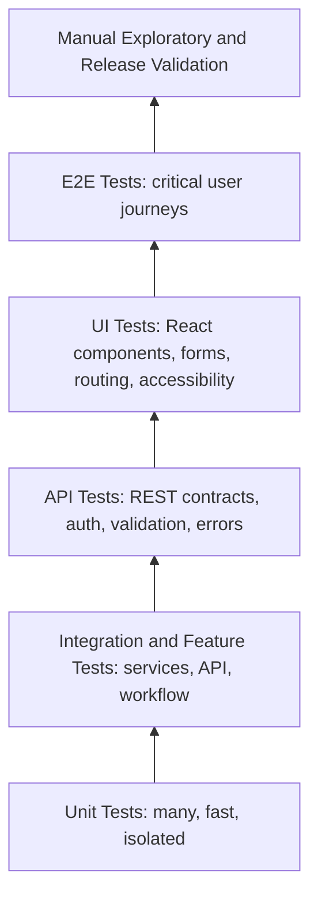
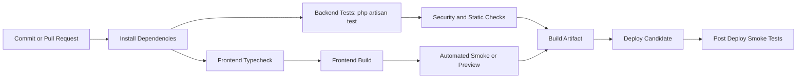

# ReportFlow Testing Strategy

## Professional Cover Page

| Field | Value |
| --- | --- |
| Product | ReportFlow |
| Product Type | Enterprise SaaS Platform |
| Document | Quality Assurance and Testing Strategy |
| Version | 1.0.0 |
| Owner | Quality Engineering / SDET Leadership |
| Executive Sponsor | CTO / Engineering Leadership |
| Status | Official Testing Standard |
| Last Updated | 2026-07-08 |
| Backend Stack | Laravel 13, PHP 8.3, REST API, Sanctum, Spatie Permission, Spatie Activity Log, Filament |
| Frontend Stack | React, TypeScript, React Query, React Hook Form, Zod, TailwindCSS |
| Platform Stack | Docker, Laravel Sail |
| Official Local Development URL | http://localhost:8081 |

## Document Control

| Attribute | Value |
| --- | --- |
| Purpose | Define the official testing standard for ReportFlow. |
| Scope | Backend, frontend, API, workflow, security, accessibility, performance, browser, responsive, regression, smoke, release, and future QA improvements. |
| Reference Documents | PRODUCT_REQUIREMENTS_DOCUMENT.md, PRODUCT_BACKLOG.md, ENGINEERING_STANDARDS.md, RELEASE_1_0_CHECKLIST.md. |
| Reference Gap | No standalone RELEASE_1_0_CHECKLIST.md was found during preparation; this strategy aligns to Engineering Standards release requirements and Product Backlog release readiness until that file exists. |
| Quality Gate | A feature is not accepted until tests, validation, build, accessibility, responsiveness, security, and documentation requirements are satisfied. |

## Revision History

| Version | Date | Author | Description | Status |
| --- | --- | --- | --- | --- |
| 1.0.0 | 2026-07-08 | Principal QA Engineering / Codex | Initial enterprise-grade testing strategy aligned with ReportFlow PRD, backlog, engineering standards, and release readiness criteria. | Active |

## Approval Table

| Role | Name | Approval Status | Date | Notes |
| --- | --- | --- | --- | --- |
| QA Lead | TBD | Pending | TBD | Owns test strategy execution and quality gates. |
| CTO | TBD | Pending | TBD | Approves release quality posture. |
| Engineering Lead | TBD | Pending | TBD | Owns implementation compliance. |
| Product Owner | TBD | Pending | TBD | Approves acceptance criteria and release scope. |
| Security Owner | TBD | Pending | TBD | Approves security testing strategy. |
| DevOps Owner | TBD | Pending | TBD | Owns CI/CD and deployment validation. |

## Table of Contents

1. [Testing Vision](#1-testing-vision)
2. [Testing Pyramid](#2-testing-pyramid)
3. [Backend Testing](#3-backend-testing)
4. [Frontend Testing](#4-frontend-testing)
5. [API Testing](#5-api-testing)
6. [Workflow Testing](#6-workflow-testing)
7. [Security Testing](#7-security-testing)
8. [Performance Testing](#8-performance-testing)
9. [Accessibility Testing](#9-accessibility-testing)
10. [Browser Compatibility](#10-browser-compatibility)
11. [Responsive Testing](#11-responsive-testing)
12. [Regression Testing](#12-regression-testing)
13. [Smoke Testing](#13-smoke-testing)
14. [Test Data Management](#14-test-data-management)
15. [Coverage Matrix](#15-coverage-matrix)
16. [Definition of Done](#16-definition-of-done)
17. [CI/CD Testing](#17-ci-cd-testing)
18. [Release Validation](#18-release-validation)
19. [Test Checklists](#19-test-checklists)
20. [Future Improvements](#20-future-improvements)

---

# 1. Testing Vision

## 1.1 Purpose

The ReportFlow Testing Strategy defines how the team verifies that ReportFlow is reliable, secure, accessible, performant, maintainable, and ready for enterprise users. It converts product requirements, backlog commitments, and engineering standards into a repeatable quality system.

## 1.2 Objectives

- Protect core business workflows: authentication, dashboard, reports, workflow, employees, notifications, analytics, settings, profile, AI, PowerPoint, audit logs, and PWA readiness.
- Validate Laravel backend behavior through unit, feature, authorization, validation, resource, notification, queue, service, and workflow tests.
- Validate React frontend behavior through type safety, build safety, component behavior, hook behavior, form behavior, routing, state, theme, accessibility, and browser compatibility.
- Validate REST API behavior for authentication, authorization, CRUD, pagination, filtering, sorting, validation, errors, security, and rate limiting.
- Make regressions visible before release through automated checks, smoke tests, manual QA, release validation, and CI/CD gates.
- Align every test activity with the PRD, Product Backlog, Engineering Standards, and Release 1.0 readiness expectations.

## 1.3 Quality Philosophy

| Principle | Meaning for ReportFlow |
| --- | --- |
| Behavior over implementation | Tests should verify user-visible and API-visible behavior, not fragile implementation details. |
| Backend authority | Backend tests prove authorization, validation, workflow state, resources, activity logs, and integrations. |
| Frontend confidence | Frontend tests prove critical UI behavior, permissions, forms, routing, query states, accessibility, and responsive behavior. |
| No production mocks | Business feature validation must use real backend contracts and realistic test data. |
| Shift left | Quality starts in requirements, acceptance criteria, schema design, API contracts, and component design. |
| Risk based testing | Critical workflows receive deeper coverage than low-risk cosmetic areas. |
| Release evidence | Release decisions require command output, test results, checklists, screenshots where relevant, and known issue signoff. |

## 1.4 Definition of Quality

| Quality Attribute | Definition |
| --- | --- |
| Functional correctness | Features satisfy PRD requirements and accepted backlog stories. |
| Reliability | Core workflows behave consistently under expected conditions and recover gracefully from errors. |
| Security | Authentication, authorization, input validation, data minimization, secrets, tokens, and OWASP risks are validated. |
| Accessibility | Critical workflows are keyboard accessible, screen-reader friendly, contrast-safe, and focus-visible. |
| Performance | Frontend, backend, API, database, bundles, queries, caching, and rendering meet enterprise usability expectations. |
| Maintainability | Tests are deterministic, readable, isolated, meaningful, and aligned to engineering standards. |
| Release readiness | A release is acceptable only when automated checks, manual QA, regression, smoke, security, docs, and operational validation pass. |

# 2. Testing Pyramid

## 2.1 Pyramid Overview

## 2.2 Test Layer Strategy

| Layer | Purpose | Primary Tools | Coverage Target | Examples |
| --- | --- | --- | --- | --- |
| Unit Tests | Verify isolated business logic and pure behavior. | PHPUnit, future Vitest | High for critical services and utilities | Enums, DTOs, workflow rules, formatters, validators. |
| Integration Tests | Verify layers work together without full browser flows. | PHPUnit, future React Testing Library | High for critical modules | Service plus model, form plus API service, mutation plus cache invalidation. |
| Feature Tests | Verify Laravel HTTP behavior and protected resources. | PHPUnit Feature Tests | High for API and workflow | GET reports, POST employee, submit report, reject report. |
| API Tests | Verify REST contracts, auth, validation, pagination, filters, sorting, and errors. | PHPUnit, future Postman/Newman or contract tests | High for public API surface | 401, 403, 422, 404, pagination meta, filter results. |
| UI Tests | Verify React components, forms, pages, route guards, and states. | Future Vitest, React Testing Library, Playwright CT | Targeted for regression-prone UI | Form validation, permission visibility, error states. |
| E2E Tests | Verify user journeys in a browser. | Future Playwright or Cypress | Critical journeys only | Login, dashboard load, create report, approve report, employee detail. |
| Manual Tests | Explore user experience, edge cases, visual quality, accessibility, and release confidence. | QA checklist, browser devtools, screen readers | Every release candidate | Dark mode, mobile drawer, keyboard flow, workflow conflicts. |

## 2.3 Pyramid Ownership

| Layer | Primary Owner | Secondary Owner | Gate |
| --- | --- | --- | --- |
| Unit | Developers | SDET | Pull request. |
| Integration | Developers | SDET | Pull request and sprint acceptance. |
| Feature/API | Backend engineers | QA Lead | Pull request and release candidate. |
| UI | Frontend engineers | QA Lead | Sprint acceptance. |
| E2E | SDET / QA automation | Frontend and backend leads | Regression and release candidate. |
| Manual | QA Lead | Product Owner | Sprint review and release candidate. |

# 3. Backend Testing

ReportFlow backend testing validates Laravel 13, PHP 8.3, REST API behavior, Sanctum authentication, Spatie Permission authorization, Spatie Activity Log auditability, Filament-adjacent administrative behavior, services, notifications, queues, mail, PowerPoint generation, AI services, and workflow state transitions.

## 3.1 Backend Coverage Areas

| Area | Testing Responsibility |
| --- | --- |
| Laravel Feature Tests | HTTP behavior, middleware, policies, validation, resources, database persistence, and response status codes. |
| PHPUnit Unit Tests | Enums, DTOs, pure services, workflow rules, mappers, and calculation utilities. |
| Policies | Guest, authenticated, role-based, ownership, team, admin, and forbidden access behavior. |
| Requests | Required fields, formats, nullable values, enum values, filters, sorts, and malicious input. |
| Resources | Response shape, nullable fields, nested relationships, permission flags, and data minimization. |
| Services | Workflow services, AI services, presentation generation, mail services, activity services, and validation services. |
| Notifications | Submitted, manager-approved, final-approved, rejected, due, overdue, and export-ready events. |
| Queues and Jobs | Queued notifications, AI operations, export generation, retries, failures, and idempotency. |
| Mail | Validated report, rejected report, reminders, and failure-safe rendering. |
| PowerPoint | Generation service, template data, binary output, authorization, errors, and performance. |
| AI Services | Provider failure, prompt safety, no direct secrets, timeout handling, redaction, and editable output. |
| Workflow | State machine, state transitions, forbidden transitions, timestamps, actors, activity logs, and notifications. |

## 3.2 Backend Test Matrix

| Test ID | Module | Backend Area | Coverage Level | Scope |
| --- | --- | --- | --- | --- |
| BE-AUTH-LARAVEL-FEAT | Authentication | Laravel Feature Tests | Required | HTTP behavior, middleware, policies, validation, resources, database persistence, and response status codes. |
| BE-AUTH-PHPUNIT-UNIT | Authentication | PHPUnit Unit Tests | Required | Enums, DTOs, pure services, workflow rules, mappers, and calculation utilities. |
| BE-AUTH-POLICIES | Authentication | Policies | Required | Guest, authenticated, role-based, ownership, team, admin, and forbidden access behavior. |
| BE-AUTH-REQUESTS | Authentication | Requests | Required | Required fields, formats, nullable values, enum values, filters, sorts, and malicious input. |
| BE-AUTH-RESOURCES | Authentication | Resources | Required | Response shape, nullable fields, nested relationships, permission flags, and data minimization. |
| BE-AUTH-SERVICES | Authentication | Services | Required | Workflow services, AI services, presentation generation, mail services, activity services, and validation services. |
| BE-AUTH-NOTIFICATION | Authentication | Notifications | Required | Submitted, manager-approved, final-approved, rejected, due, overdue, and export-ready events. |
| BE-AUTH-QUEUES-AND-J | Authentication | Queues and Jobs | Required | Queued notifications, AI operations, export generation, retries, failures, and idempotency. |
| BE-AUTH-MAIL | Authentication | Mail | Required | Validated report, rejected report, reminders, and failure-safe rendering. |
| BE-AUTH-POWERPOINT | Authentication | PowerPoint | Required | Generation service, template data, binary output, authorization, errors, and performance. |
| BE-AUTH-AI-SERVICES | Authentication | AI Services | Required | Provider failure, prompt safety, no direct secrets, timeout handling, redaction, and editable output. |
| BE-AUTH-WORKFLOW | Authentication | Workflow | Required | State machine, state transitions, forbidden transitions, timestamps, actors, activity logs, and notifications. |
| BE-DASH-LARAVEL-FEAT | Dashboard | Laravel Feature Tests | Required | HTTP behavior, middleware, policies, validation, resources, database persistence, and response status codes. |
| BE-DASH-PHPUNIT-UNIT | Dashboard | PHPUnit Unit Tests | Required | Enums, DTOs, pure services, workflow rules, mappers, and calculation utilities. |
| BE-DASH-POLICIES | Dashboard | Policies | Required | Guest, authenticated, role-based, ownership, team, admin, and forbidden access behavior. |
| BE-DASH-REQUESTS | Dashboard | Requests | Required | Required fields, formats, nullable values, enum values, filters, sorts, and malicious input. |
| BE-DASH-RESOURCES | Dashboard | Resources | Required | Response shape, nullable fields, nested relationships, permission flags, and data minimization. |
| BE-DASH-SERVICES | Dashboard | Services | Required | Workflow services, AI services, presentation generation, mail services, activity services, and validation services. |
| BE-DASH-NOTIFICATION | Dashboard | Notifications | Required | Submitted, manager-approved, final-approved, rejected, due, overdue, and export-ready events. |
| BE-DASH-QUEUES-AND-J | Dashboard | Queues and Jobs | Required | Queued notifications, AI operations, export generation, retries, failures, and idempotency. |
| BE-DASH-MAIL | Dashboard | Mail | Required | Validated report, rejected report, reminders, and failure-safe rendering. |
| BE-DASH-POWERPOINT | Dashboard | PowerPoint | Required | Generation service, template data, binary output, authorization, errors, and performance. |
| BE-DASH-AI-SERVICES | Dashboard | AI Services | Required | Provider failure, prompt safety, no direct secrets, timeout handling, redaction, and editable output. |
| BE-DASH-WORKFLOW | Dashboard | Workflow | Required | State machine, state transitions, forbidden transitions, timestamps, actors, activity logs, and notifications. |
| BE-REP-LARAVEL-FEAT | Reports | Laravel Feature Tests | Required | HTTP behavior, middleware, policies, validation, resources, database persistence, and response status codes. |
| BE-REP-PHPUNIT-UNIT | Reports | PHPUnit Unit Tests | Required | Enums, DTOs, pure services, workflow rules, mappers, and calculation utilities. |
| BE-REP-POLICIES | Reports | Policies | Required | Guest, authenticated, role-based, ownership, team, admin, and forbidden access behavior. |
| BE-REP-REQUESTS | Reports | Requests | Required | Required fields, formats, nullable values, enum values, filters, sorts, and malicious input. |
| BE-REP-RESOURCES | Reports | Resources | Required | Response shape, nullable fields, nested relationships, permission flags, and data minimization. |
| BE-REP-SERVICES | Reports | Services | Required | Workflow services, AI services, presentation generation, mail services, activity services, and validation services. |
| BE-REP-NOTIFICATION | Reports | Notifications | Required | Submitted, manager-approved, final-approved, rejected, due, overdue, and export-ready events. |
| BE-REP-QUEUES-AND-J | Reports | Queues and Jobs | Required | Queued notifications, AI operations, export generation, retries, failures, and idempotency. |
| BE-REP-MAIL | Reports | Mail | Required | Validated report, rejected report, reminders, and failure-safe rendering. |
| BE-REP-POWERPOINT | Reports | PowerPoint | Required | Generation service, template data, binary output, authorization, errors, and performance. |
| BE-REP-AI-SERVICES | Reports | AI Services | Required | Provider failure, prompt safety, no direct secrets, timeout handling, redaction, and editable output. |
| BE-REP-WORKFLOW | Reports | Workflow | Required | State machine, state transitions, forbidden transitions, timestamps, actors, activity logs, and notifications. |
| BE-WF-LARAVEL-FEAT | Workflow | Laravel Feature Tests | Required | HTTP behavior, middleware, policies, validation, resources, database persistence, and response status codes. |
| BE-WF-PHPUNIT-UNIT | Workflow | PHPUnit Unit Tests | Required | Enums, DTOs, pure services, workflow rules, mappers, and calculation utilities. |
| BE-WF-POLICIES | Workflow | Policies | Required | Guest, authenticated, role-based, ownership, team, admin, and forbidden access behavior. |
| BE-WF-REQUESTS | Workflow | Requests | Required | Required fields, formats, nullable values, enum values, filters, sorts, and malicious input. |
| BE-WF-RESOURCES | Workflow | Resources | Required | Response shape, nullable fields, nested relationships, permission flags, and data minimization. |
| BE-WF-SERVICES | Workflow | Services | Required | Workflow services, AI services, presentation generation, mail services, activity services, and validation services. |
| BE-WF-NOTIFICATION | Workflow | Notifications | Required | Submitted, manager-approved, final-approved, rejected, due, overdue, and export-ready events. |
| BE-WF-QUEUES-AND-J | Workflow | Queues and Jobs | Required | Queued notifications, AI operations, export generation, retries, failures, and idempotency. |
| BE-WF-MAIL | Workflow | Mail | Required | Validated report, rejected report, reminders, and failure-safe rendering. |
| BE-WF-POWERPOINT | Workflow | PowerPoint | Required | Generation service, template data, binary output, authorization, errors, and performance. |
| BE-WF-AI-SERVICES | Workflow | AI Services | Required | Provider failure, prompt safety, no direct secrets, timeout handling, redaction, and editable output. |
| BE-WF-WORKFLOW | Workflow | Workflow | Required | State machine, state transitions, forbidden transitions, timestamps, actors, activity logs, and notifications. |
| BE-EMP-LARAVEL-FEAT | Employees | Laravel Feature Tests | Required | HTTP behavior, middleware, policies, validation, resources, database persistence, and response status codes. |
| BE-EMP-PHPUNIT-UNIT | Employees | PHPUnit Unit Tests | Required | Enums, DTOs, pure services, workflow rules, mappers, and calculation utilities. |
| BE-EMP-POLICIES | Employees | Policies | Required | Guest, authenticated, role-based, ownership, team, admin, and forbidden access behavior. |
| BE-EMP-REQUESTS | Employees | Requests | Required | Required fields, formats, nullable values, enum values, filters, sorts, and malicious input. |
| BE-EMP-RESOURCES | Employees | Resources | Required | Response shape, nullable fields, nested relationships, permission flags, and data minimization. |
| BE-EMP-SERVICES | Employees | Services | Required | Workflow services, AI services, presentation generation, mail services, activity services, and validation services. |
| BE-EMP-NOTIFICATION | Employees | Notifications | Required | Submitted, manager-approved, final-approved, rejected, due, overdue, and export-ready events. |
| BE-EMP-QUEUES-AND-J | Employees | Queues and Jobs | Required | Queued notifications, AI operations, export generation, retries, failures, and idempotency. |
| BE-EMP-MAIL | Employees | Mail | Required | Validated report, rejected report, reminders, and failure-safe rendering. |
| BE-EMP-POWERPOINT | Employees | PowerPoint | Required | Generation service, template data, binary output, authorization, errors, and performance. |
| BE-EMP-AI-SERVICES | Employees | AI Services | Required | Provider failure, prompt safety, no direct secrets, timeout handling, redaction, and editable output. |
| BE-EMP-WORKFLOW | Employees | Workflow | Required | State machine, state transitions, forbidden transitions, timestamps, actors, activity logs, and notifications. |
| BE-NOTIF-LARAVEL-FEAT | Notifications | Laravel Feature Tests | Required | HTTP behavior, middleware, policies, validation, resources, database persistence, and response status codes. |
| BE-NOTIF-PHPUNIT-UNIT | Notifications | PHPUnit Unit Tests | Required | Enums, DTOs, pure services, workflow rules, mappers, and calculation utilities. |
| BE-NOTIF-POLICIES | Notifications | Policies | Required | Guest, authenticated, role-based, ownership, team, admin, and forbidden access behavior. |
| BE-NOTIF-REQUESTS | Notifications | Requests | Required | Required fields, formats, nullable values, enum values, filters, sorts, and malicious input. |
| BE-NOTIF-RESOURCES | Notifications | Resources | Required | Response shape, nullable fields, nested relationships, permission flags, and data minimization. |
| BE-NOTIF-SERVICES | Notifications | Services | Required | Workflow services, AI services, presentation generation, mail services, activity services, and validation services. |
| BE-NOTIF-NOTIFICATION | Notifications | Notifications | Required | Submitted, manager-approved, final-approved, rejected, due, overdue, and export-ready events. |
| BE-NOTIF-QUEUES-AND-J | Notifications | Queues and Jobs | Required | Queued notifications, AI operations, export generation, retries, failures, and idempotency. |
| BE-NOTIF-MAIL | Notifications | Mail | Required | Validated report, rejected report, reminders, and failure-safe rendering. |
| BE-NOTIF-POWERPOINT | Notifications | PowerPoint | Required | Generation service, template data, binary output, authorization, errors, and performance. |
| BE-NOTIF-AI-SERVICES | Notifications | AI Services | Required | Provider failure, prompt safety, no direct secrets, timeout handling, redaction, and editable output. |
| BE-NOTIF-WORKFLOW | Notifications | Workflow | Required | State machine, state transitions, forbidden transitions, timestamps, actors, activity logs, and notifications. |
| BE-ANA-LARAVEL-FEAT | Analytics | Laravel Feature Tests | Required | HTTP behavior, middleware, policies, validation, resources, database persistence, and response status codes. |
| BE-ANA-PHPUNIT-UNIT | Analytics | PHPUnit Unit Tests | Required | Enums, DTOs, pure services, workflow rules, mappers, and calculation utilities. |
| BE-ANA-POLICIES | Analytics | Policies | Required | Guest, authenticated, role-based, ownership, team, admin, and forbidden access behavior. |
| BE-ANA-REQUESTS | Analytics | Requests | Required | Required fields, formats, nullable values, enum values, filters, sorts, and malicious input. |
| BE-ANA-RESOURCES | Analytics | Resources | Required | Response shape, nullable fields, nested relationships, permission flags, and data minimization. |
| BE-ANA-SERVICES | Analytics | Services | Required | Workflow services, AI services, presentation generation, mail services, activity services, and validation services. |
| BE-ANA-NOTIFICATION | Analytics | Notifications | Required | Submitted, manager-approved, final-approved, rejected, due, overdue, and export-ready events. |
| BE-ANA-QUEUES-AND-J | Analytics | Queues and Jobs | Required | Queued notifications, AI operations, export generation, retries, failures, and idempotency. |
| BE-ANA-MAIL | Analytics | Mail | Required | Validated report, rejected report, reminders, and failure-safe rendering. |
| BE-ANA-POWERPOINT | Analytics | PowerPoint | Required | Generation service, template data, binary output, authorization, errors, and performance. |
| BE-ANA-AI-SERVICES | Analytics | AI Services | Required | Provider failure, prompt safety, no direct secrets, timeout handling, redaction, and editable output. |
| BE-ANA-WORKFLOW | Analytics | Workflow | Required | State machine, state transitions, forbidden transitions, timestamps, actors, activity logs, and notifications. |
| BE-ADMIN-LARAVEL-FEAT | Administration | Laravel Feature Tests | Required | HTTP behavior, middleware, policies, validation, resources, database persistence, and response status codes. |
| BE-ADMIN-PHPUNIT-UNIT | Administration | PHPUnit Unit Tests | Required | Enums, DTOs, pure services, workflow rules, mappers, and calculation utilities. |
| BE-ADMIN-POLICIES | Administration | Policies | Required | Guest, authenticated, role-based, ownership, team, admin, and forbidden access behavior. |
| BE-ADMIN-REQUESTS | Administration | Requests | Required | Required fields, formats, nullable values, enum values, filters, sorts, and malicious input. |
| BE-ADMIN-RESOURCES | Administration | Resources | Required | Response shape, nullable fields, nested relationships, permission flags, and data minimization. |
| BE-ADMIN-SERVICES | Administration | Services | Required | Workflow services, AI services, presentation generation, mail services, activity services, and validation services. |
| BE-ADMIN-NOTIFICATION | Administration | Notifications | Required | Submitted, manager-approved, final-approved, rejected, due, overdue, and export-ready events. |
| BE-ADMIN-QUEUES-AND-J | Administration | Queues and Jobs | Required | Queued notifications, AI operations, export generation, retries, failures, and idempotency. |
| BE-ADMIN-MAIL | Administration | Mail | Required | Validated report, rejected report, reminders, and failure-safe rendering. |
| BE-ADMIN-POWERPOINT | Administration | PowerPoint | Required | Generation service, template data, binary output, authorization, errors, and performance. |
| BE-ADMIN-AI-SERVICES | Administration | AI Services | Required | Provider failure, prompt safety, no direct secrets, timeout handling, redaction, and editable output. |
| BE-ADMIN-WORKFLOW | Administration | Workflow | Required | State machine, state transitions, forbidden transitions, timestamps, actors, activity logs, and notifications. |
| BE-SET-LARAVEL-FEAT | Settings | Laravel Feature Tests | Required | HTTP behavior, middleware, policies, validation, resources, database persistence, and response status codes. |
| BE-SET-PHPUNIT-UNIT | Settings | PHPUnit Unit Tests | Required | Enums, DTOs, pure services, workflow rules, mappers, and calculation utilities. |
| BE-SET-POLICIES | Settings | Policies | Required | Guest, authenticated, role-based, ownership, team, admin, and forbidden access behavior. |
| BE-SET-REQUESTS | Settings | Requests | Required | Required fields, formats, nullable values, enum values, filters, sorts, and malicious input. |
| BE-SET-RESOURCES | Settings | Resources | Required | Response shape, nullable fields, nested relationships, permission flags, and data minimization. |
| BE-SET-SERVICES | Settings | Services | Required | Workflow services, AI services, presentation generation, mail services, activity services, and validation services. |
| BE-SET-NOTIFICATION | Settings | Notifications | Required | Submitted, manager-approved, final-approved, rejected, due, overdue, and export-ready events. |
| BE-SET-QUEUES-AND-J | Settings | Queues and Jobs | Required | Queued notifications, AI operations, export generation, retries, failures, and idempotency. |
| BE-SET-MAIL | Settings | Mail | Required | Validated report, rejected report, reminders, and failure-safe rendering. |
| BE-SET-POWERPOINT | Settings | PowerPoint | Required | Generation service, template data, binary output, authorization, errors, and performance. |
| BE-SET-AI-SERVICES | Settings | AI Services | Required | Provider failure, prompt safety, no direct secrets, timeout handling, redaction, and editable output. |
| BE-SET-WORKFLOW | Settings | Workflow | Required | State machine, state transitions, forbidden transitions, timestamps, actors, activity logs, and notifications. |
| BE-PROF-LARAVEL-FEAT | Profile | Laravel Feature Tests | Required | HTTP behavior, middleware, policies, validation, resources, database persistence, and response status codes. |
| BE-PROF-PHPUNIT-UNIT | Profile | PHPUnit Unit Tests | Required | Enums, DTOs, pure services, workflow rules, mappers, and calculation utilities. |
| BE-PROF-POLICIES | Profile | Policies | Required | Guest, authenticated, role-based, ownership, team, admin, and forbidden access behavior. |
| BE-PROF-REQUESTS | Profile | Requests | Required | Required fields, formats, nullable values, enum values, filters, sorts, and malicious input. |
| BE-PROF-RESOURCES | Profile | Resources | Required | Response shape, nullable fields, nested relationships, permission flags, and data minimization. |
| BE-PROF-SERVICES | Profile | Services | Required | Workflow services, AI services, presentation generation, mail services, activity services, and validation services. |
| BE-PROF-NOTIFICATION | Profile | Notifications | Required | Submitted, manager-approved, final-approved, rejected, due, overdue, and export-ready events. |
| BE-PROF-QUEUES-AND-J | Profile | Queues and Jobs | Required | Queued notifications, AI operations, export generation, retries, failures, and idempotency. |
| BE-PROF-MAIL | Profile | Mail | Required | Validated report, rejected report, reminders, and failure-safe rendering. |
| BE-PROF-POWERPOINT | Profile | PowerPoint | Required | Generation service, template data, binary output, authorization, errors, and performance. |
| BE-PROF-AI-SERVICES | Profile | AI Services | Required | Provider failure, prompt safety, no direct secrets, timeout handling, redaction, and editable output. |
| BE-PROF-WORKFLOW | Profile | Workflow | Required | State machine, state transitions, forbidden transitions, timestamps, actors, activity logs, and notifications. |
| BE-AI-LARAVEL-FEAT | AI Assistant | Laravel Feature Tests | Required | HTTP behavior, middleware, policies, validation, resources, database persistence, and response status codes. |
| BE-AI-PHPUNIT-UNIT | AI Assistant | PHPUnit Unit Tests | Required | Enums, DTOs, pure services, workflow rules, mappers, and calculation utilities. |
| BE-AI-POLICIES | AI Assistant | Policies | Required | Guest, authenticated, role-based, ownership, team, admin, and forbidden access behavior. |
| BE-AI-REQUESTS | AI Assistant | Requests | Required | Required fields, formats, nullable values, enum values, filters, sorts, and malicious input. |
| BE-AI-RESOURCES | AI Assistant | Resources | Required | Response shape, nullable fields, nested relationships, permission flags, and data minimization. |
| BE-AI-SERVICES | AI Assistant | Services | Required | Workflow services, AI services, presentation generation, mail services, activity services, and validation services. |
| BE-AI-NOTIFICATION | AI Assistant | Notifications | Required | Submitted, manager-approved, final-approved, rejected, due, overdue, and export-ready events. |
| BE-AI-QUEUES-AND-J | AI Assistant | Queues and Jobs | Required | Queued notifications, AI operations, export generation, retries, failures, and idempotency. |
| BE-AI-MAIL | AI Assistant | Mail | Required | Validated report, rejected report, reminders, and failure-safe rendering. |
| BE-AI-POWERPOINT | AI Assistant | PowerPoint | Required | Generation service, template data, binary output, authorization, errors, and performance. |
| BE-AI-AI-SERVICES | AI Assistant | AI Services | Required | Provider failure, prompt safety, no direct secrets, timeout handling, redaction, and editable output. |
| BE-AI-WORKFLOW | AI Assistant | Workflow | Required | State machine, state transitions, forbidden transitions, timestamps, actors, activity logs, and notifications. |
| BE-PPT-LARAVEL-FEAT | PowerPoint | Laravel Feature Tests | Required | HTTP behavior, middleware, policies, validation, resources, database persistence, and response status codes. |
| BE-PPT-PHPUNIT-UNIT | PowerPoint | PHPUnit Unit Tests | Required | Enums, DTOs, pure services, workflow rules, mappers, and calculation utilities. |
| BE-PPT-POLICIES | PowerPoint | Policies | Required | Guest, authenticated, role-based, ownership, team, admin, and forbidden access behavior. |
| BE-PPT-REQUESTS | PowerPoint | Requests | Required | Required fields, formats, nullable values, enum values, filters, sorts, and malicious input. |
| BE-PPT-RESOURCES | PowerPoint | Resources | Required | Response shape, nullable fields, nested relationships, permission flags, and data minimization. |
| BE-PPT-SERVICES | PowerPoint | Services | Required | Workflow services, AI services, presentation generation, mail services, activity services, and validation services. |
| BE-PPT-NOTIFICATION | PowerPoint | Notifications | Required | Submitted, manager-approved, final-approved, rejected, due, overdue, and export-ready events. |
| BE-PPT-QUEUES-AND-J | PowerPoint | Queues and Jobs | Required | Queued notifications, AI operations, export generation, retries, failures, and idempotency. |
| BE-PPT-MAIL | PowerPoint | Mail | Required | Validated report, rejected report, reminders, and failure-safe rendering. |
| BE-PPT-POWERPOINT | PowerPoint | PowerPoint | Required | Generation service, template data, binary output, authorization, errors, and performance. |
| BE-PPT-AI-SERVICES | PowerPoint | AI Services | Required | Provider failure, prompt safety, no direct secrets, timeout handling, redaction, and editable output. |
| BE-PPT-WORKFLOW | PowerPoint | Workflow | Required | State machine, state transitions, forbidden transitions, timestamps, actors, activity logs, and notifications. |
| BE-AUD-LARAVEL-FEAT | Audit Logs | Laravel Feature Tests | Required | HTTP behavior, middleware, policies, validation, resources, database persistence, and response status codes. |
| BE-AUD-PHPUNIT-UNIT | Audit Logs | PHPUnit Unit Tests | Required | Enums, DTOs, pure services, workflow rules, mappers, and calculation utilities. |
| BE-AUD-POLICIES | Audit Logs | Policies | Required | Guest, authenticated, role-based, ownership, team, admin, and forbidden access behavior. |
| BE-AUD-REQUESTS | Audit Logs | Requests | Required | Required fields, formats, nullable values, enum values, filters, sorts, and malicious input. |
| BE-AUD-RESOURCES | Audit Logs | Resources | Required | Response shape, nullable fields, nested relationships, permission flags, and data minimization. |
| BE-AUD-SERVICES | Audit Logs | Services | Required | Workflow services, AI services, presentation generation, mail services, activity services, and validation services. |
| BE-AUD-NOTIFICATION | Audit Logs | Notifications | Required | Submitted, manager-approved, final-approved, rejected, due, overdue, and export-ready events. |
| BE-AUD-QUEUES-AND-J | Audit Logs | Queues and Jobs | Required | Queued notifications, AI operations, export generation, retries, failures, and idempotency. |
| BE-AUD-MAIL | Audit Logs | Mail | Required | Validated report, rejected report, reminders, and failure-safe rendering. |
| BE-AUD-POWERPOINT | Audit Logs | PowerPoint | Required | Generation service, template data, binary output, authorization, errors, and performance. |
| BE-AUD-AI-SERVICES | Audit Logs | AI Services | Required | Provider failure, prompt safety, no direct secrets, timeout handling, redaction, and editable output. |
| BE-AUD-WORKFLOW | Audit Logs | Workflow | Required | State machine, state transitions, forbidden transitions, timestamps, actors, activity logs, and notifications. |
| BE-PWA-LARAVEL-FEAT | PWA | Laravel Feature Tests | Conditional | HTTP behavior, middleware, policies, validation, resources, database persistence, and response status codes. |
| BE-PWA-PHPUNIT-UNIT | PWA | PHPUnit Unit Tests | Conditional | Enums, DTOs, pure services, workflow rules, mappers, and calculation utilities. |
| BE-PWA-POLICIES | PWA | Policies | Conditional | Guest, authenticated, role-based, ownership, team, admin, and forbidden access behavior. |
| BE-PWA-REQUESTS | PWA | Requests | Conditional | Required fields, formats, nullable values, enum values, filters, sorts, and malicious input. |
| BE-PWA-RESOURCES | PWA | Resources | Conditional | Response shape, nullable fields, nested relationships, permission flags, and data minimization. |
| BE-PWA-SERVICES | PWA | Services | Conditional | Workflow services, AI services, presentation generation, mail services, activity services, and validation services. |
| BE-PWA-NOTIFICATION | PWA | Notifications | Conditional | Submitted, manager-approved, final-approved, rejected, due, overdue, and export-ready events. |
| BE-PWA-QUEUES-AND-J | PWA | Queues and Jobs | Conditional | Queued notifications, AI operations, export generation, retries, failures, and idempotency. |
| BE-PWA-MAIL | PWA | Mail | Conditional | Validated report, rejected report, reminders, and failure-safe rendering. |
| BE-PWA-POWERPOINT | PWA | PowerPoint | Conditional | Generation service, template data, binary output, authorization, errors, and performance. |
| BE-PWA-AI-SERVICES | PWA | AI Services | Conditional | Provider failure, prompt safety, no direct secrets, timeout handling, redaction, and editable output. |
| BE-PWA-WORKFLOW | PWA | Workflow | Conditional | State machine, state transitions, forbidden transitions, timestamps, actors, activity logs, and notifications. |

## 3.3 Laravel Feature Test Requirements

- [ ] Every protected endpoint must test unauthenticated guest access.
- [ ] Every protected endpoint must test forbidden role or permission access.
- [ ] Every mutation endpoint must test validation errors.
- [ ] Every mutation endpoint must test successful persistence or state change.
- [ ] Every list endpoint must test pagination metadata.
- [ ] Every searchable endpoint must test search behavior.
- [ ] Every filterable endpoint must test supported filters and invalid filters.
- [ ] Every sortable endpoint must test supported sorts and rejected unsafe sorts.
- [ ] Every workflow endpoint must test valid and invalid state transitions.
- [ ] Every activity-producing action must test activity log creation when backend supports it.

## 3.4 Backend Test Case Catalogue

### Authentication Backend Tests

| Test Case ID | Scenario | Expected Result | Priority |
| --- | --- | --- | --- |
| BE-AUTH-001 | Authentication happy path request succeeds. | Expected status code, resource shape, and persisted or returned data are correct. | Critical |
| BE-AUTH-002 | Authentication guest access is rejected where protected. | Unauthenticated request returns 401 or configured guest response. | Critical |
| BE-AUTH-003 | Authentication forbidden role is rejected. | Unauthorized role receives 403 and no mutation occurs. | Critical |
| BE-AUTH-004 | Authentication validation errors are returned. | Invalid input returns 422 with field-level errors. | Critical |
| BE-AUTH-005 | Authentication not found behavior is safe. | Missing resource returns 404 without leaking data. | High |
| BE-AUTH-006 | Authentication activity logging is correct when applicable. | Actor, subject, action, timestamp, and metadata are recorded safely. | High |
| BE-AUTH-007 | Authentication notification, mail, queue, or job side effects are safe when applicable. | Expected side effects occur or are explicitly not applicable. | Medium |
| BE-AUTH-008 | Authentication service-level error handling is deterministic. | Known failures return safe responses and do not corrupt state. | High |

### Dashboard Backend Tests

| Test Case ID | Scenario | Expected Result | Priority |
| --- | --- | --- | --- |
| BE-DASH-001 | Dashboard happy path request succeeds. | Expected status code, resource shape, and persisted or returned data are correct. | Critical |
| BE-DASH-002 | Dashboard guest access is rejected where protected. | Unauthenticated request returns 401 or configured guest response. | Critical |
| BE-DASH-003 | Dashboard forbidden role is rejected. | Unauthorized role receives 403 and no mutation occurs. | Critical |
| BE-DASH-004 | Dashboard validation errors are returned. | Invalid input returns 422 with field-level errors. | Critical |
| BE-DASH-005 | Dashboard not found behavior is safe. | Missing resource returns 404 without leaking data. | High |
| BE-DASH-006 | Dashboard activity logging is correct when applicable. | Actor, subject, action, timestamp, and metadata are recorded safely. | High |
| BE-DASH-007 | Dashboard notification, mail, queue, or job side effects are safe when applicable. | Expected side effects occur or are explicitly not applicable. | Medium |
| BE-DASH-008 | Dashboard service-level error handling is deterministic. | Known failures return safe responses and do not corrupt state. | High |

### Reports Backend Tests

| Test Case ID | Scenario | Expected Result | Priority |
| --- | --- | --- | --- |
| BE-REP-001 | Reports happy path request succeeds. | Expected status code, resource shape, and persisted or returned data are correct. | Critical |
| BE-REP-002 | Reports guest access is rejected where protected. | Unauthenticated request returns 401 or configured guest response. | Critical |
| BE-REP-003 | Reports forbidden role is rejected. | Unauthorized role receives 403 and no mutation occurs. | Critical |
| BE-REP-004 | Reports validation errors are returned. | Invalid input returns 422 with field-level errors. | Critical |
| BE-REP-005 | Reports not found behavior is safe. | Missing resource returns 404 without leaking data. | High |
| BE-REP-006 | Reports activity logging is correct when applicable. | Actor, subject, action, timestamp, and metadata are recorded safely. | High |
| BE-REP-007 | Reports notification, mail, queue, or job side effects are safe when applicable. | Expected side effects occur or are explicitly not applicable. | Medium |
| BE-REP-008 | Reports service-level error handling is deterministic. | Known failures return safe responses and do not corrupt state. | High |

### Workflow Backend Tests

| Test Case ID | Scenario | Expected Result | Priority |
| --- | --- | --- | --- |
| BE-WF-001 | Workflow happy path request succeeds. | Expected status code, resource shape, and persisted or returned data are correct. | Critical |
| BE-WF-002 | Workflow guest access is rejected where protected. | Unauthenticated request returns 401 or configured guest response. | Critical |
| BE-WF-003 | Workflow forbidden role is rejected. | Unauthorized role receives 403 and no mutation occurs. | Critical |
| BE-WF-004 | Workflow validation errors are returned. | Invalid input returns 422 with field-level errors. | Critical |
| BE-WF-005 | Workflow not found behavior is safe. | Missing resource returns 404 without leaking data. | High |
| BE-WF-006 | Workflow activity logging is correct when applicable. | Actor, subject, action, timestamp, and metadata are recorded safely. | High |
| BE-WF-007 | Workflow notification, mail, queue, or job side effects are safe when applicable. | Expected side effects occur or are explicitly not applicable. | Medium |
| BE-WF-008 | Workflow service-level error handling is deterministic. | Known failures return safe responses and do not corrupt state. | High |

### Employees Backend Tests

| Test Case ID | Scenario | Expected Result | Priority |
| --- | --- | --- | --- |
| BE-EMP-001 | Employees happy path request succeeds. | Expected status code, resource shape, and persisted or returned data are correct. | Critical |
| BE-EMP-002 | Employees guest access is rejected where protected. | Unauthenticated request returns 401 or configured guest response. | Critical |
| BE-EMP-003 | Employees forbidden role is rejected. | Unauthorized role receives 403 and no mutation occurs. | Critical |
| BE-EMP-004 | Employees validation errors are returned. | Invalid input returns 422 with field-level errors. | Critical |
| BE-EMP-005 | Employees not found behavior is safe. | Missing resource returns 404 without leaking data. | High |
| BE-EMP-006 | Employees activity logging is correct when applicable. | Actor, subject, action, timestamp, and metadata are recorded safely. | High |
| BE-EMP-007 | Employees notification, mail, queue, or job side effects are safe when applicable. | Expected side effects occur or are explicitly not applicable. | Medium |
| BE-EMP-008 | Employees service-level error handling is deterministic. | Known failures return safe responses and do not corrupt state. | High |

### Notifications Backend Tests

| Test Case ID | Scenario | Expected Result | Priority |
| --- | --- | --- | --- |
| BE-NOTIF-001 | Notifications happy path request succeeds. | Expected status code, resource shape, and persisted or returned data are correct. | Critical |
| BE-NOTIF-002 | Notifications guest access is rejected where protected. | Unauthenticated request returns 401 or configured guest response. | Critical |
| BE-NOTIF-003 | Notifications forbidden role is rejected. | Unauthorized role receives 403 and no mutation occurs. | Critical |
| BE-NOTIF-004 | Notifications validation errors are returned. | Invalid input returns 422 with field-level errors. | Critical |
| BE-NOTIF-005 | Notifications not found behavior is safe. | Missing resource returns 404 without leaking data. | High |
| BE-NOTIF-006 | Notifications activity logging is correct when applicable. | Actor, subject, action, timestamp, and metadata are recorded safely. | High |
| BE-NOTIF-007 | Notifications notification, mail, queue, or job side effects are safe when applicable. | Expected side effects occur or are explicitly not applicable. | Medium |
| BE-NOTIF-008 | Notifications service-level error handling is deterministic. | Known failures return safe responses and do not corrupt state. | High |

### Analytics Backend Tests

| Test Case ID | Scenario | Expected Result | Priority |
| --- | --- | --- | --- |
| BE-ANA-001 | Analytics happy path request succeeds. | Expected status code, resource shape, and persisted or returned data are correct. | Critical |
| BE-ANA-002 | Analytics guest access is rejected where protected. | Unauthenticated request returns 401 or configured guest response. | Critical |
| BE-ANA-003 | Analytics forbidden role is rejected. | Unauthorized role receives 403 and no mutation occurs. | Critical |
| BE-ANA-004 | Analytics validation errors are returned. | Invalid input returns 422 with field-level errors. | Critical |
| BE-ANA-005 | Analytics not found behavior is safe. | Missing resource returns 404 without leaking data. | High |
| BE-ANA-006 | Analytics activity logging is correct when applicable. | Actor, subject, action, timestamp, and metadata are recorded safely. | High |
| BE-ANA-007 | Analytics notification, mail, queue, or job side effects are safe when applicable. | Expected side effects occur or are explicitly not applicable. | Medium |
| BE-ANA-008 | Analytics service-level error handling is deterministic. | Known failures return safe responses and do not corrupt state. | High |

### Administration Backend Tests

| Test Case ID | Scenario | Expected Result | Priority |
| --- | --- | --- | --- |
| BE-ADMIN-001 | Administration happy path request succeeds. | Expected status code, resource shape, and persisted or returned data are correct. | Critical |
| BE-ADMIN-002 | Administration guest access is rejected where protected. | Unauthenticated request returns 401 or configured guest response. | Critical |
| BE-ADMIN-003 | Administration forbidden role is rejected. | Unauthorized role receives 403 and no mutation occurs. | Critical |
| BE-ADMIN-004 | Administration validation errors are returned. | Invalid input returns 422 with field-level errors. | Critical |
| BE-ADMIN-005 | Administration not found behavior is safe. | Missing resource returns 404 without leaking data. | High |
| BE-ADMIN-006 | Administration activity logging is correct when applicable. | Actor, subject, action, timestamp, and metadata are recorded safely. | High |
| BE-ADMIN-007 | Administration notification, mail, queue, or job side effects are safe when applicable. | Expected side effects occur or are explicitly not applicable. | Medium |
| BE-ADMIN-008 | Administration service-level error handling is deterministic. | Known failures return safe responses and do not corrupt state. | High |

### Settings Backend Tests

| Test Case ID | Scenario | Expected Result | Priority |
| --- | --- | --- | --- |
| BE-SET-001 | Settings happy path request succeeds. | Expected status code, resource shape, and persisted or returned data are correct. | Critical |
| BE-SET-002 | Settings guest access is rejected where protected. | Unauthenticated request returns 401 or configured guest response. | Critical |
| BE-SET-003 | Settings forbidden role is rejected. | Unauthorized role receives 403 and no mutation occurs. | Critical |
| BE-SET-004 | Settings validation errors are returned. | Invalid input returns 422 with field-level errors. | Critical |
| BE-SET-005 | Settings not found behavior is safe. | Missing resource returns 404 without leaking data. | High |
| BE-SET-006 | Settings activity logging is correct when applicable. | Actor, subject, action, timestamp, and metadata are recorded safely. | High |
| BE-SET-007 | Settings notification, mail, queue, or job side effects are safe when applicable. | Expected side effects occur or are explicitly not applicable. | Medium |
| BE-SET-008 | Settings service-level error handling is deterministic. | Known failures return safe responses and do not corrupt state. | High |

### Profile Backend Tests

| Test Case ID | Scenario | Expected Result | Priority |
| --- | --- | --- | --- |
| BE-PROF-001 | Profile happy path request succeeds. | Expected status code, resource shape, and persisted or returned data are correct. | Critical |
| BE-PROF-002 | Profile guest access is rejected where protected. | Unauthenticated request returns 401 or configured guest response. | Critical |
| BE-PROF-003 | Profile forbidden role is rejected. | Unauthorized role receives 403 and no mutation occurs. | Critical |
| BE-PROF-004 | Profile validation errors are returned. | Invalid input returns 422 with field-level errors. | Critical |
| BE-PROF-005 | Profile not found behavior is safe. | Missing resource returns 404 without leaking data. | High |
| BE-PROF-006 | Profile activity logging is correct when applicable. | Actor, subject, action, timestamp, and metadata are recorded safely. | High |
| BE-PROF-007 | Profile notification, mail, queue, or job side effects are safe when applicable. | Expected side effects occur or are explicitly not applicable. | Medium |
| BE-PROF-008 | Profile service-level error handling is deterministic. | Known failures return safe responses and do not corrupt state. | High |

### AI Assistant Backend Tests

| Test Case ID | Scenario | Expected Result | Priority |
| --- | --- | --- | --- |
| BE-AI-001 | AI Assistant happy path request succeeds. | Expected status code, resource shape, and persisted or returned data are correct. | Critical |
| BE-AI-002 | AI Assistant guest access is rejected where protected. | Unauthenticated request returns 401 or configured guest response. | Critical |
| BE-AI-003 | AI Assistant forbidden role is rejected. | Unauthorized role receives 403 and no mutation occurs. | Critical |
| BE-AI-004 | AI Assistant validation errors are returned. | Invalid input returns 422 with field-level errors. | Critical |
| BE-AI-005 | AI Assistant not found behavior is safe. | Missing resource returns 404 without leaking data. | High |
| BE-AI-006 | AI Assistant activity logging is correct when applicable. | Actor, subject, action, timestamp, and metadata are recorded safely. | High |
| BE-AI-007 | AI Assistant notification, mail, queue, or job side effects are safe when applicable. | Expected side effects occur or are explicitly not applicable. | Medium |
| BE-AI-008 | AI Assistant service-level error handling is deterministic. | Known failures return safe responses and do not corrupt state. | High |

### PowerPoint Backend Tests

| Test Case ID | Scenario | Expected Result | Priority |
| --- | --- | --- | --- |
| BE-PPT-001 | PowerPoint happy path request succeeds. | Expected status code, resource shape, and persisted or returned data are correct. | Critical |
| BE-PPT-002 | PowerPoint guest access is rejected where protected. | Unauthenticated request returns 401 or configured guest response. | Critical |
| BE-PPT-003 | PowerPoint forbidden role is rejected. | Unauthorized role receives 403 and no mutation occurs. | Critical |
| BE-PPT-004 | PowerPoint validation errors are returned. | Invalid input returns 422 with field-level errors. | Critical |
| BE-PPT-005 | PowerPoint not found behavior is safe. | Missing resource returns 404 without leaking data. | High |
| BE-PPT-006 | PowerPoint activity logging is correct when applicable. | Actor, subject, action, timestamp, and metadata are recorded safely. | High |
| BE-PPT-007 | PowerPoint notification, mail, queue, or job side effects are safe when applicable. | Expected side effects occur or are explicitly not applicable. | Medium |
| BE-PPT-008 | PowerPoint service-level error handling is deterministic. | Known failures return safe responses and do not corrupt state. | High |

### Audit Logs Backend Tests

| Test Case ID | Scenario | Expected Result | Priority |
| --- | --- | --- | --- |
| BE-AUD-001 | Audit Logs happy path request succeeds. | Expected status code, resource shape, and persisted or returned data are correct. | Critical |
| BE-AUD-002 | Audit Logs guest access is rejected where protected. | Unauthenticated request returns 401 or configured guest response. | Critical |
| BE-AUD-003 | Audit Logs forbidden role is rejected. | Unauthorized role receives 403 and no mutation occurs. | Critical |
| BE-AUD-004 | Audit Logs validation errors are returned. | Invalid input returns 422 with field-level errors. | Critical |
| BE-AUD-005 | Audit Logs not found behavior is safe. | Missing resource returns 404 without leaking data. | High |
| BE-AUD-006 | Audit Logs activity logging is correct when applicable. | Actor, subject, action, timestamp, and metadata are recorded safely. | High |
| BE-AUD-007 | Audit Logs notification, mail, queue, or job side effects are safe when applicable. | Expected side effects occur or are explicitly not applicable. | Medium |
| BE-AUD-008 | Audit Logs service-level error handling is deterministic. | Known failures return safe responses and do not corrupt state. | High |

### PWA Backend Tests

| Test Case ID | Scenario | Expected Result | Priority |
| --- | --- | --- | --- |
| BE-PWA-001 | PWA happy path request succeeds. | Expected status code, resource shape, and persisted or returned data are correct. | Critical |
| BE-PWA-002 | PWA guest access is rejected where protected. | Unauthenticated request returns 401 or configured guest response. | Critical |
| BE-PWA-003 | PWA forbidden role is rejected. | Unauthorized role receives 403 and no mutation occurs. | Critical |
| BE-PWA-004 | PWA validation errors are returned. | Invalid input returns 422 with field-level errors. | Critical |
| BE-PWA-005 | PWA not found behavior is safe. | Missing resource returns 404 without leaking data. | High |
| BE-PWA-006 | PWA activity logging is correct when applicable. | Actor, subject, action, timestamp, and metadata are recorded safely. | High |
| BE-PWA-007 | PWA notification, mail, queue, or job side effects are safe when applicable. | Expected side effects occur or are explicitly not applicable. | Medium |
| BE-PWA-008 | PWA service-level error handling is deterministic. | Known failures return safe responses and do not corrupt state. | High |

# 4. Frontend Testing

Frontend testing validates React, TypeScript, React Query, React Hook Form, Zod, TailwindCSS, Zustand stores, BrowserRouter, design system primitives, business components, app shell, theme, accessibility, and user-facing behavior.

## 4.1 Frontend Coverage Areas

Component Tests are a first-class frontend testing strategy for ReportFlow. They validate reusable React components, Design System primitives, business components, page-level composition, accessibility states, variants, keyboard behavior, and dark mode rendering without requiring full end-to-end browser flows.

| Area | Testing Responsibility |
| --- | --- |
| React Components | Design system primitives, business components, accessibility, variants, dark mode, and responsive layout. |
| Hooks | Query hooks, mutation hooks, derived state hooks, permission hooks, and error boundaries. |
| Pages | Dashboard, reports, workflow, employees, notifications, analytics, settings, profile, AI, and PWA surfaces. |
| Forms | React Hook Form, Zod schemas, defaults, validation messages, backend validation mapping, and disabled states. |
| React Query | Cache keys, stale time, invalidation, optimistic updates, retries, cancellation, and error states. |
| Zustand Stores | Auth, UI, theme, sidebar behavior, mobile state, desktop state, and reset behavior. |
| Utilities | Formatting, date helpers, class merging, API normalization, permission helpers, and error mapping. |
| Routing | BrowserRouter, basename, protected routes, guest routes, not found, route refresh, and Laravel fallback. |
| Theme | Light, dark, system, persistence, token application, color scheme, and no theme flash where feasible. |

## 4.2 Frontend Test Matrix

| Test ID | Module | Frontend Area | Coverage Level | Scope |
| --- | --- | --- | --- | --- |
| FE-AUTH-REACT-COMPON | Authentication | React Components | Required | Design system primitives, business components, accessibility, variants, dark mode, and responsive layout. |
| FE-AUTH-HOOKS | Authentication | Hooks | Required | Query hooks, mutation hooks, derived state hooks, permission hooks, and error boundaries. |
| FE-AUTH-PAGES | Authentication | Pages | Required | Dashboard, reports, workflow, employees, notifications, analytics, settings, profile, AI, and PWA surfaces. |
| FE-AUTH-FORMS | Authentication | Forms | Required | React Hook Form, Zod schemas, defaults, validation messages, backend validation mapping, and disabled states. |
| FE-AUTH-REACT-QUERY | Authentication | React Query | Required | Cache keys, stale time, invalidation, optimistic updates, retries, cancellation, and error states. |
| FE-AUTH-ZUSTAND-STOR | Authentication | Zustand Stores | Required | Auth, UI, theme, sidebar behavior, mobile state, desktop state, and reset behavior. |
| FE-AUTH-UTILITIES | Authentication | Utilities | Required | Formatting, date helpers, class merging, API normalization, permission helpers, and error mapping. |
| FE-AUTH-ROUTING | Authentication | Routing | Required | BrowserRouter, basename, protected routes, guest routes, not found, route refresh, and Laravel fallback. |
| FE-AUTH-THEME | Authentication | Theme | Required | Light, dark, system, persistence, token application, color scheme, and no theme flash where feasible. |
| FE-DASH-REACT-COMPON | Dashboard | React Components | Required | Design system primitives, business components, accessibility, variants, dark mode, and responsive layout. |
| FE-DASH-HOOKS | Dashboard | Hooks | Required | Query hooks, mutation hooks, derived state hooks, permission hooks, and error boundaries. |
| FE-DASH-PAGES | Dashboard | Pages | Required | Dashboard, reports, workflow, employees, notifications, analytics, settings, profile, AI, and PWA surfaces. |
| FE-DASH-FORMS | Dashboard | Forms | Required | React Hook Form, Zod schemas, defaults, validation messages, backend validation mapping, and disabled states. |
| FE-DASH-REACT-QUERY | Dashboard | React Query | Required | Cache keys, stale time, invalidation, optimistic updates, retries, cancellation, and error states. |
| FE-DASH-ZUSTAND-STOR | Dashboard | Zustand Stores | Required | Auth, UI, theme, sidebar behavior, mobile state, desktop state, and reset behavior. |
| FE-DASH-UTILITIES | Dashboard | Utilities | Required | Formatting, date helpers, class merging, API normalization, permission helpers, and error mapping. |
| FE-DASH-ROUTING | Dashboard | Routing | Required | BrowserRouter, basename, protected routes, guest routes, not found, route refresh, and Laravel fallback. |
| FE-DASH-THEME | Dashboard | Theme | Required | Light, dark, system, persistence, token application, color scheme, and no theme flash where feasible. |
| FE-REP-REACT-COMPON | Reports | React Components | Required | Design system primitives, business components, accessibility, variants, dark mode, and responsive layout. |
| FE-REP-HOOKS | Reports | Hooks | Required | Query hooks, mutation hooks, derived state hooks, permission hooks, and error boundaries. |
| FE-REP-PAGES | Reports | Pages | Required | Dashboard, reports, workflow, employees, notifications, analytics, settings, profile, AI, and PWA surfaces. |
| FE-REP-FORMS | Reports | Forms | Required | React Hook Form, Zod schemas, defaults, validation messages, backend validation mapping, and disabled states. |
| FE-REP-REACT-QUERY | Reports | React Query | Required | Cache keys, stale time, invalidation, optimistic updates, retries, cancellation, and error states. |
| FE-REP-ZUSTAND-STOR | Reports | Zustand Stores | Required | Auth, UI, theme, sidebar behavior, mobile state, desktop state, and reset behavior. |
| FE-REP-UTILITIES | Reports | Utilities | Required | Formatting, date helpers, class merging, API normalization, permission helpers, and error mapping. |
| FE-REP-ROUTING | Reports | Routing | Required | BrowserRouter, basename, protected routes, guest routes, not found, route refresh, and Laravel fallback. |
| FE-REP-THEME | Reports | Theme | Required | Light, dark, system, persistence, token application, color scheme, and no theme flash where feasible. |
| FE-WF-REACT-COMPON | Workflow | React Components | Required | Design system primitives, business components, accessibility, variants, dark mode, and responsive layout. |
| FE-WF-HOOKS | Workflow | Hooks | Required | Query hooks, mutation hooks, derived state hooks, permission hooks, and error boundaries. |
| FE-WF-PAGES | Workflow | Pages | Required | Dashboard, reports, workflow, employees, notifications, analytics, settings, profile, AI, and PWA surfaces. |
| FE-WF-FORMS | Workflow | Forms | Required | React Hook Form, Zod schemas, defaults, validation messages, backend validation mapping, and disabled states. |
| FE-WF-REACT-QUERY | Workflow | React Query | Required | Cache keys, stale time, invalidation, optimistic updates, retries, cancellation, and error states. |
| FE-WF-ZUSTAND-STOR | Workflow | Zustand Stores | Required | Auth, UI, theme, sidebar behavior, mobile state, desktop state, and reset behavior. |
| FE-WF-UTILITIES | Workflow | Utilities | Required | Formatting, date helpers, class merging, API normalization, permission helpers, and error mapping. |
| FE-WF-ROUTING | Workflow | Routing | Required | BrowserRouter, basename, protected routes, guest routes, not found, route refresh, and Laravel fallback. |
| FE-WF-THEME | Workflow | Theme | Required | Light, dark, system, persistence, token application, color scheme, and no theme flash where feasible. |
| FE-EMP-REACT-COMPON | Employees | React Components | Required | Design system primitives, business components, accessibility, variants, dark mode, and responsive layout. |
| FE-EMP-HOOKS | Employees | Hooks | Required | Query hooks, mutation hooks, derived state hooks, permission hooks, and error boundaries. |
| FE-EMP-PAGES | Employees | Pages | Required | Dashboard, reports, workflow, employees, notifications, analytics, settings, profile, AI, and PWA surfaces. |
| FE-EMP-FORMS | Employees | Forms | Required | React Hook Form, Zod schemas, defaults, validation messages, backend validation mapping, and disabled states. |
| FE-EMP-REACT-QUERY | Employees | React Query | Required | Cache keys, stale time, invalidation, optimistic updates, retries, cancellation, and error states. |
| FE-EMP-ZUSTAND-STOR | Employees | Zustand Stores | Required | Auth, UI, theme, sidebar behavior, mobile state, desktop state, and reset behavior. |
| FE-EMP-UTILITIES | Employees | Utilities | Required | Formatting, date helpers, class merging, API normalization, permission helpers, and error mapping. |
| FE-EMP-ROUTING | Employees | Routing | Required | BrowserRouter, basename, protected routes, guest routes, not found, route refresh, and Laravel fallback. |
| FE-EMP-THEME | Employees | Theme | Required | Light, dark, system, persistence, token application, color scheme, and no theme flash where feasible. |
| FE-NOTIF-REACT-COMPON | Notifications | React Components | Required | Design system primitives, business components, accessibility, variants, dark mode, and responsive layout. |
| FE-NOTIF-HOOKS | Notifications | Hooks | Required | Query hooks, mutation hooks, derived state hooks, permission hooks, and error boundaries. |
| FE-NOTIF-PAGES | Notifications | Pages | Required | Dashboard, reports, workflow, employees, notifications, analytics, settings, profile, AI, and PWA surfaces. |
| FE-NOTIF-FORMS | Notifications | Forms | Required | React Hook Form, Zod schemas, defaults, validation messages, backend validation mapping, and disabled states. |
| FE-NOTIF-REACT-QUERY | Notifications | React Query | Required | Cache keys, stale time, invalidation, optimistic updates, retries, cancellation, and error states. |
| FE-NOTIF-ZUSTAND-STOR | Notifications | Zustand Stores | Required | Auth, UI, theme, sidebar behavior, mobile state, desktop state, and reset behavior. |
| FE-NOTIF-UTILITIES | Notifications | Utilities | Required | Formatting, date helpers, class merging, API normalization, permission helpers, and error mapping. |
| FE-NOTIF-ROUTING | Notifications | Routing | Required | BrowserRouter, basename, protected routes, guest routes, not found, route refresh, and Laravel fallback. |
| FE-NOTIF-THEME | Notifications | Theme | Required | Light, dark, system, persistence, token application, color scheme, and no theme flash where feasible. |
| FE-ANA-REACT-COMPON | Analytics | React Components | Required | Design system primitives, business components, accessibility, variants, dark mode, and responsive layout. |
| FE-ANA-HOOKS | Analytics | Hooks | Required | Query hooks, mutation hooks, derived state hooks, permission hooks, and error boundaries. |
| FE-ANA-PAGES | Analytics | Pages | Required | Dashboard, reports, workflow, employees, notifications, analytics, settings, profile, AI, and PWA surfaces. |
| FE-ANA-FORMS | Analytics | Forms | Required | React Hook Form, Zod schemas, defaults, validation messages, backend validation mapping, and disabled states. |
| FE-ANA-REACT-QUERY | Analytics | React Query | Required | Cache keys, stale time, invalidation, optimistic updates, retries, cancellation, and error states. |
| FE-ANA-ZUSTAND-STOR | Analytics | Zustand Stores | Required | Auth, UI, theme, sidebar behavior, mobile state, desktop state, and reset behavior. |
| FE-ANA-UTILITIES | Analytics | Utilities | Required | Formatting, date helpers, class merging, API normalization, permission helpers, and error mapping. |
| FE-ANA-ROUTING | Analytics | Routing | Required | BrowserRouter, basename, protected routes, guest routes, not found, route refresh, and Laravel fallback. |
| FE-ANA-THEME | Analytics | Theme | Required | Light, dark, system, persistence, token application, color scheme, and no theme flash where feasible. |
| FE-ADMIN-REACT-COMPON | Administration | React Components | Required | Design system primitives, business components, accessibility, variants, dark mode, and responsive layout. |
| FE-ADMIN-HOOKS | Administration | Hooks | Required | Query hooks, mutation hooks, derived state hooks, permission hooks, and error boundaries. |
| FE-ADMIN-PAGES | Administration | Pages | Required | Dashboard, reports, workflow, employees, notifications, analytics, settings, profile, AI, and PWA surfaces. |
| FE-ADMIN-FORMS | Administration | Forms | Required | React Hook Form, Zod schemas, defaults, validation messages, backend validation mapping, and disabled states. |
| FE-ADMIN-REACT-QUERY | Administration | React Query | Required | Cache keys, stale time, invalidation, optimistic updates, retries, cancellation, and error states. |
| FE-ADMIN-ZUSTAND-STOR | Administration | Zustand Stores | Required | Auth, UI, theme, sidebar behavior, mobile state, desktop state, and reset behavior. |
| FE-ADMIN-UTILITIES | Administration | Utilities | Required | Formatting, date helpers, class merging, API normalization, permission helpers, and error mapping. |
| FE-ADMIN-ROUTING | Administration | Routing | Required | BrowserRouter, basename, protected routes, guest routes, not found, route refresh, and Laravel fallback. |
| FE-ADMIN-THEME | Administration | Theme | Required | Light, dark, system, persistence, token application, color scheme, and no theme flash where feasible. |
| FE-SET-REACT-COMPON | Settings | React Components | Required | Design system primitives, business components, accessibility, variants, dark mode, and responsive layout. |
| FE-SET-HOOKS | Settings | Hooks | Required | Query hooks, mutation hooks, derived state hooks, permission hooks, and error boundaries. |
| FE-SET-PAGES | Settings | Pages | Required | Dashboard, reports, workflow, employees, notifications, analytics, settings, profile, AI, and PWA surfaces. |
| FE-SET-FORMS | Settings | Forms | Required | React Hook Form, Zod schemas, defaults, validation messages, backend validation mapping, and disabled states. |
| FE-SET-REACT-QUERY | Settings | React Query | Required | Cache keys, stale time, invalidation, optimistic updates, retries, cancellation, and error states. |
| FE-SET-ZUSTAND-STOR | Settings | Zustand Stores | Required | Auth, UI, theme, sidebar behavior, mobile state, desktop state, and reset behavior. |
| FE-SET-UTILITIES | Settings | Utilities | Required | Formatting, date helpers, class merging, API normalization, permission helpers, and error mapping. |
| FE-SET-ROUTING | Settings | Routing | Required | BrowserRouter, basename, protected routes, guest routes, not found, route refresh, and Laravel fallback. |
| FE-SET-THEME | Settings | Theme | Required | Light, dark, system, persistence, token application, color scheme, and no theme flash where feasible. |
| FE-PROF-REACT-COMPON | Profile | React Components | Required | Design system primitives, business components, accessibility, variants, dark mode, and responsive layout. |
| FE-PROF-HOOKS | Profile | Hooks | Required | Query hooks, mutation hooks, derived state hooks, permission hooks, and error boundaries. |
| FE-PROF-PAGES | Profile | Pages | Required | Dashboard, reports, workflow, employees, notifications, analytics, settings, profile, AI, and PWA surfaces. |
| FE-PROF-FORMS | Profile | Forms | Required | React Hook Form, Zod schemas, defaults, validation messages, backend validation mapping, and disabled states. |
| FE-PROF-REACT-QUERY | Profile | React Query | Required | Cache keys, stale time, invalidation, optimistic updates, retries, cancellation, and error states. |
| FE-PROF-ZUSTAND-STOR | Profile | Zustand Stores | Required | Auth, UI, theme, sidebar behavior, mobile state, desktop state, and reset behavior. |
| FE-PROF-UTILITIES | Profile | Utilities | Required | Formatting, date helpers, class merging, API normalization, permission helpers, and error mapping. |
| FE-PROF-ROUTING | Profile | Routing | Required | BrowserRouter, basename, protected routes, guest routes, not found, route refresh, and Laravel fallback. |
| FE-PROF-THEME | Profile | Theme | Required | Light, dark, system, persistence, token application, color scheme, and no theme flash where feasible. |
| FE-AI-REACT-COMPON | AI Assistant | React Components | Required | Design system primitives, business components, accessibility, variants, dark mode, and responsive layout. |
| FE-AI-HOOKS | AI Assistant | Hooks | Required | Query hooks, mutation hooks, derived state hooks, permission hooks, and error boundaries. |
| FE-AI-PAGES | AI Assistant | Pages | Required | Dashboard, reports, workflow, employees, notifications, analytics, settings, profile, AI, and PWA surfaces. |
| FE-AI-FORMS | AI Assistant | Forms | Required | React Hook Form, Zod schemas, defaults, validation messages, backend validation mapping, and disabled states. |
| FE-AI-REACT-QUERY | AI Assistant | React Query | Required | Cache keys, stale time, invalidation, optimistic updates, retries, cancellation, and error states. |
| FE-AI-ZUSTAND-STOR | AI Assistant | Zustand Stores | Required | Auth, UI, theme, sidebar behavior, mobile state, desktop state, and reset behavior. |
| FE-AI-UTILITIES | AI Assistant | Utilities | Required | Formatting, date helpers, class merging, API normalization, permission helpers, and error mapping. |
| FE-AI-ROUTING | AI Assistant | Routing | Required | BrowserRouter, basename, protected routes, guest routes, not found, route refresh, and Laravel fallback. |
| FE-AI-THEME | AI Assistant | Theme | Required | Light, dark, system, persistence, token application, color scheme, and no theme flash where feasible. |
| FE-PPT-REACT-COMPON | PowerPoint | React Components | Required | Design system primitives, business components, accessibility, variants, dark mode, and responsive layout. |
| FE-PPT-HOOKS | PowerPoint | Hooks | Required | Query hooks, mutation hooks, derived state hooks, permission hooks, and error boundaries. |
| FE-PPT-PAGES | PowerPoint | Pages | Required | Dashboard, reports, workflow, employees, notifications, analytics, settings, profile, AI, and PWA surfaces. |
| FE-PPT-FORMS | PowerPoint | Forms | Required | React Hook Form, Zod schemas, defaults, validation messages, backend validation mapping, and disabled states. |
| FE-PPT-REACT-QUERY | PowerPoint | React Query | Required | Cache keys, stale time, invalidation, optimistic updates, retries, cancellation, and error states. |
| FE-PPT-ZUSTAND-STOR | PowerPoint | Zustand Stores | Required | Auth, UI, theme, sidebar behavior, mobile state, desktop state, and reset behavior. |
| FE-PPT-UTILITIES | PowerPoint | Utilities | Required | Formatting, date helpers, class merging, API normalization, permission helpers, and error mapping. |
| FE-PPT-ROUTING | PowerPoint | Routing | Required | BrowserRouter, basename, protected routes, guest routes, not found, route refresh, and Laravel fallback. |
| FE-PPT-THEME | PowerPoint | Theme | Required | Light, dark, system, persistence, token application, color scheme, and no theme flash where feasible. |
| FE-AUD-REACT-COMPON | Audit Logs | React Components | Required | Design system primitives, business components, accessibility, variants, dark mode, and responsive layout. |
| FE-AUD-HOOKS | Audit Logs | Hooks | Required | Query hooks, mutation hooks, derived state hooks, permission hooks, and error boundaries. |
| FE-AUD-PAGES | Audit Logs | Pages | Required | Dashboard, reports, workflow, employees, notifications, analytics, settings, profile, AI, and PWA surfaces. |
| FE-AUD-FORMS | Audit Logs | Forms | Required | React Hook Form, Zod schemas, defaults, validation messages, backend validation mapping, and disabled states. |
| FE-AUD-REACT-QUERY | Audit Logs | React Query | Required | Cache keys, stale time, invalidation, optimistic updates, retries, cancellation, and error states. |
| FE-AUD-ZUSTAND-STOR | Audit Logs | Zustand Stores | Required | Auth, UI, theme, sidebar behavior, mobile state, desktop state, and reset behavior. |
| FE-AUD-UTILITIES | Audit Logs | Utilities | Required | Formatting, date helpers, class merging, API normalization, permission helpers, and error mapping. |
| FE-AUD-ROUTING | Audit Logs | Routing | Required | BrowserRouter, basename, protected routes, guest routes, not found, route refresh, and Laravel fallback. |
| FE-AUD-THEME | Audit Logs | Theme | Required | Light, dark, system, persistence, token application, color scheme, and no theme flash where feasible. |
| FE-PWA-REACT-COMPON | PWA | React Components | Required | Design system primitives, business components, accessibility, variants, dark mode, and responsive layout. |
| FE-PWA-HOOKS | PWA | Hooks | Required | Query hooks, mutation hooks, derived state hooks, permission hooks, and error boundaries. |
| FE-PWA-PAGES | PWA | Pages | Required | Dashboard, reports, workflow, employees, notifications, analytics, settings, profile, AI, and PWA surfaces. |
| FE-PWA-FORMS | PWA | Forms | Required | React Hook Form, Zod schemas, defaults, validation messages, backend validation mapping, and disabled states. |
| FE-PWA-REACT-QUERY | PWA | React Query | Required | Cache keys, stale time, invalidation, optimistic updates, retries, cancellation, and error states. |
| FE-PWA-ZUSTAND-STOR | PWA | Zustand Stores | Required | Auth, UI, theme, sidebar behavior, mobile state, desktop state, and reset behavior. |
| FE-PWA-UTILITIES | PWA | Utilities | Required | Formatting, date helpers, class merging, API normalization, permission helpers, and error mapping. |
| FE-PWA-ROUTING | PWA | Routing | Required | BrowserRouter, basename, protected routes, guest routes, not found, route refresh, and Laravel fallback. |
| FE-PWA-THEME | PWA | Theme | Required | Light, dark, system, persistence, token application, color scheme, and no theme flash where feasible. |

## 4.3 Frontend Test Case Catalogue

### Authentication Frontend Tests

| Test Case ID | Scenario | Expected Result | Priority |
| --- | --- | --- | --- |
| FE-AUTH-001 | Authentication route renders for an authorized user. | Page or component renders with expected layout and no console errors. | Critical |
| FE-AUTH-002 | Authentication route handles loading state. | Skeleton, spinner, or loading region appears without layout collapse. | Critical |
| FE-AUTH-003 | Authentication route handles empty state. | User sees an actionable empty state with correct language. | High |
| FE-AUTH-004 | Authentication route handles API error state. | User sees safe error messaging and retry or recovery action. | Critical |
| FE-AUTH-005 | Authentication route hides forbidden actions. | Buttons and links denied by permissions are hidden or disabled appropriately. | Critical |
| FE-AUTH-006 | Authentication page is responsive. | Desktop, tablet, and mobile layouts have no horizontal overflow. | High |
| FE-AUTH-007 | Authentication page supports dark mode. | Colors, borders, surfaces, and status indicators remain readable. | High |
| FE-AUTH-008 | Authentication page supports keyboard navigation. | Interactive controls can be reached and used with keyboard. | High |

### Dashboard Frontend Tests

| Test Case ID | Scenario | Expected Result | Priority |
| --- | --- | --- | --- |
| FE-DASH-001 | Dashboard route renders for an authorized user. | Page or component renders with expected layout and no console errors. | Critical |
| FE-DASH-002 | Dashboard route handles loading state. | Skeleton, spinner, or loading region appears without layout collapse. | Critical |
| FE-DASH-003 | Dashboard route handles empty state. | User sees an actionable empty state with correct language. | High |
| FE-DASH-004 | Dashboard route handles API error state. | User sees safe error messaging and retry or recovery action. | Critical |
| FE-DASH-005 | Dashboard route hides forbidden actions. | Buttons and links denied by permissions are hidden or disabled appropriately. | Critical |
| FE-DASH-006 | Dashboard page is responsive. | Desktop, tablet, and mobile layouts have no horizontal overflow. | High |
| FE-DASH-007 | Dashboard page supports dark mode. | Colors, borders, surfaces, and status indicators remain readable. | High |
| FE-DASH-008 | Dashboard page supports keyboard navigation. | Interactive controls can be reached and used with keyboard. | High |

### Reports Frontend Tests

| Test Case ID | Scenario | Expected Result | Priority |
| --- | --- | --- | --- |
| FE-REP-001 | Reports route renders for an authorized user. | Page or component renders with expected layout and no console errors. | Critical |
| FE-REP-002 | Reports route handles loading state. | Skeleton, spinner, or loading region appears without layout collapse. | Critical |
| FE-REP-003 | Reports route handles empty state. | User sees an actionable empty state with correct language. | High |
| FE-REP-004 | Reports route handles API error state. | User sees safe error messaging and retry or recovery action. | Critical |
| FE-REP-005 | Reports route hides forbidden actions. | Buttons and links denied by permissions are hidden or disabled appropriately. | Critical |
| FE-REP-006 | Reports page is responsive. | Desktop, tablet, and mobile layouts have no horizontal overflow. | High |
| FE-REP-007 | Reports page supports dark mode. | Colors, borders, surfaces, and status indicators remain readable. | High |
| FE-REP-008 | Reports page supports keyboard navigation. | Interactive controls can be reached and used with keyboard. | High |

### Workflow Frontend Tests

| Test Case ID | Scenario | Expected Result | Priority |
| --- | --- | --- | --- |
| FE-WF-001 | Workflow route renders for an authorized user. | Page or component renders with expected layout and no console errors. | Critical |
| FE-WF-002 | Workflow route handles loading state. | Skeleton, spinner, or loading region appears without layout collapse. | Critical |
| FE-WF-003 | Workflow route handles empty state. | User sees an actionable empty state with correct language. | High |
| FE-WF-004 | Workflow route handles API error state. | User sees safe error messaging and retry or recovery action. | Critical |
| FE-WF-005 | Workflow route hides forbidden actions. | Buttons and links denied by permissions are hidden or disabled appropriately. | Critical |
| FE-WF-006 | Workflow page is responsive. | Desktop, tablet, and mobile layouts have no horizontal overflow. | High |
| FE-WF-007 | Workflow page supports dark mode. | Colors, borders, surfaces, and status indicators remain readable. | High |
| FE-WF-008 | Workflow page supports keyboard navigation. | Interactive controls can be reached and used with keyboard. | High |

### Employees Frontend Tests

| Test Case ID | Scenario | Expected Result | Priority |
| --- | --- | --- | --- |
| FE-EMP-001 | Employees route renders for an authorized user. | Page or component renders with expected layout and no console errors. | Critical |
| FE-EMP-002 | Employees route handles loading state. | Skeleton, spinner, or loading region appears without layout collapse. | Critical |
| FE-EMP-003 | Employees route handles empty state. | User sees an actionable empty state with correct language. | High |
| FE-EMP-004 | Employees route handles API error state. | User sees safe error messaging and retry or recovery action. | Critical |
| FE-EMP-005 | Employees route hides forbidden actions. | Buttons and links denied by permissions are hidden or disabled appropriately. | Critical |
| FE-EMP-006 | Employees page is responsive. | Desktop, tablet, and mobile layouts have no horizontal overflow. | High |
| FE-EMP-007 | Employees page supports dark mode. | Colors, borders, surfaces, and status indicators remain readable. | High |
| FE-EMP-008 | Employees page supports keyboard navigation. | Interactive controls can be reached and used with keyboard. | High |

### Notifications Frontend Tests

| Test Case ID | Scenario | Expected Result | Priority |
| --- | --- | --- | --- |
| FE-NOTIF-001 | Notifications route renders for an authorized user. | Page or component renders with expected layout and no console errors. | Critical |
| FE-NOTIF-002 | Notifications route handles loading state. | Skeleton, spinner, or loading region appears without layout collapse. | Critical |
| FE-NOTIF-003 | Notifications route handles empty state. | User sees an actionable empty state with correct language. | High |
| FE-NOTIF-004 | Notifications route handles API error state. | User sees safe error messaging and retry or recovery action. | Critical |
| FE-NOTIF-005 | Notifications route hides forbidden actions. | Buttons and links denied by permissions are hidden or disabled appropriately. | Critical |
| FE-NOTIF-006 | Notifications page is responsive. | Desktop, tablet, and mobile layouts have no horizontal overflow. | High |
| FE-NOTIF-007 | Notifications page supports dark mode. | Colors, borders, surfaces, and status indicators remain readable. | High |
| FE-NOTIF-008 | Notifications page supports keyboard navigation. | Interactive controls can be reached and used with keyboard. | High |

### Analytics Frontend Tests

| Test Case ID | Scenario | Expected Result | Priority |
| --- | --- | --- | --- |
| FE-ANA-001 | Analytics route renders for an authorized user. | Page or component renders with expected layout and no console errors. | Critical |
| FE-ANA-002 | Analytics route handles loading state. | Skeleton, spinner, or loading region appears without layout collapse. | Critical |
| FE-ANA-003 | Analytics route handles empty state. | User sees an actionable empty state with correct language. | High |
| FE-ANA-004 | Analytics route handles API error state. | User sees safe error messaging and retry or recovery action. | Critical |
| FE-ANA-005 | Analytics route hides forbidden actions. | Buttons and links denied by permissions are hidden or disabled appropriately. | Critical |
| FE-ANA-006 | Analytics page is responsive. | Desktop, tablet, and mobile layouts have no horizontal overflow. | High |
| FE-ANA-007 | Analytics page supports dark mode. | Colors, borders, surfaces, and status indicators remain readable. | High |
| FE-ANA-008 | Analytics page supports keyboard navigation. | Interactive controls can be reached and used with keyboard. | High |

### Administration Frontend Tests

| Test Case ID | Scenario | Expected Result | Priority |
| --- | --- | --- | --- |
| FE-ADMIN-001 | Administration route renders for an authorized user. | Page or component renders with expected layout and no console errors. | Critical |
| FE-ADMIN-002 | Administration route handles loading state. | Skeleton, spinner, or loading region appears without layout collapse. | Critical |
| FE-ADMIN-003 | Administration route handles empty state. | User sees an actionable empty state with correct language. | High |
| FE-ADMIN-004 | Administration route handles API error state. | User sees safe error messaging and retry or recovery action. | Critical |
| FE-ADMIN-005 | Administration route hides forbidden actions. | Buttons and links denied by permissions are hidden or disabled appropriately. | Critical |
| FE-ADMIN-006 | Administration page is responsive. | Desktop, tablet, and mobile layouts have no horizontal overflow. | High |
| FE-ADMIN-007 | Administration page supports dark mode. | Colors, borders, surfaces, and status indicators remain readable. | High |
| FE-ADMIN-008 | Administration page supports keyboard navigation. | Interactive controls can be reached and used with keyboard. | High |

### Settings Frontend Tests

| Test Case ID | Scenario | Expected Result | Priority |
| --- | --- | --- | --- |
| FE-SET-001 | Settings route renders for an authorized user. | Page or component renders with expected layout and no console errors. | Critical |
| FE-SET-002 | Settings route handles loading state. | Skeleton, spinner, or loading region appears without layout collapse. | Critical |
| FE-SET-003 | Settings route handles empty state. | User sees an actionable empty state with correct language. | High |
| FE-SET-004 | Settings route handles API error state. | User sees safe error messaging and retry or recovery action. | Critical |
| FE-SET-005 | Settings route hides forbidden actions. | Buttons and links denied by permissions are hidden or disabled appropriately. | Critical |
| FE-SET-006 | Settings page is responsive. | Desktop, tablet, and mobile layouts have no horizontal overflow. | High |
| FE-SET-007 | Settings page supports dark mode. | Colors, borders, surfaces, and status indicators remain readable. | High |
| FE-SET-008 | Settings page supports keyboard navigation. | Interactive controls can be reached and used with keyboard. | High |

### Profile Frontend Tests

| Test Case ID | Scenario | Expected Result | Priority |
| --- | --- | --- | --- |
| FE-PROF-001 | Profile route renders for an authorized user. | Page or component renders with expected layout and no console errors. | Critical |
| FE-PROF-002 | Profile route handles loading state. | Skeleton, spinner, or loading region appears without layout collapse. | Critical |
| FE-PROF-003 | Profile route handles empty state. | User sees an actionable empty state with correct language. | High |
| FE-PROF-004 | Profile route handles API error state. | User sees safe error messaging and retry or recovery action. | Critical |
| FE-PROF-005 | Profile route hides forbidden actions. | Buttons and links denied by permissions are hidden or disabled appropriately. | Critical |
| FE-PROF-006 | Profile page is responsive. | Desktop, tablet, and mobile layouts have no horizontal overflow. | High |
| FE-PROF-007 | Profile page supports dark mode. | Colors, borders, surfaces, and status indicators remain readable. | High |
| FE-PROF-008 | Profile page supports keyboard navigation. | Interactive controls can be reached and used with keyboard. | High |

### AI Assistant Frontend Tests

| Test Case ID | Scenario | Expected Result | Priority |
| --- | --- | --- | --- |
| FE-AI-001 | AI Assistant route renders for an authorized user. | Page or component renders with expected layout and no console errors. | Critical |
| FE-AI-002 | AI Assistant route handles loading state. | Skeleton, spinner, or loading region appears without layout collapse. | Critical |
| FE-AI-003 | AI Assistant route handles empty state. | User sees an actionable empty state with correct language. | High |
| FE-AI-004 | AI Assistant route handles API error state. | User sees safe error messaging and retry or recovery action. | Critical |
| FE-AI-005 | AI Assistant route hides forbidden actions. | Buttons and links denied by permissions are hidden or disabled appropriately. | Critical |
| FE-AI-006 | AI Assistant page is responsive. | Desktop, tablet, and mobile layouts have no horizontal overflow. | High |
| FE-AI-007 | AI Assistant page supports dark mode. | Colors, borders, surfaces, and status indicators remain readable. | High |
| FE-AI-008 | AI Assistant page supports keyboard navigation. | Interactive controls can be reached and used with keyboard. | High |

### PowerPoint Frontend Tests

| Test Case ID | Scenario | Expected Result | Priority |
| --- | --- | --- | --- |
| FE-PPT-001 | PowerPoint route renders for an authorized user. | Page or component renders with expected layout and no console errors. | Critical |
| FE-PPT-002 | PowerPoint route handles loading state. | Skeleton, spinner, or loading region appears without layout collapse. | Critical |
| FE-PPT-003 | PowerPoint route handles empty state. | User sees an actionable empty state with correct language. | High |
| FE-PPT-004 | PowerPoint route handles API error state. | User sees safe error messaging and retry or recovery action. | Critical |
| FE-PPT-005 | PowerPoint route hides forbidden actions. | Buttons and links denied by permissions are hidden or disabled appropriately. | Critical |
| FE-PPT-006 | PowerPoint page is responsive. | Desktop, tablet, and mobile layouts have no horizontal overflow. | High |
| FE-PPT-007 | PowerPoint page supports dark mode. | Colors, borders, surfaces, and status indicators remain readable. | High |
| FE-PPT-008 | PowerPoint page supports keyboard navigation. | Interactive controls can be reached and used with keyboard. | High |

### Audit Logs Frontend Tests

| Test Case ID | Scenario | Expected Result | Priority |
| --- | --- | --- | --- |
| FE-AUD-001 | Audit Logs route renders for an authorized user. | Page or component renders with expected layout and no console errors. | Critical |
| FE-AUD-002 | Audit Logs route handles loading state. | Skeleton, spinner, or loading region appears without layout collapse. | Critical |
| FE-AUD-003 | Audit Logs route handles empty state. | User sees an actionable empty state with correct language. | High |
| FE-AUD-004 | Audit Logs route handles API error state. | User sees safe error messaging and retry or recovery action. | Critical |
| FE-AUD-005 | Audit Logs route hides forbidden actions. | Buttons and links denied by permissions are hidden or disabled appropriately. | Critical |
| FE-AUD-006 | Audit Logs page is responsive. | Desktop, tablet, and mobile layouts have no horizontal overflow. | High |
| FE-AUD-007 | Audit Logs page supports dark mode. | Colors, borders, surfaces, and status indicators remain readable. | High |
| FE-AUD-008 | Audit Logs page supports keyboard navigation. | Interactive controls can be reached and used with keyboard. | High |

### PWA Frontend Tests

| Test Case ID | Scenario | Expected Result | Priority |
| --- | --- | --- | --- |
| FE-PWA-001 | PWA route renders for an authorized user. | Page or component renders with expected layout and no console errors. | Critical |
| FE-PWA-002 | PWA route handles loading state. | Skeleton, spinner, or loading region appears without layout collapse. | Critical |
| FE-PWA-003 | PWA route handles empty state. | User sees an actionable empty state with correct language. | High |
| FE-PWA-004 | PWA route handles API error state. | User sees safe error messaging and retry or recovery action. | Critical |
| FE-PWA-005 | PWA route hides forbidden actions. | Buttons and links denied by permissions are hidden or disabled appropriately. | Critical |
| FE-PWA-006 | PWA page is responsive. | Desktop, tablet, and mobile layouts have no horizontal overflow. | High |
| FE-PWA-007 | PWA page supports dark mode. | Colors, borders, surfaces, and status indicators remain readable. | High |
| FE-PWA-008 | PWA page supports keyboard navigation. | Interactive controls can be reached and used with keyboard. | High |

## 4.4 Frontend Command Gates

| Command | Purpose | Required When |
| --- | --- | --- |
| npm run typecheck | Validate TypeScript strictness and import correctness. | Any frontend change. |
| npm run build | Validate production Vite build, bundling, aliases, and static assets. | Any frontend change. |
| npm run dev | Validate local runtime when requested or when debugging route/browser behavior. | Environment verification and manual QA. |

# 5. API Testing

API testing validates REST behavior across authentication, authorization, CRUD, pagination, filtering, sorting, validation, error handling, security, and rate limiting.

## 5.1 API Behavior Matrix

| Test ID | Module | Behavior | Coverage Level | Expected Validation |
| --- | --- | --- | --- | --- |
| API-AUTH-AUTHENTICATION | Authentication | Authentication | Required | Verify authentication behavior for Authentication. |
| API-AUTH-AUTHORIZATION | Authentication | Authorization | Required | Verify authorization behavior for Authentication. |
| API-AUTH-CRUD | Authentication | CRUD | Required | Verify crud behavior for Authentication. |
| API-AUTH-PAGINATION | Authentication | Pagination | Required | Verify pagination behavior for Authentication. |
| API-AUTH-FILTERING | Authentication | Filtering | Required | Verify filtering behavior for Authentication. |
| API-AUTH-SORTING | Authentication | Sorting | Required | Verify sorting behavior for Authentication. |
| API-AUTH-VALIDATION | Authentication | Validation | Required | Verify validation behavior for Authentication. |
| API-AUTH-ERROR-HANDLING | Authentication | Error Handling | Required | Verify error handling behavior for Authentication. |
| API-AUTH-SECURITY | Authentication | Security | Required | Verify security behavior for Authentication. |
| API-AUTH-RATE-LIMITING | Authentication | Rate Limiting | Required | Verify rate limiting behavior for Authentication. |
| API-DASH-AUTHENTICATION | Dashboard | Authentication | Required | Verify authentication behavior for Dashboard. |
| API-DASH-AUTHORIZATION | Dashboard | Authorization | Required | Verify authorization behavior for Dashboard. |
| API-DASH-CRUD | Dashboard | CRUD | Required | Verify crud behavior for Dashboard. |
| API-DASH-PAGINATION | Dashboard | Pagination | Required | Verify pagination behavior for Dashboard. |
| API-DASH-FILTERING | Dashboard | Filtering | Required | Verify filtering behavior for Dashboard. |
| API-DASH-SORTING | Dashboard | Sorting | Required | Verify sorting behavior for Dashboard. |
| API-DASH-VALIDATION | Dashboard | Validation | Required | Verify validation behavior for Dashboard. |
| API-DASH-ERROR-HANDLING | Dashboard | Error Handling | Required | Verify error handling behavior for Dashboard. |
| API-DASH-SECURITY | Dashboard | Security | Required | Verify security behavior for Dashboard. |
| API-DASH-RATE-LIMITING | Dashboard | Rate Limiting | Required | Verify rate limiting behavior for Dashboard. |
| API-REP-AUTHENTICATION | Reports | Authentication | Required | Verify authentication behavior for Reports. |
| API-REP-AUTHORIZATION | Reports | Authorization | Required | Verify authorization behavior for Reports. |
| API-REP-CRUD | Reports | CRUD | Required | Verify crud behavior for Reports. |
| API-REP-PAGINATION | Reports | Pagination | Required | Verify pagination behavior for Reports. |
| API-REP-FILTERING | Reports | Filtering | Required | Verify filtering behavior for Reports. |
| API-REP-SORTING | Reports | Sorting | Required | Verify sorting behavior for Reports. |
| API-REP-VALIDATION | Reports | Validation | Required | Verify validation behavior for Reports. |
| API-REP-ERROR-HANDLING | Reports | Error Handling | Required | Verify error handling behavior for Reports. |
| API-REP-SECURITY | Reports | Security | Required | Verify security behavior for Reports. |
| API-REP-RATE-LIMITING | Reports | Rate Limiting | Required | Verify rate limiting behavior for Reports. |
| API-WF-AUTHENTICATION | Workflow | Authentication | Required | Verify authentication behavior for Workflow. |
| API-WF-AUTHORIZATION | Workflow | Authorization | Required | Verify authorization behavior for Workflow. |
| API-WF-CRUD | Workflow | CRUD | Required | Verify crud behavior for Workflow. |
| API-WF-PAGINATION | Workflow | Pagination | Required | Verify pagination behavior for Workflow. |
| API-WF-FILTERING | Workflow | Filtering | Required | Verify filtering behavior for Workflow. |
| API-WF-SORTING | Workflow | Sorting | Required | Verify sorting behavior for Workflow. |
| API-WF-VALIDATION | Workflow | Validation | Required | Verify validation behavior for Workflow. |
| API-WF-ERROR-HANDLING | Workflow | Error Handling | Required | Verify error handling behavior for Workflow. |
| API-WF-SECURITY | Workflow | Security | Required | Verify security behavior for Workflow. |
| API-WF-RATE-LIMITING | Workflow | Rate Limiting | Required | Verify rate limiting behavior for Workflow. |
| API-EMP-AUTHENTICATION | Employees | Authentication | Required | Verify authentication behavior for Employees. |
| API-EMP-AUTHORIZATION | Employees | Authorization | Required | Verify authorization behavior for Employees. |
| API-EMP-CRUD | Employees | CRUD | Required | Verify crud behavior for Employees. |
| API-EMP-PAGINATION | Employees | Pagination | Required | Verify pagination behavior for Employees. |
| API-EMP-FILTERING | Employees | Filtering | Required | Verify filtering behavior for Employees. |
| API-EMP-SORTING | Employees | Sorting | Required | Verify sorting behavior for Employees. |
| API-EMP-VALIDATION | Employees | Validation | Required | Verify validation behavior for Employees. |
| API-EMP-ERROR-HANDLING | Employees | Error Handling | Required | Verify error handling behavior for Employees. |
| API-EMP-SECURITY | Employees | Security | Required | Verify security behavior for Employees. |
| API-EMP-RATE-LIMITING | Employees | Rate Limiting | Required | Verify rate limiting behavior for Employees. |
| API-NOTIF-AUTHENTICATION | Notifications | Authentication | Required | Verify authentication behavior for Notifications. |
| API-NOTIF-AUTHORIZATION | Notifications | Authorization | Required | Verify authorization behavior for Notifications. |
| API-NOTIF-CRUD | Notifications | CRUD | Required | Verify crud behavior for Notifications. |
| API-NOTIF-PAGINATION | Notifications | Pagination | Required | Verify pagination behavior for Notifications. |
| API-NOTIF-FILTERING | Notifications | Filtering | Required | Verify filtering behavior for Notifications. |
| API-NOTIF-SORTING | Notifications | Sorting | Required | Verify sorting behavior for Notifications. |
| API-NOTIF-VALIDATION | Notifications | Validation | Required | Verify validation behavior for Notifications. |
| API-NOTIF-ERROR-HANDLING | Notifications | Error Handling | Required | Verify error handling behavior for Notifications. |
| API-NOTIF-SECURITY | Notifications | Security | Required | Verify security behavior for Notifications. |
| API-NOTIF-RATE-LIMITING | Notifications | Rate Limiting | Required | Verify rate limiting behavior for Notifications. |
| API-ANA-AUTHENTICATION | Analytics | Authentication | Required | Verify authentication behavior for Analytics. |
| API-ANA-AUTHORIZATION | Analytics | Authorization | Required | Verify authorization behavior for Analytics. |
| API-ANA-CRUD | Analytics | CRUD | Required | Verify crud behavior for Analytics. |
| API-ANA-PAGINATION | Analytics | Pagination | Required | Verify pagination behavior for Analytics. |
| API-ANA-FILTERING | Analytics | Filtering | Required | Verify filtering behavior for Analytics. |
| API-ANA-SORTING | Analytics | Sorting | Required | Verify sorting behavior for Analytics. |
| API-ANA-VALIDATION | Analytics | Validation | Required | Verify validation behavior for Analytics. |
| API-ANA-ERROR-HANDLING | Analytics | Error Handling | Required | Verify error handling behavior for Analytics. |
| API-ANA-SECURITY | Analytics | Security | Required | Verify security behavior for Analytics. |
| API-ANA-RATE-LIMITING | Analytics | Rate Limiting | Required | Verify rate limiting behavior for Analytics. |
| API-ADMIN-AUTHENTICATION | Administration | Authentication | Required | Verify authentication behavior for Administration. |
| API-ADMIN-AUTHORIZATION | Administration | Authorization | Required | Verify authorization behavior for Administration. |
| API-ADMIN-CRUD | Administration | CRUD | Required | Verify crud behavior for Administration. |
| API-ADMIN-PAGINATION | Administration | Pagination | Required | Verify pagination behavior for Administration. |
| API-ADMIN-FILTERING | Administration | Filtering | Required | Verify filtering behavior for Administration. |
| API-ADMIN-SORTING | Administration | Sorting | Required | Verify sorting behavior for Administration. |
| API-ADMIN-VALIDATION | Administration | Validation | Required | Verify validation behavior for Administration. |
| API-ADMIN-ERROR-HANDLING | Administration | Error Handling | Required | Verify error handling behavior for Administration. |
| API-ADMIN-SECURITY | Administration | Security | Required | Verify security behavior for Administration. |
| API-ADMIN-RATE-LIMITING | Administration | Rate Limiting | Required | Verify rate limiting behavior for Administration. |
| API-SET-AUTHENTICATION | Settings | Authentication | Required | Verify authentication behavior for Settings. |
| API-SET-AUTHORIZATION | Settings | Authorization | Required | Verify authorization behavior for Settings. |
| API-SET-CRUD | Settings | CRUD | Required | Verify crud behavior for Settings. |
| API-SET-PAGINATION | Settings | Pagination | Required | Verify pagination behavior for Settings. |
| API-SET-FILTERING | Settings | Filtering | Required | Verify filtering behavior for Settings. |
| API-SET-SORTING | Settings | Sorting | Required | Verify sorting behavior for Settings. |
| API-SET-VALIDATION | Settings | Validation | Required | Verify validation behavior for Settings. |
| API-SET-ERROR-HANDLING | Settings | Error Handling | Required | Verify error handling behavior for Settings. |
| API-SET-SECURITY | Settings | Security | Required | Verify security behavior for Settings. |
| API-SET-RATE-LIMITING | Settings | Rate Limiting | Required | Verify rate limiting behavior for Settings. |
| API-PROF-AUTHENTICATION | Profile | Authentication | Required | Verify authentication behavior for Profile. |
| API-PROF-AUTHORIZATION | Profile | Authorization | Required | Verify authorization behavior for Profile. |
| API-PROF-CRUD | Profile | CRUD | Required | Verify crud behavior for Profile. |
| API-PROF-PAGINATION | Profile | Pagination | Required | Verify pagination behavior for Profile. |
| API-PROF-FILTERING | Profile | Filtering | Required | Verify filtering behavior for Profile. |
| API-PROF-SORTING | Profile | Sorting | Required | Verify sorting behavior for Profile. |
| API-PROF-VALIDATION | Profile | Validation | Required | Verify validation behavior for Profile. |
| API-PROF-ERROR-HANDLING | Profile | Error Handling | Required | Verify error handling behavior for Profile. |
| API-PROF-SECURITY | Profile | Security | Required | Verify security behavior for Profile. |
| API-PROF-RATE-LIMITING | Profile | Rate Limiting | Required | Verify rate limiting behavior for Profile. |
| API-AI-AUTHENTICATION | AI Assistant | Authentication | Required | Verify authentication behavior for AI Assistant. |
| API-AI-AUTHORIZATION | AI Assistant | Authorization | Required | Verify authorization behavior for AI Assistant. |
| API-AI-CRUD | AI Assistant | CRUD | Required | Verify crud behavior for AI Assistant. |
| API-AI-PAGINATION | AI Assistant | Pagination | Required | Verify pagination behavior for AI Assistant. |
| API-AI-FILTERING | AI Assistant | Filtering | Required | Verify filtering behavior for AI Assistant. |
| API-AI-SORTING | AI Assistant | Sorting | Required | Verify sorting behavior for AI Assistant. |
| API-AI-VALIDATION | AI Assistant | Validation | Required | Verify validation behavior for AI Assistant. |
| API-AI-ERROR-HANDLING | AI Assistant | Error Handling | Required | Verify error handling behavior for AI Assistant. |
| API-AI-SECURITY | AI Assistant | Security | Required | Verify security behavior for AI Assistant. |
| API-AI-RATE-LIMITING | AI Assistant | Rate Limiting | Required | Verify rate limiting behavior for AI Assistant. |
| API-PPT-AUTHENTICATION | PowerPoint | Authentication | Required | Verify authentication behavior for PowerPoint. |
| API-PPT-AUTHORIZATION | PowerPoint | Authorization | Required | Verify authorization behavior for PowerPoint. |
| API-PPT-CRUD | PowerPoint | CRUD | Required | Verify crud behavior for PowerPoint. |
| API-PPT-PAGINATION | PowerPoint | Pagination | Required | Verify pagination behavior for PowerPoint. |
| API-PPT-FILTERING | PowerPoint | Filtering | Required | Verify filtering behavior for PowerPoint. |
| API-PPT-SORTING | PowerPoint | Sorting | Required | Verify sorting behavior for PowerPoint. |
| API-PPT-VALIDATION | PowerPoint | Validation | Required | Verify validation behavior for PowerPoint. |
| API-PPT-ERROR-HANDLING | PowerPoint | Error Handling | Required | Verify error handling behavior for PowerPoint. |
| API-PPT-SECURITY | PowerPoint | Security | Required | Verify security behavior for PowerPoint. |
| API-PPT-RATE-LIMITING | PowerPoint | Rate Limiting | Required | Verify rate limiting behavior for PowerPoint. |
| API-AUD-AUTHENTICATION | Audit Logs | Authentication | Required | Verify authentication behavior for Audit Logs. |
| API-AUD-AUTHORIZATION | Audit Logs | Authorization | Required | Verify authorization behavior for Audit Logs. |
| API-AUD-CRUD | Audit Logs | CRUD | Required | Verify crud behavior for Audit Logs. |
| API-AUD-PAGINATION | Audit Logs | Pagination | Required | Verify pagination behavior for Audit Logs. |
| API-AUD-FILTERING | Audit Logs | Filtering | Required | Verify filtering behavior for Audit Logs. |
| API-AUD-SORTING | Audit Logs | Sorting | Required | Verify sorting behavior for Audit Logs. |
| API-AUD-VALIDATION | Audit Logs | Validation | Required | Verify validation behavior for Audit Logs. |
| API-AUD-ERROR-HANDLING | Audit Logs | Error Handling | Required | Verify error handling behavior for Audit Logs. |
| API-AUD-SECURITY | Audit Logs | Security | Required | Verify security behavior for Audit Logs. |
| API-AUD-RATE-LIMITING | Audit Logs | Rate Limiting | Required | Verify rate limiting behavior for Audit Logs. |
| API-PWA-AUTHENTICATION | PWA | Authentication | Conditional | Verify authentication behavior for PWA. |
| API-PWA-AUTHORIZATION | PWA | Authorization | Conditional | Verify authorization behavior for PWA. |
| API-PWA-CRUD | PWA | CRUD | Conditional | Verify crud behavior for PWA. |
| API-PWA-PAGINATION | PWA | Pagination | Conditional | Verify pagination behavior for PWA. |
| API-PWA-FILTERING | PWA | Filtering | Conditional | Verify filtering behavior for PWA. |
| API-PWA-SORTING | PWA | Sorting | Conditional | Verify sorting behavior for PWA. |
| API-PWA-VALIDATION | PWA | Validation | Conditional | Verify validation behavior for PWA. |
| API-PWA-ERROR-HANDLING | PWA | Error Handling | Conditional | Verify error handling behavior for PWA. |
| API-PWA-SECURITY | PWA | Security | Conditional | Verify security behavior for PWA. |
| API-PWA-RATE-LIMITING | PWA | Rate Limiting | Conditional | Verify rate limiting behavior for PWA. |

## 5.2 API Status Code Requirements

| Status | Meaning | Required Test |
| --- | --- | --- |
| 200 | Successful read or action response. | Expected resource, collection, or action response shape. |
| 201 | Successful create response. | Created resource is persisted and returned correctly. |
| 204 | Successful delete or no-content response. | Resource is removed or action completes without response body. |
| 400 | Bad request. | Malformed requests produce safe errors. |
| 401 | Unauthenticated. | Guest requests to protected endpoints are rejected. |
| 403 | Forbidden. | Authenticated users without permission are rejected. |
| 404 | Not found. | Missing resources do not leak data. |
| 409 | Conflict. | Stale workflow or conflicting state is handled safely. |
| 422 | Validation error. | Field errors are returned and frontend can map them. |
| 429 | Rate limited. | Rate limiting returns safe retry guidance when configured. |
| 500 | Server error. | Unexpected failures are logged safely and return no sensitive details. |

# 6. Workflow Testing

Workflow testing is a release-critical area because it protects the weekly report lifecycle, approval accountability, auditability, and user trust.

## 6.1 Workflow State Matrix

| State | Required Scenarios |
| --- | --- |
| Draft | Create report, save draft, edit draft, delete draft when permitted, submit when valid. |
| Submitted | Read-only behavior, manager review, manager approve, reject, forbidden edit unless backend permits. |
| Manager Approved | Final review, final approve, reject, export readiness when supported. |
| Rejected | Reason display, revision path, edit availability, activity history, notification to author. |
| Final Approved | Locked report, export availability, executive readiness, audit trail, no invalid transitions. |

## 6.2 Workflow Transition Test Matrix

| From | Action | To | Actor | Test Notes |
| --- | --- | --- | --- | --- |
| Draft | Submit | Submitted | Report owner or authorized user | Valid report content required. |
| Submitted | Manager Approve | Manager Approved | Manager or authorized approver | Manager approval permission required. |
| Submitted | Reject | Rejected | Manager or authorized approver | Reason may be required. |
| Manager Approved | Final Approve | Final Approved | Final approver | Final approval permission required. |
| Manager Approved | Reject | Rejected | Final approver | Reason may be required. |
| Rejected | Revise | Draft or editable rejected state | Report owner or authorized user | Exact state depends on backend policy. |
| Final Approved | Export PPTX | No state change | Authorized user | Endpoint and state must support export. |

## 6.3 Workflow QA Checklist

- [ ] Draft reports are editable by authorized users.
- [ ] Draft reports cannot be submitted when required fields are invalid.
- [ ] Submitted reports show read-only behavior unless backend permits editing.
- [ ] Manager approval is visible only to authorized users.
- [ ] Final approval is visible only to authorized users.
- [ ] Reject action requires confirmation and validates reason when required.
- [ ] Workflow timeline shows actors and timestamps when available.
- [ ] Rejected state is visually distinct from pending and approved states.
- [ ] All workflow mutations invalidate affected report, workflow, dashboard, and activity queries.
- [ ] Invalid transitions return safe errors and do not corrupt state.

# 7. Security Testing

Security testing validates OWASP Top 10 risks, XSS, CSRF, SQL injection, broken access control, authentication, authorization, secrets, and tokens.

## 7.1 OWASP-Oriented Matrix

| OWASP Risk | ReportFlow Test Focus | Priority |
| --- | --- | --- |
| A01 Broken Access Control | Policies, roles, permissions, route guards, forbidden actions, direct object reference tests. | Critical |
| A02 Cryptographic Failures | Token handling, secrets, environment variables, transport expectations, sensitive logs. | Critical |
| A03 Injection | SQL injection, unsafe filters, sorting allowlists, validation, query builder usage. | Critical |
| A04 Insecure Design | Workflow state machine, permission model, AI guardrails, PWA caching strategy. | High |
| A05 Security Misconfiguration | Debug mode, CORS, headers, environment, queue configuration, exposed errors. | High |
| A06 Vulnerable Components | Composer and npm dependencies, audit processes, upgrade strategy. | Medium |
| A07 Identification and Authentication Failures | Sanctum, token expiration, logout, session recovery, brute force protection. | Critical |
| A08 Software and Data Integrity Failures | Build integrity, dependency lockfiles, CI gates, deployment verification. | High |
| A09 Security Logging and Monitoring Failures | Activity logs, safe error logging, audit events, monitoring signals. | High |
| A10 SSRF | AI/provider calls, export services, external integrations, URL validation. | Medium |

## 7.2 Security Checklist

- [ ] No endpoint exposes protected data to guests.
- [ ] No authenticated user can access resources outside permitted scope.
- [ ] No frontend-only permission check is treated as security enforcement.
- [ ] No secrets, tokens, passwords, provider keys, or sensitive prompts are logged.
- [ ] Validation protects every write endpoint.
- [ ] Filters and sorting are allowlisted server-side.
- [ ] XSS-sensitive content is escaped or sanitized by framework conventions.
- [ ] CSRF and Sanctum expectations are verified.
- [ ] AI requests are backend-mediated and data-minimized.
- [ ] PWA caching does not store protected data unsafely.

# 8. Performance Testing

| Area | Test Focus | Tools and Evidence |
| --- | --- | --- |
| Frontend | Initial shell load, route-level code splitting, lazy loading, render stability, layout shift, hydration/runtime errors. | npm run build, browser devtools, future Lighthouse/Web Vitals. |
| Backend | Request latency, service execution time, queue performance, mail and notification throughput. | Laravel logs, PHPUnit timing, future APM. |
| API | Pagination, filters, sorting, response size, status codes, retry behavior, rate limiting. | Feature tests, API probes, future synthetic checks. |
| Database | N+1 queries, indexes, filters, pagination, transaction safety, migration cost. | Laravel query logs, debug tooling, future profiling. |
| Caching | TanStack Query cache, backend cache, invalidation correctness, stale data risk. | Manual QA, automated integration tests. |
| Bundle Size | Vite production output, route chunks, third-party libraries, asset size. | npm run build output, future bundle analyzer. |
| Lazy Loading | Feature modules load on demand and do not block initial app shell. | Build chunk review, browser network panel. |
| React Performance | Avoid unnecessary re-renders, large table freezes, chart rendering issues, expensive derived state. | Profiler, manual QA, future performance tests. |

## 8.1 Performance Acceptance Targets

| Metric | Target | Notes |
| --- | --- | --- |
| Authenticated shell interactive | Within 3 seconds on standard office network | Measured during release validation. |
| Critical API response | Generally under 500ms in local/dev baseline for simple reads | Production targets require monitoring baseline. |
| Large lists | Backend paginated | No unbounded client-side dataset loading. |
| Bundle growth | Reviewed every release | Significant increases require explanation. |
| Dashboard render | No blocking runtime errors | Widgets must degrade independently where feasible. |

# 9. Accessibility Testing

| Area | Test Requirement | Evidence |
| --- | --- | --- |
| WCAG | Use WCAG-oriented baseline for contrast, keyboard navigation, labels, focus, and semantics. | Manual QA and future axe checks. |
| Keyboard Navigation | All primary workflows usable with keyboard. | Tab order, Enter/Space activation, Escape close, arrow keys where expected. |
| Screen Readers | Controls expose accessible names and structural landmarks. | Manual screen-reader review for critical flows. |
| Contrast | Light and dark modes preserve readable text and status contrast. | Visual review and future automated contrast checks. |
| Focus | Focus states are visible, dialogs trap and restore focus, drawers are navigable. | Manual overlay tests. |
| ARIA | ARIA is used where necessary and not used incorrectly. | Component review and future accessibility tests. |

- [ ] A11Y-AUTH: Authentication supports keyboard navigation, visible focus, readable contrast, and accessible labels where UI is affected.
- [ ] A11Y-DASH: Dashboard supports keyboard navigation, visible focus, readable contrast, and accessible labels where UI is affected.
- [ ] A11Y-REP: Reports supports keyboard navigation, visible focus, readable contrast, and accessible labels where UI is affected.
- [ ] A11Y-WF: Workflow supports keyboard navigation, visible focus, readable contrast, and accessible labels where UI is affected.
- [ ] A11Y-EMP: Employees supports keyboard navigation, visible focus, readable contrast, and accessible labels where UI is affected.
- [ ] A11Y-NOTIF: Notifications supports keyboard navigation, visible focus, readable contrast, and accessible labels where UI is affected.
- [ ] A11Y-ANA: Analytics supports keyboard navigation, visible focus, readable contrast, and accessible labels where UI is affected.
- [ ] A11Y-ADMIN: Administration supports keyboard navigation, visible focus, readable contrast, and accessible labels where UI is affected.
- [ ] A11Y-SET: Settings supports keyboard navigation, visible focus, readable contrast, and accessible labels where UI is affected.
- [ ] A11Y-PROF: Profile supports keyboard navigation, visible focus, readable contrast, and accessible labels where UI is affected.
- [ ] A11Y-AI: AI Assistant supports keyboard navigation, visible focus, readable contrast, and accessible labels where UI is affected.
- [ ] A11Y-PPT: PowerPoint supports keyboard navigation, visible focus, readable contrast, and accessible labels where UI is affected.
- [ ] A11Y-AUD: Audit Logs supports keyboard navigation, visible focus, readable contrast, and accessible labels where UI is affected.
- [ ] A11Y-PWA: PWA supports keyboard navigation, visible focus, readable contrast, and accessible labels where UI is affected.

# 10. Browser Compatibility

| Browser | Version | Platform | Purpose |
| --- | --- | --- | --- |
| Chrome | Latest stable | Desktop and Android | Primary verification browser. |
| Edge | Latest stable | Desktop | Enterprise Windows verification browser. |
| Firefox | Latest stable | Desktop | Standards compatibility verification. |
| Safari | Latest stable | macOS and iOS | WebKit and mobile Safari verification. |
| Mobile Chrome | Latest stable | Android | Mobile responsive and PWA verification. |
| Mobile Safari | Latest stable | iOS | iOS viewport, touch, and PWA metadata verification. |

## 10.1 Browser Test Requirements

- [ ] Application shell loads without console errors.
- [ ] BrowserRouter direct refresh works on protected and public routes.
- [ ] Dashboard loads and renders charts/cards safely.
- [ ] Reports list and forms are usable.
- [ ] Workflow dialogs and timeline are usable.
- [ ] Employees list and details are usable.
- [ ] Mobile drawer and overlays work in mobile browsers.
- [ ] Dark mode and system theme behave consistently.

# 11. Responsive Testing

| Viewport Class | Target Sizes | Expected Behavior |
| --- | --- | --- |
| Desktop | 1440x900 and 1920x1080 | Full sidebar, dense tables, charts, dashboards, and multi-column layouts. |
| Laptop | 1366x768 | Primary enterprise laptop layout with no horizontal overflow. |
| Tablet | 768x1024 and 820x1180 | Adaptive grids, collapsible navigation, readable cards, and touch targets. |
| Mobile | 360x800 and 390x844 | Single-column layout, drawer navigation, simplified tables, and thumb-friendly controls. |

## 11.1 Responsive Module Matrix

| Test ID | Module | Viewport | Target | Expected Behavior |
| --- | --- | --- | --- | --- |
| RESP-AUTH-DESKTOP | Authentication | Desktop | 1440x900 and 1920x1080 | Full sidebar, dense tables, charts, dashboards, and multi-column layouts. |
| RESP-AUTH-LAPTOP | Authentication | Laptop | 1366x768 | Primary enterprise laptop layout with no horizontal overflow. |
| RESP-AUTH-TABLET | Authentication | Tablet | 768x1024 and 820x1180 | Adaptive grids, collapsible navigation, readable cards, and touch targets. |
| RESP-AUTH-MOBILE | Authentication | Mobile | 360x800 and 390x844 | Single-column layout, drawer navigation, simplified tables, and thumb-friendly controls. |
| RESP-DASH-DESKTOP | Dashboard | Desktop | 1440x900 and 1920x1080 | Full sidebar, dense tables, charts, dashboards, and multi-column layouts. |
| RESP-DASH-LAPTOP | Dashboard | Laptop | 1366x768 | Primary enterprise laptop layout with no horizontal overflow. |
| RESP-DASH-TABLET | Dashboard | Tablet | 768x1024 and 820x1180 | Adaptive grids, collapsible navigation, readable cards, and touch targets. |
| RESP-DASH-MOBILE | Dashboard | Mobile | 360x800 and 390x844 | Single-column layout, drawer navigation, simplified tables, and thumb-friendly controls. |
| RESP-REP-DESKTOP | Reports | Desktop | 1440x900 and 1920x1080 | Full sidebar, dense tables, charts, dashboards, and multi-column layouts. |
| RESP-REP-LAPTOP | Reports | Laptop | 1366x768 | Primary enterprise laptop layout with no horizontal overflow. |
| RESP-REP-TABLET | Reports | Tablet | 768x1024 and 820x1180 | Adaptive grids, collapsible navigation, readable cards, and touch targets. |
| RESP-REP-MOBILE | Reports | Mobile | 360x800 and 390x844 | Single-column layout, drawer navigation, simplified tables, and thumb-friendly controls. |
| RESP-WF-DESKTOP | Workflow | Desktop | 1440x900 and 1920x1080 | Full sidebar, dense tables, charts, dashboards, and multi-column layouts. |
| RESP-WF-LAPTOP | Workflow | Laptop | 1366x768 | Primary enterprise laptop layout with no horizontal overflow. |
| RESP-WF-TABLET | Workflow | Tablet | 768x1024 and 820x1180 | Adaptive grids, collapsible navigation, readable cards, and touch targets. |
| RESP-WF-MOBILE | Workflow | Mobile | 360x800 and 390x844 | Single-column layout, drawer navigation, simplified tables, and thumb-friendly controls. |
| RESP-EMP-DESKTOP | Employees | Desktop | 1440x900 and 1920x1080 | Full sidebar, dense tables, charts, dashboards, and multi-column layouts. |
| RESP-EMP-LAPTOP | Employees | Laptop | 1366x768 | Primary enterprise laptop layout with no horizontal overflow. |
| RESP-EMP-TABLET | Employees | Tablet | 768x1024 and 820x1180 | Adaptive grids, collapsible navigation, readable cards, and touch targets. |
| RESP-EMP-MOBILE | Employees | Mobile | 360x800 and 390x844 | Single-column layout, drawer navigation, simplified tables, and thumb-friendly controls. |
| RESP-NOTIF-DESKTOP | Notifications | Desktop | 1440x900 and 1920x1080 | Full sidebar, dense tables, charts, dashboards, and multi-column layouts. |
| RESP-NOTIF-LAPTOP | Notifications | Laptop | 1366x768 | Primary enterprise laptop layout with no horizontal overflow. |
| RESP-NOTIF-TABLET | Notifications | Tablet | 768x1024 and 820x1180 | Adaptive grids, collapsible navigation, readable cards, and touch targets. |
| RESP-NOTIF-MOBILE | Notifications | Mobile | 360x800 and 390x844 | Single-column layout, drawer navigation, simplified tables, and thumb-friendly controls. |
| RESP-ANA-DESKTOP | Analytics | Desktop | 1440x900 and 1920x1080 | Full sidebar, dense tables, charts, dashboards, and multi-column layouts. |
| RESP-ANA-LAPTOP | Analytics | Laptop | 1366x768 | Primary enterprise laptop layout with no horizontal overflow. |
| RESP-ANA-TABLET | Analytics | Tablet | 768x1024 and 820x1180 | Adaptive grids, collapsible navigation, readable cards, and touch targets. |
| RESP-ANA-MOBILE | Analytics | Mobile | 360x800 and 390x844 | Single-column layout, drawer navigation, simplified tables, and thumb-friendly controls. |
| RESP-ADMIN-DESKTOP | Administration | Desktop | 1440x900 and 1920x1080 | Full sidebar, dense tables, charts, dashboards, and multi-column layouts. |
| RESP-ADMIN-LAPTOP | Administration | Laptop | 1366x768 | Primary enterprise laptop layout with no horizontal overflow. |
| RESP-ADMIN-TABLET | Administration | Tablet | 768x1024 and 820x1180 | Adaptive grids, collapsible navigation, readable cards, and touch targets. |
| RESP-ADMIN-MOBILE | Administration | Mobile | 360x800 and 390x844 | Single-column layout, drawer navigation, simplified tables, and thumb-friendly controls. |
| RESP-SET-DESKTOP | Settings | Desktop | 1440x900 and 1920x1080 | Full sidebar, dense tables, charts, dashboards, and multi-column layouts. |
| RESP-SET-LAPTOP | Settings | Laptop | 1366x768 | Primary enterprise laptop layout with no horizontal overflow. |
| RESP-SET-TABLET | Settings | Tablet | 768x1024 and 820x1180 | Adaptive grids, collapsible navigation, readable cards, and touch targets. |
| RESP-SET-MOBILE | Settings | Mobile | 360x800 and 390x844 | Single-column layout, drawer navigation, simplified tables, and thumb-friendly controls. |
| RESP-PROF-DESKTOP | Profile | Desktop | 1440x900 and 1920x1080 | Full sidebar, dense tables, charts, dashboards, and multi-column layouts. |
| RESP-PROF-LAPTOP | Profile | Laptop | 1366x768 | Primary enterprise laptop layout with no horizontal overflow. |
| RESP-PROF-TABLET | Profile | Tablet | 768x1024 and 820x1180 | Adaptive grids, collapsible navigation, readable cards, and touch targets. |
| RESP-PROF-MOBILE | Profile | Mobile | 360x800 and 390x844 | Single-column layout, drawer navigation, simplified tables, and thumb-friendly controls. |
| RESP-AI-DESKTOP | AI Assistant | Desktop | 1440x900 and 1920x1080 | Full sidebar, dense tables, charts, dashboards, and multi-column layouts. |
| RESP-AI-LAPTOP | AI Assistant | Laptop | 1366x768 | Primary enterprise laptop layout with no horizontal overflow. |
| RESP-AI-TABLET | AI Assistant | Tablet | 768x1024 and 820x1180 | Adaptive grids, collapsible navigation, readable cards, and touch targets. |
| RESP-AI-MOBILE | AI Assistant | Mobile | 360x800 and 390x844 | Single-column layout, drawer navigation, simplified tables, and thumb-friendly controls. |
| RESP-PPT-DESKTOP | PowerPoint | Desktop | 1440x900 and 1920x1080 | Full sidebar, dense tables, charts, dashboards, and multi-column layouts. |
| RESP-PPT-LAPTOP | PowerPoint | Laptop | 1366x768 | Primary enterprise laptop layout with no horizontal overflow. |
| RESP-PPT-TABLET | PowerPoint | Tablet | 768x1024 and 820x1180 | Adaptive grids, collapsible navigation, readable cards, and touch targets. |
| RESP-PPT-MOBILE | PowerPoint | Mobile | 360x800 and 390x844 | Single-column layout, drawer navigation, simplified tables, and thumb-friendly controls. |
| RESP-AUD-DESKTOP | Audit Logs | Desktop | 1440x900 and 1920x1080 | Full sidebar, dense tables, charts, dashboards, and multi-column layouts. |
| RESP-AUD-LAPTOP | Audit Logs | Laptop | 1366x768 | Primary enterprise laptop layout with no horizontal overflow. |
| RESP-AUD-TABLET | Audit Logs | Tablet | 768x1024 and 820x1180 | Adaptive grids, collapsible navigation, readable cards, and touch targets. |
| RESP-AUD-MOBILE | Audit Logs | Mobile | 360x800 and 390x844 | Single-column layout, drawer navigation, simplified tables, and thumb-friendly controls. |
| RESP-PWA-DESKTOP | PWA | Desktop | 1440x900 and 1920x1080 | Full sidebar, dense tables, charts, dashboards, and multi-column layouts. |
| RESP-PWA-LAPTOP | PWA | Laptop | 1366x768 | Primary enterprise laptop layout with no horizontal overflow. |
| RESP-PWA-TABLET | PWA | Tablet | 768x1024 and 820x1180 | Adaptive grids, collapsible navigation, readable cards, and touch targets. |
| RESP-PWA-MOBILE | PWA | Mobile | 360x800 and 390x844 | Single-column layout, drawer navigation, simplified tables, and thumb-friendly controls. |

# 12. Regression Testing

Regression testing protects previously accepted behavior from breaking as new modules are delivered. Regression scope grows with each sprint and becomes mandatory for release candidates.

## 12.1 Regression Suite

| Regression ID | Module | Scenario | Priority | Execution Mode |
| --- | --- | --- | --- | --- |
| REG-AUTH-001 | Authentication | Route loads for authorized user | Critical | Automated where feasible; manual until automation exists. |
| REG-AUTH-002 | Authentication | Forbidden action is hidden or denied | Critical | Automated where feasible; manual until automation exists. |
| REG-AUTH-003 | Authentication | Loading state renders | High | Automated where feasible; manual until automation exists. |
| REG-AUTH-004 | Authentication | Empty state renders | High | Automated where feasible; manual until automation exists. |
| REG-AUTH-005 | Authentication | Error state renders | High | Automated where feasible; manual until automation exists. |
| REG-AUTH-006 | Authentication | Dark mode renders | High | Automated where feasible; manual until automation exists. |
| REG-AUTH-007 | Authentication | Mobile layout has no horizontal overflow | High | Automated where feasible; manual until automation exists. |
| REG-AUTH-008 | Authentication | Relevant API data is not mocked | High | Automated where feasible; manual until automation exists. |
| REG-DASH-001 | Dashboard | Route loads for authorized user | Critical | Automated where feasible; manual until automation exists. |
| REG-DASH-002 | Dashboard | Forbidden action is hidden or denied | Critical | Automated where feasible; manual until automation exists. |
| REG-DASH-003 | Dashboard | Loading state renders | High | Automated where feasible; manual until automation exists. |
| REG-DASH-004 | Dashboard | Empty state renders | High | Automated where feasible; manual until automation exists. |
| REG-DASH-005 | Dashboard | Error state renders | High | Automated where feasible; manual until automation exists. |
| REG-DASH-006 | Dashboard | Dark mode renders | High | Automated where feasible; manual until automation exists. |
| REG-DASH-007 | Dashboard | Mobile layout has no horizontal overflow | High | Automated where feasible; manual until automation exists. |
| REG-DASH-008 | Dashboard | Relevant API data is not mocked | High | Automated where feasible; manual until automation exists. |
| REG-REP-001 | Reports | Route loads for authorized user | Critical | Automated where feasible; manual until automation exists. |
| REG-REP-002 | Reports | Forbidden action is hidden or denied | Critical | Automated where feasible; manual until automation exists. |
| REG-REP-003 | Reports | Loading state renders | High | Automated where feasible; manual until automation exists. |
| REG-REP-004 | Reports | Empty state renders | High | Automated where feasible; manual until automation exists. |
| REG-REP-005 | Reports | Error state renders | High | Automated where feasible; manual until automation exists. |
| REG-REP-006 | Reports | Dark mode renders | High | Automated where feasible; manual until automation exists. |
| REG-REP-007 | Reports | Mobile layout has no horizontal overflow | High | Automated where feasible; manual until automation exists. |
| REG-REP-008 | Reports | Relevant API data is not mocked | High | Automated where feasible; manual until automation exists. |
| REG-WF-001 | Workflow | Route loads for authorized user | Critical | Automated where feasible; manual until automation exists. |
| REG-WF-002 | Workflow | Forbidden action is hidden or denied | Critical | Automated where feasible; manual until automation exists. |
| REG-WF-003 | Workflow | Loading state renders | High | Automated where feasible; manual until automation exists. |
| REG-WF-004 | Workflow | Empty state renders | High | Automated where feasible; manual until automation exists. |
| REG-WF-005 | Workflow | Error state renders | High | Automated where feasible; manual until automation exists. |
| REG-WF-006 | Workflow | Dark mode renders | High | Automated where feasible; manual until automation exists. |
| REG-WF-007 | Workflow | Mobile layout has no horizontal overflow | High | Automated where feasible; manual until automation exists. |
| REG-WF-008 | Workflow | Relevant API data is not mocked | High | Automated where feasible; manual until automation exists. |
| REG-EMP-001 | Employees | Route loads for authorized user | Critical | Automated where feasible; manual until automation exists. |
| REG-EMP-002 | Employees | Forbidden action is hidden or denied | Critical | Automated where feasible; manual until automation exists. |
| REG-EMP-003 | Employees | Loading state renders | High | Automated where feasible; manual until automation exists. |
| REG-EMP-004 | Employees | Empty state renders | High | Automated where feasible; manual until automation exists. |
| REG-EMP-005 | Employees | Error state renders | High | Automated where feasible; manual until automation exists. |
| REG-EMP-006 | Employees | Dark mode renders | High | Automated where feasible; manual until automation exists. |
| REG-EMP-007 | Employees | Mobile layout has no horizontal overflow | High | Automated where feasible; manual until automation exists. |
| REG-EMP-008 | Employees | Relevant API data is not mocked | High | Automated where feasible; manual until automation exists. |
| REG-NOTIF-001 | Notifications | Route loads for authorized user | Critical | Automated where feasible; manual until automation exists. |
| REG-NOTIF-002 | Notifications | Forbidden action is hidden or denied | Critical | Automated where feasible; manual until automation exists. |
| REG-NOTIF-003 | Notifications | Loading state renders | High | Automated where feasible; manual until automation exists. |
| REG-NOTIF-004 | Notifications | Empty state renders | High | Automated where feasible; manual until automation exists. |
| REG-NOTIF-005 | Notifications | Error state renders | High | Automated where feasible; manual until automation exists. |
| REG-NOTIF-006 | Notifications | Dark mode renders | High | Automated where feasible; manual until automation exists. |
| REG-NOTIF-007 | Notifications | Mobile layout has no horizontal overflow | High | Automated where feasible; manual until automation exists. |
| REG-NOTIF-008 | Notifications | Relevant API data is not mocked | High | Automated where feasible; manual until automation exists. |
| REG-ANA-001 | Analytics | Route loads for authorized user | Critical | Automated where feasible; manual until automation exists. |
| REG-ANA-002 | Analytics | Forbidden action is hidden or denied | Critical | Automated where feasible; manual until automation exists. |
| REG-ANA-003 | Analytics | Loading state renders | High | Automated where feasible; manual until automation exists. |
| REG-ANA-004 | Analytics | Empty state renders | High | Automated where feasible; manual until automation exists. |
| REG-ANA-005 | Analytics | Error state renders | High | Automated where feasible; manual until automation exists. |
| REG-ANA-006 | Analytics | Dark mode renders | High | Automated where feasible; manual until automation exists. |
| REG-ANA-007 | Analytics | Mobile layout has no horizontal overflow | High | Automated where feasible; manual until automation exists. |
| REG-ANA-008 | Analytics | Relevant API data is not mocked | High | Automated where feasible; manual until automation exists. |
| REG-ADMIN-001 | Administration | Route loads for authorized user | Critical | Automated where feasible; manual until automation exists. |
| REG-ADMIN-002 | Administration | Forbidden action is hidden or denied | Critical | Automated where feasible; manual until automation exists. |
| REG-ADMIN-003 | Administration | Loading state renders | High | Automated where feasible; manual until automation exists. |
| REG-ADMIN-004 | Administration | Empty state renders | High | Automated where feasible; manual until automation exists. |
| REG-ADMIN-005 | Administration | Error state renders | High | Automated where feasible; manual until automation exists. |
| REG-ADMIN-006 | Administration | Dark mode renders | High | Automated where feasible; manual until automation exists. |
| REG-ADMIN-007 | Administration | Mobile layout has no horizontal overflow | High | Automated where feasible; manual until automation exists. |
| REG-ADMIN-008 | Administration | Relevant API data is not mocked | High | Automated where feasible; manual until automation exists. |
| REG-SET-001 | Settings | Route loads for authorized user | Critical | Automated where feasible; manual until automation exists. |
| REG-SET-002 | Settings | Forbidden action is hidden or denied | Critical | Automated where feasible; manual until automation exists. |
| REG-SET-003 | Settings | Loading state renders | High | Automated where feasible; manual until automation exists. |
| REG-SET-004 | Settings | Empty state renders | High | Automated where feasible; manual until automation exists. |
| REG-SET-005 | Settings | Error state renders | High | Automated where feasible; manual until automation exists. |
| REG-SET-006 | Settings | Dark mode renders | High | Automated where feasible; manual until automation exists. |
| REG-SET-007 | Settings | Mobile layout has no horizontal overflow | High | Automated where feasible; manual until automation exists. |
| REG-SET-008 | Settings | Relevant API data is not mocked | High | Automated where feasible; manual until automation exists. |
| REG-PROF-001 | Profile | Route loads for authorized user | Critical | Automated where feasible; manual until automation exists. |
| REG-PROF-002 | Profile | Forbidden action is hidden or denied | Critical | Automated where feasible; manual until automation exists. |
| REG-PROF-003 | Profile | Loading state renders | High | Automated where feasible; manual until automation exists. |
| REG-PROF-004 | Profile | Empty state renders | High | Automated where feasible; manual until automation exists. |
| REG-PROF-005 | Profile | Error state renders | High | Automated where feasible; manual until automation exists. |
| REG-PROF-006 | Profile | Dark mode renders | High | Automated where feasible; manual until automation exists. |
| REG-PROF-007 | Profile | Mobile layout has no horizontal overflow | High | Automated where feasible; manual until automation exists. |
| REG-PROF-008 | Profile | Relevant API data is not mocked | High | Automated where feasible; manual until automation exists. |
| REG-AI-001 | AI Assistant | Route loads for authorized user | Critical | Automated where feasible; manual until automation exists. |
| REG-AI-002 | AI Assistant | Forbidden action is hidden or denied | Critical | Automated where feasible; manual until automation exists. |
| REG-AI-003 | AI Assistant | Loading state renders | High | Automated where feasible; manual until automation exists. |
| REG-AI-004 | AI Assistant | Empty state renders | High | Automated where feasible; manual until automation exists. |
| REG-AI-005 | AI Assistant | Error state renders | High | Automated where feasible; manual until automation exists. |
| REG-AI-006 | AI Assistant | Dark mode renders | High | Automated where feasible; manual until automation exists. |
| REG-AI-007 | AI Assistant | Mobile layout has no horizontal overflow | High | Automated where feasible; manual until automation exists. |
| REG-AI-008 | AI Assistant | Relevant API data is not mocked | High | Automated where feasible; manual until automation exists. |
| REG-PPT-001 | PowerPoint | Route loads for authorized user | Critical | Automated where feasible; manual until automation exists. |
| REG-PPT-002 | PowerPoint | Forbidden action is hidden or denied | Critical | Automated where feasible; manual until automation exists. |
| REG-PPT-003 | PowerPoint | Loading state renders | High | Automated where feasible; manual until automation exists. |
| REG-PPT-004 | PowerPoint | Empty state renders | High | Automated where feasible; manual until automation exists. |
| REG-PPT-005 | PowerPoint | Error state renders | High | Automated where feasible; manual until automation exists. |
| REG-PPT-006 | PowerPoint | Dark mode renders | High | Automated where feasible; manual until automation exists. |
| REG-PPT-007 | PowerPoint | Mobile layout has no horizontal overflow | High | Automated where feasible; manual until automation exists. |
| REG-PPT-008 | PowerPoint | Relevant API data is not mocked | High | Automated where feasible; manual until automation exists. |
| REG-AUD-001 | Audit Logs | Route loads for authorized user | Critical | Automated where feasible; manual until automation exists. |
| REG-AUD-002 | Audit Logs | Forbidden action is hidden or denied | Critical | Automated where feasible; manual until automation exists. |
| REG-AUD-003 | Audit Logs | Loading state renders | High | Automated where feasible; manual until automation exists. |
| REG-AUD-004 | Audit Logs | Empty state renders | High | Automated where feasible; manual until automation exists. |
| REG-AUD-005 | Audit Logs | Error state renders | High | Automated where feasible; manual until automation exists. |
| REG-AUD-006 | Audit Logs | Dark mode renders | High | Automated where feasible; manual until automation exists. |
| REG-AUD-007 | Audit Logs | Mobile layout has no horizontal overflow | High | Automated where feasible; manual until automation exists. |
| REG-AUD-008 | Audit Logs | Relevant API data is not mocked | High | Automated where feasible; manual until automation exists. |
| REG-PWA-001 | PWA | Route loads for authorized user | Critical | Automated where feasible; manual until automation exists. |
| REG-PWA-002 | PWA | Forbidden action is hidden or denied | Critical | Automated where feasible; manual until automation exists. |
| REG-PWA-003 | PWA | Loading state renders | High | Automated where feasible; manual until automation exists. |
| REG-PWA-004 | PWA | Empty state renders | High | Automated where feasible; manual until automation exists. |
| REG-PWA-005 | PWA | Error state renders | High | Automated where feasible; manual until automation exists. |
| REG-PWA-006 | PWA | Dark mode renders | High | Automated where feasible; manual until automation exists. |
| REG-PWA-007 | PWA | Mobile layout has no horizontal overflow | High | Automated where feasible; manual until automation exists. |
| REG-PWA-008 | PWA | Relevant API data is not mocked | High | Automated where feasible; manual until automation exists. |

# 13. Smoke Testing

Smoke tests verify that the application boots and critical flows are usable. Smoke tests are required after environment changes, before demos, during release candidate validation, and after production deployment.

## 13.1 Complete Smoke Checklist

- [ ] SMOKE-001: Docker services start successfully.
- [ ] SMOKE-002: Laravel application responds on http://localhost:8081.
- [ ] SMOKE-003: Vite assets load correctly.
- [ ] SMOKE-004: React mounts successfully.
- [ ] SMOKE-005: BrowserRouter initializes correctly.
- [ ] SMOKE-006: Direct route refresh loads the SPA shell.
- [ ] SMOKE-007: No critical browser console errors appear.
- [ ] SMOKE-008: Authenticated user context loads.
- [ ] SMOKE-009: Dashboard loads.
- [ ] SMOKE-010: Reports list loads.
- [ ] SMOKE-011: Report detail loads.
- [ ] SMOKE-012: Report create route loads for authorized user.
- [ ] SMOKE-013: Workflow page loads.
- [ ] SMOKE-014: Pending approvals load for authorized user.
- [ ] SMOKE-015: Employees list loads.
- [ ] SMOKE-016: Employee detail loads.
- [ ] SMOKE-017: Notifications entry point renders.
- [ ] SMOKE-018: Analytics route is guarded or loads according to permission.
- [ ] SMOKE-019: Settings route is guarded or loads according to permission.
- [ ] SMOKE-020: Profile route loads for authenticated user.
- [ ] SMOKE-021: Dark mode can be enabled.
- [ ] SMOKE-022: Light mode can be enabled.
- [ ] SMOKE-023: Mobile sidebar opens and closes.
- [ ] SMOKE-024: API 401 handling is safe.
- [ ] SMOKE-025: API 403 handling is safe.
- [ ] SMOKE-026: No PHP errors appear in logs for smoke flow.

# 14. Test Data Management

Test data must be deterministic, isolated, realistic enough to validate behavior, and safe for repeated execution.

| Topic | Strategy |
| --- | --- |
| Factories | Use Laravel factories for users, employees, departments, reports, roles, permissions, workflow states, and activity logs. |
| Seeders | Use seeders for baseline roles, permissions, demo users, and stable local scenarios when appropriate. |
| Isolation | Tests must isolate database state using Laravel testing utilities and avoid order dependency. |
| Cleanup | Automated tests must clean up state or use transactions/refresh database strategies. |
| External Providers | AI, mail, notifications, queues, and export providers should be faked unless explicitly running integration tests. |
| Sensitive Data | Test data must not include real employee personal data, secrets, tokens, or production exports. |
| Workflow Data | Provide scenario builders for Draft, Submitted, Manager Approved, Rejected, and Final Approved reports. |
| Frontend Data | Frontend tests should use typed fixtures aligned with backend resources and avoid production mocks in business validation. |

## 14.1 Required Test Data Scenarios

| Data ID | Module | Scenario | Purpose |
| --- | --- | --- | --- |
| DATA-AUTH-001 | Authentication | Authorized happy path user | User has role and permission required for the module. |
| DATA-AUTH-002 | Authentication | Forbidden user | User is authenticated but lacks required permission. |
| DATA-AUTH-003 | Authentication | Empty state | Backend returns empty collection or missing optional data safely. |
| DATA-AUTH-004 | Authentication | Error state | Backend returns validation, forbidden, not found, conflict, or server error as relevant. |
| DATA-DASH-001 | Dashboard | Authorized happy path user | User has role and permission required for the module. |
| DATA-DASH-002 | Dashboard | Forbidden user | User is authenticated but lacks required permission. |
| DATA-DASH-003 | Dashboard | Empty state | Backend returns empty collection or missing optional data safely. |
| DATA-DASH-004 | Dashboard | Error state | Backend returns validation, forbidden, not found, conflict, or server error as relevant. |
| DATA-REP-001 | Reports | Authorized happy path user | User has role and permission required for the module. |
| DATA-REP-002 | Reports | Forbidden user | User is authenticated but lacks required permission. |
| DATA-REP-003 | Reports | Empty state | Backend returns empty collection or missing optional data safely. |
| DATA-REP-004 | Reports | Error state | Backend returns validation, forbidden, not found, conflict, or server error as relevant. |
| DATA-WF-001 | Workflow | Authorized happy path user | User has role and permission required for the module. |
| DATA-WF-002 | Workflow | Forbidden user | User is authenticated but lacks required permission. |
| DATA-WF-003 | Workflow | Empty state | Backend returns empty collection or missing optional data safely. |
| DATA-WF-004 | Workflow | Error state | Backend returns validation, forbidden, not found, conflict, or server error as relevant. |
| DATA-EMP-001 | Employees | Authorized happy path user | User has role and permission required for the module. |
| DATA-EMP-002 | Employees | Forbidden user | User is authenticated but lacks required permission. |
| DATA-EMP-003 | Employees | Empty state | Backend returns empty collection or missing optional data safely. |
| DATA-EMP-004 | Employees | Error state | Backend returns validation, forbidden, not found, conflict, or server error as relevant. |
| DATA-NOTIF-001 | Notifications | Authorized happy path user | User has role and permission required for the module. |
| DATA-NOTIF-002 | Notifications | Forbidden user | User is authenticated but lacks required permission. |
| DATA-NOTIF-003 | Notifications | Empty state | Backend returns empty collection or missing optional data safely. |
| DATA-NOTIF-004 | Notifications | Error state | Backend returns validation, forbidden, not found, conflict, or server error as relevant. |
| DATA-ANA-001 | Analytics | Authorized happy path user | User has role and permission required for the module. |
| DATA-ANA-002 | Analytics | Forbidden user | User is authenticated but lacks required permission. |
| DATA-ANA-003 | Analytics | Empty state | Backend returns empty collection or missing optional data safely. |
| DATA-ANA-004 | Analytics | Error state | Backend returns validation, forbidden, not found, conflict, or server error as relevant. |
| DATA-ADMIN-001 | Administration | Authorized happy path user | User has role and permission required for the module. |
| DATA-ADMIN-002 | Administration | Forbidden user | User is authenticated but lacks required permission. |
| DATA-ADMIN-003 | Administration | Empty state | Backend returns empty collection or missing optional data safely. |
| DATA-ADMIN-004 | Administration | Error state | Backend returns validation, forbidden, not found, conflict, or server error as relevant. |
| DATA-SET-001 | Settings | Authorized happy path user | User has role and permission required for the module. |
| DATA-SET-002 | Settings | Forbidden user | User is authenticated but lacks required permission. |
| DATA-SET-003 | Settings | Empty state | Backend returns empty collection or missing optional data safely. |
| DATA-SET-004 | Settings | Error state | Backend returns validation, forbidden, not found, conflict, or server error as relevant. |
| DATA-PROF-001 | Profile | Authorized happy path user | User has role and permission required for the module. |
| DATA-PROF-002 | Profile | Forbidden user | User is authenticated but lacks required permission. |
| DATA-PROF-003 | Profile | Empty state | Backend returns empty collection or missing optional data safely. |
| DATA-PROF-004 | Profile | Error state | Backend returns validation, forbidden, not found, conflict, or server error as relevant. |
| DATA-AI-001 | AI Assistant | Authorized happy path user | User has role and permission required for the module. |
| DATA-AI-002 | AI Assistant | Forbidden user | User is authenticated but lacks required permission. |
| DATA-AI-003 | AI Assistant | Empty state | Backend returns empty collection or missing optional data safely. |
| DATA-AI-004 | AI Assistant | Error state | Backend returns validation, forbidden, not found, conflict, or server error as relevant. |
| DATA-PPT-001 | PowerPoint | Authorized happy path user | User has role and permission required for the module. |
| DATA-PPT-002 | PowerPoint | Forbidden user | User is authenticated but lacks required permission. |
| DATA-PPT-003 | PowerPoint | Empty state | Backend returns empty collection or missing optional data safely. |
| DATA-PPT-004 | PowerPoint | Error state | Backend returns validation, forbidden, not found, conflict, or server error as relevant. |
| DATA-AUD-001 | Audit Logs | Authorized happy path user | User has role and permission required for the module. |
| DATA-AUD-002 | Audit Logs | Forbidden user | User is authenticated but lacks required permission. |
| DATA-AUD-003 | Audit Logs | Empty state | Backend returns empty collection or missing optional data safely. |
| DATA-AUD-004 | Audit Logs | Error state | Backend returns validation, forbidden, not found, conflict, or server error as relevant. |
| DATA-PWA-001 | PWA | Authorized happy path user | User has role and permission required for the module. |
| DATA-PWA-002 | PWA | Forbidden user | User is authenticated but lacks required permission. |
| DATA-PWA-003 | PWA | Empty state | Backend returns empty collection or missing optional data safely. |
| DATA-PWA-004 | PWA | Error state | Backend returns validation, forbidden, not found, conflict, or server error as relevant. |

# 15. Coverage Matrix

| Module | Unit | Integration | API | Feature | E2E | Regression | Status |
| --- | --- | --- | --- | --- | --- | --- | --- |
| Dashboard | Required | Required | Required | Required | Critical paths | Required | Complete / Validate |
| Reports | Required | Required | Required | Required | Critical paths | Required | Complete / Validate |
| Workflow | Required | Required | Required | Required | Critical paths | Required | Complete / Validate |
| Employees | Required | Required | Required | Required | Critical paths | Required | In Progress / Planned |
| Notifications | Targeted | Targeted | Required | Targeted | Future / targeted | Required | Planned |
| Analytics | Targeted | Targeted | Required | Targeted | Future / targeted | Required | Planned |
| Settings | Targeted | Targeted | Required | Targeted | Future / targeted | Required | Planned |
| Profile | Targeted | Targeted | Required | Targeted | Future / targeted | Required | Planned |
| AI | Targeted | Targeted | Required | Targeted | Future / targeted | Required | Planned |
| PWA | Targeted | Targeted | Conditional | Targeted | Future / targeted | Required | Planned |

## 15.1 Detailed Coverage Matrix

| Module | Coverage Type | Scope | Expectation |
| --- | --- | --- | --- |
| Authentication | Unit | Business rules, utilities, DTOs, stores, hooks, services. | Required for critical logic. |
| Authentication | Integration | Feature services, forms, query cache, backend service collaboration. | Required where layers interact. |
| Authentication | API | Auth, authorization, CRUD, pagination, filters, sorting, validation, errors. | Required for REST endpoints. |
| Authentication | Feature | Laravel HTTP behavior, policies, persistence, side effects. | Required for backend modules. |
| Authentication | E2E | Critical user journey in browser. | Critical paths first. |
| Authentication | Regression | Previously accepted behaviors and bug fixes. | Required before release. |
| Dashboard | Unit | Business rules, utilities, DTOs, stores, hooks, services. | Required for critical logic. |
| Dashboard | Integration | Feature services, forms, query cache, backend service collaboration. | Required where layers interact. |
| Dashboard | API | Auth, authorization, CRUD, pagination, filters, sorting, validation, errors. | Required for REST endpoints. |
| Dashboard | Feature | Laravel HTTP behavior, policies, persistence, side effects. | Required for backend modules. |
| Dashboard | E2E | Critical user journey in browser. | Critical paths first. |
| Dashboard | Regression | Previously accepted behaviors and bug fixes. | Required before release. |
| Reports | Unit | Business rules, utilities, DTOs, stores, hooks, services. | Required for critical logic. |
| Reports | Integration | Feature services, forms, query cache, backend service collaboration. | Required where layers interact. |
| Reports | API | Auth, authorization, CRUD, pagination, filters, sorting, validation, errors. | Required for REST endpoints. |
| Reports | Feature | Laravel HTTP behavior, policies, persistence, side effects. | Required for backend modules. |
| Reports | E2E | Critical user journey in browser. | Critical paths first. |
| Reports | Regression | Previously accepted behaviors and bug fixes. | Required before release. |
| Workflow | Unit | Business rules, utilities, DTOs, stores, hooks, services. | Required for critical logic. |
| Workflow | Integration | Feature services, forms, query cache, backend service collaboration. | Required where layers interact. |
| Workflow | API | Auth, authorization, CRUD, pagination, filters, sorting, validation, errors. | Required for REST endpoints. |
| Workflow | Feature | Laravel HTTP behavior, policies, persistence, side effects. | Required for backend modules. |
| Workflow | E2E | Critical user journey in browser. | Critical paths first. |
| Workflow | Regression | Previously accepted behaviors and bug fixes. | Required before release. |
| Employees | Unit | Business rules, utilities, DTOs, stores, hooks, services. | Required for critical logic. |
| Employees | Integration | Feature services, forms, query cache, backend service collaboration. | Required where layers interact. |
| Employees | API | Auth, authorization, CRUD, pagination, filters, sorting, validation, errors. | Required for REST endpoints. |
| Employees | Feature | Laravel HTTP behavior, policies, persistence, side effects. | Required for backend modules. |
| Employees | E2E | Critical user journey in browser. | Critical paths first. |
| Employees | Regression | Previously accepted behaviors and bug fixes. | Required before release. |
| Notifications | Unit | Business rules, utilities, DTOs, stores, hooks, services. | Required for critical logic. |
| Notifications | Integration | Feature services, forms, query cache, backend service collaboration. | Required where layers interact. |
| Notifications | API | Auth, authorization, CRUD, pagination, filters, sorting, validation, errors. | Required for REST endpoints. |
| Notifications | Feature | Laravel HTTP behavior, policies, persistence, side effects. | Required for backend modules. |
| Notifications | E2E | Critical user journey in browser. | Critical paths first. |
| Notifications | Regression | Previously accepted behaviors and bug fixes. | Required before release. |
| Analytics | Unit | Business rules, utilities, DTOs, stores, hooks, services. | Required for critical logic. |
| Analytics | Integration | Feature services, forms, query cache, backend service collaboration. | Required where layers interact. |
| Analytics | API | Auth, authorization, CRUD, pagination, filters, sorting, validation, errors. | Required for REST endpoints. |
| Analytics | Feature | Laravel HTTP behavior, policies, persistence, side effects. | Required for backend modules. |
| Analytics | E2E | Critical user journey in browser. | Critical paths first. |
| Analytics | Regression | Previously accepted behaviors and bug fixes. | Required before release. |
| Administration | Unit | Business rules, utilities, DTOs, stores, hooks, services. | Required for critical logic. |
| Administration | Integration | Feature services, forms, query cache, backend service collaboration. | Required where layers interact. |
| Administration | API | Auth, authorization, CRUD, pagination, filters, sorting, validation, errors. | Required for REST endpoints. |
| Administration | Feature | Laravel HTTP behavior, policies, persistence, side effects. | Required for backend modules. |
| Administration | E2E | Critical user journey in browser. | Critical paths first. |
| Administration | Regression | Previously accepted behaviors and bug fixes. | Required before release. |
| Settings | Unit | Business rules, utilities, DTOs, stores, hooks, services. | Required for critical logic. |
| Settings | Integration | Feature services, forms, query cache, backend service collaboration. | Required where layers interact. |
| Settings | API | Auth, authorization, CRUD, pagination, filters, sorting, validation, errors. | Required for REST endpoints. |
| Settings | Feature | Laravel HTTP behavior, policies, persistence, side effects. | Required for backend modules. |
| Settings | E2E | Critical user journey in browser. | Critical paths first. |
| Settings | Regression | Previously accepted behaviors and bug fixes. | Required before release. |
| Profile | Unit | Business rules, utilities, DTOs, stores, hooks, services. | Required for critical logic. |
| Profile | Integration | Feature services, forms, query cache, backend service collaboration. | Required where layers interact. |
| Profile | API | Auth, authorization, CRUD, pagination, filters, sorting, validation, errors. | Required for REST endpoints. |
| Profile | Feature | Laravel HTTP behavior, policies, persistence, side effects. | Required for backend modules. |
| Profile | E2E | Critical user journey in browser. | Critical paths first. |
| Profile | Regression | Previously accepted behaviors and bug fixes. | Required before release. |
| AI Assistant | Unit | Business rules, utilities, DTOs, stores, hooks, services. | Required for critical logic. |
| AI Assistant | Integration | Feature services, forms, query cache, backend service collaboration. | Required where layers interact. |
| AI Assistant | API | Auth, authorization, CRUD, pagination, filters, sorting, validation, errors. | Required for REST endpoints. |
| AI Assistant | Feature | Laravel HTTP behavior, policies, persistence, side effects. | Required for backend modules. |
| AI Assistant | E2E | Critical user journey in browser. | Critical paths first. |
| AI Assistant | Regression | Previously accepted behaviors and bug fixes. | Required before release. |
| PowerPoint | Unit | Business rules, utilities, DTOs, stores, hooks, services. | Required for critical logic. |
| PowerPoint | Integration | Feature services, forms, query cache, backend service collaboration. | Required where layers interact. |
| PowerPoint | API | Auth, authorization, CRUD, pagination, filters, sorting, validation, errors. | Required for REST endpoints. |
| PowerPoint | Feature | Laravel HTTP behavior, policies, persistence, side effects. | Required for backend modules. |
| PowerPoint | E2E | Critical user journey in browser. | Critical paths first. |
| PowerPoint | Regression | Previously accepted behaviors and bug fixes. | Required before release. |
| Audit Logs | Unit | Business rules, utilities, DTOs, stores, hooks, services. | Required for critical logic. |
| Audit Logs | Integration | Feature services, forms, query cache, backend service collaboration. | Required where layers interact. |
| Audit Logs | API | Auth, authorization, CRUD, pagination, filters, sorting, validation, errors. | Required for REST endpoints. |
| Audit Logs | Feature | Laravel HTTP behavior, policies, persistence, side effects. | Required for backend modules. |
| Audit Logs | E2E | Critical user journey in browser. | Critical paths first. |
| Audit Logs | Regression | Previously accepted behaviors and bug fixes. | Required before release. |
| PWA | Unit | Business rules, utilities, DTOs, stores, hooks, services. | Required for critical logic. |
| PWA | Integration | Feature services, forms, query cache, backend service collaboration. | Required where layers interact. |
| PWA | API | Auth, authorization, CRUD, pagination, filters, sorting, validation, errors. | Required for REST endpoints. |
| PWA | Feature | Laravel HTTP behavior, policies, persistence, side effects. | Required for backend modules. |
| PWA | E2E | Critical user journey in browser. | Critical paths first. |
| PWA | Regression | Previously accepted behaviors and bug fixes. | Required before release. |

# 16. Definition of Done

A feature passes QA only if all applicable quality gates are satisfied. A feature is not done merely because it appears to work in a happy-path browser session.

- [x] Tests pass.
- [x] No console errors.
- [x] No PHP errors.
- [x] No TypeScript errors.
- [x] Build passes.
- [x] Responsive behavior is verified.
- [x] Accessibility is verified.
- [x] Security is validated.
- [x] Backend authorization is enforced.
- [x] Loading, empty, error, success, and forbidden states are verified.
- [x] Dark mode and light mode are verified where UI changed.
- [x] API documentation is updated when endpoints changed.
- [x] Engineering documentation is updated when architecture changed.
- [x] Known issues are documented.
- [x] Product Owner acceptance criteria are met.

# 17. CI/CD Testing

CI/CD testing should automate the repeatable checks that protect quality and make release decisions evidence-based.

| Pipeline Stage | Command or Check | Required Gate |
| --- | --- | --- |
| Dependency install | composer install, npm install | Dependencies resolve from lockfiles. |
| Backend tests | php artisan test | Passes for backend changes and release candidates. |
| Route inspection | php artisan route:list | Reviewed when routes or APIs change. |
| Optimization check | php artisan optimize | Passes before release candidate when required. |
| Frontend typecheck | npm run typecheck | Passes for frontend changes and release candidates. |
| Frontend build | npm run build | Passes for frontend changes and release candidates. |
| Security review | Dependency audit, secret scan, authorization checklist | No critical findings. |
| Smoke validation | Manual or automated smoke checklist | Passes before deployment and after deployment. |

# 18. Release Validation

| Stage | Purpose | Validation Scope |
| --- | --- | --- |
| Alpha | Internal engineering and product validation | Foundation, shell, design system, dashboard, reports path, and backend API smoke coverage. |
| Beta | Stakeholder and QA validation | Reports, workflow, employees, auth, dashboard, and critical responsive states. |
| RC | Release candidate validation | Full regression, security review, accessibility review, performance review, docs, known issues, rollback plan. |
| Production | Production launch validation | Smoke tests, monitoring, queues, provider keys, logs, backups, rollback readiness, and user impact checks. |

## 18.1 Release Validation Checklist

- [ ] All planned sprint scope is complete or formally descoped.
- [ ] Product Owner accepts feature scope.
- [ ] Backend tests pass.
- [ ] Frontend typecheck passes.
- [ ] Frontend build passes.
- [ ] API docs are updated.
- [ ] Known risks and issues are documented.
- [ ] Security checklist is complete.
- [ ] Accessibility checklist is complete.
- [ ] Performance checklist is complete.
- [ ] Smoke checklist is complete.
- [ ] Regression suite is complete.
- [ ] Rollback plan is approved.
- [ ] Production environment variables are verified.
- [ ] Queue workers and external provider keys are verified where required.
- [ ] Monitoring and logging are available.

# 19. Test Checklists

## 19.1 Backend QA Checklist

- [ ] Feature tests cover success, guest, forbidden, validation, not found, and persistence.
- [ ] Policies enforce all protected resources.
- [ ] Requests validate required fields, formats, filters, and sorts.
- [ ] Resources expose expected shapes and minimize sensitive data.
- [ ] Services are tested for success and failure paths.
- [ ] Notifications, mail, jobs, and queues are faked or tested safely.
- [ ] PowerPoint generation is tested without relying on production data.
- [ ] AI services are tested with provider fakes and safe failure modes.
- [ ] Activity logs are asserted where auditable actions occur.

## 19.2 Frontend QA Checklist

- [ ] npm run typecheck passes.
- [ ] npm run build passes.
- [ ] No unresolved imports or aliases.
- [ ] No critical browser console errors.
- [ ] Routes render through BrowserRouter and survive direct refresh.
- [ ] Design System primitives are reused.
- [ ] Forms use React Hook Form and Zod.
- [ ] Server state uses React Query.
- [ ] Client state uses Zustand only when appropriate.
- [ ] Loading, empty, error, success, and forbidden states are present.

## 19.3 API QA Checklist

- [ ] Authentication requirements are tested.
- [ ] Authorization requirements are tested.
- [ ] CRUD behavior is tested.
- [ ] Pagination metadata is tested.
- [ ] Search behavior is tested.
- [ ] Filters are tested.
- [ ] Sorting is tested.
- [ ] Validation errors are tested.
- [ ] Error response shapes are tested.
- [ ] Rate limiting is tested when configured.

## 19.4 Workflow QA Checklist

- [ ] Draft state is editable when permitted.
- [ ] Submit action validates required fields.
- [ ] Manager approval requires correct permission.
- [ ] Final approval requires correct permission.
- [ ] Reject requires confirmation and reason when required.
- [ ] Invalid transitions are denied.
- [ ] History and timeline update after actions.
- [ ] Notifications and activity logs are triggered where expected.

## 19.5 Security QA Checklist

- [ ] No broken access control.
- [ ] No sensitive token or secret exposure.
- [ ] No unsafe frontend authorization assumptions.
- [ ] No SQL injection through filters or sorting.
- [ ] No XSS through rendered content.
- [ ] No CSRF/Sanctum regression.
- [ ] No unsafe AI provider exposure.
- [ ] No unsafe PWA cache configuration.

## 19.6 Accessibility QA Checklist

- [ ] Keyboard navigation works.
- [ ] Focus states are visible.
- [ ] Dialogs trap and restore focus.
- [ ] Controls have accessible names.
- [ ] Color is not the only status indicator.
- [ ] Light and dark mode contrast are readable.
- [ ] Tables expose headers and sort controls.
- [ ] Error messages are announced or discoverable.

## 19.7 Performance QA Checklist

- [ ] Build output is reviewed.
- [ ] Critical routes are lazy loaded where appropriate.
- [ ] API lists use backend pagination.
- [ ] No large unbounded datasets are loaded in the browser.
- [ ] Charts and tables remain responsive.
- [ ] No obvious N+1 backend behavior in critical endpoints.
- [ ] Cache invalidation is correct.
- [ ] No avoidable duplicate critical API calls.

## 19.8 Release QA Checklist

- [ ] Regression suite is executed.
- [ ] Smoke checklist is executed.
- [ ] Known issues are documented.
- [ ] Release notes are prepared.
- [ ] Rollback plan exists.
- [ ] Monitoring and logs are checked.
- [ ] Production smoke tests are ready.
- [ ] Stakeholder signoff is recorded.

# 20. Future Improvements

| Improvement | Description | Priority |
| --- | --- | --- |
| Playwright | Add official end-to-end test suite for browser flows, authentication, route refresh, reports, workflow, employees, and release smoke tests. | High |
| Cypress | Evaluate for component testing or team preference if Playwright does not cover desired developer workflows. | Medium |
| Visual Regression | Add screenshot diffing for app shell, dashboard, reports, workflow, design system, dark mode, and responsive breakpoints. | High |
| Performance Monitoring | Add production-safe web vitals, API timing, query timing, bundle monitoring, and dashboard performance alerts. | High |
| Synthetic Monitoring | Add scheduled checks for login, dashboard, reports list, workflow page, employees list, and API health. | High |
| Contract Testing | Add API contract validation between Laravel resources and frontend DTOs. | Medium |
| Mutation Testing | Evaluate backend mutation testing for critical services and workflow rules. | Low |
| Accessibility Automation | Add automated axe checks for design system and critical pages. | High |
| Test Data Builder | Create reusable scenario builders for reports, employees, roles, workflow states, and activity logs. | Medium |

## 20.1 Future QA Roadmap

| Phase | QA Improvement Goal | Candidate Tools |
| --- | --- | --- |
| Phase 1 | Stabilize manual and automated gates already defined in engineering standards. | PHPUnit, npm run typecheck, npm run build, manual QA. |
| Phase 2 | Add frontend unit and component testing for high-risk behavior. | Vitest, React Testing Library, axe. |
| Phase 3 | Add browser E2E coverage for critical workflows. | Playwright or Cypress. |
| Phase 4 | Add visual and accessibility regression testing. | Playwright screenshots, Percy/Chromatic alternative, axe. |
| Phase 5 | Add performance and synthetic monitoring. | Web Vitals, Lighthouse CI, APM, synthetic probes. |

## 20.2 Final QA Statement

ReportFlow quality is a shared engineering and product responsibility. The QA function does not merely find defects at the end; it defines quality expectations early, validates implementation continuously, protects enterprise trust, and provides the evidence required to release safely.

---

End of Document

